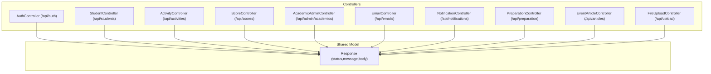
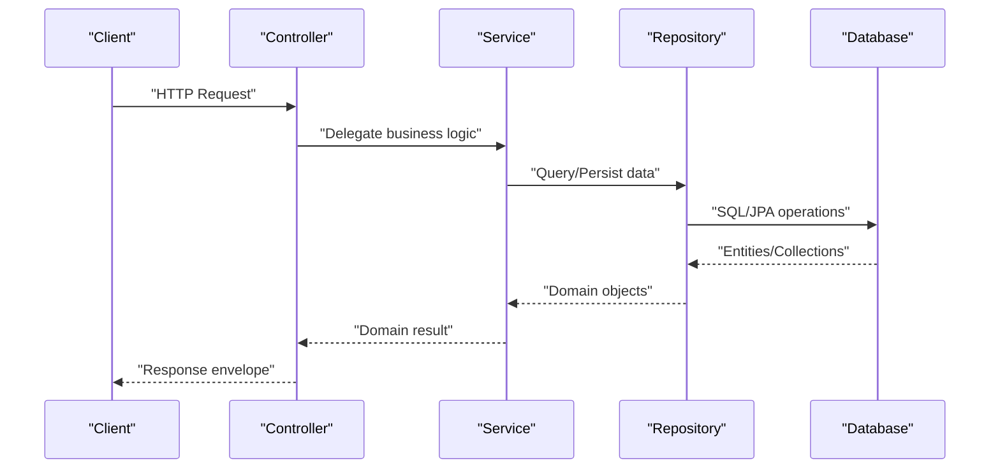
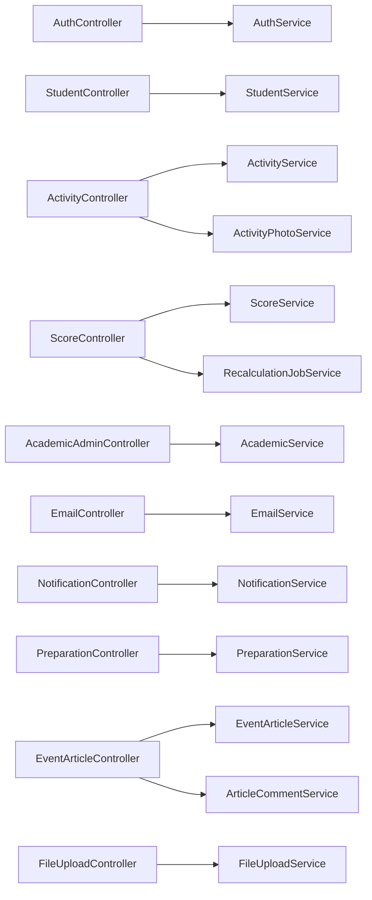

# API Documentation

<cite>
**Referenced Files in This Document**
- [AuthController.java](file://src/main/java/vn/campuslife/controller/auth/AuthController.java)
- [StudentController.java](file://src/main/java/vn/campuslife/controller/student/StudentController.java)
- [ActivityController.java](file://src/main/java/vn/campuslife/controller/activity/ActivityController.java)
- [ScoreController.java](file://src/main/java/vn/campuslife/controller/score/ScoreController.java)
- [AcademicAdminController.java](file://src/main/java/vn/campuslife/controller/academic/AcademicAdminController.java)
- [EmailController.java](file://src/main/java/vn/campuslife/controller/communication/EmailController.java)
- [NotificationController.java](file://src/main/java/vn/campuslife/controller/communication/NotificationController.java)
- [PreparationController.java](file://src/main/java/vn/campuslife/controller/preparation/PreparationController.java)
- [EventArticleController.java](file://src/main/java/vn/campuslife/controller/article/EventArticleController.java)
- [FileUploadController.java](file://src/main/java/vn/campuslife/controller/internal/FileUploadController.java)
- [Response.java](file://src/main/java/vn/campuslife/model/Response.java)
- [LoginRequest.java](file://src/main/java/vn/campuslife/model/LoginRequest.java)
- [RegisterRequest.java](file://src/main/java/vn/campuslife/model/RegisterRequest.java)
- [StudentResponse.java](file://src/main/java/vn/campuslife/model/StudentResponse.java)
- [ActivityResponse.java](file://src/main/java/vn/campuslife/model/activity/ActivityResponse.java)
</cite>

## Table of Contents
1. [Introduction](#introduction)
2. [Project Structure](#project-structure)
3. [Core Components](#core-components)
4. [Architecture Overview](#architecture-overview)
5. [Detailed Component Analysis](#detailed-component-analysis)
6. [Dependency Analysis](#dependency-analysis)
7. [Performance Considerations](#performance-considerations)
8. [Troubleshooting Guide](#troubleshooting-guide)
9. [Conclusion](#conclusion)
10. [Appendices](#appendices)

## Introduction
This document provides comprehensive API documentation for the CampusLife system REST endpoints. It covers authentication, user management, academic administration, activity management, scoring system, financial administration, and communication features. For each endpoint, you will find HTTP methods, URL patterns, request/response schemas, authentication requirements, error handling, parameter descriptions, validation rules, and response formats. Practical examples, common use cases, integration guidelines, API versioning, rate limiting, and best practices are also included.

## Project Structure
The backend is organized by feature domains under the controller package. Each domain exposes a dedicated base path under /api. Controllers delegate to services and return unified Response envelopes.

**Diagram sources**
- [AuthController.java:14-98](file://src/main/java/vn/campuslife/controller/auth/AuthController.java#L14-L98)
- [StudentController.java:13-124](file://src/main/java/vn/campuslife/controller/student/StudentController.java#L13-L124)
- [ActivityController.java:20-271](file://src/main/java/vn/campuslife/controller/activity/ActivityController.java#L20-L271)
- [ScoreController.java:15-234](file://src/main/java/vn/campuslife/controller/score/ScoreController.java#L15-L234)
- [AcademicAdminController.java:10-92](file://src/main/java/vn/campuslife/controller/academic/AcademicAdminController.java#L10-L92)
- [EmailController.java:28-241](file://src/main/java/vn/campuslife/controller/communication/EmailController.java#L28-L241)
- [NotificationController.java:15-203](file://src/main/java/vn/campuslife/controller/communication/NotificationController.java#L15-L203)
- [PreparationController.java:19-215](file://src/main/java/vn/campuslife/controller/preparation/PreparationController.java#L19-L215)
- [EventArticleController.java:24-265](file://src/main/java/vn/campuslife/controller/article/EventArticleController.java#L24-L265)
- [FileUploadController.java:11-85](file://src/main/java/vn/campuslife/controller/internal/FileUploadController.java#L11-L85)
- [Response.java:7-25](file://src/main/java/vn/campuslife/model/Response.java#L7-L25)

**Section sources**
- [AuthController.java:14-98](file://src/main/java/vn/campuslife/controller/auth/AuthController.java#L14-L98)
- [StudentController.java:13-124](file://src/main/java/vn/campuslife/controller/student/StudentController.java#L13-L124)
- [ActivityController.java:20-271](file://src/main/java/vn/campuslife/controller/activity/ActivityController.java#L20-L271)
- [ScoreController.java:15-234](file://src/main/java/vn/campuslife/controller/score/ScoreController.java#L15-L234)
- [AcademicAdminController.java:10-92](file://src/main/java/vn/campuslife/controller/academic/AcademicAdminController.java#L10-L92)
- [EmailController.java:28-241](file://src/main/java/vn/campuslife/controller/communication/EmailController.java#L28-L241)
- [NotificationController.java:15-203](file://src/main/java/vn/campuslife/controller/communication/NotificationController.java#L15-L203)
- [PreparationController.java:19-215](file://src/main/java/vn/campuslife/controller/preparation/PreparationController.java#L19-L215)
- [EventArticleController.java:24-265](file://src/main/java/vn/campuslife/controller/article/EventArticleController.java#L24-L265)
- [FileUploadController.java:11-85](file://src/main/java/vn/campuslife/controller/internal/FileUploadController.java#L11-L85)
- [Response.java:7-25](file://src/main/java/vn/campuslife/model/Response.java#L7-L25)

## Core Components
- Unified Response envelope: All endpoints return a Response object containing status, message, and body. This simplifies client-side error handling and data extraction.
- Authentication: Many endpoints require an authenticated user via Spring Security’s Authentication object. Some endpoints explicitly check for roles or ownership.
- Pagination: Several endpoints support pagination via page and size query parameters.
- Validation: Controllers perform basic validation (e.g., multipart file checks, role checks). Additional validation is handled by services and DTOs.

Key shared models:
- Response: [Response.java:7-25](file://src/main/java/vn/campuslife/model/Response.java#L7-L25)
- LoginRequest: [LoginRequest.java:6-9](file://src/main/java/vn/campuslife/model/LoginRequest.java#L6-L9)
- RegisterRequest: [RegisterRequest.java:6-10](file://src/main/java/vn/campuslife/model/RegisterRequest.java#L6-L10)
- StudentResponse: [StudentResponse.java:16-67](file://src/main/java/vn/campuslife/model/StudentResponse.java#L16-L67)
- ActivityResponse: [ActivityResponse.java:12-52](file://src/main/java/vn/campuslife/model/activity/ActivityResponse.java#L12-L52)

**Section sources**
- [Response.java:7-25](file://src/main/java/vn/campuslife/model/Response.java#L7-L25)
- [LoginRequest.java:6-9](file://src/main/java/vn/campuslife/model/LoginRequest.java#L6-L9)
- [RegisterRequest.java:6-10](file://src/main/java/vn/campuslife/model/RegisterRequest.java#L6-L10)
- [StudentResponse.java:16-67](file://src/main/java/vn/campuslife/model/StudentResponse.java#L16-L67)
- [ActivityResponse.java:12-52](file://src/main/java/vn/campuslife/model/activity/ActivityResponse.java#L12-L52)

## Architecture Overview
The API follows a layered architecture:
- Controllers expose REST endpoints and handle HTTP concerns (paths, params, auth).
- Services encapsulate business logic and orchestrate repositories/entities.
- Models define request/response schemas and helpers.
- Repositories manage persistence.

[No sources needed since this diagram shows conceptual workflow, not actual code structure]

## Detailed Component Analysis

### Authentication API
Base path: /api/auth

Endpoints:
- POST /api/auth/register
  - Description: Registers a new user account.
  - Auth: None
  - Request body: RegisterRequest
    - Fields: username (string), email (string), password (string)
  - Responses:
    - 200 OK: Response with status=true on success
    - 400 Bad Request: Response with status=false on validation failure
    - 500 Internal Server Error: Generic server error
  - Example request:
    - POST /api/auth/register
    - Body: {"username":"alice","email":"alice@example.com","password":"SecurePass!"}
  - Example success response:
    - {"status":true,"message":"Registration successful","body":null}
  - Notes: Validation occurs in services; controller returns unified Response.

- POST /api/auth/login
  - Description: Logs in a user and returns a Response envelope.
  - Auth: None
  - Request body: LoginRequest
    - Fields: username (string), password (string)
  - Responses: 200 OK with Response envelope
  - Example request:
    - POST /api/auth/login
    - Body: {"username":"alice","password":"SecurePass!"}
  - Example response:
    - {"status":true,"message":"Login successful","body":{...}}

- GET /api/auth/verify?token={token}
  - Description: Verifies an account using a token.
  - Auth: None
  - Query: token (string, required)
  - Responses: 200 OK with Response envelope

- POST /api/auth/forgot-password
  - Description: Initiates password reset process.
  - Auth: None
  - Request body: ForgotPasswordRequest (schema defined in service)
  - Responses:
    - 200 OK or 400 Bad Request depending on outcome
    - Body: Response envelope

- POST /api/auth/reset-password
  - Description: Resets password using a reset token.
  - Auth: None
  - Request body: ResetPasswordRequest (schema defined in service)
  - Responses:
    - 200 OK or 400 Bad Request depending on outcome

- POST /api/auth/change-password
  - Description: Changes current user’s password.
  - Auth: Requires authenticated user
  - Request body: ChangePasswordRequest (service-defined schema)
  - Responses:
    - 200 OK or 400 Bad Request depending on outcome
    - 400 if not authenticated
    - 500 on server error

Common request/response schemas:
- RegisterRequest: [RegisterRequest.java:6-10](file://src/main/java/vn/campuslife/model/RegisterRequest.java#L6-L10)
- LoginRequest: [LoginRequest.java:6-9](file://src/main/java/vn/campuslife/model/LoginRequest.java#L6-L9)
- Response: [Response.java:7-25](file://src/main/java/vn/campuslife/model/Response.java#L7-L25)

**Section sources**
- [AuthController.java:24-94](file://src/main/java/vn/campuslife/controller/auth/AuthController.java#L24-L94)
- [RegisterRequest.java:6-10](file://src/main/java/vn/campuslife/model/RegisterRequest.java#L6-L10)
- [LoginRequest.java:6-9](file://src/main/java/vn/campuslife/model/LoginRequest.java#L6-L9)
- [Response.java:7-25](file://src/main/java/vn/campuslife/model/Response.java#L7-L25)

### User Management API
Base path: /api/students

Endpoints:
- GET /api/students
  - Description: Lists students with pagination and sorting.
  - Auth: Requires authenticated user
  - Query params:
    - page (integer, default 0)
    - size (integer, default 20)
    - sortBy (string, default id)
    - sortDir (string, default asc)
  - Responses: 200 OK with Response envelope

- GET /api/students/search
  - Description: Searches students by keyword.
  - Auth: Requires authenticated user
  - Query params:
    - keyword (string, required)
    - page (integer, default 0)
    - size (integer, default 20)
  - Responses: 200 OK with Response envelope

- GET /api/students/without-class
  - Description: Students without a class assignment.
  - Auth: Requires authenticated user
  - Query params:
    - page (integer, default 0)
    - size (integer, default 20)
  - Responses: 200 OK with Response envelope

- GET /api/students/department/{departmentId}
  - Description: Students filtered by department.
  - Auth: Requires authenticated user
  - Path: departmentId (long, required)
  - Query params:
    - page (integer, default 0)
    - size (integer, default 20)
  - Responses: 200 OK with Response envelope

- GET /api/students/{studentId}
  - Description: Retrieves a student by ID.
  - Auth: Requires authenticated user
  - Path: studentId (long, required)
  - Responses: 200 OK with Response envelope

- GET /api/students/username/{username}
  - Description: Retrieves a student by username.
  - Auth: Requires authenticated user
  - Path: username (string, required)
  - Responses: 200 OK with Response envelope

Response body example (StudentResponse):
- Fields: id, studentCode, fullName, email, phone, dob, avatarUrl, departmentName, className, address, createdAt, updatedAt
- Reference: [StudentResponse.java:16-67](file://src/main/java/vn/campuslife/model/StudentResponse.java#L16-L67)

**Section sources**
- [StudentController.java:23-121](file://src/main/java/vn/campuslife/controller/student/StudentController.java#L23-L121)
- [StudentResponse.java:16-67](file://src/main/java/vn/campuslife/model/StudentResponse.java#L16-L67)

### Academic Administration API
Base path: /api/admin/academics

Endpoints:
- GET /api/admin/academics/years
  - Description: Lists academic years.
  - Auth: Requires ADMIN or MANAGER role
  - Responses: 200 OK with Response envelope

- GET /api/admin/academics/years/{id}
  - Description: Retrieves a specific academic year.
  - Auth: Requires ADMIN or MANAGER role
  - Path: id (long, required)
  - Responses: 200 OK or 404 Not Found depending on existence

- POST /api/admin/academics/years
  - Description: Creates a new academic year.
  - Auth: Requires ADMIN or MANAGER role
  - Request body: AcademicYearRequest (service-defined)
  - Responses: 200 OK with Response envelope

- PUT /api/admin/academics/years/{id}
  - Description: Updates an academic year.
  - Auth: Requires ADMIN or MANAGER role
  - Path: id (long, required)
  - Request body: AcademicYearRequest (service-defined)
  - Responses: 200 OK or 404 Not Found depending on existence

- DELETE /api/admin/academics/years/{id}
  - Description: Deletes an academic year.
  - Auth: Requires ADMIN or MANAGER role
  - Path: id (long, required)
  - Responses: 200 OK or 404 Not Found depending on existence

- GET /api/admin/academics/years/{yearId}/semesters
  - Description: Lists semesters for a given year.
  - Auth: Requires ADMIN or MANAGER role
  - Path: yearId (long, required)
  - Responses: 200 OK with Response envelope

- GET /api/admin/academics/semesters/{id}
  - Description: Retrieves a specific semester.
  - Auth: Requires ADMIN or MANAGER role
  - Path: id (long, required)
  - Responses: 200 OK or 404 Not Found depending on existence

- POST /api/admin/academics/semesters
  - Description: Creates a new semester.
  - Auth: Requires ADMIN or MANAGER role
  - Request body: SemesterRequest (service-defined)
  - Responses: 200 OK with Response envelope

- PUT /api/admin/academics/semesters/{id}
  - Description: Updates a semester.
  - Auth: Requires ADMIN or MANAGER role
  - Path: id (long, required)
  - Request body: SemesterRequest (service-defined)
  - Responses: 200 OK or 404 Not Found depending on existence

- DELETE /api/admin/academics/semesters/{id}
  - Description: Deletes a semester.
  - Auth: Requires ADMIN or MANAGER role
  - Path: id (long, required)
  - Responses: 200 OK or 404 Not Found depending on existence

- POST /api/admin/academics/semesters/{id}/toggle
  - Description: Opens or closes a semester.
  - Auth: Requires ADMIN or MANAGER role
  - Path: id (long, required)
  - Query: open (boolean, required)
  - Responses: 200 OK or 404 Not Found depending on existence

- POST /api/admin/academics/semesters/{id}/initialize-scores
  - Description: Initializes scores for a semester.
  - Auth: Requires ADMIN or MANAGER role
  - Path: id (long, required)
  - Responses: 200 OK or 500 Internal Server Error depending on outcome

Notes:
- Role-based authorization is enforced via @PreAuthorize annotations in controllers.
- Request bodies are validated by services.

**Section sources**
- [AcademicAdminController.java:20-89](file://src/main/java/vn/campuslife/controller/academic/AcademicAdminController.java#L20-L89)

### Activity Management API
Base path: /api/activities

Endpoints:
- POST /api/activities
  - Description: Creates a new activity.
  - Auth: Requires ADMIN or MANAGER role
  - Request body: CreateActivityRequest (service-defined)
  - Responses:
    - 200 OK or 400 Bad Request depending on outcome

- GET /api/activities/presets
  - Description: Retrieves activity preset definitions.
  - Auth: None
  - Responses: 200 OK with Response envelope

- POST /api/activities/presets/preview
  - Description: Previews an activity preset configuration.
  - Auth: None
  - Request body: ActivityPresetPreviewRequest (service-defined)
  - Responses: 200 OK with Response envelope

- GET /api/activities
  - Description: Lists activities (supports filtering and visibility based on user).
  - Auth: Optional (authenticated user affects visibility)
  - Responses: 200 OK with Response envelope

- GET /api/activities/{id}
  - Description: Retrieves an activity by ID (visibility depends on user).
  - Auth: Optional
  - Path: id (long, required)
  - Responses:
    - 200 OK or 404 Not Found depending on existence

- PUT /api/activities/{id}
  - Description: Updates an activity.
  - Auth: Requires ADMIN or MANAGER role
  - Path: id (long, required)
  - Request body: CreateActivityRequest (service-defined)
  - Responses:
    - 200 OK or 400 Bad Request depending on outcome

- DELETE /api/activities/{id}
  - Description: Deletes an activity.
  - Auth: Requires ADMIN or MANAGER role
  - Path: id (long, required)
  - Responses:
    - 200 OK or 400 Bad Request depending on outcome

- PUT /api/activities/{id}/publish
  - Description: Publishes an activity.
  - Auth: Requires ADMIN or MANAGER role
  - Path: id (long, required)
  - Responses:
    - 200 OK or 400 Bad Request depending on outcome

- PUT /api/activities/{id}/unpublish
  - Description: Unpublishes an activity.
  - Auth: Requires ADMIN or MANAGER role
  - Path: id (long, required)
  - Responses:
    - 200 OK or 400 Bad Request depending on outcome

- POST /api/activities/{id}/copy
  - Description: Copies an activity (optionally offsetting dates).
  - Auth: Requires ADMIN or MANAGER role
  - Path: id (long, required)
  - Query: offsetDays (integer, optional)
  - Responses:
    - 200 OK or 400 Bad Request depending on outcome

- GET /api/activities/score-type/{scoreType}
  - Description: Filters activities by score type.
  - Auth: None
  - Path: scoreType (enum string)
  - Responses: 200 OK with array of ActivityResponse

- GET /api/activities/department/{deptId}
  - Description: Activities for a specific department.
  - Auth: None
  - Path: deptId (long, required)
  - Responses: 200 OK with array of ActivityResponse

- GET /api/activities/my
  - Description: Activities for the current user.
  - Auth: Requires authenticated user
  - Responses: 200 OK with array of ActivityResponse

- GET /api/activities/{activityId}/requires-submission
  - Description: Checks if an activity requires submission.
  - Auth: None
  - Path: activityId (long, required)
  - Responses: 200 OK with Response envelope

- GET /api/activities/{activityId}/registration-status
  - Description: Checks registration status for the current user.
  - Auth: Requires authenticated user
  - Path: activityId (long, required)
  - Responses: 200 OK with Response envelope

- GET /api/activities/upcoming
  - Description: Upcoming events with optional keyword search.
  - Auth: None
  - Query: keyword (string, optional)
  - Responses: 200 OK with array of ActivityResponse

- GET /api/activities/month
  - Description: Activities for a given month/year.
  - Auth: None
  - Query: year (integer, optional), month (integer, optional)
  - Responses: 200 OK with array of ActivityResponse

- GET /api/activities/photos/all
  - Description: Lists all activity photos.
  - Auth: None
  - Responses: 200 OK with Response envelope

- POST /api/activities/backfill-checkin-codes
  - Description: Backfills check-in codes for activities missing them.
  - Auth: Requires ADMIN or MANAGER role
  - Responses:
    - 200 OK or 500 Internal Server Error depending on outcome

Response body example (ActivityResponse):
- Fields include id, name, type, description, start/end dates, hasPreparation, requiresSubmission, scoreRules, registration dates, shareLink, flags (isImportant, isDraft), bannerUrl, location, ticketQuantity, benefits, requirements, contactInfo, checkInCode, requiresApproval, mandatoryForFacultyStudents, organizerIds, seriesId, seriesOrder, timestamps, createdBy, lastModifiedBy.
- Reference: [ActivityResponse.java:12-52](file://src/main/java/vn/campuslife/model/activity/ActivityResponse.java#L12-L52)

**Section sources**
- [ActivityController.java:32-268](file://src/main/java/vn/campuslife/controller/activity/ActivityController.java#L32-L268)
- [ActivityResponse.java:12-52](file://src/main/java/vn/campuslife/model/activity/ActivityResponse.java#L12-L52)

### Scoring System API
Base path: /api/scores

Endpoints:
- GET /api/scores/student/{studentId}/semester/{semesterId}
  - Description: View scores for a student in a semester.
  - Auth: Requires authenticated user
  - Path: studentId (long, required), semesterId (long, required)
  - Responses: 200 OK with Response envelope

- GET /api/scores/student/{studentId}/semester/{semesterId}/total
  - Description: Total score for a student in a semester.
  - Auth: Requires authenticated user
  - Path: studentId (long, required), semesterId (long, required)
  - Responses: 200 OK with Response envelope

- GET /api/scores/ranking
  - Description: Student ranking by semester and filters.
  - Auth: Requires authenticated user
  - Query:
    - semesterId (long, required)
    - scoreType (string, optional; enum-like)
    - departmentId (long, optional)
    - classId (long, optional)
    - sortOrder (string, default DESC)
  - Responses: 200 OK with Response envelope
  - Validation: scoreType must be a valid enum value; otherwise 400 Bad Request

- POST /api/scores/recalculate/student/{studentId}
  - Description: Recalculate scores for a single student.
  - Auth: Requires ADMIN or MANAGER role
  - Path: studentId (long, required)
  - Query: semesterId (long, optional)
  - Responses: 200 OK with Response envelope

- POST /api/scores/recalculate/all
  - Description: Recalculate scores for all students.
  - Auth: Requires ADMIN or MANAGER role
  - Query: semesterId (long, optional)
  - Responses: 200 OK with Response envelope

- GET /api/scores/history/student/{studentId}
  - Description: Score history for a student with optional filters.
  - Auth: Requires authenticated user
  - Path: studentId (long, required)
  - Query:
    - semesterId (long, required)
    - scoreType (string, optional)
    - page (integer, default 0)
    - size (integer, default 20)
    - startDate (string date-time, optional)
    - endDate (string date-time, optional)
    - keyword (string, optional)
  - Responses: 200 OK with Response envelope
  - Validation: scoreType must be a valid enum value; otherwise 400 Bad Request

- POST /api/scores/recalculate/async
  - Description: Start asynchronous recalculation for all students in a semester.
  - Auth: Requires ADMIN or MANAGER role
  - Query: semesterId (long, optional)
  - Responses: 200 OK with Response envelope

- GET /api/scores/recalculate/status/{jobId}
  - Description: Get status of an async recalculation job.
  - Auth: Requires ADMIN or MANAGER role
  - Path: jobId (long, required)
  - Responses: 200 OK with Response envelope

- POST /api/scores/recalculate/retry/{jobId}
  - Description: Retry a failed or timed-out async job.
  - Auth: Requires ADMIN or MANAGER role
  - Path: jobId (long, required)
  - Responses: 200 OK with Response envelope

Validation rules:
- scoreType must match enum values; invalid values return 400 Bad Request.

**Section sources**
- [ScoreController.java:26-232](file://src/main/java/vn/campuslife/controller/score/ScoreController.java#L26-L232)

### Communication Features API
Base path: /api/emails and /api/notifications

Email API (/api/emails):
- GET /api/emails/test-auth
  - Description: Tests authentication.
  - Auth: Requires authenticated user
  - Responses: 200 OK with Response envelope

- POST /api/emails/send (multipart/form-data)
  - Description: Sends an email with optional attachments.
  - Auth: Requires authenticated user
  - Request parts:
    - request (SendEmailRequest, required)
    - attachments (MultipartFile[], optional)
  - Responses:
    - 200 OK or 400 Bad Request depending on outcome
    - 500 Internal Server Error on failure

- POST /api/emails/send-json (application/json)
  - Description: Alternative endpoint for sending emails without attachments.
  - Auth: Requires authenticated user
  - Request body: SendEmailRequest
  - Responses:
    - 200 OK or 400 Bad Request depending on outcome

- POST /api/emails/notifications/send
  - Description: Creates a notification without sending email.
  - Auth: Requires authenticated user
  - Request body: SendNotificationOnlyRequest
  - Responses:
    - 200 OK or 400 Bad Request depending on outcome

- GET /api/emails/history
  - Description: Retrieves email send history for the authenticated user.
  - Auth: Requires authenticated user
  - Query:
    - page (integer, default 0)
    - size (integer, default 20)
  - Responses: 200 OK with Response envelope

- GET /api/emails/history/{emailId}
  - Description: Retrieves details of a sent email.
  - Auth: Requires authenticated user
  - Path: emailId (long, required)
  - Responses:
    - 200 OK or 400 Bad Request depending on outcome

- POST /api/emails/history/{emailId}/resend
  - Description: Resends a previously sent email.
  - Auth: Requires authenticated user
  - Path: emailId (long, required)
  - Responses:
    - 200 OK or 400 Bad Request depending on outcome

- GET /api/emails/attachments/{attachmentId}/download
  - Description: Downloads an attached file.
  - Auth: Requires authenticated user
  - Path: attachmentId (long, required)
  - Responses:
    - 200 OK with file stream or 404 Not Found
    - 500 Internal Server Error on failure

Notification API (/api/notifications):
- GET /api/notifications
  - Description: Retrieves notifications for the authenticated user.
  - Auth: Requires authenticated user
  - Responses: 200 OK with Response envelope

- GET /api/notifications/unread
  - Description: Retrieves unread notifications for the authenticated user.
  - Auth: Requires authenticated user
  - Responses: 200 OK with Response envelope

- PUT /api/notifications/{notificationId}/read
  - Description: Marks a notification as read.
  - Auth: Requires authenticated user
  - Path: notificationId (long, required)
  - Responses: 200 OK with Response envelope

- PUT /api/notifications/read-all
  - Description: Marks all notifications as read.
  - Auth: Requires authenticated user
  - Responses: 200 OK with Response envelope

- GET /api/notifications/unread-count
  - Description: Counts unread notifications.
  - Auth: Requires authenticated user
  - Responses: 200 OK with Response envelope

- DELETE /api/notifications/{notificationId}
  - Description: Deletes a notification.
  - Auth: Requires authenticated user
  - Path: notificationId (long, required)
  - Responses: 200 OK with Response envelope

- PUT /api/notifications/{notificationId}/archive
  - Description: Archives a notification.
  - Auth: Requires authenticated user
  - Path: notificationId (long, required)
  - Responses: 200 OK with Response envelope

- GET /api/notifications/{notificationId}
  - Description: Retrieves notification details.
  - Auth: Requires authenticated user
  - Path: notificationId (long, required)
  - Responses: 200 OK with Response envelope

**Section sources**
- [EmailController.java:42-241](file://src/main/java/vn/campuslife/controller/communication/EmailController.java#L42-L241)
- [NotificationController.java:26-201](file://src/main/java/vn/campuslife/controller/communication/NotificationController.java#L26-L201)

### Financial Administration API
Base path: /api/preparation

Endpoints:
- PUT /api/preparation/activities/{activityId}/toggle
  - Description: Enables/disables preparation mode for an activity.
  - Auth: Requires ADMIN or MANAGER role or activity prep supervisor
  - Path: activityId (long, required)
  - Query: enabled (boolean, required)
  - Responses: 200 OK with Response envelope

- GET /api/preparation/activities/{activityId}/dashboard
  - Description: Retrieves preparation dashboard for an activity.
  - Auth: Requires ADMIN or MANAGER role or activity prep supervisor or organizer
  - Path: activityId (long, required)
  - Responses: 200 OK with Response envelope

- GET /api/preparation/my/activity-ids
  - Description: Lists activity IDs the current student participates in preparation.
  - Auth: Requires STUDENT role
  - Responses: 200 OK with Response envelope

- GET /api/preparation/activities/{activityId}/organizers
  - Description: Lists organizers for an activity.
  - Auth: Requires ADMIN or MANAGER role or activity prep supervisor or organizer
  - Path: activityId (long, required)
  - Responses: 200 OK with Response envelope

- POST /api/preparation/activities/{activityId}/organizers/{studentId}
  - Description: Adds an organizer to an activity.
  - Auth: Requires ADMIN or MANAGER role or activity prep supervisor
  - Path: activityId (long, required), studentId (long, required)
  - Responses: 200 OK with Response envelope

- POST /api/preparation/activities/{activityId}/organizers
  - Description: Bulk adds organizers to an activity.
  - Auth: Requires ADMIN or MANAGER role or activity prep supervisor
  - Path: activityId (long, required)
  - Request body: BulkAddOrganizersRequest (service-defined)
  - Responses: 200 OK with Response envelope

- DELETE /api/preparation/activities/{activityId}/organizers/{studentId}
  - Description: Removes an organizer from an activity.
  - Auth: Requires ADMIN or MANAGER role or activity prep supervisor
  - Path: activityId (long, required), studentId (long, required)
  - Responses: 200 OK with Response envelope

- POST /api/preparation/activities/{activityId}/tasks
  - Description: Assigns a preparation task to an activity.
  - Auth: Requires ADMIN or MANAGER role or activity prep supervisor
  - Path: activityId (long, required)
  - Request body: CreatePreparationTaskRequest (service-defined)
  - Responses: 200 OK with Response envelope

- PUT /api/preparation/tasks/{taskId}/status
  - Description: Updates task status for the current user (assignee or supervisor).
  - Auth: Requires activity prep supervisor or task assignee
  - Path: taskId (long, required)
  - Request body: UpdatePreparationTaskStatusRequest (service-defined)
  - Responses: 200 OK with Response envelope

- GET /api/preparation/tasks/{taskId}/members
  - Description: Lists members of a task.
  - Auth: Requires ADMIN or MANAGER role or activity prep supervisor or task member
  - Path: taskId (long, required)
  - Responses: 200 OK with Response envelope

- DELETE /api/preparation/tasks/{taskId}/members/{studentId}
  - Description: Removes a member from a task.
  - Auth: Requires ADMIN or MANAGER role or activity prep supervisor or task assignee
  - Path: taskId (long, required), studentId (long, required)
  - Responses: 200 OK with Response envelope

- POST /api/preparation/tasks/{taskId}/leaders/{studentId}
  - Description: Promotes a leader for a task.
  - Auth: Requires ADMIN or MANAGER role or activity prep supervisor or task assignee
  - Path: taskId (long, required), studentId (long, required)
  - Responses: 200 OK with Response envelope

- DELETE /api/preparation/tasks/{taskId}/leaders/{studentId}
  - Description: Demotes a leader for a task.
  - Auth: Requires ADMIN or MANAGER role or activity prep supervisor or task assignee
  - Path: taskId (long, required), studentId (long, required)
  - Responses: 200 OK with Response envelope

- PUT /api/preparation/tasks/{taskId}/accept
  - Description: Accepts a task assignment.
  - Auth: Requires activity prep supervisor or task member
  - Path: taskId (long, required)
  - Responses: 200 OK with Response envelope

- PUT /api/preparation/tasks/{taskId}/request-complete
  - Description: Requests completion of a task with optional proof URLs.
  - Auth: Requires activity prep supervisor or task assignee
  - Path: taskId (long, required)
  - Request body: RequestCompleteTaskRequest (service-defined)
  - Responses: 200 OK with Response envelope

- PUT /api/preparation/tasks/{taskId}/complete-decision
  - Description: Approves or rejects a completion request.
  - Auth: Requires ADMIN or MANAGER role or activity prep supervisor
  - Path: taskId (long, required)
  - Request body: ApproveTaskCompletionRequest (service-defined)
  - Responses: 200 OK with Response envelope

- GET /api/preparation/activities/{activityId}/workload-warnings
  - Description: Retrieves workload warnings for an activity.
  - Auth: Requires ADMIN or MANAGER role or activity prep supervisor or organizer
  - Path: activityId (long, required)
  - Responses: 200 OK with Response envelope

- GET /api/preparation/stats/{id}
  - Description: Retrieves student statistics by ID.
  - Auth: None
  - Path: id (long, required)
  - Responses: 200 OK with TaskStatsRespone

- GET /api/preparation/detail/{id}
  - Description: Retrieves task detail by ID.
  - Auth: None
  - Path: id (long, required)
  - Responses: 200 OK with Response envelope

- GET /api/preparation/my/activities/tasks
  - Description: Retrieves tasks for the current student in a specific activity.
  - Auth: Requires STUDENT role
  - Query: activityId (long, required)
  - Responses: 200 OK with Response envelope

- POST /api/preparation/tasks/{taskId}/completion-proofs
  - Description: Uploads completion proof for a task.
  - Auth: Requires activity prep supervisor or task assignee
  - Path: taskId (long, required)
  - Query: file (MultipartFile, required)
  - Responses: 200 OK with Response envelope

- PUT /api/preparation/activities/{activityId}/organizers/{studentId}/prep-supervisor
  - Description: Grants prep supervisor role to an organizer.
  - Auth: Requires ADMIN or MANAGER role
  - Path: activityId (long, required), studentId (long, required)
  - Responses: 200 OK with Response envelope

- DELETE /api/preparation/activities/{activityId}/organizers/{studentId}/prep-supervisor
  - Description: Revokes prep supervisor role from an organizer.
  - Auth: Requires ADMIN or MANAGER role
  - Path: activityId (long, required), studentId (long, required)
  - Responses: 200 OK with Response envelope

Authorization patterns:
- @PreAuthorize annotations enforce role-based and context-aware permissions (e.g., activity prep supervisor, task assignee, organizer).

**Section sources**
- [PreparationController.java:28-212](file://src/main/java/vn/campuslife/controller/preparation/PreparationController.java#L28-L212)

### Communication Features API (Articles)
Base path: /api/articles

Endpoints:
- GET /api/articles
  - Description: Lists published articles with pagination.
  - Auth: None
  - Query:
    - page (integer, default 0)
    - size (integer, default 10)
  - Responses: 200 OK with Page<ArticleListResponse>

- GET /api/articles/featured
  - Description: Retrieves featured articles.
  - Auth: None
  - Responses: 200 OK with array of ArticleListResponse

- GET /api/articles/category/{categorySlug}
  - Description: Lists published articles by category.
  - Auth: None
  - Path: categorySlug (string, required)
  - Query:
    - page (integer, default 0)
    - size (integer, default 10)
  - Responses: 200 OK with Page<ArticleListResponse>

- GET /api/articles/search
  - Description: Searches published articles by keyword.
  - Auth: None
  - Query:
    - keyword (string, required)
    - page (integer, default 0)
    - size (integer, default 10)
  - Responses: 200 OK with Page<ArticleListResponse>

- GET /api/articles/series/{seriesId}
  - Description: Lists articles belonging to a series.
  - Auth: None
  - Path: seriesId (long, required)
  - Responses: 200 OK with array of ArticleListResponse

- GET /api/articles/{slug}
  - Description: Retrieves article detail by slug (student ID resolved from auth).
  - Auth: Optional
  - Path: slug (string, required)
  - Responses: 200 OK with ArticleDetailResponse

- GET /api/articles/{slug}/related
  - Description: Retrieves related articles.
  - Auth: None
  - Path: slug (string, required)
  - Query: limit (integer, default 3)
  - Responses: 200 OK with array of ArticleListResponse

- GET /api/articles/{slug}/calendar
  - Description: Downloads calendar file (.ics) for the article.
  - Auth: None
  - Path: slug (string, required)
  - Responses:
    - 200 OK with ICS file stream
    - Content-Type: text/calendar

- POST /api/articles/{slug}/track-view
  - Description: Tracks article view.
  - Auth: None
  - Path: slug (string, required)
  - Responses: 200 OK with Response envelope

- POST /api/articles/{slug}/waitlist
  - Description: Registers for waitlist.
  - Auth: Requires authenticated user
  - Path: slug (string, required)
  - Responses:
    - 201 Created or 400 Bad Request depending on outcome
    - 401 Unauthorized if not authenticated

- POST /api/articles/{slug}/wishlist
  - Description: Adds article to wishlist.
  - Auth: Requires authenticated user
  - Path: slug (string, required)
  - Responses:
    - 201 Created or 400 Bad Request depending on outcome
    - 401 Unauthorized if not authenticated

- DELETE /api/articles/{slug}/wishlist
  - Description: Removes article from wishlist.
  - Auth: Requires authenticated user
  - Path: slug (string, required)
  - Responses:
    - 200 OK or 400 Bad Request depending on outcome
    - 401 Unauthorized if not authenticated

- GET /api/articles/wishlist
  - Description: Retrieves authenticated user’s wishlist with pagination.
  - Auth: Requires authenticated user
  - Query:
    - page (integer, default 0)
    - size (integer, default 10)
  - Responses: 200 OK with Page<ArticleWishlistItemResponse>

- GET /api/articles/trending
  - Description: Retrieves trending articles.
  - Auth: None
  - Query:
    - days (integer, default 7)
    - limit (integer, default 5)
  - Responses: 200 OK with array of ArticleListResponse

- POST /api/articles/{slug}/comments
  - Description: Adds a comment to an article.
  - Auth: Requires authenticated user
  - Path: slug (string, required)
  - Request body: ArticleCommentRequest
  - Responses:
    - 201 Created with ArticleCommentResponse or 401 Unauthorized if not authenticated

- GET /api/articles/{slug}/comments
  - Description: Retrieves comments for an article with pagination.
  - Auth: None
  - Path: slug (string, required)
  - Query:
    - page (integer, default 0)
    - size (integer, default 10)
  - Responses: 200 OK with Page<ArticleCommentResponse>

- DELETE /api/articles/comments/{commentId}
  - Description: Deletes a comment.
  - Auth: Requires authenticated user
  - Path: commentId (long, required)
  - Responses:
    - 204 No Content or 401 Unauthorized if not authenticated

- POST /api/articles/{slug}/reaction
  - Description: Adds a reaction to an article.
  - Auth: Requires authenticated user
  - Path: slug (string, required)
  - Query: type (ReactionType enum, required)
  - Responses: 200 OK with Response envelope

- DELETE /api/articles/{slug}/reaction
  - Description: Removes a reaction from an article.
  - Auth: Requires authenticated user
  - Path: slug (string, required)
  - Responses: 200 OK with Response envelope

- GET /api/articles/{slug}/reactions
  - Description: Retrieves reaction counts for an article.
  - Auth: None
  - Path: slug (string, required)
  - Responses: 200 OK with Map<String,Long>

- POST /api/articles/{slug}/track-share
  - Description: Tracks article share.
  - Auth: None
  - Path: slug (string, required)
  - Responses: 200 OK with Response envelope

- GET /api/articles/history
  - Description: Retrieves reading history for the authenticated user with pagination.
  - Auth: Requires authenticated user
  - Query:
    - page (integer, default 0)
    - size (integer, default 10)
  - Responses: 200 OK with Page<ArticleHistoryResponse>

- DELETE /api/articles/history/{historyId}
  - Description: Deletes a reading history item.
  - Auth: Requires authenticated user
  - Path: historyId (long, required)
  - Responses: 204 No Content

- DELETE /api/articles/history
  - Description: Clears all reading history for the authenticated user.
  - Auth: Requires authenticated user
  - Responses: 204 No Content

**Section sources**
- [EventArticleController.java:33-262](file://src/main/java/vn/campuslife/controller/article/EventArticleController.java#L33-L262)

### File Upload API
Base path: /api/upload

Endpoints:
- POST /api/upload/image
  - Description: Uploads an image file.
  - Auth: None
  - Query: file (MultipartFile, required)
  - Validation:
    - Non-empty file
    - Size <= 5MB
    - Content type starts with "image/"
  - Responses:
    - 200 OK with success map containing status, message, data (fileUrl)
    - 400 Bad Request on validation errors
    - 500 Internal Server Error on failure

- DELETE /api/upload/image
  - Description: Deletes an image by URL.
  - Auth: None
  - Query: fileUrl (string, required)
  - Responses:
    - 200 OK with success map
    - 500 Internal Server Error on failure

**Section sources**
- [FileUploadController.java:21-82](file://src/main/java/vn/campuslife/controller/internal/FileUploadController.java#L21-L82)

## Dependency Analysis
- Controllers depend on services for business logic and repositories for persistence.
- Services depend on repositories and sometimes on external integrations (e.g., email, storage).
- Models are shared across controllers/services to maintain consistent schemas.

**Diagram sources**
- [AuthController.java:18-22](file://src/main/java/vn/campuslife/controller/auth/AuthController.java#L18-L22)
- [StudentController.java:18](file://src/main/java/vn/campuslife/controller/student/StudentController.java#L18)
- [ActivityController.java:26-31](file://src/main/java/vn/campuslife/controller/activity/ActivityController.java#L26-L31)
- [ScoreController.java:20-22](file://src/main/java/vn/campuslife/controller/score/ScoreController.java#L20-L22)
- [AcademicAdminController.java:14](file://src/main/java/vn/campuslife/controller/academic/AcademicAdminController.java#L14)
- [EmailController.java:35-37](file://src/main/java/vn/campuslife/controller/communication/EmailController.java#L35-L37)
- [NotificationController.java:20-21](file://src/main/java/vn/campuslife/controller/communication/NotificationController.java#L20-L21)
- [PreparationController.java:24-26](file://src/main/java/vn/campuslife/controller/preparation/PreparationController.java#L24-L26)
- [EventArticleController.java:29-31](file://src/main/java/vn/campuslife/controller/article/EventArticleController.java#L29-L31)
- [FileUploadController.java:17](file://src/main/java/vn/campuslife/controller/internal/FileUploadController.java#L17)

**Section sources**
- [AuthController.java:18-22](file://src/main/java/vn/campuslife/controller/auth/AuthController.java#L18-L22)
- [StudentController.java:18](file://src/main/java/vn/campuslife/controller/student/StudentController.java#L18)
- [ActivityController.java:26-31](file://src/main/java/vn/campuslife/controller/activity/ActivityController.java#L26-L31)
- [ScoreController.java:20-22](file://src/main/java/vn/campuslife/controller/score/ScoreController.java#L20-L22)
- [AcademicAdminController.java:14](file://src/main/java/vn/campuslife/controller/academic/AcademicAdminController.java#L14)
- [EmailController.java:35-37](file://src/main/java/vn/campuslife/controller/communication/EmailController.java#L35-L37)
- [NotificationController.java:20-21](file://src/main/java/vn/campuslife/controller/communication/NotificationController.java#L20-L21)
- [PreparationController.java:24-26](file://src/main/java/vn/campuslife/controller/preparation/PreparationController.java#L24-L26)
- [EventArticleController.java:29-31](file://src/main/java/vn/campuslife/controller/article/EventArticleController.java#L29-L31)
- [FileUploadController.java:17](file://src/main/java/vn/campuslife/controller/internal/FileUploadController.java#L17)

## Performance Considerations
- Pagination: Prefer using page and size parameters on endpoints that support them to avoid large payloads.
- Filtering: Use query parameters (e.g., scoreType, departmentId, classId) to reduce dataset sizes.
- Asynchronous operations: Use async score recalculation endpoints for heavy computations to prevent blocking.
- Image uploads: Respect file size limits and content type constraints to avoid unnecessary processing overhead.

[No sources needed since this section provides general guidance]

## Troubleshooting Guide
Common issues and resolutions:
- Authentication failures:
  - Symptom: 401 Unauthorized or 403 Forbidden on protected endpoints.
  - Resolution: Ensure a valid session/token is provided and the user has the required roles.
- Validation errors:
  - Symptom: 400 Bad Request with Response envelope indicating failure.
  - Resolution: Verify request schemas and constraints (e.g., file types, sizes, enums).
- Resource not found:
  - Symptom: 404 Not Found on GET endpoints.
  - Resolution: Confirm IDs and slugs exist and are accessible to the current user.
- Server errors:
  - Symptom: 500 Internal Server Error.
  - Resolution: Check server logs and retry after verifying request correctness.

**Section sources**
- [AuthController.java:76-93](file://src/main/java/vn/campuslife/controller/auth/AuthController.java#L76-L93)
- [ActivityController.java:88-92](file://src/main/java/vn/campuslife/controller/activity/ActivityController.java#L88-L92)
- [EmailController.java:79-83](file://src/main/java/vn/campuslife/controller/communication/EmailController.java#L79-L83)
- [NotificationController.java:37-40](file://src/main/java/vn/campuslife/controller/communication/NotificationController.java#L37-L40)
- [PreparationController.java:30](file://src/main/java/vn/campuslife/controller/preparation/PreparationController.java#L30)
- [EventArticleController.java:109-114](file://src/main/java/vn/campuslife/controller/article/EventArticleController.java#L109-L114)
- [FileUploadController.java:25-47](file://src/main/java/vn/campuslife/controller/internal/FileUploadController.java#L25-L47)

## Conclusion
This documentation outlines the complete REST API surface of the CampusLife system across authentication, user management, academic administration, activity management, scoring, financial administration, and communication features. All endpoints return a consistent Response envelope, and many require authenticated users or specific roles. Use the provided schemas, examples, and best practices to integrate effectively and build reliable clients.

[No sources needed since this section summarizes without analyzing specific files]

## Appendices

### API Versioning
- Current base path: /api
- No explicit version suffix is used in the documented endpoints. Clients should pin to a specific commit or tag to ensure stability.

[No sources needed since this section provides general guidance]

### Rate Limiting
- No explicit rate limiting is enforced in the documented controllers. Implement client-side throttling and consider server-side rate limiting at the gateway/proxy level if needed.

[No sources needed since this section provides general guidance]

### Best Practices for Client Implementation
- Always handle the Response envelope (status, message, body) consistently.
- Use pagination parameters to manage large datasets.
- Validate inputs according to controller constraints (e.g., file types and sizes).
- Implement retry logic for transient failures and exponential backoff.
- Cache read-only data (e.g., activity presets, categories) to improve performance.

[No sources needed since this section provides general guidance]