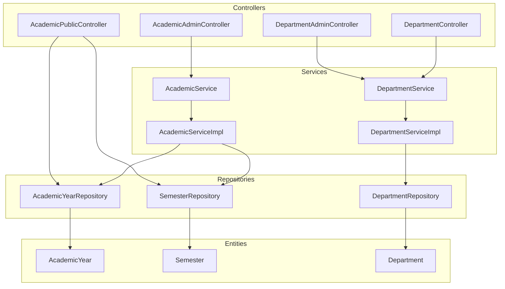
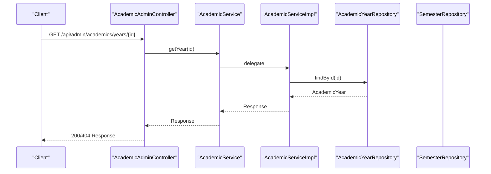
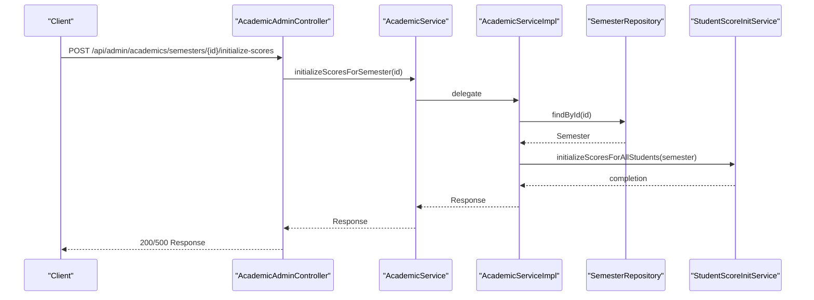
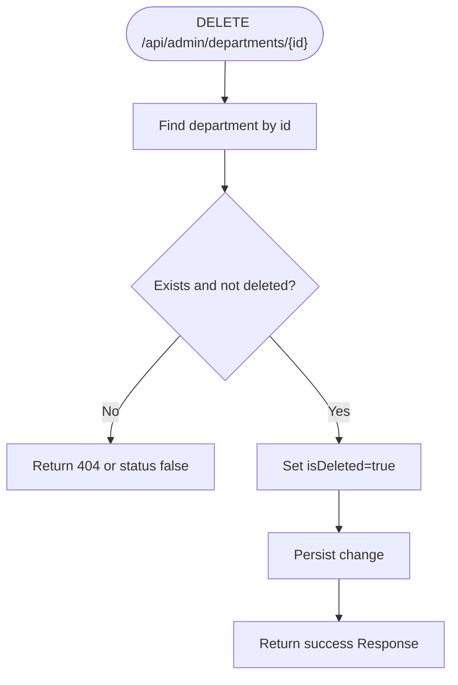
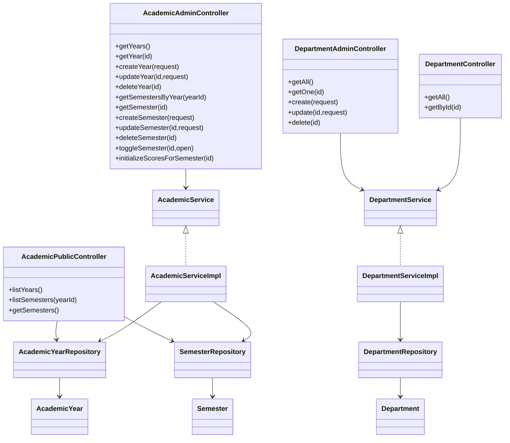

# Academic Management API

<cite>
**Referenced Files in This Document**
- [AcademicAdminController.java](file://src/main/java/vn/campuslife/controller/academic/AcademicAdminController.java)
- [AcademicPublicController.java](file://src/main/java/vn/campuslife/controller/academic/AcademicPublicController.java)
- [DepartmentAdminController.java](file://src/main/java/vn/campuslife/controller/academic/DepartmentAdminController.java)
- [DepartmentController.java](file://src/main/java/vn/campuslife/controller/academic/DepartmentController.java)
- [AcademicService.java](file://src/main/java/vn/campuslife/service/AcademicService.java)
- [DepartmentService.java](file://src/main/java/vn/campuslife/service/DepartmentService.java)
- [AcademicServiceImpl.java](file://src/main/java/vn/campuslife/service/impl/AcademicServiceImpl.java)
- [DepartmentServiceImpl.java](file://src/main/java/vn/campuslife/service/impl/DepartmentServiceImpl.java)
- [AcademicYearRequest.java](file://src/main/java/vn/campuslife/model/AcademicYearRequest.java)
- [SemesterRequest.java](file://src/main/java/vn/campuslife/model/SemesterRequest.java)
- [DepartmentRequest.java](file://src/main/java/vn/campuslife/model/DepartmentRequest.java)
- [AcademicYear.java](file://src/main/java/vn/campuslife/entity/AcademicYear.java)
- [Semester.java](file://src/main/java/vn/campuslife/entity/Semester.java)
- [Department.java](file://src/main/java/vn/campuslife/entity/Department.java)
- [DepartmentType.java](file://src/main/java/vn/campuslife/enumeration/DepartmentType.java)
- [AcademicYearRepository.java](file://src/main/java/vn/campuslife/repository/AcademicYearRepository.java)
- [SemesterRepository.java](file://src/main/java/vn/campuslife/repository/SemesterRepository.java)
- [DepartmentRepository.java](file://src/main/java/vn/campuslife/repository/DepartmentRepository.java)
</cite>

## Table of Contents
1. [Introduction](#introduction)
2. [Project Structure](#project-structure)
3. [Core Components](#core-components)
4. [Architecture Overview](#architecture-overview)
5. [Detailed Component Analysis](#detailed-component-analysis)
6. [Dependency Analysis](#dependency-analysis)
7. [Performance Considerations](#performance-considerations)
8. [Troubleshooting Guide](#troubleshooting-guide)
9. [Conclusion](#conclusion)

## Introduction
This document provides comprehensive API documentation for the Academic Management module, covering department administration, academic year and semester management, and public academic data access. It details HTTP endpoints, request/response formats, validation rules, and integration points with student enrollment systems. Administrative functions include CRUD operations for departments and academic calendars, along with operational controls such as opening/closing semesters and initializing student scores.

## Project Structure
The Academic Management API is organized into controller layers (admin and public), service interfaces and implementations, domain entities, repositories, and request/response models. Controllers expose REST endpoints under `/api/admin/academics`, `/api/academic`, `/api/admin/departments`, and `/api/departments`. Services encapsulate business logic, while repositories handle persistence. Entities define the academic calendar and department structures.

**Diagram sources**
- [AcademicAdminController.java:10-92](file://src/main/java/vn/campuslife/controller/academic/AcademicAdminController.java#L10-L92)
- [AcademicPublicController.java:10-37](file://src/main/java/vn/campuslife/controller/academic/AcademicPublicController.java#L10-L37)
- [DepartmentAdminController.java:9-54](file://src/main/java/vn/campuslife/controller/academic/DepartmentAdminController.java#L9-L54)
- [DepartmentController.java:16-41](file://src/main/java/vn/campuslife/controller/academic/DepartmentController.java#L16-L41)
- [AcademicService.java:7-36](file://src/main/java/vn/campuslife/service/AcademicService.java#L7-L36)
- [AcademicServiceImpl.java:23-36](file://src/main/java/vn/campuslife/service/impl/AcademicServiceImpl.java#L23-L36)
- [DepartmentService.java:10-22](file://src/main/java/vn/campuslife/service/DepartmentService.java#L10-L22)
- [DepartmentServiceImpl.java:18-21](file://src/main/java/vn/campuslife/service/impl/DepartmentServiceImpl.java#L18-L21)
- [AcademicYearRepository.java:7-9](file://src/main/java/vn/campuslife/repository/AcademicYearRepository.java#L7-L9)
- [SemesterRepository.java:13-42](file://src/main/java/vn/campuslife/repository/SemesterRepository.java#L13-L42)
- [DepartmentRepository.java:11-16](file://src/main/java/vn/campuslife/repository/DepartmentRepository.java#L11-L16)
- [AcademicYear.java:14-37](file://src/main/java/vn/campuslife/entity/AcademicYear.java#L14-L37)
- [Semester.java:14-44](file://src/main/java/vn/campuslife/entity/Semester.java#L14-L44)
- [Department.java:13-40](file://src/main/java/vn/campuslife/entity/Department.java#L13-L40)

**Section sources**
- [AcademicAdminController.java:10-92](file://src/main/java/vn/campuslife/controller/academic/AcademicAdminController.java#L10-L92)
- [AcademicPublicController.java:10-37](file://src/main/java/vn/campuslife/controller/academic/AcademicPublicController.java#L10-L37)
- [DepartmentAdminController.java:9-54](file://src/main/java/vn/campuslife/controller/academic/DepartmentAdminController.java#L9-L54)
- [DepartmentController.java:16-41](file://src/main/java/vn/campuslife/controller/academic/DepartmentController.java#L16-L41)

## Core Components
- Academic Administration Controller: Exposes endpoints for managing academic years and semesters, including CRUD operations, toggling semester open/close, and manual score initialization.
- Academic Public Controller: Provides read-only access to academic years and semesters for public consumption.
- Department Administration Controller: Manages departments with CRUD operations and soft deletion.
- Department Public Controller: Retrieves department lists and individual departments.
- Service Layer: Implements business logic for academic calendar management and department operations.
- Data Access Layer: Repositories for AcademicYear, Semester, and Department entities.
- Domain Models: Request DTOs and JPA entities representing academic calendar and department data.

**Section sources**
- [AcademicService.java:7-36](file://src/main/java/vn/campuslife/service/AcademicService.java#L7-L36)
- [DepartmentService.java:10-22](file://src/main/java/vn/campuslife/service/DepartmentService.java#L10-L22)
- [AcademicServiceImpl.java:23-36](file://src/main/java/vn/campuslife/service/impl/AcademicServiceImpl.java#L23-L36)
- [DepartmentServiceImpl.java:18-21](file://src/main/java/vn/campuslife/service/impl/DepartmentServiceImpl.java#L18-L21)

## Architecture Overview
The API follows a layered architecture:
- Presentation Layer: Controllers handle HTTP requests and responses.
- Application Layer: Services orchestrate business operations.
- Persistence Layer: Repositories manage entity storage and queries.
- Domain Layer: Entities represent academic calendar and department structures.

**Diagram sources**
- [AcademicAdminController.java:26-30](file://src/main/java/vn/campuslife/controller/academic/AcademicAdminController.java#L26-L30)
- [AcademicService.java:11-11](file://src/main/java/vn/campuslife/service/AcademicService.java#L11-L11)
- [AcademicServiceImpl.java:44-49](file://src/main/java/vn/campuslife/service/impl/AcademicServiceImpl.java#L44-L49)
- [AcademicYearRepository.java:7-9](file://src/main/java/vn/campuslife/repository/AcademicYearRepository.java#L7-L9)

## Detailed Component Analysis

### Academic Year and Semester Management

#### Endpoints
- Academic Administration Endpoints
  - GET /api/admin/academics/years
  - GET /api/admin/academics/years/{id}
  - POST /api/admin/academics/years
  - PUT /api/admin/academics/years/{id}
  - DELETE /api/admin/academics/years/{id}
  - GET /api/admin/academics/years/{yearId}/semesters
  - GET /api/admin/academics/semesters/{id}
  - POST /api/admin/academics/semesters
  - PUT /api/admin/academics/semesters/{id}
  - DELETE /api/admin/academics/semesters/{id}
  - POST /api/admin/academics/semesters/{id}/toggle?open={boolean}
  - POST /api/admin/academics/semesters/{id}/initialize-scores

- Academic Public Endpoints
  - GET /api/academic/years
  - GET /api/academic/years/{yearId}/semesters
  - GET /api/academic/semesters

#### Request Validation and Data Models
- AcademicYearRequest
  - Fields: name (string), startDate (date), endDate (date)
  - Validation: Business logic ensures year overlaps are handled via service layer; repository does not enforce overlap constraints.
- SemesterRequest
  - Fields: yearId (number), name (string), startDate (date), endDate (date), open (optional boolean)
  - Validation: Service validates year existence; optional open flag sets semester open state.

#### Response Format
- All endpoints return a generic Response envelope with fields: status (boolean), message (string), data (object or array).
- Success responses carry HTTP 200; not-found scenarios return HTTP 404 for admin endpoints; public endpoints return status false with message "Year not found" when applicable.

#### Processing Logic
- AcademicServiceImpl handles:
  - CRUD for AcademicYear and Semester
  - Semester open/close toggle
  - Automatic score initialization on semester creation when open=true
  - Manual score initialization trigger per semester
- SemesterRepository provides date-based lookup with preference for isOpen=true.

**Diagram sources**
- [AcademicAdminController.java:85-89](file://src/main/java/vn/campuslife/controller/academic/AcademicAdminController.java#L85-L89)
- [AcademicService.java:32-35](file://src/main/java/vn/campuslife/service/AcademicService.java#L32-L35)
- [AcademicServiceImpl.java:168-192](file://src/main/java/vn/campuslife/service/impl/AcademicServiceImpl.java#L168-L192)
- [SemesterRepository.java:13-42](file://src/main/java/vn/campuslife/repository/SemesterRepository.java#L13-L42)

**Section sources**
- [AcademicAdminController.java:20-90](file://src/main/java/vn/campuslife/controller/academic/AcademicAdminController.java#L20-L90)
- [AcademicPublicController.java:18-35](file://src/main/java/vn/campuslife/controller/academic/AcademicPublicController.java#L18-L35)
- [AcademicService.java:7-36](file://src/main/java/vn/campuslife/service/AcademicService.java#L7-L36)
- [AcademicServiceImpl.java:38-192](file://src/main/java/vn/campuslife/service/impl/AcademicServiceImpl.java#L38-L192)
- [AcademicYearRequest.java:7-11](file://src/main/java/vn/campuslife/model/AcademicYearRequest.java#L7-L11)
- [SemesterRequest.java:7-13](file://src/main/java/vn/campuslife/model/SemesterRequest.java#L7-L13)
- [AcademicYear.java:20-37](file://src/main/java/vn/campuslife/entity/AcademicYear.java#L20-L37)
- [Semester.java:20-44](file://src/main/java/vn/campuslife/entity/Semester.java#L20-L44)
- [AcademicYearRepository.java:7-9](file://src/main/java/vn/campuslife/repository/AcademicYearRepository.java#L7-L9)
- [SemesterRepository.java:13-42](file://src/main/java/vn/campuslife/repository/SemesterRepository.java#L13-L42)

### Department Management

#### Endpoints
- Admin Department Endpoints
  - GET /api/admin/departments
  - GET /api/admin/departments/{id}
  - POST /api/admin/departments
  - PUT /api/admin/departments/{id}
  - DELETE /api/admin/departments/{id}
- Public Department Endpoints
  - GET /api/departments
  - GET /api/departments/{id}

#### Request Validation and Data Model
- DepartmentRequest
  - Fields: name (string), type (enum: PHONG_BAN, KHOA), description (string)
- DepartmentType enum defines supported department types.

#### Soft Delete Behavior
- DELETE /api/admin/departments/{id} marks department as deleted (isDeleted=true) instead of physical removal.
- Public endpoints exclude soft-deleted departments from queries.

**Diagram sources**
- [DepartmentAdminController.java:45-51](file://src/main/java/vn/campuslife/controller/academic/DepartmentAdminController.java#L45-L51)
- [DepartmentServiceImpl.java:84-95](file://src/main/java/vn/campuslife/service/impl/DepartmentServiceImpl.java#L84-L95)
- [Department.java:39-40](file://src/main/java/vn/campuslife/entity/Department.java#L39-L40)

**Section sources**
- [DepartmentAdminController.java:19-51](file://src/main/java/vn/campuslife/controller/academic/DepartmentAdminController.java#L19-L51)
- [DepartmentController.java:23-37](file://src/main/java/vn/campuslife/controller/academic/DepartmentController.java#L23-L37)
- [DepartmentService.java:10-22](file://src/main/java/vn/campuslife/service/DepartmentService.java#L10-L22)
- [DepartmentServiceImpl.java:22-95](file://src/main/java/vn/campuslife/service/impl/DepartmentServiceImpl.java#L22-L95)
- [DepartmentRequest.java:7-11](file://src/main/java/vn/campuslife/model/DepartmentRequest.java#L7-L11)
- [DepartmentType.java:3-6](file://src/main/java/vn/campuslife/enumeration/DepartmentType.java#L3-L6)
- [Department.java:13-40](file://src/main/java/vn/campuslife/entity/Department.java#L13-L40)
- [DepartmentRepository.java:11-16](file://src/main/java/vn/campuslife/repository/DepartmentRepository.java#L11-L16)

### Public Academic Data Access

#### Endpoints
- GET /api/academic/years
  - Returns all academic years.
- GET /api/academic/years/{yearId}/semesters
  - Returns semesters filtered by academic year; returns status false with message "Year not found" if year does not exist.
- GET /api/academic/semesters
  - Returns all semesters.

#### Data Retrieval Patterns
- Uses AcademicYearRepository and SemesterRepository for direct queries.
- Filtering by yearId performed server-side by filtering semesters whose year.id equals the requested yearId.

**Section sources**
- [AcademicPublicController.java:18-35](file://src/main/java/vn/campuslife/controller/academic/AcademicPublicController.java#L18-L35)
- [AcademicYearRepository.java:7-9](file://src/main/java/vn/campuslife/repository/AcademicYearRepository.java#L7-L9)
- [SemesterRepository.java:13-42](file://src/main/java/vn/campuslife/repository/SemesterRepository.java#L13-L42)

## Dependency Analysis

**Diagram sources**
- [AcademicAdminController.java:10-92](file://src/main/java/vn/campuslife/controller/academic/AcademicAdminController.java#L10-L92)
- [AcademicPublicController.java:10-37](file://src/main/java/vn/campuslife/controller/academic/AcademicPublicController.java#L10-L37)
- [DepartmentAdminController.java:9-54](file://src/main/java/vn/campuslife/controller/academic/DepartmentAdminController.java#L9-L54)
- [DepartmentController.java:16-41](file://src/main/java/vn/campuslife/controller/academic/DepartmentController.java#L16-L41)
- [AcademicService.java:7-36](file://src/main/java/vn/campuslife/service/AcademicService.java#L7-L36)
- [AcademicServiceImpl.java:23-36](file://src/main/java/vn/campuslife/service/impl/AcademicServiceImpl.java#L23-L36)
- [DepartmentService.java:10-22](file://src/main/java/vn/campuslife/service/DepartmentService.java#L10-L22)
- [DepartmentServiceImpl.java:18-21](file://src/main/java/vn/campuslife/service/impl/DepartmentServiceImpl.java#L18-L21)
- [AcademicYearRepository.java:7-9](file://src/main/java/vn/campuslife/repository/AcademicYearRepository.java#L7-L9)
- [SemesterRepository.java:13-42](file://src/main/java/vn/campuslife/repository/SemesterRepository.java#L13-L42)
- [DepartmentRepository.java:11-16](file://src/main/java/vn/campuslife/repository/DepartmentRepository.java#L11-L16)
- [AcademicYear.java:14-37](file://src/main/java/vn/campuslife/entity/AcademicYear.java#L14-L37)
- [Semester.java:14-44](file://src/main/java/vn/campuslife/entity/Semester.java#L14-L44)
- [Department.java:13-40](file://src/main/java/vn/campuslife/entity/Department.java#L13-L40)

**Section sources**
- [AcademicService.java:7-36](file://src/main/java/vn/campuslife/service/AcademicService.java#L7-L36)
- [DepartmentService.java:10-22](file://src/main/java/vn/campuslife/service/DepartmentService.java#L10-L22)
- [AcademicServiceImpl.java:23-36](file://src/main/java/vn/campuslife/service/impl/AcademicServiceImpl.java#L23-L36)
- [DepartmentServiceImpl.java:18-21](file://src/main/java/vn/campuslife/service/impl/DepartmentServiceImpl.java#L18-L21)

## Performance Considerations
- Semester lookup by date uses a JPQL query that filters by date range and prioritizes open semesters. Consider indexing startDate and endDate for improved performance.
- Public endpoints perform server-side filtering for semesters by yearId; ensure repository queries are efficient and avoid N+1 issues.
- Score initialization for semesters is triggered automatically when a semester is created with open=true and executed asynchronously; monitor logs for failures and retry mechanisms if needed.

## Troubleshooting Guide
- Not Found Scenarios
  - Admin endpoints return HTTP 404 when entities are missing; verify resource IDs and relationships (e.g., yearId for semesters).
  - Public endpoint returns status false with message "Year not found" when accessing semesters for a non-existent year.
- Score Initialization Failures
  - Manual initialization endpoint returns HTTP 500 on failure; check service logs for detailed error messages and retry after resolving underlying issues.
- Soft Delete Behavior
  - Deleted departments do not appear in public endpoints; confirm isDeleted flag is set appropriately.

**Section sources**
- [AcademicAdminController.java:28-47](file://src/main/java/vn/campuslife/controller/academic/AcademicAdminController.java#L28-L47)
- [AcademicPublicController.java:25-29](file://src/main/java/vn/campuslife/controller/academic/AcademicPublicController.java#L25-L29)
- [AcademicServiceImpl.java:170-192](file://src/main/java/vn/campuslife/service/impl/AcademicServiceImpl.java#L170-L192)
- [DepartmentServiceImpl.java:84-95](file://src/main/java/vn/campuslife/service/impl/DepartmentServiceImpl.java#L84-L95)

## Conclusion
The Academic Management API provides robust administrative and public access to academic calendar and department data. Administrative endpoints support full CRUD lifecycle management for academic years and semesters, including operational controls and score initialization. Department endpoints offer both public and administrative capabilities with soft deletion semantics. The service layer enforces validation and integrates with student enrollment systems for score initialization, ensuring reliable academic data management.