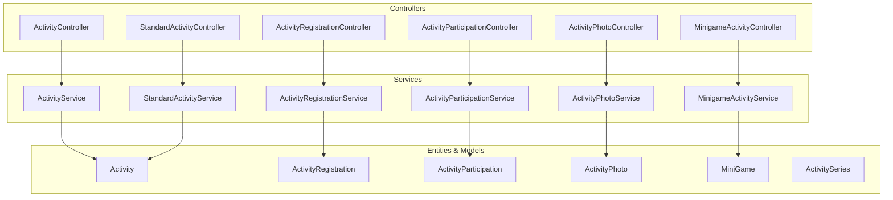
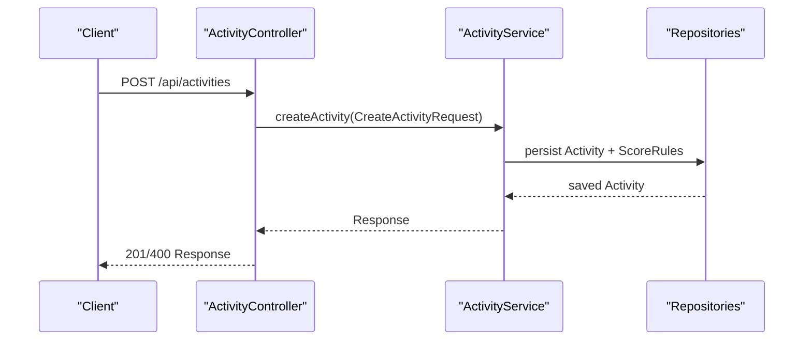
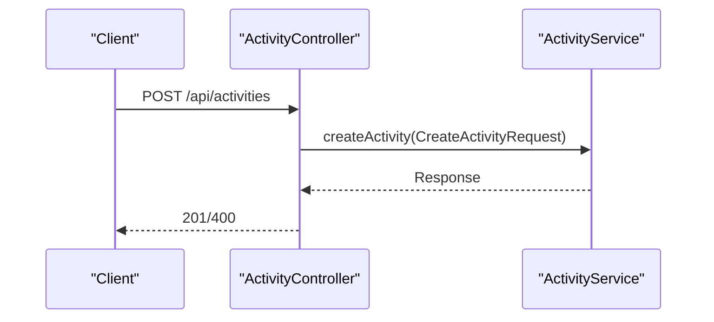
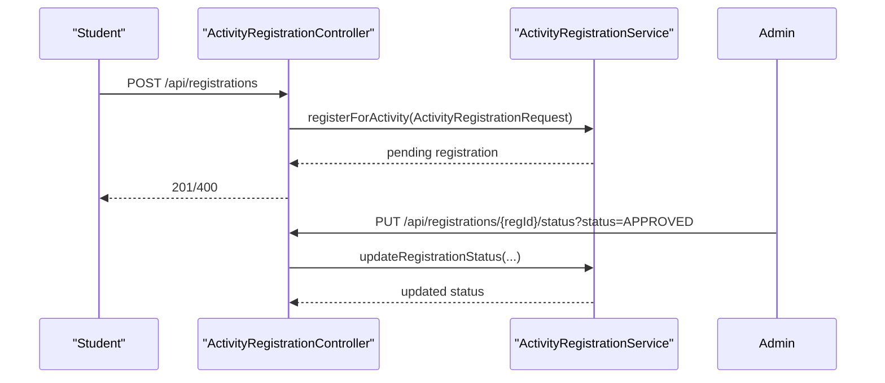
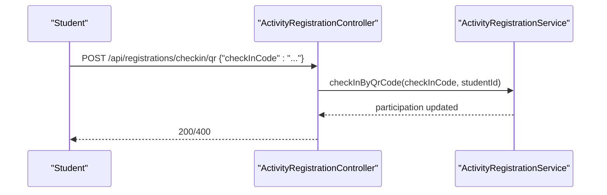
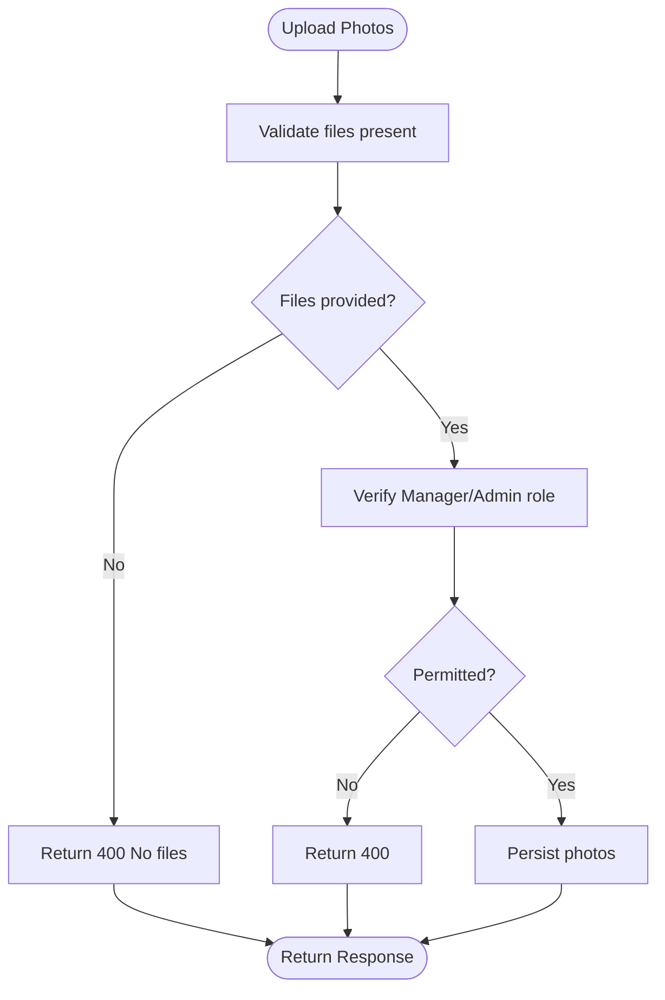
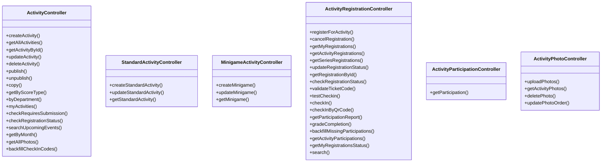

# Activity Management API

<cite>
**Referenced Files in This Document**
- [CampusLifeApplication.java](file://src/main/java/vn/campuslife/CampusLifeApplication.java)
- [ActivityController.java](file://src/main/java/vn/campuslife/controller/activity/ActivityController.java)
- [StandardActivityController.java](file://src/main/java/vn/campuslife/controller/activity/StandardActivityController.java)
- [MinigameActivityController.java](file://src/main/java/vn/campuslife/controller/activity/MinigameActivityController.java)
- [ActivityRegistrationController.java](file://src/main/java/vn/campuslife/controller/activity/ActivityRegistrationController.java)
- [ActivityParticipationController.java](file://src/main/java/vn/campuslife/controller/activity/ActivityParticipationController.java)
- [ActivityPhotoController.java](file://src/main/java/vn/campuslife/controller/activity/ActivityPhotoController.java)
- [CreateActivityRequest.java](file://src/main/java/vn/campuslife/model/activity/CreateActivityRequest.java)
- [StandardActivityCreateRequest.java](file://src/main/java/vn/campuslife/model/activity/StandardActivityCreateRequest.java)
- [StandardActivityUpdateRequest.java](file://src/main/java/vn/campuslife/model/activity/StandardActivityUpdateRequest.java)
- [ActivityRegistrationRequest.java](file://src/main/java/vn/campuslife/model/activity/ActivityRegistrationRequest.java)
- [ActivityParticipationRequest.java](file://src/main/java/vn/campuslife/model/activity/ActivityParticipationRequest.java)
- [MinigameActivityCreateRequest.java](file://src/main/java/vn/campuslife/model/activity/minigame/MinigameActivityCreateRequest.java)
- [MinigameActivityUpdateRequest.java](file://src/main/java/vn/campuslife/model/activity/minigame/MinigameActivityUpdateRequest.java)
</cite>

## Table of Contents
1. [Introduction](#introduction)
2. [Project Structure](#project-structure)
3. [Core Components](#core-components)
4. [Architecture Overview](#architecture-overview)
5. [Detailed Component Analysis](#detailed-component-analysis)
6. [Dependency Analysis](#dependency-analysis)
7. [Performance Considerations](#performance-considerations)
8. [Troubleshooting Guide](#troubleshooting-guide)
9. [Conclusion](#conclusion)
10. [Appendices](#appendices)

## Introduction
This document provides comprehensive API documentation for the Activity Management System. It covers standard activities, minigame activities, registrations, participations, photos, and related workflows. The documentation includes endpoint definitions, request/response schemas, validation rules, lifecycle management, approval processes, check-in systems, photo gallery operations, and task completion tracking. Permission models, capacity management, and real-time participation tracking are also documented.

## Project Structure
The backend is a Spring Boot application with a layered architecture:
- Controllers expose REST endpoints grouped by domain (activities, registrations, participations, photos).
- Services encapsulate business logic.
- Repositories handle persistence.
- Models define request/response DTOs and enumerations.
- Migrations evolve the database schema for activities, series, minigames, quizzes, and related entities.

**Diagram sources**
- [ActivityController.java:20-271](file://src/main/java/vn/campuslife/controller/activity/ActivityController.java#L20-L271)
- [StandardActivityController.java:11-36](file://src/main/java/vn/campuslife/controller/activity/StandardActivityController.java#L11-L36)
- [MinigameActivityController.java:11-36](file://src/main/java/vn/campuslife/controller/activity/MinigameActivityController.java#L11-L36)
- [ActivityRegistrationController.java:25-392](file://src/main/java/vn/campuslife/controller/activity/ActivityRegistrationController.java#L25-L392)
- [ActivityParticipationController.java:13-55](file://src/main/java/vn/campuslife/controller/activity/ActivityParticipationController.java#L13-L55)
- [ActivityPhotoController.java:15-108](file://src/main/java/vn/campuslife/controller/activity/ActivityPhotoController.java#L15-L108)

**Section sources**
- [CampusLifeApplication.java:1-19](file://src/main/java/vn/campuslife/CampusLifeApplication.java#L1-L19)

## Core Components
- ActivityController: CRUD and lifecycle operations for activities, presets, publishing/unpublishing, copying, and photo retrieval.
- StandardActivityController: CRUD for standard activity shell metadata.
- MinigameActivityController: CRUD for minigame activity shell with embedded quiz configuration.
- ActivityRegistrationController: Registration, cancellation, status updates, check-in (QR/code), grading, reports, and backfills.
- ActivityParticipationController: Lookup participation records for a student-activity pair.
- ActivityPhotoController: Upload, list, soft-delete, and reorder activity photos.

**Section sources**
- [ActivityController.java:20-271](file://src/main/java/vn/campuslife/controller/activity/ActivityController.java#L20-L271)
- [StandardActivityController.java:11-36](file://src/main/java/vn/campuslife/controller/activity/StandardActivityController.java#L11-L36)
- [MinigameActivityController.java:11-36](file://src/main/java/vn/campuslife/controller/activity/MinigameActivityController.java#L11-L36)
- [ActivityRegistrationController.java:25-392](file://src/main/java/vn/campuslife/controller/activity/ActivityRegistrationController.java#L25-L392)
- [ActivityParticipationController.java:13-55](file://src/main/java/vn/campuslife/controller/activity/ActivityParticipationController.java#L13-L55)
- [ActivityPhotoController.java:15-108](file://src/main/java/vn/campuslife/controller/activity/ActivityPhotoController.java#L15-L108)

## Architecture Overview
The system follows REST conventions with resource-based URLs. Authentication is enforced via Spring Security; endpoints differentiate between student, manager/admin capabilities. Data transfer uses DTOs defined under model/activity and model/activity/minigame packages.

**Diagram sources**
- [ActivityController.java:32-50](file://src/main/java/vn/campuslife/controller/activity/ActivityController.java#L32-L50)
- [CreateActivityRequest.java:11-40](file://src/main/java/vn/campuslife/model/activity/CreateActivityRequest.java#L11-L40)

## Detailed Component Analysis

### Activities API
- Base path: /api/activities
- Presets:
  - GET /api/activities/presets
  - POST /api/activities/presets/preview
- Lifecycle:
  - POST /api/activities
  - PUT /api/activities/{id}
  - DELETE /api/activities/{id}
  - PUT /api/activities/{id}/publish
  - PUT /api/activities/{id}/unpublish
  - POST /api/activities/{id}/copy?offsetDays=...
- Queries:
  - GET /api/activities
  - GET /api/activities/{id}
  - GET /api/activities/score-type/{scoreType}
  - GET /api/activities/department/{deptId}
  - GET /api/activities/my
  - GET /api/activities/upcoming?keyword=...
  - GET /api/activities/month?year=&month=
  - GET /api/activities/{activityId}/requires-submission
  - GET /api/activities/{activityId}/registration-status
- Photos:
  - GET /api/activities/photos/all

Request schema: CreateActivityRequest
- Fields: name, type, presetCode, presetConfig, description, startDate, endDate, requiresSubmission, scoreRules, registrationStartDate, registrationDeadline, shareLink, isImportant, isDraft, bannerUrl, location, ticketQuantity, benefits, requirements, contactInfo, requiresApproval, mandatoryForFacultyStudents, organizerIds
- Validation: Non-null fields indicated by annotations; type and preset fields constrained by enumerations/enums.

Response schema: ActivityResponse (returned by queries and list endpoints)

Workflow: Publish/Unpublish
- PUT /api/activities/{id}/publish
- PUT /api/activities/{id}/unpublish

Workflow: Copy Activity
- POST /api/activities/{id}/copy?offsetDays=...

Notes:
- Capacity management: ticketQuantity controls capacity; registration deadline and start date govern availability.
- Approval gating: requiresApproval toggles manual approval during registration.
- Scoring: scoreRules define how points are awarded per activity.

**Section sources**
- [ActivityController.java:32-145](file://src/main/java/vn/campuslife/controller/activity/ActivityController.java#L32-L145)
- [ActivityController.java:147-159](file://src/main/java/vn/campuslife/controller/activity/ActivityController.java#L147-L159)
- [ActivityController.java:164-196](file://src/main/java/vn/campuslife/controller/activity/ActivityController.java#L164-L196)
- [ActivityController.java:225-248](file://src/main/java/vn/campuslife/controller/activity/ActivityController.java#L225-L248)
- [ActivityController.java:250-253](file://src/main/java/vn/campuslife/controller/activity/ActivityController.java#L250-L253)
- [CreateActivityRequest.java:11-40](file://src/main/java/vn/campuslife/model/activity/CreateActivityRequest.java#L11-L40)

### Standard Activities API
- Base path: /api/activities/standard
- Create: POST /api/activities/standard
- Update: PUT /api/activities/standard/{id}
- Retrieve: GET /api/activities/standard/{id}

Request schemas:
- StandardActivityCreateRequest
- StandardActivityUpdateRequest

Validation:
- Type is fixed for standard activities; fields include dates, location, organizers, registration windows, submission/approval flags, ticket quantity, draft flag, media links, benefits/requirements, contact info, and scoreRules.

**Section sources**
- [StandardActivityController.java:18-34](file://src/main/java/vn/campuslife/controller/activity/StandardActivityController.java#L18-L34)
- [StandardActivityCreateRequest.java:15-48](file://src/main/java/vn/campuslife/model/activity/StandardActivityCreateRequest.java#L15-L48)
- [StandardActivityUpdateRequest.java:14-47](file://src/main/java/vn/campuslife/model/activity/StandardActivityUpdateRequest.java#L14-L47)

### Minigame Activities API
- Base path: /api/activities/minigame
- Create: POST /api/activities/minigame
- Patch: PATCH /api/activities/minigame/{id}
- Retrieve: GET /api/activities/minigame/{id}

Request schemas:
- MinigameActivityCreateRequest (includes quiz config)
- MinigameActivityUpdateRequest (includes quiz config)

Quiz config fields:
- title, questionCount, timeLimit, requiredCorrectAnswers, maxAttempts, showAnswers, questions

Validation:
- Quiz questions conform to CreateMiniGameRequest.QuestionRequest structure.

**Section sources**
- [MinigameActivityController.java:18-34](file://src/main/java/vn/campuslife/controller/activity/MinigameActivityController.java#L18-L34)
- [MinigameActivityCreateRequest.java:12-48](file://src/main/java/vn/campuslife/model/activity/minigame/MinigameActivityCreateRequest.java#L12-L48)
- [MinigameActivityUpdateRequest.java:12-48](file://src/main/java/vn/campuslife/model/activity/minigame/MinigameActivityUpdateRequest.java#L12-L48)

### Registrations API
- Base path: /api/registrations
- Register: POST /api/registrations
  - Request: ActivityRegistrationRequest (activityId)
  - Response: Registration status; may require approval depending on activity settings.
- Cancel: DELETE /api/registrations/activity/{activityId}
- My registrations: GET /api/registrations/my
- By activity: GET /api/registrations/activity/{activityId}
- By series: GET /api/registrations/series/{seriesId}
- Update status: PUT /api/registrations/{registrationId}/status?status=...
- Get registration: GET /api/registrations/{registrationId}
- Check registration status: GET /api/registrations/check/{activityId}
- Search: GET /api/registrations/search?keyword=&status=

Check-in:
- Validate ticket code: GET /api/registrations/checkin/validate?ticketCode=...
- Manual check-in: POST /api/registrations/checkin
  - Request: ActivityParticipationRequest (ticketCode, studentId, participationType, pointsEarned)
- QR check-in: POST /api/registrations/checkin/qr
  - Body: {"checkInCode": "..."}
- Reports: GET /api/registrations/activities/{activityId}/report
- Grade completion: PUT /api/registrations/participations/{participationId}/grade?isCompleted=&notes=
- Backfill missing participations: POST /api/registrations/backfill/participations
- Participations list: GET /api/registrations/activities/{activityId}/participations
- My registrations by status: GET /api/registrations/my/{status}

Validation rules:
- Registration requires a valid activityId.
- Check-in supports QR code or manual entry; automatic participation type progression (REGISTERED → CHECKED_IN → ATTENDED).
- Grading endpoint sets completion flag and optional notes.

**Section sources**
- [ActivityRegistrationController.java:39-56](file://src/main/java/vn/campuslife/controller/activity/ActivityRegistrationController.java#L39-L56)
- [ActivityRegistrationController.java:61-77](file://src/main/java/vn/campuslife/controller/activity/ActivityRegistrationController.java#L61-L77)
- [ActivityRegistrationController.java:82-97](file://src/main/java/vn/campuslife/controller/activity/ActivityRegistrationController.java#L82-L97)
- [ActivityRegistrationController.java:102-115](file://src/main/java/vn/campuslife/controller/activity/ActivityRegistrationController.java#L102-L115)
- [ActivityRegistrationController.java:120-125](file://src/main/java/vn/campuslife/controller/activity/ActivityRegistrationController.java#L120-L125)
- [ActivityRegistrationController.java:130-134](file://src/main/java/vn/campuslife/controller/activity/ActivityRegistrationController.java#L130-L134)
- [ActivityRegistrationController.java:139-155](file://src/main/java/vn/campuslife/controller/activity/ActivityRegistrationController.java#L139-L155)
- [ActivityRegistrationController.java:185-194](file://src/main/java/vn/campuslife/controller/activity/ActivityRegistrationController.java#L185-L194)
- [ActivityRegistrationController.java:217-245](file://src/main/java/vn/campuslife/controller/activity/ActivityRegistrationController.java#L217-L245)
- [ActivityRegistrationController.java:250-274](file://src/main/java/vn/campuslife/controller/activity/ActivityRegistrationController.java#L250-L274)
- [ActivityRegistrationController.java:299-305](file://src/main/java/vn/campuslife/controller/activity/ActivityRegistrationController.java#L299-L305)
- [ActivityRegistrationController.java:310-323](file://src/main/java/vn/campuslife/controller/activity/ActivityRegistrationController.java#L310-L323)
- [ActivityRegistrationController.java:330-339](file://src/main/java/vn/campuslife/controller/activity/ActivityRegistrationController.java#L330-L339)
- [ActivityRegistrationController.java:345-354](file://src/main/java/vn/campuslife/controller/activity/ActivityRegistrationController.java#L345-L354)
- [ActivityRegistrationController.java:357-377](file://src/main/java/vn/campuslife/controller/activity/ActivityRegistrationController.java#L357-L377)
- [ActivityRegistrationController.java:381-387](file://src/main/java/vn/campuslife/controller/activity/ActivityRegistrationController.java#L381-L387)
- [ActivityRegistrationRequest.java:11-16](file://src/main/java/vn/campuslife/model/activity/ActivityRegistrationRequest.java#L11-L16)
- [ActivityParticipationRequest.java:13-25](file://src/main/java/vn/campuslife/model/activity/ActivityParticipationRequest.java#L13-L25)

### Participations API
- Base path: /api/participations
- Lookup participation: GET /api/participations/student/{studentId}/activity/{activityId}
  - Returns structured DTO with participation details including pointsEarned, completion flag, check-in/out timestamps, and participation type.

**Section sources**
- [ActivityParticipationController.java:19-52](file://src/main/java/vn/campuslife/controller/activity/ActivityParticipationController.java#L19-L52)

### Photos API
- Base path: /api/activities/{activityId}/photos
- Upload: POST /api/activities/{activityId}/photos
  - Form params: files (required), captions (optional)
  - Permissions: Manager/Admin only; upload allowed only after activity end.
- List: GET /api/activities/{activityId}/photos
  - Permissions: Student/Manager/Admin can view.
- Delete: DELETE /api/activities/{activityId}/photos/{photoId}
  - Soft delete; permissions: Manager/Admin only.
- Reorder: PUT /api/activities/{activityId}/photos/{photoId}/order?order=...
  - Permissions: Manager/Admin only.

**Section sources**
- [ActivityPhotoController.java:28-48](file://src/main/java/vn/campuslife/controller/activity/ActivityPhotoController.java#L28-L48)
- [ActivityPhotoController.java:54-64](file://src/main/java/vn/campuslife/controller/activity/ActivityPhotoController.java#L54-L64)
- [ActivityPhotoController.java:70-84](file://src/main/java/vn/campuslife/controller/activity/ActivityPhotoController.java#L70-L84)
- [ActivityPhotoController.java:90-105](file://src/main/java/vn/campuslife/controller/activity/ActivityPhotoController.java#L90-L105)

### Workflow Endpoints and Examples

#### Activity Creation Workflow
- Steps:
  - Prepare CreateActivityRequest payload with name, type, schedule, registration windows, scoring rules, and optional preset.
  - POST to /api/activities.
  - Optionally publish via PUT /api/activities/{id}/publish.
  - Optionally copy future instances via POST /api/activities/{id}/copy.

**Diagram sources**
- [ActivityController.java:32-50](file://src/main/java/vn/campuslife/controller/activity/ActivityController.java#L32-L50)
- [CreateActivityRequest.java:11-40](file://src/main/java/vn/campuslife/model/activity/CreateActivityRequest.java#L11-L40)

#### Registration Approval Process
- Steps:
  - Student registers via POST /api/registrations with activityId.
  - If requiresApproval is true, status remains pending until admin approves via PUT /api/registrations/{registrationId}/status?status=APPROVED.
  - Admin can view registrations by activity via GET /api/registrations/activity/{activityId}.

**Diagram sources**
- [ActivityRegistrationController.java:39-56](file://src/main/java/vn/campuslife/controller/activity/ActivityRegistrationController.java#L39-L56)
- [ActivityRegistrationController.java:120-125](file://src/main/java/vn/campuslife/controller/activity/ActivityRegistrationController.java#L120-L125)

#### Check-in System
- Options:
  - Manual: POST /api/registrations/checkin with ActivityParticipationRequest.
  - QR: POST /api/registrations/checkin/qr with checkInCode.
- Automatic progression: REGISTERED → CHECKED_IN → ATTENDED based on current state.

**Diagram sources**
- [ActivityRegistrationController.java:250-274](file://src/main/java/vn/campuslife/controller/activity/ActivityRegistrationController.java#L250-L274)

#### Photo Gallery Operations
- Upload after activity end:
  - POST /api/activities/{activityId}/photos with files and optional captions.
- View gallery:
  - GET /api/activities/{activityId}/photos.
- Manage images:
  - DELETE /api/activities/{activityId}/photos/{photoId} (soft delete).
  - PUT /api/activities/{activityId}/photos/{photoId}/order?order=...

**Diagram sources**
- [ActivityPhotoController.java:28-48](file://src/main/java/vn/campuslife/controller/activity/ActivityPhotoController.java#L28-L48)

#### Task Completion Tracking
- Not part of the documented controllers in this snapshot.
- Refer to task-related packages and controllers for assignment/submission workflows.

[No sources needed since this section doesn't analyze specific files]

### Permission Models
- Student actions:
  - Register/unregister for activities.
  - View personal calendar of joined events.
  - Check registration status for an activity.
- Manager/Admin actions:
  - Publish/unpublish activities.
  - Approve/deny registrations.
  - Create/update/delete photos.
  - Generate check-in codes and backfill participations.
  - Grade completions and manage series/quiz/minigame configurations.

[No sources needed since this section provides general guidance]

### Capacity Management
- ticketQuantity defines capacity per activity.
- Registration closes upon reaching capacity or hitting registrationDeadline.
- Manual approval (requiresApproval) allows administrators to override capacity limits.

[No sources needed since this section provides general guidance]

### Real-time Participation Tracking
- Participations endpoint lists all participations for an activity with current statuses.
- Reports endpoint provides attendance/non-attendance summaries for admins.
- QR/manual check-in updates participation records in real time.

**Section sources**
- [ActivityRegistrationController.java:345-354](file://src/main/java/vn/campuslife/controller/activity/ActivityRegistrationController.java#L345-L354)
- [ActivityRegistrationController.java:299-305](file://src/main/java/vn/campuslife/controller/activity/ActivityRegistrationController.java#L299-L305)
- [ActivityRegistrationController.java:250-274](file://src/main/java/vn/campuslife/controller/activity/ActivityRegistrationController.java#L250-L274)

## Dependency Analysis
- Controllers depend on services for business logic.
- Services depend on repositories for persistence.
- DTOs define strict request/response contracts.

**Diagram sources**
- [ActivityController.java:20-271](file://src/main/java/vn/campuslife/controller/activity/ActivityController.java#L20-L271)
- [StandardActivityController.java:11-36](file://src/main/java/vn/campuslife/controller/activity/StandardActivityController.java#L11-L36)
- [MinigameActivityController.java:11-36](file://src/main/java/vn/campuslife/controller/activity/MinigameActivityController.java#L11-L36)
- [ActivityRegistrationController.java:25-392](file://src/main/java/vn/campuslife/controller/activity/ActivityRegistrationController.java#L25-L392)
- [ActivityParticipationController.java:13-55](file://src/main/java/vn/campuslife/controller/activity/ActivityParticipationController.java#L13-L55)
- [ActivityPhotoController.java:15-108](file://src/main/java/vn/campuslife/controller/activity/ActivityPhotoController.java#L15-L108)

**Section sources**
- [ActivityController.java:20-271](file://src/main/java/vn/campuslife/controller/activity/ActivityController.java#L20-L271)
- [StandardActivityController.java:11-36](file://src/main/java/vn/campuslife/controller/activity/StandardActivityController.java#L11-L36)
- [MinigameActivityController.java:11-36](file://src/main/java/vn/campuslife/controller/activity/MinigameActivityController.java#L11-L36)
- [ActivityRegistrationController.java:25-392](file://src/main/java/vn/campuslife/controller/activity/ActivityRegistrationController.java#L25-L392)
- [ActivityParticipationController.java:13-55](file://src/main/java/vn/campuslife/controller/activity/ActivityParticipationController.java#L13-L55)
- [ActivityPhotoController.java:15-108](file://src/main/java/vn/campuslife/controller/activity/ActivityPhotoController.java#L15-L108)

## Performance Considerations
- Batch operations: Prefer bulk endpoints where available (e.g., backfill participation).
- Pagination: Use query parameters for large lists (e.g., search).
- Caching: QR token cache exists for check-in validation; avoid excessive revalidation.
- Asynchronous notifications: Use scheduled jobs for reminders and notifications.

[No sources needed since this section provides general guidance]

## Troubleshooting Guide
Common issues and resolutions:
- Authentication failures:
  - Ensure JWT is attached; endpoints like check-in require authenticated users.
- Registration errors:
  - Verify activityId exists and registration window is open.
  - If requiresApproval is true, wait for admin approval.
- Check-in failures:
  - Validate ticketCode or QR code; ensure studentId matches authenticated user for QR.
  - Confirm activity is currently ongoing or allow late check-in per policy.
- Photo upload failures:
  - Ensure files are provided and user has Manager/Admin role.
  - Upload only after activity end as per policy.

**Section sources**
- [ActivityRegistrationController.java:217-245](file://src/main/java/vn/campuslife/controller/activity/ActivityRegistrationController.java#L217-L245)
- [ActivityPhotoController.java:28-48](file://src/main/java/vn/campuslife/controller/activity/ActivityPhotoController.java#L28-L48)

## Conclusion
The Activity Management API provides robust CRUD and lifecycle operations for activities, standardized shells, minigame quizzes, registrations, check-ins, and photo galleries. Clear separation of concerns via controllers, services, and DTOs enables maintainable extensions. Administrators gain powerful tools for approvals, reporting, and capacity management, while students benefit from streamlined registration and participation tracking.

## Appendices

### Request/Response Schemas Summary

- CreateActivityRequest
  - Required: name, type, startDate, endDate
  - Optional: presetCode, presetConfig, description, registrationStartDate, registrationDeadline, shareLink, isImportant, isDraft, bannerUrl, location, ticketQuantity, benefits, requirements, contactInfo, requiresApproval, mandatoryForFacultyStudents, organizerIds, requiresSubmission, scoreRules

- StandardActivityCreateRequest
  - Required: name, type, startDate, endDate, location, organizerIds, registrationStartDate, registrationDeadline
  - Optional: requiresSubmission, requiresApproval, ticketQuantity, isImportant, mandatoryForFacultyStudents, isDraft, bannerUrl, shareLink, benefits, requirements, contactInfo, scoreRules, presetCode, presetConfig

- StandardActivityUpdateRequest
  - Same fields as create; type cannot be changed

- MinigameActivityCreateRequest
  - Shell fields similar to standard activity plus quiz config:
    - quiz.title, quiz.questionCount, quiz.timeLimit, quiz.requiredCorrectAnswers, quiz.maxAttempts, quiz.showAnswers, quiz.questions

- MinigameActivityUpdateRequest
  - Same as create variant

- ActivityRegistrationRequest
  - activityId (required)

- ActivityParticipationRequest
  - ticketCode or studentId, optional participationType, optional pointsEarned

**Section sources**
- [CreateActivityRequest.java:11-40](file://src/main/java/vn/campuslife/model/activity/CreateActivityRequest.java#L11-L40)
- [StandardActivityCreateRequest.java:15-48](file://src/main/java/vn/campuslife/model/activity/StandardActivityCreateRequest.java#L15-L48)
- [StandardActivityUpdateRequest.java:14-47](file://src/main/java/vn/campuslife/model/activity/StandardActivityUpdateRequest.java#L14-L47)
- [MinigameActivityCreateRequest.java:12-48](file://src/main/java/vn/campuslife/model/activity/minigame/MinigameActivityCreateRequest.java#L12-L48)
- [MinigameActivityUpdateRequest.java:12-48](file://src/main/java/vn/campuslife/model/activity/minigame/MinigameActivityUpdateRequest.java#L12-L48)
- [ActivityRegistrationRequest.java:11-16](file://src/main/java/vn/campuslife/model/activity/ActivityRegistrationRequest.java#L11-L16)
- [ActivityParticipationRequest.java:13-25](file://src/main/java/vn/campuslife/model/activity/ActivityParticipationRequest.java#L13-L25)