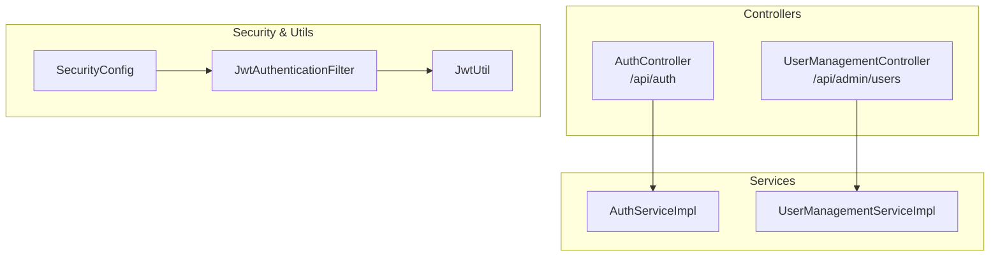
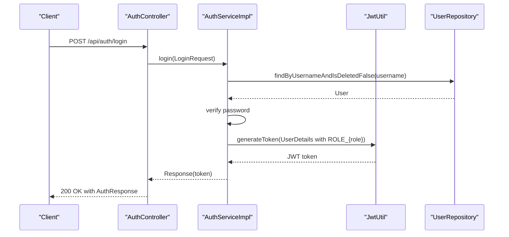
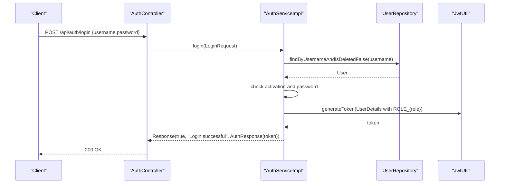
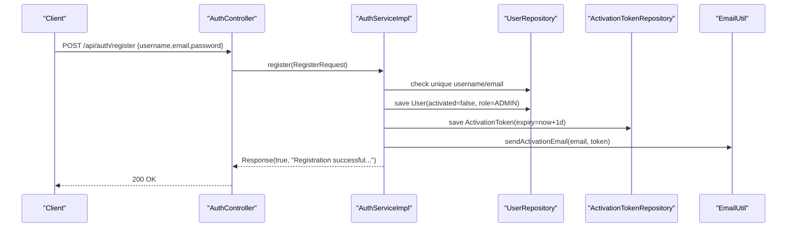
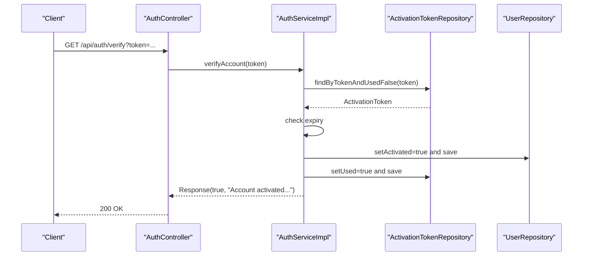
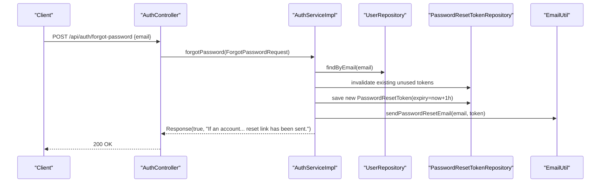
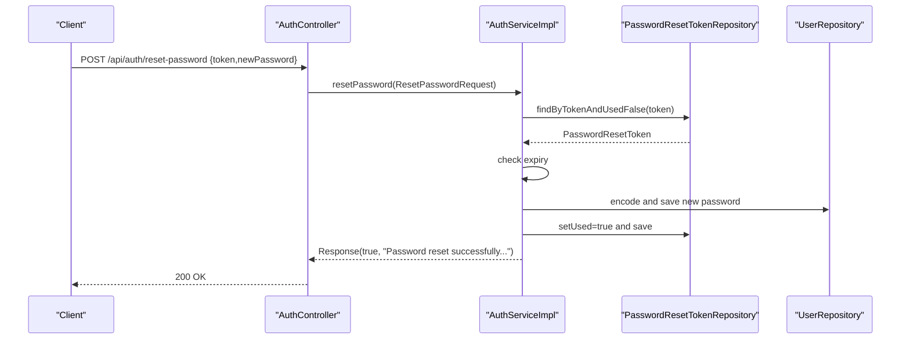
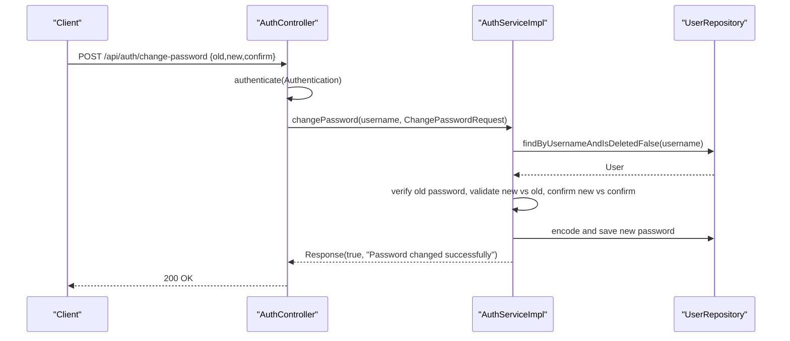
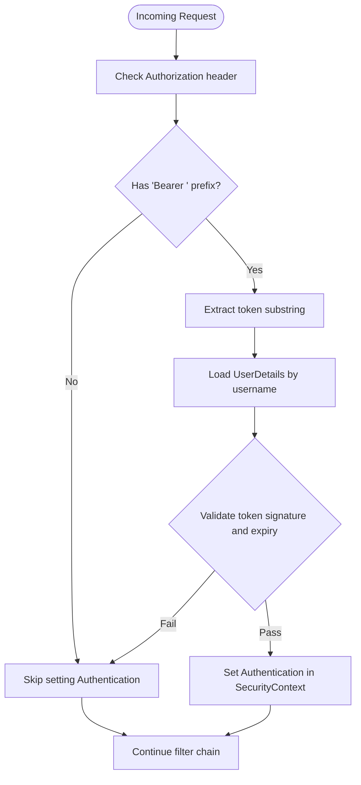
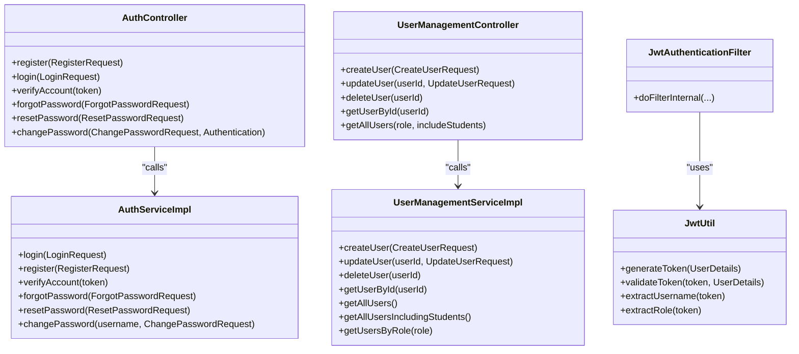

# Authentication API

<cite>
**Referenced Files in This Document**
- [AuthController.java](file://src/main/java/vn/campuslife/controller/auth/AuthController.java)
- [UserManagementController.java](file://src/main/java/vn/campuslife/controller/auth/UserManagementController.java)
- [AuthServiceImpl.java](file://src/main/java/vn/campuslife/service/impl/AuthServiceImpl.java)
- [UserManagementServiceImpl.java](file://src/main/java/vn/campuslife/service/impl/UserManagementServiceImpl.java)
- [JwtUtil.java](file://src/main/java/vn/campuslife/util/JwtUtil.java)
- [JwtAuthenticationFilter.java](file://src/main/java/vn/campuslife/filter/JwtAuthenticationFilter.java)
- [SecurityConfig.java](file://src/main/java/vn/campuslife/config/SecurityConfig.java)
- [LoginRequest.java](file://src/main/java/vn/campuslife/model/LoginRequest.java)
- [RegisterRequest.java](file://src/main/java/vn/campuslife/model/RegisterRequest.java)
- [ForgotPasswordRequest.java](file://src/main/java/vn/campuslife/model/ForgotPasswordRequest.java)
- [ResetPasswordRequest.java](file://src/main/java/vn/campuslife/model/ResetPasswordRequest.java)
- [ChangePasswordRequest.java](file://src/main/java/vn/campuslife/model/ChangePasswordRequest.java)
- [CreateUserRequest.java](file://src/main/java/vn/campuslife/model/CreateUserRequest.java)
- [UpdateUserRequest.java](file://src/main/java/vn/campuslife/model/UpdateUserRequest.java)
- [AuthResponse.java](file://src/main/java/vn/campuslife/model/AuthResponse.java)
- [Role.java](file://src/main/java/vn/campuslife/enumeration/Role.java)
</cite>

## Table of Contents
1. [Introduction](#introduction)
2. [Project Structure](#project-structure)
3. [Core Components](#core-components)
4. [Architecture Overview](#architecture-overview)
5. [Detailed Component Analysis](#detailed-component-analysis)
6. [Dependency Analysis](#dependency-analysis)
7. [Performance Considerations](#performance-considerations)
8. [Troubleshooting Guide](#troubleshooting-guide)
9. [Conclusion](#conclusion)

## Introduction
This document provides comprehensive API documentation for the authentication system, covering login, logout, registration, password reset, and user management operations. It explains JWT token generation and validation, credential validation rules, sessionless authentication via bearer tokens, and role-based access control. Practical examples illustrate successful authentication flows and security considerations.

## Project Structure
The authentication system spans controllers, services, filters, utilities, and configuration:
- Controllers expose REST endpoints under /api/auth and /api/admin/users
- Services implement business logic for authentication and user management
- Filter extracts and validates JWT tokens from Authorization headers
- Utility generates and validates JWT tokens
- Security configuration defines public and protected routes and roles

**Diagram sources**
- [AuthController.java:14-96](file://src/main/java/vn/campuslife/controller/auth/AuthController.java#L14-L96)
- [UserManagementController.java:10-116](file://src/main/java/vn/campuslife/controller/auth/UserManagementController.java#L10-L116)
- [AuthServiceImpl.java:31-339](file://src/main/java/vn/campuslife/service/impl/AuthServiceImpl.java#L31-L339)
- [UserManagementServiceImpl.java:23-290](file://src/main/java/vn/campuslife/service/impl/UserManagementServiceImpl.java#L23-L290)
- [JwtAuthenticationFilter.java:21-105](file://src/main/java/vn/campuslife/filter/JwtAuthenticationFilter.java#L21-L105)
- [JwtUtil.java:18-91](file://src/main/java/vn/campuslife/util/JwtUtil.java#L18-L91)
- [SecurityConfig.java:23-302](file://src/main/java/vn/campuslife/config/SecurityConfig.java#L23-L302)

**Section sources**
- [AuthController.java:14-96](file://src/main/java/vn/campuslife/controller/auth/AuthController.java#L14-L96)
- [UserManagementController.java:10-116](file://src/main/java/vn/campuslife/controller/auth/UserManagementController.java#L10-L116)
- [SecurityConfig.java:58-297](file://src/main/java/vn/campuslife/config/SecurityConfig.java#L58-L297)

## Core Components
- AuthController: Exposes endpoints for registration, login, account verification, forgot password, reset password, and change password
- UserManagementController: Exposes admin endpoints for creating, updating, deleting, retrieving users, and listing users by role
- AuthServiceImpl: Implements login, registration, account verification, forgot password, reset password, and change password with validation and token management
- UserManagementServiceImpl: Implements user creation, updates, deletion, retrieval, and filtering by role with soft delete semantics
- JwtAuthenticationFilter: Extracts Bearer tokens from Authorization headers and sets Spring Security context
- JwtUtil: Generates and validates JWT tokens with role claims
- SecurityConfig: Defines public routes, protected routes, and role-based authorization rules

**Section sources**
- [AuthController.java:14-96](file://src/main/java/vn/campuslife/controller/auth/AuthController.java#L14-L96)
- [UserManagementController.java:10-116](file://src/main/java/vn/campuslife/controller/auth/UserManagementController.java#L10-L116)
- [AuthServiceImpl.java:31-339](file://src/main/java/vn/campuslife/service/impl/AuthServiceImpl.java#L31-L339)
- [UserManagementServiceImpl.java:23-290](file://src/main/java/vn/campuslife/service/impl/UserManagementServiceImpl.java#L23-L290)
- [JwtAuthenticationFilter.java:21-105](file://src/main/java/vn/campuslife/filter/JwtAuthenticationFilter.java#L21-L105)
- [JwtUtil.java:18-91](file://src/main/java/vn/campuslife/util/JwtUtil.java#L18-L91)
- [SecurityConfig.java:58-297](file://src/main/java/vn/campuslife/config/SecurityConfig.java#L58-L297)

## Architecture Overview
The authentication architecture enforces stateless JWT-based authentication:
- Public endpoints permit registration, login, verification, forgot password, and reset password
- Protected endpoints require a valid Bearer token
- Roles ADMIN, MANAGER, STUDENT govern access to specific endpoints
- Token claims include username and role

**Diagram sources**
- [AuthController.java:41-44](file://src/main/java/vn/campuslife/controller/auth/AuthController.java#L41-L44)
- [AuthServiceImpl.java:56-96](file://src/main/java/vn/campuslife/service/impl/AuthServiceImpl.java#L56-L96)
- [JwtUtil.java:56-68](file://src/main/java/vn/campuslife/util/JwtUtil.java#L56-L68)
- [LoginRequest.java:6-9](file://src/main/java/vn/campuslife/model/LoginRequest.java#L6-L9)

**Section sources**
- [AuthController.java:41-44](file://src/main/java/vn/campuslife/controller/auth/AuthController.java#L41-L44)
- [AuthServiceImpl.java:56-96](file://src/main/java/vn/campuslife/service/impl/AuthServiceImpl.java#L56-L96)
- [JwtUtil.java:56-68](file://src/main/java/vn/campuslife/util/JwtUtil.java#L56-L68)

## Detailed Component Analysis

### Authentication Endpoints

#### Login
- Method: POST
- URL: /api/auth/login
- Request body: LoginRequest
  - username: string, required
  - password: string, required
- Response: Response with AuthResponse containing token
- Behavior:
  - Validates credentials
  - Checks account activation
  - Updates last login timestamp
  - Generates JWT with role claim

**Diagram sources**
- [AuthController.java:41-44](file://src/main/java/vn/campuslife/controller/auth/AuthController.java#L41-L44)
- [AuthServiceImpl.java:56-96](file://src/main/java/vn/campuslife/service/impl/AuthServiceImpl.java#L56-L96)
- [JwtUtil.java:56-68](file://src/main/java/vn/campuslife/util/JwtUtil.java#L56-L68)

**Section sources**
- [AuthController.java:41-44](file://src/main/java/vn/campuslife/controller/auth/AuthController.java#L41-L44)
- [AuthServiceImpl.java:56-96](file://src/main/java/vn/campuslife/service/impl/AuthServiceImpl.java#L56-L96)
- [LoginRequest.java:6-9](file://src/main/java/vn/campuslife/model/LoginRequest.java#L6-L9)
- [AuthResponse.java:6-12](file://src/main/java/vn/campuslife/model/AuthResponse.java#L6-L12)

#### Logout
- Method: Not applicable
- Notes: The backend is stateless; logout is handled client-side by discarding the token. No server-side session storage exists.

**Section sources**
- [SecurityConfig.java:64-64](file://src/main/java/vn/campuslife/config/SecurityConfig.java#L64-L64)

#### Registration
- Method: POST
- URL: /api/auth/register
- Request body: RegisterRequest
  - username: string, required
  - email: string, required
  - password: string, required (min length 6)
- Response: Response (success message; account requires email verification)
- Behavior:
  - Validates uniqueness of username and email
  - Creates user with role ADMIN and deactivated status
  - Auto-initializes student profile and scores if role is STUDENT
  - Generates activation token (1 day expiry)
  - Sends activation email

**Diagram sources**
- [AuthController.java:24-39](file://src/main/java/vn/campuslife/controller/auth/AuthController.java#L24-L39)
- [AuthServiceImpl.java:100-170](file://src/main/java/vn/campuslife/service/impl/AuthServiceImpl.java#L100-L170)

**Section sources**
- [AuthController.java:24-39](file://src/main/java/vn/campuslife/controller/auth/AuthController.java#L24-L39)
- [AuthServiceImpl.java:100-170](file://src/main/java/vn/campuslife/service/impl/AuthServiceImpl.java#L100-L170)
- [RegisterRequest.java:6-10](file://src/main/java/vn/campuslife/model/RegisterRequest.java#L6-L10)

#### Account Verification
- Method: GET
- URL: /api/auth/verify?token={token}
- Query param: token: string, required
- Response: Response (activation result)
- Behavior:
  - Validates token existence and unused status
  - Checks expiry (must be before now)
  - Activates user and marks token as used

**Diagram sources**
- [AuthController.java:46-49](file://src/main/java/vn/campuslife/controller/auth/AuthController.java#L46-L49)
- [AuthServiceImpl.java:172-198](file://src/main/java/vn/campuslife/service/impl/AuthServiceImpl.java#L172-L198)

**Section sources**
- [AuthController.java:46-49](file://src/main/java/vn/campuslife/controller/auth/AuthController.java#L46-L49)
- [AuthServiceImpl.java:172-198](file://src/main/java/vn/campuslife/service/impl/AuthServiceImpl.java#L172-L198)

#### Forgot Password
- Method: POST
- URL: /api/auth/forgot-password
- Request body: ForgotPasswordRequest
  - email: string, required
- Response: Response (success message regardless of email existence)
- Behavior:
  - Prevents email enumeration by always returning success
  - Invalidates previous unused reset tokens
  - Generates new reset token (1 hour expiry)
  - Sends reset email

**Diagram sources**
- [AuthController.java:51-59](file://src/main/java/vn/campuslife/controller/auth/AuthController.java#L51-L59)
- [AuthServiceImpl.java:200-246](file://src/main/java/vn/campuslife/service/impl/AuthServiceImpl.java#L200-L246)

**Section sources**
- [AuthController.java:51-59](file://src/main/java/vn/campuslife/controller/auth/AuthController.java#L51-L59)
- [AuthServiceImpl.java:200-246](file://src/main/java/vn/campuslife/service/impl/AuthServiceImpl.java#L200-L246)
- [ForgotPasswordRequest.java:6-8](file://src/main/java/vn/campuslife/model/ForgotPasswordRequest.java#L6-L8)

#### Reset Password
- Method: POST
- URL: /api/auth/reset-password
- Request body: ResetPasswordRequest
  - token: string, required
  - newPassword: string, required (min length 6)
- Response: Response (reset result)
- Behavior:
  - Validates token existence and unused status
  - Checks expiry (must be before now)
  - Encodes and updates user password
  - Marks token as used

**Diagram sources**
- [AuthController.java:61-69](file://src/main/java/vn/campuslife/controller/auth/AuthController.java#L61-L69)
- [AuthServiceImpl.java:248-287](file://src/main/java/vn/campuslife/service/impl/AuthServiceImpl.java#L248-L287)

**Section sources**
- [AuthController.java:61-69](file://src/main/java/vn/campuslife/controller/auth/AuthController.java#L61-L69)
- [AuthServiceImpl.java:248-287](file://src/main/java/vn/campuslife/service/impl/AuthServiceImpl.java#L248-L287)
- [ResetPasswordRequest.java:6-10](file://src/main/java/vn/campuslife/model/ResetPasswordRequest.java#L6-L10)

#### Change Password (Authenticated)
- Method: POST
- URL: /api/auth/change-password
- Headers: Authorization: Bearer {token}
- Request body: ChangePasswordRequest
  - oldPassword: string, required
  - newPassword: string, required (min length 6)
  - confirmPassword: string, required
- Response: Response (change result)
- Behavior:
  - Validates old password against stored hash
  - Ensures new password differs from old
  - Confirms new password matches confirmation
  - Encodes and updates user password

**Diagram sources**
- [AuthController.java:71-94](file://src/main/java/vn/campuslife/controller/auth/AuthController.java#L71-L94)
- [AuthServiceImpl.java:289-338](file://src/main/java/vn/campuslife/service/impl/AuthServiceImpl.java#L289-L338)

**Section sources**
- [AuthController.java:71-94](file://src/main/java/vn/campuslife/controller/auth/AuthController.java#L71-L94)
- [AuthServiceImpl.java:289-338](file://src/main/java/vn/campuslife/service/impl/AuthServiceImpl.java#L289-L338)
- [ChangePasswordRequest.java:10-14](file://src/main/java/vn/campuslife/model/ChangePasswordRequest.java#L10-L14)

### User Management Endpoints (Admin)

#### Create User
- Method: POST
- URL: /api/admin/users
- Headers: Authorization: Bearer {token}
- Request body: CreateUserRequest
  - username: string, required
  - email: string, required
  - password: string, required (min length 6)
  - role: ADMIN or MANAGER, required
  - isActivated: optional, defaults to true
- Response: Response with UserResponse

**Section sources**
- [UserManagementController.java:20-35](file://src/main/java/vn/campuslife/controller/auth/UserManagementController.java#L20-L35)
- [UserManagementServiceImpl.java:44-97](file://src/main/java/vn/campuslife/service/impl/UserManagementServiceImpl.java#L44-L97)
- [CreateUserRequest.java:7-13](file://src/main/java/vn/campuslife/model/CreateUserRequest.java#L7-L13)

#### Update User
- Method: PUT
- URL: /api/admin/users/{userId}
- Headers: Authorization: Bearer {token}
- Path param: userId: number, required
- Request body: UpdateUserRequest
  - username: string (optional)
  - email: string (optional)
  - password: string (optional, min length 6)
  - role: ADMIN or MANAGER (optional)
  - isActivated: boolean (optional)
- Response: Response with UserResponse

**Section sources**
- [UserManagementController.java:37-54](file://src/main/java/vn/campuslife/controller/auth/UserManagementController.java#L37-L54)
- [UserManagementServiceImpl.java:99-168](file://src/main/java/vn/campuslife/service/impl/UserManagementServiceImpl.java#L99-L168)
- [UpdateUserRequest.java:7-13](file://src/main/java/vn/campuslife/model/UpdateUserRequest.java#L7-L13)

#### Delete User
- Method: DELETE
- URL: /api/admin/users/{userId}
- Headers: Authorization: Bearer {token}
- Path param: userId: number, required
- Response: Response (soft delete)

**Section sources**
- [UserManagementController.java:56-71](file://src/main/java/vn/campuslife/controller/auth/UserManagementController.java#L56-L71)
- [UserManagementServiceImpl.java:170-193](file://src/main/java/vn/campuslife/service/impl/UserManagementServiceImpl.java#L170-L193)

#### Get User by ID
- Method: GET
- URL: /api/admin/users/{userId}
- Headers: Authorization: Bearer {token}
- Path param: userId: number, required
- Response: Response with UserResponse

**Section sources**
- [UserManagementController.java:73-88](file://src/main/java/vn/campuslife/controller/auth/UserManagementController.java#L73-L88)
- [UserManagementServiceImpl.java:195-214](file://src/main/java/vn/campuslife/service/impl/UserManagementServiceImpl.java#L195-L214)

#### List Users
- Method: GET
- URL: /api/admin/users
- Headers: Authorization: Bearer {token}
- Query params:
  - role: optional, ADMIN or MANAGER
  - includeStudents: optional, boolean, default false
- Response: Response with array of UserResponse

**Section sources**
- [UserManagementController.java:90-115](file://src/main/java/vn/campuslife/controller/auth/UserManagementController.java#L90-L115)
- [UserManagementServiceImpl.java:216-287](file://src/main/java/vn/campuslife/service/impl/UserManagementServiceImpl.java#L216-L287)

### JWT Token Authentication and Session Management
- Header: Authorization: Bearer {token}
- Token payload:
  - Subject: username
  - Claim: role (ADMIN, MANAGER, STUDENT)
  - Issued at and expiration configured via properties
- Stateless behavior: No server-side session; validation occurs per request
- Token extraction and validation:
  - Filter reads Authorization header, extracts Bearer token
  - Loads user details and validates token signature and expiry
  - Sets Authentication in SecurityContext if valid

**Diagram sources**
- [JwtAuthenticationFilter.java:34-103](file://src/main/java/vn/campuslife/filter/JwtAuthenticationFilter.java#L34-L103)
- [JwtUtil.java:44-83](file://src/main/java/vn/campuslife/util/JwtUtil.java#L44-L83)

**Section sources**
- [JwtAuthenticationFilter.java:34-103](file://src/main/java/vn/campuslife/filter/JwtAuthenticationFilter.java#L34-L103)
- [JwtUtil.java:27-83](file://src/main/java/vn/campuslife/util/JwtUtil.java#L27-L83)

### Role-Based Access Control (RBAC)
- Public endpoints: /api/auth/register, /api/auth/login, /api/auth/verify, /api/auth/forgot-password, /api/auth/reset-password
- Admin endpoints:
  - /api/admin/users/**: requires ADMIN or MANAGER
  - /api/admin/**: requires ADMIN (general rule)
- Additional role-specific rules exist for other resource groups (activities, tasks, etc.)

**Section sources**
- [SecurityConfig.java:69-95](file://src/main/java/vn/campuslife/config/SecurityConfig.java#L69-L95)
- [Role.java:3-7](file://src/main/java/vn/campuslife/enumeration/Role.java#L3-L7)

### Password Policies
- Registration/Reset/Change endpoints enforce minimum password length of 6 characters
- Change password additionally enforces:
  - New password differs from old
  - New and confirm passwords match

**Section sources**
- [AuthServiceImpl.java:109-111](file://src/main/java/vn/campuslife/service/impl/AuthServiceImpl.java#L109-L111)
- [AuthServiceImpl.java:259-261](file://src/main/java/vn/campuslife/service/impl/AuthServiceImpl.java#L259-L261)
- [AuthServiceImpl.java:304-317](file://src/main/java/vn/campuslife/service/impl/AuthServiceImpl.java#L304-L317)

### Account Verification Process
- After registration, an activation token is generated and emailed
- Verification endpoint activates the account and marks the token as used
- Expired tokens are rejected

**Section sources**
- [AuthServiceImpl.java:149-163](file://src/main/java/vn/campuslife/service/impl/AuthServiceImpl.java#L149-L163)
- [AuthServiceImpl.java:172-198](file://src/main/java/vn/campuslife/service/impl/AuthServiceImpl.java#L172-L198)

## Dependency Analysis

**Diagram sources**
- [AuthController.java:14-96](file://src/main/java/vn/campuslife/controller/auth/AuthController.java#L14-L96)
- [UserManagementController.java:10-116](file://src/main/java/vn/campuslife/controller/auth/UserManagementController.java#L10-L116)
- [AuthServiceImpl.java:31-339](file://src/main/java/vn/campuslife/service/impl/AuthServiceImpl.java#L31-L339)
- [UserManagementServiceImpl.java:23-290](file://src/main/java/vn/campuslife/service/impl/UserManagementServiceImpl.java#L23-L290)
- [JwtAuthenticationFilter.java:21-105](file://src/main/java/vn/campuslife/filter/JwtAuthenticationFilter.java#L21-L105)
- [JwtUtil.java:18-91](file://src/main/java/vn/campuslife/util/JwtUtil.java#L18-L91)

**Section sources**
- [AuthController.java:14-96](file://src/main/java/vn/campuslife/controller/auth/AuthController.java#L14-L96)
- [UserManagementController.java:10-116](file://src/main/java/vn/campuslife/controller/auth/UserManagementController.java#L10-L116)
- [AuthServiceImpl.java:31-339](file://src/main/java/vn/campuslife/service/impl/AuthServiceImpl.java#L31-L339)
- [UserManagementServiceImpl.java:23-290](file://src/main/java/vn/campuslife/service/impl/UserManagementServiceImpl.java#L23-L290)
- [JwtAuthenticationFilter.java:21-105](file://src/main/java/vn/campuslife/filter/JwtAuthenticationFilter.java#L21-L105)
- [JwtUtil.java:18-91](file://src/main/java/vn/campuslife/util/JwtUtil.java#L18-L91)

## Performance Considerations
- Stateless JWT eliminates server-side session storage overhead
- Token validation is lightweight; ensure secret key and expiration are tuned appropriately
- Avoid excessive logging of sensitive data in production
- Consider rate-limiting for public endpoints (register, login, forgot-password) to mitigate abuse

## Troubleshooting Guide
Common issues and resolutions:
- Invalid credentials during login: Ensure username exists, account is activated, and password matches hash
- Account not activated: Trigger resend of activation email or use verification endpoint with a valid token
- Expired reset token: Request a new password reset to obtain a fresh token
- Missing or malformed Authorization header: Include Authorization: Bearer {token} with a valid, unexpired token
- Role-based access denied: Confirm user role and verify endpoint permissions in security configuration

**Section sources**
- [AuthServiceImpl.java:72-75](file://src/main/java/vn/campuslife/service/impl/AuthServiceImpl.java#L72-L75)
- [AuthServiceImpl.java:180-183](file://src/main/java/vn/campuslife/service/impl/AuthServiceImpl.java#L180-L183)
- [AuthServiceImpl.java:267-270](file://src/main/java/vn/campuslife/service/impl/AuthServiceImpl.java#L267-L270)
- [JwtAuthenticationFilter.java:36-64](file://src/main/java/vn/campuslife/filter/JwtAuthenticationFilter.java#L36-L64)
- [SecurityConfig.java:69-95](file://src/main/java/vn/campuslife/config/SecurityConfig.java#L69-L95)

## Conclusion
The authentication system provides robust, stateless JWT-based security with clear separation of concerns across controllers, services, filters, and configuration. It supports essential workflows—registration, verification, login, password reset, and user management—while enforcing role-based access control and basic password policies. Clients should handle logout by discarding tokens, and administrators can manage users via dedicated endpoints with appropriate role checks.