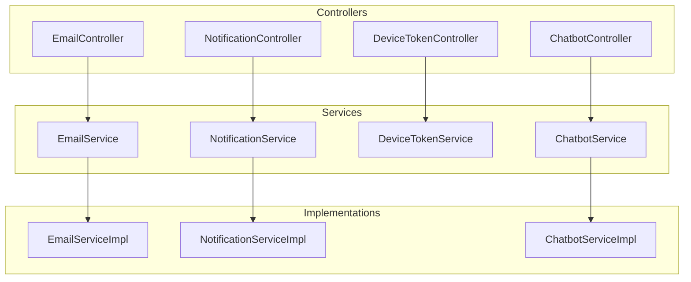
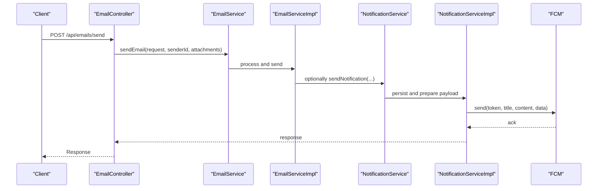
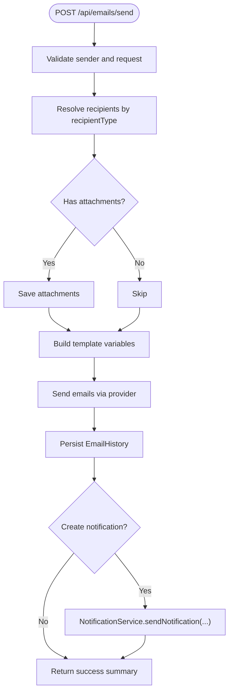
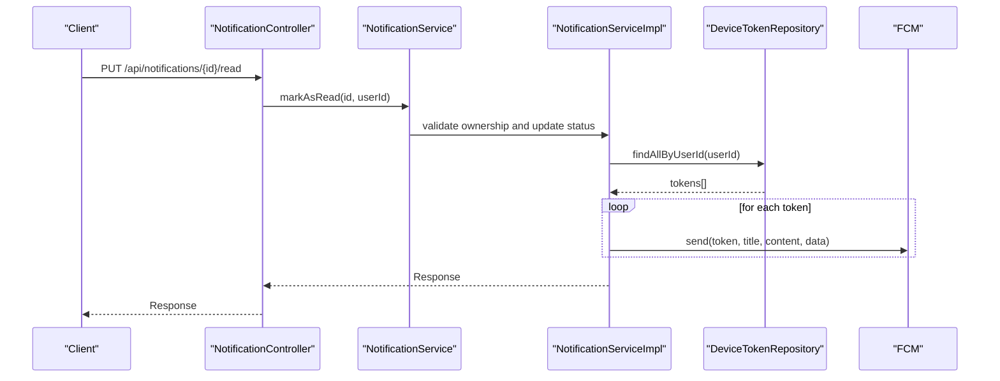
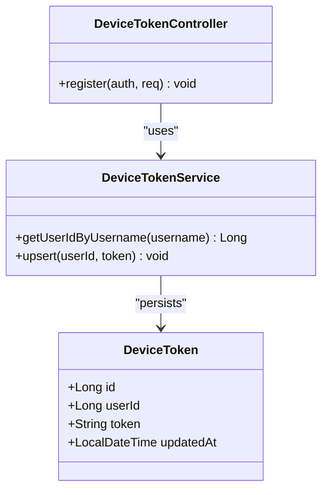
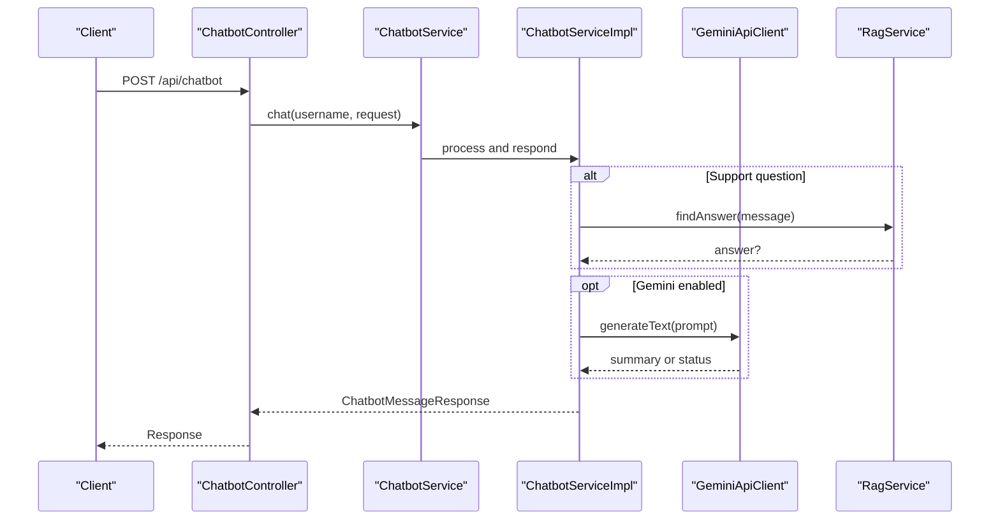
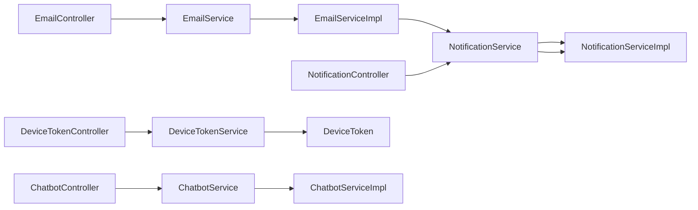

# Communication API

<cite>
**Referenced Files in This Document**
- [EmailController.java](file://src/main/java/vn/campuslife/controller/communication/EmailController.java)
- [NotificationController.java](file://src/main/java/vn/campuslife/controller/communication/NotificationController.java)
- [DeviceTokenController.java](file://src/main/java/vn/campuslife/controller/communication/DeviceTokenController.java)
- [ChatbotController.java](file://src/main/java/vn/campuslife/controller/communication/ChatbotController.java)
- [EmailService.java](file://src/main/java/vn/campuslife/service/EmailService.java)
- [NotificationService.java](file://src/main/java/vn/campuslife/service/NotificationService.java)
- [DeviceTokenService.java](file://src/main/java/vn/campuslife/service/DeviceTokenService.java)
- [ChatbotService.java](file://src/main/java/vn/campuslife/service/ChatbotService.java)
- [EmailServiceImpl.java](file://src/main/java/vn/campuslife/service/impl/EmailServiceImpl.java)
- [NotificationServiceImpl.java](file://src/main/java/vn/campuslife/service/impl/NotificationServiceImpl.java)
- [ChatbotServiceImpl.java](file://src/main/java/vn/campuslife/service/impl/ChatbotServiceImpl.java)
- [SendEmailRequest.java](file://src/main/java/vn/campuslife/model/SendEmailRequest.java)
- [DeviceToken.java](file://src/main/java/vn/campuslife/model/DeviceToken.java)
- [RegisterTokenReq.java](file://src/main/java/vn/campuslife/model/RegisterTokenReq.java)
- [ChatbotMessageRequest.java](file://src/main/java/vn/campuslife/model/ChatbotMessageRequest.java)
- [ChatbotMessageResponse.java](file://src/main/java/vn/campuslife/model/ChatbotMessageResponse.java)
</cite>

## Table of Contents
1. [Introduction](#introduction)
2. [Project Structure](#project-structure)
3. [Core Components](#core-components)
4. [Architecture Overview](#architecture-overview)
5. [Detailed Component Analysis](#detailed-component-analysis)
6. [Dependency Analysis](#dependency-analysis)
7. [Performance Considerations](#performance-considerations)
8. [Troubleshooting Guide](#troubleshooting-guide)
9. [Conclusion](#conclusion)

## Introduction
This document describes the Communication API that powers email management, push notification delivery via Firebase Cloud Messaging (FCM), device token registration, and AI chatbot integration. It covers HTTP endpoints, request/response schemas, delivery tracking, template management, scheduling capabilities, and analytics-ready fields. The API supports multi-channel communication workflows with robust error handling and extensible integrations.

## Project Structure
The Communication API is organized under the communication package with four primary controllers:
- EmailController: Email sending, history, resend, and attachment download
- NotificationController: Notification CRUD, read/archive/delete, and unread counts
- DeviceTokenController: Device token registration/update
- ChatbotController: Chatbot status, Gemini health checks, and conversational messaging

**Diagram sources**
- [EmailController.java:28-241](file://src/main/java/vn/campuslife/controller/communication/EmailController.java#L28-L241)
- [NotificationController.java:15-203](file://src/main/java/vn/campuslife/controller/communication/NotificationController.java#L15-L203)
- [DeviceTokenController.java:8-29](file://src/main/java/vn/campuslife/controller/communication/DeviceTokenController.java#L8-L29)
- [ChatbotController.java:19-101](file://src/main/java/vn/campuslife/controller/communication/ChatbotController.java#L19-L101)
- [EmailService.java:9-36](file://src/main/java/vn/campuslife/service/EmailService.java#L9-L36)
- [NotificationService.java:13-55](file://src/main/java/vn/campuslife/service/NotificationService.java#L13-L55)
- [DeviceTokenService.java:10-41](file://src/main/java/vn/campuslife/service/DeviceTokenService.java#L10-L41)
- [ChatbotService.java:6-9](file://src/main/java/vn/campuslife/service/ChatbotService.java#L6-L9)
- [EmailServiceImpl.java:36-778](file://src/main/java/vn/campuslife/service/impl/EmailServiceImpl.java#L36-L778)
- [NotificationServiceImpl.java:27-420](file://src/main/java/vn/campuslife/service/impl/NotificationServiceImpl.java#L27-L420)
- [ChatbotServiceImpl.java:49-800](file://src/main/java/vn/campuslife/service/impl/ChatbotServiceImpl.java#L49-L800)

**Section sources**
- [EmailController.java:28-241](file://src/main/java/vn/campuslife/controller/communication/EmailController.java#L28-L241)
- [NotificationController.java:15-203](file://src/main/java/vn/campuslife/controller/communication/NotificationController.java#L15-L203)
- [DeviceTokenController.java:8-29](file://src/main/java/vn/campuslife/controller/communication/DeviceTokenController.java#L8-L29)
- [ChatbotController.java:19-101](file://src/main/java/vn/campuslife/controller/communication/ChatbotController.java#L19-L101)

## Core Components
- Email Management
  - Endpoint: POST /api/emails/send (multipart/form-data) and POST /api/emails/send-json (JSON)
  - Features: recipient targeting, templating, HTML/TEXT content, optional attachments, notification creation
  - Tracking: email history with per-recipient status, resend capability, attachment download
- Push Notifications
  - Endpoint: GET /api/notifications, GET /api/notifications/unread, PUT /api/notifications/{id}/read, PUT /api/notifications/read-all, GET /api/notifications/unread-count, DELETE /api/notifications/{id}, PUT /api/notifications/{id}/archive, GET /api/notifications/{id}
  - Delivery: FCM push to registered device tokens
- Device Token Handling
  - Endpoint: POST /api/device-tokens
  - Functionality: register/update device token per user
- AI Chatbot Integration
  - Endpoint: GET /api/chatbot/status, GET /api/chatbot/gemini/ping, GET /api/chatbot/gemini/models, POST /api/chatbot
  - Capabilities: intent detection, activity lookup, article summarization, registration info

**Section sources**
- [EmailController.java:58-115](file://src/main/java/vn/campuslife/controller/communication/EmailController.java#L58-L115)
- [NotificationController.java:26-184](file://src/main/java/vn/campuslife/controller/communication/NotificationController.java#L26-L184)
- [DeviceTokenController.java:18-26](file://src/main/java/vn/campuslife/controller/communication/DeviceTokenController.java#L18-L26)
- [ChatbotController.java:27-98](file://src/main/java/vn/campuslife/controller/communication/ChatbotController.java#L27-L98)

## Architecture Overview
High-level flow for email-to-push delivery:
- EmailController validates and delegates to EmailService
- EmailServiceImpl builds templates, sends emails, records history, optionally creates notifications
- NotificationServiceImpl persists notifications, extracts metadata, and triggers FCM pushes to device tokens
- DeviceTokenService manages device tokens per user

**Diagram sources**
- [EmailController.java:58-84](file://src/main/java/vn/campuslife/controller/communication/EmailController.java#L58-L84)
- [EmailServiceImpl.java:60-240](file://src/main/java/vn/campuslife/service/impl/EmailServiceImpl.java#L60-L240)
- [NotificationServiceImpl.java:42-92](file://src/main/java/vn/campuslife/service/impl/NotificationServiceImpl.java#L42-L92)

## Detailed Component Analysis

### Email Management API
- Endpoints
  - POST /api/emails/send (multipart): Send emails with attachments
  - POST /api/emails/send-json (JSON): Send emails without attachments
  - POST /api/emails/notifications/send: Create notifications without sending email
  - GET /api/emails/history: Paginated email history
  - GET /api/emails/history/{emailId}: Detail by ID
  - POST /api/emails/history/{emailId}/resend: Resend a failed/saved email
  - GET /api/emails/attachments/{attachmentId}/download: Download attachment
- Request Schema: SendEmailRequest
  - recipientType: recipient selection mode
  - recipientIds, activityId, seriesId, classId, departmentId: filters based on recipientType
  - subject, content, isHtml: email content
  - templateVariables: key-value pairs for templating
  - createNotification, notificationTitle, notificationType, notificationActionUrl: optional notification creation
- Response: Generic Response wrapper with status, message, and data
- Delivery Tracking: EmailHistory entries with per-recipient status, error messages, and attachment linkage
- Attachment Handling: Stored under configured upload directory, downloadable via dedicated endpoint

**Diagram sources**
- [EmailController.java:58-115](file://src/main/java/vn/campuslife/controller/communication/EmailController.java#L58-L115)
- [EmailServiceImpl.java:60-240](file://src/main/java/vn/campuslife/service/impl/EmailServiceImpl.java#L60-L240)

**Section sources**
- [EmailController.java:58-222](file://src/main/java/vn/campuslife/controller/communication/EmailController.java#L58-L222)
- [EmailService.java:9-36](file://src/main/java/vn/campuslife/service/EmailService.java#L9-L36)
- [EmailServiceImpl.java:60-403](file://src/main/java/vn/campuslife/service/impl/EmailServiceImpl.java#L60-L403)
- [SendEmailRequest.java:11-33](file://src/main/java/vn/campuslife/model/SendEmailRequest.java#L11-L33)

### Notification Management API
- Endpoints
  - GET /api/notifications: List user notifications (paginated)
  - GET /api/notifications/unread: Unread notifications
  - PUT /api/notifications/{id}/read: Mark as read
  - PUT /api/notifications/read-all: Mark all as read
  - GET /api/notifications/unread-count: Count unread
  - DELETE /api/notifications/{id}: Archive/delete
  - PUT /api/notifications/{id}/archive: Archive
  - GET /api/notifications/{id}: Detail with parsed metadata
- Metadata: JSON stored in notification metadata field; supports activityId and seriesId for routing
- Delivery: FCM push to all device tokens associated with the user
- Asynchronous bulk delivery: Parallel FCM dispatch with logging

**Diagram sources**
- [NotificationController.java:66-81](file://src/main/java/vn/campuslife/controller/communication/NotificationController.java#L66-L81)
- [NotificationServiceImpl.java:264-284](file://src/main/java/vn/campuslife/service/impl/NotificationServiceImpl.java#L264-L284)

**Section sources**
- [NotificationController.java:26-184](file://src/main/java/vn/campuslife/controller/communication/NotificationController.java#L26-L184)
- [NotificationService.java:13-55](file://src/main/java/vn/campuslife/service/NotificationService.java#L13-L55)
- [NotificationServiceImpl.java:42-370](file://src/main/java/vn/campuslife/service/impl/NotificationServiceImpl.java#L42-L370)

### Device Token Management API
- Endpoint: POST /api/device-tokens
- Behavior: Upserts device token for authenticated user; updates timestamp on change
- Model: DeviceToken entity with unique token constraint

**Diagram sources**
- [DeviceTokenController.java:18-26](file://src/main/java/vn/campuslife/controller/communication/DeviceTokenController.java#L18-L26)
- [DeviceTokenService.java:21-38](file://src/main/java/vn/campuslife/service/DeviceTokenService.java#L21-L38)
- [DeviceToken.java:14-28](file://src/main/java/vn/campuslife/model/DeviceToken.java#L14-L28)

**Section sources**
- [DeviceTokenController.java:18-26](file://src/main/java/vn/campuslife/controller/communication/DeviceTokenController.java#L18-L26)
- [DeviceTokenService.java:21-38](file://src/main/java/vn/campuslife/service/DeviceTokenService.java#L21-L38)
- [DeviceToken.java:14-28](file://src/main/java/vn/campuslife/model/DeviceToken.java#L14-L28)

### Chatbot Integration API
- Endpoints
  - GET /api/chatbot/status: Chatbot availability and model
  - GET /api/chatbot/gemini/ping: Health check against Gemini
  - GET /api/chatbot/gemini/models: Available models
  - POST /api/chatbot: Chat message with context
- Request Schema: ChatbotMessageRequest
  - conversationId, contextActivityId, contextArticleSlug, pageContext, message
- Response Schema: ChatbotMessageResponse
  - conversationId, answer, resolvedActivity, needsClarification, activityOptions
- Behavior: Intent detection, activity/article lookup, registration info, and RAG-backed support

**Diagram sources**
- [ChatbotController.java:82-98](file://src/main/java/vn/campuslife/controller/communication/ChatbotController.java#L82-L98)
- [ChatbotServiceImpl.java:71-102](file://src/main/java/vn/campuslife/service/impl/ChatbotServiceImpl.java#L71-L102)
- [ChatbotMessageRequest.java:7-13](file://src/main/java/vn/campuslife/model/ChatbotMessageRequest.java#L7-L13)
- [ChatbotMessageResponse.java:13-19](file://src/main/java/vn/campuslife/model/ChatbotMessageResponse.java#L13-L19)

**Section sources**
- [ChatbotController.java:27-98](file://src/main/java/vn/campuslife/controller/communication/ChatbotController.java#L27-L98)
- [ChatbotService.java:6-9](file://src/main/java/vn/campuslife/service/ChatbotService.java#L6-L9)
- [ChatbotServiceImpl.java:71-800](file://src/main/java/vn/campuslife/service/impl/ChatbotServiceImpl.java#L71-L800)
- [ChatbotMessageRequest.java:7-13](file://src/main/java/vn/campuslife/model/ChatbotMessageRequest.java#L7-L13)
- [ChatbotMessageResponse.java:13-19](file://src/main/java/vn/campuslife/model/ChatbotMessageResponse.java#L13-L19)

## Dependency Analysis
- Controllers depend on services for business logic
- Services depend on repositories and external integrations (email provider, FCM)
- EmailServiceImpl orchestrates template processing, email sending, and optional notification creation
- NotificationServiceImpl persists notifications and dispatches FCM pushes to device tokens
- ChatbotServiceImpl integrates NLU, activity/article lookup, and Gemini/RAG for answers

**Diagram sources**
- [EmailController.java:35-37](file://src/main/java/vn/campuslife/controller/communication/EmailController.java#L35-L37)
- [NotificationController.java:20-21](file://src/main/java/vn/campuslife/controller/communication/NotificationController.java#L20-L21)
- [DeviceTokenController.java:12-15](file://src/main/java/vn/campuslife/controller/communication/DeviceTokenController.java#L12-L15)
- [ChatbotController.java:24-25](file://src/main/java/vn/campuslife/controller/communication/ChatbotController.java#L24-L25)
- [EmailServiceImpl.java:42-53](file://src/main/java/vn/campuslife/service/impl/EmailServiceImpl.java#L42-L53)
- [NotificationServiceImpl.java:33-39](file://src/main/java/vn/campuslife/service/impl/NotificationServiceImpl.java#L33-L39)
- [ChatbotServiceImpl.java:61-70](file://src/main/java/vn/campuslife/service/impl/ChatbotServiceImpl.java#L61-L70)

**Section sources**
- [EmailServiceImpl.java:42-53](file://src/main/java/vn/campuslife/service/impl/EmailServiceImpl.java#L42-L53)
- [NotificationServiceImpl.java:33-39](file://src/main/java/vn/campuslife/service/impl/NotificationServiceImpl.java#L33-L39)
- [ChatbotServiceImpl.java:61-70](file://src/main/java/vn/campuslife/service/impl/ChatbotServiceImpl.java#L61-L70)

## Performance Considerations
- Email sending loops per recipient; consider batching and async FCM dispatch for large audiences
- Attachment storage: enforce size limits and cleanup policies
- Notification delivery: asynchronous bulk notifications reduce latency and improve throughput
- Template processing: cache frequently used templates and variables
- Chatbot: Gemini calls are rate-limited; implement retry/backoff and fallback responses

## Troubleshooting Guide
- Email sending errors
  - Validate subject/content/recipients; check template variable resolution
  - Review EmailHistory entries for per-recipient statuses and error messages
  - Use resend endpoint for failed deliveries
- Notification delivery failures
  - Verify device tokens exist for the user
  - Inspect FCM logs and token validity
- Chatbot/Gemini issues
  - Use /api/chatbot/gemini/ping to diagnose connectivity and quota
  - Confirm GEMINI_API_KEY configuration and model availability

**Section sources**
- [EmailServiceImpl.java:187-208](file://src/main/java/vn/campuslife/service/impl/EmailServiceImpl.java#L187-L208)
- [NotificationServiceImpl.java:198-206](file://src/main/java/vn/campuslife/service/impl/NotificationServiceImpl.java#L198-L206)
- [ChatbotController.java:35-67](file://src/main/java/vn/campuslife/controller/communication/ChatbotController.java#L35-L67)

## Conclusion
The Communication API provides a cohesive set of endpoints for email, push notifications, device token management, and AI chatbot assistance. It emphasizes flexible recipient targeting, robust delivery tracking, and extensibility for third-party integrations like FCM and Gemini. By leveraging the documented schemas and workflows, teams can implement reliable communication automation and analytics-ready tracking.