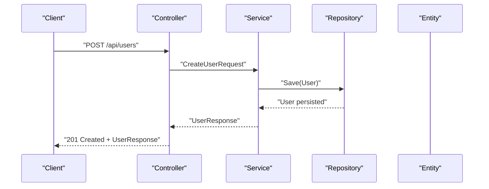
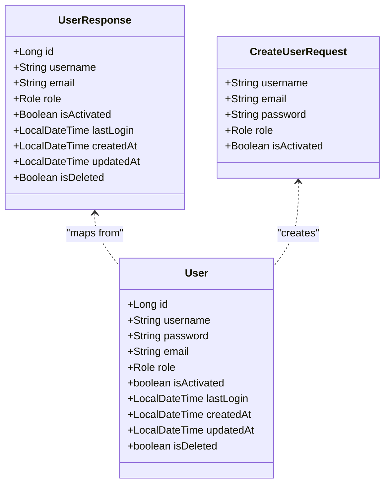
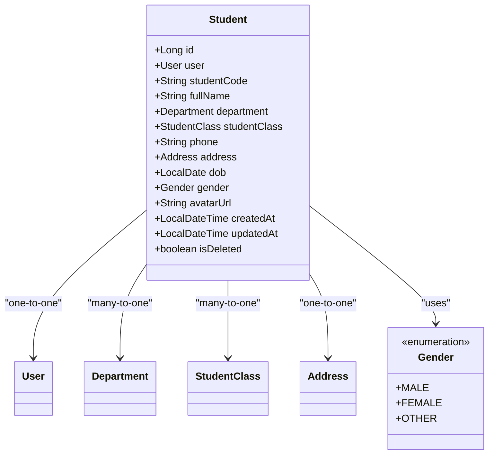
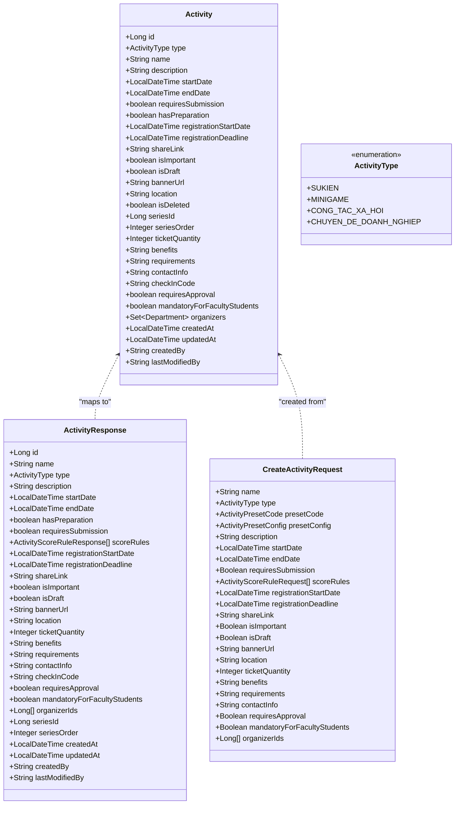
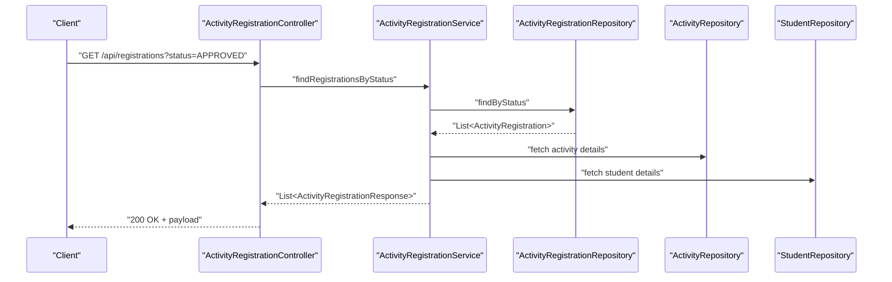
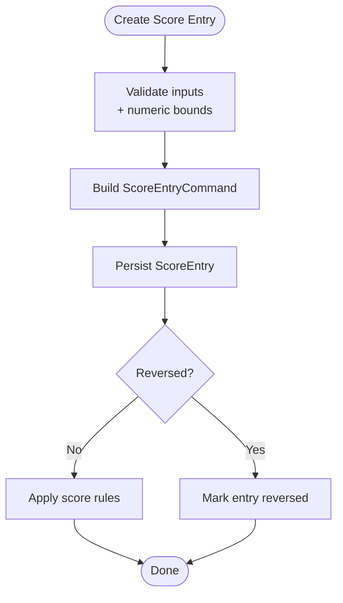
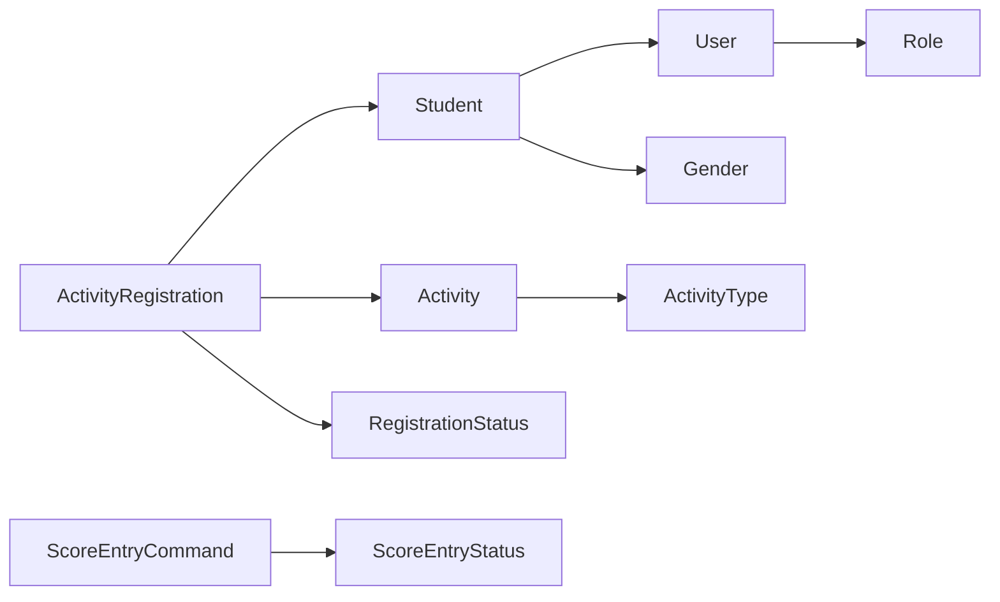

# Data Models and Schemas

<cite>
**Referenced Files in This Document**
- [User.java](file://src/main/java/vn/campuslife/entity/User.java)
- [Role.java](file://src/main/java/vn/campuslife/enumeration/Role.java)
- [UserResponse.java](file://src/main/java/vn/campuslife/model/UserResponse.java)
- [CreateUserRequest.java](file://src/main/java/vn/campuslife/model/CreateUserRequest.java)
- [Student.java](file://src/main/java/vn/campuslife/entity/Student.java)
- [Gender.java](file://src/main/java/vn/campuslife/enumeration/Gender.java)
- [Activity.java](file://src/main/java/vn/campuslife/entity/Activity.java)
- [ActivityType.java](file://src/main/java/vn/campuslife/enumeration/ActivityType.java)
- [ActivityResponse.java](file://src/main/java/vn/campuslife/model/activity/ActivityResponse.java)
- [CreateActivityRequest.java](file://src/main/java/vn/campuslife/model/activity/CreateActivityRequest.java)
- [RegistrationStatus.java](file://src/main/java/vn/campuslife/enumeration/RegistrationStatus.java)
- [ActivityRegistration.java](file://src/main/java/vn/campuslife/entity/ActivityRegistration.java)
- [ActivityRegistrationResponse.java](file://src/main/java/vn/campuslife/model/activity/ActivityRegistrationResponse.java)
- [ScoreEntryCommand.java](file://src/main/java/vn/campuslife/model/score/ScoreEntryCommand.java)
- [ScoreEntryStatus.java](file://src/main/java/vn/campuslife/enumeration/ScoreEntryStatus.java)
</cite>

## Table of Contents
1. [Introduction](#introduction)
2. [Project Structure](#project-structure)
3. [Core Components](#core-components)
4. [Architecture Overview](#architecture-overview)
5. [Detailed Component Analysis](#detailed-component-analysis)
6. [Dependency Analysis](#dependency-analysis)
7. [Performance Considerations](#performance-considerations)
8. [Troubleshooting Guide](#troubleshooting-guide)
9. [Conclusion](#conclusion)
10. [Appendices](#appendices)

## Introduction
This document specifies the data models, request/response schemas, and enumerations used across the API. It defines entity relationships, field definitions, validation rules, data types, and business constraints for payloads exchanged by the backend. It also documents pagination and filtering patterns commonly used in API endpoints, and presents end-to-end request/response examples and data transformation flows.

## Project Structure
The API organizes data models by domain:
- Entities define persistent structures and relationships (e.g., User, Student, Activity).
- Enumerations define constrained sets of values (e.g., Role, Gender, ActivityType).
- Model classes represent request/response DTOs (e.g., CreateUserRequest, ActivityResponse).

```mermaid
graph TB
subgraph "Entities"
U["User"]
S["Student"]
A["Activity"]
AR["ActivityRegistration"]
end
subgraph "DTOs"
UR["UserResponse"]
CR["CreateUserRequest"]
ARsp["ActivityResponse"]
CAR["CreateActivityRequest"]
ARRsp["ActivityRegistrationResponse"]
SEC["ScoreEntryCommand"]
end
subgraph "Enums"
R["Role"]
G["Gender"]
AT["ActivityType"]
RS["RegistrationStatus"]
SES["ScoreEntryStatus"]
end
U --> S
S -.-> A
A <-- AR
S <-- AR
CR --> R
UR --> R
CAR --> AT
ARsp --> AT
ARRsp --> RS
SEC --> SES
```

**Diagram sources**
- [User.java:19-50](file://src/main/java/vn/campuslife/entity/User.java#L19-L50)
- [Student.java:27-78](file://src/main/java/vn/campuslife/entity/Student.java#L27-L78)
- [Activity.java:27-171](file://src/main/java/vn/campuslife/entity/Activity.java#L27-L171)
- [ActivityRegistration.java:18-47](file://src/main/java/vn/campuslife/entity/ActivityRegistration.java#L18-L47)
- [UserResponse.java:9-19](file://src/main/java/vn/campuslife/model/UserResponse.java#L9-L19)
- [CreateUserRequest.java:7-13](file://src/main/java/vn/campuslife/model/CreateUserRequest.java#L7-L13)
- [ActivityResponse.java:12-51](file://src/main/java/vn/campuslife/model/activity/ActivityResponse.java#L12-L51)
- [CreateActivityRequest.java:12-38](file://src/main/java/vn/campuslife/model/activity/CreateActivityRequest.java#L12-L38)
- [ActivityRegistrationResponse.java:14-36](file://src/main/java/vn/campuslife/model/activity/ActivityRegistrationResponse.java#L14-L36)
- [ScoreEntryCommand.java:13-25](file://src/main/java/vn/campuslife/model/score/ScoreEntryCommand.java#L13-L25)
- [Role.java:3-7](file://src/main/java/vn/campuslife/enumeration/Role.java#L3-L7)
- [Gender.java:3-7](file://src/main/java/vn/campuslife/enumeration/Gender.java#L3-L7)
- [ActivityType.java:3-8](file://src/main/java/vn/campuslife/enumeration/ActivityType.java#L3-L8)
- [RegistrationStatus.java:3-10](file://src/main/java/vn/campuslife/enumeration/RegistrationStatus.java#L3-L10)
- [ScoreEntryStatus.java:3-7](file://src/main/java/vn/campuslife/enumeration/ScoreEntryStatus.java#L3-L7)

**Section sources**
- [User.java:19-50](file://src/main/java/vn/campuslife/entity/User.java#L19-L50)
- [Student.java:27-78](file://src/main/java/vn/campuslife/entity/Student.java#L27-L78)
- [Activity.java:27-171](file://src/main/java/vn/campuslife/entity/Activity.java#L27-L171)
- [ActivityRegistration.java:18-47](file://src/main/java/vn/campuslife/entity/ActivityRegistration.java#L18-L47)
- [UserResponse.java:9-19](file://src/main/java/vn/campuslife/model/UserResponse.java#L9-L19)
- [CreateUserRequest.java:7-13](file://src/main/java/vn/campuslife/model/CreateUserRequest.java#L7-L13)
- [ActivityResponse.java:12-51](file://src/main/java/vn/campuslife/model/activity/ActivityResponse.java#L12-L51)
- [CreateActivityRequest.java:12-38](file://src/main/java/vn/campuslife/model/activity/CreateActivityRequest.java#L12-L38)
- [ActivityRegistrationResponse.java:14-36](file://src/main/java/vn/campuslife/model/activity/ActivityRegistrationResponse.java#L14-L36)
- [ScoreEntryCommand.java:13-25](file://src/main/java/vn/campuslife/model/score/ScoreEntryCommand.java#L13-L25)
- [Role.java:3-7](file://src/main/java/vn/campuslife/enumeration/Role.java#L3-L7)
- [Gender.java:3-7](file://src/main/java/vn/campuslife/enumeration/Gender.java#L3-L7)
- [ActivityType.java:3-8](file://src/main/java/vn/campuslife/enumeration/ActivityType.java#L3-L8)
- [RegistrationStatus.java:3-10](file://src/main/java/vn/campuslife/enumeration/RegistrationStatus.java#L3-L10)
- [ScoreEntryStatus.java:3-7](file://src/main/java/vn/campuslife/enumeration/ScoreEntryStatus.java#L3-L7)

## Core Components
This section catalogs the primary data models, their fields, types, and constraints, along with associated request/response DTOs and enumerations.

### User
- Purpose: Core identity and authentication record.
- Fields:
  - id: Long, auto-generated primary key.
  - username: String, unique, not null.
  - password: String, not null (hashed).
  - email: String, unique, not null.
  - role: Role, not null.
  - isActivated: boolean, not null, default false.
  - lastLogin: LocalDateTime.
  - createdAt: LocalDateTime (audit).
  - updatedAt: LocalDateTime (audit).
  - isDeleted: boolean, not null, default false.
- Validation rules:
  - username and email uniqueness enforced at database level.
  - role must be one of ADMIN, MANAGER, STUDENT.
  - isActivated defaults to false; isDeleted defaults to false.
- Business constraints:
  - Password stored as hash; never exposed in responses.

**Section sources**
- [User.java:19-50](file://src/main/java/vn/campuslife/entity/User.java#L19-L50)
- [Role.java:3-7](file://src/main/java/vn/campuslife/enumeration/Role.java#L3-L7)

### Student
- Purpose: Student profile linked to a User account.
- Fields:
  - id: Long, auto-generated primary key.
  - user: User, one-to-one, unique, not null.
  - studentCode: String, unique.
  - fullName: String.
  - department: Department, many-to-one (organization).
  - studentClass: StudentClass, many-to-one (class).
  - phone: String.
  - address: Address, one-to-one (mapped).
  - dob: LocalDate.
  - gender: Gender enum.
  - avatarUrl: String.
  - createdAt: LocalDateTime (audit).
  - updatedAt: LocalDateTime (audit).
  - isDeleted: boolean, not null, default false.
- Validation rules:
  - studentCode unique; user unique and not null.
  - Many relationships optional unless otherwise noted.
- Business constraints:
  - Gender enum restricted to MALE, FEMALE, OTHER.
  - Soft delete flag present.

**Section sources**
- [Student.java:27-78](file://src/main/java/vn/campuslife/entity/Student.java#L27-L78)
- [Gender.java:3-7](file://src/main/java/vn/campuslife/enumeration/Gender.java#L3-L7)

### Activity
- Purpose: Defines events and activities with metadata, scheduling, and registration controls.
- Fields:
  - id: Long, auto-generated primary key.
  - type: ActivityType, nullable (null for series children).
  - name: String, not null.
  - description: TEXT.
  - startDate: LocalDateTime.
  - endDate: LocalDateTime.
  - requiresSubmission: boolean, not null, default false.
  - hasPreparation: boolean, not null, default false.
  - registrationStartDate: LocalDateTime.
  - registrationDeadline: LocalDateTime.
  - shareLink: String.
  - isImportant: boolean, not null, default false.
  - isDraft: boolean, not null, default true.
  - bannerUrl: String.
  - location: String.
  - isDeleted: boolean, not null, default false.
  - seriesId: Long, nullable (series parent).
  - seriesOrder: Integer, nullable.
  - ticketQuantity: Integer, nullable.
  - benefits: TEXT.
  - requirements: TEXT.
  - contactInfo: String.
  - checkInCode: String, unique, length 50.
  - requiresApproval: boolean, not null, default true.
  - mandatoryForFacultyStudents: boolean, not null, default false.
  - organizers: Set<Department>, many-to-many via join table.
  - createdAt: LocalDateTime (audit).
  - updatedAt: LocalDateTime (audit).
  - createdBy: String (audit).
  - lastModifiedBy: String (audit).
- Validation rules:
  - type is constrained to SUKIEN, MINIGAME, CONG_TAC_XA_HOI, CHUYEN_DE_DOANH_NGHIEP.
  - seriesId and seriesOrder form a grouping for chained activities.
  - checkInCode unique and limited length.
  - registration deadline after start date recommended by business logic.
- Business constraints:
  - Draft vs published controlled by isDraft.
  - Approval gating via requiresApproval.
  - Soft delete via isDeleted.

**Section sources**
- [Activity.java:27-171](file://src/main/java/vn/campuslife/entity/Activity.java#L27-L171)
- [ActivityType.java:3-8](file://src/main/java/vn/campuslife/enumeration/ActivityType.java#L3-L8)

### ActivityRegistration
- Purpose: Tracks individual student participation and registration state.
- Fields:
  - id: Long, auto-generated primary key.
  - activity: Activity, many-to-one, not null.
  - student: Student, many-to-one, not null.
  - seriesId: Long, nullable (chain linkage).
  - registeredDate: LocalDateTime.
  - status: RegistrationStatus, not null.
  - createdAt: LocalDateTime (audit).
  - ticketCode: String, unique, length 20.
- Validation rules:
  - Unique ticketCode enforced.
  - Status constrained to PENDING, APPROVED, REJECTED, CANCELLED, ATTENDED, WAITLIST.
- Business constraints:
  - Associates a student to an activity with approval/waitlist logic.
  - Optional chaining via seriesId for series-based registrations.

**Section sources**
- [ActivityRegistration.java:18-47](file://src/main/java/vn/campuslife/entity/ActivityRegistration.java#L18-L47)
- [RegistrationStatus.java:3-10](file://src/main/java/vn/campuslife/enumeration/RegistrationStatus.java#L3-L10)

### ScoreEntryCommand
- Purpose: Command object to create or reverse score entries.
- Fields:
  - studentId: Long.
  - activityId: Long.
  - ruleId: Long.
  - semesterId: Long.
  - scoreType: ScoreType.
  - sourceType: ScoreEntrySourceType.
  - sourceId: Long.
  - points: BigDecimal.
  - reason: String.
  - actor: User (context).
- Validation rules:
  - Numeric precision for points depends on storage; reason required for audit.
- Business constraints:
  - Links scoring to students, activities, and rules.
  - Supports reversal via ScoreEntryStatus.

**Section sources**
- [ScoreEntryCommand.java:13-25](file://src/main/java/vn/campuslife/model/score/ScoreEntryCommand.java#L13-L25)
- [ScoreEntryStatus.java:3-7](file://src/main/java/vn/campuslife/enumeration/ScoreEntryStatus.java#L3-L7)

## Architecture Overview
The API follows a layered architecture:
- Controllers expose endpoints returning DTOs.
- Services orchestrate business logic and map to/from entities.
- Repositories persist entities.
- DTOs decouple public contracts from internal entities.



[No sources needed since this diagram shows conceptual workflow, not actual code structure]

## Detailed Component Analysis

### User Domain
- Entity: User
  - Identity and credentials.
  - Role-driven permissions.
- DTOs:
  - CreateUserRequest: username, email, password, role, isActivated (nullable).
  - UserResponse: id, username, email, role, flags, timestamps, isDeleted.



**Diagram sources**
- [User.java:19-50](file://src/main/java/vn/campuslife/entity/User.java#L19-L50)
- [UserResponse.java:9-19](file://src/main/java/vn/campuslife/model/UserResponse.java#L9-L19)
- [CreateUserRequest.java:7-13](file://src/main/java/vn/campuslife/model/CreateUserRequest.java#L7-L13)
- [Role.java:3-7](file://src/main/java/vn/campuslife/enumeration/Role.java#L3-L7)

**Section sources**
- [User.java:19-50](file://src/main/java/vn/campuslife/entity/User.java#L19-L50)
- [UserResponse.java:9-19](file://src/main/java/vn/campuslife/model/UserResponse.java#L9-L19)
- [CreateUserRequest.java:7-13](file://src/main/java/vn/campuslife/model/CreateUserRequest.java#L7-L13)
- [Role.java:3-7](file://src/main/java/vn/campuslife/enumeration/Role.java#L3-L7)

### Student Domain
- Entity: Student
  - One-to-one with User.
  - Many-to-one with Department and StudentClass.
  - Embedded Address via one-to-one.
- Enums: Gender restricted set.



**Diagram sources**
- [Student.java:27-78](file://src/main/java/vn/campuslife/entity/Student.java#L27-L78)
- [Gender.java:3-7](file://src/main/java/vn/campuslife/enumeration/Gender.java#L3-L7)

**Section sources**
- [Student.java:27-78](file://src/main/java/vn/campuslife/entity/Student.java#L27-L78)
- [Gender.java:3-7](file://src/main/java/vn/campuslife/enumeration/Gender.java#L3-L7)

### Activity Domain
- Entity: Activity
  - Rich metadata, scheduling, registration windows, and flags.
  - Many-to-many organizers via join table.
- DTOs:
  - CreateActivityRequest: name, type/preset, dates, flags, organizers, rules.
  - ActivityResponse: similar fields plus computed lists and audit info.



**Diagram sources**
- [Activity.java:27-171](file://src/main/java/vn/campuslife/entity/Activity.java#L27-L171)
- [ActivityType.java:3-8](file://src/main/java/vn/campuslife/enumeration/ActivityType.java#L3-L8)
- [CreateActivityRequest.java:12-38](file://src/main/java/vn/campuslife/model/activity/CreateActivityRequest.java#L12-L38)
- [ActivityResponse.java:12-51](file://src/main/java/vn/campuslife/model/activity/ActivityResponse.java#L12-L51)

**Section sources**
- [Activity.java:27-171](file://src/main/java/vn/campuslife/entity/Activity.java#L27-L171)
- [ActivityType.java:3-8](file://src/main/java/vn/campuslife/enumeration/ActivityType.java#L3-L8)
- [CreateActivityRequest.java:12-38](file://src/main/java/vn/campuslife/model/activity/CreateActivityRequest.java#L12-L38)
- [ActivityResponse.java:12-51](file://src/main/java/vn/campuslife/model/activity/ActivityResponse.java#L12-L51)

### Registration Domain
- Entity: ActivityRegistration
  - Links Student to Activity with status and ticket code.
- DTO: ActivityRegistrationResponse
  - Includes activity metadata, student info, status, timestamps, and scoring type.



**Diagram sources**
- [ActivityRegistration.java:18-47](file://src/main/java/vn/campuslife/entity/ActivityRegistration.java#L18-L47)
- [ActivityRegistrationResponse.java:14-36](file://src/main/java/vn/campuslife/model/activity/ActivityRegistrationResponse.java#L14-L36)
- [RegistrationStatus.java:3-10](file://src/main/java/vn/campuslife/enumeration/RegistrationStatus.java#L3-L10)

**Section sources**
- [ActivityRegistration.java:18-47](file://src/main/java/vn/campuslife/entity/ActivityRegistration.java#L18-L47)
- [ActivityRegistrationResponse.java:14-36](file://src/main/java/vn/campuslife/model/activity/ActivityRegistrationResponse.java#L14-L36)
- [RegistrationStatus.java:3-10](file://src/main/java/vn/campuslife/enumeration/RegistrationStatus.java#L3-L10)

### Scoring Domain
- DTO: ScoreEntryCommand
  - Encapsulates scoring operation parameters and context.



**Diagram sources**
- [ScoreEntryCommand.java:13-25](file://src/main/java/vn/campuslife/model/score/ScoreEntryCommand.java#L13-L25)
- [ScoreEntryStatus.java:3-7](file://src/main/java/vn/campuslife/enumeration/ScoreEntryStatus.java#L3-L7)

**Section sources**
- [ScoreEntryCommand.java:13-25](file://src/main/java/vn/campuslife/model/score/ScoreEntryCommand.java#L13-L25)
- [ScoreEntryStatus.java:3-7](file://src/main/java/vn/campuslife/enumeration/ScoreEntryStatus.java#L3-L7)

## Dependency Analysis
- Entities depend on enums for constrained values.
- DTOs depend on enums and other DTOs for composite responses.
- Controllers depend on services; services depend on repositories and map DTOs to entities.



**Diagram sources**
- [User.java:33-35](file://src/main/java/vn/campuslife/entity/User.java#L33-L35)
- [Student.java:64-66](file://src/main/java/vn/campuslife/entity/Student.java#L64-L66)
- [Activity.java:36-39](file://src/main/java/vn/campuslife/entity/Activity.java#L36-L39)
- [ActivityRegistration.java:38-40](file://src/main/java/vn/campuslife/entity/ActivityRegistration.java#L38-L40)
- [ScoreEntryCommand.java:18-23](file://src/main/java/vn/campuslife/model/score/ScoreEntryCommand.java#L18-L23)
- [Role.java:3-7](file://src/main/java/vn/campuslife/enumeration/Role.java#L3-L7)
- [Gender.java:3-7](file://src/main/java/vn/campuslife/enumeration/Gender.java#L3-L7)
- [ActivityType.java:3-8](file://src/main/java/vn/campuslife/enumeration/ActivityType.java#L3-L8)
- [RegistrationStatus.java:3-10](file://src/main/java/vn/campuslife/enumeration/RegistrationStatus.java#L3-L10)
- [ScoreEntryStatus.java:3-7](file://src/main/java/vn/campuslife/enumeration/ScoreEntryStatus.java#L3-L7)

**Section sources**
- [User.java:33-35](file://src/main/java/vn/campuslife/entity/User.java#L33-L35)
- [Student.java:64-66](file://src/main/java/vn/campuslife/entity/Student.java#L64-L66)
- [Activity.java:36-39](file://src/main/java/vn/campuslife/entity/Activity.java#L36-L39)
- [ActivityRegistration.java:38-40](file://src/main/java/vn/campuslife/entity/ActivityRegistration.java#L38-L40)
- [ScoreEntryCommand.java:18-23](file://src/main/java/vn/campuslife/model/score/ScoreEntryCommand.java#L18-L23)
- [Role.java:3-7](file://src/main/java/vn/campuslife/enumeration/Role.java#L3-L7)
- [Gender.java:3-7](file://src/main/java/vn/campuslife/enumeration/Gender.java#L3-L7)
- [ActivityType.java:3-8](file://src/main/java/vn/campuslife/enumeration/ActivityType.java#L3-L8)
- [RegistrationStatus.java:3-10](file://src/main/java/vn/campuslife/enumeration/RegistrationStatus.java#L3-L10)
- [ScoreEntryStatus.java:3-7](file://src/main/java/vn/campuslife/enumeration/ScoreEntryStatus.java#L3-L7)

## Performance Considerations
- Prefer paginated queries for lists (e.g., registrations, activities) to limit payload sizes.
- Use filtering by status, date ranges, and IDs to reduce dataset volume.
- Batch operations for bulk creation (e.g., students, registrations) to minimize round trips.
- Indexes on frequently filtered columns (e.g., checkInCode, ticketCode, seriesId) improve lookup performance.

[No sources needed since this section provides general guidance]

## Troubleshooting Guide
- Unique constraint violations:
  - username, email, studentCode, checkInCode, ticketCode must be unique; handle 409 Conflict gracefully.
- Enum mismatch:
  - Ensure incoming values match declared enums (e.g., Role, Gender, ActivityType, RegistrationStatus).
- Registration lifecycle:
  - Verify status transitions align with business rules (e.g., PENDING -> APPROVED/REJECTED/CANCELLED).
- Audit fields:
  - createdBy/lastModifiedBy should be populated via authenticated context; confirm presence in requests/responses.

**Section sources**
- [User.java:24-31](file://src/main/java/vn/campuslife/entity/User.java#L24-L31)
- [Student.java:37-38](file://src/main/java/vn/campuslife/entity/Student.java#L37-L38)
- [Activity.java:131-133](file://src/main/java/vn/campuslife/entity/Activity.java#L131-L133)
- [ActivityRegistration.java:44-45](file://src/main/java/vn/campuslife/entity/ActivityRegistration.java#L44-L45)

## Conclusion
This document standardized the API’s data contracts across identity, student profiles, activities, registrations, and scoring. By adhering to the enumerated types, DTO schemas, and validation rules outlined here, clients can reliably exchange data with predictable shapes and constraints.

[No sources needed since this section summarizes without analyzing specific files]

## Appendices

### Request/Response Examples

- Create User
  - Request: CreateUserRequest
    - Fields: username, email, password, role, isActivated (optional)
  - Response: UserResponse
    - Fields: id, username, email, role, isActivated, timestamps, isDeleted

- Create Activity
  - Request: CreateActivityRequest
    - Fields: name, type/preset, description, dates, flags, organizers, rules
  - Response: ActivityResponse
    - Fields: id, name, type, schedule, flags, organizers, audit fields

- Register for Activity
  - Response: ActivityRegistrationResponse
    - Fields: registration identifiers, activity metadata, student info, status, timestamps, ticketCode, series linkage, scoreType

**Section sources**
- [CreateUserRequest.java:7-13](file://src/main/java/vn/campuslife/model/CreateUserRequest.java#L7-L13)
- [UserResponse.java:9-19](file://src/main/java/vn/campuslife/model/UserResponse.java#L9-L19)
- [CreateActivityRequest.java:12-38](file://src/main/java/vn/campuslife/model/activity/CreateActivityRequest.java#L12-L38)
- [ActivityResponse.java:12-51](file://src/main/java/vn/campuslife/model/activity/ActivityResponse.java#L12-L51)
- [ActivityRegistrationResponse.java:14-36](file://src/main/java/vn/campuslife/model/activity/ActivityRegistrationResponse.java#L14-L36)

### Pagination and Filtering Patterns
- Pagination:
  - Use page and size query parameters; return total elements and pages alongside data.
- Filtering:
  - Filter by status (RegistrationStatus), date ranges (startDate, endDate), IDs (activityId, studentId), and flags (isImportant, isDraft).
- Sorting:
  - Sort by createdAt, updatedAt, registrationStartDate, or name as appropriate.

[No sources needed since this section provides general guidance]