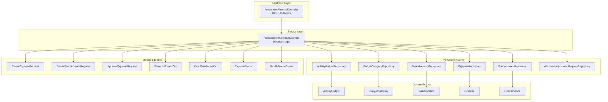
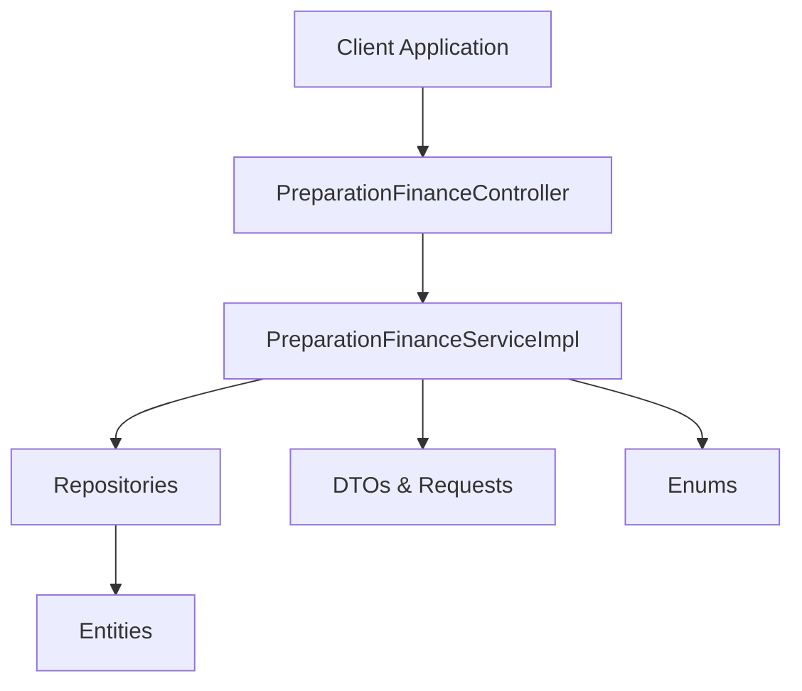
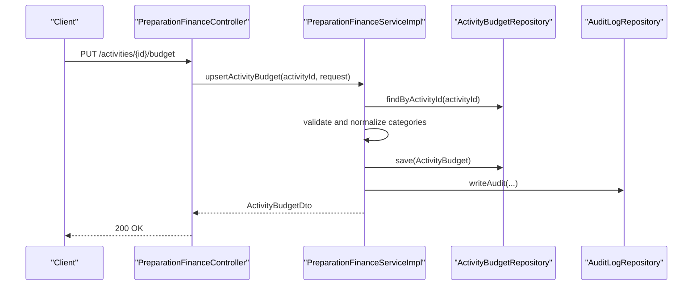
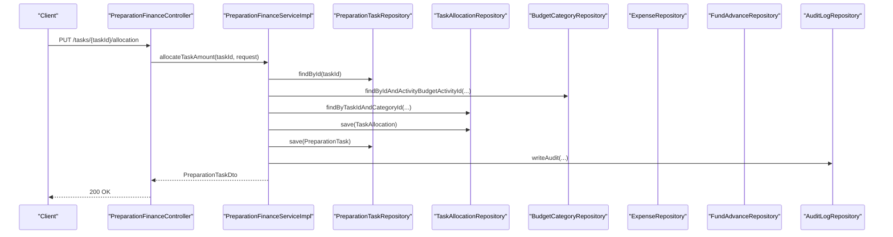
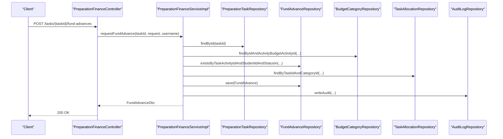
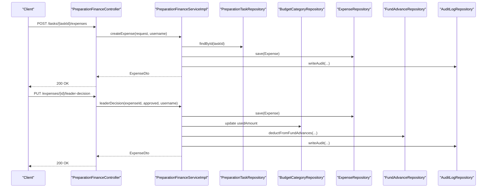
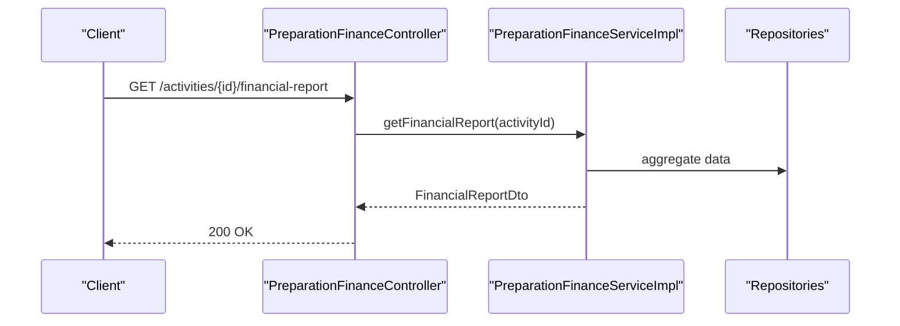
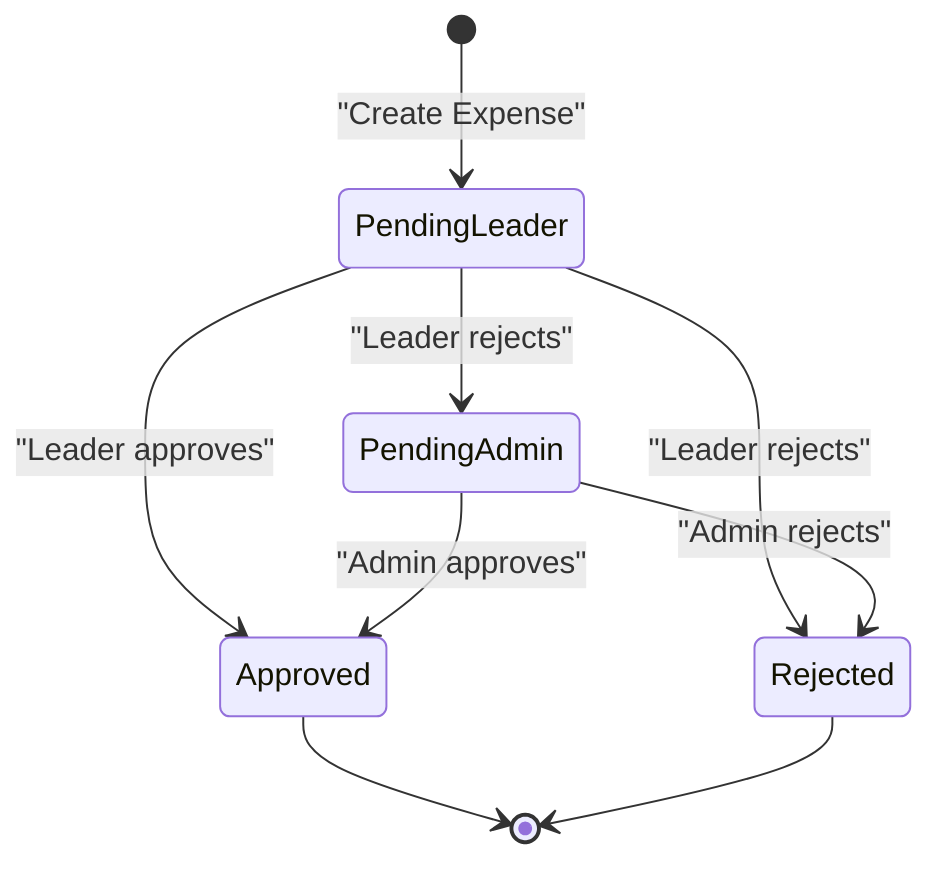
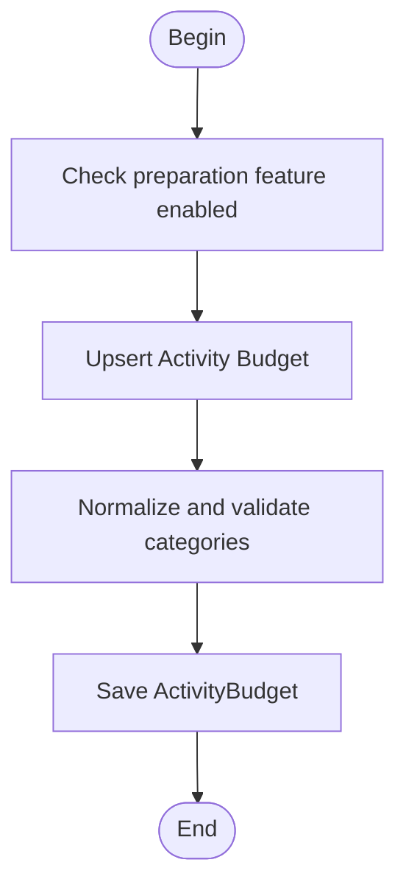
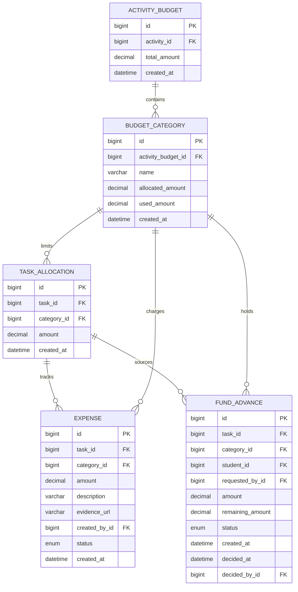

# Financial Administration API

<cite>
**Referenced Files in This Document**
- [PreparationFinanceController.java](file://src/main/java/vn/campuslife/controller/preparation/PreparationFinanceController.java)
- [PreparationFinanceServiceImpl.java](file://src/main/java/vn/campuslife/service/impl/PreparationFinanceServiceImpl.java)
- [ActivityBudget.java](file://src/main/java/vn/campuslife/entity/ActivityBudget.java)
- [BudgetCategory.java](file://src/main/java/vn/campuslife/entity/BudgetCategory.java)
- [TaskAllocation.java](file://src/main/java/vn/campuslife/entity/TaskAllocation.java)
- [Expense.java](file://src/main/java/vn/campuslife/entity/Expense.java)
- [FundAdvance.java](file://src/main/java/vn/campuslife/entity/FundAdvance.java)
- [ExpenseStatus.java](file://src/main/java/vn/campuslife/enumeration/ExpenseStatus.java)
- [FundAdvanceStatus.java](file://src/main/java/vn/campuslife/enumeration/FundAdvanceStatus.java)
- [CreateExpenseRequest.java](file://src/main/java/vn/campuslife/model/preparation/CreateExpenseRequest.java)
- [CreateFundAdvanceRequest.java](file://src/main/java/vn/campuslife/model/preparation/CreateFundAdvanceRequest.java)
- [ApproveExpenseRequest.java](file://src/main/java/vn/campuslife/model/preparation/ApproveExpenseRequest.java)
- [FinancialReportDto.java](file://src/main/java/vn/campuslife/model/preparation/FinancialReportDto.java)
- [CashFlowReportDto.java](file://src/main/java/vn/campuslife/model/preparation/CashFlowReportDto.java)
- [event-preparation-bu-fe-report.md](file://docs/event-preparation-bu-fe-report.md)
</cite>

## Table of Contents
1. [Introduction](#introduction)
2. [Project Structure](#project-structure)
3. [Core Components](#core-components)
4. [Architecture Overview](#architecture-overview)
5. [Detailed Component Analysis](#detailed-component-analysis)
6. [Dependency Analysis](#dependency-analysis)
7. [Performance Considerations](#performance-considerations)
8. [Troubleshooting Guide](#troubleshooting-guide)
9. [Conclusion](#conclusion)
10. [Appendices](#appendices)

## Introduction
This document provides comprehensive API documentation for the Financial Administration module focused on event preparation and activity finance. It covers budget management, expense tracking, fund advances, task allocation, and financial reporting. The API exposes endpoints for administrators, managers, supervisors, leaders, and members to manage budgets, approve expenses, process fund advances, and generate financial reports. Approval workflows, spending limits, budget categories, and audit trails are integral to the system design.

## Project Structure
The Financial Administration API resides under the preparation module with dedicated controller, service, entity, enumeration, and model packages. The controller exposes REST endpoints under `/api/preparation`. The service orchestrates business logic, repositories handle persistence, and models define request/response schemas.

**Diagram sources**
- [PreparationFinanceController.java:1-276](file://src/main/java/vn/campuslife/controller/preparation/PreparationFinanceController.java#L1-L276)
- [PreparationFinanceServiceImpl.java:1-800](file://src/main/java/vn/campuslife/service/impl/PreparationFinanceServiceImpl.java#L1-L800)
- [ActivityBudget.java:1-43](file://src/main/java/vn/campuslife/entity/ActivityBudget.java#L1-L43)
- [BudgetCategory.java:1-44](file://src/main/java/vn/campuslife/entity/BudgetCategory.java#L1-L44)
- [TaskAllocation.java:1-39](file://src/main/java/vn/campuslife/entity/TaskAllocation.java#L1-L39)
- [Expense.java:1-52](file://src/main/java/vn/campuslife/entity/Expense.java#L1-L52)
- [FundAdvance.java:1-60](file://src/main/java/vn/campuslife/entity/FundAdvance.java#L1-L60)
- [CreateExpenseRequest.java:1-27](file://src/main/java/vn/campuslife/model/preparation/CreateExpenseRequest.java#L1-L27)
- [CreateFundAdvanceRequest.java:1-24](file://src/main/java/vn/campuslife/model/preparation/CreateFundAdvanceRequest.java#L1-L24)
- [ApproveExpenseRequest.java:1-16](file://src/main/java/vn/campuslife/model/preparation/ApproveExpenseRequest.java#L1-L16)
- [FinancialReportDto.java:1-20](file://src/main/java/vn/campuslife/model/preparation/FinancialReportDto.java#L1-L20)
- [CashFlowReportDto.java:1-23](file://src/main/java/vn/campuslife/model/preparation/CashFlowReportDto.java#L1-L23)
- [ExpenseStatus.java:1-10](file://src/main/java/vn/campuslife/enumeration/ExpenseStatus.java#L1-L10)
- [FundAdvanceStatus.java:1-9](file://src/main/java/vn/campuslife/enumeration/FundAdvanceStatus.java#L1-L9)

**Section sources**
- [PreparationFinanceController.java:1-276](file://src/main/java/vn/campuslife/controller/preparation/PreparationFinanceController.java#L1-L276)
- [PreparationFinanceServiceImpl.java:1-800](file://src/main/java/vn/campuslife/service/impl/PreparationFinanceServiceImpl.java#L1-L800)

## Core Components
- Budget Management
  - Upsert activity budget and categories
  - Retrieve activity budget
  - Budget categories with allocated and used amounts
- Task Allocation
  - Allocate amounts per task and category
  - View allocation sources per task
- Fund Advances
  - Request fund advances per task and category
  - Admin decisions (approve/reject/settle)
  - Debt listing per student/activity
  - Source suggestions for fund advances
- Expense Tracking
  - Create expense with category and evidence
  - Leader/admin approval workflows
  - Expense listing by activity and status
- Financial Reporting
  - Financial report (budget, categories, over-budget tasks)
  - Finance overview report
  - Cash flow report (approved spent, cash inside/outside wallet, debts, invoice summaries)

**Section sources**
- [PreparationFinanceController.java:26-273](file://src/main/java/vn/campuslife/controller/preparation/PreparationFinanceController.java#L26-L273)
- [PreparationFinanceServiceImpl.java:66-151](file://src/main/java/vn/campuslife/service/impl/PreparationFinanceServiceImpl.java#L66-L151)
- [PreparationFinanceServiceImpl.java:165-211](file://src/main/java/vn/campuslife/service/impl/PreparationFinanceServiceImpl.java#L165-L211)
- [PreparationFinanceServiceImpl.java:253-330](file://src/main/java/vn/campuslife/service/impl/PreparationFinanceServiceImpl.java#L253-L330)
- [PreparationFinanceServiceImpl.java:540-591](file://src/main/java/vn/campuslife/service/impl/PreparationFinanceServiceImpl.java#L540-L591)
- [PreparationFinanceServiceImpl.java:595-746](file://src/main/java/vn/campuslife/service/impl/PreparationFinanceServiceImpl.java#L595-L746)
- [PreparationFinanceServiceImpl.java:750-758](file://src/main/java/vn/campuslife/service/impl/PreparationFinanceServiceImpl.java#L750-L758)
- [PreparationFinanceServiceImpl.java:253-330](file://src/main/java/vn/campuslife/service/impl/PreparationFinanceServiceImpl.java#L253-L330)
- [PreparationFinanceServiceImpl.java:427-493](file://src/main/java/vn/campuslife/service/impl/PreparationFinanceServiceImpl.java#L427-L493)
- [PreparationFinanceServiceImpl.java:508-536](file://src/main/java/vn/campuslife/service/impl/PreparationFinanceServiceImpl.java#L508-L536)
- [PreparationFinanceServiceImpl.java:750-797](file://src/main/java/vn/campuslife/service/impl/PreparationFinanceServiceImpl.java#L750-L797)
- [PreparationFinanceServiceImpl.java:800-860](file://src/main/java/vn/campuslife/service/impl/PreparationFinanceServiceImpl.java#L800-L860)
- [PreparationFinanceServiceImpl.java:860-930](file://src/main/java/vn/campuslife/service/impl/PreparationFinanceServiceImpl.java#L860-L930)
- [PreparationFinanceServiceImpl.java:930-1037](file://src/main/java/vn/campuslife/service/impl/PreparationFinanceServiceImpl.java#L930-L1037)
- [PreparationFinanceServiceImpl.java:1037-1100](file://src/main/java/vn/campuslife/service/impl/PreparationFinanceServiceImpl.java#L1037-L1100)
- [PreparationFinanceServiceImpl.java:1100-1200](file://src/main/java/vn/campuslife/service/impl/PreparationFinanceServiceImpl.java#L1100-L1200)
- [PreparationFinanceServiceImpl.java:1200-1300](file://src/main/java/vn/campuslife/service/impl/PreparationFinanceServiceImpl.java#L1200-L1300)
- [PreparationFinanceServiceImpl.java:1300-1400](file://src/main/java/vn/campuslife/service/impl/PreparationFinanceServiceImpl.java#L1300-L1400)
- [PreparationFinanceServiceImpl.java:1400-1500](file://src/main/java/vn/campuslife/service/impl/PreparationFinanceServiceImpl.java#L1400-L1500)
- [PreparationFinanceServiceImpl.java:1500-1600](file://src/main/java/vn/campuslife/service/impl/PreparationFinanceServiceImpl.java#L1500-L1600)
- [PreparationFinanceServiceImpl.java:1600-1700](file://src/main/java/vn/campuslife/service/impl/PreparationFinanceServiceImpl.java#L1600-L1700)
- [PreparationFinanceServiceImpl.java:1700-1800](file://src/main/java/vn/campuslife/service/impl/PreparationFinanceServiceImpl.java#L1700-L1800)
- [PreparationFinanceServiceImpl.java:1800-1826](file://src/main/java/vn/campuslife/service/impl/PreparationFinanceServiceImpl.java#L1800-L1826)

## Architecture Overview
The Financial Administration API follows a layered architecture:
- Controller layer handles HTTP requests and delegates to the service layer
- Service layer enforces business rules, performs validations, and coordinates repositories
- Persistence layer manages domain entities and aggregates
- Models and enumerations define request/response contracts and status values

**Diagram sources**
- [PreparationFinanceController.java:1-276](file://src/main/java/vn/campuslife/controller/preparation/PreparationFinanceController.java#L1-L276)
- [PreparationFinanceServiceImpl.java:1-800](file://src/main/java/vn/campuslife/service/impl/PreparationFinanceServiceImpl.java#L1-L800)

## Detailed Component Analysis

### Budget Management
Endpoints
- PUT /api/preparation/activities/{activityId}/budget
  - Purpose: Upsert activity budget and categories
  - Roles: ADMIN, MANAGER, or activity prep supervisor
  - Request: UpsertActivityBudgetRequest
  - Response: ActivityBudgetDto
- GET /api/preparation/activities/{activityId}/budget
  - Purpose: Retrieve activity budget
  - Roles: ADMIN, MANAGER, activity prep supervisor, or organizer
  - Response: ActivityBudgetDto

Key behaviors
- Validates preparation feature enablement per activity
- Normalizes category names and prevents duplicates
- Ensures allocated amount is not less than used amount when updating categories
- Writes audit logs for budget upserts

**Diagram sources**
- [PreparationFinanceController.java:26-33](file://src/main/java/vn/campuslife/controller/preparation/PreparationFinanceController.java#L26-L33)
- [PreparationFinanceServiceImpl.java:66-151](file://src/main/java/vn/campuslife/service/impl/PreparationFinanceServiceImpl.java#L66-L151)

**Section sources**
- [PreparationFinanceController.java:26-40](file://src/main/java/vn/campuslife/controller/preparation/PreparationFinanceController.java#L26-L40)
- [PreparationFinanceServiceImpl.java:66-151](file://src/main/java/vn/campuslife/service/impl/PreparationFinanceServiceImpl.java#L66-L151)
- [ActivityBudget.java:1-43](file://src/main/java/vn/campuslife/entity/ActivityBudget.java#L1-L43)
- [BudgetCategory.java:1-44](file://src/main/java/vn/campuslife/entity/BudgetCategory.java#L1-L44)

### Task Allocation
Endpoints
- PUT /api/preparation/tasks/{taskId}/allocation
  - Purpose: Allocate amount to a task for a specific category
  - Roles: ADMIN, MANAGER, or task prep supervisor
  - Request: AllocateTaskAmountRequest
  - Response: PreparationTaskDto
- GET /api/preparation/tasks/{taskId}/allocation-sources
  - Purpose: List allocation sources per task
  - Roles: ADMIN, MANAGER, task prep supervisor, or task member
  - Response: List<TaskAllocationSourceDto>

Key behaviors
- Validates task financial flag and activity preparation enablement
- Checks category validity against activity budget
- Enforces category wallet capacity and task commitment constraints
- Computes allocation sources with remaining amounts per category

**Diagram sources**
- [PreparationFinanceController.java:42-49](file://src/main/java/vn/campuslife/controller/preparation/PreparationFinanceController.java#L42-L49)
- [PreparationFinanceServiceImpl.java:165-211](file://src/main/java/vn/campuslife/service/impl/PreparationFinanceServiceImpl.java#L165-L211)

**Section sources**
- [PreparationFinanceController.java:42-69](file://src/main/java/vn/campuslife/controller/preparation/PreparationFinanceController.java#L42-L69)
- [PreparationFinanceServiceImpl.java:165-211](file://src/main/java/vn/campuslife/service/impl/PreparationFinanceServiceImpl.java#L165-L211)
- [TaskAllocation.java:1-39](file://src/main/java/vn/campuslife/entity/TaskAllocation.java#L1-L39)
- [PreparationFinanceServiceImpl.java:1012-1037](file://src/main/java/vn/campuslife/service/impl/PreparationFinanceServiceImpl.java#L1012-L1037)

### Fund Advances
Endpoints
- POST /api/preparation/tasks/{taskId}/fund-advances
  - Purpose: Request a fund advance
  - Roles: Task prep supervisor or task leader
  - Request: CreateFundAdvanceRequest
  - Response: FundAdvanceDto
- PUT /api/preparation/fund-advances/{fundAdvanceId}/admin-decision
  - Purpose: Admin decision (approve/reject)
  - Roles: ADMIN, MANAGER, or prep supervisor
  - Request: ApproveFundAdvanceRequest
  - Response: FundAdvanceDto
- PUT /api/preparation/fund-advances/{fundAdvanceId}/return
  - Purpose: Admin settle (return) a fund advance
  - Roles: ADMIN, MANAGER, or prep supervisor
  - Response: FundAdvanceDto
- GET /api/preparation/tasks/{taskId}/fund-advances
  - Purpose: List fund advances by task
  - Roles: ADMIN, MANAGER, task prep supervisor, or task leader
  - Response: List<FundAdvanceDto>
- GET /api/preparation/tasks/{taskId}/fund-advance-source-suggestions
  - Purpose: Suggest fund advance sources by task and optional amount
  - Roles: Task prep supervisor or task leader
  - Response: List<FundAdvanceSourceSuggestionDto>
- GET /api/preparation/activities/{activityId}/fund-advance-debts
  - Purpose: List fund advance debts by activity and optional student
  - Roles: ADMIN, MANAGER, or activity prep supervisor
  - Response: List<FundAdvanceDebtDto>

Key behaviors
- Validates requester and student membership in the activity
- Prevents multiple unsettled advances per student per activity
- Ensures sufficient allocation and wallet cash availability
- Supports multi-source suggestions and debt aggregation

**Diagram sources**
- [PreparationFinanceController.java:116-124](file://src/main/java/vn/campuslife/controller/preparation/PreparationFinanceController.java#L116-L124)
- [PreparationFinanceServiceImpl.java:253-330](file://src/main/java/vn/campuslife/service/impl/PreparationFinanceServiceImpl.java#L253-L330)

**Section sources**
- [PreparationFinanceController.java:116-199](file://src/main/java/vn/campuslife/controller/preparation/PreparationFinanceController.java#L116-L199)
- [PreparationFinanceServiceImpl.java:253-330](file://src/main/java/vn/campuslife/service/impl/PreparationFinanceServiceImpl.java#L253-L330)
- [PreparationFinanceServiceImpl.java:332-394](file://src/main/java/vn/campuslife/service/impl/PreparationFinanceServiceImpl.java#L332-L394)
- [PreparationFinanceServiceImpl.java:396-423](file://src/main/java/vn/campuslife/service/impl/PreparationFinanceServiceImpl.java#L396-L423)
- [PreparationFinanceServiceImpl.java:427-493](file://src/main/java/vn/campuslife/service/impl/PreparationFinanceServiceImpl.java#L427-L493)
- [PreparationFinanceServiceImpl.java:508-536](file://src/main/java/vn/campuslife/service/impl/PreparationFinanceServiceImpl.java#L508-L536)
- [FundAdvance.java:1-60](file://src/main/java/vn/campuslife/entity/FundAdvance.java#L1-L60)
- [CreateFundAdvanceRequest.java:1-24](file://src/main/java/vn/campuslife/model/preparation/CreateFundAdvanceRequest.java#L1-L24)

### Expense Tracking
Endpoints
- POST /api/preparation/tasks/{taskId}/expenses
  - Purpose: Create an expense
  - Roles: Task prep supervisor or task member
  - Request: CreateExpenseRequest
  - Response: ExpenseDto
- POST /api/preparation/tasks/{taskId}/expenses/evidence
  - Purpose: Upload expense evidence
  - Roles: Task prep supervisor or task member
  - Request: multipart/form-data (file)
  - Response: UploadResultDto
- PUT /api/preparation/expenses/{expenseId}/leader-decision
  - Purpose: Leader decision (approve/reject)
  - Roles: Expense prep supervisor or eligible leader
  - Request: ApproveExpenseRequest
  - Response: ExpenseDto
- PUT /api/preparation/expenses/{expenseId}/admin-decision
  - Purpose: Admin decision (approve/reject)
  - Roles: ADMIN, MANAGER, or prep supervisor
  - Request: ApproveExpenseRequest
  - Response: ExpenseDto
- GET /api/preparation/activities/{activityId}/expenses
  - Purpose: List expenses by activity and optional status
  - Roles: ADMIN, MANAGER, activity prep supervisor, or organizer
  - Response: List<ExpenseDto>

Key behaviors
- Validates organizer permissions and task financial flag
- Enforces over-allocated scenarios with suggested allocation sources
- Supports leader/admin approval workflows with notifications
- Deducts approved expenses from fund advances and updates category used amounts

**Diagram sources**
- [PreparationFinanceController.java:210-243](file://src/main/java/vn/campuslife/controller/preparation/PreparationFinanceController.java#L210-L243)
- [PreparationFinanceServiceImpl.java:540-591](file://src/main/java/vn/campuslife/service/impl/PreparationFinanceServiceImpl.java#L540-L591)
- [PreparationFinanceServiceImpl.java:595-746](file://src/main/java/vn/campuslife/service/impl/PreparationFinanceServiceImpl.java#L595-L746)

**Section sources**
- [PreparationFinanceController.java:201-252](file://src/main/java/vn/campuslife/controller/preparation/PreparationFinanceController.java#L201-L252)
- [PreparationFinanceServiceImpl.java:540-591](file://src/main/java/vn/campuslife/service/impl/PreparationFinanceServiceImpl.java#L540-L591)
- [PreparationFinanceServiceImpl.java:595-746](file://src/main/java/vn/campuslife/service/impl/PreparationFinanceServiceImpl.java#L595-L746)
- [Expense.java:1-52](file://src/main/java/vn/campuslife/entity/Expense.java#L1-L52)
- [CreateExpenseRequest.java:1-27](file://src/main/java/vn/campuslife/model/preparation/CreateExpenseRequest.java#L1-L27)
- [ApproveExpenseRequest.java:1-16](file://src/main/java/vn/campuslife/model/preparation/ApproveExpenseRequest.java#L1-L16)

### Financial Reporting
Endpoints
- GET /api/preparation/activities/{activityId}/financial-report
  - Purpose: Comprehensive financial report
  - Roles: ADMIN, MANAGER, activity prep supervisor, or organizer
  - Response: FinancialReportDto
- GET /api/preparation/activities/{activityId}/reports/finance-overview
  - Purpose: Finance overview report
  - Roles: ADMIN, MANAGER, activity prep supervisor, or organizer
  - Response: FinanceOverviewReportDto
- GET /api/preparation/activities/{activityId}/reports/cash-flow
  - Purpose: Cash flow report
  - Roles: ADMIN, MANAGER, activity prep supervisor, or organizer
  - Response: CashFlowReportDto

Key behaviors
- Aggregates budget, categories, over-budget tasks, approved spent, cash inside/outside wallet, and debts
- Provides summary of invoice statuses

**Diagram sources**
- [PreparationFinanceController.java:254-273](file://src/main/java/vn/campuslife/controller/preparation/PreparationFinanceController.java#L254-L273)
- [PreparationFinanceServiceImpl.java:1-800](file://src/main/java/vn/campuslife/service/impl/PreparationFinanceServiceImpl.java#L1-L800)

**Section sources**
- [PreparationFinanceController.java:254-273](file://src/main/java/vn/campuslife/controller/preparation/PreparationFinanceController.java#L254-L273)
- [FinancialReportDto.java:1-20](file://src/main/java/vn/campuslife/model/preparation/FinancialReportDto.java#L1-L20)
- [CashFlowReportDto.java:1-23](file://src/main/java/vn/campuslife/model/preparation/CashFlowReportDto.java#L1-L23)

### Approval Hierarchies and Spending Limits
Approval workflows
- Expense approval
  - Leader decision: PENDING_LEADER → APPROVED/REJECTED
  - Admin override: PENDING_LEADER/PENDING_ADMIN → APPROVED/REJECTED
- Fund advance decision
  - Admin decision: REQUESTED → HOLDING/REJECTED
  - Admin return: HOLDING → SETTLED

Spending limits
- Task allocation vs. committed expenses
- Category wallet remaining balance
- Fund advance availability considering allocation and existing holdings

**Diagram sources**
- [ExpenseStatus.java:1-10](file://src/main/java/vn/campuslife/enumeration/ExpenseStatus.java#L1-L10)
- [PreparationFinanceServiceImpl.java:595-746](file://src/main/java/vn/campuslife/service/impl/PreparationFinanceServiceImpl.java#L595-L746)

**Section sources**
- [PreparationFinanceServiceImpl.java:595-746](file://src/main/java/vn/campuslife/service/impl/PreparationFinanceServiceImpl.java#L595-L746)
- [ExpenseStatus.java:1-10](file://src/main/java/vn/campuslife/enumeration/ExpenseStatus.java#L1-L10)
- [FundAdvanceStatus.java:1-9](file://src/main/java/vn/campuslife/enumeration/FundAdvanceStatus.java#L1-L9)

### Budget Categories and Wallet Model
- Two-layer budgeting model
  - Category wallet: allocatedAmount, usedAmount, allocatedToTasksAmount, availableToAllocateAmount, remainingAmount, cashOutsideAmount, cashAvailableAmount
  - Allocate (TaskAllocation): holds budget for tasks without spending
  - FundAdvance: physical cash held by individuals, deducted upon expense approval

**Diagram sources**
- [event-preparation-bu-fe-report.md:7-21](file://docs/event-preparation-bu-fe-report.md#L7-L21)
- [PreparationFinanceServiceImpl.java:66-151](file://src/main/java/vn/campuslife/service/impl/PreparationFinanceServiceImpl.java#L66-L151)

**Section sources**
- [event-preparation-bu-fe-report.md:7-21](file://docs/event-preparation-bu-fe-report.md#L7-L21)
- [PreparationFinanceServiceImpl.java:66-151](file://src/main/java/vn/campuslife/service/impl/PreparationFinanceServiceImpl.java#L66-L151)

## Dependency Analysis
The controller depends on the service for business logic, and the service depends on repositories for persistence. Entities form the core data model with relationships:
- ActivityBudget contains BudgetCategory entries
- TaskAllocation links tasks to categories
- Expense belongs to a task and category
- FundAdvance belongs to a task, category, and student

**Diagram sources**
- [ActivityBudget.java:1-43](file://src/main/java/vn/campuslife/entity/ActivityBudget.java#L1-L43)
- [BudgetCategory.java:1-44](file://src/main/java/vn/campuslife/entity/BudgetCategory.java#L1-L44)
- [TaskAllocation.java:1-39](file://src/main/java/vn/campuslife/entity/TaskAllocation.java#L1-L39)
- [Expense.java:1-52](file://src/main/java/vn/campuslife/entity/Expense.java#L1-L52)
- [FundAdvance.java:1-60](file://src/main/java/vn/campuslife/entity/FundAdvance.java#L1-L60)

**Section sources**
- [ActivityBudget.java:1-43](file://src/main/java/vn/campuslife/entity/ActivityBudget.java#L1-L43)
- [BudgetCategory.java:1-44](file://src/main/java/vn/campuslife/entity/BudgetCategory.java#L1-L44)
- [TaskAllocation.java:1-39](file://src/main/java/vn/campuslife/entity/TaskAllocation.java#L1-L39)
- [Expense.java:1-52](file://src/main/java/vn/campuslife/entity/Expense.java#L1-L52)
- [FundAdvance.java:1-60](file://src/main/java/vn/campuslife/entity/FundAdvance.java#L1-L60)

## Performance Considerations
- Efficient aggregation queries for allocation sources, fund advance suggestions, and financial reports
- Indexing on foreign keys (task_id, category_id, activity_id) recommended for frequent joins
- Batch operations for category updates and audit logging
- Caching of frequently accessed budget and category data where appropriate

## Troubleshooting Guide
Common exceptions and resolutions
- FeatureNotEnabledException: Preparation feature not enabled for the activity
- BadRequestException: Invalid input, missing fields, or invalid category names
- ForbiddenException: Missing permissions (organizer/leader/member roles)
- InsufficientBudgetException: Over-allocation or insufficient wallet cash
- OverBudgetException: Expense exceeds task allocated amount with suggested allocation sources
- ResourceNotFoundException: Entity not found (task, budget, category, user)

Audit trail
- All financial operations log audit events with relevant metadata for traceability

**Section sources**
- [PreparationFinanceServiceImpl.java:18-21](file://src/main/java/vn/campuslife/service/impl/PreparationFinanceServiceImpl.java#L18-L21)
- [PreparationFinanceServiceImpl.java:563-570](file://src/main/java/vn/campuslife/service/impl/PreparationFinanceServiceImpl.java#L563-L570)
- [PreparationFinanceServiceImpl.java:644-652](file://src/main/java/vn/campuslife/service/impl/PreparationFinanceServiceImpl.java#L644-L652)
- [PreparationFinanceServiceImpl.java:714-722](file://src/main/java/vn/campuslife/service/impl/PreparationFinanceServiceImpl.java#L714-L722)

## Conclusion
The Financial Administration API provides a robust framework for managing budgets, allocating funds to tasks, processing fund advances, tracking expenses, and generating financial reports. Clear approval workflows, spending limits, and comprehensive audit trails ensure transparency and compliance. The modular design supports scalability and maintainability while enforcing business rules at the service layer.

## Appendices

### Endpoint Reference Summary
- Budget Management
  - PUT /api/preparation/activities/{activityId}/budget
  - GET /api/preparation/activities/{activityId}/budget
- Task Allocation
  - PUT /api/preparation/tasks/{taskId}/allocation
  - GET /api/preparation/tasks/{taskId}/allocation-sources
- Fund Advances
  - POST /api/preparation/tasks/{taskId}/fund-advances
  - PUT /api/preparation/fund-advances/{fundAdvanceId}/admin-decision
  - PUT /api/preparation/fund-advances/{fundAdvanceId}/return
  - GET /api/preparation/tasks/{taskId}/fund-advances
  - GET /api/preparation/tasks/{taskId}/fund-advance-source-suggestions
  - GET /api/preparation/activities/{activityId}/fund-advance-debts
- Expense Tracking
  - POST /api/preparation/tasks/{taskId}/expenses
  - POST /api/preparation/tasks/{taskId}/expenses/evidence
  - PUT /api/preparation/expenses/{expenseId}/leader-decision
  - PUT /api/preparation/expenses/{expenseId}/admin-decision
  - GET /api/preparation/activities/{activityId}/expenses
- Financial Reporting
  - GET /api/preparation/activities/{activityId}/financial-report
  - GET /api/preparation/activities/{activityId}/reports/finance-overview
  - GET /api/preparation/activities/{activityId}/reports/cash-flow

### Example Workflows

#### Budget Allocation Process
- Upsert activity budget with categories
- Allocate amounts per task and category
- Monitor allocation sources and remaining balances

#### Expense Recording Procedure
- Create expense with category and evidence
- Leader/admin approval workflow
- Automatic fund advance deduction upon approval

#### Fund Advance Approval
- Request fund advance with category and amount
- Admin decision (approve/reject/settle)
- Track outstanding debts per student/activity

#### Financial Dashboard Operations
- Retrieve financial report for an activity
- View cash flow report (approved spent, cash inside/outside wallet)
- Review fund advance debts and invoice status summaries