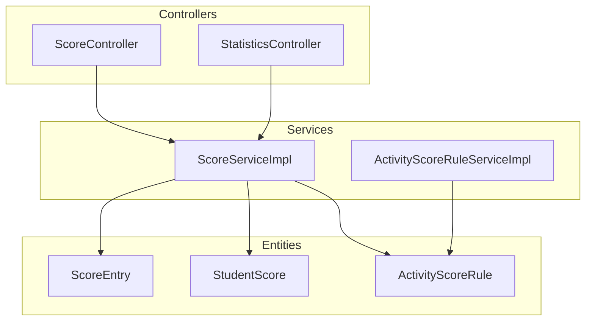
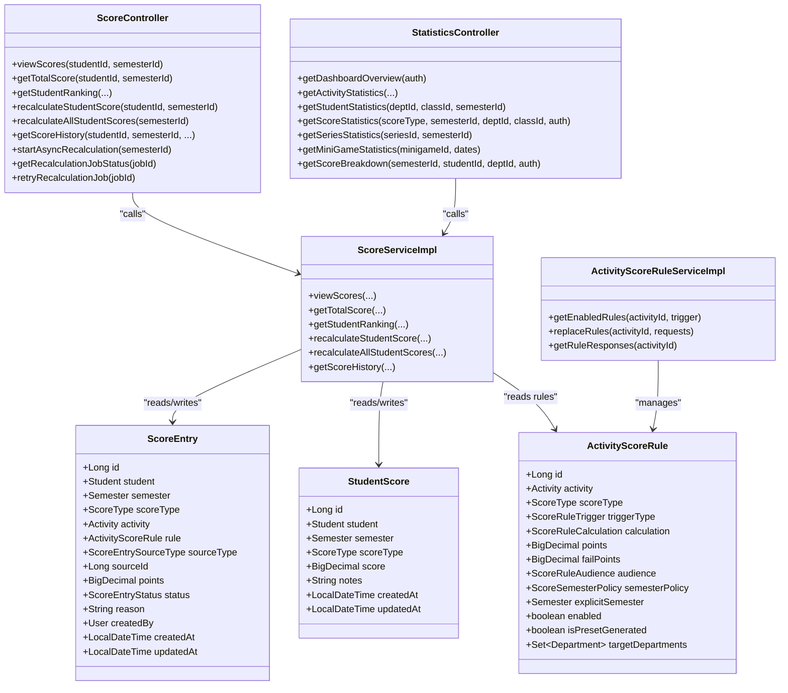
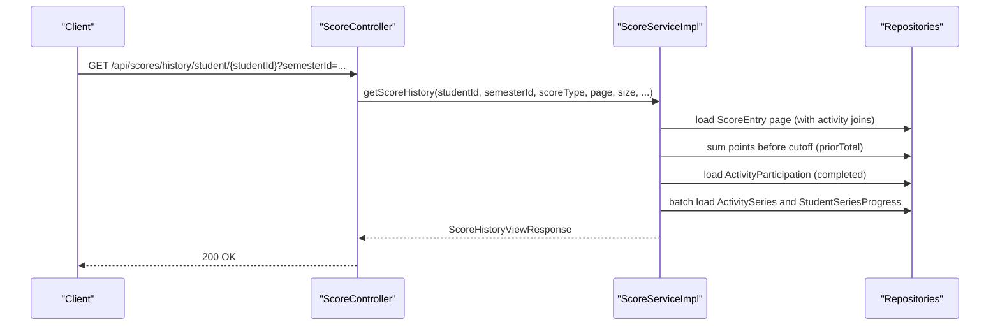
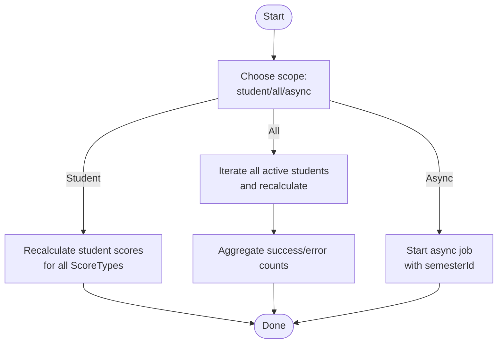
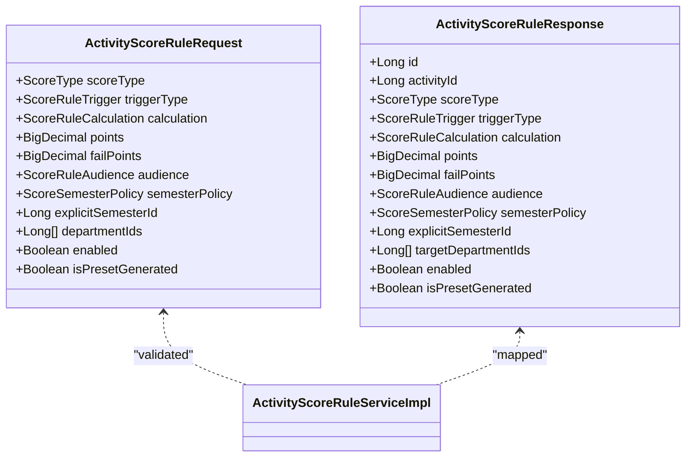
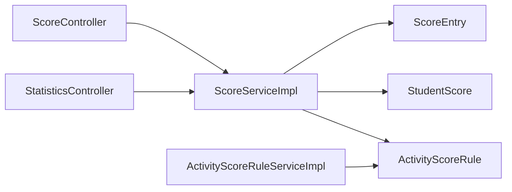

# Scoring System API

<cite>
**Referenced Files in This Document**
- [ScoreController.java](file://src/main/java/vn/campuslife/controller/score/ScoreController.java)
- [StatisticsController.java](file://src/main/java/vn/campuslife/controller/score/StatisticsController.java)
- [ScoreServiceImpl.java](file://src/main/java/vn/campuslife/service/impl/ScoreServiceImpl.java)
- [ActivityScoreRuleServiceImpl.java](file://src/main/java/vn/campuslife/service/impl/ActivityScoreRuleServiceImpl.java)
- [ScoreEntry.java](file://src/main/java/vn/campuslife/entity/ScoreEntry.java)
- [StudentScore.java](file://src/main/java/vn/campuslife/entity/StudentScore.java)
- [ActivityScoreRule.java](file://src/main/java/vn/campuslife/entity/ActivityScoreRule.java)
- [ScoreType.java](file://src/main/java/vn/campuslife/enumeration/ScoreType.java)
- [ScoreEntrySourceType.java](file://src/main/java/vn/campuslife/enumeration/ScoreEntrySourceType.java)
- [ScoreRuleTrigger.java](file://src/main/java/vn/campuslife/enumeration/ScoreRuleTrigger.java)
- [ScoreRuleCalculation.java](file://src/main/java/vn/campuslife/enumeration/ScoreRuleCalculation.java)
- [ScoreRuleAudience.java](file://src/main/java/vn/campuslife/enumeration/ScoreRuleAudience.java)
- [ScoreSemesterPolicy.java](file://src/main/java/vn/campuslife/enumeration/ScoreSemesterPolicy.java)
- [ScoreViewResponse.java](file://src/main/java/vn/campuslife/model/score/ScoreViewResponse.java)
- [ScoreHistoryViewResponse.java](file://src/main/java/vn/campuslife/model/score/ScoreHistoryViewResponse.java)
- [ScoreHistoryDetailResponse.java](file://src/main/java/vn/campuslife/model/score/ScoreHistoryDetailResponse.java)
- [ActivityScoreRuleRequest.java](file://src/main/java/vn/campuslife/model/score/ActivityScoreRuleRequest.java)
- [ActivityScoreRuleResponse.java](file://src/main/java/vn/campuslife/model/score/ActivityScoreRuleResponse.java)
- [ScoreStatisticsResponse.java](file://src/main/java/vn/campuslife/model/statistics/ScoreStatisticsResponse.java)
</cite>

## Table of Contents
1. [Introduction](#introduction)
2. [Project Structure](#project-structure)
3. [Core Components](#core-components)
4. [Architecture Overview](#architecture-overview)
5. [Detailed Component Analysis](#detailed-component-analysis)
6. [Dependency Analysis](#dependency-analysis)
7. [Performance Considerations](#performance-considerations)
8. [Troubleshooting Guide](#troubleshooting-guide)
9. [Conclusion](#conclusion)
10. [Appendices](#appendices)

## Introduction
This document provides comprehensive API documentation for the campus scoring and point system. It covers:
- Score entry management and history
- Rule-based scoring configuration
- Grade submission and review workflows
- Statistical reporting and leaderboards
- Manual score adjustments and automated triggers
- HTTP endpoints, request/response schemas, validation rules, and audit trail

The system supports three score types (REN_LUYEN, CONG_TAC_XA_HOI, CHUYEN_DE), semester policies, and integrates with activity participation, series progress, and minigame attempts.

## Project Structure
The scoring subsystem is organized around two primary controllers:
- ScoreController: exposes endpoints for viewing scores, calculating totals, generating leaderboards, recalculating scores, and retrieving score histories.
- StatisticsController: exposes endpoints for dashboards, activity, student, score, series, minigame, and score breakdown statistics.

Key services:
- ScoreServiceImpl: orchestrates score retrieval, ranking, recalculation, and history building.
- ActivityScoreRuleServiceImpl: manages activity-specific scoring rules and validations.

Core entities:
- ScoreEntry: individual scored events with source type, points, reason, and audit timestamps.
- StudentScore: aggregated score per student per semester per score type.
- ActivityScoreRule: rule definition for how points are awarded or deducted based on triggers.

**Diagram sources**
- [ScoreController.java:15-234](file://src/main/java/vn/campuslife/controller/score/ScoreController.java#L15-L234)
- [StatisticsController.java:15-213](file://src/main/java/vn/campuslife/controller/score/StatisticsController.java#L15-L213)
- [ScoreServiceImpl.java:54-649](file://src/main/java/vn/campuslife/service/impl/ScoreServiceImpl.java#L54-L649)
- [ActivityScoreRuleServiceImpl.java:26-163](file://src/main/java/vn/campuslife/service/impl/ActivityScoreRuleServiceImpl.java#L26-L163)
- [ScoreEntry.java:18-79](file://src/main/java/vn/campuslife/entity/ScoreEntry.java#L18-L79)
- [StudentScore.java:15-50](file://src/main/java/vn/campuslife/entity/StudentScore.java#L15-L50)
- [ActivityScoreRule.java:22-88](file://src/main/java/vn/campuslife/entity/ActivityScoreRule.java#L22-L88)

**Section sources**
- [ScoreController.java:15-234](file://src/main/java/vn/campuslife/controller/score/ScoreController.java#L15-L234)
- [StatisticsController.java:15-213](file://src/main/java/vn/campuslife/controller/score/StatisticsController.java#L15-L213)

## Core Components
- ScoreController
  - GET /api/scores/student/{studentId}/semester/{semesterId} → viewScores
  - GET /api/scores/student/{studentId}/semester/{semesterId}/total → getTotalScore
  - GET /api/scores/ranking → getStudentRanking
  - POST /api/scores/recalculate/student/{studentId} → recalculateStudentScore
  - POST /api/scores/recalculate/all → recalculateAllStudentScores
  - GET /api/scores/history/student/{studentId} → getScoreHistory
  - POST /api/scores/recalculate/async → startAsyncRecalculation
  - GET /api/scores/recalculate/status/{jobId} → getRecalculationJobStatus
  - POST /api/scores/recalculate/retry/{jobId} → retryRecalculationJob

- StatisticsController
  - GET /api/statistics/dashboard → getDashboardOverview
  - GET /api/statistics/activities → getActivityStatistics
  - GET /api/statistics/students → getStudentStatistics
  - GET /api/statistics/scores → getScoreStatistics
  - GET /api/statistics/series → getSeriesStatistics
  - GET /api/statistics/minigames → getMiniGameStatistics
  - GET /api/statistics/scores/breakdown → getScoreBreakdown

- ActivityScoreRule Management
  - Replace rules for an activity via service method (not exposed as REST endpoint in the provided files).

**Section sources**
- [ScoreController.java:26-234](file://src/main/java/vn/campuslife/controller/score/ScoreController.java#L26-L234)
- [StatisticsController.java:30-210](file://src/main/java/vn/campuslife/controller/score/StatisticsController.java#L30-L210)
- [ActivityScoreRuleServiceImpl.java:40-84](file://src/main/java/vn/campuslife/service/impl/ActivityScoreRuleServiceImpl.java#L40-L84)

## Architecture Overview
The scoring system follows a layered architecture:
- Controllers expose REST endpoints and delegate to services.
- Services encapsulate business logic for score aggregation, ranking, recalculation, and history construction.
- Entities persist score entries, aggregated student scores, and activity scoring rules.
- Enumerations define score types, entry sources, rule triggers, calculations, audiences, and semester policies.

**Diagram sources**
- [ScoreController.java:15-234](file://src/main/java/vn/campuslife/controller/score/ScoreController.java#L15-L234)
- [StatisticsController.java:15-213](file://src/main/java/vn/campuslife/controller/score/StatisticsController.java#L15-L213)
- [ScoreServiceImpl.java:54-649](file://src/main/java/vn/campuslife/service/impl/ScoreServiceImpl.java#L54-L649)
- [ActivityScoreRuleServiceImpl.java:26-163](file://src/main/java/vn/campuslife/service/impl/ActivityScoreRuleServiceImpl.java#L26-L163)
- [ScoreEntry.java:18-79](file://src/main/java/vn/campuslife/entity/ScoreEntry.java#L18-L79)
- [StudentScore.java:15-50](file://src/main/java/vn/campuslife/entity/StudentScore.java#L15-L50)
- [ActivityScoreRule.java:22-88](file://src/main/java/vn/campuslife/entity/ActivityScoreRule.java#L22-L88)

## Detailed Component Analysis

### Score Views and Totals
- Endpoint: GET /api/scores/student/{studentId}/semester/{semesterId}
  - Purpose: Retrieve per-type score breakdown for a student in a semester.
  - Response: ScoreViewResponse containing studentId, semesterId, and summaries grouped by ScoreType with totals and items.
  - Validation: Requires existing student and semester.

- Endpoint: GET /api/scores/student/{studentId}/semester/{semesterId}/total
  - Purpose: Compute total score per type and grand total for a student in a semester.
  - Response: Map with studentId, semesterId, grandTotal, totalsByType, and scoreCount.

**Section sources**
- [ScoreController.java:26-36](file://src/main/java/vn/campuslife/controller/score/ScoreController.java#L26-L36)
- [ScoreServiceImpl.java:80-140](file://src/main/java/vn/campuslife/service/impl/ScoreServiceImpl.java#L80-L140)
- [ScoreViewResponse.java:10-28](file://src/main/java/vn/campuslife/model/score/ScoreViewResponse.java#L10-L28)

### Leaderboard Generation
- Endpoint: GET /api/scores/ranking
  - Query params:
    - semesterId (required)
    - scoreType (optional; null means total across types)
    - departmentId (optional)
    - classId (optional)
    - sortOrder ("ASC" or "DESC", default "DESC")
  - Behavior:
    - If scoreType provided: ranks by that type, optionally filtered by department/class.
    - If scoreType null: computes total per student and ranks by grand total.
  - Response: Includes semester metadata, filters applied, sort order, totalStudents, and ranked list with student info and score.

**Section sources**
- [ScoreController.java:48-72](file://src/main/java/vn/campuslife/controller/score/ScoreController.java#L48-L72)
- [ScoreServiceImpl.java:142-300](file://src/main/java/vn/campuslife/service/impl/ScoreServiceImpl.java#L142-L300)

### Score History and Audit Trail
- Endpoint: GET /api/scores/history/student/{studentId}
  - Query params:
    - semesterId (required)
    - scoreType (optional)
    - page (default 0), size (default 20)
    - startDate, endDate (ISO date-time)
    - keyword (text filter)
  - Access control: Students can only view their own history.
  - Response: ScoreHistoryViewResponse with:
    - Student metadata and semester info
    - Current score for selected type
    - scoreHistories: chronological list of ScoreHistoryDetailResponse entries with running totals
    - activityParticipations: completed activity participations with series info
    - Pagination and total counts

- ScoreHistoryDetailResponse fields:
  - id, oldScore, newScore, changeDate, reason, activityId/name, seriesId/name, sourceType, changedByUsername/fullName

- Audit trail:
  - ScoreEntry stores createdBy, createdAt, updatedAt.
  - ScoreEntrySourceType includes MANUAL_ADJUSTMENT and RECALCULATION to mark administrative actions.

**Diagram sources**
- [ScoreController.java:124-173](file://src/main/java/vn/campuslife/controller/score/ScoreController.java#L124-L173)
- [ScoreServiceImpl.java:434-646](file://src/main/java/vn/campuslife/service/impl/ScoreServiceImpl.java#L434-L646)
- [ScoreHistoryViewResponse.java:12-31](file://src/main/java/vn/campuslife/model/score/ScoreHistoryViewResponse.java#L12-L31)
- [ScoreHistoryDetailResponse.java:10-27](file://src/main/java/vn/campuslife/model/score/ScoreHistoryDetailResponse.java#L10-L27)

**Section sources**
- [ScoreController.java:124-173](file://src/main/java/vn/campuslife/controller/score/ScoreController.java#L124-L173)
- [ScoreServiceImpl.java:434-646](file://src/main/java/vn/campuslife/service/impl/ScoreServiceImpl.java#L434-L646)
- [ScoreEntry.java:18-79](file://src/main/java/vn/campuslife/entity/ScoreEntry.java#L18-L79)
- [ScoreEntrySourceType.java:3-14](file://src/main/java/vn/campuslife/enumeration/ScoreEntrySourceType.java#L3-L14)

### Recalculation and Async Jobs
- Endpoint: POST /api/scores/recalculate/student/{studentId}
  - Triggers refresh of all score types for the given student in the specified or current open semester.

- Endpoint: POST /api/scores/recalculate/all
  - Triggers recalculations for all active students in the specified or current open semester, returning counts and error details.

- Endpoint: POST /api/scores/recalculate/async
  - Starts asynchronous recalculation for a semester, returns job info for progress tracking.

- Endpoint: GET /api/scores/recalculate/status/{jobId}
  - Polls job status.

- Endpoint: POST /api/scores/recalculate/retry/{jobId}
  - Retries a failed job.

**Diagram sources**
- [ScoreController.java:82-232](file://src/main/java/vn/campuslife/controller/score/ScoreController.java#L82-L232)
- [ScoreServiceImpl.java:321-432](file://src/main/java/vn/campuslife/service/impl/ScoreServiceImpl.java#L321-L432)

**Section sources**
- [ScoreController.java:82-232](file://src/main/java/vn/campuslife/controller/score/ScoreController.java#L82-L232)
- [ScoreServiceImpl.java:321-432](file://src/main/java/vn/campuslife/service/impl/ScoreServiceImpl.java#L321-L432)

### Rule-Based Scoring Configuration
- ActivityScoreRule defines:
  - scoreType, triggerType, calculation
  - points and failPoints
  - audience (ALL_PARTICIPANTS, DEPARTMENT_ONLY, OUTSIDE_DEPARTMENTS_ONLY)
  - semesterPolicy (ACTIVITY_SEMESTER, EXPLICIT_SEMESTER) with optional explicitSemester
  - targetDepartments (for scoped rules)
  - enabled flag and preset generation marker

- Validation rules enforced by ActivityScoreRuleServiceImpl.validateRuleCompatibility:
  - Trigger type and score type are required.
  - Audience DEPARTMENT_ONLY/OUTSIDE_DEPARTMENTS_ONLY requires departmentIds.
  - Submission-based triggers require activity.requiresSubmission = true.
  - Penalty-style triggers (OVERDUE, NO_SHOW, MINIGAME_EXHAUSTED_ATTEMPTS) require failPoints.
  - Minigame-specific triggers apply only to minigame activities.

- Replacement API:
  - replaceRules(activityId, requests) deletes existing rules and inserts validated new ones.

**Diagram sources**
- [ActivityScoreRuleRequest.java:14-27](file://src/main/java/vn/campuslife/model/score/ActivityScoreRuleRequest.java#L14-L27)
- [ActivityScoreRuleResponse.java:14-29](file://src/main/java/vn/campuslife/model/score/ActivityScoreRuleResponse.java#L14-L29)
- [ActivityScoreRuleServiceImpl.java:86-132](file://src/main/java/vn/campuslife/service/impl/ActivityScoreRuleServiceImpl.java#L86-L132)

**Section sources**
- [ActivityScoreRuleServiceImpl.java:35-132](file://src/main/java/vn/campuslife/service/impl/ActivityScoreRuleServiceImpl.java#L35-L132)
- [ActivityScoreRule.java:22-88](file://src/main/java/vn/campuslife/entity/ActivityScoreRule.java#L22-L88)
- [ScoreRuleTrigger.java:3-12](file://src/main/java/vn/campuslife/enumeration/ScoreRuleTrigger.java#L3-L12)
- [ScoreRuleCalculation.java:3-9](file://src/main/java/vn/campuslife/enumeration/ScoreRuleCalculation.java#L3-L9)
- [ScoreRuleAudience.java:3-7](file://src/main/java/vn/campuslife/enumeration/ScoreRuleAudience.java#L3-L7)
- [ScoreSemesterPolicy.java:3-6](file://src/main/java/vn/campuslife/enumeration/ScoreSemesterPolicy.java#L3-L6)

### Statistical Reporting
Endpoints under /api/statistics:
- Dashboard overview
- Activity statistics
- Student statistics
- Score statistics (supports filtering by scoreType, semesterId, departmentId, classId; STUDENT role can limit to self)
- Series statistics
- Minigame statistics
- Score breakdown by source type and department

Response model for score statistics includes:
- statisticsByType: average, max, min, and totalStudents per ScoreType
- topStudents: highest scorers per type and semester
- averages by department, class, and semester
- score distribution buckets

**Section sources**
- [StatisticsController.java:30-210](file://src/main/java/vn/campuslife/controller/score/StatisticsController.java#L30-L210)
- [ScoreStatisticsResponse.java:12-48](file://src/main/java/vn/campuslife/model/statistics/ScoreStatisticsResponse.java#L12-L48)

## Dependency Analysis
- Controllers depend on services for business logic.
- Services depend on repositories for persistence and on helper services for semester resolution.
- Entities define relationships among students, semesters, activities, series, and users.
- Enumerations centralize domain semantics for scoring.

**Diagram sources**
- [ScoreController.java:15-234](file://src/main/java/vn/campuslife/controller/score/ScoreController.java#L15-L234)
- [StatisticsController.java:15-213](file://src/main/java/vn/campuslife/controller/score/StatisticsController.java#L15-L213)
- [ScoreServiceImpl.java:54-649](file://src/main/java/vn/campuslife/service/impl/ScoreServiceImpl.java#L54-L649)
- [ActivityScoreRuleServiceImpl.java:26-163](file://src/main/java/vn/campuslife/service/impl/ActivityScoreRuleServiceImpl.java#L26-L163)
- [ScoreEntry.java:18-79](file://src/main/java/vn/campuslife/entity/ScoreEntry.java#L18-L79)
- [StudentScore.java:15-50](file://src/main/java/vn/campuslife/entity/StudentScore.java#L15-L50)
- [ActivityScoreRule.java:22-88](file://src/main/java/vn/campuslife/entity/ActivityScoreRule.java#L22-L88)

**Section sources**
- [ScoreServiceImpl.java:54-649](file://src/main/java/vn/campuslife/service/impl/ScoreServiceImpl.java#L54-L649)
- [ActivityScoreRuleServiceImpl.java:26-163](file://src/main/java/vn/campuslife/service/impl/ActivityScoreRuleServiceImpl.java#L26-L163)

## Performance Considerations
- Ranking queries:
  - When filtering by department/class, repository methods order by score desc to avoid extra sorting.
  - Rank handling accounts for ties by maintaining rank equality for equal scores.

- Score history:
  - Uses pagination with cutoff-based prior total computation to avoid expensive window functions.
  - Batch-loads related series and progress to prevent N+1 queries.

- Recalculation:
  - Iterates all active students and recalculates per score type.
  - Asynchronous job support allows long-running recalculations without blocking clients.

[No sources needed since this section provides general guidance]

## Troubleshooting Guide
Common issues and resolutions:
- Invalid scoreType parameter:
  - Occurs when scoreType is not one of the supported enum values. Controller returns bad request with an error message.

- Access denied for score history:
  - Students attempting to view another’s history receive an error response.

- Semester not found:
  - Operations requiring a semester return errors if the semester does not exist.

- Rule validation failures:
  - replaceRules enforces strict compatibility checks; ensure required fields and constraints are met.

- Recalculation job errors:
  - Use status endpoint to inspect progress and error details; retry failed jobs via retry endpoint.

**Section sources**
- [ScoreController.java:56-72](file://src/main/java/vn/campuslife/controller/score/ScoreController.java#L56-L72)
- [ScoreController.java:136-172](file://src/main/java/vn/campuslife/controller/score/ScoreController.java#L136-L172)
- [ActivityScoreRuleServiceImpl.java:86-132](file://src/main/java/vn/campuslife/service/impl/ActivityScoreRuleServiceImpl.java#L86-L132)
- [ScoreServiceImpl.java:321-432](file://src/main/java/vn/campuslife/service/impl/ScoreServiceImpl.java#L321-L432)

## Conclusion
The scoring system provides robust APIs for managing scores, configuring rules, generating leaderboards, and producing statistical reports. It supports manual adjustments and automated triggers, with clear audit trails and pagination for historical views. The design emphasizes separation of concerns, strong typing via enumerations, and efficient data access patterns.

[No sources needed since this section summarizes without analyzing specific files]

## Appendices

### API Reference Summary

- Score Views
  - GET /api/scores/student/{studentId}/semester/{semesterId}
    - Response: ScoreViewResponse
  - GET /api/scores/student/{studentId}/semester/{semesterId}/total
    - Response: Map with totals and counts

- Leaderboard
  - GET /api/scores/ranking?semesterId={id}&scoreType={type}&departmentId={id}&classId={id}&sortOrder={ASC|DESC}
    - Response: Rankings with student info and scores

- History and Audit
  - GET /api/scores/history/student/{studentId}?semesterId={id}&scoreType={type}&page={num}&size={sz}&startDate={iso}&endDate={iso}&keyword={text}
    - Response: ScoreHistoryViewResponse with scoreHistories and activityParticipations

- Recalculation
  - POST /api/scores/recalculate/student/{studentId}?semesterId={id}
  - POST /api/scores/recalculate/all?semesterId={id}
  - POST /api/scores/recalculate/async?semesterId={id}
  - GET /api/scores/recalculate/status/{jobId}
  - POST /api/scores/recalculate/retry/{jobId}

- Statistics
  - GET /api/statistics/dashboard
  - GET /api/statistics/activities?activityType={type}&scoreType={type}&departmentId={id}&startDate={iso}&endDate={iso}
  - GET /api/statistics/students?departmentId={id}&classId={id}&semesterId={id}
  - GET /api/statistics/scores?scoreType={type}&semesterId={id}&departmentId={id}&classId={id}
  - GET /api/statistics/series?seriesId={id}&semesterId={id}
  - GET /api/statistics/minigames?miniGameId={id}&startDate={iso}&endDate={iso}
  - GET /api/statistics/scores/breakdown?semesterId={id}&studentId={id}&departmentId={id}

**Section sources**
- [ScoreController.java:26-234](file://src/main/java/vn/campuslife/controller/score/ScoreController.java#L26-L234)
- [StatisticsController.java:30-210](file://src/main/java/vn/campuslife/controller/score/StatisticsController.java#L30-L210)

### Data Models and Schemas

- Score Types
  - REN_LUYEN, CONG_TAC_XA_HOI, CHUYEN_DE

- Score Entry Source Types
  - ACTIVITY_PARTICIPATION, ACTIVITY_REGISTRATION, TASK_SUBMISSION, TASK_ASSIGNMENT, MINIGAME_ATTEMPT, SERIES_PROGRESS, SERIES_MINIMUM_REQUIREMENT, MANUAL_ADJUSTMENT, RECALCULATION

- Rule Triggers
  - PARTICIPATION_COMPLETED, NO_SHOW, SUBMISSION_GRADED, MINIGAME_PASSED, MINIGAME_EXHAUSTED_ATTEMPTS, SERIES_MILESTONE_REACHED, TASK_OVERDUE

- Rule Calculations
  - FIXED_POINTS, COUNT_COMPLETION, PASS_FAIL_POINTS, PENALTY_POINTS, SERIES_MILESTONE

- Rule Audiences
  - ALL_PARTICIPANTS, DEPARTMENT_ONLY, OUTSIDE_DEPARTMENTS_ONLY

- Semester Policies
  - ACTIVITY_SEMESTER, EXPLICIT_SEMESTER

**Section sources**
- [ScoreType.java:3-7](file://src/main/java/vn/campuslife/enumeration/ScoreType.java#L3-L7)
- [ScoreEntrySourceType.java:3-14](file://src/main/java/vn/campuslife/enumeration/ScoreEntrySourceType.java#L3-L14)
- [ScoreRuleTrigger.java:3-12](file://src/main/java/vn/campuslife/enumeration/ScoreRuleTrigger.java#L3-L12)
- [ScoreRuleCalculation.java:3-9](file://src/main/java/vn/campuslife/enumeration/ScoreRuleCalculation.java#L3-L9)
- [ScoreRuleAudience.java:3-7](file://src/main/java/vn/campuslife/enumeration/ScoreRuleAudience.java#L3-L7)
- [ScoreSemesterPolicy.java:3-6](file://src/main/java/vn/campuslife/enumeration/ScoreSemesterPolicy.java#L3-L6)