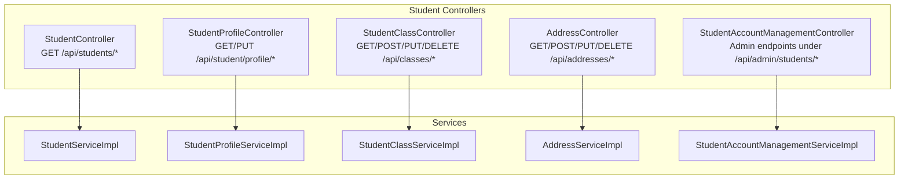
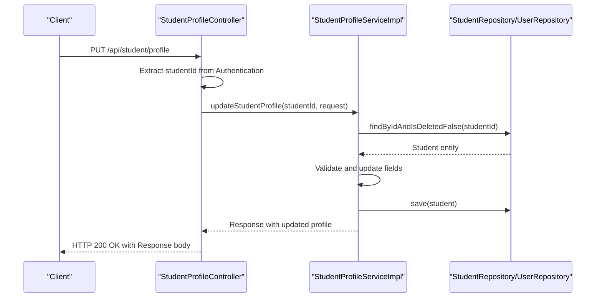
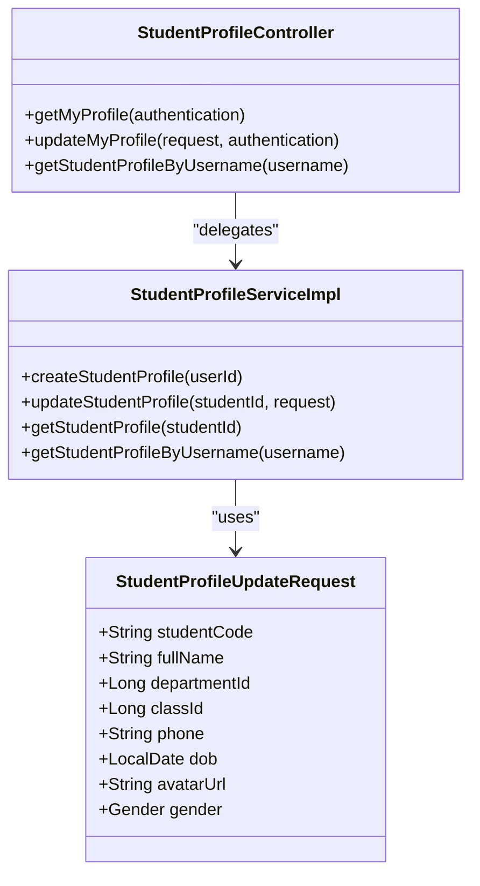
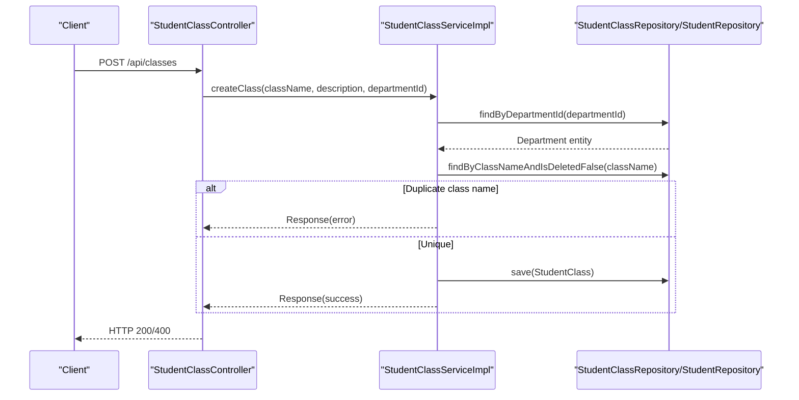
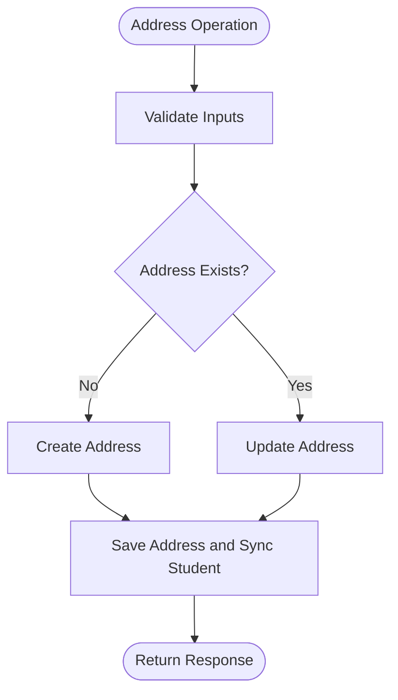
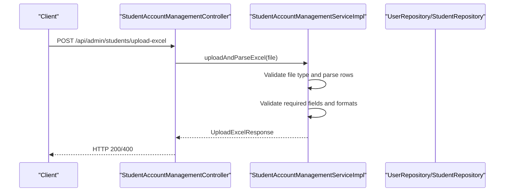
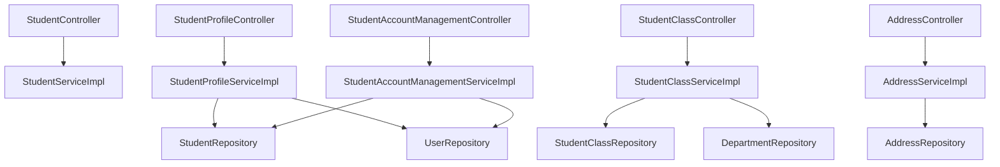

# Student Management API

<cite>
**Referenced Files in This Document**
- [StudentController.java](file://src/main/java/vn/campuslife/controller/student/StudentController.java)
- [StudentProfileController.java](file://src/main/java/vn/campuslife/controller/student/StudentProfileController.java)
- [StudentClassController.java](file://src/main/java/vn/campuslife/controller/student/StudentClassController.java)
- [AddressController.java](file://src/main/java/vn/campuslife/controller/student/AddressController.java)
- [StudentAccountManagementController.java](file://src/main/java/vn/campuslife/controller/student/StudentAccountManagementController.java)
- [StudentProfileUpdateRequest.java](file://src/main/java/vn/campuslife/model/StudentProfileUpdateRequest.java)
- [BulkCreateStudentsRequest.java](file://src/main/java/vn/campuslife/model/student/BulkCreateStudentsRequest.java)
- [BulkSendCredentialsRequest.java](file://src/main/java/vn/campuslife/model/student/BulkSendCredentialsRequest.java)
- [UpdateStudentAccountRequest.java](file://src/main/java/vn/campuslife/model/student/UpdateStudentAccountRequest.java)
- [Student.java](file://src/main/java/vn/campuslife/entity/Student.java)
- [StudentServiceImpl.java](file://src/main/java/vn/campuslife/service/impl/StudentServiceImpl.java)
- [StudentProfileServiceImpl.java](file://src/main/java/vn/campuslife/service/impl/StudentProfileServiceImpl.java)
- [StudentClassServiceImpl.java](file://src/main/java/vn/campuslife/service/impl/StudentClassServiceImpl.java)
- [AddressServiceImpl.java](file://src/main/java/vn/campuslife/service/impl/AddressServiceImpl.java)
- [StudentAccountManagementServiceImpl.java](file://src/main/java/vn/campuslife/service/impl/StudentAccountManagementServiceImpl.java)
</cite>

## Table of Contents
1. [Introduction](#introduction)
2. [Project Structure](#project-structure)
3. [Core Components](#core-components)
4. [Architecture Overview](#architecture-overview)
5. [Detailed Component Analysis](#detailed-component-analysis)
6. [Dependency Analysis](#dependency-analysis)
7. [Performance Considerations](#performance-considerations)
8. [Troubleshooting Guide](#troubleshooting-guide)
9. [Conclusion](#conclusion)

## Introduction
This document provides comprehensive API documentation for student-related endpoints in the CampusLife application. It covers student profile management, class enrollment, address handling, and bulk student operations. The documentation includes endpoint specifications, request/response schemas, validation rules, and operational workflows such as student onboarding, class management, and profile synchronization. It also outlines permissions, data privacy considerations, and integration points with academic systems.

## Project Structure
The student-related APIs are organized under dedicated controllers grouped by functional areas:
- Student profile and basic information retrieval
- Class enrollment and management
- Address management and geographic data
- Account management and bulk operations

**Diagram sources**
- [StudentController.java:13-124](file://src/main/java/vn/campuslife/controller/student/StudentController.java#L13-L124)
- [StudentProfileController.java:13-84](file://src/main/java/vn/campuslife/controller/student/StudentProfileController.java#L13-L84)
- [StudentClassController.java:10-164](file://src/main/java/vn/campuslife/controller/student/StudentClassController.java#L10-L164)
- [AddressController.java:11-185](file://src/main/java/vn/campuslife/controller/student/AddressController.java#L11-L185)
- [StudentAccountManagementController.java:13-94](file://src/main/java/vn/campuslife/controller/student/StudentAccountManagementController.java#L13-L94)

**Section sources**
- [StudentController.java:13-124](file://src/main/java/vn/campuslife/controller/student/StudentController.java#L13-L124)
- [StudentProfileController.java:13-84](file://src/main/java/vn/campuslife/controller/student/StudentProfileController.java#L13-L84)
- [StudentClassController.java:10-164](file://src/main/java/vn/campuslife/controller/student/StudentClassController.java#L10-L164)
- [AddressController.java:11-185](file://src/main/java/vn/campuslife/controller/student/AddressController.java#L11-L185)
- [StudentAccountManagementController.java:13-94](file://src/main/java/vn/campuslife/controller/student/StudentAccountManagementController.java#L13-L94)

## Core Components
This section summarizes the primary controllers and their responsibilities:
- StudentController: Retrieves paginated lists, searches, filters by department/class, and resolves student by ID or username.
- StudentProfileController: Manages current student profile retrieval/update and admin-level profile lookup by username.
- StudentClassController: Handles class lifecycle (create, update, delete), listing, and student enrollment/unenrollment.
- AddressController: Manages province/ward lookup, CRUD operations for student addresses, and geographic data loading.
- StudentAccountManagementController: Admin-only operations for bulk account creation, credential management, and account updates/deletion.

Key shared models:
- StudentProfileUpdateRequest: Defines profile update payload with validation constraints.
- BulkCreateStudentsRequest: Accepts a list of ExcelStudentRow entries for batch account creation.
- BulkSendCredentialsRequest: Accepts a list of student IDs for mass credential email dispatch.
- UpdateStudentAccountRequest: Allows selective updates to username, email, student code, and full name.

**Section sources**
- [StudentController.java:13-124](file://src/main/java/vn/campuslife/controller/student/StudentController.java#L13-L124)
- [StudentProfileController.java:13-84](file://src/main/java/vn/campuslife/controller/student/StudentProfileController.java#L13-L84)
- [StudentClassController.java:10-164](file://src/main/java/vn/campuslife/controller/student/StudentClassController.java#L10-L164)
- [AddressController.java:11-185](file://src/main/java/vn/campuslife/controller/student/AddressController.java#L11-L185)
- [StudentAccountManagementController.java:13-94](file://src/main/java/vn/campuslife/controller/student/StudentAccountManagementController.java#L13-L94)
- [StudentProfileUpdateRequest.java:11-40](file://src/main/java/vn/campuslife/model/StudentProfileUpdateRequest.java#L11-L40)
- [BulkCreateStudentsRequest.java:9-19](file://src/main/java/vn/campuslife/model/student/BulkCreateStudentsRequest.java#L9-L19)
- [BulkSendCredentialsRequest.java:9-19](file://src/main/java/vn/campuslife/model/student/BulkSendCredentialsRequest.java#L9-L19)
- [UpdateStudentAccountRequest.java:7-20](file://src/main/java/vn/campuslife/model/student/UpdateStudentAccountRequest.java#L7-L20)

## Architecture Overview
The API follows a layered architecture:
- Controllers expose REST endpoints and handle request validation.
- Services encapsulate business logic and coordinate with repositories.
- Entities define persistence models; DTOs are used for responses and requests where applicable.
- Validation is enforced via Bean Validation annotations on request models.

**Diagram sources**
- [StudentProfileController.java:44-60](file://src/main/java/vn/campuslife/controller/student/StudentProfileController.java#L44-L60)
- [StudentProfileServiceImpl.java:70-120](file://src/main/java/vn/campuslife/service/impl/StudentProfileServiceImpl.java#L70-L120)

**Section sources**
- [StudentProfileController.java:13-84](file://src/main/java/vn/campuslife/controller/student/StudentProfileController.java#L13-L84)
- [StudentProfileServiceImpl.java:19-224](file://src/main/java/vn/campuslife/service/impl/StudentProfileServiceImpl.java#L19-L224)

## Detailed Component Analysis

### Student Profile Management
Endpoints:
- GET /api/student/profile: Retrieve current student's profile using JWT authentication.
- PUT /api/student/profile: Update current student's profile with validated fields.
- GET /api/student/profile/{username}: Admin-only lookup by username.

Validation and schemas:
- StudentProfileUpdateRequest enforces non-blank student code and full name, optional fields include departmentId, classId, phone, date of birth, avatar URL, and gender.

Processing logic:
- Authentication extracts the username and maps to studentId via StudentService.
- Profile update validates department/class existence and updates only provided fields.
- Response includes computed profile completeness and resolved department/class names.

**Diagram sources**
- [StudentProfileUpdateRequest.java:11-40](file://src/main/java/vn/campuslife/model/StudentProfileUpdateRequest.java#L11-L40)
- [StudentProfileController.java:13-84](file://src/main/java/vn/campuslife/controller/student/StudentProfileController.java#L13-L84)
- [StudentProfileServiceImpl.java:19-224](file://src/main/java/vn/campuslife/service/impl/StudentProfileServiceImpl.java#L19-L224)

**Section sources**
- [StudentProfileController.java:13-84](file://src/main/java/vn/campuslife/controller/student/StudentProfileController.java#L13-L84)
- [StudentProfileServiceImpl.java:31-152](file://src/main/java/vn/campuslife/service/impl/StudentProfileServiceImpl.java#L31-L152)
- [StudentProfileUpdateRequest.java:11-40](file://src/main/java/vn/campuslife/model/StudentProfileUpdateRequest.java#L11-L40)

### Class Enrollment and Management
Endpoints:
- POST /api/classes: Create a new class with name, optional description, and departmentId.
- PUT /api/classes/{classId}: Update class name and description.
- GET /api/classes: List all active classes.
- GET /api/classes/department/{departmentId}: Filter classes by department.
- GET /api/classes/{classId}: Retrieve class details.
- DELETE /api/classes/{classId}: Soft delete a class.
- GET /api/classes/{classId}/students: List students enrolled in a class.
- POST /api/classes/{classId}/students/{studentId}: Enroll a student.
- DELETE /api/classes/{classId}/students/{studentId}: Unenroll a student.
- GET /api/classes/name/{className}: Lookup class by name.

Processing logic:
- Class creation validates department existence and uniqueness of class name.
- Enrollment automatically propagates department from class to student.
- Unenrollment ensures the student is currently in the specified class.

**Diagram sources**
- [StudentClassController.java:18-31](file://src/main/java/vn/campuslife/controller/student/StudentClassController.java#L18-L31)
- [StudentClassServiceImpl.java:32-60](file://src/main/java/vn/campuslife/service/impl/StudentClassServiceImpl.java#L32-L60)

**Section sources**
- [StudentClassController.java:10-164](file://src/main/java/vn/campuslife/controller/student/StudentClassController.java#L10-L164)
- [StudentClassServiceImpl.java:32-148](file://src/main/java/vn/campuslife/service/impl/StudentClassServiceImpl.java#L32-L148)

### Address Handling
Endpoints:
- GET /api/addresses/provinces: Fetch province list from cached geographic data.
- GET /api/addresses/provinces/{provinceCode}/wards: Fetch wards filtered by province.
- GET /api/addresses/my: Retrieve current student's address.
- POST /api/addresses/my: Create current student's address.
- PUT /api/addresses/my: Update current student's address.
- DELETE /api/addresses/my: Soft delete current student's address.
- GET /api/addresses/search: Search addresses by keyword.
- POST /api/addresses/load-data: Load province data from local JSON (cached).

Processing logic:
- Geographic data is loaded from a local JSON file and cached to avoid repeated reads.
- Address creation/updating maintains bidirectional consistency with the Student entity.
- Deletion performs soft deletion and detaches the address from the student.

**Diagram sources**
- [AddressController.java:48-119](file://src/main/java/vn/campuslife/controller/student/AddressController.java#L48-L119)
- [AddressServiceImpl.java:123-204](file://src/main/java/vn/campuslife/service/impl/AddressServiceImpl.java#L123-L204)

**Section sources**
- [AddressController.java:11-185](file://src/main/java/vn/campuslife/controller/student/AddressController.java#L11-L185)
- [AddressServiceImpl.java:35-232](file://src/main/java/vn/campuslife/service/impl/AddressServiceImpl.java#L35-L232)

### Bulk Student Operations
Endpoints:
- POST /api/admin/students/upload-excel: Upload and parse Excel file containing student rows.
- POST /api/admin/students/bulk-create: Create multiple student accounts from parsed data.
- GET /api/admin/students/pending: List pending accounts with activation and email-sent indicators.
- PUT /api/admin/students/{studentId}/account: Update username/email/studentCode/fullName.
- DELETE /api/admin/students/{studentId}/account: Soft delete student and associated user.
- POST /api/admin/students/{studentId}/send-credentials: Send credentials email with generated password.
- POST /api/admin/students/bulk-send-credentials: Send credentials emails to multiple students.

Validation and schemas:
- BulkCreateStudentsRequest accepts a list of ExcelStudentRow entries with studentCode, fullName, and email.
- BulkSendCredentialsRequest accepts a list of student IDs.
- UpdateStudentAccountRequest allows partial updates with validation.

Processing logic:
- Excel parsing validates required fields and formats; returns summary of valid/invalid rows.
- Bulk creation generates secure passwords, creates User and Student entities, initializes scores, and aggregates results.
- Credential sending generates a new password, hashes it, and emails credentials.

**Diagram sources**
- [StudentAccountManagementController.java:20-28](file://src/main/java/vn/campuslife/controller/student/StudentAccountManagementController.java#L20-L28)
- [StudentAccountManagementServiceImpl.java:39-98](file://src/main/java/vn/campuslife/service/impl/StudentAccountManagementServiceImpl.java#L39-L98)

**Section sources**
- [StudentAccountManagementController.java:13-94](file://src/main/java/vn/campuslife/controller/student/StudentAccountManagementController.java#L13-L94)
- [StudentAccountManagementServiceImpl.java:39-506](file://src/main/java/vn/campuslife/service/impl/StudentAccountManagementServiceImpl.java#L39-L506)

### Student Records Retrieval
Endpoints:
- GET /api/students: Paginated list of all students with sorting support.
- GET /api/students/search: Search by keyword across full name and student code.
- GET /api/students/without-class: Students without class assignment.
- GET /api/students/department/{departmentId}: Students in a specific department.
- GET /api/students/{studentId}: Retrieve student by ID.
- GET /api/students/username/{username}: Retrieve student by username.

Processing logic:
- All endpoints exclude deleted records.
- Search uses composite criteria across full name and student code.
- Department filtering leverages class-to-department relationship.

**Section sources**
- [StudentController.java:13-124](file://src/main/java/vn/campuslife/controller/student/StudentController.java#L13-L124)
- [StudentServiceImpl.java:40-153](file://src/main/java/vn/campuslife/service/impl/StudentServiceImpl.java#L40-L153)

## Dependency Analysis
The controllers depend on corresponding service implementations, which in turn depend on repositories and utility components. Address operations rely on geographic data caching and JSON parsing. Account management integrates with password encoding, email utilities, and score initialization services.

**Diagram sources**
- [StudentController.java:13-124](file://src/main/java/vn/campuslife/controller/student/StudentController.java#L13-L124)
- [StudentProfileController.java:13-84](file://src/main/java/vn/campuslife/controller/student/StudentProfileController.java#L13-L84)
- [StudentClassController.java:10-164](file://src/main/java/vn/campuslife/controller/student/StudentClassController.java#L10-L164)
- [AddressController.java:11-185](file://src/main/java/vn/campuslife/controller/student/AddressController.java#L11-L185)
- [StudentAccountManagementController.java:13-94](file://src/main/java/vn/campuslife/controller/student/StudentAccountManagementController.java#L13-L94)

**Section sources**
- [StudentServiceImpl.java:20-154](file://src/main/java/vn/campuslife/service/impl/StudentServiceImpl.java#L20-L154)
- [StudentProfileServiceImpl.java:19-224](file://src/main/java/vn/campuslife/service/impl/StudentProfileServiceImpl.java#L19-L224)
- [StudentClassServiceImpl.java:22-276](file://src/main/java/vn/campuslife/service/impl/StudentClassServiceImpl.java#L22-L276)
- [AddressServiceImpl.java:21-289](file://src/main/java/vn/campuslife/service/impl/AddressServiceImpl.java#L21-L289)
- [StudentAccountManagementServiceImpl.java:26-507](file://src/main/java/vn/campuslife/service/impl/StudentAccountManagementServiceImpl.java#L26-L507)

## Performance Considerations
- Pagination: All list endpoints support pagination and sorting to manage large datasets efficiently.
- Caching: Geographic province data is cached to reduce repeated file I/O.
- Lazy loading: Address and department relationships are fetched lazily to minimize unnecessary joins.
- Batch operations: Bulk creation and credential sending process items iteratively; consider chunking for very large inputs.

## Troubleshooting Guide
Common issues and resolutions:
- Authentication failures: Ensure valid JWT token is included; profile endpoints require authenticated student context.
- Entity not found: Many endpoints return explicit errors when entities are missing (e.g., student, class, department, address).
- Validation errors: Requests must satisfy field constraints (e.g., non-blank student code/full name, valid email format).
- Geographic data errors: Province/ward queries depend on cached data; use load endpoint if data appears stale.
- Soft deletes: Deleted records are excluded from most queries; ensure restoration is handled at the application level if needed.

**Section sources**
- [StudentProfileController.java:24-60](file://src/main/java/vn/campuslife/controller/student/StudentProfileController.java#L24-L60)
- [StudentClassServiceImpl.java:32-148](file://src/main/java/vn/campuslife/service/impl/StudentClassServiceImpl.java#L32-L148)
- [AddressServiceImpl.java:35-232](file://src/main/java/vn/campuslife/service/impl/AddressServiceImpl.java#L35-L232)
- [StudentAccountManagementServiceImpl.java:39-506](file://src/main/java/vn/campuslife/service/impl/StudentAccountManagementServiceImpl.java#L39-L506)

## Conclusion
The Student Management API provides a robust set of endpoints for managing student profiles, class enrollments, addresses, and administrative account operations. The design emphasizes clear separation of concerns, validation, and extensibility. Administrators can onboard students at scale, while students can manage their own profiles and addresses. Integration with academic systems can leverage class enrollment and department filtering to align with institutional structures.