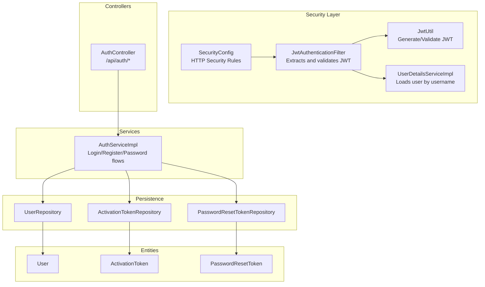
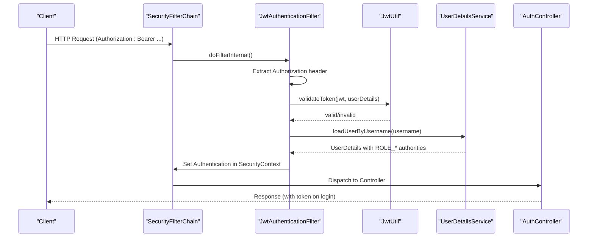
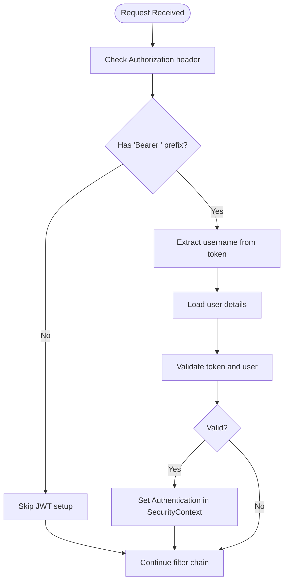
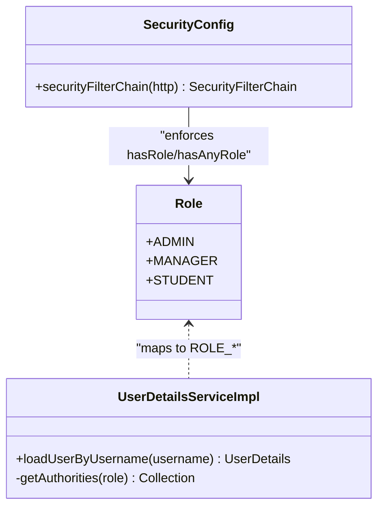
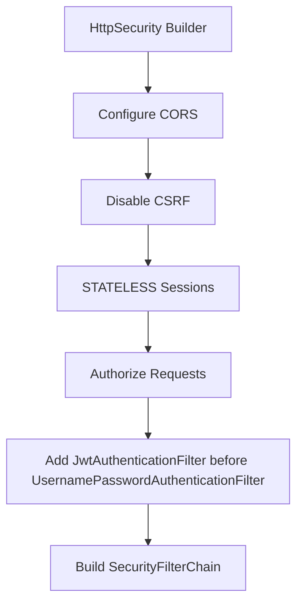
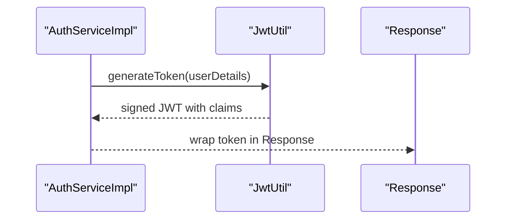
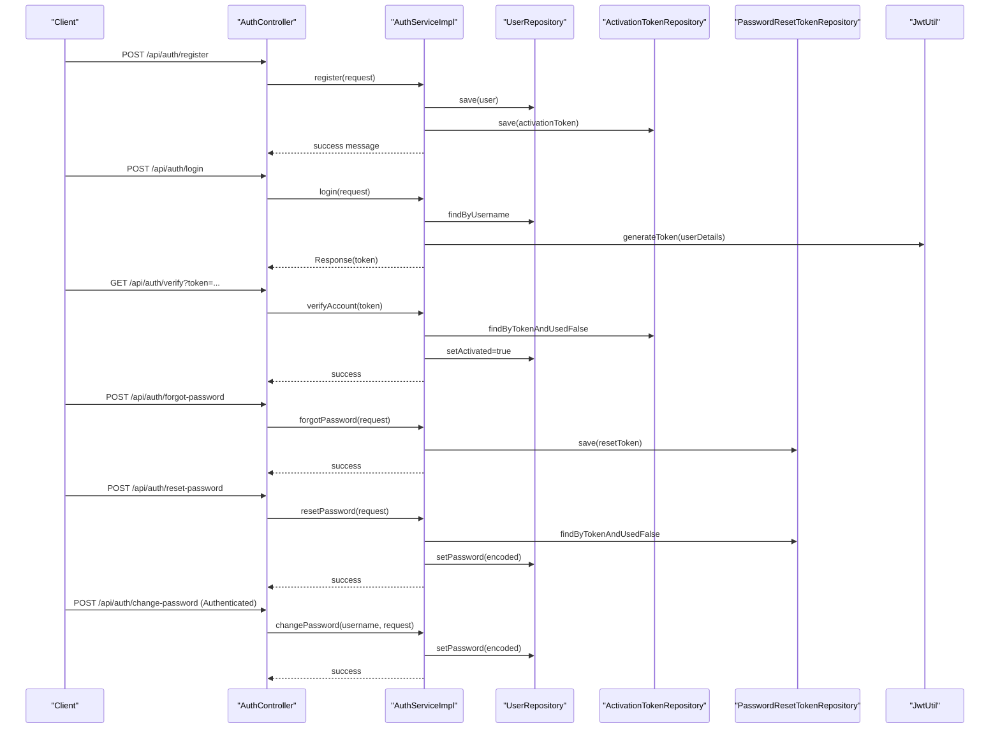
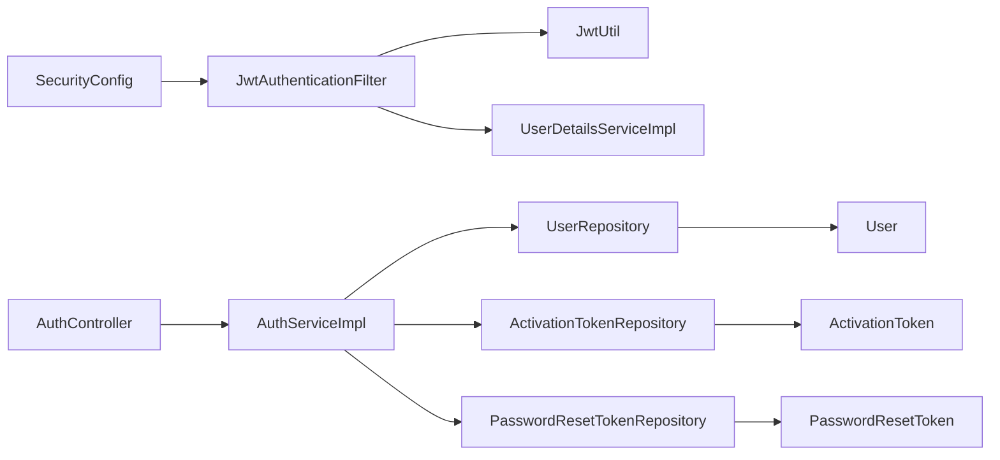

# Authentication & Authorization

<cite>
**Referenced Files in This Document**
- [SecurityConfig.java](file://src/main/java/vn/campuslife/config/SecurityConfig.java)
- [JwtAuthenticationFilter.java](file://src/main/java/vn/campuslife/filter/JwtAuthenticationFilter.java)
- [JwtUtil.java](file://src/main/java/vn/campuslife/util/JwtUtil.java)
- [UserDetailsServiceImpl.java](file://src/main/java/vn/campuslife/service/impl/UserDetailsServiceImpl.java)
- [AuthController.java](file://src/main/java/vn/campuslife/controller/auth/AuthController.java)
- [AuthServiceImpl.java](file://src/main/java/vn/campuslife/service/impl/AuthServiceImpl.java)
- [application.properties](file://src/main/resources/application.properties)
- [Role.java](file://src/main/java/vn/campuslife/enumeration/Role.java)
- [User.java](file://src/main/java/vn/campuslife/entity/User.java)
- [UserRepository.java](file://src/main/java/vn/campuslife/repository/UserRepository.java)
- [PasswordResetToken.java](file://src/main/java/vn/campuslife/entity/PasswordResetToken.java)
- [PasswordResetTokenRepository.java](file://src/main/java/vn/campuslife/repository/PasswordResetTokenRepository.java)
- [ActivationToken.java](file://src/main/java/vn/campuslife/entity/ActivationToken.java)
- [ActivationTokenRepository.java](file://src/main/java/vn/campuslife/repository/ActivationTokenRepository.java)
- [EventArticleAdminController.java](file://src/main/java/vn/campuslife/controller/article/EventArticleAdminController.java)
- [PreparationController.java](file://src/main/java/vn/campuslife/controller/preparation/PreparationController.java)
</cite>

## Table of Contents
1. [Introduction](#introduction)
2. [Project Structure](#project-structure)
3. [Core Components](#core-components)
4. [Architecture Overview](#architecture-overview)
5. [Detailed Component Analysis](#detailed-component-analysis)
6. [Dependency Analysis](#dependency-analysis)
7. [Performance Considerations](#performance-considerations)
8. [Troubleshooting Guide](#troubleshooting-guide)
9. [Conclusion](#conclusion)
10. [Appendices](#appendices)

## Introduction
This document explains the authentication and authorization subsystem of the CampusLife system. It covers JWT-based authentication, role-based access control (RBAC) with ADMIN, MANAGER, and STUDENT roles, security configuration, token lifecycle, the filter chain, method-level security annotations, user registration and login flows, password management with BCrypt, and session handling. It also provides practical examples for securing endpoints, role checks, implementing new authenticated endpoints, best practices, token refresh considerations, and troubleshooting.

## Project Structure
The authentication and authorization features are implemented across configuration, filters, utilities, services, controllers, entities, and repositories:

- Security configuration defines HTTP security rules, CORS, stateless sessions, and the filter chain.
- A JWT filter extracts tokens from Authorization headers and validates them against the user details service.
- JWT utilities handle token generation, parsing, and validation.
- Services implement login, registration, password reset/change flows, and integrate with repositories.
- Controllers expose endpoints for authentication and password management.
- Entities and repositories support activation and password reset tokens.
- Method-level security annotations enforce fine-grained access control in selected controllers.

**Diagram sources**
- [SecurityConfig.java:59-297](file://src/main/java/vn/campuslife/config/SecurityConfig.java#L59-L297)
- [JwtAuthenticationFilter.java:34-103](file://src/main/java/vn/campuslife/filter/JwtAuthenticationFilter.java#L34-L103)
- [JwtUtil.java:56-83](file://src/main/java/vn/campuslife/util/JwtUtil.java#L56-L83)
- [UserDetailsServiceImpl.java:24-40](file://src/main/java/vn/campuslife/service/impl/UserDetailsServiceImpl.java#L24-L40)
- [AuthController.java:24-94](file://src/main/java/vn/campuslife/controller/auth/AuthController.java#L24-L94)
- [AuthServiceImpl.java:58-338](file://src/main/java/vn/campuslife/service/impl/AuthServiceImpl.java#L58-L338)
- [UserRepository.java:12-20](file://src/main/java/vn/campuslife/repository/UserRepository.java#L12-L20)
- [ActivationTokenRepository.java:9-12](file://src/main/java/vn/campuslife/repository/ActivationTokenRepository.java#L9-L12)
- [PasswordResetTokenRepository.java:12-21](file://src/main/java/vn/campuslife/repository/PasswordResetTokenRepository.java#L12-L21)

**Section sources**
- [SecurityConfig.java:59-297](file://src/main/java/vn/campuslife/config/SecurityConfig.java#L59-L297)
- [JwtAuthenticationFilter.java:34-103](file://src/main/java/vn/campuslife/filter/JwtAuthenticationFilter.java#L34-L103)
- [JwtUtil.java:56-83](file://src/main/java/vn/campuslife/util/JwtUtil.java#L56-L83)
- [UserDetailsServiceImpl.java:24-40](file://src/main/java/vn/campuslife/service/impl/UserDetailsServiceImpl.java#L24-L40)
- [AuthController.java:24-94](file://src/main/java/vn/campuslife/controller/auth/AuthController.java#L24-L94)
- [AuthServiceImpl.java:58-338](file://src/main/java/vn/campuslife/service/impl/AuthServiceImpl.java#L58-L338)
- [UserRepository.java:12-20](file://src/main/java/vn/campuslife/repository/UserRepository.java#L12-L20)
- [ActivationTokenRepository.java:9-12](file://src/main/java/vn/campuslife/repository/ActivationTokenRepository.java#L9-L12)
- [PasswordResetTokenRepository.java:12-21](file://src/main/java/vn/campuslife/repository/PasswordResetTokenRepository.java#L12-L21)

## Core Components
- Security configuration: Stateless session policy, CORS, CSRF disabled, public endpoints, and granular endpoint-based authorization rules.
- JWT filter: Extracts Bearer tokens, loads user details, validates tokens, and sets authentication in the security context.
- JWT utilities: Generate tokens with role claim, parse and validate tokens, and derive username/expiration.
- User details service: Loads users by username and maps roles to authorities.
- Authentication controller and service: Implement registration, login, account verification, forgot/reset/change password with BCrypt.
- Repositories and entities: Persist activation and password reset tokens with expiry and usage tracking.

**Section sources**
- [SecurityConfig.java:59-297](file://src/main/java/vn/campuslife/config/SecurityConfig.java#L59-L297)
- [JwtAuthenticationFilter.java:34-103](file://src/main/java/vn/campuslife/filter/JwtAuthenticationFilter.java#L34-L103)
- [JwtUtil.java:56-83](file://src/main/java/vn/campuslife/util/JwtUtil.java#L56-L83)
- [UserDetailsServiceImpl.java:24-40](file://src/main/java/vn/campuslife/service/impl/UserDetailsServiceImpl.java#L24-L40)
- [AuthController.java:24-94](file://src/main/java/vn/campuslife/controller/auth/AuthController.java#L24-L94)
- [AuthServiceImpl.java:58-338](file://src/main/java/vn/campuslife/service/impl/AuthServiceImpl.java#L58-L338)

## Architecture Overview
The authentication pipeline is request-driven:

- Requests hit the Spring Security filter chain configured in SecurityConfig.
- JwtAuthenticationFilter intercepts requests, extracts the Authorization header, and if present, validates the JWT via JwtUtil and UserDetailsService.
- On successful validation, an authentication object is placed in SecurityContext for downstream controllers and method-level security.
- Controllers expose endpoints under /api/auth for registration, login, verification, forgot password, reset password, and change password.
- Passwords are hashed with BCrypt; tokens carry role claims for RBAC enforcement.

**Diagram sources**
- [SecurityConfig.java:59-297](file://src/main/java/vn/campuslife/config/SecurityConfig.java#L59-L297)
- [JwtAuthenticationFilter.java:34-103](file://src/main/java/vn/campuslife/filter/JwtAuthenticationFilter.java#L34-L103)
- [JwtUtil.java:80-83](file://src/main/java/vn/campuslife/util/JwtUtil.java#L80-L83)
- [UserDetailsServiceImpl.java:24-40](file://src/main/java/vn/campuslife/service/impl/UserDetailsServiceImpl.java#L24-L40)
- [AuthController.java:41-44](file://src/main/java/vn/campuslife/controller/auth/AuthController.java#L41-L44)

## Detailed Component Analysis

### JWT-Based Authentication Flow
- Header parsing: The filter reads Authorization headers and expects "Bearer ".
- Username extraction: JwtUtil extracts the subject (username) from the token.
- Validation: JwtUtil verifies issuer/expiration and signature; UserDetailsService ensures the user exists and is activated.
- Authentication: Upon success, an authentication token is created with authorities and stored in SecurityContext.

**Diagram sources**
- [JwtAuthenticationFilter.java:34-103](file://src/main/java/vn/campuslife/filter/JwtAuthenticationFilter.java#L34-L103)
- [JwtUtil.java:80-83](file://src/main/java/vn/campuslife/util/JwtUtil.java#L80-L83)
- [UserDetailsServiceImpl.java:24-40](file://src/main/java/vn/campuslife/service/impl/UserDetailsServiceImpl.java#L24-L40)

**Section sources**
- [JwtAuthenticationFilter.java:34-103](file://src/main/java/vn/campuslife/filter/JwtAuthenticationFilter.java#L34-L103)
- [JwtUtil.java:27-83](file://src/main/java/vn/campuslife/util/JwtUtil.java#L27-L83)
- [UserDetailsServiceImpl.java:24-40](file://src/main/java/vn/campuslife/service/impl/UserDetailsServiceImpl.java#L24-L40)

### Role-Based Access Control (RBAC)
- Roles: ADMIN, MANAGER, STUDENT are defined as an enum and mapped to authorities with "ROLE_" prefix.
- Endpoint-level RBAC: SecurityConfig enforces hasRole/hasAnyRole for specific paths.
- Method-level RBAC: @PreAuthorize annotations in controllers enforce roles and custom expressions.

**Diagram sources**
- [Role.java:3-7](file://src/main/java/vn/campuslife/enumeration/Role.java#L3-L7)
- [UserDetailsServiceImpl.java:38-40](file://src/main/java/vn/campuslife/service/impl/UserDetailsServiceImpl.java#L38-L40)
- [SecurityConfig.java:85-94](file://src/main/java/vn/campuslife/config/SecurityConfig.java#L85-L94)

**Section sources**
- [Role.java:3-7](file://src/main/java/vn/campuslife/enumeration/Role.java#L3-L7)
- [UserDetailsServiceImpl.java:38-40](file://src/main/java/vn/campuslife/service/impl/UserDetailsServiceImpl.java#L38-L40)
- [SecurityConfig.java:85-94](file://src/main/java/vn/campuslife/config/SecurityConfig.java#L85-L94)

### Security Configuration
- Stateless sessions: SessionCreationPolicy.STATELESS disables server-side sessions.
- CSRF disabled: CSRF protection is disabled for stateless APIs.
- CORS enabled: Configured via CorsConfigurationSource.
- Public endpoints: Registration, login, verification, forgot password, reset password are permitted without authentication.
- Endpoint rules: Fine-grained hasRole/hasAnyRole rules for admin, manager, student access across multiple feature areas.
- Filter insertion: JwtAuthenticationFilter is added before UsernamePasswordAuthenticationFilter.

**Diagram sources**
- [SecurityConfig.java:59-297](file://src/main/java/vn/campuslife/config/SecurityConfig.java#L59-L297)

**Section sources**
- [SecurityConfig.java:59-297](file://src/main/java/vn/campuslife/config/SecurityConfig.java#L59-L297)

### JWT Utilities and Token Lifecycle
- Generation: Claims include subject and optional role derived from authorities. Expiration is configurable.
- Parsing: Claims are extracted and validated; username and expiration are checked.
- Validation: Ensures username matches and token is not expired.

**Diagram sources**
- [AuthServiceImpl.java:87-92](file://src/main/java/vn/campuslife/service/impl/AuthServiceImpl.java#L87-L92)
- [JwtUtil.java:56-78](file://src/main/java/vn/campuslife/util/JwtUtil.java#L56-L78)

**Section sources**
- [JwtUtil.java:56-83](file://src/main/java/vn/campuslife/util/JwtUtil.java#L56-L83)
- [AuthServiceImpl.java:87-92](file://src/main/java/vn/campuslife/service/impl/AuthServiceImpl.java#L87-L92)

### User Registration, Login, and Password Management
- Registration: Validates input, checks uniqueness, encodes password with BCrypt, assigns initial role, creates activation token, and sends activation email.
- Login: Verifies credentials, updates last login, generates JWT with role claim.
- Account verification: Validates activation token, marks user activated, and marks token used.
- Forgot password: Sends reset link with a time-limited token; always returns success to prevent email enumeration.
- Reset password: Validates token, checks expiry, re-encodes password with BCrypt.
- Change password: Requires authenticated user, validates old/new/confirm passwords, and re-encodes.

**Diagram sources**
- [AuthController.java:24-94](file://src/main/java/vn/campuslife/controller/auth/AuthController.java#L24-L94)
- [AuthServiceImpl.java:58-338](file://src/main/java/vn/campuslife/service/impl/AuthServiceImpl.java#L58-L338)
- [UserRepository.java:12-20](file://src/main/java/vn/campuslife/repository/UserRepository.java#L12-L20)
- [ActivationTokenRepository.java:9-12](file://src/main/java/vn/campuslife/repository/ActivationTokenRepository.java#L9-L12)
- [PasswordResetTokenRepository.java:12-21](file://src/main/java/vn/campuslife/repository/PasswordResetTokenRepository.java#L12-L21)
- [JwtUtil.java:56-78](file://src/main/java/vn/campuslife/util/JwtUtil.java#L56-L78)

**Section sources**
- [AuthController.java:24-94](file://src/main/java/vn/campuslife/controller/auth/AuthController.java#L24-L94)
- [AuthServiceImpl.java:58-338](file://src/main/java/vn/campuslife/service/impl/AuthServiceImpl.java#L58-L338)
- [UserRepository.java:12-20](file://src/main/java/vn/campuslife/repository/UserRepository.java#L12-L20)
- [ActivationTokenRepository.java:9-12](file://src/main/java/vn/campuslife/repository/ActivationTokenRepository.java#L9-L12)
- [PasswordResetTokenRepository.java:12-21](file://src/main/java/vn/campuslife/repository/PasswordResetTokenRepository.java#L12-L21)
- [JwtUtil.java:56-78](file://src/main/java/vn/campuslife/util/JwtUtil.java#L56-L78)

### Method-Level Security Annotations
- Controllers use @PreAuthorize to enforce roles and custom expressions for specialized access checks.
- Examples include administrative controls and preparation-specific authorizations.

Practical examples:
- Enforce ADMIN or MANAGER for administrative actions:
  - Annotation: @PreAuthorize("hasAnyRole('ADMIN', 'MANAGER')")

- Enforce STUDENT-only access:
  - Annotation: @PreAuthorize("hasRole('STUDENT')")

- Combine roles with custom expressions:
  - Annotation: @PreAuthorize("hasAnyRole('ADMIN','MANAGER') or @preparationSecurity.isActivityPrepSupervisor(#activityId, authentication)")

**Section sources**
- [EventArticleAdminController.java:32](file://src/main/java/vn/campuslife/controller/article/EventArticleAdminController.java#L32)
- [PreparationController.java:28](file://src/main/java/vn/campuslife/controller/preparation/PreparationController.java#L28)
- [PreparationController.java:35](file://src/main/java/vn/campuslife/controller/preparation/PreparationController.java#L35)
- [PreparationController.java:42](file://src/main/java/vn/campuslife/controller/preparation/PreparationController.java#L42)

### Implementing New Authenticated Endpoints
Steps to secure a new endpoint:
- Add the endpoint in a controller.
- Define HTTP method and path.
- Choose appropriate authorization:
  - PermitAll for public endpoints.
  - authenticated() for any logged-in user.
  - hasRole('ADMIN'/'MANAGER'/'STUDENT') for single-role access.
  - hasAnyRole('ADMIN','MANAGER','STUDENT') for multi-role access.
- Place the rule before a broader wildcard rule to avoid conflicts.
- For method-level checks inside controllers, annotate methods with @PreAuthorize.

Example patterns:
- Public: permitAll for registration, login, verification, forgot/reset.
- Protected: authenticated() for user info endpoints.
- Role-specific: hasRole('STUDENT') for student-only endpoints.
- Mixed roles: hasAnyRole('ADMIN','MANAGER') for admin/manager endpoints.

**Section sources**
- [SecurityConfig.java:69-77](file://src/main/java/vn/campuslife/config/SecurityConfig.java#L69-L77)
- [SecurityConfig.java:96-160](file://src/main/java/vn/campuslife/config/SecurityConfig.java#L96-L160)
- [SecurityConfig.java:173-192](file://src/main/java/vn/campuslife/config/SecurityConfig.java#L173-L192)
- [SecurityConfig.java:258-264](file://src/main/java/vn/campuslife/config/SecurityConfig.java#L258-L264)

### Session Handling
- The system is stateless: SessionCreationPolicy.STATELESS disables server-side sessions.
- Authentication state is maintained client-side in the JWT token.
- No server-side session storage is used.

**Section sources**
- [SecurityConfig.java:64](file://src/main/java/vn/campuslife/config/SecurityConfig.java#L64)

### Security Best Practices
- Use strong secrets: Configure jwt.secret via environment variables (JWT_SECRET).
- Short-lived tokens: Adjust jwt.expiration appropriately; consider refresh tokens for extended sessions.
- HTTPS in production: Ensure transport security for token transmission.
- Secure headers: Add HSTS, CSP, and other headers as needed.
- Least privilege: Prefer hasAnyRole('ADMIN','MANAGER') over broad permissions.
- Rate limiting: Apply rate limits for login/forgot password endpoints.
- Token revocation: Implement blacklist or short expirations; consider refresh token rotation.

**Section sources**
- [application.properties:62-66](file://src/main/resources/application.properties#L62-L66)

## Dependency Analysis
The authentication stack depends on:
- SecurityConfig for global rules and filter chain.
- JwtAuthenticationFilter for per-request token validation.
- JwtUtil for token operations.
- UserDetailsService for user lookup and authority mapping.
- AuthService and repositories for registration, login, and token persistence.

**Diagram sources**
- [SecurityConfig.java:59-297](file://src/main/java/vn/campuslife/config/SecurityConfig.java#L59-L297)
- [JwtAuthenticationFilter.java:28-31](file://src/main/java/vn/campuslife/filter/JwtAuthenticationFilter.java#L28-L31)
- [JwtUtil.java:56-83](file://src/main/java/vn/campuslife/util/JwtUtil.java#L56-L83)
- [UserDetailsServiceImpl.java:24-40](file://src/main/java/vn/campuslife/service/impl/UserDetailsServiceImpl.java#L24-L40)
- [AuthController.java:24-94](file://src/main/java/vn/campuslife/controller/auth/AuthController.java#L24-L94)
- [AuthServiceImpl.java:58-338](file://src/main/java/vn/campuslife/service/impl/AuthServiceImpl.java#L58-L338)
- [UserRepository.java:12-20](file://src/main/java/vn/campuslife/repository/UserRepository.java#L12-L20)
- [ActivationTokenRepository.java:9-12](file://src/main/java/vn/campuslife/repository/ActivationTokenRepository.java#L9-L12)
- [PasswordResetTokenRepository.java:12-21](file://src/main/java/vn/campuslife/repository/PasswordResetTokenRepository.java#L12-L21)

**Section sources**
- [SecurityConfig.java:59-297](file://src/main/java/vn/campuslife/config/SecurityConfig.java#L59-L297)
- [JwtAuthenticationFilter.java:28-31](file://src/main/java/vn/campuslife/filter/JwtAuthenticationFilter.java#L28-L31)
- [JwtUtil.java:56-83](file://src/main/java/vn/campuslife/util/JwtUtil.java#L56-L83)
- [UserDetailsServiceImpl.java:24-40](file://src/main/java/vn/campuslife/service/impl/UserDetailsServiceImpl.java#L24-L40)
- [AuthController.java:24-94](file://src/main/java/vn/campuslife/controller/auth/AuthController.java#L24-L94)
- [AuthServiceImpl.java:58-338](file://src/main/java/vn/campuslife/service/impl/AuthServiceImpl.java#L58-L338)
- [UserRepository.java:12-20](file://src/main/java/vn/campuslife/repository/UserRepository.java#L12-L20)
- [ActivationTokenRepository.java:9-12](file://src/main/java/vn/campuslife/repository/ActivationTokenRepository.java#L9-L12)
- [PasswordResetTokenRepository.java:12-21](file://src/main/java/vn/campuslife/repository/PasswordResetTokenRepository.java#L12-L21)

## Performance Considerations
- Stateless design eliminates session storage overhead.
- Token validation is lightweight; cache user roles if needed at the application level.
- Keep token expiration reasonable to balance security and client-side refresh frequency.
- Avoid excessive logging in production to reduce I/O overhead during authentication.

## Troubleshooting Guide
Common issues and resolutions:
- Invalid or missing Authorization header:
  - Ensure requests include "Authorization: Bearer <token>".
  - Verify the filter extracts the header correctly.

- Token validation failures:
  - Confirm jwt.secret matches the server configuration.
  - Check token expiration and clock skew.

- User not found:
  - Ensure the username exists and is not marked deleted/activated.

- Password reset token errors:
  - Verify token is unexpired and unused.
  - Check email delivery and frontend URLs.

- Role-based access denied:
  - Confirm the user’s role and authority mapping.
  - Review endpoint rules ordering in SecurityConfig.

**Section sources**
- [JwtAuthenticationFilter.java:46-64](file://src/main/java/vn/campuslife/filter/JwtAuthenticationFilter.java#L46-L64)
- [JwtUtil.java:80-83](file://src/main/java/vn/campuslife/util/JwtUtil.java#L80-L83)
- [UserDetailsServiceImpl.java:24-40](file://src/main/java/vn/campuslife/service/impl/UserDetailsServiceImpl.java#L24-L40)
- [AuthServiceImpl.java:174-198](file://src/main/java/vn/campuslife/service/impl/AuthServiceImpl.java#L174-L198)
- [AuthServiceImpl.java:250-287](file://src/main/java/vn/campuslife/service/impl/AuthServiceImpl.java#L250-L287)

## Conclusion
CampusLife implements a robust, stateless JWT-based authentication and authorization system. SecurityConfig defines strict endpoint-level rules, JwtAuthenticationFilter performs per-request validation, and JwtUtil manages token lifecycle. RBAC leverages roles and method-level annotations for precise access control. Passwords are securely hashed with BCrypt, and tokenized flows support registration, login, verification, and password reset/change. Following the outlined best practices and troubleshooting steps will help maintain a secure and reliable authentication layer.

## Appendices
- Configuration keys:
  - jwt.secret: Secret key for signing tokens (configure via environment variable).
  - jwt.expiration: Token TTL in milliseconds.
  - app.base-url and app.frontend-url: Used for generating activation/reset links.

**Section sources**
- [application.properties:62-66](file://src/main/resources/application.properties#L62-L66)
- [application.properties:35-41](file://src/main/resources/application.properties#L35-L41)