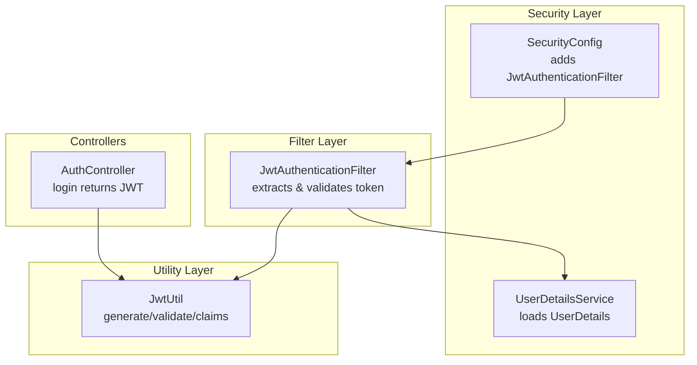
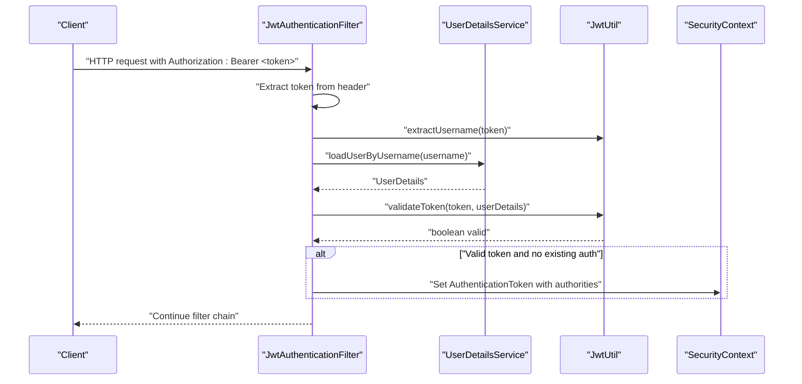
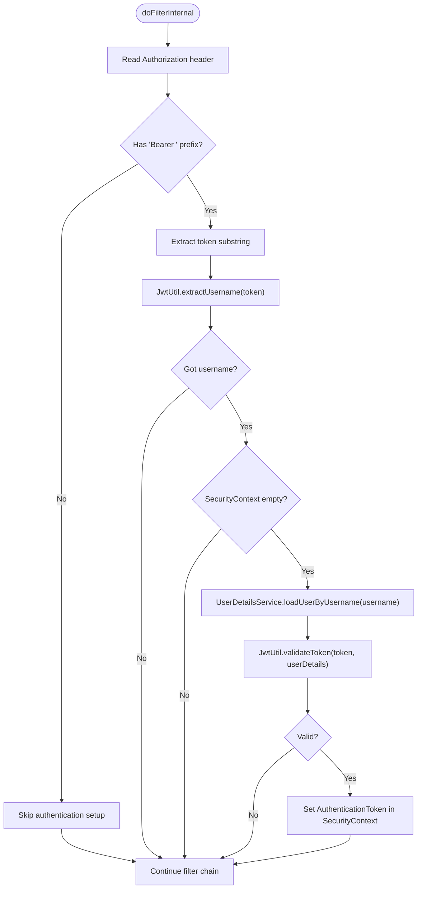
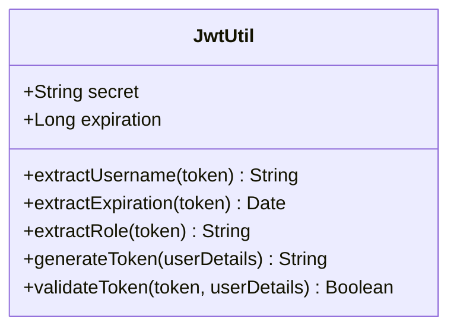
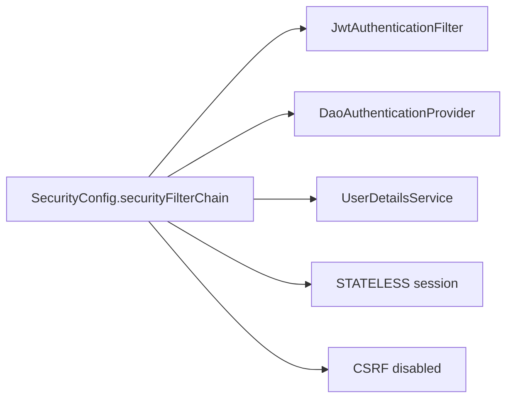
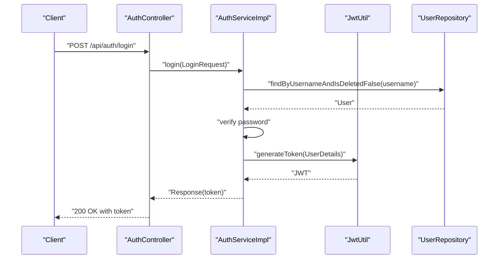
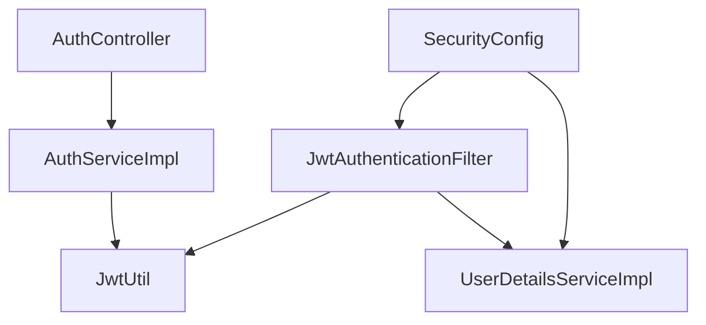

# JWT Authentication

<cite>
**Referenced Files in This Document**
- [JwtAuthenticationFilter.java](file://src/main/java/vn/campuslife/filter/JwtAuthenticationFilter.java)
- [JwtUtil.java](file://src/main/java/vn/campuslife/util/JwtUtil.java)
- [SecurityConfig.java](file://src/main/java/vn/campuslife/config/SecurityConfig.java)
- [AuthController.java](file://src/main/java/vn/campuslife/controller/auth/AuthController.java)
- [AuthServiceImpl.java](file://src/main/java/vn/campuslife/service/impl/AuthServiceImpl.java)
- [UserDetailsServiceImpl.java](file://src/main/java/vn/campuslife/service/impl/UserDetailsServiceImpl.java)
- [application.properties](file://src/main/resources/application.properties)
</cite>

## Table of Contents
1. [Introduction](#introduction)
2. [Project Structure](#project-structure)
3. [Core Components](#core-components)
4. [Architecture Overview](#architecture-overview)
5. [Detailed Component Analysis](#detailed-component-analysis)
6. [Dependency Analysis](#dependency-analysis)
7. [Performance Considerations](#performance-considerations)
8. [Troubleshooting Guide](#troubleshooting-guide)
9. [Conclusion](#conclusion)

## Introduction
This document explains the JWT authentication implementation in the CampusLife system. It covers token generation and validation, the JwtAuthenticationFilter pipeline, Authorization header parsing, user authentication flow, and how endpoints are secured. It also documents the JWT utility functions for claims extraction, token lifecycle management, and practical guidance for extending the system with custom claims and refresh mechanisms.

## Project Structure
JWT authentication spans three primary areas:
- Filter layer: extracts and validates JWT tokens from incoming requests
- Utility layer: generates and validates JWT tokens and extracts claims
- Security configuration: integrates the filter into the Spring Security filter chain and defines authorization rules

**Diagram sources**
- [SecurityConfig.java:59-297](file://src/main/java/vn/campuslife/config/SecurityConfig.java#L59-L297)
- [JwtAuthenticationFilter.java:34-103](file://src/main/java/vn/campuslife/filter/JwtAuthenticationFilter.java#L34-L103)
- [JwtUtil.java:56-83](file://src/main/java/vn/campuslife/util/JwtUtil.java#L56-L83)
- [AuthController.java:41-44](file://src/main/java/vn/campuslife/controller/auth/AuthController.java#L41-L44)

**Section sources**
- [SecurityConfig.java:59-297](file://src/main/java/vn/campuslife/config/SecurityConfig.java#L59-L297)
- [JwtAuthenticationFilter.java:34-103](file://src/main/java/vn/campuslife/filter/JwtAuthenticationFilter.java#L34-L103)
- [JwtUtil.java:56-83](file://src/main/java/vn/campuslife/util/JwtUtil.java#L56-L83)
- [AuthController.java:41-44](file://src/main/java/vn/campuslife/controller/auth/AuthController.java#L41-L44)

## Core Components
- JwtAuthenticationFilter: intercepts requests, reads the Authorization header, extracts the JWT, loads user details, validates the token, and sets the SecurityContext if valid.
- JwtUtil: encapsulates token creation, validation, and claim extraction (subject, expiration, role).
- SecurityConfig: registers JwtAuthenticationFilter before the default form-based filter, disables CSRF, enforces stateless sessions, and defines endpoint authorization rules.
- UserDetailsServiceImpl: loads user details from persistence and maps roles to authorities.
- AuthController/AuthServiceImpl: handle login and return a signed JWT upon successful authentication.

**Section sources**
- [JwtAuthenticationFilter.java:21-103](file://src/main/java/vn/campuslife/filter/JwtAuthenticationFilter.java#L21-L103)
- [JwtUtil.java:18-90](file://src/main/java/vn/campuslife/util/JwtUtil.java#L18-L90)
- [SecurityConfig.java:23-301](file://src/main/java/vn/campuslife/config/SecurityConfig.java#L23-L301)
- [UserDetailsServiceImpl.java:15-41](file://src/main/java/vn/campuslife/service/impl/UserDetailsServiceImpl.java#L15-L41)
- [AuthController.java:14-98](file://src/main/java/vn/campuslife/controller/auth/AuthController.java#L14-L98)
- [AuthServiceImpl.java:56-96](file://src/main/java/vn/campuslife/service/impl/AuthServiceImpl.java#L56-L96)

## Architecture Overview
The JWT authentication flow integrates with Spring Security’s filter chain. Requests pass through JwtAuthenticationFilter before reaching controllers. The filter extracts the token from the Authorization header, validates it against the user’s stored credentials, and establishes an authenticated session in the SecurityContext.

**Diagram sources**
- [JwtAuthenticationFilter.java:34-103](file://src/main/java/vn/campuslife/filter/JwtAuthenticationFilter.java#L34-L103)
- [JwtUtil.java:27-83](file://src/main/java/vn/campuslife/util/JwtUtil.java#L27-L83)
- [UserDetailsServiceImpl.java:24-36](file://src/main/java/vn/campuslife/service/impl/UserDetailsServiceImpl.java#L24-L36)

## Detailed Component Analysis

### JwtAuthenticationFilter
Responsibilities:
- Read Authorization header and extract the Bearer token
- Extract username from token via JwtUtil
- Load user details via UserDetailsService
- Validate token against user details
- Establish SecurityContext if valid

Behavior highlights:
- Stateless: does not rely on server-side session storage
- Defensive: continues filter chain even if token extraction or validation fails
- Logs at multiple levels for observability

**Diagram sources**
- [JwtAuthenticationFilter.java:34-103](file://src/main/java/vn/campuslife/filter/JwtAuthenticationFilter.java#L34-L103)
- [JwtUtil.java:27-83](file://src/main/java/vn/campuslife/util/JwtUtil.java#L27-L83)

**Section sources**
- [JwtAuthenticationFilter.java:34-103](file://src/main/java/vn/campuslife/filter/JwtAuthenticationFilter.java#L34-L103)

### JwtUtil
Responsibilities:
- Generate JWT with subject, issued-at, expiration, and HMAC signature
- Extract claims (subject, expiration, role)
- Validate token against username and expiration

Key behaviors:
- Uses HS256 with a symmetric secret
- Stores a compact role claim derived from the first authority
- Expiration is configurable via application properties

**Diagram sources**
- [JwtUtil.java:18-90](file://src/main/java/vn/campuslife/util/JwtUtil.java#L18-L90)

**Section sources**
- [JwtUtil.java:27-83](file://src/main/java/vn/campuslife/util/JwtUtil.java#L27-L83)
- [application.properties:62-66](file://src/main/resources/application.properties#L62-L66)

### SecurityConfig Integration
Highlights:
- Adds JwtAuthenticationFilter before UsernamePasswordAuthenticationFilter
- Disables CSRF and sets session policy to STATELESS
- Defines endpoint authorization rules (public vs authenticated vs role-based)
- Provides PasswordEncoder and AuthenticationProvider beans

**Diagram sources**
- [SecurityConfig.java:59-297](file://src/main/java/vn/campuslife/config/SecurityConfig.java#L59-L297)

**Section sources**
- [SecurityConfig.java:59-297](file://src/main/java/vn/campuslife/config/SecurityConfig.java#L59-L297)

### Authentication Flow (Login)
End-to-end flow for login:
- AuthController receives credentials
- AuthServiceImpl verifies credentials and updates last login
- AuthServiceImpl generates JWT via JwtUtil
- AuthController returns token to client

**Diagram sources**
- [AuthController.java:41-44](file://src/main/java/vn/campuslife/controller/auth/AuthController.java#L41-L44)
- [AuthServiceImpl.java:56-96](file://src/main/java/vn/campuslife/service/impl/AuthServiceImpl.java#L56-L96)
- [JwtUtil.java:56-68](file://src/main/java/vn/campuslife/util/JwtUtil.java#L56-L68)

**Section sources**
- [AuthController.java:41-44](file://src/main/java/vn/campuslife/controller/auth/AuthController.java#L41-L44)
- [AuthServiceImpl.java:56-96](file://src/main/java/vn/campuslife/service/impl/AuthServiceImpl.java#L56-L96)
- [JwtUtil.java:56-68](file://src/main/java/vn/campuslife/util/JwtUtil.java#L56-L68)

### Token Lifecycle Management
- Generation: Issued at current time, expires after configured duration
- Validation: Ensures subject matches and not expired
- Claims: Subject and role embedded; expiration used for expiry check
- Refresh: Not implemented in the current codebase

Lifecycle summary:
- Issued at: builder sets issued-at timestamp
- Expires at: builder sets expiration offset from now
- Validation checks: username equality and non-expired

**Section sources**
- [JwtUtil.java:70-78](file://src/main/java/vn/campuslife/util/JwtUtil.java#L70-L78)
- [JwtUtil.java:80-83](file://src/main/java/vn/campuslife/util/JwtUtil.java#L80-L83)

### Securing Endpoints and Roles
- Endpoint authorization is configured centrally in SecurityConfig
- Public endpoints (e.g., login, register) are permitted without authentication
- Many endpoints require authentication or specific roles
- Example: notifications endpoints are authenticated; admin-only endpoints require ADMIN role

Note: The current implementation relies on HTTP request-level authorization. Method-level annotations are enabled but not demonstrated in the provided files.

**Section sources**
- [SecurityConfig.java:69-295](file://src/main/java/vn/campuslife/config/SecurityConfig.java#L69-L295)

### Token Extraction from Authorization Header
- Header format: "Authorization: Bearer <token>"
- Extraction: Remove "Bearer " prefix and parse with JwtUtil
- Failure handling: Errors are logged and filter chain continues

**Section sources**
- [JwtAuthenticationFilter.java:36-64](file://src/main/java/vn/campuslife/filter/JwtAuthenticationFilter.java#L36-L64)

### Claims Extraction Utilities
- extractUsername: retrieves subject from claims
- extractExpiration: retrieves expiration date
- extractRole: retrieves compact role claim
- These are used by JwtAuthenticationFilter to validate and by controllers/services when needed

**Section sources**
- [JwtUtil.java:27-37](file://src/main/java/vn/campuslife/util/JwtUtil.java#L27-L37)

### Practical Examples
- Login returns a JWT in the response body for clients to store and attach to subsequent requests
- Controllers can accept an Authentication argument to access the current user principal
- Authorization rules are enforced per endpoint in SecurityConfig

**Section sources**
- [AuthController.java:41-44](file://src/main/java/vn/campuslife/controller/auth/AuthController.java#L41-L44)
- [AuthController.java:71-94](file://src/main/java/vn/campuslife/controller/auth/AuthController.java#L71-L94)
- [SecurityConfig.java:69-295](file://src/main/java/vn/campuslife/config/SecurityConfig.java#L69-L295)

### Token Expiration Handling
- On validation failure, JwtAuthenticationFilter logs a warning and continues
- Clients should detect expired tokens and either re-authenticate or implement a refresh mechanism
- No built-in refresh endpoint is present in the current codebase

**Section sources**
- [JwtAuthenticationFilter.java:84-85](file://src/main/java/vn/campuslife/filter/JwtAuthenticationFilter.java#L84-L85)
- [JwtUtil.java:52-54](file://src/main/java/vn/campuslife/util/JwtUtil.java#L52-L54)

### Custom JWT Claims
- The current implementation adds a compact role claim derived from the first authority
- To add additional claims, modify JwtUtil.generateToken to populate claims before building the token
- Claims are parsed via JwtUtil.extractClaim or specific helpers like extractRole

**Section sources**
- [JwtUtil.java:56-68](file://src/main/java/vn/campuslife/util/JwtUtil.java#L56-L68)
- [JwtUtil.java:39-42](file://src/main/java/vn/campuslife/util/JwtUtil.java#L39-L42)

### Token Refresh Mechanisms
- Not implemented in the current codebase
- Typical approaches:
  - Short-lived access tokens plus long-lived refresh tokens
  - Stateless refresh via secure endpoints that issue new access tokens
  - Consider adding a dedicated refresh endpoint and managing refresh token storage securely

[No sources needed since this section provides general guidance]

## Dependency Analysis
High-level dependencies among JWT components:

**Diagram sources**
- [AuthController.java:18-22](file://src/main/java/vn/campuslife/controller/auth/AuthController.java#L18-L22)
- [AuthServiceImpl.java:38-54](file://src/main/java/vn/campuslife/service/impl/AuthServiceImpl.java#L38-L54)
- [SecurityConfig.java:28-38](file://src/main/java/vn/campuslife/config/SecurityConfig.java#L28-L38)
- [JwtAuthenticationFilter.java:25-31](file://src/main/java/vn/campuslife/filter/JwtAuthenticationFilter.java#L25-L31)
- [UserDetailsServiceImpl.java:18-22](file://src/main/java/vn/campuslife/service/impl/UserDetailsServiceImpl.java#L18-L22)

**Section sources**
- [AuthController.java:18-22](file://src/main/java/vn/campuslife/controller/auth/AuthController.java#L18-L22)
- [AuthServiceImpl.java:38-54](file://src/main/java/vn/campuslife/service/impl/AuthServiceImpl.java#L38-L54)
- [SecurityConfig.java:28-38](file://src/main/java/vn/campuslife/config/SecurityConfig.java#L28-L38)
- [JwtAuthenticationFilter.java:25-31](file://src/main/java/vn/campuslife/filter/JwtAuthenticationFilter.java#L25-L31)
- [UserDetailsServiceImpl.java:18-22](file://src/main/java/vn/campuslife/service/impl/UserDetailsServiceImpl.java#L18-L22)

## Performance Considerations
- Stateless filter avoids server-side session overhead
- Token parsing and validation occur per request; keep secret key material secure and avoid excessive logging in production
- Consider caching validated tokens at the edge (e.g., CDN) only if acceptable for your threat model

[No sources needed since this section provides general guidance]

## Troubleshooting Guide
Common issues and resolutions:
- Invalid Authorization header format
  - Ensure "Bearer <token>" format; filter ignores missing or malformed headers
- Token validation failures
  - Verify token was generated with the same secret and not expired
  - Confirm user still exists and is activated
- User not found during authentication
  - Ensure the username in the token corresponds to an existing, non-deleted user
- Excessive logging
  - Adjust log levels for JwtAuthenticationFilter and JwtUtil in application properties

Operational checks:
- Verify jwt.secret and jwt.expiration values in application properties
- Confirm SecurityConfig registers JwtAuthenticationFilter before the default form filter

**Section sources**
- [JwtAuthenticationFilter.java:46-64](file://src/main/java/vn/campuslife/filter/JwtAuthenticationFilter.java#L46-L64)
- [JwtUtil.java:80-83](file://src/main/java/vn/campuslife/util/JwtUtil.java#L80-L83)
- [UserDetailsServiceImpl.java:24-36](file://src/main/java/vn/campuslife/service/impl/UserDetailsServiceImpl.java#L24-L36)
- [application.properties:62-66](file://src/main/resources/application.properties#L62-L66)
- [SecurityConfig.java:297](file://src/main/java/vn/campuslife/config/SecurityConfig.java#L297)

## Conclusion
The CampusLife system implements a robust, stateless JWT authentication pipeline. JwtAuthenticationFilter integrates seamlessly with Spring Security, JwtUtil centralizes token operations, and SecurityConfig enforces endpoint-level authorization. While token refresh is not currently implemented, the design supports straightforward extension for refresh tokens and custom claims.