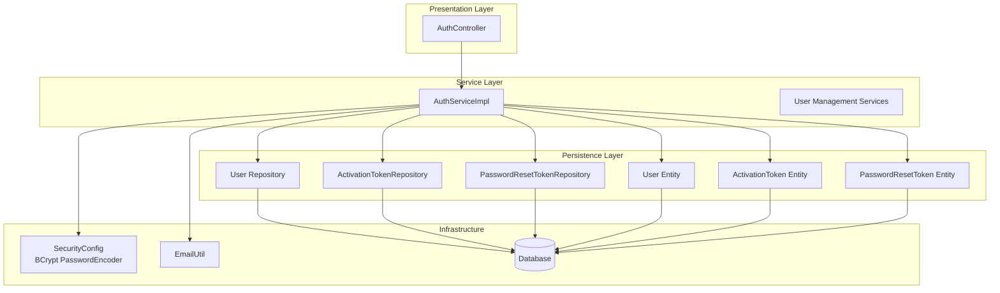
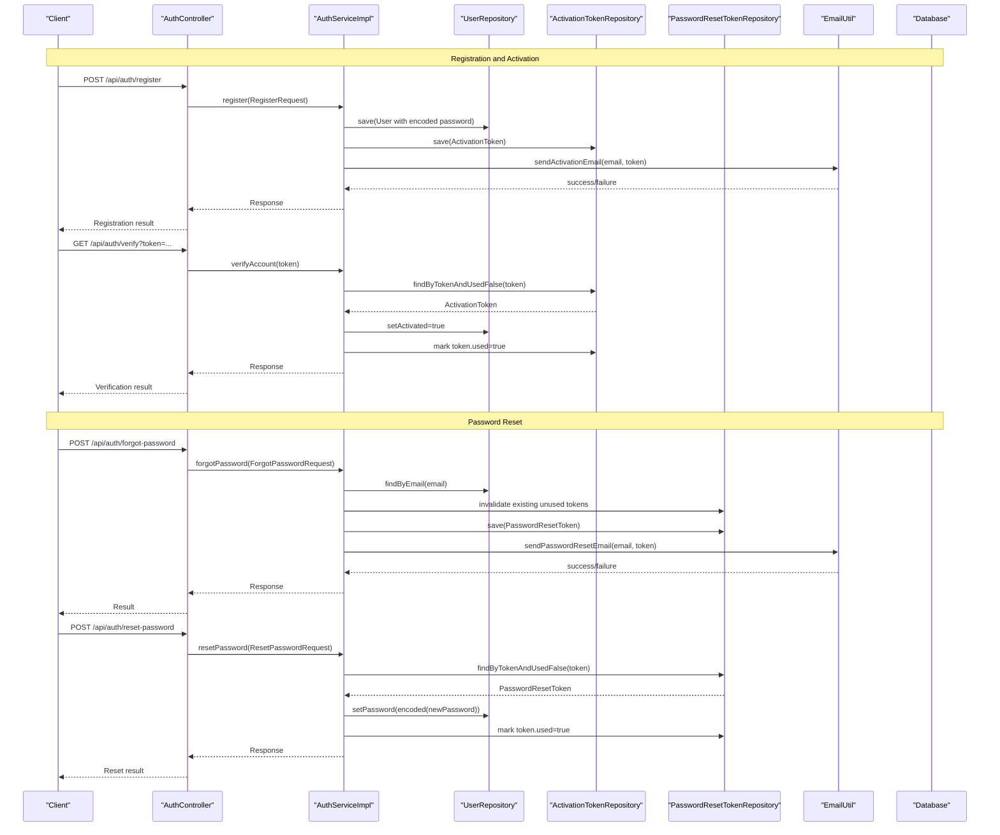
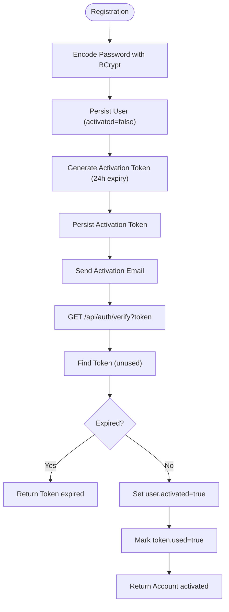
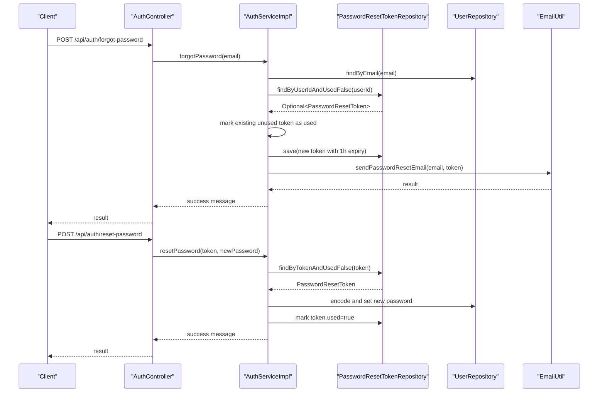
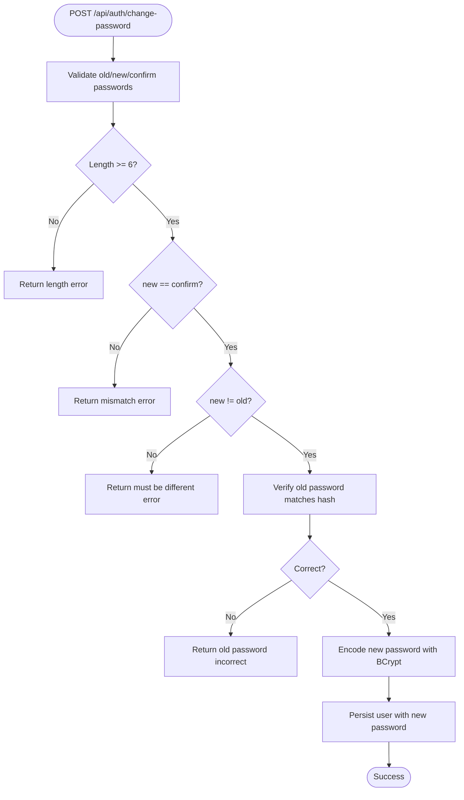
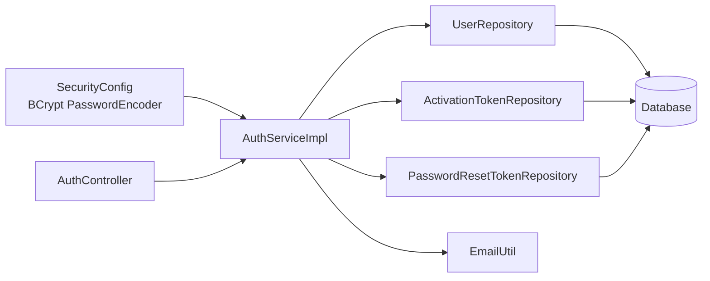

# Password Security & Management

<cite>
**Referenced Files in This Document**
- [AuthController.java](file://src/main/java/vn/campuslife/controller/auth/AuthController.java)
- [AuthServiceImpl.java](file://src/main/java/vn/campuslife/service/impl/AuthServiceImpl.java)
- [SecurityConfig.java](file://src/main/java/vn/campuslife/config/SecurityConfig.java)
- [User.java](file://src/main/java/vn/campuslife/entity/User.java)
- [ActivationToken.java](file://src/main/java/vn/campuslife/entity/ActivationToken.java)
- [PasswordResetToken.java](file://src/main/java/vn/campuslife/entity/PasswordResetToken.java)
- [ActivationTokenRepository.java](file://src/main/java/vn/campuslife/repository/ActivationTokenRepository.java)
- [PasswordResetTokenRepository.java](file://src/main/java/vn/campuslife/repository/PasswordResetTokenRepository.java)
- [EmailUtil.java](file://src/main/java/vn/campuslife/util/EmailUtil.java)
- [application.properties](file://src/main/resources/application.properties)
- [V1010__create_password_reset_tokens_table.sql](file://db/migration/V1010__create_password_reset_tokens_table.sql)
- [V1015__create_email_history_tables.sql](file://db/migration/V1015__create_email_history_tables.sql)
- [ForgotPasswordRequest.java](file://src/main/java/vn/campuslife/model/ForgotPasswordRequest.java)
- [ResetPasswordRequest.java](file://src/main/java/vn/campuslife/model/ResetPasswordRequest.java)
- [ChangePasswordRequest.java](file://src/main/java/vn/campuslife/model/ChangePasswordRequest.java)
</cite>

## Table of Contents
1. [Introduction](#introduction)
2. [Project Structure](#project-structure)
3. [Core Components](#core-components)
4. [Architecture Overview](#architecture-overview)
5. [Detailed Component Analysis](#detailed-component-analysis)
6. [Dependency Analysis](#dependency-analysis)
7. [Performance Considerations](#performance-considerations)
8. [Troubleshooting Guide](#troubleshooting-guide)
9. [Conclusion](#conclusion)
10. [Appendices](#appendices)

## Introduction
This document provides comprehensive guidance on password security and management within the application. It covers BCrypt password encoding, password reset mechanisms, and account activation workflows. It also documents the PasswordEncoder implementation, password strength validation, secure password storage practices, token lifecycle management, email verification processes, and practical examples for implementing password change endpoints. Finally, it outlines security best practices, common vulnerabilities, and password policy enforcement strategies.

## Project Structure
The password and authentication features are implemented across several layers:
- Controllers expose endpoints for registration, login, account verification, password reset, and password changes.
- Services encapsulate business logic for password encoding, token generation, email delivery, and policy enforcement.
- Entities represent persisted user credentials, activation tokens, and password reset tokens.
- Repositories manage persistence operations for tokens and users.
- Configuration defines the BCrypt encoder and security filter chain.
- Utilities handle email templating and delivery.
- Database migrations define schema for tokens and email history.

**Diagram sources**
- [AuthController.java:1-98](file://src/main/java/vn/campuslife/controller/auth/AuthController.java#L1-L98)
- [AuthServiceImpl.java:1-339](file://src/main/java/vn/campuslife/service/impl/AuthServiceImpl.java#L1-L339)
- [SecurityConfig.java:1-302](file://src/main/java/vn/campuslife/config/SecurityConfig.java#L1-L302)
- [User.java:1-50](file://src/main/java/vn/campuslife/entity/User.java#L1-L50)
- [ActivationToken.java:1-33](file://src/main/java/vn/campuslife/entity/ActivationToken.java#L1-L33)
- [PasswordResetToken.java:1-39](file://src/main/java/vn/campuslife/entity/PasswordResetToken.java#L1-L39)
- [ActivationTokenRepository.java:1-12](file://src/main/java/vn/campuslife/repository/ActivationTokenRepository.java#L1-L12)
- [PasswordResetTokenRepository.java:1-23](file://src/main/java/vn/campuslife/repository/PasswordResetTokenRepository.java#L1-L23)
- [EmailUtil.java:1-188](file://src/main/java/vn/campuslife/util/EmailUtil.java#L1-L188)

**Section sources**
- [AuthController.java:1-98](file://src/main/java/vn/campuslife/controller/auth/AuthController.java#L1-L98)
- [AuthServiceImpl.java:1-339](file://src/main/java/vn/campuslife/service/impl/AuthServiceImpl.java#L1-L339)
- [SecurityConfig.java:1-302](file://src/main/java/vn/campuslife/config/SecurityConfig.java#L1-L302)

## Core Components
- BCrypt PasswordEncoder: Defined in configuration and injected into services for hashing and verifying passwords.
- User Entity: Stores hashed passwords and activation status.
- Token Entities: Activation tokens and password reset tokens track validity and usage.
- Repositories: Persist and query token entities with expiry and usage checks.
- Email Utility: Sends activation and password reset emails with templated HTML content.
- Controllers: Expose endpoints for registration, login, verification, forgot password, reset password, and change password.

Key implementation references:
- PasswordEncoder bean: [SecurityConfig.java:40-43](file://src/main/java/vn/campuslife/config/SecurityConfig.java#L40-L43)
- Password encoding during registration: [AuthServiceImpl.java](file://src/main/java/vn/campuslife/service/impl/AuthServiceImpl.java#L125)
- Password verification during login: [AuthServiceImpl.java](file://src/main/java/vn/campuslife/service/impl/AuthServiceImpl.java#L78)
- Password reset validation and update: [AuthServiceImpl.java:259-274](file://src/main/java/vn/campuslife/service/impl/AuthServiceImpl.java#L259-L274)
- Change password validation and update: [AuthServiceImpl.java:305-329](file://src/main/java/vn/campuslife/service/impl/AuthServiceImpl.java#L305-L329)
- Token entities and repositories: [ActivationToken.java:1-33](file://src/main/java/vn/campuslife/entity/ActivationToken.java#L1-L33), [PasswordResetToken.java:1-39](file://src/main/java/vn/campuslife/entity/PasswordResetToken.java#L1-L39), [ActivationTokenRepository.java:1-12](file://src/main/java/vn/campuslife/repository/ActivationTokenRepository.java#L1-L12), [PasswordResetTokenRepository.java:1-23](file://src/main/java/vn/campuslife/repository/PasswordResetTokenRepository.java#L1-L23)

**Section sources**
- [SecurityConfig.java:40-43](file://src/main/java/vn/campuslife/config/SecurityConfig.java#L40-L43)
- [AuthServiceImpl.java:78-125](file://src/main/java/vn/campuslife/service/impl/AuthServiceImpl.java#L78-L125)
- [User.java](file://src/main/java/vn/campuslife/entity/User.java#L28)
- [ActivationToken.java:26-32](file://src/main/java/vn/campuslife/entity/ActivationToken.java#L26-L32)
- [PasswordResetToken.java:26-36](file://src/main/java/vn/campuslife/entity/PasswordResetToken.java#L26-L36)
- [ActivationTokenRepository.java](file://src/main/java/vn/campuslife/repository/ActivationTokenRepository.java#L11)
- [PasswordResetTokenRepository.java:14-20](file://src/main/java/vn/campuslife/repository/PasswordResetTokenRepository.java#L14-L20)

## Architecture Overview
The system enforces secure password handling through BCrypt hashing and robust token-based workflows for activation and password resets. The controller layer validates inputs and delegates to services, which interact with repositories and utilities. Security configuration ensures password encoding is applied consistently across authentication providers.

**Diagram sources**
- [AuthController.java:24-69](file://src/main/java/vn/campuslife/controller/auth/AuthController.java#L24-L69)
- [AuthServiceImpl.java:100-170](file://src/main/java/vn/campuslife/service/impl/AuthServiceImpl.java#L100-L170)
- [AuthServiceImpl.java:174-198](file://src/main/java/vn/campuslife/service/impl/AuthServiceImpl.java#L174-L198)
- [AuthServiceImpl.java:202-246](file://src/main/java/vn/campuslife/service/impl/AuthServiceImpl.java#L202-L246)
- [AuthServiceImpl.java:250-287](file://src/main/java/vn/campuslife/service/impl/AuthServiceImpl.java#L250-L287)
- [ActivationTokenRepository.java](file://src/main/java/vn/campuslife/repository/ActivationTokenRepository.java#L11)
- [PasswordResetTokenRepository.java:14-20](file://src/main/java/vn/campuslife/repository/PasswordResetTokenRepository.java#L14-L20)
- [EmailUtil.java:31-89](file://src/main/java/vn/campuslife/util/EmailUtil.java#L31-L89)

## Detailed Component Analysis

### PasswordEncoder Implementation (BCrypt)
- Definition: The application uses BCryptPasswordEncoder as the global PasswordEncoder.
- Injection: Services receive PasswordEncoder via constructor injection for encoding and matching.
- Usage patterns:
  - Encoding on registration: [AuthServiceImpl.java](file://src/main/java/vn/campuslife/service/impl/AuthServiceImpl.java#L125)
  - Matching on login: [AuthServiceImpl.java](file://src/main/java/vn/campuslife/service/impl/AuthServiceImpl.java#L78)
  - Matching for change password verification: [AuthServiceImpl.java](file://src/main/java/vn/campuslife/service/impl/AuthServiceImpl.java#L324)

Best practices:
- Never store plaintext passwords.
- Use BCrypt cost factors appropriate for deployment environments.
- Centralize encoder usage to avoid mixing algorithms.

**Section sources**
- [SecurityConfig.java:40-43](file://src/main/java/vn/campuslife/config/SecurityConfig.java#L40-L43)
- [AuthServiceImpl.java](file://src/main/java/vn/campuslife/service/impl/AuthServiceImpl.java#L78)
- [AuthServiceImpl.java](file://src/main/java/vn/campuslife/service/impl/AuthServiceImpl.java#L125)

### Password Strength Validation and Policy Enforcement
- Minimum length: Enforced at multiple endpoints (registration, reset, change).
  - Reset endpoint: [AuthServiceImpl.java:259-261](file://src/main/java/vn/campuslife/service/impl/AuthServiceImpl.java#L259-L261)
  - Change endpoint: [AuthServiceImpl.java:305-307](file://src/main/java/vn/campuslife/service/impl/AuthServiceImpl.java#L305-L307)
- New password must differ from old password: [AuthServiceImpl.java:314-317](file://src/main/java/vn/campuslife/service/impl/AuthServiceImpl.java#L314-L317)
- New and confirm password must match: [AuthServiceImpl.java:309-312](file://src/main/java/vn/campuslife/service/impl/AuthServiceImpl.java#L309-L312)

Recommended enhancements:
- Add complexity requirements (uppercase, lowercase, digit, special character).
- Implement rate limiting for password change attempts.
- Consider password history to prevent reuse of recent passwords.

**Section sources**
- [AuthServiceImpl.java:259-261](file://src/main/java/vn/campuslife/service/impl/AuthServiceImpl.java#L259-L261)
- [AuthServiceImpl.java:305-317](file://src/main/java/vn/campuslife/service/impl/AuthServiceImpl.java#L305-L317)

### Secure Password Storage Practices
- Hashed field: User.password is stored as a BCrypt hash.
- Deleted flag: Users can be soft-deleted without exposing credentials.
- No password retrieval: Services never return plaintext passwords.

References:
- User entity password column: [User.java](file://src/main/java/vn/campuslife/entity/User.java#L28)
- Registration storing encoded password: [AuthServiceImpl.java](file://src/main/java/vn/campuslife/service/impl/AuthServiceImpl.java#L125)
- Login verification against hash: [AuthServiceImpl.java](file://src/main/java/vn/campuslife/service/impl/AuthServiceImpl.java#L78)

**Section sources**
- [User.java](file://src/main/java/vn/campuslife/entity/User.java#L28)
- [AuthServiceImpl.java](file://src/main/java/vn/campuslife/service/impl/AuthServiceImpl.java#L78)
- [AuthServiceImpl.java](file://src/main/java/vn/campuslife/service/impl/AuthServiceImpl.java#L125)

### Account Activation Workflow
- Generation: On registration, a unique activation token with 24-hour expiry is created and associated with the user.
- Delivery: An activation email is sent containing a frontend verification link.
- Verification: The verification endpoint validates the token, checks expiry, activates the user, and marks the token as used.

**Diagram sources**
- [AuthServiceImpl.java:149-163](file://src/main/java/vn/campuslife/service/impl/AuthServiceImpl.java#L149-L163)
- [AuthServiceImpl.java:174-198](file://src/main/java/vn/campuslife/service/impl/AuthServiceImpl.java#L174-L198)
- [ActivationToken.java](file://src/main/java/vn/campuslife/entity/ActivationToken.java#L29)
- [ActivationTokenRepository.java](file://src/main/java/vn/campuslife/repository/ActivationTokenRepository.java#L11)
- [EmailUtil.java:31-58](file://src/main/java/vn/campuslife/util/EmailUtil.java#L31-L58)

**Section sources**
- [AuthServiceImpl.java:149-163](file://src/main/java/vn/campuslife/service/impl/AuthServiceImpl.java#L149-L163)
- [AuthServiceImpl.java:174-198](file://src/main/java/vn/campuslife/service/impl/AuthServiceImpl.java#L174-L198)
- [ActivationToken.java:26-32](file://src/main/java/vn/campuslife/entity/ActivationToken.java#L26-L32)
- [ActivationTokenRepository.java](file://src/main/java/vn/campuslife/repository/ActivationTokenRepository.java#L11)
- [EmailUtil.java:31-58](file://src/main/java/vn/campuslife/util/EmailUtil.java#L31-L58)

### Password Reset Token Lifecycle
- Request: On forgot-password, the system invalidates any existing unused tokens for the user, generates a new token with 1-hour expiry, persists it, and sends a reset email.
- Reset: On reset-password, the system validates the token (not used and not expired), updates the user’s password after encoding, and marks the token as used.

**Diagram sources**
- [AuthServiceImpl.java:202-246](file://src/main/java/vn/campuslife/service/impl/AuthServiceImpl.java#L202-L246)
- [AuthServiceImpl.java:250-287](file://src/main/java/vn/campuslife/service/impl/AuthServiceImpl.java#L250-L287)
- [PasswordResetTokenRepository.java:14-20](file://src/main/java/vn/campuslife/repository/PasswordResetTokenRepository.java#L14-L20)
- [PasswordResetToken.java:26-36](file://src/main/java/vn/campuslife/entity/PasswordResetToken.java#L26-L36)
- [EmailUtil.java:60-89](file://src/main/java/vn/campuslife/util/EmailUtil.java#L60-L89)

**Section sources**
- [AuthServiceImpl.java:202-246](file://src/main/java/vn/campuslife/service/impl/AuthServiceImpl.java#L202-L246)
- [AuthServiceImpl.java:250-287](file://src/main/java/vn/campuslife/service/impl/AuthServiceImpl.java#L250-L287)
- [PasswordResetTokenRepository.java:14-20](file://src/main/java/vn/campuslife/repository/PasswordResetTokenRepository.java#L14-L20)
- [PasswordResetToken.java:26-36](file://src/main/java/vn/campuslife/entity/PasswordResetToken.java#L26-L36)
- [EmailUtil.java:60-89](file://src/main/java/vn/campuslife/util/EmailUtil.java#L60-L89)

### Password Change Endpoint (Authenticated Users)
- Endpoint: POST /api/auth/change-password
- Validation: Requires old password, new password, confirm password, enforces length, match, and difference from old password.
- Execution: Verifies old password against hash, encodes new password, and persists.

**Diagram sources**
- [AuthController.java:71-94](file://src/main/java/vn/campuslife/controller/auth/AuthController.java#L71-L94)
- [AuthServiceImpl.java:291-338](file://src/main/java/vn/campuslife/service/impl/AuthServiceImpl.java#L291-L338)
- [ChangePasswordRequest.java:10-14](file://src/main/java/vn/campuslife/model/ChangePasswordRequest.java#L10-L14)

**Section sources**
- [AuthController.java:71-94](file://src/main/java/vn/campuslife/controller/auth/AuthController.java#L71-L94)
- [AuthServiceImpl.java:291-338](file://src/main/java/vn/campuslife/service/impl/AuthServiceImpl.java#L291-L338)
- [ChangePasswordRequest.java:10-14](file://src/main/java/vn/campuslife/model/ChangePasswordRequest.java#L10-L14)

### Email Verification Processes
- Activation email: Contains a verification link with token; sent via EmailUtil.
- Password reset email: Contains a reset link with token; sent via EmailUtil.
- Email configuration: SMTP settings and frontend URL are configured in application properties.

References:
- Activation email sending: [EmailUtil.java:31-58](file://src/main/java/vn/campuslife/util/EmailUtil.java#L31-L58)
- Password reset email sending: [EmailUtil.java:60-89](file://src/main/java/vn/campuslife/util/EmailUtil.java#L60-L89)
- Email configuration: [application.properties:27-41](file://src/main/resources/application.properties#L27-L41)

**Section sources**
- [EmailUtil.java:31-89](file://src/main/java/vn/campuslife/util/EmailUtil.java#L31-L89)
- [application.properties:27-41](file://src/main/resources/application.properties#L27-L41)

### Practical Examples and API Endpoints
- Registration: POST /api/auth/register
  - Validates inputs, creates user with encoded password, generates activation token, and sends activation email.
  - Reference: [AuthController.java:24-39](file://src/main/java/vn/campuslife/controller/auth/AuthController.java#L24-L39), [AuthServiceImpl.java:100-170](file://src/main/java/vn/campuslife/service/impl/AuthServiceImpl.java#L100-L170)
- Account Verification: GET /api/auth/verify?token
  - Validates token, checks expiry, activates user, and marks token used.
  - Reference: [AuthController.java:46-49](file://src/main/java/vn/campuslife/controller/auth/AuthController.java#L46-L49), [AuthServiceImpl.java:174-198](file://src/main/java/vn/campuslife/service/impl/AuthServiceImpl.java#L174-L198)
- Forgot Password: POST /api/auth/forgot-password
  - Invalidates previous unused tokens, creates new 1-hour token, and sends reset email.
  - Reference: [AuthController.java:51-59](file://src/main/java/vn/campuslife/controller/auth/AuthController.java#L51-L59), [AuthServiceImpl.java:202-246](file://src/main/java/vn/campuslife/service/impl/AuthServiceImpl.java#L202-L246)
- Reset Password: POST /api/auth/reset-password
  - Validates token and expiry, encodes new password, persists, and marks token used.
  - Reference: [AuthController.java:61-69](file://src/main/java/vn/campuslife/controller/auth/AuthController.java#L61-L69), [AuthServiceImpl.java:250-287](file://src/main/java/vn/campuslife/service/impl/AuthServiceImpl.java#L250-L287)
- Change Password: POST /api/auth/change-password
  - Requires authentication; validates old/new/confirm passwords and updates hash.
  - Reference: [AuthController.java:71-94](file://src/main/java/vn/campuslife/controller/auth/AuthController.java#L71-L94), [AuthServiceImpl.java:291-338](file://src/main/java/vn/campuslife/service/impl/AuthServiceImpl.java#L291-L338)

**Section sources**
- [AuthController.java:24-94](file://src/main/java/vn/campuslife/controller/auth/AuthController.java#L24-L94)
- [AuthServiceImpl.java:100-338](file://src/main/java/vn/campuslife/service/impl/AuthServiceImpl.java#L100-L338)

## Dependency Analysis
The password and token systems depend on:
- PasswordEncoder (BCrypt) for hashing and verification.
- Repositories for token persistence and lookup.
- Email utility for secure delivery of verification/reset links.
- Controllers for request routing and authentication checks.

**Diagram sources**
- [SecurityConfig.java:40-43](file://src/main/java/vn/campuslife/config/SecurityConfig.java#L40-L43)
- [AuthServiceImpl.java:33-54](file://src/main/java/vn/campuslife/service/impl/AuthServiceImpl.java#L33-L54)
- [AuthController.java:18-22](file://src/main/java/vn/campuslife/controller/auth/AuthController.java#L18-L22)

**Section sources**
- [SecurityConfig.java:40-43](file://src/main/java/vn/campuslife/config/SecurityConfig.java#L40-L43)
- [AuthServiceImpl.java:33-54](file://src/main/java/vn/campuslife/service/impl/AuthServiceImpl.java#L33-L54)
- [AuthController.java:18-22](file://src/main/java/vn/campuslife/controller/auth/AuthController.java#L18-L22)

## Performance Considerations
- BCrypt cost factor: Tune the encoder cost to balance security and performance based on hardware capacity.
- Token cleanup: Use repository methods to remove expired tokens periodically to maintain index efficiency.
  - Example deletion method: [PasswordResetTokenRepository.java:18-20](file://src/main/java/vn/campuslife/repository/PasswordResetTokenRepository.java#L18-L20)
- Indexes: Database migrations define indexes on token, user_id, and expiry_date to optimize lookups.
  - Migration: [V1010__create_password_reset_tokens_table.sql:10-12](file://db/migration/V1010__create_password_reset_tokens_table.sql#L10-L12)
- Email throughput: Monitor provider limits and implement retry/backoff strategies for email delivery failures.
  - References: [EmailUtil.java:50-57](file://src/main/java/vn/campuslife/util/EmailUtil.java#L50-L57), [EmailUtil.java:81-88](file://src/main/java/vn/campuslife/util/EmailUtil.java#L81-L88)

[No sources needed since this section provides general guidance]

## Troubleshooting Guide
Common issues and resolutions:
- Invalid or expired token during verification/reset:
  - Ensure token is unused and not expired before processing.
  - Reference: [AuthServiceImpl.java:180-183](file://src/main/java/vn/campuslife/service/impl/AuthServiceImpl.java#L180-L183), [AuthServiceImpl.java:267-270](file://src/main/java/vn/campuslife/service/impl/AuthServiceImpl.java#L267-L270)
- Email delivery failures:
  - Check SMTP configuration and provider limits.
  - Review logs for “Daily user sending limit exceeded” messages.
  - References: [EmailUtil.java:50-57](file://src/main/java/vn/campuslife/util/EmailUtil.java#L50-L57), [EmailUtil.java:81-88](file://src/main/java/vn/campuslife/util/EmailUtil.java#L81-L88)
- Password reset request timing:
  - Tokens expire after 1 hour; advise users to act promptly.
  - Reference: [AuthServiceImpl.java](file://src/main/java/vn/campuslife/service/impl/AuthServiceImpl.java#L228)
- Account activation link expiry:
  - Tokens expire after 24 hours; prompt users to request a new activation email.
  - Reference: [AuthServiceImpl.java](file://src/main/java/vn/campuslife/service/impl/AuthServiceImpl.java#L154)

**Section sources**
- [AuthServiceImpl.java:180-183](file://src/main/java/vn/campuslife/service/impl/AuthServiceImpl.java#L180-L183)
- [AuthServiceImpl.java](file://src/main/java/vn/campuslife/service/impl/AuthServiceImpl.java#L228)
- [AuthServiceImpl.java:267-270](file://src/main/java/vn/campuslife/service/impl/AuthServiceImpl.java#L267-L270)
- [EmailUtil.java:50-57](file://src/main/java/vn/campuslife/util/EmailUtil.java#L50-L57)
- [EmailUtil.java:81-88](file://src/main/java/vn/campuslife/util/EmailUtil.java#L81-L88)

## Conclusion
The application implements robust password security using BCrypt encoding, secure token-based workflows for activation and password resets, and defensive measures such as email enumeration protection and strict validation. By centralizing encoder usage, enforcing minimum password lengths, and leveraging token expiry and usage tracking, the system mitigates common vulnerabilities. Extending the implementation with advanced password policies, rate limiting, and proactive token cleanup will further strengthen security posture.

[No sources needed since this section summarizes without analyzing specific files]

## Appendices

### Database Schema Notes
- Password reset tokens table includes unique token, expiry date, usage flag, and creation timestamp.
  - Migration: [V1010__create_password_reset_tokens_table.sql:1-15](file://db/migration/V1010__create_password_reset_tokens_table.sql#L1-L15)
- Email history and attachments tables support audit and compliance needs.
  - Migration: [V1015__create_email_history_tables.sql:1-39](file://db/migration/V1015__create_email_history_tables.sql#L1-L39)

**Section sources**
- [V1010__create_password_reset_tokens_table.sql:1-15](file://db/migration/V1010__create_password_reset_tokens_table.sql#L1-L15)
- [V1015__create_email_history_tables.sql:1-39](file://db/migration/V1015__create_email_history_tables.sql#L1-L39)

### Security Best Practices Checklist
- Enforce minimum password length and complexity.
- Implement rate limiting for sensitive endpoints.
- Use HTTPS and secure cookies/session management.
- Regularly rotate secrets (JWT and database).
- Monitor and alert on failed authentication attempts.
- Periodically clean up expired tokens and audit logs.

[No sources needed since this section provides general guidance]