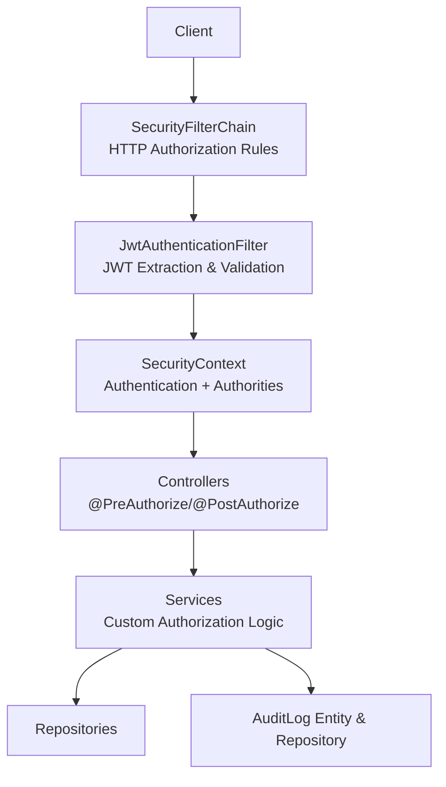
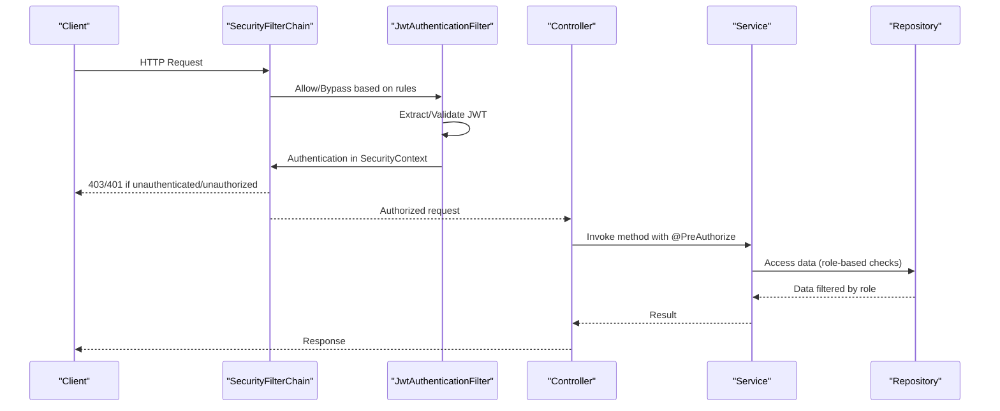
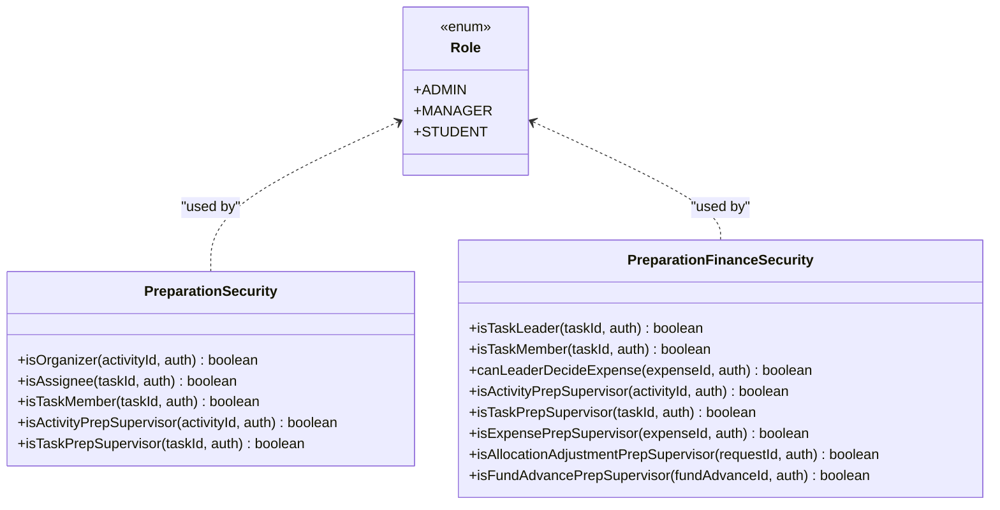
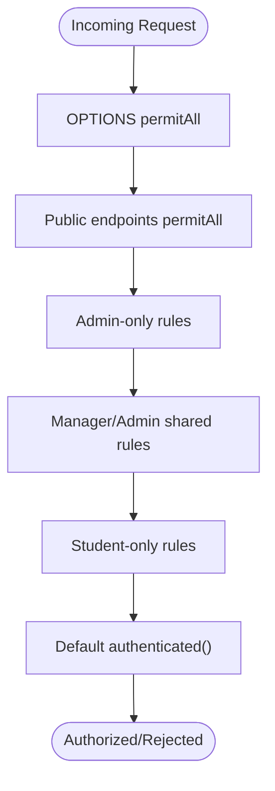
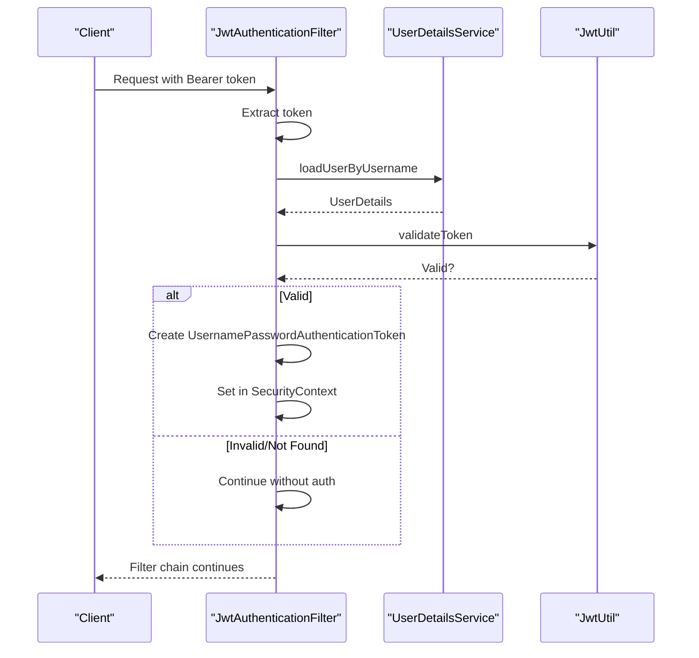
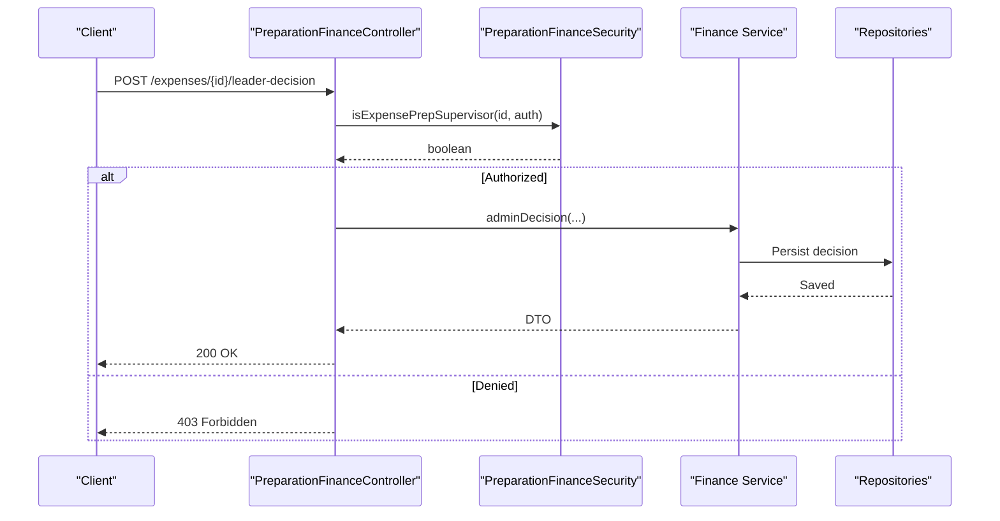
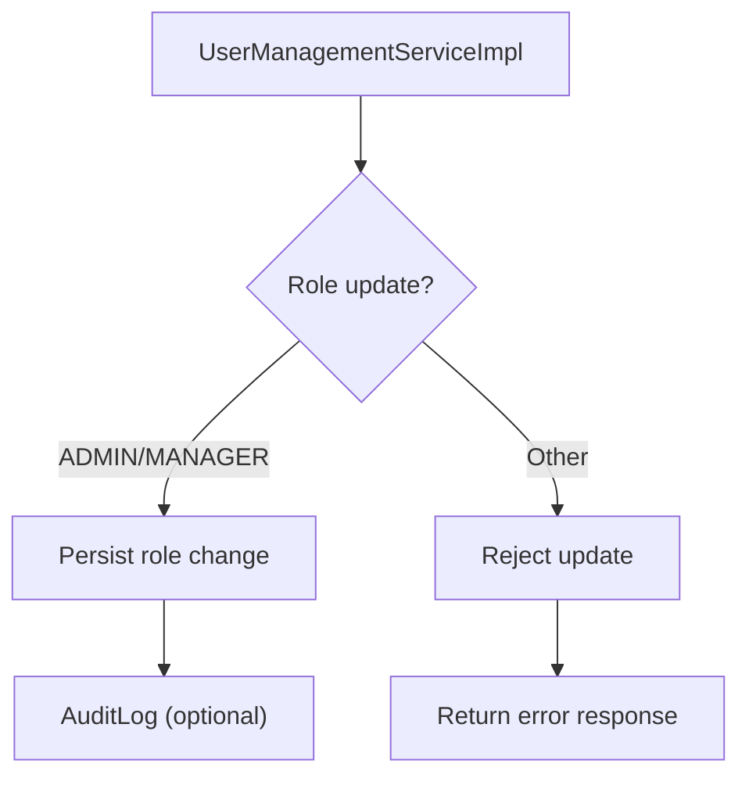
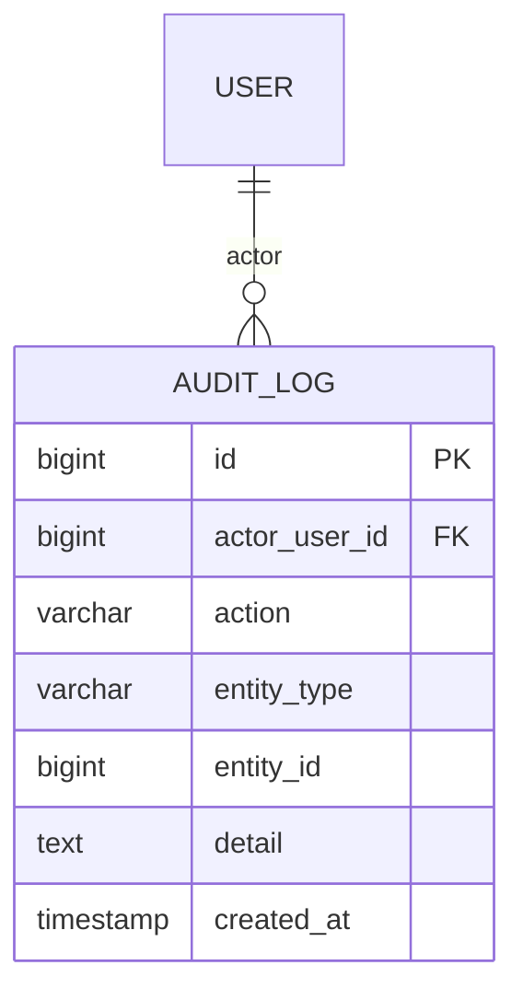
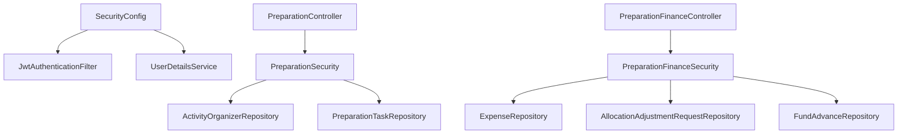

# Role-Based Access Control (RBAC)

<cite>
**Referenced Files in This Document**
- [SecurityConfig.java](file://src/main/java/vn/campuslife/config/SecurityConfig.java)
- [Role.java](file://src/main/java/vn/campuslife/enumeration/Role.java)
- [JwtAuthenticationFilter.java](file://src/main/java/vn/campuslife/filter/JwtAuthenticationFilter.java)
- [UserManagementController.java](file://src/main/java/vn/campuslife/controller/auth/UserManagementController.java)
- [UserManagementServiceImpl.java](file://src/main/java/vn/campuslife/service/impl/UserManagementServiceImpl.java)
- [PreparationSecurity.java](file://src/main/java/vn/campuslife/service/security/PreparationSecurity.java)
- [PreparationFinanceSecurity.java](file://src/main/java/vn/campuslife/service/security/PreparationFinanceSecurity.java)
- [PreparationFinanceController.java](file://src/main/java/vn/campuslife/controller/preparation/PreparationFinanceController.java)
- [PreparationController.java](file://src/main/java/vn/campuslife/controller/preparation/PreparationController.java)
- [AuditLog.java](file://src/main/java/vn/campuslife/entity/AuditLog.java)
- [AuditLogRepository.java](file://src/main/java/vn/campuslife/repository/AuditLogRepository.java)
- [GlobalExceptionHandler.java](file://src/main/java/vn/campuslife/exception/GlobalExceptionHandler.java)
</cite>

## Table of Contents
1. [Introduction](#introduction)
2. [Project Structure](#project-structure)
3. [Core Components](#core-components)
4. [Architecture Overview](#architecture-overview)
5. [Detailed Component Analysis](#detailed-component-analysis)
6. [Dependency Analysis](#dependency-analysis)
7. [Performance Considerations](#performance-considerations)
8. [Troubleshooting Guide](#troubleshooting-guide)
9. [Conclusion](#conclusion)
10. [Appendices](#appendices)

## Introduction
This document provides comprehensive Role-Based Access Control (RBAC) documentation for the campuslife application. It covers the three-tier role hierarchy (ADMIN, MANAGER, STUDENT), Spring Security configuration, method-level authorization patterns, role checks in controllers, role inheritance and delegation, dynamic role assignment, and practical examples for implementing role checks, custom role expressions, and role-based menu visibility. It also addresses role escalation prevention, audit logging of role changes, and common RBAC implementation patterns.

## Project Structure
The RBAC implementation spans configuration, filters, controllers, services, and repositories:
- Security configuration defines global HTTP request authorization rules.
- JWT filter authenticates requests and populates the security context.
- Controllers enforce method-level authorization via annotations.
- Services encapsulate custom authorization logic for domain-specific roles.
- Entities and repositories support audit logging of role-related actions.

**Diagram sources**
- [SecurityConfig.java:59-295](file://src/main/java/vn/campuslife/config/SecurityConfig.java#L59-L295)
- [JwtAuthenticationFilter.java:34-103](file://src/main/java/vn/campuslife/filter/JwtAuthenticationFilter.java#L34-L103)

**Section sources**
- [SecurityConfig.java:23-300](file://src/main/java/vn/campuslife/config/SecurityConfig.java#L23-L300)
- [JwtAuthenticationFilter.java:20-105](file://src/main/java/vn/campuslife/filter/JwtAuthenticationFilter.java#L20-L105)

## Core Components
- Role enumeration defines the supported roles: ADMIN, MANAGER, STUDENT.
- SecurityConfig configures HTTP request authorization rules and enables method security.
- JwtAuthenticationFilter extracts JWTs, loads user details, validates tokens, and sets authentication in the security context.
- Controllers apply method-level authorization using @PreAuthorize and @PostAuthorize.
- Custom authorization services provide domain-specific role checks (e.g., preparation supervisors, task members).
- Audit logging captures role-related actions for compliance and traceability.

**Section sources**
- [Role.java:3-7](file://src/main/java/vn/campuslife/enumeration/Role.java#L3-L7)
- [SecurityConfig.java:25-295](file://src/main/java/vn/campuslife/config/SecurityConfig.java#L25-L295)
- [JwtAuthenticationFilter.java:34-103](file://src/main/java/vn/campuslife/filter/JwtAuthenticationFilter.java#L34-L103)

## Architecture Overview
The RBAC architecture enforces authorization at two layers:
- Web layer: HTTP request authorization rules restrict access to endpoints based on roles.
- Method layer: @PreAuthorize and @PostAuthorize annotations enforce fine-grained authorization inside controllers and services.

**Diagram sources**
- [SecurityConfig.java:59-295](file://src/main/java/vn/campuslife/config/SecurityConfig.java#L59-L295)
- [JwtAuthenticationFilter.java:34-103](file://src/main/java/vn/campuslife/filter/JwtAuthenticationFilter.java#L34-L103)
- [PreparationFinanceController.java:210-243](file://src/main/java/vn/campuslife/controller/preparation/PreparationFinanceController.java#L210-L243)

## Detailed Component Analysis

### Role Hierarchy and Inheritance
- Roles: ADMIN > MANAGER > STUDENT (implicit hierarchy).
- No explicit inheritance mapping is defined in code; authorization decisions rely on hasRole/hasAnyRole predicates and custom authorization services.
- Domain roles augment traditional roles:
  - Preparation supervisor: activity-level supervisor who can approve certain operations.
  - Task member/owner/leader: participants in preparation tasks with delegated permissions.

**Diagram sources**
- [Role.java:3-7](file://src/main/java/vn/campuslife/enumeration/Role.java#L3-L7)
- [PreparationSecurity.java:12-86](file://src/main/java/vn/campuslife/service/security/PreparationSecurity.java#L12-L86)
- [PreparationFinanceSecurity.java:19-156](file://src/main/java/vn/campuslife/service/security/PreparationFinanceSecurity.java#L19-L156)

**Section sources**
- [Role.java:3-7](file://src/main/java/vn/campuslife/enumeration/Role.java#L3-L7)
- [PreparationSecurity.java:20-74](file://src/main/java/vn/campuslife/service/security/PreparationSecurity.java#L20-L74)
- [PreparationFinanceSecurity.java:30-116](file://src/main/java/vn/campuslife/service/security/PreparationFinanceSecurity.java#L30-L116)

### HTTP Request Authorization (SecurityConfig)
- Stateless session policy.
- Public endpoints (registration, login, articles).
- Endpoint-specific rules:
  - Admin-only: /api/admin/** and specific admin endpoints.
  - Manager/Admin shared: departments, users, articles, emails, activities, registrations, scores, classes, students.
  - Student-only: profile, registrations, tasks, submissions, check-in QR.
- Default requires authentication for remaining paths.

**Diagram sources**
- [SecurityConfig.java:65-295](file://src/main/java/vn/campuslife/config/SecurityConfig.java#L65-L295)

**Section sources**
- [SecurityConfig.java:59-295](file://src/main/java/vn/campuslife/config/SecurityConfig.java#L59-L295)

### JWT Authentication and Security Context
- Extracts Authorization header, validates token, loads user details, and sets Authentication in SecurityContext.
- Ensures downstream authorization checks can access user roles and authorities.

**Diagram sources**
- [JwtAuthenticationFilter.java:34-103](file://src/main/java/vn/campuslife/filter/JwtAuthenticationFilter.java#L34-L103)

**Section sources**
- [JwtAuthenticationFilter.java:34-103](file://src/main/java/vn/campuslife/filter/JwtAuthenticationFilter.java#L34-L103)

### Method-Level Authorization Patterns
- @PreAuthorize: Enforce authorization before method execution using SpEL expressions.
- @PostAuthorize: Enforce authorization after method execution (less commonly used).
- Examples:
  - PreparationFinanceController uses custom bean expressions (e.g., @preparationFinanceSecurity.isTaskPrepSupervisor) combined with hasAnyRole.
  - PreparationController uses similar custom expressions for task and organizer operations.

**Diagram sources**
- [PreparationFinanceController.java:223-243](file://src/main/java/vn/campuslife/controller/preparation/PreparationFinanceController.java#L223-L243)
- [PreparationFinanceSecurity.java:104-116](file://src/main/java/vn/campuslife/service/security/PreparationFinanceSecurity.java#L104-L116)

**Section sources**
- [PreparationFinanceController.java:210-243](file://src/main/java/vn/campuslife/controller/preparation/PreparationFinanceController.java#L210-L243)
- [PreparationController.java:72-95](file://src/main/java/vn/campuslife/controller/preparation/PreparationController.java#L72-L95)

### Role Checking in Controllers
- Controllers use @PreAuthorize to delegate authorization to custom security beans.
- Example: Creating expenses requires either ADMIN/MANAGER roles OR a custom supervisor check.
- Example: Updating task status requires either supervisor or assignee role checks.

**Section sources**
- [PreparationFinanceController.java:210-243](file://src/main/java/vn/campuslife/controller/preparation/PreparationFinanceController.java#L210-L243)
- [PreparationController.java:72-95](file://src/main/java/vn/campuslife/controller/preparation/PreparationController.java#L72-L95)

### Role Inheritance, Permission Delegation, and Dynamic Role Assignment
- No explicit role inheritance mapping exists; authorization relies on hasRole/hasAnyRole and custom services.
- Delegation occurs via custom security beans:
  - PreparationSecurity: determines organizers, task owners, leaders, and supervisors.
  - PreparationFinanceSecurity: adds financial domain checks (task leader, expense supervisor).
- Dynamic role assignment:
  - UserManagementServiceImpl enforces ADMIN/MANAGER role boundaries when creating/updating users.
  - Role updates are validated and persisted; soft deletion is used for user removal.

**Diagram sources**
- [UserManagementServiceImpl.java:144-150](file://src/main/java/vn/campuslife/service/impl/UserManagementServiceImpl.java#L144-L150)

**Section sources**
- [UserManagementServiceImpl.java:61-66](file://src/main/java/vn/campuslife/service/impl/UserManagementServiceImpl.java#L61-L66)
- [UserManagementServiceImpl.java:144-150](file://src/main/java/vn/campuslife/service/impl/UserManagementServiceImpl.java#L144-L150)

### Practical Examples

#### Implementing Role Checks
- HTTP layer: Use hasRole("ADMIN") or hasAnyRole("ADMIN","MANAGER").
- Method layer: Use @PreAuthorize("hasRole('ADMIN')").

**Section sources**
- [SecurityConfig.java:87-94](file://src/main/java/vn/campuslife/config/SecurityConfig.java#L87-L94)
- [PreparationFinanceController.java:235](file://src/main/java/vn/campuslife/controller/preparation/PreparationFinanceController.java#L235)

#### Creating Custom Role Expressions
- Define a @Component with methods returning boolean for domain-specific checks.
- Reference via @PreAuthorize("@beanName.method(..., authentication)").
- Example beans: preparationSecurity, preparationFinanceSecurity.

**Section sources**
- [PreparationSecurity.java:12-86](file://src/main/java/vn/campuslife/service/security/PreparationSecurity.java#L12-L86)
- [PreparationFinanceSecurity.java:19-156](file://src/main/java/vn/campuslife/service/security/PreparationFinanceSecurity.java#L19-L156)

#### Handling Role-Based Menu Visibility
- Frontend visibility should mirror hasAnyRole rules defined in SecurityConfig.
- Example: STUDENT/ADMIN/MANAGER menus for activities, registrations, scores, classes.
- Controller-level role-based filtering ensures data exposure limits.

**Section sources**
- [SecurityConfig.java:96-131](file://src/main/java/vn/campuslife/config/SecurityConfig.java#L96-L131)
- [SecurityConfig.java:267-287](file://src/main/java/vn/campuslife/config/SecurityConfig.java#L267-L287)

### Role Escalation Prevention
- Strict role boundaries enforced in UserManagementServiceImpl (only ADMIN/MANAGER roles allowed for user creation/update).
- Custom authorization beans limit operations to supervisors or task members only.
- Default deny-by-default policy for unlisted endpoints.

**Section sources**
- [UserManagementServiceImpl.java:61-66](file://src/main/java/vn/campuslife/service/impl/UserManagementServiceImpl.java#L61-L66)
- [PreparationFinanceSecurity.java:30-46](file://src/main/java/vn/campuslife/service/security/PreparationFinanceSecurity.java#L30-L46)

### Audit Logging of Role Changes
- AuditLog entity stores actor, action, entity type, entity id, and detail.
- AuditLogRepository supports existence checks and batch retrieval by entity ids.
- Export service aggregates logs across related entities for reporting.

**Diagram sources**
- [AuditLog.java:12-41](file://src/main/java/vn/campuslife/entity/AuditLog.java#L12-L41)

**Section sources**
- [AuditLog.java:12-41](file://src/main/java/vn/campuslife/entity/AuditLog.java#L12-L41)
- [AuditLogRepository.java:10-14](file://src/main/java/vn/campuslife/repository/AuditLogRepository.java#L10-L14)

## Dependency Analysis
- SecurityConfig depends on JwtAuthenticationFilter, UserDetailsService, and CorsConfigurationSource.
- Controllers depend on services that may in turn depend on repositories.
- Custom security beans depend on repositories and StudentService for student identity resolution.

**Diagram sources**
- [SecurityConfig.java:28-38](file://src/main/java/vn/campuslife/config/SecurityConfig.java#L28-L38)
- [PreparationController.java:72-95](file://src/main/java/vn/campuslife/controller/preparation/PreparationController.java#L72-L95)
- [PreparationFinanceController.java:210-243](file://src/main/java/vn/campuslife/controller/preparation/PreparationFinanceController.java#L210-L243)
- [PreparationSecurity.java:16-18](file://src/main/java/vn/campuslife/service/security/PreparationSecurity.java#L16-L18)
- [PreparationFinanceSecurity.java:23-28](file://src/main/java/vn/campuslife/service/security/PreparationFinanceSecurity.java#L23-L28)

**Section sources**
- [SecurityConfig.java:28-38](file://src/main/java/vn/campuslife/config/SecurityConfig.java#L28-L38)
- [PreparationSecurity.java:16-18](file://src/main/java/vn/campuslife/service/security/PreparationSecurity.java#L16-L18)
- [PreparationFinanceSecurity.java:23-28](file://src/main/java/vn/campuslife/service/security/PreparationFinanceSecurity.java#L23-L28)

## Performance Considerations
- Stateless JWT reduces server-side session overhead.
- Minimal database queries in JwtAuthenticationFilter; ensure token validation is efficient.
- Prefer hasRole/hasAnyRole for simple checks; reserve custom expressions for complex domain logic.
- Batch retrieval in audit export minimizes N+1 queries.

## Troubleshooting Guide
- 403 Forbidden: Verify role matches configured rules or custom authorization bean returns true.
- 401 Unauthorized: Ensure Authorization header with valid Bearer token is present.
- Validation errors: GlobalExceptionHandler maps exceptions to appropriate HTTP status codes.

**Section sources**
- [GlobalExceptionHandler.java:32-50](file://src/main/java/vn/campuslife/exception/GlobalExceptionHandler.java#L32-L50)

## Conclusion
The campuslife application implements a robust RBAC model with a clear three-tier role hierarchy and layered authorization. HTTP-level rules enforce coarse-grained access control, while method-level annotations and custom security beans provide fine-grained, domain-aware authorization. Role escalation is prevented through strict validation and delegation patterns, and audit logging supports compliance and traceability.

## Appendices

### Common RBAC Implementation Patterns
- Use hasRole("ROLE") for single-role checks.
- Use hasAnyRole("ROLE1","ROLE2") for multi-role allowances.
- Use @PreAuthorize for complex expressions combining roles and custom checks.
- Keep authorization logic in dedicated security beans for reusability and testability.
- Log role-related actions for audit trails.