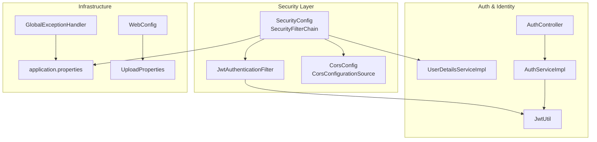
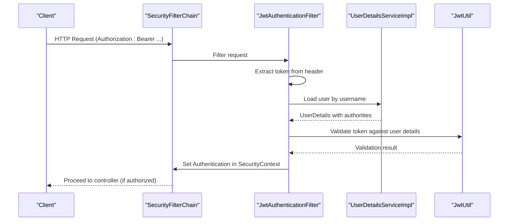
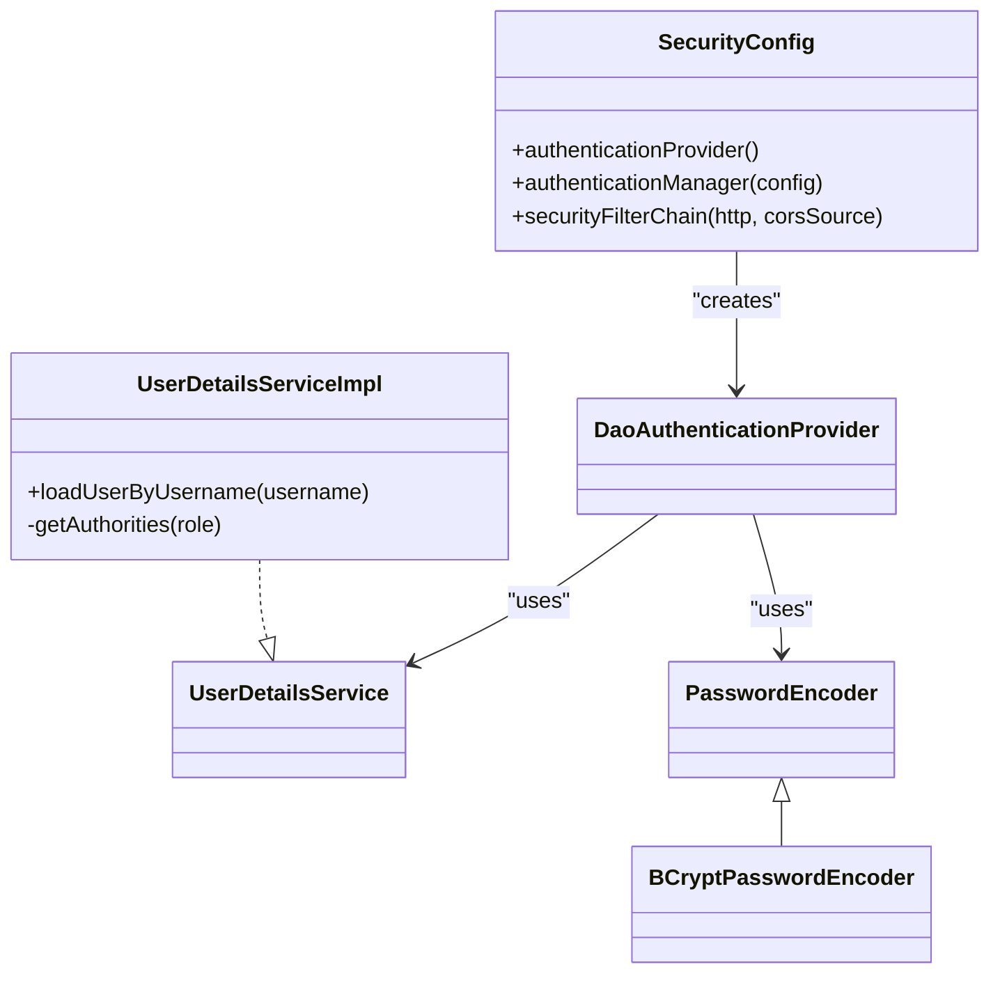
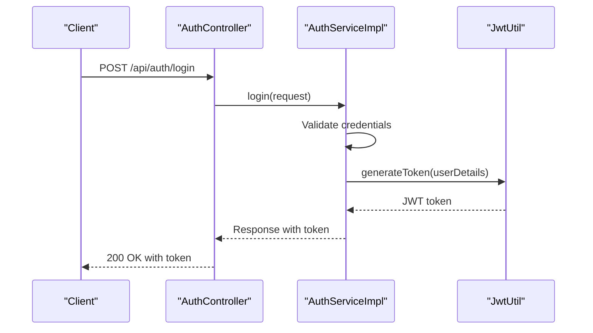
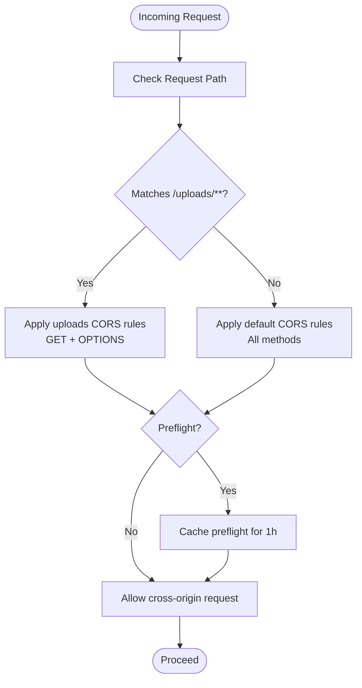
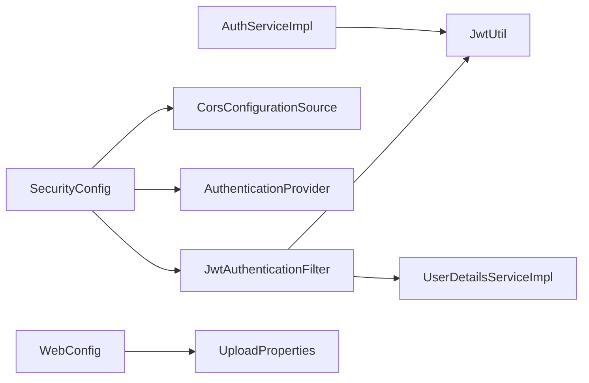

# Security Configurations

<cite>
**Referenced Files in This Document**
- [SecurityConfig.java](file://src/main/java/vn/campuslife/config/SecurityConfig.java)
- [CorsConfig.java](file://src/main/java/vn/campuslife/config/CorsConfig.java)
- [JwtAuthenticationFilter.java](file://src/main/java/vn/campuslife/filter/JwtAuthenticationFilter.java)
- [JwtUtil.java](file://src/main/java/vn/campuslife/util/JwtUtil.java)
- [UserDetailsServiceImpl.java](file://src/main/java/vn/campuslife/service/impl/UserDetailsServiceImpl.java)
- [application.properties](file://src/main/resources/application.properties)
- [WebConfig.java](file://src/main/java/vn/campuslife/config/WebConfig.java)
- [UploadProperties.java](file://src/main/java/vn/campuslife/config/UploadProperties.java)
- [AuthController.java](file://src/main/java/vn/campuslife/controller/auth/AuthController.java)
- [AuthServiceImpl.java](file://src/main/java/vn/campuslife/service/impl/AuthServiceImpl.java)
- [Role.java](file://src/main/java/vn/campuslife/enumeration/Role.java)
- [GlobalExceptionHandler.java](file://src/main/java/vn/campuslife/exception/GlobalExceptionHandler.java)
- [CampusLifeApplication.java](file://src/main/java/vn/campuslife/CampusLifeApplication.java)
</cite>

## Table of Contents
1. [Introduction](#introduction)
2. [Project Structure](#project-structure)
3. [Core Components](#core-components)
4. [Architecture Overview](#architecture-overview)
5. [Detailed Component Analysis](#detailed-component-analysis)
6. [Dependency Analysis](#dependency-analysis)
7. [Performance Considerations](#performance-considerations)
8. [Troubleshooting Guide](#troubleshooting-guide)
9. [Conclusion](#conclusion)
10. [Appendices](#appendices)

## Introduction
This document explains the security configuration of the backend, focusing on Spring Security setup, CORS policy configuration, HTTP security filter chains, CSRF protection, session management, authentication providers, and JWT-based authentication. It also covers CORS handling for cross-origin requests and preflight requests, and provides practical guidance for extending security rules, adding new authenticated endpoints, and applying security best practices.

## Project Structure
Security-related components are organized under dedicated packages:
- Configuration beans for security and CORS
- A JWT filter for stateless authentication
- Utilities for JWT token generation and validation
- User details service for authentication provider
- Controllers and services for authentication flows
- Global exception handling for security-related errors

**Diagram sources**
- [SecurityConfig.java:58-300](file://src/main/java/vn/campuslife/config/SecurityConfig.java#L58-L300)
- [JwtAuthenticationFilter.java:33-103](file://src/main/java/vn/campuslife/filter/JwtAuthenticationFilter.java#L33-L103)
- [CorsConfig.java:32-43](file://src/main/java/vn/campuslife/config/CorsConfig.java#L32-L43)
- [UserDetailsServiceImpl.java:24-40](file://src/main/java/vn/campuslife/service/impl/UserDetailsServiceImpl.java#L24-L40)
- [JwtUtil.java:27-83](file://src/main/java/vn/campuslife/util/JwtUtil.java#L27-L83)
- [AuthController.java:24-94](file://src/main/java/vn/campuslife/controller/auth/AuthController.java#L24-L94)
- [AuthServiceImpl.java:56-96](file://src/main/java/vn/campuslife/service/impl/AuthServiceImpl.java#L56-L96)
- [WebConfig.java:14-25](file://src/main/java/vn/campuslife/config/WebConfig.java#L14-L25)
- [UploadProperties.java:12-26](file://src/main/java/vn/campuslife/config/UploadProperties.java#L12-L26)
- [application.properties:55-66](file://src/main/resources/application.properties#L55-L66)
- [GlobalExceptionHandler.java:88-91](file://src/main/java/vn/campuslife/exception/GlobalExceptionHandler.java#L88-L91)

**Section sources**
- [SecurityConfig.java:23-302](file://src/main/java/vn/campuslife/config/SecurityConfig.java#L23-L302)
- [CorsConfig.java:11-44](file://src/main/java/vn/campuslife/config/CorsConfig.java#L11-L44)
- [JwtAuthenticationFilter.java:20-105](file://src/main/java/vn/campuslife/filter/JwtAuthenticationFilter.java#L20-L105)
- [JwtUtil.java:18-91](file://src/main/java/vn/campuslife/util/JwtUtil.java#L18-L91)
- [UserDetailsServiceImpl.java:15-41](file://src/main/java/vn/campuslife/service/impl/UserDetailsServiceImpl.java#L15-L41)
- [application.properties:1-86](file://src/main/resources/application.properties#L1-L86)
- [WebConfig.java:8-27](file://src/main/java/vn/campuslife/config/WebConfig.java#L8-L27)
- [UploadProperties.java:8-27](file://src/main/java/vn/campuslife/config/UploadProperties.java#L8-L27)
- [AuthController.java:14-98](file://src/main/java/vn/campuslife/controller/auth/AuthController.java#L14-L98)
- [AuthServiceImpl.java:30-339](file://src/main/java/vn/campuslife/service/impl/AuthServiceImpl.java#L30-L339)
- [GlobalExceptionHandler.java:18-119](file://src/main/java/vn/campuslife/exception/GlobalExceptionHandler.java#L18-L119)

## Core Components
- SecurityFilterChain: Defines HTTP security rules, CORS, CSRF, session management, and filter order.
- AuthenticationProvider: Uses DAO-based authentication with a custom UserDetailsService and BCrypt encoder.
- JwtAuthenticationFilter: Extracts and validates JWT tokens and sets authentication in the SecurityContext.
- JwtUtil: Generates and validates JWT tokens using HS256 with a configurable secret and expiration.
- UserDetailsServiceImpl: Loads user details and authorities for authentication.
- CorsConfig: Provides both WebMvcConfigurer CORS mappings and a CorsConfigurationSource bean.
- application.properties: Centralized configuration for JWT, CORS, upload paths, and server settings.

Key configuration highlights:
- CSRF disabled for stateless APIs.
- Session management set to STATELESS.
- Public endpoints for authentication, uploads, and selected GET routes.
- Extensive role-based rules for admin, manager, and student roles.
- Preflight OPTIONS requests permitted globally.

**Section sources**
- [SecurityConfig.java:58-300](file://src/main/java/vn/campuslife/config/SecurityConfig.java#L58-L300)
- [SecurityConfig.java:45-56](file://src/main/java/vn/campuslife/config/SecurityConfig.java#L45-L56)
- [JwtAuthenticationFilter.java:33-103](file://src/main/java/vn/campuslife/filter/JwtAuthenticationFilter.java#L33-L103)
- [JwtUtil.java:56-83](file://src/main/java/vn/campuslife/util/JwtUtil.java#L56-L83)
- [UserDetailsServiceImpl.java:24-40](file://src/main/java/vn/campuslife/service/impl/UserDetailsServiceImpl.java#L24-L40)
- [CorsConfig.java:14-43](file://src/main/java/vn/campuslife/config/CorsConfig.java#L14-L43)
- [application.properties:55-66](file://src/main/resources/application.properties#L55-L66)

## Architecture Overview
The security architecture enforces stateless JWT authentication across HTTP requests. Requests pass through the SecurityFilterChain, which delegates to the JwtAuthenticationFilter to authenticate users based on Authorization headers. Authentication is backed by a custom UserDetailsService and DAO provider.

**Diagram sources**
- [SecurityConfig.java:58-300](file://src/main/java/vn/campuslife/config/SecurityConfig.java#L58-L300)
- [JwtAuthenticationFilter.java:33-103](file://src/main/java/vn/campuslife/filter/JwtAuthenticationFilter.java#L33-L103)
- [UserDetailsServiceImpl.java:24-40](file://src/main/java/vn/campuslife/service/impl/UserDetailsServiceImpl.java#L24-L40)
- [JwtUtil.java:80-83](file://src/main/java/vn/campuslife/util/JwtUtil.java#L80-L83)

## Detailed Component Analysis

### SecurityFilterChain Bean Configuration
- CORS: Enabled via CorsConfigurationSource bean and configured per-mapping.
- CSRF: Disabled for stateless APIs.
- Session Management: Stateless session policy.
- Authorization Rules:
  - Public routes: authentication/register, login, verification, forgot/reset password, uploads, and selected GET endpoints.
  - Preflight: OPTIONS allowed globally.
  - Role-based rules for admin, manager, and student across activities, registrations, tasks, scores, statistics, and more.
  - Default: any other request requires authentication.
- Authentication Provider: DAO-based provider with BCrypt encoder.
- Filter Order: JwtAuthenticationFilter added before UsernamePasswordAuthenticationFilter.

Practical extension tips:
- Add new authenticated endpoints by appending rules before the default anyRequest().authenticated().
- Use hasRole or hasAnyRole consistently; ensure role names align with UserDetailsServiceImpl authority prefixes.
- Keep admin-specific rules before general /api/admin/** to avoid unintended matches.

**Section sources**
- [SecurityConfig.java:58-300](file://src/main/java/vn/campuslife/config/SecurityConfig.java#L58-L300)
- [SecurityConfig.java:45-56](file://src/main/java/vn/campuslife/config/SecurityConfig.java#L45-L56)

### CSRF Protection Settings
- CSRF is disabled because the application is stateless and relies on JWT tokens. This is appropriate for single-page applications and APIs that do not use browser cookies for session management.

Best practice note:
- If you introduce cookie-based sessions in the future, enable CSRF protection and configure appropriate CSRF tokens.

**Section sources**
- [SecurityConfig.java:62-64](file://src/main/java/vn/campuslife/config/SecurityConfig.java#L62-L64)

### Session Management Policies
- SessionCreationPolicy is set to STATELESS. No server-side session is created or used.
- This reduces memory footprint and simplifies scaling behind load balancers.

**Section sources**
- [SecurityConfig.java:64](file://src/main/java/vn/campuslife/config/SecurityConfig.java#L64)

### Authentication Provider Setup
- DaoAuthenticationProvider configured with:
  - UserDetailsService: UserDetailsServiceImpl
  - PasswordEncoder: BCryptPasswordEncoder bean
- UserDetailsServiceImpl loads users by username, checks activation, and maps roles to authorities with ROLE_ prefix.

**Diagram sources**
- [SecurityConfig.java:45-56](file://src/main/java/vn/campuslife/config/SecurityConfig.java#L45-L56)
- [UserDetailsServiceImpl.java:15-41](file://src/main/java/vn/campuslife/service/impl/UserDetailsServiceImpl.java#L15-L41)

**Section sources**
- [SecurityConfig.java:45-56](file://src/main/java/vn/campuslife/config/SecurityConfig.java#L45-L56)
- [UserDetailsServiceImpl.java:24-40](file://src/main/java/vn/campuslife/service/impl/UserDetailsServiceImpl.java#L24-L40)

### JWT-Based Authentication Flow
- JwtAuthenticationFilter extracts the Bearer token from the Authorization header and attempts to set authentication if the token is valid.
- JwtUtil validates tokens against user details and expiration.
- AuthServiceImpl generates JWT tokens upon successful login.

**Diagram sources**
- [AuthController.java:41-44](file://src/main/java/vn/campuslife/controller/auth/AuthController.java#L41-L44)
- [AuthServiceImpl.java:56-96](file://src/main/java/vn/campuslife/service/impl/AuthServiceImpl.java#L56-L96)
- [JwtUtil.java:56-68](file://src/main/java/vn/campuslife/util/JwtUtil.java#L56-L68)

**Section sources**
- [JwtAuthenticationFilter.java:33-103](file://src/main/java/vn/campuslife/filter/JwtAuthenticationFilter.java#L33-L103)
- [JwtUtil.java:56-83](file://src/main/java/vn/campuslife/util/JwtUtil.java#L56-L83)
- [AuthController.java:41-44](file://src/main/java/vn/campuslife/controller/auth/AuthController.java#L41-L44)
- [AuthServiceImpl.java:56-96](file://src/main/java/vn/campuslife/service/impl/AuthServiceImpl.java#L56-L96)

### CORS Configuration
- Two CORS mechanisms coexist:
  - WebMvcConfigurer mappings for MVC-level CORS and special handling for /uploads/**
  - CorsConfigurationSource bean for Spring Security’s HttpSecurity CORS integration
- Allowed origins: wildcard patterns; credentials allowed; max age for preflight caching
- Uploads directory restricted to GET and OPTIONS

**Diagram sources**
- [CorsConfig.java:14-30](file://src/main/java/vn/campuslife/config/CorsConfig.java#L14-L30)
- [CorsConfig.java:32-43](file://src/main/java/vn/campuslife/config/CorsConfig.java#L32-L43)

**Section sources**
- [CorsConfig.java:14-43](file://src/main/java/vn/campuslife/config/CorsConfig.java#L14-L43)
- [application.properties:55-61](file://src/main/resources/application.properties#L55-L61)

### Adding New Authenticated Endpoints
Steps:
- Define the endpoint in a controller.
- Add an authorizeHttpRequests rule in SecurityFilterChain before anyRequest().authenticated().
- Use hasRole or hasAnyRole consistently with Role enum values.
- Ensure the UserDetailsService authority prefix matches expectations.

Example rule placement:
- Place admin-specific rules before general /api/admin/** to avoid unintended matches.
- Keep public routes (OPTIONS, auth, uploads) before role-based rules.

**Section sources**
- [SecurityConfig.java:65-295](file://src/main/java/vn/campuslife/config/SecurityConfig.java#L65-L295)
- [Role.java:3-7](file://src/main/java/vn/campuslife/enumeration/Role.java#L3-L7)

### Practical Examples
- Configure a new admin-only endpoint:
  - Add a rule like .requestMatchers("/api/new-admin/**").hasRole("ADMIN")
  - Place it before the general /api/admin/** rule.
- Add a new authenticated GET route:
  - Add .requestMatchers(HttpMethod.GET, "/api/new-route").authenticated()
- Extend CORS for a new path:
  - Add a mapping in CorsConfig.addCorsMappings(...) and/or register a new pattern in CorsConfigurationSource.

**Section sources**
- [SecurityConfig.java:87-94](file://src/main/java/vn/campuslife/config/SecurityConfig.java#L87-L94)
- [CorsConfig.java:14-30](file://src/main/java/vn/campuslife/config/CorsConfig.java#L14-L30)

## Dependency Analysis
- SecurityFilterChain depends on:
  - JwtAuthenticationFilter (adds before UsernamePasswordAuthenticationFilter)
  - CorsConfigurationSource (for CORS)
  - AuthenticationProvider (DAO-based)
- JwtAuthenticationFilter depends on:
  - JwtUtil (token parsing/validation)
  - UserDetailsService (user lookup)
- AuthServiceImpl depends on:
  - JwtUtil (token generation)
  - PasswordEncoder (password encoding)
- WebConfig depends on UploadProperties to serve uploaded files statically.

**Diagram sources**
- [SecurityConfig.java:58-300](file://src/main/java/vn/campuslife/config/SecurityConfig.java#L58-L300)
- [JwtAuthenticationFilter.java:28-31](file://src/main/java/vn/campuslife/filter/JwtAuthenticationFilter.java#L28-L31)
- [JwtUtil.java:21-25](file://src/main/java/vn/campuslife/util/JwtUtil.java#L21-L25)
- [UserDetailsServiceImpl.java:18-22](file://src/main/java/vn/campuslife/service/impl/UserDetailsServiceImpl.java#L18-L22)
- [AuthServiceImpl.java:42-54](file://src/main/java/vn/campuslife/service/impl/AuthServiceImpl.java#L42-L54)
- [WebConfig.java:12-13](file://src/main/java/vn/campuslife/config/WebConfig.java#L12-L13)
- [UploadProperties.java:12-16](file://src/main/java/vn/campuslife/config/UploadProperties.java#L12-L16)

**Section sources**
- [SecurityConfig.java:58-300](file://src/main/java/vn/campuslife/config/SecurityConfig.java#L58-L300)
- [JwtAuthenticationFilter.java:28-31](file://src/main/java/vn/campuslife/filter/JwtAuthenticationFilter.java#L28-L31)
- [JwtUtil.java:21-25](file://src/main/java/vn/campuslife/util/JwtUtil.java#L21-L25)
- [UserDetailsServiceImpl.java:18-22](file://src/main/java/vn/campuslife/service/impl/UserDetailsServiceImpl.java#L18-L22)
- [AuthServiceImpl.java:42-54](file://src/main/java/vn/campuslife/service/impl/AuthServiceImpl.java#L42-L54)
- [WebConfig.java:12-13](file://src/main/java/vn/campuslife/config/WebConfig.java#L12-L13)
- [UploadProperties.java:12-16](file://src/main/java/vn/campuslife/config/UploadProperties.java#L12-L16)

## Performance Considerations
- Stateless JWT eliminates server-side session storage, improving scalability.
- Preflight caching (maxAge) reduces redundant preflight requests.
- Avoid excessive regex-like patterns in antMatchers; use explicit paths for maintainability and performance.
- Ensure token validation is efficient; JwtUtil uses lightweight parsing and HMAC validation.
- Keep filter chain short and ordered to minimize overhead.

[No sources needed since this section provides general guidance]

## Troubleshooting Guide
Common issues and resolutions:
- Access Denied (403):
  - Verify the user’s role matches the endpoint’s required role.
  - Confirm authorities are prefixed with ROLE_ as generated by UserDetailsServiceImpl.
- Token Validation Failures:
  - Check JWT secret and expiration settings in application.properties.
  - Ensure the Authorization header uses the Bearer scheme.
- CORS Errors:
  - Confirm allowed origins and methods in CorsConfig and application.properties.
  - Verify preflight caching and upload-specific rules.
- Authentication Not Applied:
  - Ensure JwtAuthenticationFilter is placed before UsernamePasswordAuthenticationFilter.
  - Confirm SecurityFilterChain is enabled and bean is active.

Security-related exceptions:
- AccessDeniedException is handled centrally and returns a 403 response.

**Section sources**
- [UserDetailsServiceImpl.java:38-40](file://src/main/java/vn/campuslife/service/impl/UserDetailsServiceImpl.java#L38-L40)
- [application.properties:62-66](file://src/main/resources/application.properties#L62-L66)
- [CorsConfig.java:14-30](file://src/main/java/vn/campuslife/config/CorsConfig.java#L14-L30)
- [JwtAuthenticationFilter.java:67-100](file://src/main/java/vn/campuslife/filter/JwtAuthenticationFilter.java#L67-L100)
- [GlobalExceptionHandler.java:88-91](file://src/main/java/vn/campuslife/exception/GlobalExceptionHandler.java#L88-L91)

## Conclusion
The backend employs a robust, stateless, JWT-driven security model with comprehensive role-based authorization and pragmatic CORS handling. The SecurityFilterChain centralizes authorization rules, while JwtAuthenticationFilter and JwtUtil provide efficient token-based authentication. Following the best practices and extension guidelines ensures secure and maintainable growth of the API surface.

[No sources needed since this section summarizes without analyzing specific files]

## Appendices

### Appendix A: Role Model
- Roles: ADMIN, MANAGER, STUDENT
- Authorities: ROLE_ADMIN, ROLE_MANAGER, ROLE_STUDENT

**Section sources**
- [Role.java:3-7](file://src/main/java/vn/campuslife/enumeration/Role.java#L3-L7)
- [UserDetailsServiceImpl.java:38-40](file://src/main/java/vn/campuslife/service/impl/UserDetailsServiceImpl.java#L38-L40)

### Appendix B: Upload Static Serving
- WebConfig registers resource handlers for public upload paths using UploadProperties.
- Public prefix defaults to /uploads and can be customized.

**Section sources**
- [WebConfig.java:14-25](file://src/main/java/vn/campuslife/config/WebConfig.java#L14-L25)
- [UploadProperties.java:12-26](file://src/main/java/vn/campuslife/config/UploadProperties.java#L12-L26)

### Appendix C: Environment Variables and Secrets
- JWT secret and expiration are configured via environment variables.
- CORS allowed origins are configurable via environment variables.

**Section sources**
- [application.properties:62-66](file://src/main/resources/application.properties#L62-L66)
- [application.properties:55-61](file://src/main/resources/application.properties#L55-L61)