# Business Logic Layer

<cite>
**Referenced Files in This Document**
- [ScoreRuleEngineImpl.java](file://src/main/java/vn/campuslife/service/impl/ScoreRuleEngineImpl.java)
- [ScoreRuleEngine.java](file://src/main/java/vn/campuslife/service/ScoreRuleEngine.java)
- [ScoreEntryServiceImpl.java](file://src/main/java/vn/campuslife/service/impl/ScoreEntryServiceImpl.java)
- [ScoreServiceImpl.java](file://src/main/java/vn/campuslife/service/impl/ScoreServiceImpl.java)
- [ActivityServiceImpl.java](file://src/main/java/vn/campuslife/service/impl/ActivityServiceImpl.java)
- [ActivityRegistrationServiceImpl.java](file://src/main/java/vn/campuslife/service/impl/ActivityRegistrationServiceImpl.java)
- [TaskSubmissionServiceImpl.java](file://src/main/java/vn/campuslife/service/impl/TaskSubmissionServiceImpl.java)
- [MiniGameServiceImpl.java](file://src/main/java/vn/campuslife/service/impl/MiniGameServiceImpl.java)
- [ActivitySeriesServiceImpl.java](file://src/main/java/vn/campuslife/service/impl/ActivitySeriesServiceImpl.java)
- [PreparationSecurity.java](file://src/main/java/vn/campuslife/service/security/PreparationSecurity.java)
- [PreparationFinanceSecurity.java](file://src/main/java/vn/campuslife/service/security/PreparationFinanceSecurity.java)
- [ActivityValidator.java](file://src/main/java/vn/campuslife/service/validator/ActivityValidator.java)
- [StandardActivityValidator.java](file://src/main/java/vn/campuslife/service/validator/StandardActivityValidator.java)
- [MinigameActivityValidator.java](file://src/main/java/vn/campuslife/service/validator/MinigameActivityValidator.java)
- [GlobalExceptionHandler.java](file://src/main/java/vn/campuslife/exception/GlobalExceptionHandler.java)
</cite>

## Table of Contents
1. [Introduction](#introduction)
2. [Project Structure](#project-structure)
3. [Core Components](#core-components)
4. [Architecture Overview](#architecture-overview)
5. [Detailed Component Analysis](#detailed-component-analysis)
6. [Dependency Analysis](#dependency-analysis)
7. [Performance Considerations](#performance-considerations)
8. [Troubleshooting Guide](#troubleshooting-guide)
9. [Conclusion](#conclusion)

## Introduction
This document explains the business logic layer of the CampusLife system with a focus on the service layer architecture, transaction management, business rule enforcement, validation strategies, the rule engine for scoring calculations, security implementations, and integration between services. It also covers complex workflows, transaction boundaries, and performance optimization techniques.

## Project Structure
The business logic resides primarily under the service package, organized by domain capabilities:
- Scoring and rule engine: ScoreRuleEngine, ScoreEntryService, ScoreService
- Activity lifecycle: ActivityService, ActivityRegistrationService, ActivitySeriesService
- Task and mini-game workflows: TaskSubmissionService, MiniGameService
- Security: PreparationSecurity, PreparationFinanceSecurity
- Validation: Validator interfaces and implementations
- Error handling: GlobalExceptionHandler

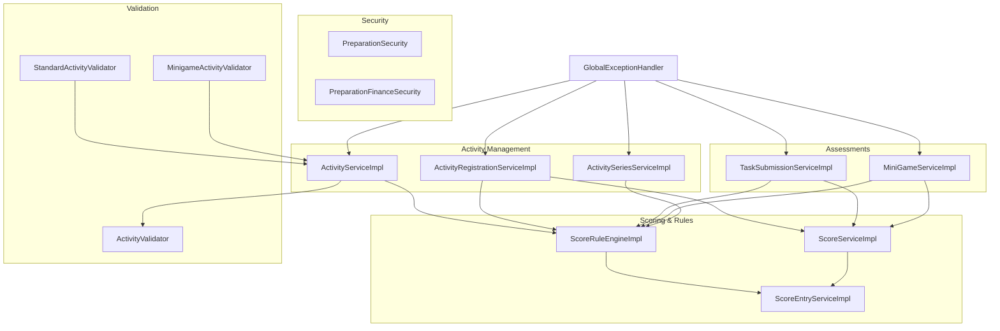

**Diagram sources**
- [ScoreRuleEngineImpl.java:45-491](file://src/main/java/vn/campuslife/service/impl/ScoreRuleEngineImpl.java#L45-L491)
- [ScoreEntryServiceImpl.java:27-111](file://src/main/java/vn/campuslife/service/impl/ScoreEntryServiceImpl.java#L27-L111)
- [ScoreServiceImpl.java:56-649](file://src/main/java/vn/campuslife/service/impl/ScoreServiceImpl.java#L56-L649)
- [ActivityServiceImpl.java:64-950](file://src/main/java/vn/campuslife/service/impl/ActivityServiceImpl.java#L64-L950)
- [ActivityRegistrationServiceImpl.java:35-1139](file://src/main/java/vn/campuslife/service/impl/ActivityRegistrationServiceImpl.java#L35-L1139)
- [TaskSubmissionServiceImpl.java:50-459](file://src/main/java/vn/campuslife/service/impl/TaskSubmissionServiceImpl.java#L50-L459)
- [MiniGameServiceImpl.java:65-791](file://src/main/java/vn/campuslife/service/impl/MiniGameServiceImpl.java#L65-L791)
- [ActivitySeriesServiceImpl.java:55-1410](file://src/main/java/vn/campuslife/service/impl/ActivitySeriesServiceImpl.java#L55-L1410)
- [PreparationSecurity.java:14-87](file://src/main/java/vn/campuslife/service/security/PreparationSecurity.java#L14-L87)
- [PreparationFinanceSecurity.java:21-157](file://src/main/java/vn/campuslife/service/security/PreparationFinanceSecurity.java#L21-L157)
- [ActivityValidator.java:3-11](file://src/main/java/vn/campuslife/service/validator/ActivityValidator.java#L3-L11)
- [StandardActivityValidator.java:8-41](file://src/main/java/vn/campuslife/service/validator/StandardActivityValidator.java#L8-L41)
- [MinigameActivityValidator.java:8-59](file://src/main/java/vn/campuslife/service/validator/MinigameActivityValidator.java#L8-L59)
- [GlobalExceptionHandler.java:18-119](file://src/main/java/vn/campuslife/exception/GlobalExceptionHandler.java#L18-L119)

**Section sources**
- [ScoreRuleEngineImpl.java:45-491](file://src/main/java/vn/campuslife/service/impl/ScoreRuleEngineImpl.java#L45-L491)
- [ActivityServiceImpl.java:64-950](file://src/main/java/vn/campuslife/service/impl/ActivityServiceImpl.java#L64-L950)
- [ActivityRegistrationServiceImpl.java:35-1139](file://src/main/java/vn/campuslife/service/impl/ActivityRegistrationServiceImpl.java#L35-L1139)
- [TaskSubmissionServiceImpl.java:50-459](file://src/main/java/vn/campuslife/service/impl/TaskSubmissionServiceImpl.java#L50-L459)
- [MiniGameServiceImpl.java:65-791](file://src/main/java/vn/campuslife/service/impl/MiniGameServiceImpl.java#L65-L791)
- [ActivitySeriesServiceImpl.java:55-1410](file://src/main/java/vn/campuslife/service/impl/ActivitySeriesServiceImpl.java#L55-L1410)
- [PreparationSecurity.java:14-87](file://src/main/java/vn/campuslife/service/security/PreparationSecurity.java#L14-L87)
- [PreparationFinanceSecurity.java:21-157](file://src/main/java/vn/campuslife/service/security/PreparationFinanceSecurity.java#L21-L157)
- [ActivityValidator.java:3-11](file://src/main/java/vn/campuslife/service/validator/ActivityValidator.java#L3-L11)
- [StandardActivityValidator.java:8-41](file://src/main/java/vn/campuslife/service/validator/StandardActivityValidator.java#L8-L41)
- [MinigameActivityValidator.java:8-59](file://src/main/java/vn/campuslife/service/validator/MinigameActivityValidator.java#L8-L59)
- [GlobalExceptionHandler.java:18-119](file://src/main/java/vn/campuslife/exception/GlobalExceptionHandler.java#L18-L119)

## Core Components
- Rule Engine: Centralized scoring calculation and point application across triggers (completion, no-show, overdue, submission graded, minigame outcomes, series milestones, minimum requirements).
- Score Entry Service: Idempotent creation/upsert and reversal of score entries; cascading recalculation of student totals.
- Activity Services: Lifecycle orchestration for activities, registrations, check-in/out, and series management.
- Assessment Services: Task submission workflow and mini-game quiz lifecycle with scoring integration.
- Security Services: Role-based access checks for preparation and finance domains.
- Validation Framework: Domain-specific validators for activity creation/update requests.
- Global Exception Handler: Centralized error mapping to consistent API responses.

**Section sources**
- [ScoreRuleEngine.java:5-22](file://src/main/java/vn/campuslife/service/ScoreRuleEngine.java#L5-L22)
- [ScoreRuleEngineImpl.java:45-491](file://src/main/java/vn/campuslife/service/impl/ScoreRuleEngineImpl.java#L45-L491)
- [ScoreEntryServiceImpl.java:27-111](file://src/main/java/vn/campuslife/service/impl/ScoreEntryServiceImpl.java#L27-L111)
- [ActivityServiceImpl.java:64-950](file://src/main/java/vn/campuslife/service/impl/ActivityServiceImpl.java#L64-L950)
- [ActivityRegistrationServiceImpl.java:35-1139](file://src/main/java/vn/campuslife/service/impl/ActivityRegistrationServiceImpl.java#L35-L1139)
- [TaskSubmissionServiceImpl.java:50-459](file://src/main/java/vn/campuslife/service/impl/TaskSubmissionServiceImpl.java#L50-L459)
- [MiniGameServiceImpl.java:65-791](file://src/main/java/vn/campuslife/service/impl/MiniGameServiceImpl.java#L65-L791)
- [ActivitySeriesServiceImpl.java:55-1410](file://src/main/java/vn/campuslife/service/impl/ActivitySeriesServiceImpl.java#L55-L1410)
- [PreparationSecurity.java:14-87](file://src/main/java/vn/campuslife/service/security/PreparationSecurity.java#L14-L87)
- [PreparationFinanceSecurity.java:21-157](file://src/main/java/vn/campuslife/service/security/PreparationFinanceSecurity.java#L21-L157)
- [ActivityValidator.java:3-11](file://src/main/java/vn/campuslife/service/validator/ActivityValidator.java#L3-L11)
- [StandardActivityValidator.java:8-41](file://src/main/java/vn/campuslife/service/validator/StandardActivityValidator.java#L8-L41)
- [MinigameActivityValidator.java:8-59](file://src/main/java/vn/campuslife/service/validator/MinigameActivityValidator.java#L8-L59)
- [GlobalExceptionHandler.java:18-119](file://src/main/java/vn/campuslife/exception/GlobalExceptionHandler.java#L18-L119)

## Architecture Overview
The service layer follows a layered pattern:
- Controllers delegate to services.
- Services encapsulate business rules and orchestrate repositories and other services.
- Transaction boundaries are declared at service level for atomicity.
- Rule engine decouples scoring logic from workflows.
- Validators enforce preconditions before persistence.
- Security services enforce role-based access checks.

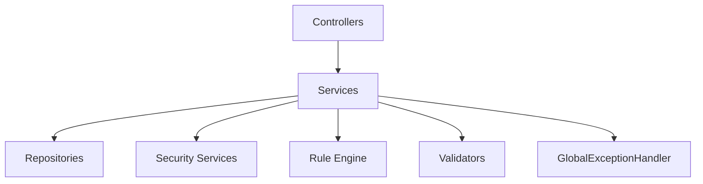

[No sources needed since this diagram shows conceptual workflow, not actual code structure]

## Detailed Component Analysis

### Rule Engine Implementation
The rule engine applies scoring based on triggers and audiences, with semester resolution and idempotent score entry updates.

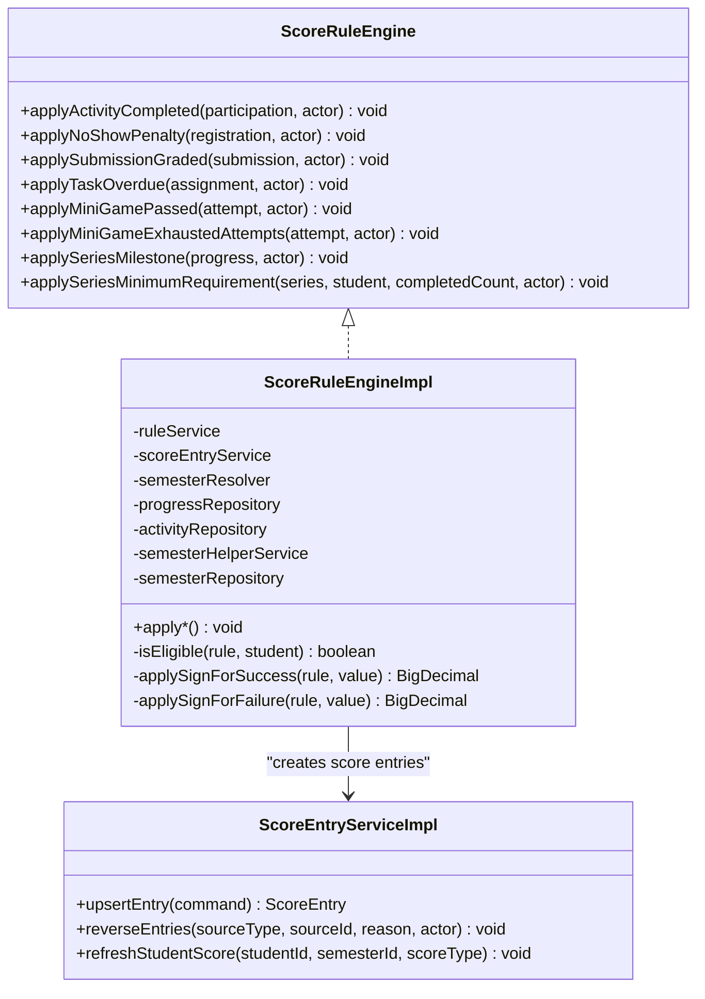

**Diagram sources**
- [ScoreRuleEngine.java:5-22](file://src/main/java/vn/campuslife/service/ScoreRuleEngine.java#L5-L22)
- [ScoreRuleEngineImpl.java:45-491](file://src/main/java/vn/campuslife/service/impl/ScoreRuleEngineImpl.java#L45-L491)
- [ScoreEntryServiceImpl.java:27-111](file://src/main/java/vn/campuslife/service/impl/ScoreEntryServiceImpl.java#L27-L111)

Key behaviors:
- Eligibility filtering by audience and department.
- Sign convention for penalties and pass/fail scenarios.
- Series milestone and minimum requirement enforcement with semester resolution fallback.
- Idempotent upsert and reversal of score entries.

**Section sources**
- [ScoreRuleEngineImpl.java:45-491](file://src/main/java/vn/campuslife/service/impl/ScoreRuleEngineImpl.java#L45-L491)
- [ScoreEntryServiceImpl.java:27-111](file://src/main/java/vn/campuslife/service/impl/ScoreEntryServiceImpl.java#L27-L111)

### Activity Lifecycle Orchestration
ActivityService manages creation, publication, copying, and auto-registration based on presets and flags. It integrates with score presets and reminder scheduling.

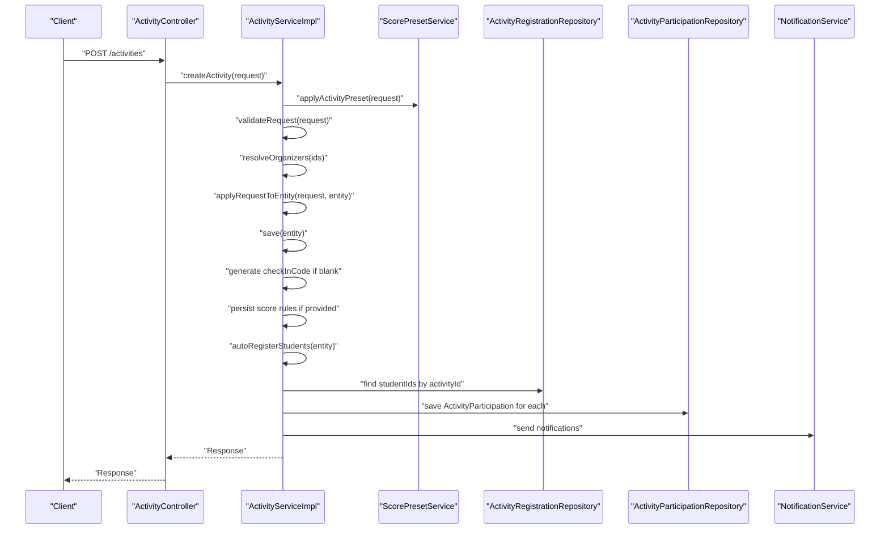

**Diagram sources**
- [ActivityServiceImpl.java:84-132](file://src/main/java/vn/campuslife/service/impl/ActivityServiceImpl.java#L84-L132)

Transaction boundaries:
- Creation, update, publish/unpublish, copy, deletion are transactional to maintain consistency.

Validation patterns:
- Pre-save validation of required fields and temporal constraints.
- Organizer resolution with missing-id detection.

Auto-registration:
- Conditional auto-registration for important and mandatory activities.
- Batch existence checks to avoid N+1 queries.

**Section sources**
- [ActivityServiceImpl.java:84-374](file://src/main/java/vn/campuslife/service/impl/ActivityServiceImpl.java#L84-L374)

### Registration and Attendance Workflow
ActivityRegistrationService coordinates registration, approvals, check-in/out, and completion grading.

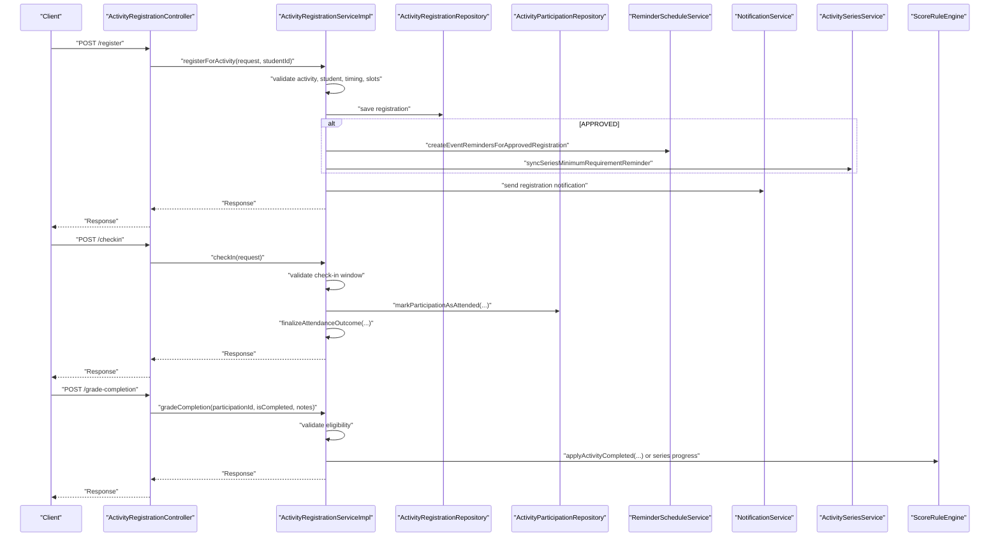

**Diagram sources**
- [ActivityRegistrationServiceImpl.java:54-175](file://src/main/java/vn/campuslife/service/impl/ActivityRegistrationServiceImpl.java#L54-L175)
- [ActivityRegistrationServiceImpl.java:403-482](file://src/main/java/vn/campuslife/service/impl/ActivityRegistrationServiceImpl.java#L403-L482)
- [ActivityRegistrationServiceImpl.java:551-637](file://src/main/java/vn/campuslife/service/impl/ActivityRegistrationServiceImpl.java#L551-L637)

Key rules:
- Draft activities block manual registration and check-in.
- Time-window validation for check-in/out.
- Series vs standalone activity scoring paths.
- Series progress updates upon completion.

**Section sources**
- [ActivityRegistrationServiceImpl.java:54-175](file://src/main/java/vn/campuslife/service/impl/ActivityRegistrationServiceImpl.java#L54-L175)
- [ActivityRegistrationServiceImpl.java:403-482](file://src/main/java/vn/campuslife/service/impl/ActivityRegistrationServiceImpl.java#L403-L482)
- [ActivityRegistrationServiceImpl.java:551-637](file://src/main/java/vn/campuslife/service/impl/ActivityRegistrationServiceImpl.java#L551-L637)

### Task Submission and Grading
TaskSubmissionService manages submission lifecycle and links grading to scoring.

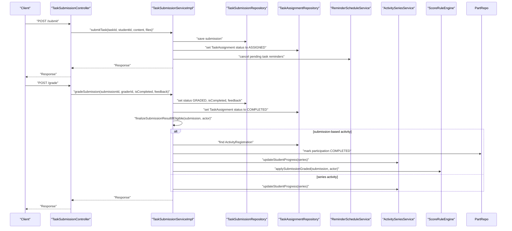

**Diagram sources**
- [TaskSubmissionServiceImpl.java:70-132](file://src/main/java/vn/campuslife/service/impl/TaskSubmissionServiceImpl.java#L70-L132)
- [TaskSubmissionServiceImpl.java:196-249](file://src/main/java/vn/campuslife/service/impl/TaskSubmissionServiceImpl.java#L196-L249)
- [TaskSubmissionServiceImpl.java:413-456](file://src/main/java/vn/campuslife/service/impl/TaskSubmissionServiceImpl.java#L413-L456)

**Section sources**
- [TaskSubmissionServiceImpl.java:70-132](file://src/main/java/vn/campuslife/service/impl/TaskSubmissionServiceImpl.java#L70-L132)
- [TaskSubmissionServiceImpl.java:196-249](file://src/main/java/vn/campuslife/service/impl/TaskSubmissionServiceImpl.java#L196-L249)
- [TaskSubmissionServiceImpl.java:413-456](file://src/main/java/vn/campuslife/service/impl/TaskSubmissionServiceImpl.java#L413-L456)

### Mini-Game Quiz Lifecycle
MiniGameService orchestrates quiz attempts, scoring, and participation creation.

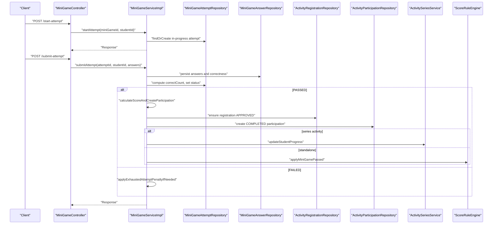

**Diagram sources**
- [MiniGameServiceImpl.java:188-240](file://src/main/java/vn/campuslife/service/impl/MiniGameServiceImpl.java#L188-L240)
- [MiniGameServiceImpl.java:244-336](file://src/main/java/vn/campuslife/service/impl/MiniGameServiceImpl.java#L244-L336)
- [MiniGameServiceImpl.java:355-457](file://src/main/java/vn/campuslife/service/impl/MiniGameServiceImpl.java#L355-L457)
- [MiniGameServiceImpl.java:758-790](file://src/main/java/vn/campuslife/service/impl/MiniGameServiceImpl.java#L758-L790)

**Section sources**
- [MiniGameServiceImpl.java:188-240](file://src/main/java/vn/campuslife/service/impl/MiniGameServiceImpl.java#L188-L240)
- [MiniGameServiceImpl.java:244-336](file://src/main/java/vn/campuslife/service/impl/MiniGameServiceImpl.java#L244-L336)
- [MiniGameServiceImpl.java:355-457](file://src/main/java/vn/campuslife/service/impl/MiniGameServiceImpl.java#L355-L457)
- [MiniGameServiceImpl.java:758-790](file://src/main/java/vn/campuslife/service/impl/MiniGameServiceImpl.java#L758-L790)

### Series Management and Milestones
ActivitySeriesService manages series creation, child activity lifecycle, and progress tracking.

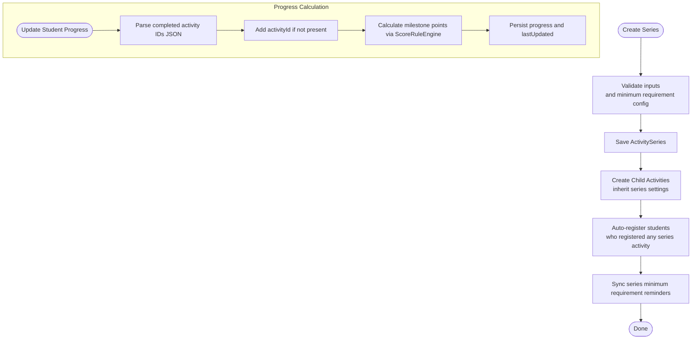

**Diagram sources**
- [ActivitySeriesServiceImpl.java:75-120](file://src/main/java/vn/campuslife/service/impl/ActivitySeriesServiceImpl.java#L75-L120)
- [ActivitySeriesServiceImpl.java:122-207](file://src/main/java/vn/campuslife/service/impl/ActivitySeriesServiceImpl.java#L122-L207)
- [ActivitySeriesServiceImpl.java:472-543](file://src/main/java/vn/campuslife/service/impl/ActivitySeriesServiceImpl.java#L472-L543)
- [ActivitySeriesServiceImpl.java:547-576](file://src/main/java/vn/campuslife/service/impl/ActivitySeriesServiceImpl.java#L547-L576)

**Section sources**
- [ActivitySeriesServiceImpl.java:75-120](file://src/main/java/vn/campuslife/service/impl/ActivitySeriesServiceImpl.java#L75-L120)
- [ActivitySeriesServiceImpl.java:122-207](file://src/main/java/vn/campuslife/service/impl/ActivitySeriesServiceImpl.java#L122-L207)
- [ActivitySeriesServiceImpl.java:472-543](file://src/main/java/vn/campuslife/service/impl/ActivitySeriesServiceImpl.java#L472-L543)
- [ActivitySeriesServiceImpl.java:547-576](file://src/main/java/vn/campuslife/service/impl/ActivitySeriesServiceImpl.java#L547-L576)

### Security Implementations
PreparationSecurity and PreparationFinanceSecurity provide role-based authorization for preparation tasks and finance-related operations.

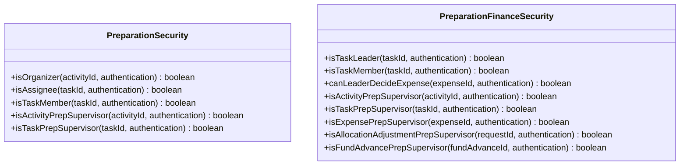

**Diagram sources**
- [PreparationSecurity.java:14-87](file://src/main/java/vn/campuslife/service/security/PreparationSecurity.java#L14-L87)
- [PreparationFinanceSecurity.java:21-157](file://src/main/java/vn/campuslife/service/security/PreparationFinanceSecurity.java#L21-L157)

**Section sources**
- [PreparationSecurity.java:14-87](file://src/main/java/vn/campuslife/service/security/PreparationSecurity.java#L14-L87)
- [PreparationFinanceSecurity.java:21-157](file://src/main/java/vn/campuslife/service/security/PreparationFinanceSecurity.java#L21-L157)

### Validation Patterns
Validators define domain-specific preconditions for activity creation/update.

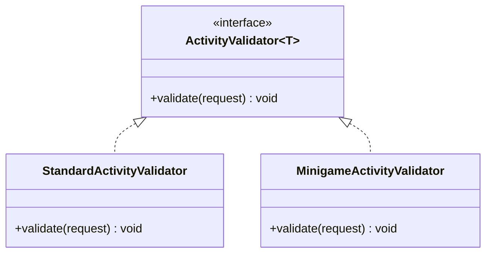

**Diagram sources**
- [ActivityValidator.java:3-11](file://src/main/java/vn/campuslife/service/validator/ActivityValidator.java#L3-L11)
- [StandardActivityValidator.java:8-41](file://src/main/java/vn/campuslife/service/validator/StandardActivityValidator.java#L8-L41)
- [MinigameActivityValidator.java:8-59](file://src/main/java/vn/campuslife/service/validator/MinigameActivityValidator.java#L8-L59)

Usage:
- ActivityServiceImpl invokes validators during create/update flows.
- StandardActivityValidator enforces non-minigame type constraints.
- MinigameActivityValidator enforces quiz presence and question correctness.

**Section sources**
- [ActivityValidator.java:3-11](file://src/main/java/vn/campuslife/service/validator/ActivityValidator.java#L3-L11)
- [StandardActivityValidator.java:8-41](file://src/main/java/vn/campuslife/service/validator/StandardActivityValidator.java#L8-L41)
- [MinigameActivityValidator.java:8-59](file://src/main/java/vn/campuslife/service/validator/MinigameActivityValidator.java#L8-L59)
- [ActivityServiceImpl.java:84-132](file://src/main/java/vn/campuslife/service/impl/ActivityServiceImpl.java#L84-L132)

### Error Handling Mechanism
GlobalExceptionHandler centralizes exception-to-response mapping.

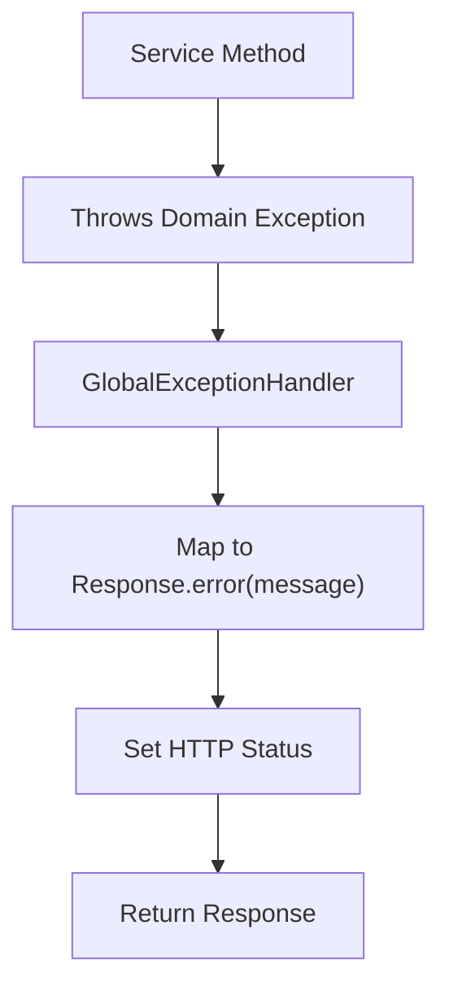

**Diagram sources**
- [GlobalExceptionHandler.java:18-119](file://src/main/java/vn/campuslife/exception/GlobalExceptionHandler.java#L18-L119)

Common mappings:
- FeatureNotEnabledException → 400
- ResourceNotFoundException → 404
- ForbiddenException → 403
- BadRequestException → 400
- InsufficientBudgetException → 409
- OverBudgetException → 409 with structured info
- MethodArgumentNotValidException → 400 with field messages
- HttpMessageNotReadableException → 400 with body detail
- DataIntegrityViolationException → 409 with conflict detail
- AccessDeniedException → 403
- Other exceptions → 500 with sanitized message

**Section sources**
- [GlobalExceptionHandler.java:18-119](file://src/main/java/vn/campuslife/exception/GlobalExceptionHandler.java#L18-L119)

## Dependency Analysis
- Cohesion: Each service focuses on a single domain (scoring, activities, registrations, assessments, series, security, validation).
- Coupling: Services depend on repositories and other services via interfaces, minimizing tight coupling.
- Rule Engine Decoupling: Scoring logic is centralized and invoked by multiple services, reducing duplication.
- Transaction Boundaries: Services declare transactions around business operations to ensure atomicity.

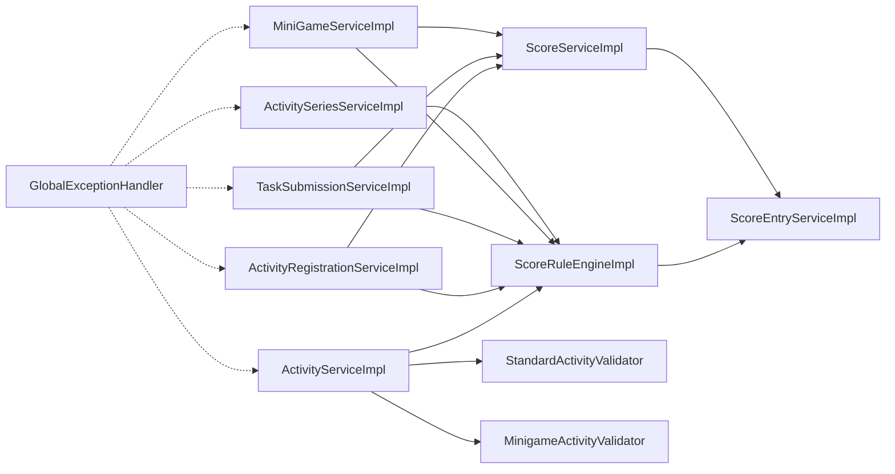

**Diagram sources**
- [ActivityServiceImpl.java:64-950](file://src/main/java/vn/campuslife/service/impl/ActivityServiceImpl.java#L64-L950)
- [ActivityRegistrationServiceImpl.java:35-1139](file://src/main/java/vn/campuslife/service/impl/ActivityRegistrationServiceImpl.java#L35-L1139)
- [TaskSubmissionServiceImpl.java:50-459](file://src/main/java/vn/campuslife/service/impl/TaskSubmissionServiceImpl.java#L50-L459)
- [MiniGameServiceImpl.java:65-791](file://src/main/java/vn/campuslife/service/impl/MiniGameServiceImpl.java#L65-L791)
- [ActivitySeriesServiceImpl.java:55-1410](file://src/main/java/vn/campuslife/service/impl/ActivitySeriesServiceImpl.java#L55-L1410)
- [ScoreRuleEngineImpl.java:45-491](file://src/main/java/vn/campuslife/service/impl/ScoreRuleEngineImpl.java#L45-L491)
- [ScoreEntryServiceImpl.java:27-111](file://src/main/java/vn/campuslife/service/impl/ScoreEntryServiceImpl.java#L27-L111)
- [ScoreServiceImpl.java:56-649](file://src/main/java/vn/campuslife/service/impl/ScoreServiceImpl.java#L56-L649)
- [StandardActivityValidator.java:8-41](file://src/main/java/vn/campuslife/service/validator/StandardActivityValidator.java#L8-L41)
- [MinigameActivityValidator.java:8-59](file://src/main/java/vn/campuslife/service/validator/MinigameActivityValidator.java#L8-L59)
- [GlobalExceptionHandler.java:18-119](file://src/main/java/vn/campuslife/exception/GlobalExceptionHandler.java#L18-L119)

**Section sources**
- [ScoreRuleEngineImpl.java:45-491](file://src/main/java/vn/campuslife/service/impl/ScoreRuleEngineImpl.java#L45-L491)
- [ScoreEntryServiceImpl.java:27-111](file://src/main/java/vn/campuslife/service/impl/ScoreEntryServiceImpl.java#L27-L111)
- [ActivityServiceImpl.java:64-950](file://src/main/java/vn/campuslife/service/impl/ActivityServiceImpl.java#L64-L950)
- [ActivityRegistrationServiceImpl.java:35-1139](file://src/main/java/vn/campuslife/service/impl/ActivityRegistrationServiceImpl.java#L35-L1139)
- [TaskSubmissionServiceImpl.java:50-459](file://src/main/java/vn/campuslife/service/impl/TaskSubmissionServiceImpl.java#L50-L459)
- [MiniGameServiceImpl.java:65-791](file://src/main/java/vn/campuslife/service/impl/MiniGameServiceImpl.java#L65-L791)
- [ActivitySeriesServiceImpl.java:55-1410](file://src/main/java/vn/campuslife/service/impl/ActivitySeriesServiceImpl.java#L55-L1410)
- [StandardActivityValidator.java:8-41](file://src/main/java/vn/campuslife/service/validator/StandardActivityValidator.java#L8-L41)
- [MinigameActivityValidator.java:8-59](file://src/main/java/vn/campuslife/service/validator/MinigameActivityValidator.java#L8-L59)
- [GlobalExceptionHandler.java:18-119](file://src/main/java/vn/campuslife/exception/GlobalExceptionHandler.java#L18-L119)

## Performance Considerations
- Transaction boundaries: Services annotate business methods with @Transactional to minimize rollback risk and ensure consistency.
- Batch operations: ActivityServiceImpl batches auto-registration existence checks to reduce N+1 queries.
- Pagination and aggregation: ScoreServiceImpl paginates score histories and computes prior totals efficiently.
- Lazy loading and N+1 prevention: ScoreServiceImpl and ActivityRegistrationServiceImpl batch-load related entities (series, progress) to avoid N+1 queries.
- Idempotent score entries: ScoreEntryServiceImpl prevents duplicate entries and recomputes totals efficiently.
- Early exits: Many services short-circuit on invalid states (e.g., draft activities) to avoid unnecessary work.

[No sources needed since this section provides general guidance]

## Troubleshooting Guide
Common issues and resolutions:
- Validation failures: Ensure request fields meet validator constraints (e.g., dates, organizers, quiz presence).
- Registration conflicts: Verify activity timing, slot availability, and existing registrations.
- Draft restrictions: Operations like manual registration and check-in are blocked for draft activities.
- Budget conflicts: OverBudgetException indicates budget limit exceeded; adjust allocations accordingly.
- Access denied: Security checks prevent unauthorized actions; confirm roles and permissions.

**Section sources**
- [ActivityRegistrationServiceImpl.java:54-175](file://src/main/java/vn/campuslife/service/impl/ActivityRegistrationServiceImpl.java#L54-L175)
- [ActivityServiceImpl.java:84-132](file://src/main/java/vn/campuslife/service/impl/ActivityServiceImpl.java#L84-L132)
- [GlobalExceptionHandler.java:18-119](file://src/main/java/vn/campuslife/exception/GlobalExceptionHandler.java#L18-L119)

## Conclusion
The CampusLife business logic layer is modular, transactionally bounded, and decoupled through a central rule engine and shared services. Validation and security are integrated early in the pipeline, while scoring is centralized and extensible. The design supports complex workflows (series, quizzes, submissions) with robust error handling and performance-conscious patterns.