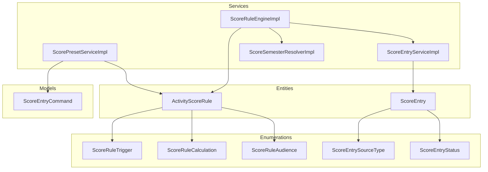
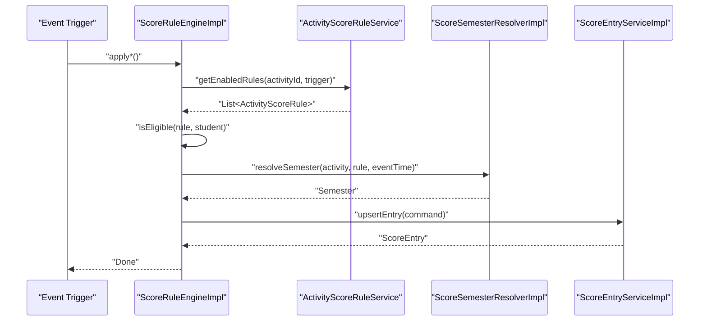
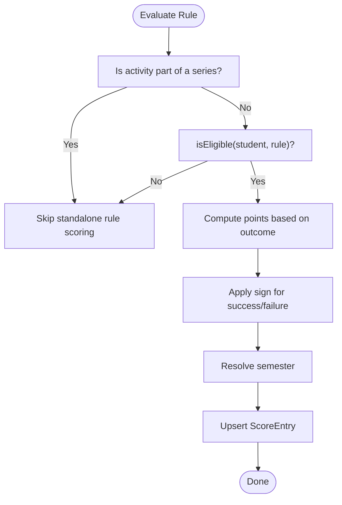
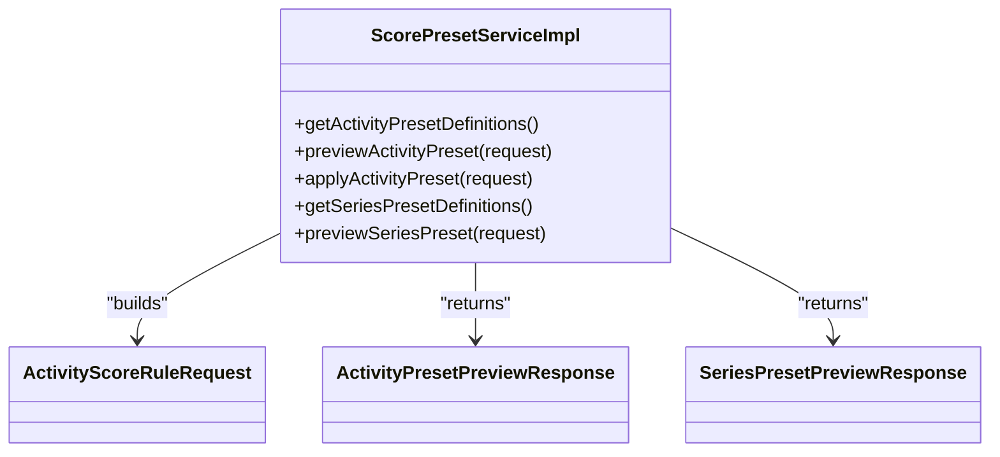
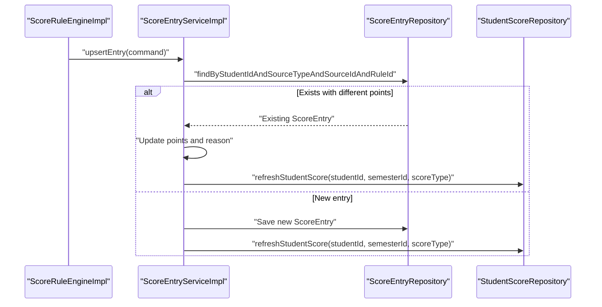
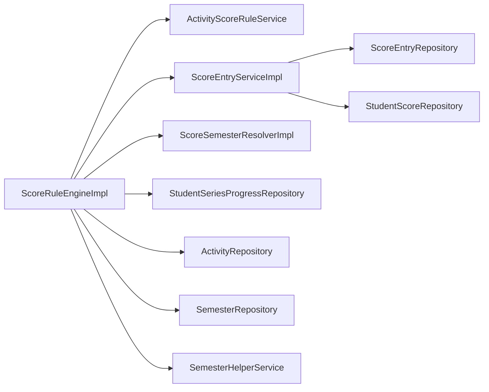

# Rule Engine System

<cite>
**Referenced Files in This Document**
- [ActivityScoreRule.java](file://src/main/java/vn/campuslife/entity/ActivityScoreRule.java)
- [ScoreEntry.java](file://src/main/java/vn/campuslife/entity/ScoreEntry.java)
- [ScoreRuleEngine.java](file://src/main/java/vn/campuslife/service/ScoreRuleEngine.java)
- [ScoreRuleEngineImpl.java](file://src/main/java/vn/campuslife/service/impl/ScoreRuleEngineImpl.java)
- [ScorePresetServiceImpl.java](file://src/main/java/vn/campuslife/service/impl/ScorePresetServiceImpl.java)
- [ScoreEntryServiceImpl.java](file://src/main/java/vn/campuslife/service/impl/ScoreEntryServiceImpl.java)
- [ScoreSemesterResolver.java](file://src/main/java/vn/campuslife/service/ScoreSemesterResolver.java)
- [ScoreSemesterResolverImpl.java](file://src/main/java/vn/campuslife/service/impl/ScoreSemesterResolverImpl.java)
- [ScoreRuleTrigger.java](file://src/main/java/vn/campuslife/enumeration/ScoreRuleTrigger.java)
- [ScoreRuleCalculation.java](file://src/main/java/vn/campuslife/enumeration/ScoreRuleCalculation.java)
- [ScoreRuleAudience.java](file://src/main/java/vn/campuslife/enumeration/ScoreRuleAudience.java)
- [ScoreEntrySourceType.java](file://src/main/java/vn/campuslife/enumeration/ScoreEntrySourceType.java)
- [ScoreEntryStatus.java](file://src/main/java/vn/campuslife/enumeration/ScoreEntryStatus.java)
- [ScoreEntryCommand.java](file://src/main/java/vn/campuslife/model/score/ScoreEntryCommand.java)
- [ScoreRuleEngineImplTest.java](file://src/test/java/vn/campuslife/service/impl/ScoreRuleEngineImplTest.java)
</cite>

## Table of Contents
1. [Introduction](#introduction)
2. [Project Structure](#project-structure)
3. [Core Components](#core-components)
4. [Architecture Overview](#architecture-overview)
5. [Detailed Component Analysis](#detailed-component-analysis)
6. [Dependency Analysis](#dependency-analysis)
7. [Performance Considerations](#performance-considerations)
8. [Troubleshooting Guide](#troubleshooting-guide)
9. [Conclusion](#conclusion)
10. [Appendices](#appendices)

## Introduction
This document explains the rule engine system that powers scoring and point calculation. It covers the pluggable rule configuration, trigger-based scoring, calculation algorithms, preset rule management, dynamic rule evaluation, and score entry processing. It also documents rule definition syntax, validation mechanisms, audit trails, examples of complex scoring scenarios, rule precedence handling, performance considerations for large-scale execution, rule versioning, testing strategies, and debugging capabilities.

## Project Structure
The rule engine spans entities, enumerations, services, repositories, and models that orchestrate scoring decisions across activities, tasks, mini-games, and series.

**Diagram sources**
- [ActivityScoreRule.java:28-87](file://src/main/java/vn/campuslife/entity/ActivityScoreRule.java#L28-L87)
- [ScoreEntry.java:24-78](file://src/main/java/vn/campuslife/entity/ScoreEntry.java#L24-L78)
- [ScoreRuleEngineImpl.java:45-491](file://src/main/java/vn/campuslife/service/impl/ScoreRuleEngineImpl.java#L45-L491)
- [ScoreEntryServiceImpl.java:27-111](file://src/main/java/vn/campuslife/service/impl/ScoreEntryServiceImpl.java#L27-L111)
- [ScorePresetServiceImpl.java:33-546](file://src/main/java/vn/campuslife/service/impl/ScorePresetServiceImpl.java#L33-L546)
- [ScoreSemesterResolverImpl.java:16-41](file://src/main/java/vn/campuslife/service/impl/ScoreSemesterResolverImpl.java#L16-L41)
- [ScoreRuleTrigger.java:3-12](file://src/main/java/vn/campuslife/enumeration/ScoreRuleTrigger.java#L3-L12)
- [ScoreRuleCalculation.java:3-10](file://src/main/java/vn/campuslife/enumeration/ScoreRuleCalculation.java#L3-L10)
- [ScoreRuleAudience.java:3-8](file://src/main/java/vn/campuslife/enumeration/ScoreRuleAudience.java#L3-L8)
- [ScoreEntrySourceType.java:3-14](file://src/main/java/vn/campuslife/enumeration/ScoreEntrySourceType.java#L3-L14)
- [ScoreEntryStatus.java:3-7](file://src/main/java/vn/campuslife/enumeration/ScoreEntryStatus.java#L3-L7)
- [ScoreEntryCommand.java:13-25](file://src/main/java/vn/campuslife/model/score/ScoreEntryCommand.java#L13-L25)

**Section sources**
- [ScoreRuleEngineImpl.java:45-491](file://src/main/java/vn/campuslife/service/impl/ScoreRuleEngineImpl.java#L45-L491)
- [ScorePresetServiceImpl.java:33-546](file://src/main/java/vn/campuslife/service/impl/ScorePresetServiceImpl.java#L33-L546)
- [ScoreEntryServiceImpl.java:27-111](file://src/main/java/vn/campuslife/service/impl/ScoreEntryServiceImpl.java#L27-L111)

## Core Components
- ActivityScoreRule: Defines a single scoring rule with trigger, calculation method, points, fail points, audience, semester policy, and optional explicit semester.
- ScoreEntry: Stores scored events with source metadata, points, status, reason, and audit info.
- ScoreRuleEngine: Interface declaring trigger-driven scoring methods (participation, no-show, submission grading, task overdue, mini-game outcomes, series milestones, and minimum requirements).
- ScoreRuleEngineImpl: Implements trigger evaluation, eligibility checks, sign application for penalties, semester resolution, and score entry creation/updating.
- ScorePresetServiceImpl: Generates preset rule configurations for activities and series based on predefined policies.
- ScoreEntryServiceImpl: Manages ScoreEntry creation/upsert, reversal, and recalculation of student totals per semester and score type.
- ScoreSemesterResolverImpl: Resolves applicable semester for a rule based on policy and timestamps.
- Enumerations: Define triggers, calculations, audiences, entry source types, and statuses.
- ScoreEntryCommand: DTO for constructing ScoreEntry records.

**Section sources**
- [ActivityScoreRule.java:28-87](file://src/main/java/vn/campuslife/entity/ActivityScoreRule.java#L28-L87)
- [ScoreEntry.java:24-78](file://src/main/java/vn/campuslife/entity/ScoreEntry.java#L24-L78)
- [ScoreRuleEngine.java:5-22](file://src/main/java/vn/campuslife/service/ScoreRuleEngine.java#L5-L22)
- [ScoreRuleEngineImpl.java:45-491](file://src/main/java/vn/campuslife/service/impl/ScoreRuleEngineImpl.java#L45-L491)
- [ScorePresetServiceImpl.java:33-546](file://src/main/java/vn/campuslife/service/impl/ScorePresetServiceImpl.java#L33-L546)
- [ScoreEntryServiceImpl.java:27-111](file://src/main/java/vn/campuslife/service/impl/ScoreEntryServiceImpl.java#L27-L111)
- [ScoreSemesterResolverImpl.java:16-41](file://src/main/java/vn/campuslife/service/impl/ScoreSemesterResolverImpl.java#L16-L41)
- [ScoreRuleTrigger.java:3-12](file://src/main/java/vn/campuslife/enumeration/ScoreRuleTrigger.java#L3-L12)
- [ScoreRuleCalculation.java:3-10](file://src/main/java/vn/campuslife/enumeration/ScoreRuleCalculation.java#L3-L10)
- [ScoreRuleAudience.java:3-8](file://src/main/java/vn/campuslife/enumeration/ScoreRuleAudience.java#L3-L8)
- [ScoreEntrySourceType.java:3-14](file://src/main/java/vn/campuslife/enumeration/ScoreEntrySourceType.java#L3-L14)
- [ScoreEntryStatus.java:3-7](file://src/main/java/vn/campuslife/enumeration/ScoreEntryStatus.java#L3-L7)
- [ScoreEntryCommand.java:13-25](file://src/main/java/vn/campuslife/model/score/ScoreEntryCommand.java#L13-L25)

## Architecture Overview
The system separates rule definition, evaluation, and persistence. Presets generate rule sets; the engine evaluates triggers against rules and writes ScoreEntry records, which drive StudentScore aggregation.

**Diagram sources**
- [ScoreRuleEngineImpl.java:56-94](file://src/main/java/vn/campuslife/service/impl/ScoreRuleEngineImpl.java#L56-L94)
- [ScoreEntryServiceImpl.java:36-74](file://src/main/java/vn/campuslife/service/impl/ScoreEntryServiceImpl.java#L36-L74)
- [ScoreSemesterResolverImpl.java:21-39](file://src/main/java/vn/campuslife/service/impl/ScoreSemesterResolverImpl.java#L21-L39)

## Detailed Component Analysis

### Rule Definition and Evaluation
- Eligibility: Rules are evaluated only if the student matches the audience (all participants, department-only, outside departments).
- Sign application: Penalty logic flips signs for failure outcomes depending on calculation type (penalty points or pass/fail points).
- Series exclusions: Standalone activity rules skip series-contained activities; series-specific rules compute milestones and minimum requirements independently.

**Diagram sources**
- [ScoreRuleEngineImpl.java:56-94](file://src/main/java/vn/campuslife/service/impl/ScoreRuleEngineImpl.java#L56-L94)
- [ScoreRuleEngineImpl.java:451-488](file://src/main/java/vn/campuslife/service/impl/ScoreRuleEngineImpl.java#L451-L488)

**Section sources**
- [ScoreRuleEngineImpl.java:451-488](file://src/main/java/vn/campuslife/service/impl/ScoreRuleEngineImpl.java#L451-L488)

### Calculation Algorithms
- FIXED_POINTS: Award fixed points for success; failure may award failPoints.
- COUNT_COMPLETION: Accumulate points by counting completions (e.g., enterprise seminar series).
- PASS_FAIL_POINTS: Success yields points; failure subtracts failPoints (sign applied).
- PENALTY_POINTS: Deduct failPoints regardless of outcome (sign applied).
- SERIES_MILESTONE: Series milestone scoring computed from JSON milestone definitions.

**Section sources**
- [ScoreRuleCalculation.java:3-10](file://src/main/java/vn/campuslife/enumeration/ScoreRuleCalculation.java#L3-L10)
- [ScoreRuleEngineImpl.java:318-385](file://src/main/java/vn/campuslife/service/impl/ScoreRuleEngineImpl.java#L318-L385)

### Preset Rule Management
- Activity presets define default rule sets for common patterns (e.g., basic event, event with submission, enterprise seminar, minigame pass-only, custom).
- Series presets define milestone structures and minimum requirement enforcement.
- Validation: Sending custom rules with non-custom presets is rejected to prevent conflicts.

**Diagram sources**
- [ScorePresetServiceImpl.java:33-546](file://src/main/java/vn/campuslife/service/impl/ScorePresetServiceImpl.java#L33-L546)

**Section sources**
- [ScorePresetServiceImpl.java:98-202](file://src/main/java/vn/campuslife/service/impl/ScorePresetServiceImpl.java#L98-L202)
- [ScorePresetServiceImpl.java:204-245](file://src/main/java/vn/campuslife/service/impl/ScorePresetServiceImpl.java#L204-L245)

### Dynamic Rule Evaluation and Score Entry Processing
- Upsert semantics: Updates existing entries if points change; otherwise no-op.
- Reversal: Marks entries as reversed with a reason and actor, then recalculates totals.
- Total recalculation: Aggregates active entries per student, semester, and score type.

**Diagram sources**
- [ScoreEntryServiceImpl.java:36-109](file://src/main/java/vn/campuslife/service/impl/ScoreEntryServiceImpl.java#L36-L109)

**Section sources**
- [ScoreEntryServiceImpl.java:36-109](file://src/main/java/vn/campuslife/service/impl/ScoreEntryServiceImpl.java#L36-L109)

### Semester Resolution
- Explicit semester: Enforced when configured; otherwise fallback to activity or date-based resolution.
- Fallback logic: Uses activity start date or open/current semester if no suitable date found.

**Section sources**
- [ScoreSemesterResolverImpl.java:21-39](file://src/main/java/vn/campuslife/service/impl/ScoreSemesterResolverImpl.java#L21-L39)

### Trigger-Based Scoring Mechanisms
- Participation completed: Standalone activities award points based on completion; series activities are skipped.
- No-show penalty: Applies penalty for non-appearance; configurable score type and points.
- Submission graded: Pass yields points; fail/incomplete yields failPoints; series submissions are skipped.
- Task overdue: Penalty for unsubmitted assignments past deadline; series tasks are skipped.
- Mini-game passed/exhausted attempts: Awards points on pass; applies penalties on final failed attempt; series mini-games are skipped.
- Series milestone: Parses JSON milestones and awards the highest applicable threshold without reducing previously earned points.
- Series minimum requirement: Enforces minimum event count; negative penalty if not met.

**Section sources**
- [ScoreRuleEngineImpl.java:56-425](file://src/main/java/vn/campuslife/service/impl/ScoreRuleEngineImpl.java#L56-L425)
- [ScoreRuleEngine.java:5-22](file://src/main/java/vn/campuslife/service/ScoreRuleEngine.java#L5-L22)

### Rule Definition Syntax and Validation
- Fields: scoreType, triggerType, calculation, points, failPoints, audience, semesterPolicy, explicitSemester, enabled, targetDepartments.
- Validation: 
  - Audience vs. targetDepartments must align.
  - Series exclusion for standalone triggers.
  - Preset conflict prevention (custom rules not allowed with non-CUSTOM presets).
  - Milestone parsing robustness with warnings on invalid keys/values.

**Section sources**
- [ActivityScoreRule.java:38-78](file://src/main/java/vn/campuslife/entity/ActivityScoreRule.java#L38-L78)
- [ScorePresetServiceImpl.java:125-130](file://src/main/java/vn/campuslife/service/impl/ScorePresetServiceImpl.java#L125-L130)
- [ScoreRuleEngineImpl.java:330-353](file://src/main/java/vn/campuslife/service/impl/ScoreRuleEngineImpl.java#L330-L353)

### Audit Trails and Source Tracking
- ScoreEntry tracks sourceType, sourceId, reason, actor, and status (active/reversed).
- Reversal preserves historical context with actor and reason.
- Eligibility and series checks are logged for traceability.

**Section sources**
- [ScoreEntry.java:50-78](file://src/main/java/vn/campuslife/entity/ScoreEntry.java#L50-L78)
- [ScoreEntryServiceImpl.java:76-87](file://src/main/java/vn/campuslife/service/impl/ScoreEntryServiceImpl.java#L76-L87)

### Examples of Complex Scoring Scenarios
- Enterprise seminar series with milestone thresholds and minimum requirement enforcement.
- Minigame with pass-only scoring plus exhaustion penalty.
- Event with submission grading and overdue task penalties.

**Section sources**
- [ScoreRuleEngineImplTest.java:341-444](file://src/test/java/vn/campuslife/service/impl/ScoreRuleEngineImplTest.java#L341-L444)

### Rule Precedence Handling
- Single rule evaluation per trigger; no explicit ordering is enforced. Series rules operate independently from standalone activity rules.

**Section sources**
- [ScoreRuleEngineImpl.java:68-94](file://src/main/java/vn/campuslife/service/impl/ScoreRuleEngineImpl.java#L68-L94)
- [ScoreRuleEngineImpl.java:318-385](file://src/main/java/vn/campuslife/service/impl/ScoreRuleEngineImpl.java#L318-L385)

### Performance Considerations
- Transaction boundaries around scoring ensure atomicity.
- Upsert avoids unnecessary writes when points do not change.
- Series milestone parsing uses streaming and comparison to avoid redundant updates.
- Consider indexing on ScoreEntry fields (studentId, semesterId, scoreType, status) for large-scale recalculation.

**Section sources**
- [ScoreRuleEngineImpl.java:56-94](file://src/main/java/vn/campuslife/service/impl/ScoreRuleEngineImpl.java#L56-L94)
- [ScoreEntryServiceImpl.java:36-74](file://src/main/java/vn/campuslife/service/impl/ScoreEntryServiceImpl.java#L36-L74)

### Rule Versioning, Testing, and Debugging
- Versioning: isPresetGenerated flag marks preset-derived rules; explicitSemester supports historical attribution.
- Testing: Extensive unit tests validate eligibility, series exclusions, milestone parsing, and penalty application.
- Debugging: Logging for skipped evaluations, parsing failures, and semester resolution warnings.

**Section sources**
- [ActivityScoreRule.java:71-72](file://src/main/java/vn/campuslife/entity/ActivityScoreRule.java#L71-L72)
- [ScoreRuleEngineImpl.java:60-64](file://src/main/java/vn/campuslife/service/impl/ScoreRuleEngineImpl.java#L60-L64)
- [ScoreRuleEngineImpl.java:335-338](file://src/main/java/vn/campuslife/service/impl/ScoreRuleEngineImpl.java#L335-L338)
- [ScoreRuleEngineImplTest.java:28-446](file://src/test/java/vn/campuslife/service/impl/ScoreRuleEngineImplTest.java#L28-L446)

## Dependency Analysis

**Diagram sources**
- [ScoreRuleEngineImpl.java:47-54](file://src/main/java/vn/campuslife/service/impl/ScoreRuleEngineImpl.java#L47-L54)
- [ScoreEntryServiceImpl.java:29-34](file://src/main/java/vn/campuslife/service/impl/ScoreEntryServiceImpl.java#L29-L34)

**Section sources**
- [ScoreRuleEngineImpl.java:47-54](file://src/main/java/vn/campuslife/service/impl/ScoreRuleEngineImpl.java#L47-L54)
- [ScoreEntryServiceImpl.java:29-34](file://src/main/java/vn/campuslife/service/impl/ScoreEntryServiceImpl.java#L29-L34)

## Performance Considerations
- Batch processing: Group related triggers to minimize repository calls.
- Caching: Cache semester resolution for frequent dates.
- Indexing: Ensure database indexes on ScoreEntry and related entities for efficient filtering and aggregation.
- Asynchronous recalculation: Offload heavy recalculation jobs during peak loads.

## Troubleshooting Guide
- No points awarded:
  - Verify activity is not part of a series for standalone triggers.
  - Confirm rule eligibility (audience and departments).
  - Check calculation type and sign application for penalties.
- Incorrect semester attribution:
  - Review semester policy and explicit semester configuration.
  - Validate event timestamps and fallback logic.
- Series milestone not updating:
  - Ensure milestone JSON is valid and keys are integers.
  - Confirm current points are not higher than new candidate.
- Reversal not reflected:
  - Confirm entries are marked as reversed and totals refreshed.

**Section sources**
- [ScoreRuleEngineImpl.java:60-64](file://src/main/java/vn/campuslife/service/impl/ScoreRuleEngineImpl.java#L60-L64)
- [ScoreRuleEngineImpl.java:330-353](file://src/main/java/vn/campuslife/service/impl/ScoreRuleEngineImpl.java#L330-L353)
- [ScoreEntryServiceImpl.java:76-109](file://src/main/java/vn/campuslife/service/impl/ScoreEntryServiceImpl.java#L76-L109)

## Conclusion
The rule engine provides a flexible, trigger-driven scoring system with strong separation of concerns. Presets accelerate configuration while allowing customization. Robust eligibility checks, sign application, and semester resolution ensure accurate scoring. Audit trails and reversals support transparency and corrections. With proper indexing and asynchronous processing, the system scales to large workloads.

## Appendices

### Rule Definition Reference
- Required fields: scoreType, triggerType, calculation, points, audience, enabled.
- Optional fields: failPoints, targetDepartments, semesterPolicy, explicitSemester.
- Series-specific: milestonePoints JSON, minimumRequirementEnabled, minimumRequiredEvents, minimumPenaltyPoints.

**Section sources**
- [ActivityScoreRule.java:38-78](file://src/main/java/vn/campuslife/entity/ActivityScoreRule.java#L38-L78)
- [ScorePresetServiceImpl.java:461-483](file://src/main/java/vn/campuslife/service/impl/ScorePresetServiceImpl.java#L461-L483)