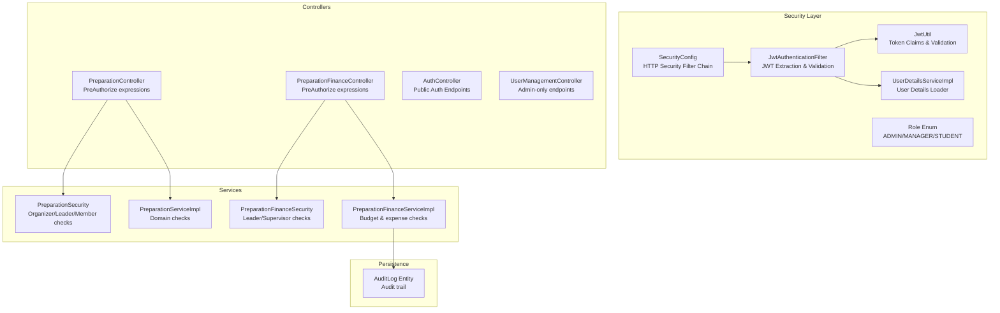
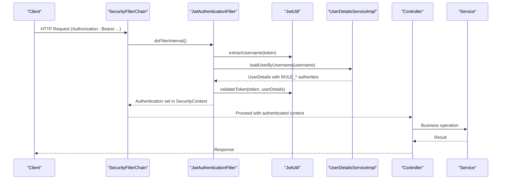
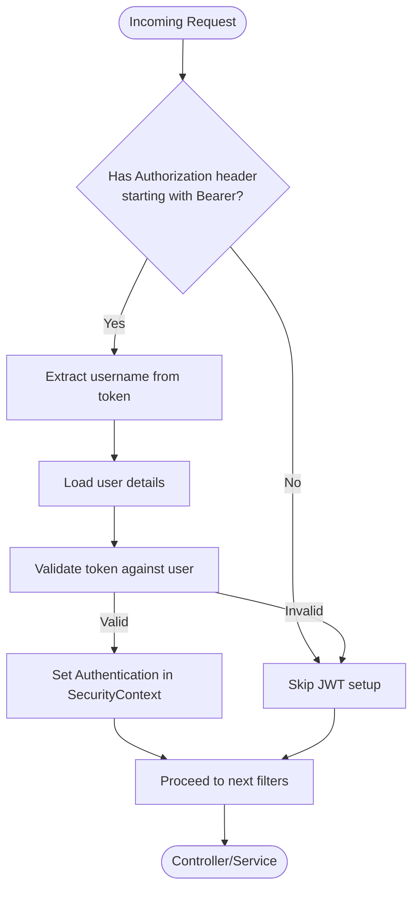
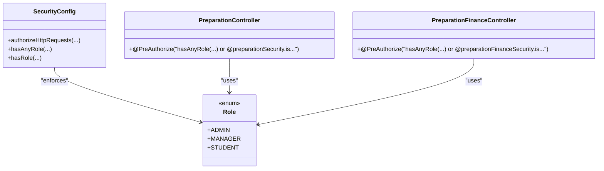
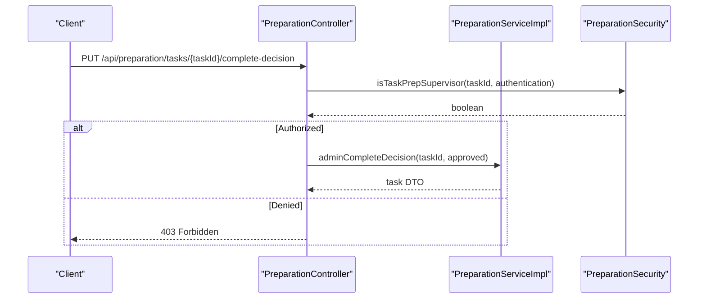
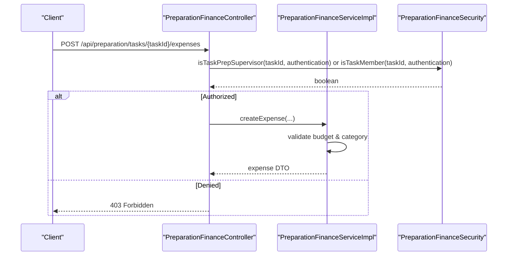
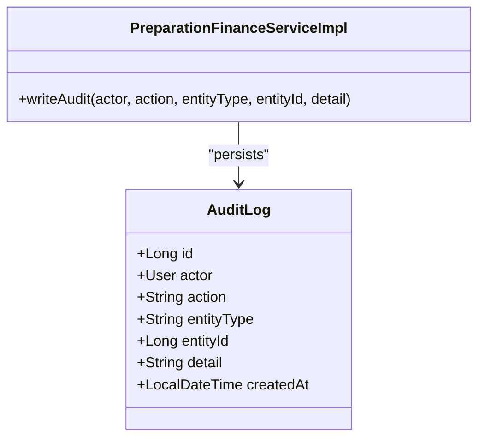
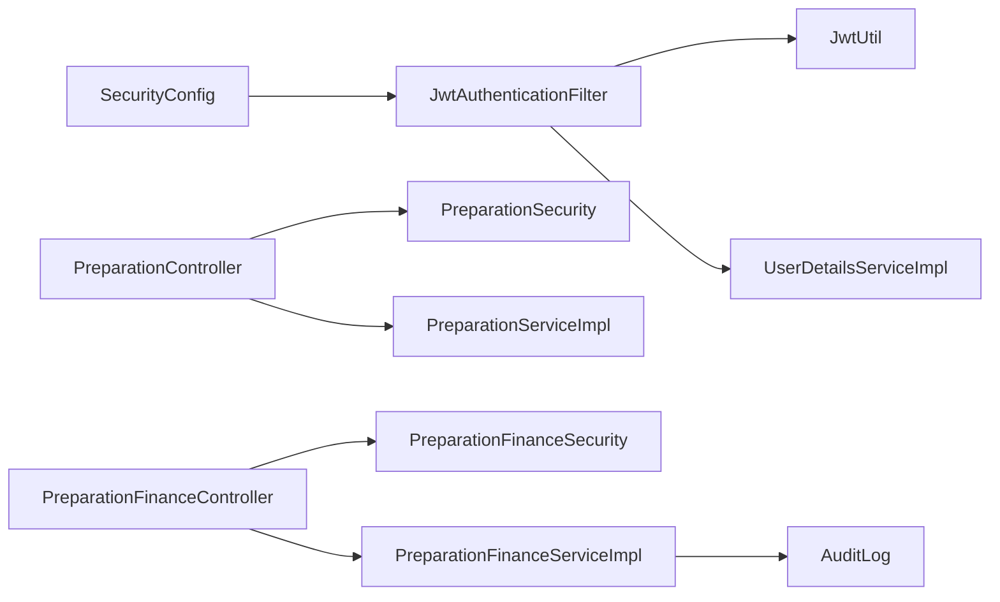

# Security Implementations

<cite>
**Referenced Files in This Document**
- [SecurityConfig.java](file://src/main/java/vn/campuslife/config/SecurityConfig.java)
- [JwtAuthenticationFilter.java](file://src/main/java/vn/campuslife/filter/JwtAuthenticationFilter.java)
- [JwtUtil.java](file://src/main/java/vn/campuslife/util/JwtUtil.java)
- [UserDetailsServiceImpl.java](file://src/main/java/vn/campuslife/service/impl/UserDetailsServiceImpl.java)
- [Role.java](file://src/main/java/vn/campuslife/enumeration/Role.java)
- [PreparationSecurity.java](file://src/main/java/vn/campuslife/service/security/PreparationSecurity.java)
- [PreparationFinanceSecurity.java](file://src/main/java/vn/campuslife/service/security/PreparationFinanceSecurity.java)
- [PreparationController.java](file://src/main/java/vn/campuslife/controller/preparation/PreparationController.java)
- [PreparationFinanceController.java](file://src/main/java/vn/campuslife/controller/preparation/PreparationFinanceController.java)
- [PreparationServiceImpl.java](file://src/main/java/vn/campuslife/service/impl/PreparationServiceImpl.java)
- [PreparationFinanceServiceImpl.java](file://src/main/java/vn/campuslife/service/impl/PreparationFinanceServiceImpl.java)
- [AuthController.java](file://src/main/java/vn/campuslife/controller/auth/AuthController.java)
- [UserManagementController.java](file://src/main/java/vn/campuslife/controller/auth/UserManagementController.java)
- [AuditLog.java](file://src/main/java/vn/campuslife/entity/AuditLog.java)
</cite>

## Table of Contents
1. [Introduction](#introduction)
2. [Project Structure](#project-structure)
3. [Core Components](#core-components)
4. [Architecture Overview](#architecture-overview)
5. [Detailed Component Analysis](#detailed-component-analysis)
6. [Dependency Analysis](#dependency-analysis)
7. [Performance Considerations](#performance-considerations)
8. [Troubleshooting Guide](#troubleshooting-guide)
9. [Conclusion](#conclusion)

## Introduction
This document explains the security implementations across the CampusLife application’s business modules. It covers role-based access control (RBAC) patterns, method-level security annotations, module-specific security contexts for preparation and finance, authentication flows, the security filter chain, permission evaluation, and audit logging. It also includes guidance on complex security scenarios, privilege escalation prevention, secure API consumption patterns, testing strategies, and vulnerability mitigation approaches.

## Project Structure
Security is implemented via Spring Security configuration, JWT-based authentication, method-level pre/post authorizations, and service-layer security checks. Controllers enforce coarse-grained authorization rules, while service-layer components implement fine-grained, domain-specific checks.

**Diagram sources**
- [SecurityConfig.java:58-299](file://src/main/java/vn/campuslife/config/SecurityConfig.java#L58-L299)
- [JwtAuthenticationFilter.java:33-103](file://src/main/java/vn/campuslife/filter/JwtAuthenticationFilter.java#L33-L103)
- [JwtUtil.java:27-83](file://src/main/java/vn/campuslife/util/JwtUtil.java#L27-L83)
- [UserDetailsServiceImpl.java:24-40](file://src/main/java/vn/campuslife/service/impl/UserDetailsServiceImpl.java#L24-L40)
- [Role.java:3-7](file://src/main/java/vn/campuslife/enumeration/Role.java#L3-L7)
- [PreparationController.java:28-212](file://src/main/java/vn/campuslife/controller/preparation/PreparationController.java#L28-L212)
- [PreparationFinanceController.java:26-273](file://src/main/java/vn/campuslife/controller/preparation/PreparationFinanceController.java#L26-L273)
- [PreparationServiceImpl.java:68-143](file://src/main/java/vn/campuslife/service/impl/PreparationServiceImpl.java#L68-L143)
- [PreparationFinanceServiceImpl.java:540-746](file://src/main/java/vn/campuslife/service/impl/PreparationFinanceServiceImpl.java#L540-L746)
- [PreparationSecurity.java:14-86](file://src/main/java/vn/campuslife/service/security/PreparationSecurity.java#L14-L86)
- [PreparationFinanceSecurity.java:21-156](file://src/main/java/vn/campuslife/service/security/PreparationFinanceSecurity.java#L21-L156)
- [AuditLog.java:18-41](file://src/main/java/vn/campuslife/entity/AuditLog.java#L18-L41)

**Section sources**
- [SecurityConfig.java:58-299](file://src/main/java/vn/campuslife/config/SecurityConfig.java#L58-L299)
- [JwtAuthenticationFilter.java:33-103](file://src/main/java/vn/campuslife/filter/JwtAuthenticationFilter.java#L33-L103)
- [JwtUtil.java:27-83](file://src/main/java/vn/campuslife/util/JwtUtil.java#L27-L83)
- [UserDetailsServiceImpl.java:24-40](file://src/main/java/vn/campuslife/service/impl/UserDetailsServiceImpl.java#L24-L40)
- [Role.java:3-7](file://src/main/java/vn/campuslife/enumeration/Role.java#L3-L7)

## Core Components
- Security filter chain: Stateless JWT-based authentication with CORS and CSRF disabled.
- JWT utilities: Token generation, parsing, and validation with role claim propagation.
- Method-level security: PreAuthorize annotations on controllers combined with custom security beans.
- Module-specific security: Preparation and finance services implement domain-aware checks.
- Audit logging: Centralized audit trail for sensitive operations.

**Section sources**
- [SecurityConfig.java:58-299](file://src/main/java/vn/campuslife/config/SecurityConfig.java#L58-L299)
- [JwtUtil.java:56-83](file://src/main/java/vn/campuslife/util/JwtUtil.java#L56-L83)
- [PreparationController.java:28-212](file://src/main/java/vn/campuslife/controller/preparation/PreparationController.java#L28-L212)
- [PreparationFinanceController.java:26-273](file://src/main/java/vn/campuslife/controller/preparation/PreparationFinanceController.java#L26-L273)
- [PreparationSecurity.java:14-86](file://src/main/java/vn/campuslife/service/security/PreparationSecurity.java#L14-L86)
- [PreparationFinanceSecurity.java:21-156](file://src/main/java/vn/campuslife/service/security/PreparationFinanceSecurity.java#L21-L156)
- [AuditLog.java:18-41](file://src/main/java/vn/campuslife/entity/AuditLog.java#L18-L41)

## Architecture Overview
The security architecture enforces:
- Global HTTP security rules for endpoint authorization.
- JWT extraction and validation per request.
- Role propagation from JWT claims to Spring authorities.
- Fine-grained authorization via method-level expressions and custom security beans.
- Domain-specific checks in services for preparation tasks and financial workflows.

**Diagram sources**
- [SecurityConfig.java:58-299](file://src/main/java/vn/campuslife/config/SecurityConfig.java#L58-L299)
- [JwtAuthenticationFilter.java:33-103](file://src/main/java/vn/campuslife/filter/JwtAuthenticationFilter.java#L33-L103)
- [JwtUtil.java:27-83](file://src/main/java/vn/campuslife/util/JwtUtil.java#L27-L83)
- [UserDetailsServiceImpl.java:24-40](file://src/main/java/vn/campuslife/service/impl/UserDetailsServiceImpl.java#L24-L40)

## Detailed Component Analysis

### Security Filter Chain and Authentication Flow
- Stateless session policy with JWT bearer tokens.
- Public endpoints (registration, login, articles) permitted without authentication.
- Admin/manager/student roles enforced per endpoint.
- JWT filter extracts token, loads user details, validates token, and sets authentication in the security context.

**Diagram sources**
- [SecurityConfig.java:58-299](file://src/main/java/vn/campuslife/config/SecurityConfig.java#L58-L299)
- [JwtAuthenticationFilter.java:33-103](file://src/main/java/vn/campuslife/filter/JwtAuthenticationFilter.java#L33-L103)
- [JwtUtil.java:80-83](file://src/main/java/vn/campuslife/util/JwtUtil.java#L80-L83)
- [UserDetailsServiceImpl.java:24-40](file://src/main/java/vn/campuslife/service/impl/UserDetailsServiceImpl.java#L24-L40)

**Section sources**
- [SecurityConfig.java:58-299](file://src/main/java/vn/campuslife/config/SecurityConfig.java#L58-L299)
- [JwtAuthenticationFilter.java:33-103](file://src/main/java/vn/campuslife/filter/JwtAuthenticationFilter.java#L33-L103)
- [JwtUtil.java:27-83](file://src/main/java/vn/campuslife/util/JwtUtil.java#L27-L83)
- [UserDetailsServiceImpl.java:24-40](file://src/main/java/vn/campuslife/service/impl/UserDetailsServiceImpl.java#L24-L40)

### Role-Based Access Control Patterns
- Global rules define public endpoints and role-based access for admin, manager, and student.
- Controllers use @PreAuthorize with hasAnyRole and custom bean expressions for preparation and finance.
- Roles are represented as ADMIN, MANAGER, STUDENT.

**Diagram sources**
- [Role.java:3-7](file://src/main/java/vn/campuslife/enumeration/Role.java#L3-L7)
- [SecurityConfig.java:65-295](file://src/main/java/vn/campuslife/config/SecurityConfig.java#L65-L295)
- [PreparationController.java:28-212](file://src/main/java/vn/campuslife/controller/preparation/PreparationController.java#L28-L212)
- [PreparationFinanceController.java:26-273](file://src/main/java/vn/campuslife/controller/preparation/PreparationFinanceController.java#L26-L273)

**Section sources**
- [SecurityConfig.java:65-295](file://src/main/java/vn/campuslife/config/SecurityConfig.java#L65-L295)
- [Role.java:3-7](file://src/main/java/vn/campuslife/enumeration/Role.java#L3-L7)
- [PreparationController.java:28-212](file://src/main/java/vn/campuslife/controller/preparation/PreparationController.java#L28-L212)
- [PreparationFinanceController.java:26-273](file://src/main/java/vn/campuslife/controller/preparation/PreparationFinanceController.java#L26-L273)

### Module-Specific Security Contexts

#### Preparation Module
- Controllers enforce roles and custom security checks for organizers, task leaders, members, and prep supervisors.
- Services implement domain rules (e.g., workload warnings, task ownership, member promotions/demotions).

**Diagram sources**
- [PreparationController.java:149-157](file://src/main/java/vn/campuslife/controller/preparation/PreparationController.java#L149-L157)
- [PreparationServiceImpl.java:355-365](file://src/main/java/vn/campuslife/service/impl/PreparationServiceImpl.java#L355-L365)
- [PreparationSecurity.java:63-74](file://src/main/java/vn/campuslife/service/security/PreparationSecurity.java#L63-L74)

**Section sources**
- [PreparationController.java:28-212](file://src/main/java/vn/campuslife/controller/preparation/PreparationController.java#L28-L212)
- [PreparationServiceImpl.java:68-143](file://src/main/java/vn/campuslife/service/impl/PreparationServiceImpl.java#L68-L143)
- [PreparationSecurity.java:14-86](file://src/main/java/vn/campuslife/service/security/PreparationSecurity.java#L14-L86)

#### Finance Module
- Controllers enforce leader/member/supervisor permissions for fund advances, expenses, and allocation adjustments.
- Services implement budget validation, fund advance lifecycle, and audit logging.

**Diagram sources**
- [PreparationFinanceController.java:210-221](file://src/main/java/vn/campuslife/controller/preparation/PreparationFinanceController.java#L210-L221)
- [PreparationFinanceServiceImpl.java:540-591](file://src/main/java/vn/campuslife/service/impl/PreparationFinanceServiceImpl.java#L540-L591)
- [PreparationFinanceSecurity.java:30-68](file://src/main/java/vn/campuslife/service/security/PreparationFinanceSecurity.java#L30-L68)

**Section sources**
- [PreparationFinanceController.java:26-273](file://src/main/java/vn/campuslife/controller/preparation/PreparationFinanceController.java#L26-L273)
- [PreparationFinanceServiceImpl.java:540-746](file://src/main/java/vn/campuslife/service/impl/PreparationFinanceServiceImpl.java#L540-L746)
- [PreparationFinanceSecurity.java:21-156](file://src/main/java/vn/campuslife/service/security/PreparationFinanceSecurity.java#L21-L156)

### Permission Evaluation and Method-Level Security
- @PreAuthorize expressions combine global roles with custom security beans.
- Examples:
  - hasAnyRole('ADMIN','MANAGER') or @preparationSecurity.isActivityPrepSupervisor(...)
  - @preparationFinanceSecurity.isTaskPrepSupervisor(...) or @preparationFinanceSecurity.isTaskMember(...)

**Section sources**
- [PreparationController.java:28-212](file://src/main/java/vn/campuslife/controller/preparation/PreparationController.java#L28-L212)
- [PreparationFinanceController.java:26-273](file://src/main/java/vn/campuslife/controller/preparation/PreparationFinanceController.java#L26-L273)
- [PreparationSecurity.java:14-86](file://src/main/java/vn/campuslife/service/security/PreparationSecurity.java#L14-L86)
- [PreparationFinanceSecurity.java:21-156](file://src/main/java/vn/campuslife/service/security/PreparationFinanceSecurity.java#L21-L156)

### Audit Logging Mechanisms
- Services write audit logs for sensitive operations (budget upsert, task allocation, fund advance decisions, expense approvals).
- AuditLog entity captures actor, action, entity type, entity id, and detail payload.

**Diagram sources**
- [AuditLog.java:18-41](file://src/main/java/vn/campuslife/entity/AuditLog.java#L18-L41)
- [PreparationFinanceServiceImpl.java:66-151](file://src/main/java/vn/campuslife/service/impl/PreparationFinanceServiceImpl.java#L66-L151)

**Section sources**
- [AuditLog.java:18-41](file://src/main/java/vn/campuslife/entity/AuditLog.java#L18-L41)
- [PreparationFinanceServiceImpl.java:66-151](file://src/main/java/vn/campuslife/service/impl/PreparationFinanceServiceImpl.java#L66-L151)

### Authentication and Authorization Controllers
- AuthController exposes public endpoints for registration, login, verification, forgot/reset password, and change password (requires authentication).
- UserManagementController restricts user administration to ADMIN and MANAGER roles.

**Section sources**
- [AuthController.java:24-94](file://src/main/java/vn/campuslife/controller/auth/AuthController.java#L24-L94)
- [UserManagementController.java:20-115](file://src/main/java/vn/campuslife/controller/auth/UserManagementController.java#L20-L115)
- [SecurityConfig.java:69-94](file://src/main/java/vn/campuslife/config/SecurityConfig.java#L69-L94)

## Dependency Analysis
- Controllers depend on method-level security expressions and custom security beans.
- Services encapsulate domain logic and enforce business rules, reducing duplication across controllers.
- SecurityConfig centralizes HTTP-level authorization rules.

**Diagram sources**
- [SecurityConfig.java:58-299](file://src/main/java/vn/campuslife/config/SecurityConfig.java#L58-L299)
- [JwtAuthenticationFilter.java:28-31](file://src/main/java/vn/campuslife/filter/JwtAuthenticationFilter.java#L28-L31)
- [JwtUtil.java:27-83](file://src/main/java/vn/campuslife/util/JwtUtil.java#L27-L83)
- [UserDetailsServiceImpl.java:24-40](file://src/main/java/vn/campuslife/service/impl/UserDetailsServiceImpl.java#L24-L40)
- [PreparationController.java:28-212](file://src/main/java/vn/campuslife/controller/preparation/PreparationController.java#L28-L212)
- [PreparationFinanceController.java:26-273](file://src/main/java/vn/campuslife/controller/preparation/PreparationFinanceController.java#L26-L273)
- [PreparationSecurity.java:14-86](file://src/main/java/vn/campuslife/service/security/PreparationSecurity.java#L14-L86)
- [PreparationFinanceSecurity.java:21-156](file://src/main/java/vn/campuslife/service/security/PreparationFinanceSecurity.java#L21-L156)
- [PreparationServiceImpl.java:68-143](file://src/main/java/vn/campuslife/service/impl/PreparationServiceImpl.java#L68-L143)
- [PreparationFinanceServiceImpl.java:540-746](file://src/main/java/vn/campuslife/service/impl/PreparationFinanceServiceImpl.java#L540-L746)
- [AuditLog.java:18-41](file://src/main/java/vn/campuslife/entity/AuditLog.java#L18-L41)

**Section sources**
- [SecurityConfig.java:58-299](file://src/main/java/vn/campuslife/config/SecurityConfig.java#L58-L299)
- [PreparationController.java:28-212](file://src/main/java/vn/campuslife/controller/preparation/PreparationController.java#L28-L212)
- [PreparationFinanceController.java:26-273](file://src/main/java/vn/campuslife/controller/preparation/PreparationFinanceController.java#L26-L273)
- [PreparationServiceImpl.java:68-143](file://src/main/java/vn/campuslife/service/impl/PreparationServiceImpl.java#L68-L143)
- [PreparationFinanceServiceImpl.java:540-746](file://src/main/java/vn/campuslife/service/impl/PreparationFinanceServiceImpl.java#L540-L746)

## Performance Considerations
- Stateless JWT eliminates server-side session storage overhead.
- Prefer lazy injection for filters and providers to reduce startup-time circular dependencies.
- Keep @PreAuthorize expressions minimal and delegate heavy checks to service-layer helpers to avoid repeated database queries in controllers.
- Use pagination and selective field retrieval for audit logs and financial reports.

## Troubleshooting Guide
Common issues and resolutions:
- Token validation failures: Verify token signing key and expiration; ensure client sends Authorization: Bearer header.
- Username not found during JWT validation: Confirm user exists and activated in the database.
- 403 Forbidden on preparation endpoints: Check custom security bean conditions (organizer, leader, member, supervisor).
- Budget exceeded errors: Review allocation limits and category availability before submitting requests.
- Audit log not written: Ensure writeAudit is invoked after state changes in service methods.

**Section sources**
- [JwtAuthenticationFilter.java:67-94](file://src/main/java/vn/campuslife/filter/JwtAuthenticationFilter.java#L67-L94)
- [JwtUtil.java:80-83](file://src/main/java/vn/campuslife/util/JwtUtil.java#L80-L83)
- [PreparationController.java:28-212](file://src/main/java/vn/campuslife/controller/preparation/PreparationController.java#L28-L212)
- [PreparationFinanceServiceImpl.java:540-746](file://src/main/java/vn/campuslife/service/impl/PreparationFinanceServiceImpl.java#L540-L746)

## Conclusion
The application employs a layered security model: HTTP-level authorization, JWT-based authentication, method-level pre/post authorizations, and domain-specific service checks. This combination ensures robust RBAC, prevents privilege escalation, and maintains auditability across preparation and finance workflows. Adhering to the documented patterns and best practices will help sustain and extend security across future features.