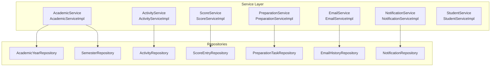
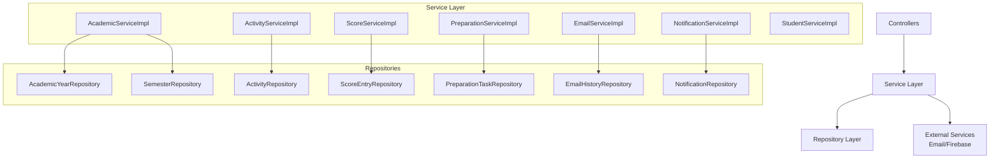
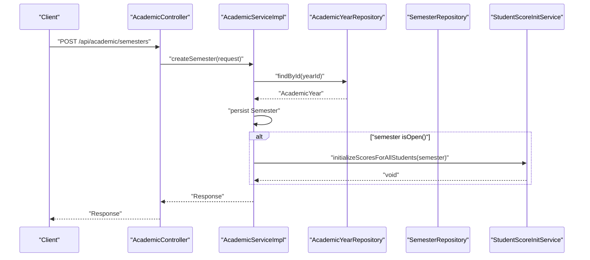
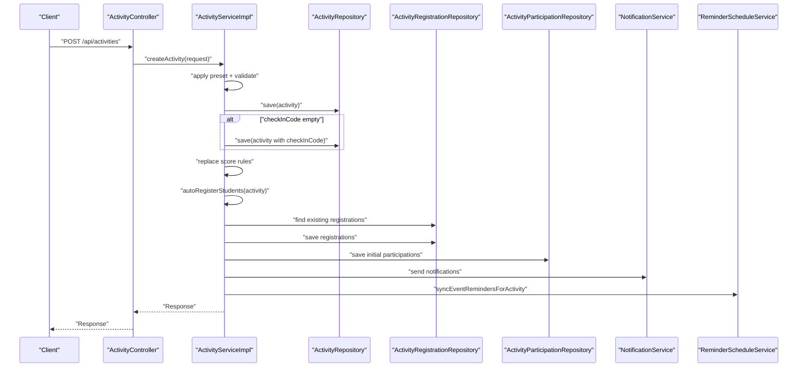
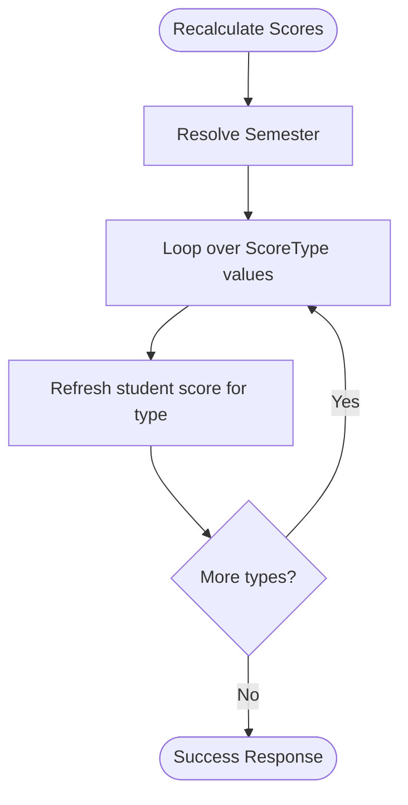
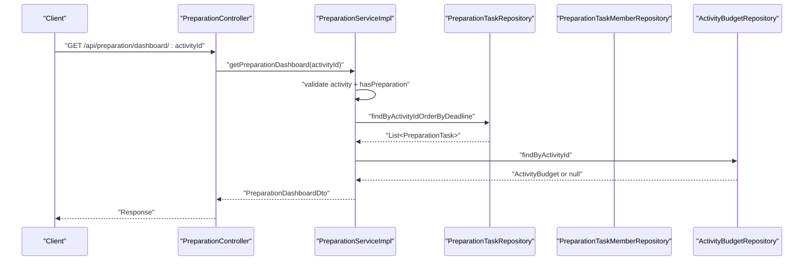
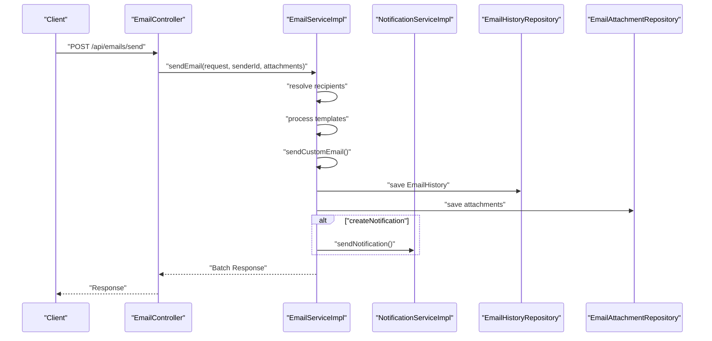

# Service Layer Architecture

<cite>
**Referenced Files in This Document**
- [AcademicService.java](file://src/main/java/vn/campuslife/service/AcademicService.java)
- [AcademicServiceImpl.java](file://src/main/java/vn/campuslife/service/impl/AcademicServiceImpl.java)
- [ActivityService.java](file://src/main/java/vn/campuslife/service/ActivityService.java)
- [ActivityServiceImpl.java](file://src/main/java/vn/campuslife/service/impl/ActivityServiceImpl.java)
- [ScoreService.java](file://src/main/java/vn/campuslife/service/ScoreService.java)
- [ScoreServiceImpl.java](file://src/main/java/vn/campuslife/service/impl/ScoreServiceImpl.java)
- [PreparationService.java](file://src/main/java/vn/campuslife/service/PreparationService.java)
- [PreparationServiceImpl.java](file://src/main/java/vn/campuslife/service/impl/PreparationServiceImpl.java)
- [EmailService.java](file://src/main/java/vn/campuslife/service/EmailService.java)
- [EmailServiceImpl.java](file://src/main/java/vn/campuslife/service/impl/EmailServiceImpl.java)
- [NotificationService.java](file://src/main/java/vn/campuslife/service/NotificationService.java)
- [NotificationServiceImpl.java](file://src/main/java/vn/campuslife/service/impl/NotificationServiceImpl.java)
- [StudentService.java](file://src/main/java/vn/campuslife/service/StudentService.java)
- [StudentServiceImpl.java](file://src/main/java/vn/campuslife/service/impl/StudentServiceImpl.java)
- [CampusLifeApplication.java](file://src/main/java/vn/campuslife/CampusLifeApplication.java)
</cite>

## Table of Contents
1. [Introduction](#introduction)
2. [Project Structure](#project-structure)
3. [Core Components](#core-components)
4. [Architecture Overview](#architecture-overview)
5. [Detailed Component Analysis](#detailed-component-analysis)
6. [Dependency Analysis](#dependency-analysis)
7. [Performance Considerations](#performance-considerations)
8. [Troubleshooting Guide](#troubleshooting-guide)
9. [Conclusion](#conclusion)

## Introduction
This document explains the service layer architecture of the CampusLife system. It focuses on the layered service pattern, transaction management boundaries, and business logic encapsulation. It documents service composition patterns, dependency injection strategies, and error handling mechanisms. It also details core business services including academic management, activity processing, scoring calculations, financial preparation, and communication systems. Examples of complex business workflows, transaction boundaries, and performance optimization techniques are included, along with service-to-service communication patterns and integration strategies.

## Project Structure
The service layer follows a clean separation of concerns:
- Interfaces define contracts for business capabilities.
- Implementation classes encapsulate business logic and orchestrate repositories and cross-cutting services.
- Services are Spring-managed beans with constructor-based dependency injection.
- Transaction boundaries are declared via annotations on service methods.

**Diagram sources**
- [AcademicServiceImpl.java:23-36](file://src/main/java/vn/campuslife/service/impl/AcademicServiceImpl.java#L23-L36)
- [ActivityServiceImpl.java:68-80](file://src/main/java/vn/campuslife/service/impl/ActivityServiceImpl.java#L68-L80)
- [ScoreServiceImpl.java:60-70](file://src/main/java/vn/campuslife/service/impl/ScoreServiceImpl.java#L60-L70)
- [PreparationServiceImpl.java:32-42](file://src/main/java/vn/campuslife/service/impl/PreparationServiceImpl.java#L32-L42)
- [EmailServiceImpl.java:42-53](file://src/main/java/vn/campuslife/service/impl/EmailServiceImpl.java#L42-L53)
- [NotificationServiceImpl.java:33-39](file://src/main/java/vn/campuslife/service/impl/NotificationServiceImpl.java#L33-L39)

**Section sources**
- [AcademicService.java:7-36](file://src/main/java/vn/campuslife/service/AcademicService.java#L7-L36)
- [ActivityService.java:15-71](file://src/main/java/vn/campuslife/service/ActivityService.java#L15-L71)
- [ScoreService.java:9-62](file://src/main/java/vn/campuslife/service/ScoreService.java#L9-L62)
- [PreparationService.java:9-53](file://src/main/java/vn/campuslife/service/PreparationService.java#L9-L53)
- [EmailService.java](file://src/main/java/vn/campuslife/service/EmailService.java)
- [NotificationService.java](file://src/main/java/vn/campuslife/service/NotificationService.java)
- [StudentService.java](file://src/main/java/vn/campuslife/service/StudentService.java)

## Core Components
- AcademicService: Manages academic years and semesters, including initialization of student scores upon semester creation or manual triggers.
- ActivityService: Orchestrates activity lifecycle, registration, presets, reminders, and auto-registration of students based on flags.
- ScoreService: Calculates and aggregates student scores, generates rankings, and maintains score history with pagination and N+1 prevention.
- PreparationService: Handles preparation tasks, budgets, workload warnings, and supervisor roles for activity organizers.
- EmailService: Sends templated emails to recipients, manages attachments, and optionally creates in-app notifications.
- NotificationService: Persists notifications, supports bulk and asynchronous dispatch, and integrates with device tokens and FCM.
- StudentService: Provides student lookup, pagination, and filtering by department/class.

Key characteristics:
- Transaction boundaries: Methods annotated with @Transactional define atomic units of work.
- DI: Constructor injection is used across implementations for immutability and testability.
- Error handling: Centralized via Response wrappers and exception handling in controllers; services log and propagate meaningful messages.

**Section sources**
- [AcademicServiceImpl.java:52-129](file://src/main/java/vn/campuslife/service/impl/AcademicServiceImpl.java#L52-L129)
- [ActivityServiceImpl.java:83-132](file://src/main/java/vn/campuslife/service/impl/ActivityServiceImpl.java#L83-L132)
- [ScoreServiceImpl.java:73-113](file://src/main/java/vn/campuslife/service/impl/ScoreServiceImpl.java#L73-L113)
- [PreparationServiceImpl.java:45-50](file://src/main/java/vn/campuslife/service/impl/PreparationServiceImpl.java#L45-L50)
- [EmailServiceImpl.java:62-240](file://src/main/java/vn/campuslife/service/impl/EmailServiceImpl.java#L62-L240)
- [NotificationServiceImpl.java:42-92](file://src/main/java/vn/campuslife/service/impl/NotificationServiceImpl.java#L42-L92)
- [StudentServiceImpl.java:26-58](file://src/main/java/vn/campuslife/service/impl/StudentServiceImpl.java#L26-L58)

## Architecture Overview
The service layer adheres to a layered pattern:
- Controllers expose REST endpoints and delegate to services.
- Services encapsulate business rules and coordinate repositories and external integrations.
- Repositories abstract persistence operations.
- Cross-cutting services (e.g., NotificationService, FCM) are injected where needed.

**Diagram sources**
- [AcademicServiceImpl.java:23-36](file://src/main/java/vn/campuslife/service/impl/AcademicServiceImpl.java#L23-L36)
- [ActivityServiceImpl.java:68-80](file://src/main/java/vn/campuslife/service/impl/ActivityServiceImpl.java#L68-L80)
- [ScoreServiceImpl.java:60-70](file://src/main/java/vn/campuslife/service/impl/ScoreServiceImpl.java#L60-L70)
- [PreparationServiceImpl.java:32-42](file://src/main/java/vn/campuslife/service/impl/PreparationServiceImpl.java#L32-L42)
- [EmailServiceImpl.java:42-53](file://src/main/java/vn/campuslife/service/impl/EmailServiceImpl.java#L42-L53)
- [NotificationServiceImpl.java:33-39](file://src/main/java/vn/campuslife/service/impl/NotificationServiceImpl.java#L33-L39)

## Detailed Component Analysis

### Academic Management Service
- Responsibilities:
  - CRUD for academic years and semesters.
  - Toggle semester open/close state.
  - Initialize student scores automatically when a semester opens or manually triggered.
- Transaction boundaries:
  - Year/semester create/update/delete are transactional.
  - Initialization wraps repository updates in a transaction.
- Business logic:
  - Validation of year/semester existence.
  - Auto-initialization of scores for all students when a semester is opened.

**Diagram sources**
- [AcademicServiceImpl.java:101-129](file://src/main/java/vn/campuslife/service/impl/AcademicServiceImpl.java#L101-L129)

**Section sources**
- [AcademicService.java:7-36](file://src/main/java/vn/campuslife/service/AcademicService.java#L7-L36)
- [AcademicServiceImpl.java:52-192](file://src/main/java/vn/campuslife/service/impl/AcademicServiceImpl.java#L52-L192)

### Activity Processing Service
- Responsibilities:
  - Create/update/publish/unpublish/copy activities.
  - Apply score presets and persist score rules.
  - Auto-register students based on flags (important, mandatory for faculty).
  - Sync reminders and generate check-in codes.
- Transaction boundaries:
  - Creation, update, publish/unpublish, deletion are transactional.
- Business logic:
  - Draft vs published visibility rules.
  - Batch registration with deduplication and participation creation.
  - Notification dispatch per auto-registration.

**Diagram sources**
- [ActivityServiceImpl.java:83-132](file://src/main/java/vn/campuslife/service/impl/ActivityServiceImpl.java#L83-L132)
- [ActivityServiceImpl.java:604-750](file://src/main/java/vn/campuslife/service/impl/ActivityServiceImpl.java#L604-L750)

**Section sources**
- [ActivityService.java:15-71](file://src/main/java/vn/campuslife/service/ActivityService.java#L15-L71)
- [ActivityServiceImpl.java:83-374](file://src/main/java/vn/campuslife/service/impl/ActivityServiceImpl.java#L83-L374)

### Scoring Calculation Service
- Responsibilities:
  - View per-type and total scores.
  - Generate student rankings by score type or aggregated.
  - Recalculate scores for a single student or all students.
  - Maintain score history with running totals and pagination.
- Transaction boundaries:
  - Recalculation and read-only ranking queries are transactional where appropriate.
- Performance optimizations:
  - Pagination for score history.
  - Batch loading of related series and progress to avoid N+1 queries.
  - Aggregated sums computed with cutoff logic for running totals.

**Diagram sources**
- [ScoreServiceImpl.java:322-356](file://src/main/java/vn/campuslife/service/impl/ScoreServiceImpl.java#L322-L356)

**Section sources**
- [ScoreService.java:9-62](file://src/main/java/vn/campuslife/service/ScoreService.java#L9-L62)
- [ScoreServiceImpl.java:73-432](file://src/main/java/vn/campuslife/service/impl/ScoreServiceImpl.java#L73-L432)

### Financial Preparation Service
- Responsibilities:
  - Enable/disable preparation per activity.
  - Manage preparation tasks, members, deadlines, and completion proofs.
  - Budget dashboard and category allocation computations.
  - Workload warnings and organizer management.
- Transaction boundaries:
  - Task assignment, status updates, and member promotions/demotions are transactional.
- Business logic:
  - Leader role enforcement for financial tasks.
  - JSON serialization/deserialization for completion proofs.
  - Budget computation aggregations per category.

**Diagram sources**
- [PreparationServiceImpl.java:145-161](file://src/main/java/vn/campuslife/service/impl/PreparationServiceImpl.java#L145-L161)

**Section sources**
- [PreparationService.java:9-53](file://src/main/java/vn/campuslife/service/PreparationService.java#L9-L53)
- [PreparationServiceImpl.java:45-599](file://src/main/java/vn/campuslife/service/impl/PreparationServiceImpl.java#L45-L599)

### Communication Systems
- EmailService:
  - Templated email sending with recipient filters (by activity, series, class, department, bulk).
  - Attachment handling and resending.
  - Optional in-app notification creation with metadata routing.
- NotificationService:
  - Persists notifications and dispatches to device tokens via FCM.
  - Supports bulk and asynchronous dispatch with executor configuration.

**Diagram sources**
- [EmailServiceImpl.java:62-240](file://src/main/java/vn/campuslife/service/impl/EmailServiceImpl.java#L62-L240)
- [NotificationServiceImpl.java:42-92](file://src/main/java/vn/campuslife/service/impl/NotificationServiceImpl.java#L42-L92)

**Section sources**
- [EmailService.java](file://src/main/java/vn/campuslife/service/EmailService.java)
- [EmailServiceImpl.java:62-403](file://src/main/java/vn/campuslife/service/impl/EmailServiceImpl.java#L62-L403)
- [NotificationService.java](file://src/main/java/vn/campuslife/service/NotificationService.java)
- [NotificationServiceImpl.java:42-354](file://src/main/java/vn/campuslife/service/impl/NotificationServiceImpl.java#L42-L354)

### Student Service
- Responsibilities:
  - Lookup student IDs by username/user ID.
  - Paginated retrieval and search by name/code.
  - Filtering by department and students without class.

**Section sources**
- [StudentService.java](file://src/main/java/vn/campuslife/service/StudentService.java)
- [StudentServiceImpl.java:26-153](file://src/main/java/vn/campuslife/service/impl/StudentServiceImpl.java#L26-L153)

## Dependency Analysis
- Cohesion:
  - Each service encapsulates a cohesive domain area (academics, activities, scoring, preparation, communications).
- Coupling:
  - Services depend on repositories and other service interfaces where necessary.
  - Cross-cutting services (NotificationService) are injected where needed.
- Transaction boundaries:
  - Services declare transactions around write operations and critical sequences.
- External dependencies:
  - EmailService integrates with templating utilities and file storage.
  - NotificationService integrates with device token repository and FCM.

```mermaid
classDiagram
class AcademicServiceImpl {
+getYears()
+createYear(request)
+toggleSemesterOpen(id, open)
+initializeScoresForSemester(semesterId)
}
class ActivityServiceImpl {
+createActivity(request)
+publishActivity(id)
+copyActivity(id, offsetDays)
+autoRegisterStudents(activity)
}
class ScoreServiceImpl {
+calculateTrainingScore(...)
+getStudentRanking(...)
+recalculateStudentScore(...)
+getScoreHistory(...)
}
class PreparationServiceImpl {
+togglePreparation(activityId, enabled)
+assignTask(request)
+acceptTask(taskId, username)
+adminCompleteDecision(taskId, approved)
}
class EmailServiceImpl {
+sendEmail(request, senderId, attachments)
+getEmailHistory(senderId, pageable)
+resendEmail(emailId)
}
class NotificationServiceImpl {
+sendNotification(userId, title, content, type, actionUrl, metadata)
+sendBulkNotification(userIds, title, content, type, actionUrl, metadata)
+sendBulkNotificationAsync(...)
}
class StudentServiceImpl {
+getAllStudents(pageable)
+searchStudents(keyword, pageable)
+getStudentsByDepartment(departmentId, pageable)
}
AcademicServiceImpl ..> AcademicYearRepository
AcademicServiceImpl ..> SemesterRepository
ActivityServiceImpl ..> ActivityRepository
ActivityServiceImpl ..> ActivityRegistrationRepository
ActivityServiceImpl ..> ActivityParticipationRepository
ActivityServiceImpl ..> NotificationService
ActivityServiceImpl ..> ReminderScheduleService
ScoreServiceImpl ..> StudentRepository
ScoreServiceImpl ..> ScoreEntryRepository
ScoreServiceImpl ..> ActivityParticipationRepository
PreparationServiceImpl ..> PreparationTaskRepository
PreparationServiceImpl ..> PreparationTaskMemberRepository
PreparationServiceImpl ..> ActivityBudgetRepository
EmailServiceImpl ..> EmailHistoryRepository
EmailServiceImpl ..> NotificationService
NotificationServiceImpl ..> NotificationRepository
NotificationServiceImpl ..> DeviceTokenRepository
StudentServiceImpl ..> StudentRepository
```

**Diagram sources**
- [AcademicServiceImpl.java:25-36](file://src/main/java/vn/campuslife/service/impl/AcademicServiceImpl.java#L25-L36)
- [ActivityServiceImpl.java:68-80](file://src/main/java/vn/campuslife/service/impl/ActivityServiceImpl.java#L68-L80)
- [ScoreServiceImpl.java:60-70](file://src/main/java/vn/campuslife/service/impl/ScoreServiceImpl.java#L60-L70)
- [PreparationServiceImpl.java:32-42](file://src/main/java/vn/campuslife/service/impl/PreparationServiceImpl.java#L32-L42)
- [EmailServiceImpl.java:42-53](file://src/main/java/vn/campuslife/service/impl/EmailServiceImpl.java#L42-L53)
- [NotificationServiceImpl.java:33-39](file://src/main/java/vn/campuslife/service/impl/NotificationServiceImpl.java#L33-L39)
- [StudentServiceImpl.java](file://src/main/java/vn/campuslife/service/impl/StudentServiceImpl.java#L24)

**Section sources**
- [AcademicServiceImpl.java:23-36](file://src/main/java/vn/campuslife/service/impl/AcademicServiceImpl.java#L23-L36)
- [ActivityServiceImpl.java:68-80](file://src/main/java/vn/campuslife/service/impl/ActivityServiceImpl.java#L68-L80)
- [ScoreServiceImpl.java:60-70](file://src/main/java/vn/campuslife/service/impl/ScoreServiceImpl.java#L60-L70)
- [PreparationServiceImpl.java:32-42](file://src/main/java/vn/campuslife/service/impl/PreparationServiceImpl.java#L32-L42)
- [EmailServiceImpl.java:42-53](file://src/main/java/vn/campuslife/service/impl/EmailServiceImpl.java#L42-L53)
- [NotificationServiceImpl.java:33-39](file://src/main/java/vn/campuslife/service/impl/NotificationServiceImpl.java#L33-L39)
- [StudentServiceImpl.java](file://src/main/java/vn/campuslife/service/impl/StudentServiceImpl.java#L24)

## Performance Considerations
- Transaction boundaries:
  - Keep transactions short; move non-critical steps outside transactions (e.g., notification sending after persistence).
- N+1 query prevention:
  - Batch load related entities (e.g., series and progress) before building responses.
- Pagination:
  - Use Pageable for score history and student listings to avoid large result sets.
- Asynchronous operations:
  - Use @Async for bulk notifications to improve throughput without blocking the main thread.
- Idempotency and retries:
  - Email resend and notification delivery should handle transient failures gracefully.

[No sources needed since this section provides general guidance]

## Troubleshooting Guide
- Common exceptions and handling:
  - Resource not found: Thrown when entities are missing (e.g., activity, student, task). Services return descriptive Response objects.
  - Forbidden/Access denied: Permission checks for organizers and task members.
  - Bad request: Validation failures for required fields or invalid states.
  - Partial success: Email batches may partially succeed; overall status reflects partial success.
- Logging:
  - Services log warnings and errors during auto-registration, score initialization, and external integrations.
- Recovery strategies:
  - Retry failed notifications and re-send failed emails.
  - Manual score initialization for semesters when auto-initialization fails.

**Section sources**
- [ActivityServiceImpl.java:604-750](file://src/main/java/vn/campuslife/service/impl/ActivityServiceImpl.java#L604-L750)
- [AcademicServiceImpl.java:115-126](file://src/main/java/vn/campuslife/service/impl/AcademicServiceImpl.java#L115-L126)
- [EmailServiceImpl.java:187-208](file://src/main/java/vn/campuslife/service/impl/EmailServiceImpl.java#L187-L208)
- [PreparationServiceImpl.java:247-254](file://src/main/java/vn/campuslife/service/impl/PreparationServiceImpl.java#L247-L254)

## Conclusion
The CampusLife service layer is organized around clear domain services with explicit transaction boundaries and robust dependency injection. Business logic is encapsulated within services, which coordinate repositories and integrate with communication channels. Performance is addressed through pagination, batch operations, and asynchronous processing. Error handling is centralized via Response wrappers and logging, enabling reliable operation across academic management, activity processing, scoring, preparation, and communication domains.