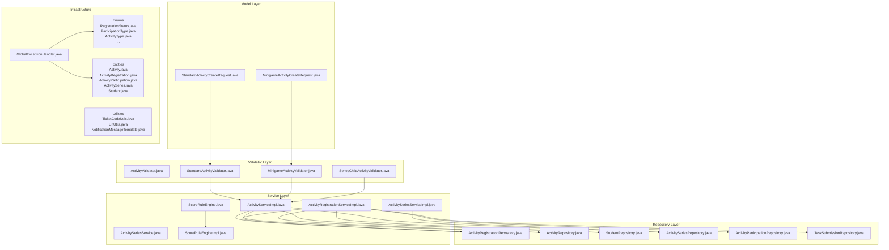
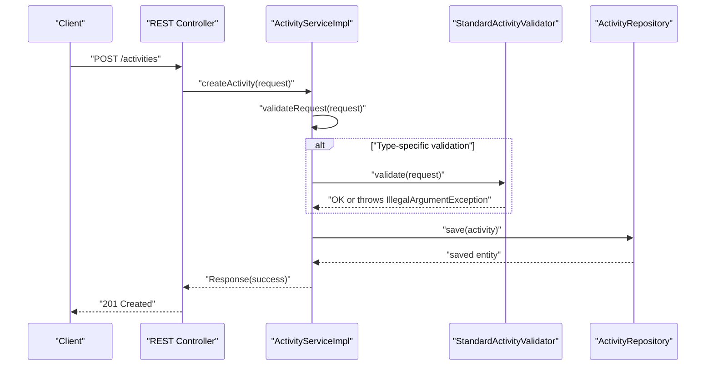
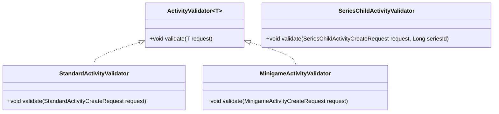
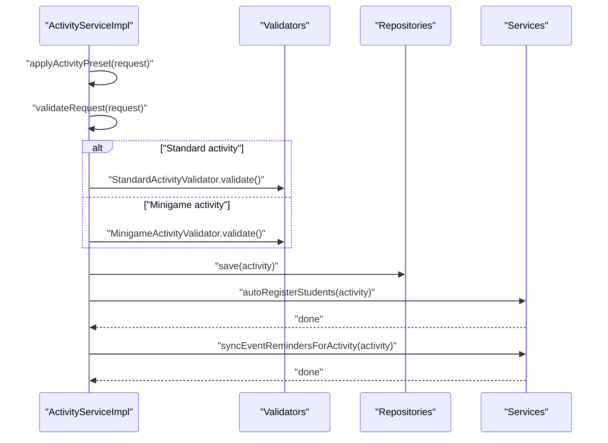
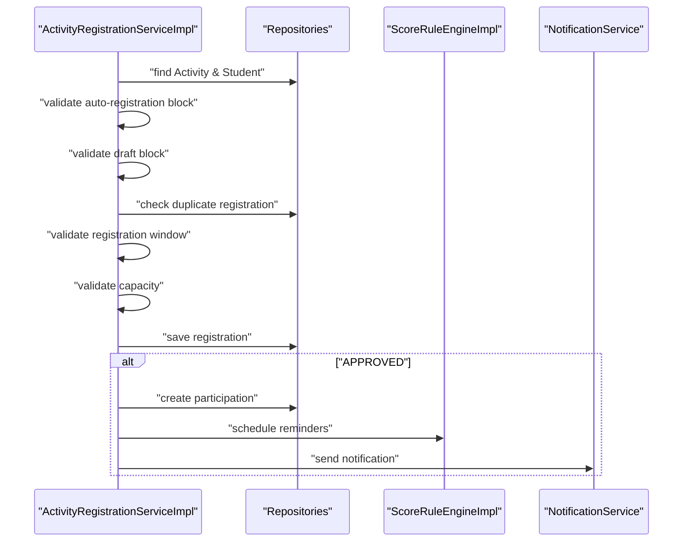
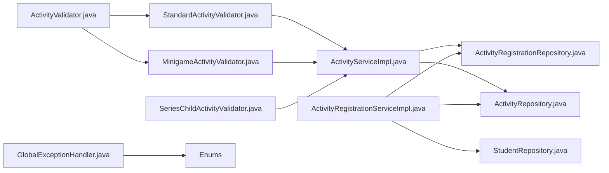

# Validation Framework

<cite>
**Referenced Files in This Document**
- [ActivityValidator.java](file://src/main/java/vn/campuslife/service/validator/ActivityValidator.java)
- [StandardActivityValidator.java](file://src/main/java/vn/campuslife/service/validator/StandardActivityValidator.java)
- [MinigameActivityValidator.java](file://src/main/java/vn/campuslife/service/validator/MinigameActivityValidator.java)
- [SeriesChildActivityValidator.java](file://src/main/java/vn/campuslife/service/validator/SeriesChildActivityValidator.java)
- [ActivityServiceImpl.java](file://src/main/java/vn/campuslife/service/impl/ActivityServiceImpl.java)
- [ActivityRegistrationServiceImpl.java](file://src/main/java/vn/campuslife/service/impl/ActivityRegistrationServiceImpl.java)
- [GlobalExceptionHandler.java](file://src/main/java/vn/campuslife/exception/GlobalExceptionHandler.java)
- [StandardActivityCreateRequest.java](file://src/main/java/vn/campuslife/model/activity/StandardActivityCreateRequest.java)
- [MinigameActivityCreateRequest.java](file://src/main/java/vn/campuslife/model/activity/minigame/MinigameActivityCreateRequest.java)
- [ActivityScoreRuleServiceImpl.java](file://src/main/java/vn/campuslife/service/impl/ActivityScoreRuleServiceImpl.java)
- [ActivityRegistrationRepository.java](file://src/main/java/vn/campuslife/repository/ActivityRegistrationRepository.java)
- [ActivityRepository.java](file://src/main/java/vn/campuslife/repository/ActivityRepository.java)
- [StudentRepository.java](file://src/main/java/vn/campuslife/repository/StudentRepository.java)
- [ActivitySeriesRepository.java](file://src/main/java/vn/campuslife/repository/ActivitySeriesRepository.java)
- [ActivitySeriesServiceImpl.java](file://src/main/java/vn/campuslife/service/impl/ActivitySeriesServiceImpl.java)
- [ActivityParticipationRepository.java](file://src/main/java/vn/campuslife/repository/ActivityParticipationRepository.java)
- [TaskSubmissionRepository.java](file://src/main/java/vn/campuslife/repository/TaskSubmissionRepository.java)
- [RegistrationStatus.java](file://src/main/java/vn/campuslife/enumeration/RegistrationStatus.java)
- [ParticipationType.java](file://src/main/java/vn/campuslife/enumeration/ParticipationType.java)
- [ActivityType.java](file://src/main/java/vn/campuslife/enumeration/ActivityType.java)
- [ScoreRuleTrigger.java](file://src/main/java/vn/campuslife/enumeration/ScoreRuleTrigger.java)
- [ScoreSemesterPolicy.java](file://src/main/java/vn/campuslife/enumeration/ScoreSemesterPolicy.java)
- [ScoreRuleAudience.java](file://src/main/java/vn/campuslife/enumeration/ScoreRuleAudience.java)
- [SubmissionStatus.java](file://src/main/java/vn/campuslife/enumeration/SubmissionStatus.java)
- [ActivitySeries.java](file://src/main/java/vn/campuslife/entity/ActivitySeries.java)
- [ActivityRegistration.java](file://src/main/java/vn/campuslife/entity/ActivityRegistration.java)
- [ActivityParticipation.java](file://src/main/java/vn/campuslife/entity/ActivityParticipation.java)
- [Activity.java](file://src/main/java/vn/campuslife/entity/Activity.java)
- [Student.java](file://src/main/java/vn/campuslife/entity/Student.java)
- [ActivitySeriesService.java](file://src/main/java/vn/campuslife/service/ActivitySeriesService.java)
- [ScoreRuleEngine.java](file://src/main/java/vn/campuslife/service/ScoreRuleEngine.java)
- [ScoreRuleEngineImpl.java](file://src/main/java/vn/campuslife/service/impl/ScoreRuleEngineImpl.java)
- [NotificationService.java](file://src/main/java/vn/campuslife/service/NotificationService.java)
- [ReminderScheduleService.java](file://src/main/java/vn/campuslife/service/ReminderScheduleService.java)
- [TicketCodeUtils.java](file://src/main/java/vn/campuslife/util/TicketCodeUtils.java)
- [UrlUtils.java](file://src/main/java/vn/campuslife/util/UrlUtils.java)
- [NotificationMessageTemplate.java](file://src/main/java/vn/campuslife/util/NotificationMessageTemplate.java)
- [Response.java](file://src/main/java/vn/campuslife/model/Response.java)
</cite>

## Table of Contents
1. [Introduction](#introduction)
2. [Project Structure](#project-structure)
3. [Core Components](#core-components)
4. [Architecture Overview](#architecture-overview)
5. [Detailed Component Analysis](#detailed-component-analysis)
6. [Dependency Analysis](#dependency-analysis)
7. [Performance Considerations](#performance-considerations)
8. [Troubleshooting Guide](#troubleshooting-guide)
9. [Conclusion](#conclusion)
10. [Appendices](#appendices)

## Introduction
This document describes the validation framework used in the business logic layer. It explains the validator pattern implementation, custom validation annotations, and business rule validation strategies. It documents the activity validation system, registration validation flows, and data integrity checks. It also covers validation error handling, constraint violation reporting, and user feedback mechanisms. Examples of complex validation scenarios, conditional validation rules, and performance optimization for validation chains are included, along with testing strategies and extensibility patterns.

## Project Structure
The validation framework spans several layers:
- Model DTOs define the shape of requests and responses validated by the framework.
- Validator interfaces and implementations encapsulate domain-specific validation logic.
- Service implementations orchestrate validation alongside business operations.
- Repositories enforce referential integrity and support validation queries.
- Exception handlers convert validation failures into user-friendly responses.
- Enumerations and entities define the semantics of validation rules.

**Diagram sources**
- [ActivityValidator.java:1-10](file://src/main/java/vn/campuslife/service/validator/ActivityValidator.java#L1-L10)
- [StandardActivityValidator.java:1-41](file://src/main/java/vn/campuslife/service/validator/StandardActivityValidator.java#L1-L41)
- [MinigameActivityValidator.java:1-59](file://src/main/java/vn/campuslife/service/validator/MinigameActivityValidator.java#L1-L59)
- [SeriesChildActivityValidator.java:1-34](file://src/main/java/vn/campuslife/service/validator/SeriesChildActivityValidator.java#L1-L34)
- [ActivityServiceImpl.java:1-950](file://src/main/java/vn/campuslife/service/impl/ActivityServiceImpl.java#L1-L950)
- [ActivityRegistrationServiceImpl.java:1-1139](file://src/main/java/vn/campuslife/service/impl/ActivityRegistrationServiceImpl.java#L1-L1139)
- [ActivitySeriesServiceImpl.java](file://src/main/java/vn/campuslife/service/impl/ActivitySeriesServiceImpl.java)
- [ActivityRegistrationRepository.java](file://src/main/java/vn/campuslife/repository/ActivityRegistrationRepository.java)
- [ActivityRepository.java](file://src/main/java/vn/campuslife/repository/ActivityRepository.java)
- [StudentRepository.java](file://src/main/java/vn/campuslife/repository/StudentRepository.java)
- [ActivitySeriesRepository.java](file://src/main/java/vn/campuslife/repository/ActivitySeriesRepository.java)
- [ActivityParticipationRepository.java](file://src/main/java/vn/campuslife/repository/ActivityParticipationRepository.java)
- [TaskSubmissionRepository.java](file://src/main/java/vn/campuslife/repository/TaskSubmissionRepository.java)
- [GlobalExceptionHandler.java:55-83](file://src/main/java/vn/campuslife/exception/GlobalExceptionHandler.java#L55-L83)
- [RegistrationStatus.java](file://src/main/java/vn/campuslife/enumeration/RegistrationStatus.java)
- [ParticipationType.java](file://src/main/java/vn/campuslife/enumeration/ParticipationType.java)
- [ActivityType.java](file://src/main/java/vn/campuslife/enumeration/ActivityType.java)
- [ActivitySeriesService.java](file://src/main/java/vn/campuslife/service/ActivitySeriesService.java)
- [ScoreRuleEngine.java](file://src/main/java/vn/campuslife/service/ScoreRuleEngine.java)
- [ScoreRuleEngineImpl.java](file://src/main/java/vn/campuslife/service/impl/ScoreRuleEngineImpl.java)
- [TicketCodeUtils.java](file://src/main/java/vn/campuslife/util/TicketCodeUtils.java)
- [UrlUtils.java](file://src/main/java/vn/campuslife/util/UrlUtils.java)
- [NotificationMessageTemplate.java](file://src/main/java/vn/campuslife/util/NotificationMessageTemplate.java)

**Section sources**
- [ActivityValidator.java:1-10](file://src/main/java/vn/campuslife/service/validator/ActivityValidator.java#L1-L10)
- [StandardActivityValidator.java:1-41](file://src/main/java/vn/campuslife/service/validator/StandardActivityValidator.java#L1-L41)
- [MinigameActivityValidator.java:1-59](file://src/main/java/vn/campuslife/service/validator/MinigameActivityValidator.java#L1-L59)
- [SeriesChildActivityValidator.java:1-34](file://src/main/java/vn/campuslife/service/validator/SeriesChildActivityValidator.java#L1-L34)
- [ActivityServiceImpl.java:1-950](file://src/main/java/vn/campuslife/service/impl/ActivityServiceImpl.java#L1-L950)
- [ActivityRegistrationServiceImpl.java:1-1139](file://src/main/java/vn/campuslife/service/impl/ActivityRegistrationServiceImpl.java#L1-L1139)
- [GlobalExceptionHandler.java:55-83](file://src/main/java/vn/campuslife/exception/GlobalExceptionHandler.java#L55-L83)

## Core Components
- Validator Pattern Interface: A generic interface defines a single contract for validating domain requests.
- Domain Validators:
  - StandardActivityValidator enforces standard activity creation rules.
  - MinigameActivityValidator enforces minigame activity creation rules, including nested quiz validation.
  - SeriesChildActivityValidator validates child activity creation against a parent series.
- Service Orchestration:
  - ActivityServiceImpl performs pre-save validations and delegates to validators for type-specific checks.
  - ActivityRegistrationServiceImpl validates registration, cancellation, check-in/out, and grading flows.
- Infrastructure:
  - GlobalExceptionHandler converts validation exceptions into HTTP 400 responses with user-friendly messages.
  - Repositories enforce referential integrity and support batch existence checks for performance.

Key responsibilities:
- Pre-save validation of DTOs and business rules.
- Conditional validation based on activity type, flags, and lifecycle states.
- Constraint violation reporting and user feedback via structured responses.

**Section sources**
- [ActivityValidator.java:1-10](file://src/main/java/vn/campuslife/service/validator/ActivityValidator.java#L1-L10)
- [StandardActivityValidator.java:1-41](file://src/main/java/vn/campuslife/service/validator/StandardActivityValidator.java#L1-L41)
- [MinigameActivityValidator.java:1-59](file://src/main/java/vn/campuslife/service/validator/MinigameActivityValidator.java#L1-L59)
- [SeriesChildActivityValidator.java:1-34](file://src/main/java/vn/campuslife/service/validator/SeriesChildActivityValidator.java#L1-L34)
- [ActivityServiceImpl.java:488-502](file://src/main/java/vn/campuslife/service/impl/ActivityServiceImpl.java#L488-L502)
- [ActivityRegistrationServiceImpl.java:54-175](file://src/main/java/vn/campuslife/service/impl/ActivityRegistrationServiceImpl.java#L54-L175)
- [GlobalExceptionHandler.java:55-83](file://src/main/java/vn/campuslife/exception/GlobalExceptionHandler.java#L55-L83)

## Architecture Overview
The validation framework integrates with the service layer to ensure data integrity and enforce business rules before persistence or state transitions.

**Diagram sources**
- [ActivityServiceImpl.java:84-132](file://src/main/java/vn/campuslife/service/impl/ActivityServiceImpl.java#L84-L132)
- [StandardActivityValidator.java:10-39](file://src/main/java/vn/campuslife/service/validator/StandardActivityValidator.java#L10-L39)
- [ActivityRepository.java](file://src/main/java/vn/campuslife/repository/ActivityRepository.java)

**Section sources**
- [ActivityServiceImpl.java:84-132](file://src/main/java/vn/campuslife/service/impl/ActivityServiceImpl.java#L84-L132)
- [StandardActivityValidator.java:10-39](file://src/main/java/vn/campuslife/service/validator/StandardActivityValidator.java#L10-L39)

## Detailed Component Analysis

### Validator Pattern Implementation
The validator pattern uses a simple interface with a single validate method. Concrete validators implement type-specific checks and throw IllegalArgumentException on failure. Services call these validators during create/update operations.

**Diagram sources**
- [ActivityValidator.java:1-10](file://src/main/java/vn/campuslife/service/validator/ActivityValidator.java#L1-L10)
- [StandardActivityValidator.java:1-41](file://src/main/java/vn/campuslife/service/validator/StandardActivityValidator.java#L1-L41)
- [MinigameActivityValidator.java:1-59](file://src/main/java/vn/campuslife/service/validator/MinigameActivityValidator.java#L1-L59)
- [SeriesChildActivityValidator.java:1-34](file://src/main/java/vn/campuslife/service/validator/SeriesChildActivityValidator.java#L1-L34)

**Section sources**
- [ActivityValidator.java:1-10](file://src/main/java/vn/campuslife/service/validator/ActivityValidator.java#L1-L10)
- [StandardActivityValidator.java:1-41](file://src/main/java/vn/campuslife/service/validator/StandardActivityValidator.java#L1-L41)
- [MinigameActivityValidator.java:1-59](file://src/main/java/vn/campuslife/service/validator/MinigameActivityValidator.java#L1-L59)
- [SeriesChildActivityValidator.java:1-34](file://src/main/java/vn/campuslife/service/validator/SeriesChildActivityValidator.java#L1-L34)

### Standard Activity Validation
StandardActivityValidator enforces:
- Name presence and non-emptyness.
- Type presence and disallows MINIGAME for standard activities.
- Date range validity (start before end).
- Location presence.
- Organizer list presence.
- Registration window validation when both start and deadline are present.

These rules align with the StandardActivityCreateRequest DTO definition and are enforced before persisting the activity.

**Section sources**
- [StandardActivityValidator.java:10-39](file://src/main/java/vn/campuslife/service/validator/StandardActivityValidator.java#L10-L39)
- [StandardActivityCreateRequest.java:18-48](file://src/main/java/vn/campuslife/model/activity/StandardActivityCreateRequest.java#L18-L48)

### Minigame Activity Validation
MinigameActivityValidator enforces:
- Basic activity dates and registration windows.
- Quiz configuration presence and completeness:
  - Title presence.
  - Question count at least 1.
  - Non-empty questions list.
  - Each question requires:
    - Text presence.
    - At least two options.
    - At least one correct option.

This validator ensures minigame quizzes are structurally sound prior to saving.

**Section sources**
- [MinigameActivityValidator.java:10-57](file://src/main/java/vn/campuslife/service/validator/MinigameActivityValidator.java#L10-L57)
- [MinigameActivityCreateRequest.java:15-48](file://src/main/java/vn/campuslife/model/activity/minigame/MinigameActivityCreateRequest.java#L15-L48)

### Series Child Activity Validation
SeriesChildActivityValidator validates child activity creation against a parent series:
- Series ID presence.
- Parent series existence and non-deleted state.
- Child activity name and date range validation.

This prevents orphaned or invalid child activities under a series.

**Section sources**
- [SeriesChildActivityValidator.java:14-33](file://src/main/java/vn/campuslife/service/validator/SeriesChildActivityValidator.java#L14-L33)
- [ActivitySeriesRepository.java](file://src/main/java/vn/campuslife/repository/ActivitySeriesRepository.java)

### Activity Creation and Update Validation Flow
ActivityServiceImpl orchestrates validation:
- Preset application and request-level validation.
- Delegation to type-specific validators.
- Persistence and post-processing (auto-registration, reminders, score rules).

**Diagram sources**
- [ActivityServiceImpl.java:84-132](file://src/main/java/vn/campuslife/service/impl/ActivityServiceImpl.java#L84-L132)
- [StandardActivityValidator.java:10-39](file://src/main/java/vn/campuslife/service/validator/StandardActivityValidator.java#L10-L39)
- [MinigameActivityValidator.java:10-57](file://src/main/java/vn/campuslife/service/validator/MinigameActivityValidator.java#L10-L57)

**Section sources**
- [ActivityServiceImpl.java:84-132](file://src/main/java/vn/campuslife/service/impl/ActivityServiceImpl.java#L84-L132)

### Registration Validation Flows
ActivityRegistrationServiceImpl enforces:
- Prevent manual registration for auto-registered activities (important/mandatory).
- Draft activity restrictions.
- Duplicate registration prevention.
- Registration timing windows (open/close).
- Capacity checks when tickets are limited.
- Status transitions and approvals.
- Check-in/out windows and grace periods.
- Completion grading rules, including submission-based validation.

**Diagram sources**
- [ActivityRegistrationServiceImpl.java:54-175](file://src/main/java/vn/campuslife/service/impl/ActivityRegistrationServiceImpl.java#L54-L175)
- [ActivityRegistrationRepository.java](file://src/main/java/vn/campuslife/repository/ActivityRegistrationRepository.java)
- [ActivityRepository.java](file://src/main/java/vn/campuslife/repository/ActivityRepository.java)
- [StudentRepository.java](file://src/main/java/vn/campuslife/repository/StudentRepository.java)
- [ActivityParticipationRepository.java](file://src/main/java/vn/campuslife/repository/ActivityParticipationRepository.java)
- [ScoreRuleEngineImpl.java](file://src/main/java/vn/campuslife/service/impl/ScoreRuleEngineImpl.java)
- [NotificationService.java](file://src/main/java/vn/campuslife/service/NotificationService.java)

**Section sources**
- [ActivityRegistrationServiceImpl.java:54-175](file://src/main/java/vn/campuslife/service/impl/ActivityRegistrationServiceImpl.java#L54-L175)

### Data Integrity Checks
- Repository-level constraints prevent invalid states:
  - Unique registration per student per activity.
  - Draft restrictions on visibility and registration.
  - Series membership integrity.
- Service-level checks:
  - Auto-registration skips drafts.
  - Capacity enforcement avoids overbooking.
  - Completion grading depends on submission status.

**Section sources**
- [ActivityRegistrationRepository.java](file://src/main/java/vn/campuslife/repository/ActivityRegistrationRepository.java)
- [ActivityServiceImpl.java:604-750](file://src/main/java/vn/campuslife/service/impl/ActivityServiceImpl.java#L604-L750)
- [ActivityRegistrationServiceImpl.java:272-366](file://src/main/java/vn/campuslife/service/impl/ActivityRegistrationServiceImpl.java#L272-L366)

### Validation Error Handling and User Feedback
GlobalExceptionHandler converts:
- Bean validation errors into a sorted, concise message.
- Malformed request bodies into actionable feedback.
- Data integrity violations into sanitized logs and messages.

User feedback:
- Services return structured Response objects with success/failure and messages.
- Notifications inform users about registration outcomes and status changes.

**Section sources**
- [GlobalExceptionHandler.java:55-83](file://src/main/java/vn/campuslife/exception/GlobalExceptionHandler.java#L55-L83)
- [Response.java](file://src/main/java/vn/campuslife/model/Response.java)

### Complex Validation Scenarios and Conditional Rules
- Submission-based scoring rules require activity.requiresSubmission = true and validate trigger compatibility.
- Penalty triggers (no-show, overdue, exhausted attempts) require failPoints.
- Series child activities depend on parent series existence and non-deleted state.
- Auto-registration conditions depend on flags and draft state.

**Section sources**
- [ActivityScoreRuleServiceImpl.java:86-123](file://src/main/java/vn/campuslife/service/impl/ActivityScoreRuleServiceImpl.java#L86-L123)
- [SeriesChildActivityValidator.java:14-22](file://src/main/java/vn/campuslife/service/validator/SeriesChildActivityValidator.java#L14-L22)
- [ActivityServiceImpl.java:604-750](file://src/main/java/vn/campuslife/service/impl/ActivityServiceImpl.java#L604-L750)

### Performance Optimization for Validation Chains
- Batch existence checks:
  - Auto-registration filters out existing registrations efficiently.
- Early exits:
  - Validators short-circuit on first failure.
  - Service methods return early on validation errors.
- Reduced round-trips:
  - Single save after assembling entities.
- Efficient duplicate detection:
  - Registration uniqueness enforced via repository queries.

**Section sources**
- [ActivityServiceImpl.java:644-672](file://src/main/java/vn/campuslife/service/impl/ActivityServiceImpl.java#L644-L672)
- [ActivityRegistrationServiceImpl.java:84-102](file://src/main/java/vn/campuslife/service/impl/ActivityRegistrationServiceImpl.java#L84-L102)

### Testing Strategies and Extensibility Patterns
Testing strategies:
- Unit tests for validators assert IllegalArgumentException on invalid inputs.
- Service tests validate end-to-end flows (creation, registration, check-in, grading).
- Edge-case tests cover capacity limits, timing windows, and draft restrictions.

Extensibility patterns:
- New validators implement ActivityValidator<T>.
- Services delegate to validators based on request type.
- Enumerations and repositories enable easy extension of rules and constraints.

**Section sources**
- [ActivityValidator.java:1-10](file://src/main/java/vn/campuslife/service/validator/ActivityValidator.java#L1-L10)
- [ActivityServiceImpl.java:84-132](file://src/main/java/vn/campuslife/service/impl/ActivityServiceImpl.java#L84-L132)
- [ActivityRegistrationServiceImpl.java:54-175](file://src/main/java/vn/campuslife/service/impl/ActivityRegistrationServiceImpl.java#L54-L175)

## Dependency Analysis
The validation framework exhibits low coupling and high cohesion:
- Validators depend only on DTOs and enums.
- Services depend on validators and repositories.
- Repositories encapsulate persistence and integrity checks.
- Exception handling is centralized.

**Diagram sources**
- [ActivityValidator.java:1-10](file://src/main/java/vn/campuslife/service/validator/ActivityValidator.java#L1-L10)
- [StandardActivityValidator.java:1-41](file://src/main/java/vn/campuslife/service/validator/StandardActivityValidator.java#L1-L41)
- [MinigameActivityValidator.java:1-59](file://src/main/java/vn/campuslife/service/validator/MinigameActivityValidator.java#L1-L59)
- [SeriesChildActivityValidator.java:1-34](file://src/main/java/vn/campuslife/service/validator/SeriesChildActivityValidator.java#L1-L34)
- [ActivityServiceImpl.java:1-950](file://src/main/java/vn/campuslife/service/impl/ActivityServiceImpl.java#L1-L950)
- [ActivityRegistrationServiceImpl.java:1-1139](file://src/main/java/vn/campuslife/service/impl/ActivityRegistrationServiceImpl.java#L1-L1139)
- [ActivityRegistrationRepository.java](file://src/main/java/vn/campuslife/repository/ActivityRegistrationRepository.java)
- [ActivityRepository.java](file://src/main/java/vn/campuslife/repository/ActivityRepository.java)
- [StudentRepository.java](file://src/main/java/vn/campuslife/repository/StudentRepository.java)
- [GlobalExceptionHandler.java:55-83](file://src/main/java/vn/campuslife/exception/GlobalExceptionHandler.java#L55-L83)

**Section sources**
- [ActivityServiceImpl.java:1-950](file://src/main/java/vn/campuslife/service/impl/ActivityServiceImpl.java#L1-L950)
- [ActivityRegistrationServiceImpl.java:1-1139](file://src/main/java/vn/campuslife/service/impl/ActivityRegistrationServiceImpl.java#L1-L1139)

## Performance Considerations
- Prefer batch operations for auto-registration to minimize N+1 queries.
- Use repository-provided existence checks to avoid redundant fetches.
- Short-circuit validation to reduce unnecessary work.
- Cache frequently accessed enumerations and small reference data.

## Troubleshooting Guide
Common issues and resolutions:
- Validation failures: Review thrown IllegalArgumentException messages and ensure DTOs meet validator requirements.
- Registration errors: Verify activity state (published/draft), timing windows, capacity, and duplicate detection.
- Data integrity violations: Check repository constraints and service-level guards.
- User feedback: Confirm Response objects carry appropriate messages and statuses.

**Section sources**
- [GlobalExceptionHandler.java:55-83](file://src/main/java/vn/campuslife/exception/GlobalExceptionHandler.java#L55-L83)
- [ActivityRegistrationServiceImpl.java:54-175](file://src/main/java/vn/campuslife/service/impl/ActivityRegistrationServiceImpl.java#L54-L175)
- [ActivityServiceImpl.java:84-132](file://src/main/java/vn/campuslife/service/impl/ActivityServiceImpl.java#L84-L132)

## Conclusion
The validation framework employs a clean validator pattern integrated with service-layer orchestration. It enforces robust business rules, ensures data integrity, and provides clear user feedback. The design supports extensibility and performance through targeted validations, batch operations, and centralized error handling.

## Appendices
- Enumerations and Entities: RegistrationStatus, ParticipationType, ActivityType, ScoreRuleTrigger, ScoreSemesterPolicy, ScoreRuleAudience, SubmissionStatus.
- Utilities: TicketCodeUtils, UrlUtils, NotificationMessageTemplate.
- Repositories: ActivityRegistrationRepository, ActivityRepository, StudentRepository, ActivitySeriesRepository, ActivityParticipationRepository, TaskSubmissionRepository.