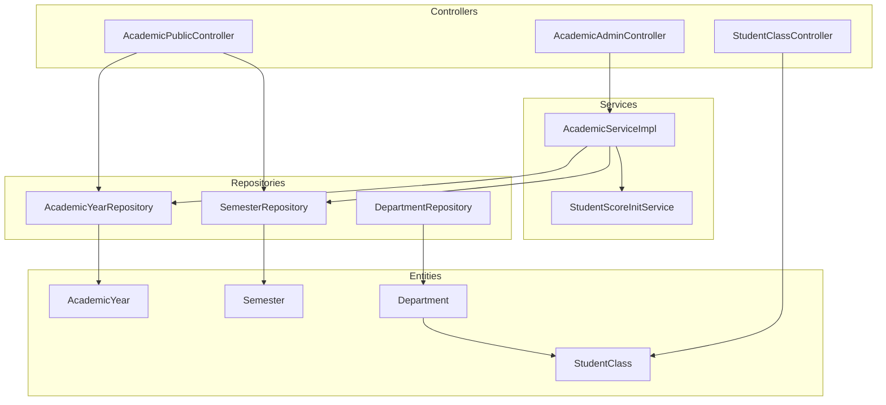
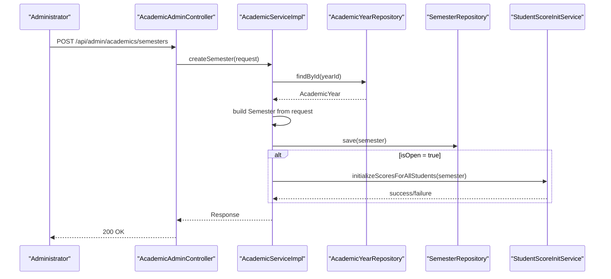
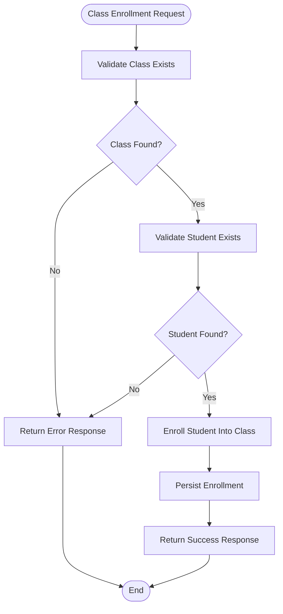
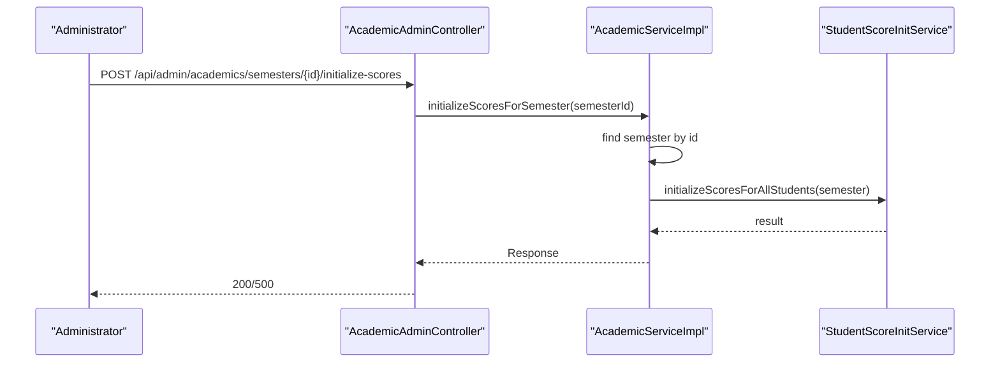
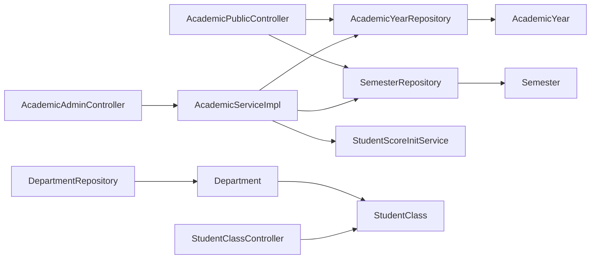

# Academic Administration

<cite>
**Referenced Files in This Document**
- [AcademicAdminController.java](file://src/main/java/vn/campuslife/controller/academic/AcademicAdminController.java)
- [AcademicPublicController.java](file://src/main/java/vn/campuslife/controller/academic/AcademicPublicController.java)
- [AcademicService.java](file://src/main/java/vn/campuslife/service/AcademicService.java)
- [AcademicServiceImpl.java](file://src/main/java/vn/campuslife/service/impl/AcademicServiceImpl.java)
- [AcademicYear.java](file://src/main/java/vn/campuslife/entity/AcademicYear.java)
- [Semester.java](file://src/main/java/vn/campuslife/entity/Semester.java)
- [Department.java](file://src/main/java/vn/campuslife/entity/Department.java)
- [StudentClass.java](file://src/main/java/vn/campuslife/entity/StudentClass.java)
- [AcademicYearRepository.java](file://src/main/java/vn/campuslife/repository/AcademicYearRepository.java)
- [SemesterRepository.java](file://src/main/java/vn/campuslife/repository/SemesterRepository.java)
- [AcademicYearRequest.java](file://src/main/java/vn/campuslife/model/AcademicYearRequest.java)
- [SemesterRequest.java](file://src/main/java/vn/campuslife/model/SemesterRequest.java)
- [DepartmentType.java](file://src/main/java/vn/campuslife/enumeration/DepartmentType.java)
- [StudentClassController.java](file://src/main/java/vn/campuslife/controller/student/StudentClassController.java)
- [StudentScoreInitService.java](file://src/main/java/vn/campuslife/service/StudentScoreInitService.java)
- [DepartmentServiceImpl.java](file://src/main/java/vn/campuslife/service/impl/DepartmentServiceImpl.java)
- [DepartmentRepository.java](file://src/main/java/vn/campuslife/repository/DepartmentRepository.java)
- [DepartmentRequest.java](file://src/main/java/vn/campuslife/model/DepartmentRequest.java)
- [DepartmentController.java](file://src/main/java/vn/campuslife/controller/academic/DepartmentController.java)
- [DepartmentAdminController.java](file://src/main/java/vn/campuslife/controller/academic/DepartmentAdminController.java)
</cite>

## Table of Contents
1. [Introduction](#introduction)
2. [Project Structure](#project-structure)
3. [Core Components](#core-components)
4. [Architecture Overview](#architecture-overview)
5. [Detailed Component Analysis](#detailed-component-analysis)
6. [Dependency Analysis](#dependency-analysis)
7. [Performance Considerations](#performance-considerations)
8. [Troubleshooting Guide](#troubleshooting-guide)
9. [Conclusion](#conclusion)
10. [Appendices](#appendices)

## Introduction
This document provides comprehensive documentation for the Academic Administration module, focusing on academic year and semester administration, department and student class management, and academic data lifecycle management. It explains how academic hierarchy is modeled, how departments and classes are organized, and how academic calendars are maintained. It also documents administrative workflows for creating and modifying academic years and semesters, initializing academic scores per semester, and integrating with student management systems.

## Project Structure
The Academic Administration module is implemented as a Spring Boot application with layered architecture:
- Controllers expose REST endpoints for administrative and public access to academic data.
- Services encapsulate business logic for academic year and semester management, and coordinate score initialization.
- Repositories provide data access for entities.
- Entities define the academic hierarchy and relationships.
- Models represent request payloads for academic operations.



**Diagram sources**
- [AcademicAdminController.java:10-92](file://src/main/java/vn/campuslife/controller/academic/AcademicAdminController.java#L10-L92)
- [AcademicPublicController.java:10-37](file://src/main/java/vn/campuslife/controller/academic/AcademicPublicController.java#L10-L37)
- [StudentClassController.java:10-164](file://src/main/java/vn/campuslife/controller/student/StudentClassController.java#L10-L164)
- [AcademicServiceImpl.java:21-194](file://src/main/java/vn/campuslife/service/impl/AcademicServiceImpl.java#L21-L194)
- [AcademicYearRepository.java:7-9](file://src/main/java/vn/campuslife/repository/AcademicYearRepository.java#L7-L9)
- [SemesterRepository.java:13-42](file://src/main/java/vn/campuslife/repository/SemesterRepository.java#L13-L42)
- [AcademicYear.java:14-37](file://src/main/java/vn/campuslife/entity/AcademicYear.java#L14-L37)
- [Semester.java:14-44](file://src/main/java/vn/campuslife/entity/Semester.java#L14-L44)
- [Department.java:13-40](file://src/main/java/vn/campuslife/entity/Department.java#L13-L40)
- [StudentClass.java:15-47](file://src/main/java/vn/campuslife/entity/StudentClass.java#L15-L47)

**Section sources**
- [AcademicAdminController.java:10-92](file://src/main/java/vn/campuslife/controller/academic/AcademicAdminController.java#L10-L92)
- [AcademicPublicController.java:10-37](file://src/main/java/vn/campuslife/controller/academic/AcademicPublicController.java#L10-L37)
- [AcademicServiceImpl.java:21-194](file://src/main/java/vn/campuslife/service/impl/AcademicServiceImpl.java#L21-L194)
- [AcademicYearRepository.java:7-9](file://src/main/java/vn/campuslife/repository/AcademicYearRepository.java#L7-L9)
- [SemesterRepository.java:13-42](file://src/main/java/vn/campuslife/repository/SemesterRepository.java#L13-L42)
- [AcademicYear.java:14-37](file://src/main/java/vn/campuslife/entity/AcademicYear.java#L14-L37)
- [Semester.java:14-44](file://src/main/java/vn/campuslife/entity/Semester.java#L14-L44)
- [Department.java:13-40](file://src/main/java/vn/campuslife/entity/Department.java#L13-L40)
- [StudentClass.java:15-47](file://src/main/java/vn/campuslife/entity/StudentClass.java#L15-L47)

## Core Components
- Academic Year Management: CRUD operations for academic years, including retrieval, creation, updates, and deletion.
- Semester Management: CRUD operations for semesters linked to academic years, with open/close toggling and score initialization.
- Public Academic Calendar Access: Non-admin endpoints to list academic years and semesters.
- Department and Class Management: Department entities and class enrollment via StudentClassController.
- Score Initialization: Automated and manual triggers to initialize academic scores per semester.

Key implementation highlights:
- Academic year and semester entities define the academic hierarchy with audit timestamps.
- Controllers expose endpoints under /api/admin/academics for admin operations and /api/academic for public access.
- Services orchestrate persistence and score initialization, handling transaction boundaries and error propagation.

**Section sources**
- [AcademicYear.java:14-37](file://src/main/java/vn/campuslife/entity/AcademicYear.java#L14-L37)
- [Semester.java:14-44](file://src/main/java/vn/campuslife/entity/Semester.java#L14-L44)
- [AcademicYearRequest.java:7-11](file://src/main/java/vn/campuslife/model/AcademicYearRequest.java#L7-L11)
- [SemesterRequest.java:7-13](file://src/main/java/vn/campuslife/model/SemesterRequest.java#L7-L13)
- [AcademicService.java:7-36](file://src/main/java/vn/campuslife/service/AcademicService.java#L7-L36)
- [AcademicServiceImpl.java:21-194](file://src/main/java/vn/campuslife/service/impl/AcademicServiceImpl.java#L21-L194)
- [AcademicAdminController.java:10-92](file://src/main/java/vn/campuslife/controller/academic/AcademicAdminController.java#L10-L92)
- [AcademicPublicController.java:10-37](file://src/main/java/vn/campuslife/controller/academic/AcademicPublicController.java#L10-L37)
- [StudentClassController.java:10-164](file://src/main/java/vn/campuslife/controller/student/StudentClassController.java#L10-L164)

## Architecture Overview
The Academic Administration module follows a clean architecture pattern:
- Presentation Layer: Controllers handle HTTP requests and responses.
- Application Layer: Services implement business rules and coordinate repositories.
- Domain Layer: Entities represent academic data and relationships.
- Persistence Layer: Repositories provide data access.

```mermaid
classDiagram
class AcademicYear {
+Long id
+String name
+LocalDate startDate
+LocalDate endDate
+LocalDateTime createdAt
+LocalDateTime updatedAt
}
class Semester {
+Long id
+AcademicYear year
+String name
+LocalDate startDate
+LocalDate endDate
+boolean isOpen
+LocalDateTime createdAt
+LocalDateTime updatedAt
}
class Department {
+Long id
+String name
+DepartmentType type
+String description
+LocalDateTime createdAt
+LocalDateTime updatedAt
+boolean isDeleted
}
class StudentClass {
+Long id
+String className
+String description
+Department department
+Student[] students
+LocalDateTime createdAt
+LocalDateTime updatedAt
+boolean isDeleted
}
AcademicYear "1" -- "many" Semester : "contains"
Department "1" -- "many" StudentClass : "owns"
StudentClass "1" "many" Student : "enrolls"
```

**Diagram sources**
- [AcademicYear.java:14-37](file://src/main/java/vn/campuslife/entity/AcademicYear.java#L14-L37)
- [Semester.java:14-44](file://src/main/java/vn/campuslife/entity/Semester.java#L14-L44)
- [Department.java:13-40](file://src/main/java/vn/campuslife/entity/Department.java#L13-L40)
- [StudentClass.java:15-47](file://src/main/java/vn/campuslife/entity/StudentClass.java#L15-L47)

## Detailed Component Analysis

### Academic Year and Semester Administration
This component manages the academic calendar, including academic year lifecycle and semester configuration.

- Administrative endpoints:
  - GET /api/admin/academics/years, /api/admin/academics/years/{id}: Retrieve all years or a specific year.
  - POST /api/admin/academics/years: Create a new academic year.
  - PUT /api/admin/academics/years/{id}: Update an existing academic year.
  - DELETE /api/admin/academics/years/{id}: Remove an academic year.
  - GET /api/admin/academics/years/{yearId}/semesters: List semesters for a given year.
  - GET /api/admin/academics/semesters/{id}: Retrieve a specific semester.
  - POST /api/admin/academics/semesters: Create a new semester linked to a year.
  - PUT /api/admin/academics/semesters/{id}: Update a semester.
  - DELETE /api/admin/academics/semesters/{id}: Delete a semester.
  - POST /api/admin/academics/semesters/{id}/toggle: Toggle semester open/close state.
  - POST /api/admin/academics/semesters/{id}/initialize-scores: Manually initialize scores for all students in a semester.

- Public endpoints:
  - GET /api/academic/years: List all academic years.
  - GET /api/academic/years/{yearId}/semesters: List semesters filtered by year.
  - GET /api/academic/semesters: List all semesters.

- Business logic:
  - AcademicServiceImpl validates year existence before linking semesters, persists changes, and optionally initializes scores upon semester creation or manual trigger.
  - SemesterRepository provides date-based lookup with preference for open semesters.



**Diagram sources**
- [AcademicAdminController.java:62-89](file://src/main/java/vn/campuslife/controller/academic/AcademicAdminController.java#L62-L89)
- [AcademicServiceImpl.java:100-129](file://src/main/java/vn/campuslife/service/impl/AcademicServiceImpl.java#L100-L129)
- [AcademicYearRepository.java:7-9](file://src/main/java/vn/campuslife/repository/AcademicYearRepository.java#L7-L9)
- [SemesterRepository.java:13-42](file://src/main/java/vn/campuslife/repository/SemesterRepository.java#L13-L42)
- [StudentScoreInitService.java](file://src/main/java/vn/campuslife/service/StudentScoreInitService.java)

**Section sources**
- [AcademicAdminController.java:20-92](file://src/main/java/vn/campuslife/controller/academic/AcademicAdminController.java#L20-L92)
- [AcademicPublicController.java:18-35](file://src/main/java/vn/campuslife/controller/academic/AcademicPublicController.java#L18-L35)
- [AcademicService.java:7-36](file://src/main/java/vn/campuslife/service/AcademicService.java#L7-L36)
- [AcademicServiceImpl.java:38-194](file://src/main/java/vn/campuslife/service/impl/AcademicServiceImpl.java#L38-L194)
- [AcademicYearRepository.java:7-9](file://src/main/java/vn/campuslife/repository/AcademicYearRepository.java#L7-L9)
- [SemesterRepository.java:16-37](file://src/main/java/vn/campuslife/repository/SemesterRepository.java#L16-L37)
- [AcademicYear.java:14-37](file://src/main/java/vn/campuslife/entity/AcademicYear.java#L14-L37)
- [Semester.java:14-44](file://src/main/java/vn/campuslife/entity/Semester.java#L14-L44)

### Department and Student Class Management
Departments organize academic units (e.g., faculties/departments), while student classes represent cohorts enrolled under departments. Students are associated with classes, enabling class-based enrollment and reporting.

- Department entity supports two types (PHONG_BAN, KHOA) and soft deletion.
- StudentClass belongs to a Department and holds a collection of Students.
- StudentClassController exposes endpoints for class lifecycle and student enrollment management.



**Diagram sources**
- [StudentClassController.java:122-132](file://src/main/java/vn/campuslife/controller/student/StudentClassController.java#L122-L132)
- [StudentClass.java:32-37](file://src/main/java/vn/campuslife/entity/StudentClass.java#L32-L37)

**Section sources**
- [Department.java:13-40](file://src/main/java/vn/campuslife/entity/Department.java#L13-L40)
- [StudentClass.java:15-47](file://src/main/java/vn/campuslife/entity/StudentClass.java#L15-L47)
- [DepartmentType.java:3-6](file://src/main/java/vn/campuslife/enumeration/DepartmentType.java#L3-L6)
- [StudentClassController.java:17-164](file://src/main/java/vn/campuslife/controller/student/StudentClassController.java#L17-L164)

### Academic Data Lifecycle and Score Initialization
- Automatic initialization occurs when a semester is created with open=true; the system attempts to initialize scores for all students.
- Manual initialization is available via a dedicated endpoint for a given semester.
- Errors during initialization are logged and surfaced without failing the primary operation, allowing administrators to retry later.



**Diagram sources**
- [AcademicAdminController.java:85-89](file://src/main/java/vn/campuslife/controller/academic/AcademicAdminController.java#L85-L89)
- [AcademicServiceImpl.java:168-192](file://src/main/java/vn/campuslife/service/impl/AcademicServiceImpl.java#L168-L192)
- [StudentScoreInitService.java](file://src/main/java/vn/campuslife/service/StudentScoreInitService.java)

**Section sources**
- [AcademicServiceImpl.java:115-126](file://src/main/java/vn/campuslife/service/impl/AcademicServiceImpl.java#L115-L126)
- [AcademicServiceImpl.java:178-191](file://src/main/java/vn/campuslife/service/impl/AcademicServiceImpl.java#L178-L191)

## Dependency Analysis
The module exhibits clear separation of concerns:
- Controllers depend on services for business operations.
- Services depend on repositories for persistence and on StudentScoreInitService for score initialization.
- Entities define relationships and constraints enforced by JPA/Hibernate.
- Public controllers bypass service layer and directly query repositories for read-only access.



**Diagram sources**
- [AcademicAdminController.java:10-92](file://src/main/java/vn/campuslife/controller/academic/AcademicAdminController.java#L10-L92)
- [AcademicPublicController.java:10-37](file://src/main/java/vn/campuslife/controller/academic/AcademicPublicController.java#L10-L37)
- [AcademicServiceImpl.java:21-36](file://src/main/java/vn/campuslife/service/impl/AcademicServiceImpl.java#L21-L36)
- [AcademicYearRepository.java:7-9](file://src/main/java/vn/campuslife/repository/AcademicYearRepository.java#L7-L9)
- [SemesterRepository.java:13-42](file://src/main/java/vn/campuslife/repository/SemesterRepository.java#L13-L42)
- [DepartmentRepository.java](file://src/main/java/vn/campuslife/repository/DepartmentRepository.java)
- [StudentClassController.java:10-164](file://src/main/java/vn/campuslife/controller/student/StudentClassController.java#L10-L164)

**Section sources**
- [AcademicServiceImpl.java:21-36](file://src/main/java/vn/campuslife/service/impl/AcademicServiceImpl.java#L21-L36)
- [AcademicYearRepository.java:7-9](file://src/main/java/vn/campuslife/repository/AcademicYearRepository.java#L7-L9)
- [SemesterRepository.java:13-42](file://src/main/java/vn/campuslife/repository/SemesterRepository.java#L13-L42)
- [DepartmentRepository.java](file://src/main/java/vn/campuslife/repository/DepartmentRepository.java)
- [StudentClassController.java:10-164](file://src/main/java/vn/campuslife/controller/student/StudentClassController.java#L10-L164)

## Performance Considerations
- Prefer batch operations for score initialization to minimize database round-trips.
- Use pagination for listing large sets of semesters or classes.
- Index academic year and semester date ranges in the database to optimize findByDate queries.
- Cache frequently accessed academic year/semester metadata for public endpoints.

## Troubleshooting Guide
Common issues and resolutions:
- Year not found when creating/updating semester: Ensure the yearId exists before creating a semester.
- Semester not found when toggling open/close or initializing scores: Verify the semester identifier.
- Score initialization failures: Review logs for exceptions and retry manual initialization after resolving underlying causes.
- Soft-deleted entities: Department and StudentClass include isDeleted flags; ensure filters exclude deleted records when querying.

**Section sources**
- [AcademicServiceImpl.java:103-105](file://src/main/java/vn/campuslife/service/impl/AcademicServiceImpl.java#L103-L105)
- [AcademicServiceImpl.java:160-166](file://src/main/java/vn/campuslife/service/impl/AcademicServiceImpl.java#L160-L166)
- [AcademicServiceImpl.java:170-174](file://src/main/java/vn/campuslife/service/impl/AcademicServiceImpl.java#L170-L174)
- [Department.java:39-39](file://src/main/java/vn/campuslife/entity/Department.java#L39-L39)
- [StudentClass.java:46-46](file://src/main/java/vn/campuslife/entity/StudentClass.java#L46-L46)

## Conclusion
The Academic Administration module provides robust support for managing academic calendars, departments, and student classes. Its layered design ensures maintainable and testable code, while automatic and manual score initialization aligns with real-world academic workflows. Administrators can efficiently configure academic years and semesters, manage departmental structures, and integrate with student enrollment systems.

## Appendices

### Practical Examples
- Create a new academic year:
  - Endpoint: POST /api/admin/academics/years
  - Payload: AcademicYearRequest with name, startDate, endDate
- Configure a semester within an academic year:
  - Endpoint: POST /api/admin/academics/semesters
  - Payload: SemesterRequest with yearId, name, startDate, endDate, optional open flag
- Open a semester for enrollment:
  - Endpoint: POST /api/admin/academics/semesters/{id}/toggle?open=true
- Initialize scores for all students in a semester:
  - Endpoint: POST /api/admin/academics/semesters/{id}/initialize-scores
- Create a student class under a department:
  - Endpoint: POST /api/classes
  - Query params: className, description (optional), departmentId
- Enroll a student into a class:
  - Endpoint: POST /api/classes/{classId}/students/{studentId}

### Administrative Workflows
- Academic year creation: Validate dates, persist year, notify stakeholders.
- Semester creation: Link to academic year, optionally initialize scores, publish availability.
- Semester close/open: Update isOpen flag and communicate changes.
- Class enrollment: Verify class and student existence, persist enrollment, update records.

### Integration Notes
- Score initialization integrates with StudentScoreInitService to set baseline academic records per semester.
- Public endpoints (/api/academic) enable frontends to display academic calendars without administrative privileges.
- Department and class entities form the foundation for cohort-based reporting and student grouping.