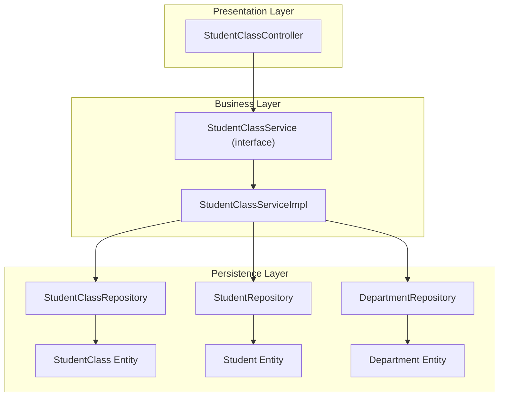
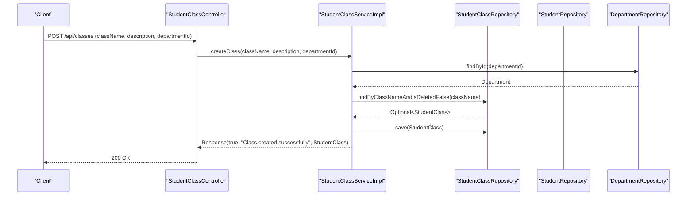
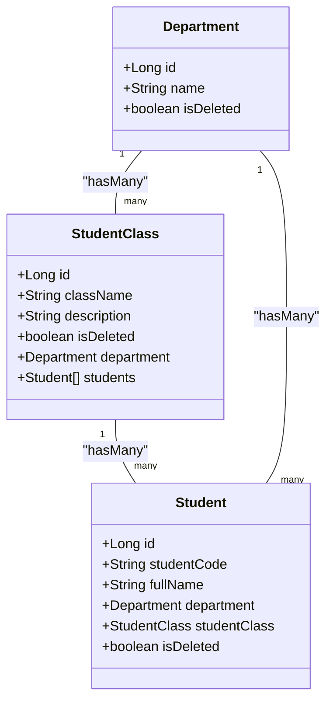
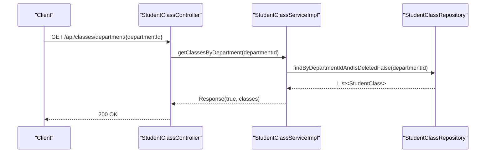
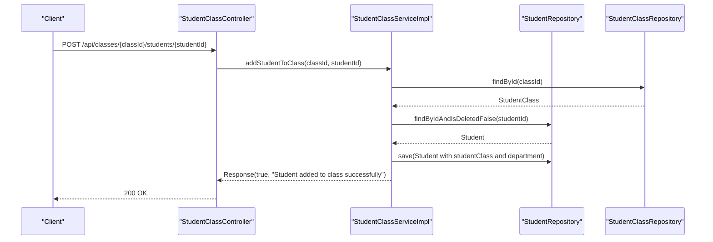
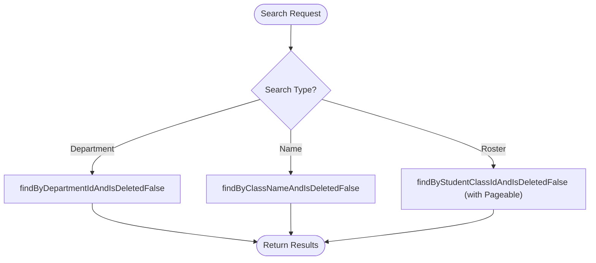
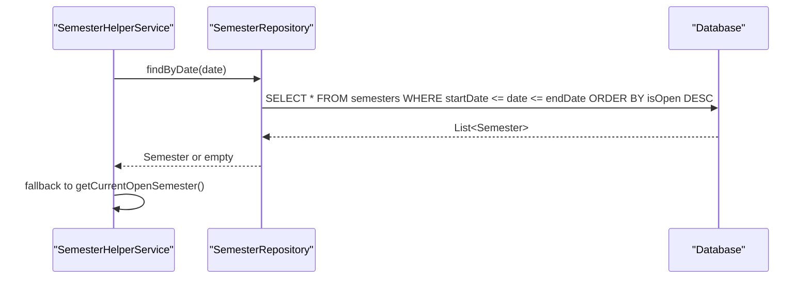
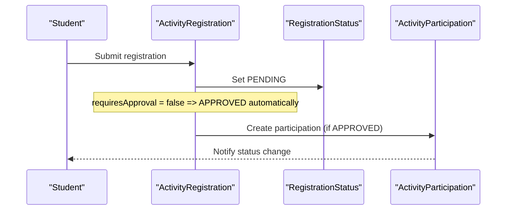
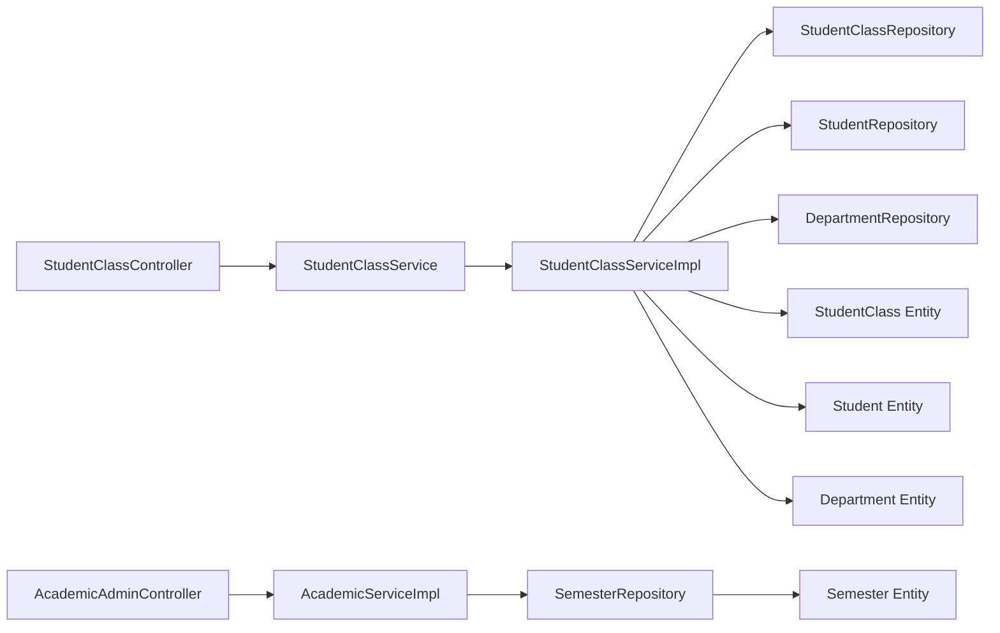

# Student Class Enrollment

<cite>
**Referenced Files in This Document**
- [StudentClassController.java](file://src/main/java/vn/campuslife/controller/student/StudentClassController.java)
- [StudentClassService.java](file://src/main/java/vn/campuslife/service/StudentClassService.java)
- [StudentClassServiceImpl.java](file://src/main/java/vn/campuslife/service/impl/StudentClassServiceImpl.java)
- [StudentClass.java](file://src/main/java/vn/campuslife/entity/StudentClass.java)
- [Student.java](file://src/main/java/vn/campuslife/entity/Student.java)
- [Department.java](file://src/main/java/vn/campuslife/entity/Department.java)
- [StudentClassRepository.java](file://src/main/java/vn/campuslife/repository/StudentClassRepository.java)
- [StudentResponse.java](file://src/main/java/vn/campuslife/model/StudentResponse.java)
- [AcademicYear.java](file://src/main/java/vn/campuslife/entity/AcademicYear.java)
- [Semester.java](file://src/main/java/vn/campuslife/entity/Semester.java)
- [SemesterRepository.java](file://src/main/java/vn/campuslife/repository/SemesterRepository.java)
- [AcademicServiceImpl.java](file://src/main/java/vn/campuslife/service/impl/AcademicServiceImpl.java)
- [AcademicAdminController.java](file://src/main/java/vn/campuslife/controller/academic/AcademicAdminController.java)
- [ActivityRegistration.java](file://src/main/java/vn/campuslife/entity/ActivityRegistration.java)
- [ActivityRegistrationRepository.java](file://src/main/java/vn/campuslife/repository/ActivityRegistrationRepository.java)
- [RegistrationStatus.java](file://src/main/java/vn/campuslife/enumeration/RegistrationStatus.java)
</cite>

## Table of Contents
1. [Introduction](#introduction)
2. [Project Structure](#project-structure)
3. [Core Components](#core-components)
4. [Architecture Overview](#architecture-overview)
5. [Detailed Component Analysis](#detailed-component-analysis)
6. [Dependency Analysis](#dependency-analysis)
7. [Performance Considerations](#performance-considerations)
8. [Troubleshooting Guide](#troubleshooting-guide)
9. [Conclusion](#conclusion)

## Introduction
This document explains the student class enrollment functionality implemented in the backend. It covers class creation and management, student-class relationships, enrollment workflows, class capacity considerations, class search and filtering, and integration with the academic calendar system. Practical scenarios demonstrate enrollment processes, while best practices address common challenges such as capacity constraints and data consistency.

## Project Structure
The class enrollment feature spans three layers:
- Presentation: REST endpoints in the student module
- Business: Service interfaces and implementations
- Persistence: JPA entities and repositories

**Diagram sources**
- [StudentClassController.java:10-164](file://src/main/java/vn/campuslife/controller/student/StudentClassController.java#L10-L164)
- [StudentClassService.java:8-43](file://src/main/java/vn/campuslife/service/StudentClassService.java#L8-L43)
- [StudentClassServiceImpl.java:22-276](file://src/main/java/vn/campuslife/service/impl/StudentClassServiceImpl.java#L22-L276)
- [StudentClassRepository.java:12-25](file://src/main/java/vn/campuslife/repository/StudentClassRepository.java#L12-L25)
- [StudentClass.java:15-47](file://src/main/java/vn/campuslife/entity/StudentClass.java#L15-L47)
- [Student.java:20-78](file://src/main/java/vn/campuslife/entity/Student.java#L20-L78)
- [Department.java:13-40](file://src/main/java/vn/campuslife/entity/Department.java#L13-L40)

**Section sources**
- [StudentClassController.java:10-164](file://src/main/java/vn/campuslife/controller/student/StudentClassController.java#L10-L164)
- [StudentClassService.java:8-43](file://src/main/java/vn/campuslife/service/StudentClassService.java#L8-L43)
- [StudentClassServiceImpl.java:22-276](file://src/main/java/vn/campuslife/service/impl/StudentClassServiceImpl.java#L22-L276)
- [StudentClassRepository.java:12-25](file://src/main/java/vn/campuslife/repository/StudentClassRepository.java#L12-L25)
- [StudentClass.java:15-47](file://src/main/java/vn/campuslife/entity/StudentClass.java#L15-L47)
- [Student.java:20-78](file://src/main/java/vn/campuslife/entity/Student.java#L20-L78)
- [Department.java:13-40](file://src/main/java/vn/campuslife/entity/Department.java#L13-L40)

## Core Components
- StudentClassController: Exposes REST endpoints for class lifecycle and student-class enrollment operations.
- StudentClassService and StudentClassServiceImpl: Implement business logic for class CRUD, student retrieval, and enrollment actions with validation and soft deletion.
- StudentClass entity: Represents a class linked to a Department and containing Students.
- Student entity: Links a User to a StudentClass and Department.
- StudentClassRepository: Provides queries for active classes and class-by-name lookup.
- StudentResponse: DTO for safe student data exposure in class rosters.

Key responsibilities:
- Enforce uniqueness of class names per active record
- Validate existence of departments and students
- Support pagination for large class rosters
- Maintain department consistency when enrolling students
- Soft-delete classes to preserve referential integrity

**Section sources**
- [StudentClassController.java:17-161](file://src/main/java/vn/campuslife/controller/student/StudentClassController.java#L17-L161)
- [StudentClassService.java:8-43](file://src/main/java/vn/campuslife/service/StudentClassService.java#L8-L43)
- [StudentClassServiceImpl.java:32-273](file://src/main/java/vn/campuslife/service/impl/StudentClassServiceImpl.java#L32-L273)
- [StudentClass.java:21-47](file://src/main/java/vn/campuslife/entity/StudentClass.java#L21-L47)
- [Student.java:27-78](file://src/main/java/vn/campuslife/entity/Student.java#L27-L78)
- [StudentClassRepository.java:13-25](file://src/main/java/vn/campuslife/repository/StudentClassRepository.java#L13-L25)
- [StudentResponse.java:16-67](file://src/main/java/vn/campuslife/model/StudentResponse.java#L16-L67)

## Architecture Overview
The system follows layered architecture:
- Controllers handle HTTP requests and return standardized Response envelopes
- Services encapsulate business rules and orchestrate repositories
- Repositories abstract persistence operations
- Entities define domain models and relationships

**Diagram sources**
- [StudentClassController.java:20-31](file://src/main/java/vn/campuslife/controller/student/StudentClassController.java#L20-L31)
- [StudentClassServiceImpl.java:34-60](file://src/main/java/vn/campuslife/service/impl/StudentClassServiceImpl.java#L34-L60)
- [StudentClassRepository.java:19-19](file://src/main/java/vn/campuslife/repository/StudentClassRepository.java#L19-L19)
- [StudentClass.java:21-47](file://src/main/java/vn/campuslife/entity/StudentClass.java#L21-L47)

## Detailed Component Analysis

### Student-Class Relationship Model
Student and StudentClass form a many-to-one relationship via foreign keys. A Department links both entities, ensuring organizational boundaries.

**Diagram sources**
- [StudentClass.java:21-47](file://src/main/java/vn/campuslife/entity/StudentClass.java#L21-L47)
- [Student.java:27-78](file://src/main/java/vn/campuslife/entity/Student.java#L27-L78)
- [Department.java:19-40](file://src/main/java/vn/campuslife/entity/Department.java#L19-L40)

**Section sources**
- [StudentClass.java:21-47](file://src/main/java/vn/campuslife/entity/StudentClass.java#L21-L47)
- [Student.java:27-78](file://src/main/java/vn/campuslife/entity/Student.java#L27-L78)
- [Department.java:19-40](file://src/main/java/vn/campuslife/entity/Department.java#L19-L40)

### Class Lifecycle Management
Endpoints support creating, updating, listing, retrieving by ID/name, and soft-deleting classes. Class name uniqueness is enforced for active records.

**Diagram sources**
- [StudentClassController.java:66-75](file://src/main/java/vn/campuslife/controller/student/StudentClassController.java#L66-L75)
- [StudentClassServiceImpl.java:104-113](file://src/main/java/vn/campuslife/service/impl/StudentClassServiceImpl.java#L104-L113)
- [StudentClassRepository.java:15-15](file://src/main/java/vn/campuslife/repository/StudentClassRepository.java#L15-L15)

**Section sources**
- [StudentClassController.java:17-161](file://src/main/java/vn/campuslife/controller/student/StudentClassController.java#L17-L161)
- [StudentClassServiceImpl.java:32-148](file://src/main/java/vn/campuslife/service/impl/StudentClassServiceImpl.java#L32-L148)
- [StudentClassRepository.java:13-25](file://src/main/java/vn/campuslife/repository/StudentClassRepository.java#L13-L25)

### Student Enrollment and Roster Management
Enrollment operations include adding/removing students from a class and retrieving class rosters with optional pagination. Department consistency is maintained automatically when enrolling.

**Diagram sources**
- [StudentClassController.java:122-132](file://src/main/java/vn/campuslife/controller/student/StudentClassController.java#L122-L132)
- [StudentClassServiceImpl.java:203-233](file://src/main/java/vn/campuslife/service/impl/StudentClassServiceImpl.java#L203-L233)
- [Student.java:46-54](file://src/main/java/vn/campuslife/entity/Student.java#L46-L54)
- [StudentClass.java:32-34](file://src/main/java/vn/campuslife/entity/StudentClass.java#L32-L34)

**Section sources**
- [StudentClassController.java:105-147](file://src/main/java/vn/campuslife/controller/student/StudentClassController.java#L105-L147)
- [StudentClassServiceImpl.java:150-258](file://src/main/java/vn/campuslife/service/impl/StudentClassServiceImpl.java#L150-L258)
- [StudentResponse.java:30-67](file://src/main/java/vn/campuslife/model/StudentResponse.java#L30-L67)

### Class Search and Filtering
- Retrieve by department with ordering by class name
- Retrieve by class name (active only)
- Paginated student retrieval per class

**Diagram sources**
- [StudentClassRepository.java:15-22](file://src/main/java/vn/campuslife/repository/StudentClassRepository.java#L15-L22)
- [StudentClassRepository.java:19-19](file://src/main/java/vn/campuslife/repository/StudentClassRepository.java#L19-L19)
- [StudentClassServiceImpl.java:173-201](file://src/main/java/vn/campuslife/service/impl/StudentClassServiceImpl.java#L173-L201)

**Section sources**
- [StudentClassRepository.java:13-25](file://src/main/java/vn/campuslife/repository/StudentClassRepository.java#L13-L25)
- [StudentClassServiceImpl.java:150-201](file://src/main/java/vn/campuslife/service/impl/StudentClassServiceImpl.java#L150-L201)

### Academic Calendar Integration
The academic calendar (AcademicYear and Semester) supports date-based semester resolution, enabling enrollment workflows aligned with term boundaries.

**Diagram sources**
- [SemesterRepository.java:20-37](file://src/main/java/vn/campuslife/repository/SemesterRepository.java#L20-L37)
- [AcademicServiceImpl.java:77-89](file://src/main/java/vn/campuslife/service/impl/AcademicServiceImpl.java#L77-L89)

**Section sources**
- [AcademicYear.java:14-37](file://src/main/java/vn/campuslife/entity/AcademicYear.java#L14-L37)
- [Semester.java:14-44](file://src/main/java/vn/campuslife/entity/Semester.java#L14-L44)
- [SemesterRepository.java:14-38](file://src/main/java/vn/campuslife/repository/SemesterRepository.java#L14-L38)
- [AcademicServiceImpl.java:77-89](file://src/main/java/vn/campuslife/service/impl/AcademicServiceImpl.java#L77-L89)

### Enrollment Validation and Capacity Management
Current implementation does not enforce class capacity limits. Validation focuses on:
- Unique class name constraint
- Existence checks for department and student
- Soft-deleted records exclusion
- Roster pagination support

Capacity constraints are not present in the current codebase. To implement capacity:
- Add a maxCapacity field to StudentClass
- Validate capacity during enrollment
- Track current enrollment count
- Enforce capacity thresholds before saving

**Section sources**
- [StudentClassServiceImpl.java:34-90](file://src/main/java/vn/campuslife/service/impl/StudentClassServiceImpl.java#L34-L90)
- [StudentClassServiceImpl.java:203-233](file://src/main/java/vn/campuslife/service/impl/StudentClassServiceImpl.java#L203-L233)

### Class Registration Workflows
While class enrollment is managed via student-class relationships, activity registration complements academic enrollment. ActivityRegistration tracks student participation with status transitions (PENDING, APPROVED, REJECTED, CANCELLED, ATTENDED, WAITLIST). Approval triggers automatic creation of ActivityParticipation entries.

**Diagram sources**
- [ActivityRegistration.java:18-46](file://src/main/java/vn/campuslife/entity/ActivityRegistration.java#L18-L46)
- [RegistrationStatus.java:3-10](file://src/main/java/vn/campuslife/enumeration/RegistrationStatus.java#L3-L10)
- [ActivityRegistrationRepository.java:100-108](file://src/main/java/vn/campuslife/repository/ActivityRegistrationRepository.java#L100-L108)

**Section sources**
- [ActivityRegistration.java:18-46](file://src/main/java/vn/campuslife/entity/ActivityRegistration.java#L18-L46)
- [RegistrationStatus.java:3-10](file://src/main/java/vn/campuslife/enumeration/RegistrationStatus.java#L3-L10)
- [ActivityRegistrationRepository.java:100-108](file://src/main/java/vn/campuslife/repository/ActivityRegistrationRepository.java#L100-L108)

## Dependency Analysis
The following diagram shows key dependencies among components involved in class enrollment and academic calendar integration.

**Diagram sources**
- [StudentClassController.java:10-164](file://src/main/java/vn/campuslife/controller/student/StudentClassController.java#L10-L164)
- [StudentClassServiceImpl.java:22-276](file://src/main/java/vn/campuslife/service/impl/StudentClassServiceImpl.java#L22-L276)
- [StudentClassRepository.java:12-25](file://src/main/java/vn/campuslife/repository/StudentClassRepository.java#L12-L25)
- [Student.java:27-78](file://src/main/java/vn/campuslife/entity/Student.java#L27-L78)
- [StudentClass.java:21-47](file://src/main/java/vn/campuslife/entity/StudentClass.java#L21-L47)
- [Department.java:19-40](file://src/main/java/vn/campuslife/entity/Department.java#L19-L40)
- [SemesterRepository.java:13-38](file://src/main/java/vn/campuslife/repository/SemesterRepository.java#L13-L38)
- [Semester.java:14-44](file://src/main/java/vn/campuslife/entity/Semester.java#L14-L44)
- [AcademicAdminController.java:64-91](file://src/main/java/vn/campuslife/controller/academic/AcademicAdminController.java#L64-L91)
- [AcademicServiceImpl.java:21-36](file://src/main/java/vn/campuslife/service/impl/AcademicServiceImpl.java#L21-L36)

**Section sources**
- [StudentClassController.java:10-164](file://src/main/java/vn/campuslife/controller/student/StudentClassController.java#L10-L164)
- [StudentClassServiceImpl.java:22-276](file://src/main/java/vn/campuslife/service/impl/StudentClassServiceImpl.java#L22-L276)
- [StudentClassRepository.java:12-25](file://src/main/java/vn/campuslife/repository/StudentClassRepository.java#L12-L25)
- [Student.java:27-78](file://src/main/java/vn/campuslife/entity/Student.java#L27-L78)
- [StudentClass.java:21-47](file://src/main/java/vn/campuslife/entity/StudentClass.java#L21-L47)
- [Department.java:19-40](file://src/main/java/vn/campuslife/entity/Department.java#L19-L40)
- [SemesterRepository.java:13-38](file://src/main/java/vn/campuslife/repository/SemesterRepository.java#L13-L38)
- [Semester.java:14-44](file://src/main/java/vn/campuslife/entity/Semester.java#L14-L44)
- [AcademicAdminController.java:64-91](file://src/main/java/vn/campuslife/controller/academic/AcademicAdminController.java#L64-L91)
- [AcademicServiceImpl.java:21-36](file://src/main/java/vn/campuslife/service/impl/AcademicServiceImpl.java#L21-L36)

## Performance Considerations
- Pagination: Use Pageable-aware queries for large rosters to limit memory footprint and improve response times.
- Indexing: Ensure database indexes on frequently queried columns (e.g., className, departmentId, studentClassId, isDeleted).
- DTO projection: Returning StudentResponse avoids loading unnecessary entity graphs.
- Transaction boundaries: Keep enrollment operations atomic to maintain consistency.

## Troubleshooting Guide
Common issues and resolutions:
- Class not found: Verify classId exists and is not soft-deleted.
- Duplicate class name: Ensure className uniqueness for active classes.
- Student not found: Confirm studentId exists and is not soft-deleted.
- Student not in class: Removal requires matching studentClass association.
- Department mismatch: Enrollment auto-assigns department from class; confirm class department linkage.

Operational tips:
- Use class-by-name endpoint to locate classes before enrollment.
- Validate department existence before creating classes.
- Monitor logs for transaction errors during enrollment.

**Section sources**
- [StudentClassServiceImpl.java:34-90](file://src/main/java/vn/campuslife/service/impl/StudentClassServiceImpl.java#L34-L90)
- [StudentClassServiceImpl.java:203-258](file://src/main/java/vn/campuslife/service/impl/StudentClassServiceImpl.java#L203-L258)

## Conclusion
The student class enrollment system provides robust class lifecycle management, student-class linking, and roster operations with pagination. While class capacity constraints are not currently implemented, the architecture supports straightforward extension. Integration with the academic calendar enables date-based term alignment. Following the outlined best practices ensures reliable, scalable enrollment workflows.