# Activity Lifecycle Management

<cite>
**Referenced Files in This Document**
- [Activity.java](file://src/main/java/vn/campuslife/entity/Activity.java)
- [ActivityType.java](file://src/main/java/vn/campuslife/enumeration/ActivityType.java)
- [ActivityPresetCode.java](file://src/main/java/vn/campuslife/enumeration/ActivityPresetCode.java)
- [ActivityController.java](file://src/main/java/vn/campuslife/controller/activity/ActivityController.java)
- [StandardActivityController.java](file://src/main/java/vn/campuslife/controller/activity/StandardActivityController.java)
- [MinigameActivityController.java](file://src/main/java/vn/campuslife/controller/activity/MinigameActivityController.java)
- [ActivitySeriesController.java](file://src/main/java/vn/campuslife/controller/activity/series/ActivitySeriesController.java)
- [ActivityService.java](file://src/main/java/vn/campuslife/service/ActivityService.java)
- [StandardActivityService.java](file://src/main/java/vn/campuslife/service/StandardActivityService.java)
- [CreateActivityRequest.java](file://src/main/java/vn/campuslife/model/activity/CreateActivityRequest.java)
- [StandardActivityCreateRequest.java](file://src/main/java/vn/campuslife/model/activity/StandardActivityCreateRequest.java)
- [StandardActivityUpdateRequest.java](file://src/main/java/vn/campuslife/model/activity/StandardActivityUpdateRequest.java)
- [ActivityResponse.java](file://src/main/java/vn/campuslife/model/activity/ActivityResponse.java)
- [StandardActivityResponse.java](file://src/main/java/vn/campuslife/model/activity/StandardActivityResponse.java)
- [ActivityPresetConfig.java](file://src/main/java/vn/campuslife/model/activity/ActivityPresetConfig.java)
- [ActivityPresetPreviewRequest.java](file://src/main/java/vn/campuslife/model/activity/ActivityPresetPreviewRequest.java)
- [ActivityPresetPreviewResponse.java](file://src/main/java/vn/campuslife/model/activity/ActivityPresetPreviewResponse.java)
- [ActivityPresetDefinitionResponse.java](file://src/main/java/vn/campuslife/model/activity/ActivityPresetDefinitionResponse.java)
- [ActivityParticipationRequest.java](file://src/main/java/vn/campuslife/model/activity/ActivityParticipationRequest.java)
- [ActivityParticipationResponse.java](file://src/main/java/vn/campuslife/model/activity/ActivityParticipationResponse.java)
- [ActivityParticipationDetailResponse.java](file://src/main/java/vn/campuslife/model/activity/ActivityParticipationDetailResponse.java)
- [ActivityRegistrationRequest.java](file://src/main/java/vn/campuslife/model/activity/ActivityRegistrationRequest.java)
- [ActivityRegistrationResponse.java](file://src/main/java/vn/campuslife/model/activity/ActivityRegistrationResponse.java)
- [ActivitySummaryResponse.java](file://src/main/java/vn/campuslife/model/activity/ActivitySummaryResponse.java)
- [ActivityPhotoResponse.java](file://src/main/java/vn/campuslife/model/activity/ActivityPhotoResponse.java)
- [ActivityParticipationController.java](file://src/main/java/vn/campuslife/controller/activity/ActivityParticipationController.java)
- [ActivityRegistrationController.java](file://src/main/java/vn/campuslife/controller/activity/ActivityRegistrationController.java)
- [ActivityPhotoController.java](file://src/main/java/vn/campuslife/controller/activity/ActivityPhotoController.java)
- [ActivityRecommendationController.java](file://src/main/java/vn/campuslife/controller/activity/ActivityRecommendationController.java)
- [ActivityParticipationServiceImpl.java](file://src/main/java/vn/campuslife/service/impl/ActivityParticipationServiceImpl.java)
- [ActivityRegistrationServiceImpl.java](file://src/main/java/vn/campuslife/service/impl/ActivityRegistrationServiceImpl.java)
- [ActivityPhotoServiceImpl.java](file://src/main/java/vn/campuslife/service/impl/ActivityPhotoServiceImpl.java)
- [ActivityRecommendationServiceImpl.java](file://src/main/java/vn/campuslife/service/impl/ActivityRecommendationServiceImpl.java)
- [StandardActivityServiceImpl.java](file://src/main/java/vn/campuslife/service/impl/StandardActivityServiceImpl.java)
- [MinigameActivityServiceImpl.java](file://src/main/java/vn/campuslife/service/impl/MinigameActivityServiceImpl.java)
- [ActivitySeriesServiceImpl.java](file://src/main/java/vn/campuslife/service/impl/ActivitySeriesServiceImpl.java)
- [ActivityRepository.java](file://src/main/java/vn/campuslife/repository/ActivityRepository.java)
- [ActivitySeriesRepository.java](file://src/main/java/vn/campuslife/repository/ActivitySeriesRepository.java)
- [ActivityRegistrationRepository.java](file://src/main/java/vn/campuslife/repository/ActivityRegistrationRepository.java)
- [ActivityParticipationRepository.java](file://src/main/java/vn/campuslife/repository/ActivityParticipationRepository.java)
- [ActivityPhotoRepository.java](file://src/main/java/vn/campuslife/repository/ActivityPhotoRepository.java)
- [MiniGameRepository.java](file://src/main/java/vn/campuslife/repository/MiniGameRepository.java)
- [MiniGameQuizRepository.java](file://src/main/java/vn/campuslife/repository/MiniGameQuizRepository.java)
- [MiniGameAttemptRepository.java](file://src/main/java/vn/campuslife/repository/MiniGameAttemptRepository.java)
- [MiniGameAnswerRepository.java](file://src/main/java/vn/campuslife/repository/MiniGameAnswerRepository.java)
- [MiniGameQuizQuestionRepository.java](file://src/main/java/vn/campuslife/repository/MiniGameQuizQuestionRepository.java)
- [MiniGameQuizOptionRepository.java](file://src/main/java/vn/campuslife/repository/MiniGameQuizOptionRepository.java)
- [MiniGameActivityMapper.java](file://src/main/java/vn/campuslife/service/mapper/MinigameActivityMapper.java)
- [StandardActivityMapper.java](file://src/main/java/vn/campuslife/service/mapper/StandardActivityMapper.java)
- [SeriesChildActivityMapper.java](file://src/main/java/vn/campuslife/service/mapper/SeriesChildActivityMapper.java)
- [V1003__create_activity_series_tables.sql](file://db/migration/V1003__create_activity_series_tables.sql)
- [V1004__create_minigame_tables.sql](file://db/migration/V1004__create_minigame_tables.sql)
- [V1011__add_series_id_to_activity_registrations.sql](file://db/migration/V1011__add_series_id_to_activity_registrations.sql)
- [V1012__add_max_attempts_to_mini_games.sql](file://db/migration/V1012__add_max_attempts_to_mini_games.sql)
- [V1014__add_check_in_code_to_activities.sql](file://db/migration/V1014__add_check_in_code_to_activities.sql)
- [V1025__activity_score_refactor.sql](file://db/migration/V1025__activity_score_refactor.sql)
- [V1025__create_reminder_schedule_table.sql](file://db/migration/V1025__create_reminder_schedule_table.sql)
- [V1026__backfill_activity_score_rules.sql](file://db/migration/V1026__backfill_activity_score_rules.sql)
- [V1027__backend_audit_improvements.sql](file://db/migration/V1027__backend_audit_improvements.sql)
- [ScoreType.java](file://src/main/java/vn/campuslife/enumeration/ScoreType.java)
- [SeriesPresetCode.java](file://src/main/java/vn/campuslife/enumeration/SeriesPresetCode.java)
- [MiniGameType.java](file://src/main/java/vn/campuslife/enumeration/MiniGameType.java)
- [RegistrationStatus.java](file://src/main/java/vn/campuslife/enumeration/RegistrationStatus.java)
- [ParticipationType.java](file://src/main/java/vn/campuslife/enumeration/ParticipationType.java)
- [AttemptStatus.java](file://src/main/java/vn/campuslife/enumeration/AttemptStatus.java)
- [ActivityScoreRule.java](file://src/main/java/vn/campuslife/entity/ActivityScoreRule.java)
- [ActivitySeries.java](file://src/main/java/vn/campuslife/entity/ActivitySeries.java)
- [MiniGame.java](file://src/main/java/vn/campuslife/entity/MiniGame.java)
- [MiniGameQuiz.java](file://src/main/java/vn/campuslife/entity/MiniGameQuiz.java)
- [MiniGameAttempt.java](file://src/main/java/vn/campuslife/entity/MiniGameAttempt.java)
- [MiniGameAnswer.java](file://src/main/java/vn/campuslife/entity/MiniGameAnswer.java)
- [StudentSeriesProgress.java](file://src/main/java/vn/campuslife/entity/StudentSeriesProgress.java)
- [ActivityParticipation.java](file://src/main/java/vn/campuslife/entity/ActivityParticipation.java)
- [ActivityRegistration.java](file://src/main/java/vn/campuslife/entity/ActivityRegistration.java)
- [Student.java](file://src/main/java/vn/campuslife/entity/Student.java)
- [Department.java](file://src/main/java/vn/campuslife/entity/Department.java)
- [ActivityOrganizer.java](file://src/main/java/vn/campuslife/entity/ActivityOrganizer.java)
- [ActivityTask.java](file://src/main/java/vn/campuslife/entity/ActivityTask.java)
- [StudentScore.java](file://src/main/java/vn/campuslife/entity/StudentScore.java)
- [ScoreEntry.java](file://src/main/java/vn/campuslife/entity/ScoreEntry.java)
- [ScoreRuleEngineImpl.java](file://src/main/java/vn/campuslife/service/ScoreRuleEngineImpl.java)
- [ScorePresetServiceImpl.java](file://src/main/java/vn/campuslife/service/ScorePresetServiceImpl.java)
- [ScoreEntryServiceImpl.java](file://src/main/java/vn/campuslife/service/ScoreEntryServiceImpl.java)
- [ReminderScheduleServiceImpl.java](file://src/main/java/vn/campuslife/service/ReminderScheduleServiceImpl.java)
- [ReminderDispatchService.java](file://src/main/java/vn/campuslife/service/ReminderDispatchService.java)
- [ReminderSchedulingConfig.java](file://src/main/java/vn/campuslife/config/ReminderSchedulingConfig.java)
- [SchedulingConfig.java](file://src/main/java/vn/campuslife/config/SchedulingConfig.java)
- [ReminderQuartzJob.java](file://src/main/java/vn/campuslife/job/ReminderQuartzJob.java)
- [ReminderSchedule.java](file://src/main/java/vn/campuslife/entity/ReminderSchedule.java)
- [ReminderCode.java](file://src/main/java/vn/campuslife/enumeration/ReminderCode.java)
- [ReminderStatus.java](file://src/main/java/vn/campuslife/enumeration/ReminderStatus.java)
- [ReminderTargetType.java](file://src/main/java/vn/campuslife/enumeration/ReminderTargetType.java)
- [ActivityValidator.java](file://src/main/java/vn/campuslife/service/validator/ActivityValidator.java)
- [MinigameActivityValidator.java](file://src/main/java/vn/campuslife/service/validator/MinigameActivityValidator.java)
- [ActivitySeriesValidator.java](file://src/main/java/vn/campuslife/service/validator/ActivitySeriesValidator.java)
- [ActivitySeriesServiceImplTest.java](file://src/test/java/vn/campuslife/service/impl/ActivitySeriesServiceImplTest.java)
- [MiniGameServiceImplTest.java](file://src/test/java/vn/campuslife/service/impl/MiniGameServiceImplTest.java)
- [ActivityRegistrationServiceImplTest.java](file://src/test/java/vn/campuslife/service/impl/ActivityRegistrationServiceImplTest.java)
- [ScoreRuleEngineImplTest.java](file://src/test/java/vn/campuslife/service/impl/ScoreRuleEngineImplTest.java)
- [TaskSubmissionServiceImplTest.java](file://src/test/java/vn/campuslife/service/impl/TaskSubmissionServiceImplTest.java)
</cite>

## Table of Contents
1. [Introduction](#introduction)
2. [Project Structure](#project-structure)
3. [Core Components](#core-components)
4. [Architecture Overview](#architecture-overview)
5. [Detailed Component Analysis](#detailed-component-analysis)
6. [Dependency Analysis](#dependency-analysis)
7. [Performance Considerations](#performance-considerations)
8. [Troubleshooting Guide](#troubleshooting-guide)
9. [Conclusion](#conclusion)
10. [Appendices](#appendices)

## Introduction
This document explains the activity lifecycle management system, covering creation, scheduling, type management, and administrative controls. It documents standard activities, series-based activity chains, and minigame activities. It also details activity presets, configuration options, search and filtering capabilities, and the entity/request/response models used across the lifecycle. Practical workflows, conflict resolution strategies, and type selection guidelines are included to support efficient administration and user participation.

## Project Structure
The activity lifecycle spans controllers, services, repositories, entities, enumerations, models, and database migrations. Controllers expose REST endpoints for CRUD, publishing/unpublishing, copying, searching, and administrative tasks. Services encapsulate business logic for activity creation/update, registration, participation, and series management. Repositories persist and query domain entities. Enumerations define activity types, presets, and statuses. Models define request/response contracts. Migrations evolve the schema for series and minigame features.

```mermaid
graph TB
subgraph "Controllers"
AC["ActivityController"]
SAC["StandardActivityController"]
MAC["MinigameActivityController"]
ASC["ActivitySeriesController"]
end
subgraph "Services"
AS["ActivityService"]
SAS["StandardActivityService"]
MAS["MinigameActivityService"]
SSAS["ActivitySeriesService"]
SRPS["ScorePresetService"]
APIS["ActivityParticipationService"]
ARIS["ActivityRegistrationService"]
APS["ActivityPhotoService"]
ARCS["ActivityRecommendationService"]
end
subgraph "Repositories"
AR["ActivityRepository"]
ASR["ActivitySeriesRepository"]
ARR["ActivityRegistrationRepository"]
APR["ActivityParticipationRepository"]
APRo["ActivityPhotoRepository"]
MR["MiniGameRepository"]
MQR["MiniGameQuizRepository"]
MAR["MiniGameAttemptRepository"]
MARs["MiniGameAnswerRepository"]
MQRR["MiniGameQuizQuestionRepository"]
MQOR["MiniGameQuizOptionRepository"]
end
subgraph "Entities"
AE["Activity"]
ASE["ActivitySeries"]
ME["MiniGame"]
MQ["MiniGameQuiz"]
MA["MiniGameAttempt"]
MAns["MiniGameAnswer"]
SSP["StudentSeriesProgress"]
AP["ActivityParticipation"]
ARg["ActivityRegistration"]
St["Student"]
D["Department"]
OS["ActivityOrganizer"]
AT["ActivityTask"]
SSR["StudentSeriesProgress"]
SER["StudentScore"]
SE["ScoreEntry"]
end
AC --> AS
SAC --> SAS
MAC --> MAS
ASC --> SSAS
SSAS --> SRPS
AS --> AR
SAS --> AR
MAS --> MR
SSAS --> ASR
APIS --> APR
ARIS --> ARR
APS --> APRo
AR --> AE
ASR --> ASE
MR --> ME
MQR --> MQ
MAR --> MA
MARs --> MAns
APR --> AP
ARR --> ARg
ARg --> AR
AP --> AR
AE --> D
AE --> OS
ASE --> AE
MA --> MQ
MAns --> MQ
MQ --> MQR
MA --> MAR
MAns --> MARs
MQ --> MQRR
MQ --> MQOR
ARg --> St
AP --> St
AE --> AT
ASE --> St
St --> SSR
St --> SER
SER --> SE
```

**Diagram sources**
- [ActivityController.java:20-271](file://src/main/java/vn/campuslife/controller/activity/ActivityController.java#L20-L271)
- [StandardActivityController.java:11-36](file://src/main/java/vn/campuslife/controller/activity/StandardActivityController.java#L11-L36)
- [MinigameActivityController.java:11-36](file://src/main/java/vn/campuslife/controller/activity/MinigameActivityController.java#L11-L36)
- [ActivitySeriesController.java:21-533](file://src/main/java/vn/campuslife/controller/activity/series/ActivitySeriesController.java#L21-L533)
- [ActivityService.java:15-72](file://src/main/java/vn/campuslife/service/ActivityService.java#L15-L72)
- [StandardActivityService.java:7-12](file://src/main/java/vn/campuslife/service/StandardActivityService.java#L7-L12)
- [ActivityRepository.java](file://src/main/java/vn/campuslife/repository/ActivityRepository.java)
- [ActivitySeriesRepository.java](file://src/main/java/vn/campuslife/repository/ActivitySeriesRepository.java)
- [ActivityRegistrationRepository.java](file://src/main/java/vn/campuslife/repository/ActivityRegistrationRepository.java)
- [ActivityParticipationRepository.java](file://src/main/java/vn/campuslife/repository/ActivityParticipationRepository.java)
- [ActivityPhotoRepository.java](file://src/main/java/vn/campuslife/repository/ActivityPhotoRepository.java)
- [MiniGameRepository.java](file://src/main/java/vn/campuslife/repository/MiniGameRepository.java)
- [MiniGameQuizRepository.java](file://src/main/java/vn/campuslife/repository/MiniGameQuizRepository.java)
- [MiniGameAttemptRepository.java](file://src/main/java/vn/campuslife/repository/MiniGameAttemptRepository.java)
- [MiniGameAnswerRepository.java](file://src/main/java/vn/campuslife/repository/MiniGameAnswerRepository.java)
- [MiniGameQuizQuestionRepository.java](file://src/main/java/vn/campuslife/repository/MiniGameQuizQuestionRepository.java)
- [MiniGameQuizOptionRepository.java](file://src/main/java/vn/campuslife/repository/MiniGameQuizOptionRepository.java)
- [Activity.java:21-171](file://src/main/java/vn/campuslife/entity/Activity.java#L21-L171)
- [ActivitySeries.java](file://src/main/java/vn/campuslife/entity/ActivitySeries.java)
- [MiniGame.java](file://src/main/java/vn/campuslife/entity/MiniGame.java)
- [MiniGameQuiz.java](file://src/main/java/vn/campuslife/entity/MiniGameQuiz.java)
- [MiniGameAttempt.java](file://src/main/java/vn/campuslife/entity/MiniGameAttempt.java)
- [MiniGameAnswer.java](file://src/main/java/vn/campuslife/entity/MiniGameAnswer.java)
- [StudentSeriesProgress.java](file://src/main/java/vn/campuslife/entity/StudentSeriesProgress.java)
- [ActivityParticipation.java](file://src/main/java/vn/campuslife/entity/ActivityParticipation.java)
- [ActivityRegistration.java](file://src/main/java/vn/campuslife/entity/ActivityRegistration.java)
- [Student.java](file://src/main/java/vn/campuslife/entity/Student.java)
- [Department.java](file://src/main/java/vn/campuslife/entity/Department.java)
- [ActivityOrganizer.java](file://src/main/java/vn/campuslife/entity/ActivityOrganizer.java)
- [ActivityTask.java](file://src/main/java/vn/campuslife/entity/ActivityTask.java)
- [StudentScore.java](file://src/main/java/vn/campuslife/entity/StudentScore.java)
- [ScoreEntry.java](file://src/main/java/vn/campuslife/entity/ScoreEntry.java)

**Section sources**
- [ActivityController.java:20-271](file://src/main/java/vn/campuslife/controller/activity/ActivityController.java#L20-L271)
- [ActivitySeriesController.java:21-533](file://src/main/java/vn/campuslife/controller/activity/series/ActivitySeriesController.java#L21-L533)
- [ActivityService.java:15-72](file://src/main/java/vn/campuslife/service/ActivityService.java#L15-L72)

## Core Components
- Activity entity defines lifecycle fields (start/end dates, registration windows, draft/published state), metadata (name, description, location, banner), requirements (submission, approval, mandatory), and series linkage (seriesId, seriesOrder).
- Activity types enumerate supported activity categories.
- Activity presets define predefined configurations for quick setup.
- Controllers expose endpoints for creation, updates, publishing/unpublishing, copying, searching, and administrative tasks.
- Services implement business logic for activity lifecycle, registration, participation, and series management.
- Models define request/response contracts for activity creation, updates, and presentation.
- Repositories manage persistence and queries for activities, registrations, participations, photos, and series.
- Enumerations define activity types, presets, statuses, and related flags.
- Migrations evolve the schema to support series and minigame features.

**Section sources**
- [Activity.java:21-171](file://src/main/java/vn/campuslife/entity/Activity.java#L21-L171)
- [ActivityType.java:3-8](file://src/main/java/vn/campuslife/enumeration/ActivityType.java#L3-L8)
- [ActivityPresetCode.java:3-10](file://src/main/java/vn/campuslife/enumeration/ActivityPresetCode.java#L3-L10)
- [ActivityController.java:20-271](file://src/main/java/vn/campuslife/controller/activity/ActivityController.java#L20-L271)
- [ActivityService.java:15-72](file://src/main/java/vn/campuslife/service/ActivityService.java#L15-L72)
- [CreateActivityRequest.java:11-40](file://src/main/java/vn/campuslife/model/activity/CreateActivityRequest.java#L11-L40)

## Architecture Overview
The system follows layered architecture:
- Presentation layer: REST controllers handle HTTP requests and delegate to services.
- Business layer: Services orchestrate domain operations, enforce validations, and coordinate repositories.
- Persistence layer: Repositories abstract data access; entities map to relational schema.
- Enumeration and model layers: Define typed constants and request/response contracts.

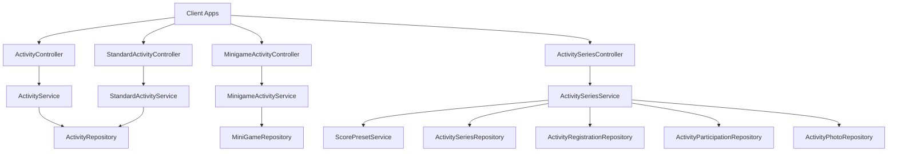

**Diagram sources**
- [ActivityController.java:20-271](file://src/main/java/vn/campuslife/controller/activity/ActivityController.java#L20-L271)
- [StandardActivityController.java:11-36](file://src/main/java/vn/campuslife/controller/activity/StandardActivityController.java#L11-L36)
- [MinigameActivityController.java:11-36](file://src/main/java/vn/campuslife/controller/activity/MinigameActivityController.java#L11-L36)
- [ActivitySeriesController.java:21-533](file://src/main/java/vn/campuslife/controller/activity/series/ActivitySeriesController.java#L21-L533)
- [ActivityService.java:15-72](file://src/main/java/vn/campuslife/service/ActivityService.java#L15-L72)
- [StandardActivityService.java:7-12](file://src/main/java/vn/campuslife/service/StandardActivityService.java#L7-L12)
- [ActivityRepository.java](file://src/main/java/vn/campuslife/repository/ActivityRepository.java)
- [ActivitySeriesRepository.java](file://src/main/java/vn/campuslife/repository/ActivitySeriesRepository.java)
- [ActivityRegistrationRepository.java](file://src/main/java/vn/campuslife/repository/ActivityRegistrationRepository.java)
- [ActivityParticipationRepository.java](file://src/main/java/vn/campuslife/repository/ActivityParticipationRepository.java)
- [ActivityPhotoRepository.java](file://src/main/java/vn/campuslife/repository/ActivityPhotoRepository.java)
- [MiniGameRepository.java](file://src/main/java/vn/campuslife/repository/MiniGameRepository.java)

## Detailed Component Analysis

### Activity Entity and Lifecycle States
The Activity entity captures lifecycle and operational attributes:
- Type: ActivityType distinguishes standard vs. minigame vs. other categories.
- Draft/Published: isDraft toggles visibility; publish/unpublish endpoints manage state transitions.
- Dates: startDate, endDate, registrationStartDate, registrationDeadline define scheduling windows.
- Flags: requiresSubmission, requiresApproval, mandatoryForFacultyStudents, hasPreparation.
- Series linkage: seriesId and seriesOrder for chained activities.
- Metadata: name, description, location, bannerUrl, shareLink, benefits, requirements, contactInfo.
- Check-in: checkInCode for streamlined check-in.
- Auditing: createdBy, lastModifiedBy, createdAt, updatedAt.

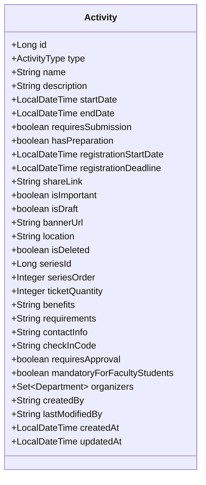

**Diagram sources**
- [Activity.java:21-171](file://src/main/java/vn/campuslife/entity/Activity.java#L21-L171)

**Section sources**
- [Activity.java:21-171](file://src/main/java/vn/campuslife/entity/Activity.java#L21-L171)

### Activity Types and Presets
- ActivityType enumerates supported categories (e.g., SUKIEN, MINIGAME, CONG_TAC_XA_HOI, CHUYEN_DE_DOANH_NGHIEP).
- ActivityPresetCode defines preset configurations for quick setup (EVENT_BASIC, EVENT_WITH_SUBMISSION, ENTERPRISE_SEMINAR_BASIC, ENTERPRISE_SEMINAR_WITH_BONUS, MINIGAME_PASS_ONLY, CUSTOM).
- Controllers expose endpoints to fetch preset definitions and preview preset-derived configurations.

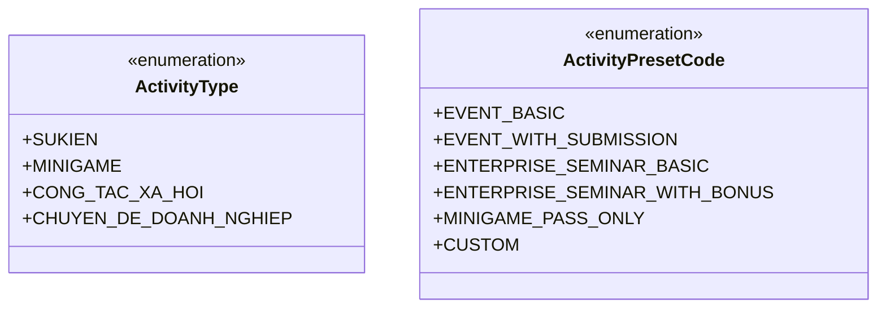

**Diagram sources**
- [ActivityType.java:3-8](file://src/main/java/vn/campuslife/enumeration/ActivityType.java#L3-L8)
- [ActivityPresetCode.java:3-10](file://src/main/java/vn/campuslife/enumeration/ActivityPresetCode.java#L3-L10)

**Section sources**
- [ActivityType.java:3-8](file://src/main/java/vn/campuslife/enumeration/ActivityType.java#L3-L8)
- [ActivityPresetCode.java:3-10](file://src/main/java/vn/campuslife/enumeration/ActivityPresetCode.java#L3-L10)
- [ActivityController.java:52-62](file://src/main/java/vn/campuslife/controller/activity/ActivityController.java#L52-L62)

### Activity Creation Workflow
The creation workflow supports:
- Standard activities via dedicated controller and service.
- Preset-driven creation using preset codes and configurations.
- Validation of required fields and scheduling constraints.
- Publishing/unpublishing and copying operations.

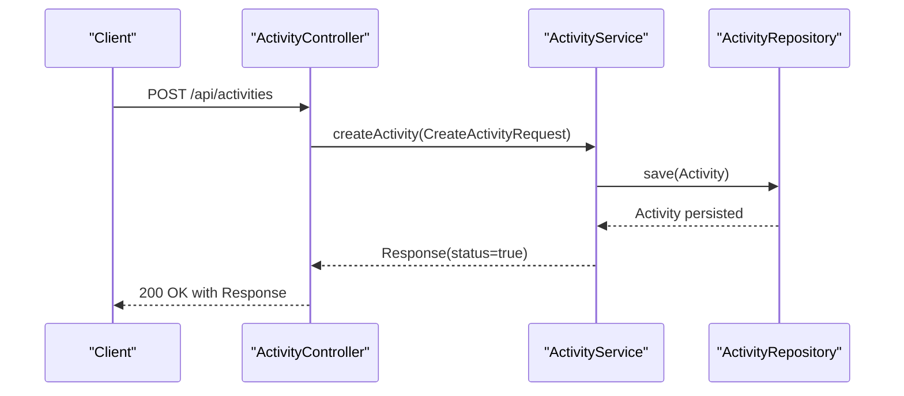

**Diagram sources**
- [ActivityController.java:32-50](file://src/main/java/vn/campuslife/controller/activity/ActivityController.java#L32-L50)
- [ActivityService.java](file://src/main/java/vn/campuslife/service/ActivityService.java#L16)
- [CreateActivityRequest.java:11-40](file://src/main/java/vn/campuslife/model/activity/CreateActivityRequest.java#L11-L40)
- [ActivityRepository.java](file://src/main/java/vn/campuslife/repository/ActivityRepository.java)

**Section sources**
- [ActivityController.java:32-50](file://src/main/java/vn/campuslife/controller/activity/ActivityController.java#L32-L50)
- [ActivityService.java](file://src/main/java/vn/campuslife/service/ActivityService.java#L16)
- [CreateActivityRequest.java:11-40](file://src/main/java/vn/campuslife/model/activity/CreateActivityRequest.java#L11-L40)

### Standard Activity Management
Standard activities are managed via a dedicated controller and service:
- Creation: POST /api/activities/standard with StandardActivityCreateRequest.
- Update: PUT /api/activities/standard/{id} with StandardActivityUpdateRequest.
- Retrieval: GET /api/activities/standard/{id}.

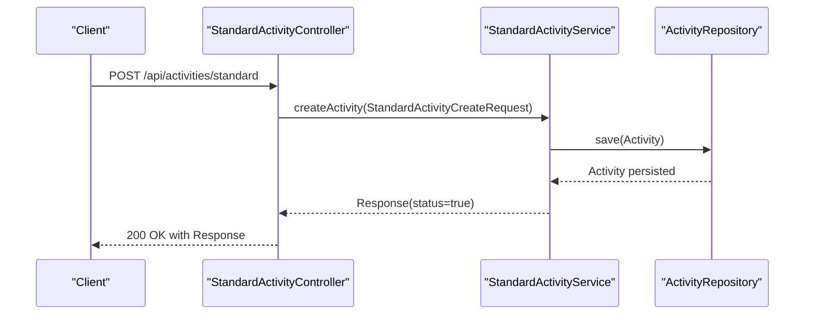

**Diagram sources**
- [StandardActivityController.java:18-22](file://src/main/java/vn/campuslife/controller/activity/StandardActivityController.java#L18-L22)
- [StandardActivityService.java](file://src/main/java/vn/campuslife/service/StandardActivityService.java#L8)
- [StandardActivityCreateRequest.java](file://src/main/java/vn/campuslife/model/activity/StandardActivityCreateRequest.java)
- [ActivityRepository.java](file://src/main/java/vn/campuslife/repository/ActivityRepository.java)

**Section sources**
- [StandardActivityController.java:11-36](file://src/main/java/vn/campuslife/controller/activity/StandardActivityController.java#L11-L36)
- [StandardActivityService.java:7-12](file://src/main/java/vn/campuslife/service/StandardActivityService.java#L7-L12)

### Minigame Activity Management
Minigame activities are handled by a specialized controller and service:
- Creation: POST /api/activities/minigame with MinigameActivityCreateRequest.
- Update: PATCH /api/activities/minigame/{id} with MinigameActivityUpdateRequest.
- Retrieval: GET /api/activities/minigame/{id}.

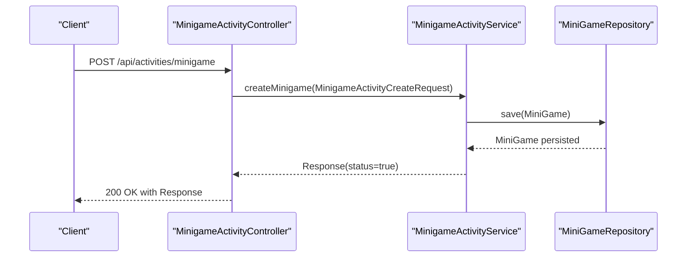

**Diagram sources**
- [MinigameActivityController.java:18-22](file://src/main/java/vn/campuslife/controller/activity/MinigameActivityController.java#L18-L22)
- [MinigameActivityService.java](file://src/main/java/vn/campuslife/service/impl/MinigameActivityServiceImpl.java)
- [MiniGameRepository.java](file://src/main/java/vn/campuslife/repository/MiniGameRepository.java)

**Section sources**
- [MinigameActivityController.java:11-36](file://src/main/java/vn/campuslife/controller/activity/MinigameActivityController.java#L11-L36)

### Series-Based Activity Management
Series enable chaining multiple activities with shared scoring rules and milestones:
- Create series with presets or custom configurations.
- Add child activities to a series with ordering.
- Register students for a series (auto-registers all children).
- Calculate milestone points and track progress per student.
- Admin views series overview, progress, and registration status.

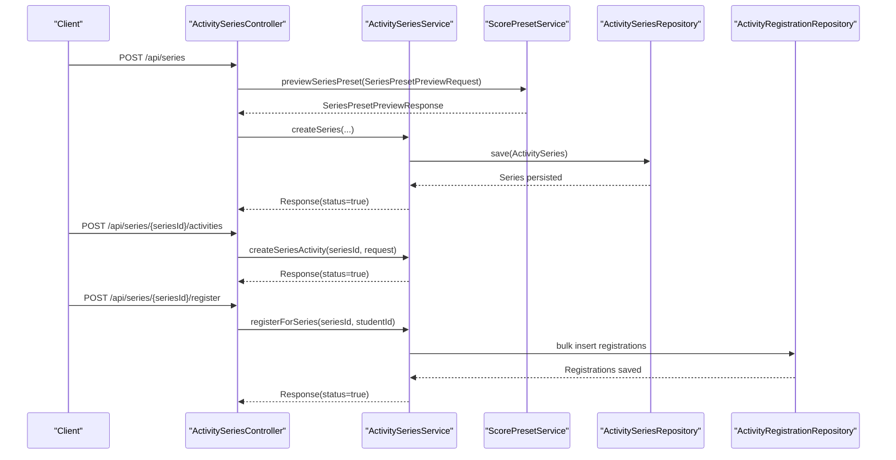

**Diagram sources**
- [ActivitySeriesController.java:48-107](file://src/main/java/vn/campuslife/controller/activity/series/ActivitySeriesController.java#L48-L107)
- [ActivitySeriesController.java:141-147](file://src/main/java/vn/campuslife/controller/activity/series/ActivitySeriesController.java#L141-L147)
- [ActivitySeriesController.java:169-190](file://src/main/java/vn/campuslife/controller/activity/series/ActivitySeriesController.java#L169-L190)
- [ActivitySeriesService.java](file://src/main/java/vn/campuslife/service/impl/ActivitySeriesServiceImpl.java)
- [ActivitySeriesRepository.java](file://src/main/java/vn/campuslife/repository/ActivitySeriesRepository.java)
- [ActivityRegistrationRepository.java](file://src/main/java/vn/campuslife/repository/ActivityRegistrationRepository.java)

**Section sources**
- [ActivitySeriesController.java:21-533](file://src/main/java/vn/campuslife/controller/activity/series/ActivitySeriesController.java#L21-L533)

### Activity Search, Filtering, and Display
Endpoints support:
- Upcoming events search by keyword.
- Monthly activity listings by date range.
- Department-scoped activity retrieval.
- My activities for current user.
- Score-type filtered lists.
- Public activity listing with optional user context.

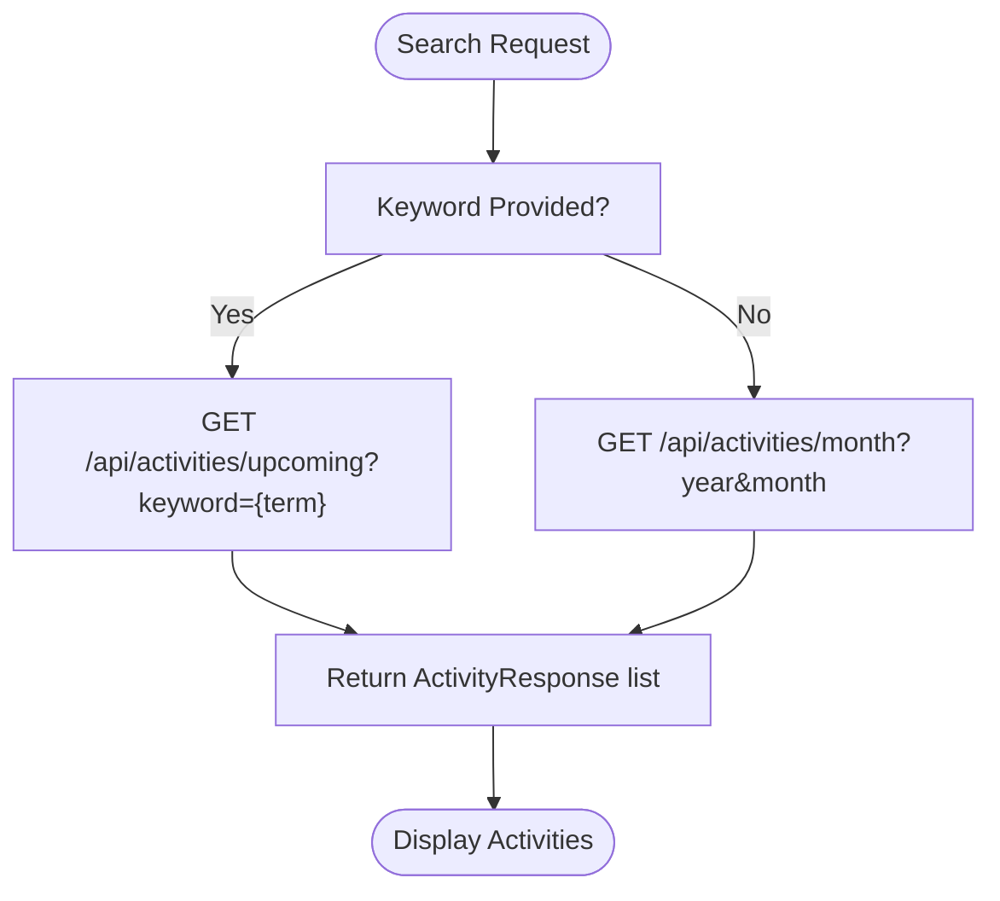

**Diagram sources**
- [ActivityController.java:224-248](file://src/main/java/vn/campuslife/controller/activity/ActivityController.java#L224-L248)
- [ActivityService.java:36-63](file://src/main/java/vn/campuslife/service/ActivityService.java#L36-L63)

**Section sources**
- [ActivityController.java:224-248](file://src/main/java/vn/campuslife/controller/activity/ActivityController.java#L224-L248)
- [ActivityService.java:18-71](file://src/main/java/vn/campuslife/service/ActivityService.java#L18-L71)

### Administrative Controls
Administrative capabilities include:
- Publish/unpublish activities.
- Copy activities with optional day offset.
- Backfill missing check-in codes.
- Manage presets and previews.
- View series overview and progress.

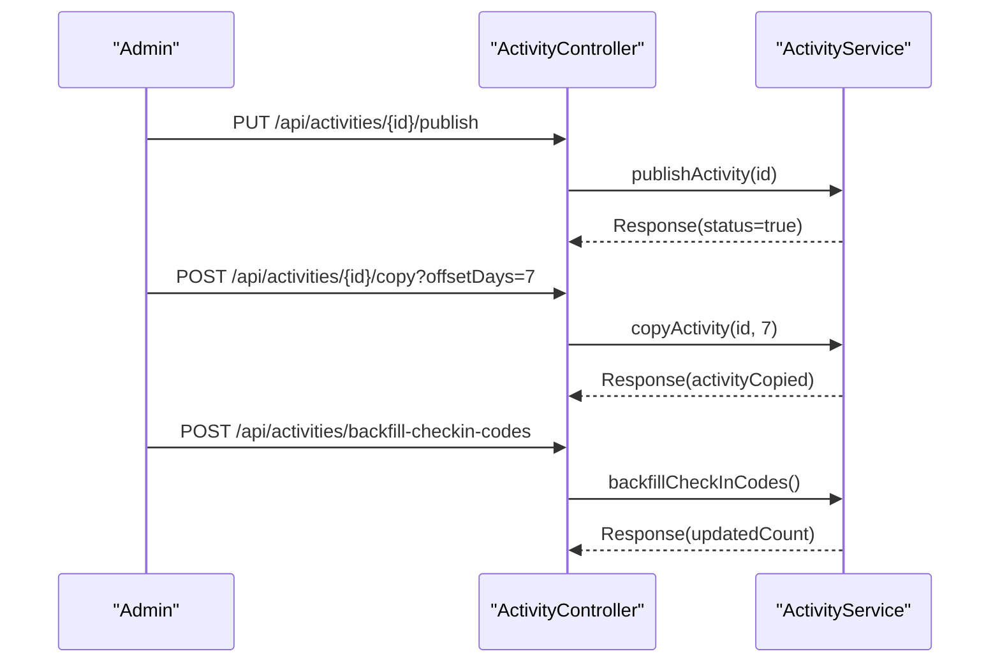

**Diagram sources**
- [ActivityController.java:124-140](file://src/main/java/vn/campuslife/controller/activity/ActivityController.java#L124-L140)
- [ActivityController.java:258-268](file://src/main/java/vn/campuslife/controller/activity/ActivityController.java#L258-L268)
- [ActivityService.java:54-70](file://src/main/java/vn/campuslife/service/ActivityService.java#L54-L70)

**Section sources**
- [ActivityController.java:124-140](file://src/main/java/vn/campuslife/controller/activity/ActivityController.java#L124-L140)
- [ActivityController.java:258-268](file://src/main/java/vn/campuslife/controller/activity/ActivityController.java#L258-L268)

### Registration and Participation
Registration and participation endpoints:
- Registration: POST /api/activities/{id}/register with ActivityRegistrationRequest.
- Participation: POST /api/activities/{id}/participate with ActivityParticipationRequest.
- Retrieve participation details and responses.

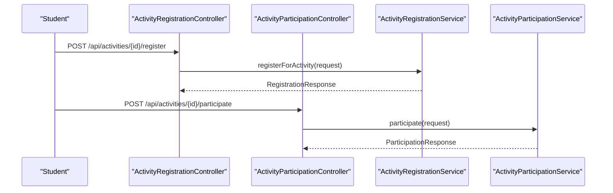

**Diagram sources**
- [ActivityRegistrationController.java](file://src/main/java/vn/campuslife/controller/activity/ActivityRegistrationController.java)
- [ActivityParticipationController.java](file://src/main/java/vn/campuslife/controller/activity/ActivityParticipationController.java)
- [ActivityRegistrationServiceImpl.java](file://src/main/java/vn/campuslife/service/impl/ActivityRegistrationServiceImpl.java)
- [ActivityParticipationServiceImpl.java](file://src/main/java/vn/campuslife/service/impl/ActivityParticipationServiceImpl.java)

**Section sources**
- [ActivityRegistrationController.java](file://src/main/java/vn/campuslife/controller/activity/ActivityRegistrationController.java)
- [ActivityParticipationController.java](file://src/main/java/vn/campuslife/controller/activity/ActivityParticipationController.java)

### Minigame Quiz Flow
Minigame activities include quizzes with attempts and answers:
- Create minigame with quiz questions and options.
- Students attempt quizzes with max-attempt limits.
- Answers recorded and scored.

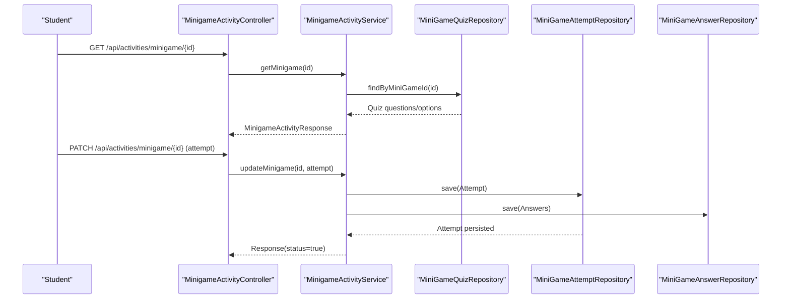

**Diagram sources**
- [MinigameActivityController.java:24-34](file://src/main/java/vn/campuslife/controller/activity/MinigameActivityController.java#L24-L34)
- [MinigameActivityServiceImpl.java](file://src/main/java/vn/campuslife/service/impl/MinigameActivityServiceImpl.java)
- [MiniGameQuizRepository.java](file://src/main/java/vn/campuslife/repository/MiniGameQuizRepository.java)
- [MiniGameAttemptRepository.java](file://src/main/java/vn/campuslife/repository/MiniGameAttemptRepository.java)
- [MiniGameAnswerRepository.java](file://src/main/java/vn/campuslife/repository/MiniGameAnswerRepository.java)

**Section sources**
- [MinigameActivityController.java:11-36](file://src/main/java/vn/campuslife/controller/activity/MinigameActivityController.java#L11-L36)

### Activity Recommendation
Recommendation endpoints surface suggested activities for users.

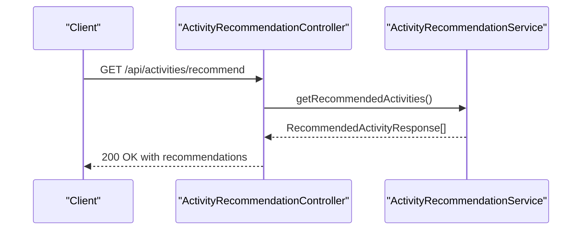

**Diagram sources**
- [ActivityRecommendationController.java](file://src/main/java/vn/campuslife/controller/activity/ActivityRecommendationController.java)
- [ActivityRecommendationServiceImpl.java](file://src/main/java/vn/campuslife/service/impl/ActivityRecommendationServiceImpl.java)

**Section sources**
- [ActivityRecommendationController.java](file://src/main/java/vn/campuslife/controller/activity/ActivityRecommendationController.java)

## Dependency Analysis
- Controllers depend on services for business operations.
- Services depend on repositories for persistence and on validators for input checks.
- Entities depend on enumerations for typed fields.
- Migrations evolve schema to support series and minigame features.

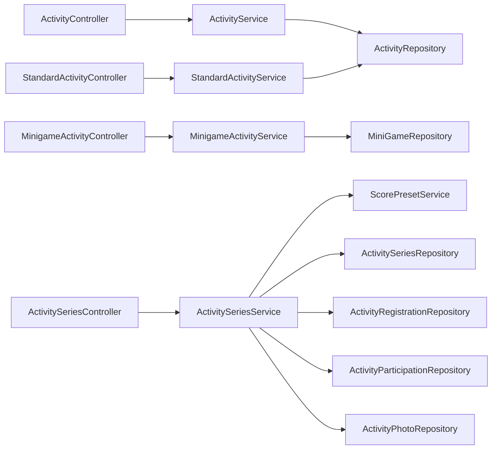

**Diagram sources**
- [ActivityController.java:20-271](file://src/main/java/vn/campuslife/controller/activity/ActivityController.java#L20-L271)
- [StandardActivityController.java:11-36](file://src/main/java/vn/campuslife/controller/activity/StandardActivityController.java#L11-L36)
- [MinigameActivityController.java:11-36](file://src/main/java/vn/campuslife/controller/activity/MinigameActivityController.java#L11-L36)
- [ActivitySeriesController.java:21-533](file://src/main/java/vn/campuslife/controller/activity/series/ActivitySeriesController.java#L21-L533)
- [ActivityService.java:15-72](file://src/main/java/vn/campuslife/service/ActivityService.java#L15-L72)
- [StandardActivityService.java:7-12](file://src/main/java/vn/campuslife/service/StandardActivityService.java#L7-L12)
- [ActivityRepository.java](file://src/main/java/vn/campuslife/repository/ActivityRepository.java)
- [ActivitySeriesRepository.java](file://src/main/java/vn/campuslife/repository/ActivitySeriesRepository.java)
- [ActivityRegistrationRepository.java](file://src/main/java/vn/campuslife/repository/ActivityRegistrationRepository.java)
- [ActivityParticipationRepository.java](file://src/main/java/vn/campuslife/repository/ActivityParticipationRepository.java)
- [ActivityPhotoRepository.java](file://src/main/java/vn/campuslife/repository/ActivityPhotoRepository.java)
- [MiniGameRepository.java](file://src/main/java/vn/campuslife/repository/MiniGameRepository.java)

**Section sources**
- [ActivityController.java:20-271](file://src/main/java/vn/campuslife/controller/activity/ActivityController.java#L20-L271)
- [ActivitySeriesController.java:21-533](file://src/main/java/vn/campuslife/controller/activity/series/ActivitySeriesController.java#L21-L533)

## Performance Considerations
- Indexing: Ensure database indexes on frequently queried columns (e.g., seriesId, registrationStartDate/Deadline, scoreType, checkInCode).
- Pagination: Use pagination for series progress and registration lists to avoid large payloads.
- Caching: Cache preset definitions and common lookups (e.g., department-scoped activities).
- Asynchronous operations: Offload heavy computations (e.g., series progress aggregation) to background jobs.
- DTO mapping: Prefer lightweight response DTOs to reduce serialization overhead.

## Troubleshooting Guide
Common issues and resolutions:
- Scheduling conflicts: Validate overlapping activity dates and registration windows during creation/update. Enforce uniqueness of check-in codes.
- Registration errors: Verify registration status enums and ensure prerequisite conditions (approval, capacity) are met.
- Series misconfiguration: Confirm milestone points JSON serialization and score type validity before series creation/update.
- Minigame attempts: Respect max-attempt limits and ensure quiz questions/options are correctly linked.
- Audit and reminders: Review audit logs and reminder schedule entries for discrepancies.

**Section sources**
- [ActivityValidator.java](file://src/main/java/vn/campuslife/service/validator/ActivityValidator.java)
- [MinigameActivityValidator.java](file://src/main/java/vn/campuslife/service/validator/MinigameActivityValidator.java)
- [ActivitySeriesValidator.java](file://src/main/java/vn/campuslife/service/validator/ActivitySeriesValidator.java)
- [AuditLog.java](file://src/main/java/vn/campuslife/entity/AuditLog.java)
- [ReminderSchedule.java](file://src/main/java/vn/campuslife/entity/ReminderSchedule.java)

## Conclusion
The activity lifecycle management system provides robust support for standard, series-based, and minigame activities. It offers flexible creation via presets, comprehensive administrative controls, and rich search/filtering capabilities. Proper use of types, presets, and validation ensures reliable scheduling and participation experiences.

## Appendices

### Activity Entity Model
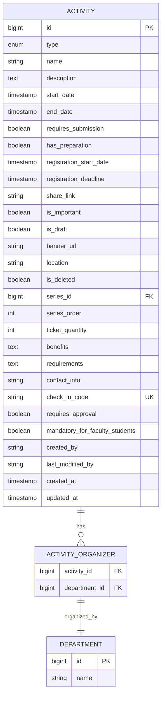

**Diagram sources**
- [Activity.java:21-171](file://src/main/java/vn/campuslife/entity/Activity.java#L21-L171)
- [Department.java](file://src/main/java/vn/campuslife/entity/Department.java)
- [ActivityOrganizer.java](file://src/main/java/vn/campuslife/entity/ActivityOrganizer.java)

**Section sources**
- [Activity.java:21-171](file://src/main/java/vn/campuslife/entity/Activity.java#L21-L171)

### Request/Response Models
Key models used across lifecycle management:
- CreateActivityRequest: Fields for name, type, preset, scheduling, flags, organizers, and score rules.
- StandardActivityCreateRequest/UpdateRequest: Dedicated models for standard activity operations.
- ActivityResponse/StandardActivityResponse: Presentation models for activity data.
- ActivityPresetConfig/PreviewRequest/PreviewResponse: Preset configuration and preview contracts.
- ActivityParticipation/Registration models: Requests and responses for participation and registration.

**Section sources**
- [CreateActivityRequest.java:11-40](file://src/main/java/vn/campuslife/model/activity/CreateActivityRequest.java#L11-L40)
- [StandardActivityCreateRequest.java](file://src/main/java/vn/campuslife/model/activity/StandardActivityCreateRequest.java)
- [StandardActivityUpdateRequest.java](file://src/main/java/vn/campuslife/model/activity/StandardActivityUpdateRequest.java)
- [ActivityResponse.java](file://src/main/java/vn/campuslife/model/activity/ActivityResponse.java)
- [StandardActivityResponse.java](file://src/main/java/vn/campuslife/model/activity/StandardActivityResponse.java)
- [ActivityPresetConfig.java](file://src/main/java/vn/campuslife/model/activity/ActivityPresetConfig.java)
- [ActivityPresetPreviewRequest.java](file://src/main/java/vn/campuslife/model/activity/ActivityPresetPreviewRequest.java)
- [ActivityPresetPreviewResponse.java](file://src/main/java/vn/campuslife/model/activity/ActivityPresetPreviewResponse.java)
- [ActivityParticipationRequest.java](file://src/main/java/vn/campuslife/model/activity/ActivityParticipationRequest.java)
- [ActivityParticipationResponse.java](file://src/main/java/vn/campuslife/model/activity/ActivityParticipationResponse.java)
- [ActivityParticipationDetailResponse.java](file://src/main/java/vn/campuslife/model/activity/ActivityParticipationDetailResponse.java)
- [ActivityRegistrationRequest.java](file://src/main/java/vn/campuslife/model/activity/ActivityRegistrationRequest.java)
- [ActivityRegistrationResponse.java](file://src/main/java/vn/campuslife/model/activity/ActivityRegistrationResponse.java)
- [ActivitySummaryResponse.java](file://src/main/java/vn/campuslife/model/activity/ActivitySummaryResponse.java)
- [ActivityPhotoResponse.java](file://src/main/java/vn/campuslife/model/activity/ActivityPhotoResponse.java)

### Database Schema Evolution
Relevant migrations supporting activity lifecycle features:
- Series tables and relationships.
- Minigame tables and quiz/question/option/answer structures.
- Series registration linkage and max attempts.
- Check-in code addition and activity score refactors.

**Section sources**
- [V1003__create_activity_series_tables.sql](file://db/migration/V1003__create_activity_series_tables.sql)
- [V1004__create_minigame_tables.sql](file://db/migration/V1004__create_minigame_tables.sql)
- [V1011__add_series_id_to_activity_registrations.sql](file://db/migration/V1011__add_series_id_to_activity_registrations.sql)
- [V1012__add_max_attempts_to_mini_games.sql](file://db/migration/V1012__add_max_attempts_to_mini_games.sql)
- [V1014__add_check_in_code_to_activities.sql](file://db/migration/V1014__add_check_in_code_to_activities.sql)
- [V1025__activity_score_refactor.sql](file://db/migration/V1025__activity_score_refactor.sql)
- [V1025__create_reminder_schedule_table.sql](file://db/migration/V1025__create_reminder_schedule_table.sql)
- [V1026__backfill_activity_score_rules.sql](file://db/migration/V1026__backfill_activity_score_rules.sql)
- [V1027__backend_audit_improvements.sql](file://db/migration/V1027__backend_audit_improvements.sql)

### Administrative and Scheduler Components
- Reminder scheduling configuration and jobs for lifecycle notifications.
- Score rule engine and preset services for series scoring.
- Audit logging for compliance and traceability.

**Section sources**
- [ReminderSchedulingConfig.java](file://src/main/java/vn/campuslife/config/ReminderSchedulingConfig.java)
- [SchedulingConfig.java](file://src/main/java/vn/campuslife/config/SchedulingConfig.java)
- [ReminderQuartzJob.java](file://src/main/java/vn/campuslife/job/ReminderQuartzJob.java)
- [ScoreRuleEngineImpl.java](file://src/main/java/vn/campuslife/service/ScoreRuleEngineImpl.java)
- [ScorePresetServiceImpl.java](file://src/main/java/vn/campuslife/service/ScorePresetServiceImpl.java)
- [AuditLog.java](file://src/main/java/vn/campuslife/entity/AuditLog.java)