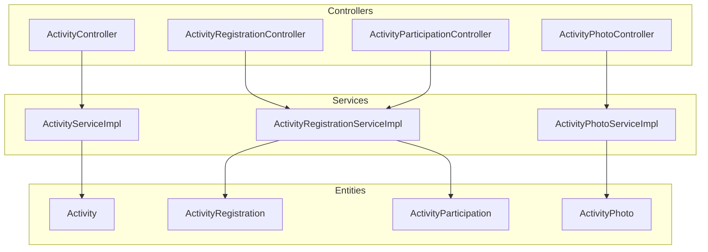
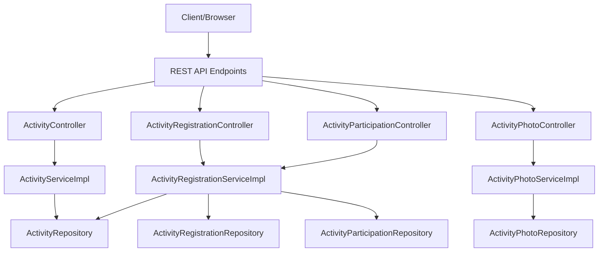
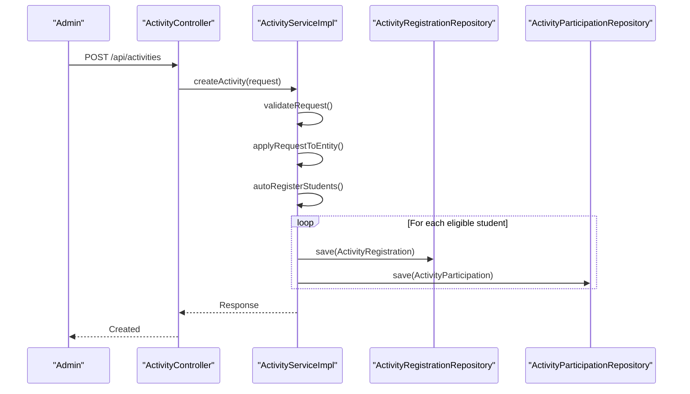
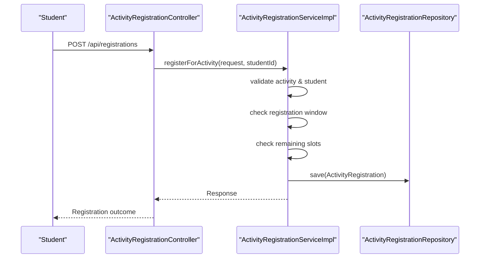
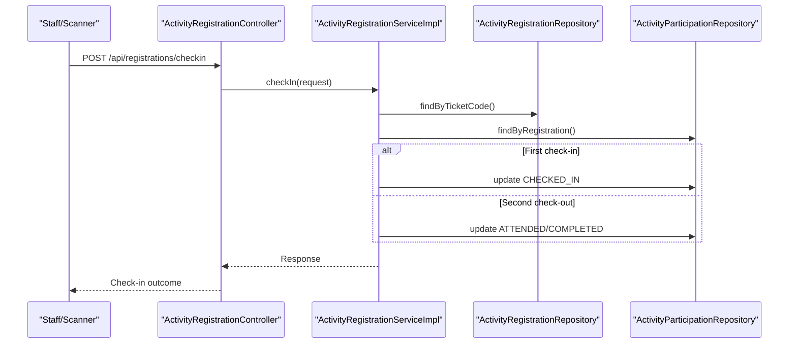
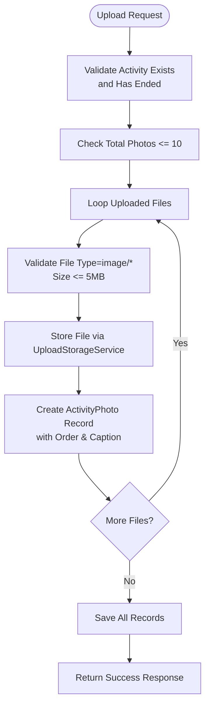
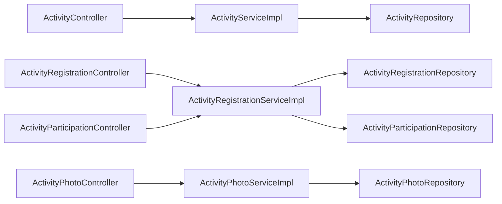

# Activity Management System

<cite>
**Referenced Files in This Document**
- [Activity.java](file://src/main/java/vn/campuslife/entity/Activity.java)
- [ActivityRegistration.java](file://src/main/java/vn/campuslife/entity/ActivityRegistration.java)
- [ActivityParticipation.java](file://src/main/java/vn/campuslife/entity/ActivityParticipation.java)
- [ActivityPhoto.java](file://src/main/java/vn/campuslife/entity/ActivityPhoto.java)
- [ActivityType.java](file://src/main/java/vn/campuslife/enumeration/ActivityType.java)
- [RegistrationStatus.java](file://src/main/java/vn/campuslife/enumeration/RegistrationStatus.java)
- [ActivityController.java](file://src/main/java/vn/campuslife/controller/activity/ActivityController.java)
- [ActivityRegistrationController.java](file://src/main/java/vn/campuslife/controller/activity/ActivityRegistrationController.java)
- [ActivityParticipationController.java](file://src/main/java/vn/campuslife/controller/activity/ActivityParticipationController.java)
- [ActivityPhotoController.java](file://src/main/java/vn/campuslife/controller/activity/ActivityPhotoController.java)
- [ActivityServiceImpl.java](file://src/main/java/vn/campuslife/service/impl/ActivityServiceImpl.java)
- [ActivityRegistrationServiceImpl.java](file://src/main/java/vn/campuslife/service/impl/ActivityRegistrationServiceImpl.java)
- [ActivityPhotoServiceImpl.java](file://src/main/java/vn/campuslife/service/impl/ActivityPhotoServiceImpl.java)
- [CreateActivityRequest.java](file://src/main/java/vn/campuslife/model/activity/CreateActivityRequest.java)
- [ActivityRegistrationRequest.java](file://src/main/java/vn/campuslife/model/activity/ActivityRegistrationRequest.java)
- [ActivityParticipationRequest.java](file://src/main/java/vn/campuslife/model/activity/ActivityParticipationRequest.java)
</cite>

## Table of Contents
1. [Introduction](#introduction)
2. [Project Structure](#project-structure)
3. [Core Components](#core-components)
4. [Architecture Overview](#architecture-overview)
5. [Detailed Component Analysis](#detailed-component-analysis)
6. [Dependency Analysis](#dependency-analysis)
7. [Performance Considerations](#performance-considerations)
8. [Troubleshooting Guide](#troubleshooting-guide)
9. [Conclusion](#conclusion)
10. [Appendices](#appendices)

## Introduction
This document provides comprehensive documentation for the Activity Management System, focusing on activity lifecycle management, registration workflows, check-in systems, participant tracking, and photo/media management. It explains how activities are created, scheduled, approved, and monitored; how students register and participate; how check-in/out is handled; and how photos are managed post-event. Practical examples and common scenarios are included to guide administrators, organizers, and developers.

## Project Structure
The system follows a layered architecture with clear separation of concerns:
- Entities define the domain model for activities, registrations, participations, and photos.
- Controllers expose REST endpoints for CRUD operations, registration, check-in, and photo management.
- Services encapsulate business logic for activity lifecycle, registration, participation, and photo handling.
- Repositories manage persistence operations.
- Models represent request/response DTOs for APIs.

**Diagram sources**
- [ActivityController.java:20-271](file://src/main/java/vn/campuslife/controller/activity/ActivityController.java#L20-L271)
- [ActivityRegistrationController.java:25-392](file://src/main/java/vn/campuslife/controller/activity/ActivityRegistrationController.java#L25-L392)
- [ActivityParticipationController.java:13-55](file://src/main/java/vn/campuslife/controller/activity/ActivityParticipationController.java#L13-L55)
- [ActivityPhotoController.java:15-108](file://src/main/java/vn/campuslife/controller/activity/ActivityPhotoController.java#L15-L108)
- [ActivityServiceImpl.java:62-950](file://src/main/java/vn/campuslife/service/impl/ActivityServiceImpl.java#L62-L950)
- [ActivityRegistrationServiceImpl.java:33-1139](file://src/main/java/vn/campuslife/service/impl/ActivityRegistrationServiceImpl.java#L33-L1139)
- [ActivityPhotoServiceImpl.java:26-228](file://src/main/java/vn/campuslife/service/impl/ActivityPhotoServiceImpl.java#L26-L228)
- [Activity.java:21-171](file://src/main/java/vn/campuslife/entity/Activity.java#L21-L171)
- [ActivityRegistration.java:12-47](file://src/main/java/vn/campuslife/entity/ActivityRegistration.java#L12-L47)
- [ActivityParticipation.java:12-43](file://src/main/java/vn/campuslife/entity/ActivityParticipation.java#L12-L43)
- [ActivityPhoto.java:15-62](file://src/main/java/vn/campuslife/entity/ActivityPhoto.java#L15-L62)

**Section sources**
- [ActivityController.java:20-271](file://src/main/java/vn/campuslife/controller/activity/ActivityController.java#L20-L271)
- [ActivityRegistrationController.java:25-392](file://src/main/java/vn/campuslife/controller/activity/ActivityRegistrationController.java#L25-L392)
- [ActivityParticipationController.java:13-55](file://src/main/java/vn/campuslife/controller/activity/ActivityParticipationController.java#L13-L55)
- [ActivityPhotoController.java:15-108](file://src/main/java/vn/campuslife/controller/activity/ActivityPhotoController.java#L15-L108)

## Core Components
This section outlines the primary domain entities and their roles in the system.

- Activity: Represents an event with scheduling, registration windows, capacity, approval requirements, and organizational units. It supports both standalone events and series-linked activities.
- ActivityRegistration: Tracks student registration with status (pending/approved/rejected/cancelled/waitlist/attended) and associated ticket code.
- ActivityParticipation: Captures attendance and completion outcomes, including check-in/check-out timestamps, participation type, and completion status.
- ActivityPhoto: Manages uploaded images for activities with ordering, captions, and soft deletion.

Key enumerations:
- ActivityType: Defines supported activity categories.
- RegistrationStatus: Enumerates registration lifecycle states.

**Section sources**
- [Activity.java:21-171](file://src/main/java/vn/campuslife/entity/Activity.java#L21-L171)
- [ActivityRegistration.java:12-47](file://src/main/java/vn/campuslife/entity/ActivityRegistration.java#L12-L47)
- [ActivityParticipation.java:12-43](file://src/main/java/vn/campuslife/entity/ActivityParticipation.java#L12-L43)
- [ActivityPhoto.java:15-62](file://src/main/java/vn/campuslife/entity/ActivityPhoto.java#L15-L62)
- [ActivityType.java:3-8](file://src/main/java/vn/campuslife/enumeration/ActivityType.java#L3-L8)
- [RegistrationStatus.java:3-10](file://src/main/java/vn/campuslife/enumeration/RegistrationStatus.java#L3-L10)

## Architecture Overview
The system employs a classic MVC-style layered architecture:
- Presentation Layer: Controllers handle HTTP requests and return standardized Response DTOs.
- Business Logic Layer: Services implement workflows for activity creation/publishing, registration, check-in, and photo management.
- Persistence Layer: Repositories abstract database operations; entities map to relational tables.
- Security: Controllers rely on Spring Security for authentication and role-based access control.

**Diagram sources**
- [ActivityController.java:20-271](file://src/main/java/vn/campuslife/controller/activity/ActivityController.java#L20-L271)
- [ActivityRegistrationController.java:25-392](file://src/main/java/vn/campuslife/controller/activity/ActivityRegistrationController.java#L25-L392)
- [ActivityParticipationController.java:13-55](file://src/main/java/vn/campuslife/controller/activity/ActivityParticipationController.java#L13-L55)
- [ActivityPhotoController.java:15-108](file://src/main/java/vn/campuslife/controller/activity/ActivityPhotoController.java#L15-L108)
- [ActivityServiceImpl.java:62-950](file://src/main/java/vn/campuslife/service/impl/ActivityServiceImpl.java#L62-L950)
- [ActivityRegistrationServiceImpl.java:33-1139](file://src/main/java/vn/campuslife/service/impl/ActivityRegistrationServiceImpl.java#L33-L1139)
- [ActivityPhotoServiceImpl.java:26-228](file://src/main/java/vn/campuslife/service/impl/ActivityPhotoServiceImpl.java#L26-L228)

## Detailed Component Analysis

### Activity Lifecycle Management
Activity lifecycle spans creation, publishing/unpublishing, copying, and deletion. Activities support presets, auto-registration for important/mandatory categories, and score rule integration.

**Diagram sources**
- [ActivityController.java:32-50](file://src/main/java/vn/campuslife/controller/activity/ActivityController.java#L32-L50)
- [ActivityServiceImpl.java:82-132](file://src/main/java/vn/campuslife/service/impl/ActivityServiceImpl.java#L82-L132)
- [ActivityRegistration.java:12-47](file://src/main/java/vn/campuslife/entity/ActivityRegistration.java#L12-L47)
- [ActivityParticipation.java:12-43](file://src/main/java/vn/campuslife/entity/ActivityParticipation.java#L12-L43)

Key capabilities:
- Preset application and preview for activity configurations.
- Publishing/unpublishing toggles visibility and triggers auto-registration for eligible students.
- Copying activities with optional date offset and score rule replication.
- Draft vs published filtering for non-admin users.

**Section sources**
- [ActivityController.java:52-145](file://src/main/java/vn/campuslife/controller/activity/ActivityController.java#L52-L145)
- [ActivityServiceImpl.java:82-244](file://src/main/java/vn/campuslife/service/impl/ActivityServiceImpl.java#L82-L244)
- [CreateActivityRequest.java:11-40](file://src/main/java/vn/campuslife/model/activity/CreateActivityRequest.java#L11-L40)

### Registration Workflows
Registration enforces timing windows, capacity limits, and approval policies. It supports waitlist entries when capacity is reached.

**Diagram sources**
- [ActivityRegistrationController.java:39-56](file://src/main/java/vn/campuslife/controller/activity/ActivityRegistrationController.java#L39-L56)
- [ActivityRegistrationServiceImpl.java:54-175](file://src/main/java/vn/campuslife/service/impl/ActivityRegistrationServiceImpl.java#L54-L175)
- [ActivityRegistrationRequest.java:11-18](file://src/main/java/vn/campuslife/model/activity/ActivityRegistrationRequest.java#L11-L18)

Additional features:
- Cancel registration for pending statuses.
- Admin approval workflow with status updates and reminders synchronization.
- Waitlist enrollment when capacity is full.
- Reporting and filtering by status.

**Section sources**
- [ActivityRegistrationController.java:58-115](file://src/main/java/vn/campuslife/controller/activity/ActivityRegistrationController.java#L58-L115)
- [ActivityRegistrationServiceImpl.java:177-366](file://src/main/java/vn/campuslife/service/impl/ActivityRegistrationServiceImpl.java#L177-L366)
- [ActivityRegistrationRequest.java:11-18](file://src/main/java/vn/campuslife/model/activity/ActivityRegistrationRequest.java#L11-L18)

### Check-In Systems and Participant Tracking
The system supports two check-in modes: ticket code-based and QR code-based. It tracks check-in/check-out, attendance completion, and submission-based completion.

**Diagram sources**
- [ActivityRegistrationController.java:217-245](file://src/main/java/vn/campuslife/controller/activity/ActivityRegistrationController.java#L217-L245)
- [ActivityRegistrationServiceImpl.java:402-482](file://src/main/java/vn/campuslife/service/impl/ActivityRegistrationServiceImpl.java#L402-L482)
- [ActivityParticipationRequest.java:13-27](file://src/main/java/vn/campuslife/model/activity/ActivityParticipationRequest.java#L13-L27)

Participant management highlights:
- Grace period after event end for check-out.
- Completion grading with submission verification.
- Series progress updates upon milestone completion.
- Participation report generation for attendance tracking.

**Section sources**
- [ActivityRegistrationController.java:185-211](file://src/main/java/vn/campuslife/controller/activity/ActivityRegistrationController.java#L185-L211)
- [ActivityRegistrationServiceImpl.java:484-637](file://src/main/java/vn/campuslife/service/impl/ActivityRegistrationServiceImpl.java#L484-L637)
- [ActivityParticipationController.java:19-52](file://src/main/java/vn/campuslife/controller/activity/ActivityParticipationController.java#L19-L52)

### Photo Management and Media Handling
Photos are uploaded after an activity ends, with validation for file type, size, and quantity limits. Photos support captions and ordering.

**Diagram sources**
- [ActivityPhotoController.java:28-48](file://src/main/java/vn/campuslife/controller/activity/ActivityPhotoController.java#L28-L48)
- [ActivityPhotoServiceImpl.java:39-119](file://src/main/java/vn/campuslife/service/impl/ActivityPhotoServiceImpl.java#L39-L119)

**Section sources**
- [ActivityPhotoController.java:24-105](file://src/main/java/vn/campuslife/controller/activity/ActivityPhotoController.java#L24-L105)
- [ActivityPhotoServiceImpl.java:39-228](file://src/main/java/vn/campuslife/service/impl/ActivityPhotoServiceImpl.java#L39-L228)

### Activity Types, Scheduling, Capacity, and Approval
- Activity types are defined via an enumeration supporting various categories.
- Scheduling includes start/end dates, registration windows, and location.
- Capacity management uses ticketQuantity with approval gating; waitlist is supported when full.
- Approval workflows differentiate between auto-approved and pending approvals.

**Section sources**
- [ActivityType.java:3-8](file://src/main/java/vn/campuslife/enumeration/ActivityType.java#L3-L8)
- [Activity.java:35-143](file://src/main/java/vn/campuslife/entity/Activity.java#L35-L143)
- [ActivityRegistrationServiceImpl.java:994-1000](file://src/main/java/vn/campuslife/service/impl/ActivityRegistrationServiceImpl.java#L994-L1000)

### Practical Examples and Workflows
- Creating an activity with preset configuration, auto-registration for important events, and score rules.
- Student registration during open window with automatic ticket code generation and approval outcome.
- Check-in via ticket code or QR code, followed by check-out and completion grading.
- Uploading photos after event end with captions and ordering adjustments.

[No sources needed since this section aggregates previously analyzed workflows]

## Dependency Analysis
The system exhibits low coupling between controllers and services, with clear repository boundaries. Services depend on repositories and external services (notification, reminders, storage). Entities maintain straightforward relationships with minimal cross-service coupling.

**Diagram sources**
- [ActivityController.java:20-271](file://src/main/java/vn/campuslife/controller/activity/ActivityController.java#L20-L271)
- [ActivityRegistrationController.java:25-392](file://src/main/java/vn/campuslife/controller/activity/ActivityRegistrationController.java#L25-L392)
- [ActivityParticipationController.java:13-55](file://src/main/java/vn/campuslife/controller/activity/ActivityParticipationController.java#L13-L55)
- [ActivityPhotoController.java:15-108](file://src/main/java/vn/campuslife/controller/activity/ActivityPhotoController.java#L15-L108)
- [ActivityServiceImpl.java:62-950](file://src/main/java/vn/campuslife/service/impl/ActivityServiceImpl.java#L62-L950)
- [ActivityRegistrationServiceImpl.java:33-1139](file://src/main/java/vn/campuslife/service/impl/ActivityRegistrationServiceImpl.java#L33-L1139)
- [ActivityPhotoServiceImpl.java:26-228](file://src/main/java/vn/campuslife/service/impl/ActivityPhotoServiceImpl.java#L26-L228)

**Section sources**
- [ActivityServiceImpl.java:62-950](file://src/main/java/vn/campuslife/service/impl/ActivityServiceImpl.java#L62-L950)
- [ActivityRegistrationServiceImpl.java:33-1139](file://src/main/java/vn/campuslife/service/impl/ActivityRegistrationServiceImpl.java#L33-L1139)
- [ActivityPhotoServiceImpl.java:26-228](file://src/main/java/vn/campuslife/service/impl/ActivityPhotoServiceImpl.java#L26-L228)

## Performance Considerations
- Batch operations: Auto-registration creates registrations and participations in bulk to minimize round-trips.
- Existence checks: Batch lookup of existing registrations prevents N+1 queries during auto-registration.
- Grace period handling: Check-in closed-at calculation avoids repeated computations.
- Photo upload limits: Enforced caps reduce storage overhead and improve retrieval performance.
- Indexing recommendations: Consider indexing on activity registration fields (activity_id, student_id, status, ticket_code) and participation fields (registration_id) for frequent lookups.

[No sources needed since this section provides general guidance]

## Troubleshooting Guide
Common issues and resolutions:
- Registration errors: Verify registration windows, capacity limits, and approval requirements. Use validation endpoints to confirm submission requirements and registration status.
- Check-in failures: Confirm activity is published, participation exists, and check-in/out windows are respected. Use ticket code validation to preview eligibility.
- Photo upload failures: Ensure the activity has ended, file types are images, sizes are under 5MB, and total photos remain within the limit.
- Participation backfill: Use the backfill endpoint to create missing participation records for approved registrations.

**Section sources**
- [ActivityRegistrationController.java:185-211](file://src/main/java/vn/campuslife/controller/activity/ActivityRegistrationController.java#L185-L211)
- [ActivityRegistrationServiceImpl.java:714-781](file://src/main/java/vn/campuslife/service/impl/ActivityRegistrationServiceImpl.java#L714-L781)
- [ActivityPhotoController.java:28-48](file://src/main/java/vn/campuslife/controller/activity/ActivityPhotoController.java#L28-L48)
- [ActivityPhotoServiceImpl.java:39-119](file://src/main/java/vn/campuslife/service/impl/ActivityPhotoServiceImpl.java#L39-L119)

## Conclusion
The Activity Management System provides a robust foundation for managing campus activities from creation to post-event engagement. Its modular design, clear workflows, and built-in capacity and approval controls enable efficient administration and reliable participant experiences. Extending the system can focus on enhancing reporting, integrating analytics, and optimizing media handling for scale.

[No sources needed since this section summarizes without analyzing specific files]

## Appendices

### API Reference Highlights
- Activity endpoints: Create, publish/unpublish, copy, list, search by month, and presets.
- Registration endpoints: Register, cancel, list registrations, update status, check-in (ticket code and QR), grading, and reports.
- Photo endpoints: Upload, list, delete (soft), reorder.

**Section sources**
- [ActivityController.java:32-248](file://src/main/java/vn/campuslife/controller/activity/ActivityController.java#L32-L248)
- [ActivityRegistrationController.java:39-392](file://src/main/java/vn/campuslife/controller/activity/ActivityRegistrationController.java#L39-L392)
- [ActivityPhotoController.java:28-105](file://src/main/java/vn/campuslife/controller/activity/ActivityPhotoController.java#L28-L105)