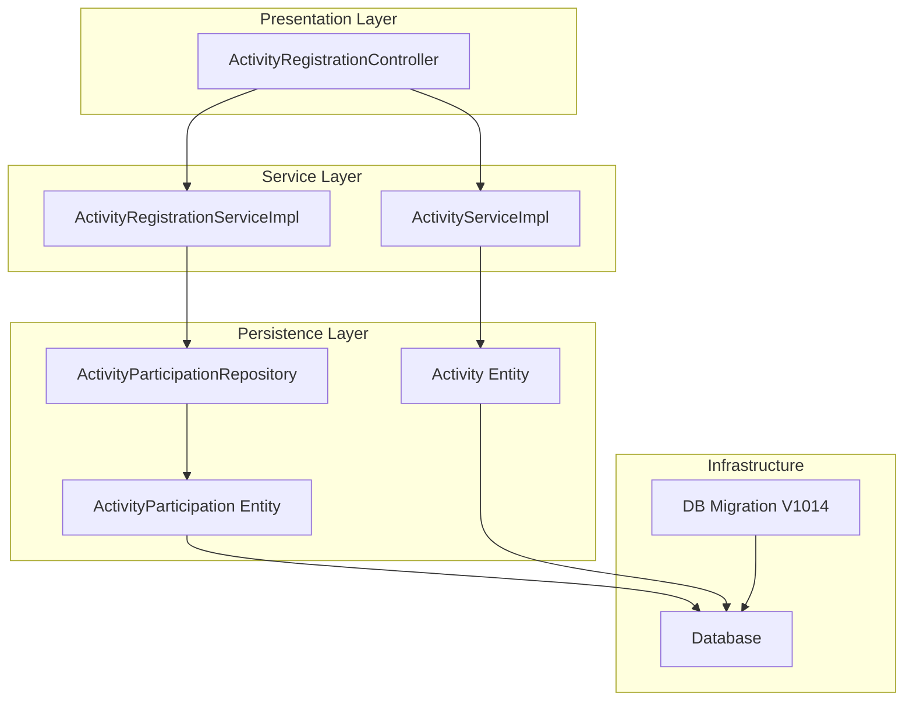
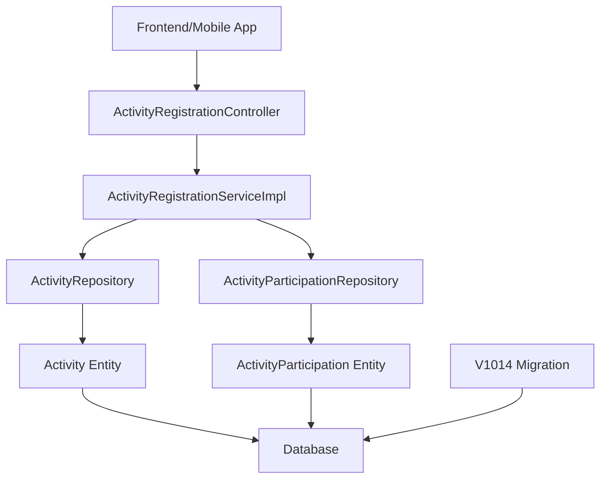
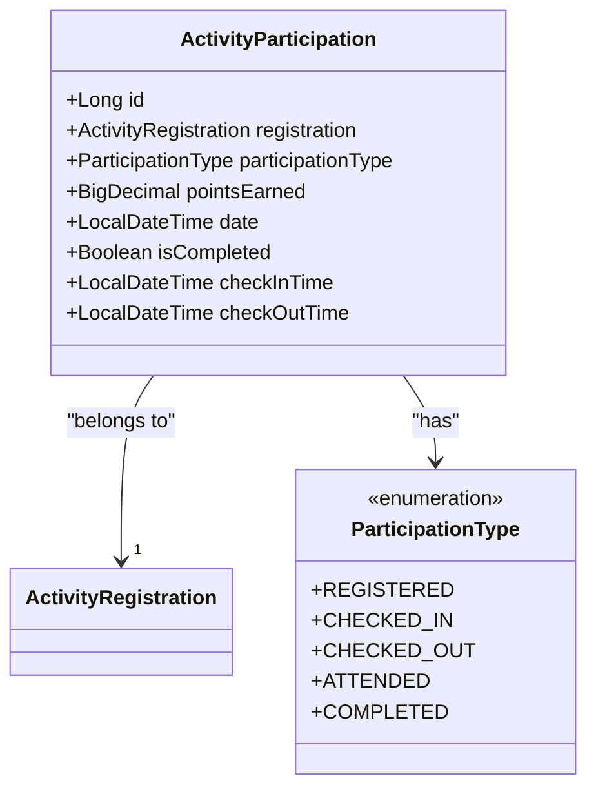
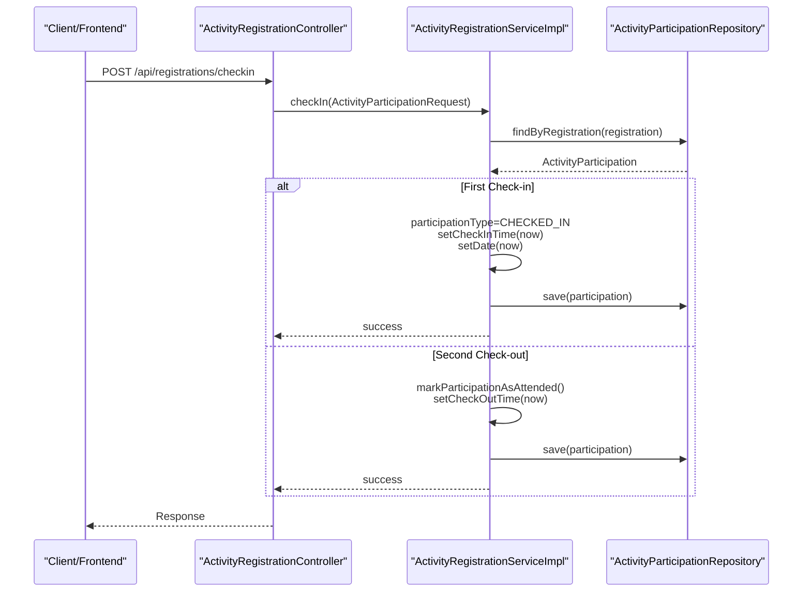
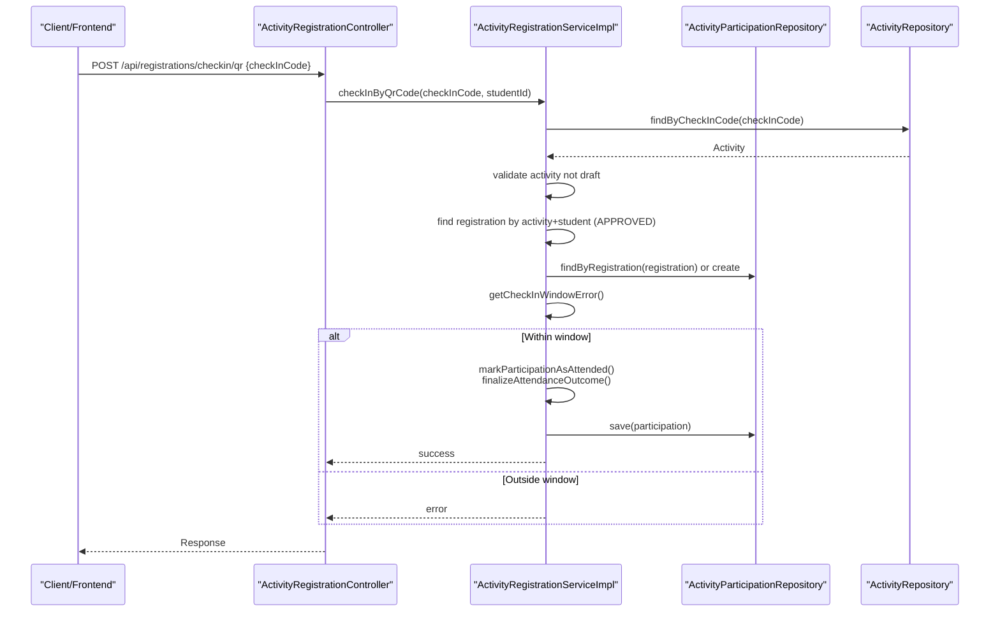
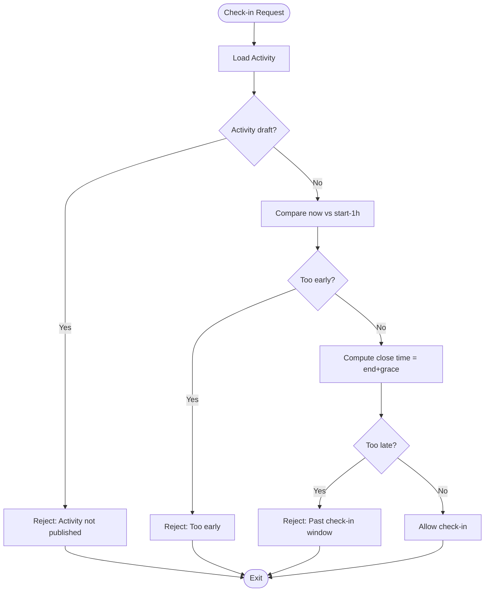
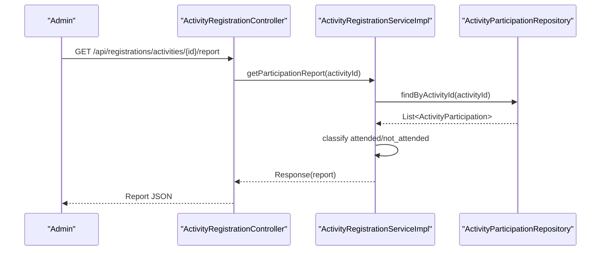
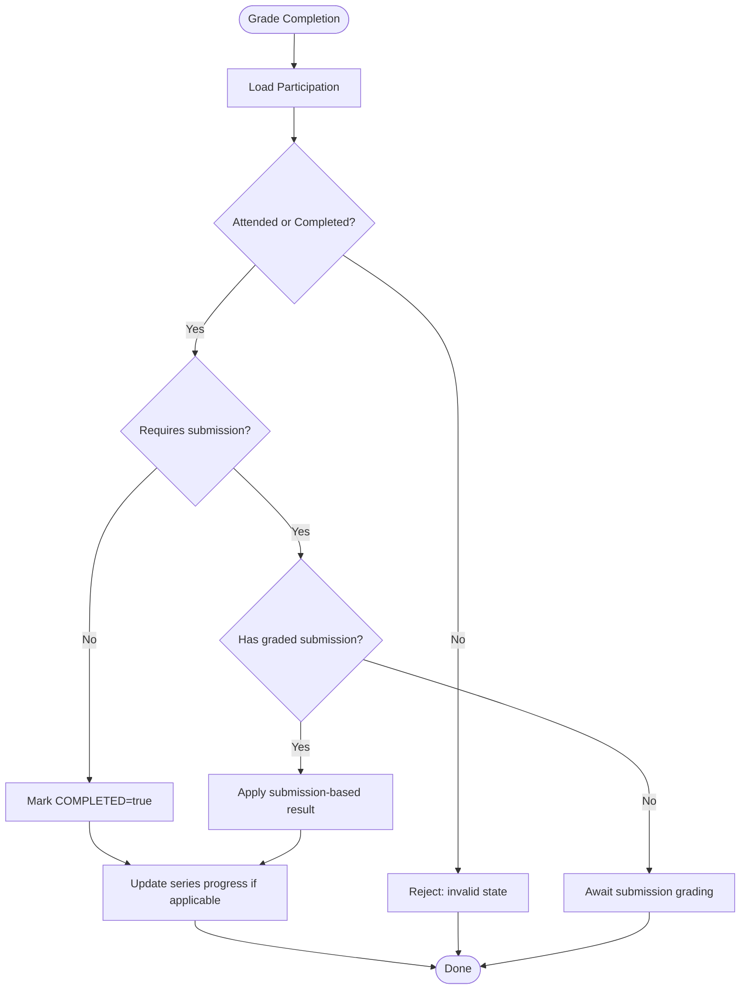
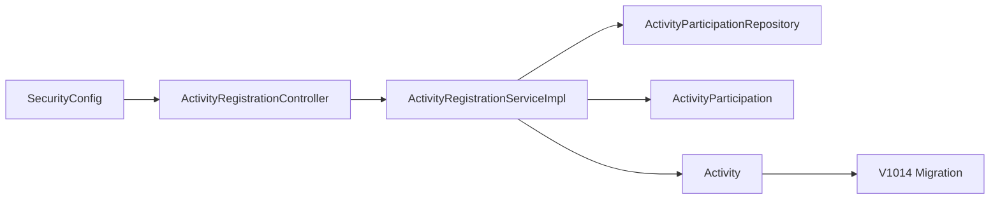

# Check-in & Attendance Tracking

<cite>
**Referenced Files in This Document**
- [ActivityRegistrationController.java](file://src/main/java/vn/campuslife/controller/activity/ActivityRegistrationController.java)
- [ActivityRegistrationServiceImpl.java](file://src/main/java/vn/campuslife/service/impl/ActivityRegistrationServiceImpl.java)
- [ActivityParticipation.java](file://src/main/java/vn/campuslife/entity/ActivityParticipation.java)
- [ParticipationType.java](file://src/main/java/vn/campuslife/enumeration/ParticipationType.java)
- [ActivityParticipationRequest.java](file://src/main/java/vn/campuslife/model/activity/ActivityParticipationRequest.java)
- [ActivityParticipationResponse.java](file://src/main/java/vn/campuslife/model/activity/ActivityParticipationResponse.java)
- [ActivityParticipationRepository.java](file://src/main/java/vn/campuslife/repository/ActivityParticipationRepository.java)
- [Activity.java](file://src/main/java/vn/campuslife/entity/Activity.java)
- [V1014__add_check_in_code_to_activities.sql](file://db/migration/V1014__add_check_in_code_to_activities.sql)
- [sequence-diagram-checkin.md](file://docs/sequence-diagram/sequence-diagram-checkin.md)
- [SecurityConfig.java](file://src/main/java/vn/campuslife/config/SecurityConfig.java)
- [ActivityServiceImpl.java](file://src/main/java/vn/campuslife/service/impl/ActivityServiceImpl.java)
</cite>

## Table of Contents
1. [Introduction](#introduction)
2. [Project Structure](#project-structure)
3. [Core Components](#core-components)
4. [Architecture Overview](#architecture-overview)
5. [Detailed Component Analysis](#detailed-component-analysis)
6. [Dependency Analysis](#dependency-analysis)
7. [Performance Considerations](#performance-considerations)
8. [Troubleshooting Guide](#troubleshooting-guide)
9. [Conclusion](#conclusion)
10. [Appendices](#appendices)

## Introduction
This document describes the check-in and attendance tracking system used for managing event participation. It covers QR code-based check-in, two-step check-in/check-out flows, participant verification, validation windows, attendance history, reporting, scheduling, and mobile device integration. Practical workflows, best practices, and troubleshooting guidance are included to help administrators and developers operate the system effectively.

## Project Structure
The check-in system spans controllers, services, repositories, entities, and database migrations. Key areas:
- Controllers expose endpoints for check-in, QR-based check-in, validation, reports, and grading.
- Services implement business logic for participation state transitions, validation, and outcome finalization.
- Repositories persist and query participation records and related data.
- Entities define the participation model and activity attributes including QR check-in codes.
- Migrations add QR code support to activities.

**Diagram sources**
- [ActivityRegistrationController.java:25-392](file://src/main/java/vn/campuslife/controller/activity/ActivityRegistrationController.java#L25-L392)
- [ActivityRegistrationServiceImpl.java:35-1139](file://src/main/java/vn/campuslife/service/impl/ActivityRegistrationServiceImpl.java#L35-L1139)
- [ActivityParticipationRepository.java:16-126](file://src/main/java/vn/campuslife/repository/ActivityParticipationRepository.java#L16-L126)
- [ActivityParticipation.java:12-43](file://src/main/java/vn/campuslife/entity/ActivityParticipation.java#L12-L43)
- [Activity.java:125-171](file://src/main/java/vn/campuslife/entity/Activity.java#L125-L171)
- [V1014__add_check_in_code_to_activities.sql:1-4](file://db/migration/V1014__add_check_in_code_to_activities.sql#L1-L4)

**Section sources**
- [ActivityRegistrationController.java:25-392](file://src/main/java/vn/campuslife/controller/activity/ActivityRegistrationController.java#L25-L392)
- [ActivityRegistrationServiceImpl.java:35-1139](file://src/main/java/vn/campuslife/service/impl/ActivityRegistrationServiceImpl.java#L35-L1139)
- [ActivityParticipationRepository.java:16-126](file://src/main/java/vn/campuslife/repository/ActivityParticipationRepository.java#L16-L126)
- [ActivityParticipation.java:12-43](file://src/main/java/vn/campuslife/entity/ActivityParticipation.java#L12-L43)
- [Activity.java:125-171](file://src/main/java/vn/campuslife/entity/Activity.java#L125-L171)
- [V1014__add_check_in_code_to_activities.sql:1-4](file://db/migration/V1014__add_check_in_code_to_activities.sql#L1-L4)

## Core Components
- Participation lifecycle: REGISTERED → CHECKED_IN → CHECKED_OUT → ATTENDED → COMPLETED.
- Two-step check-in/check-out flow for traditional tickets.
- QR code check-in that marks attendance directly for eligible events.
- Validation window: check-in opens one hour before start and closes extended hours after end.
- Reporting and grading endpoints for completion outcomes.
- Backfill participation records for approved registrations.

Key implementation references:
- Participation state transitions and validation: [ActivityRegistrationServiceImpl.java:404-482](file://src/main/java/vn/campuslife/service/impl/ActivityRegistrationServiceImpl.java#L404-L482), [ActivityRegistrationServiceImpl.java:486-546](file://src/main/java/vn/campuslife/service/impl/ActivityRegistrationServiceImpl.java#L486-L546)
- QR code check-in: [ActivityRegistrationController.java:250-274](file://src/main/java/vn/campuslife/controller/activity/ActivityRegistrationController.java#L250-L274), [ActivityRegistrationServiceImpl.java:486-546](file://src/main/java/vn/campuslife/service/impl/ActivityRegistrationServiceImpl.java#L486-L546)
- Participation entity and fields: [ActivityParticipation.java:12-43](file://src/main/java/vn/campuslife/entity/ActivityParticipation.java#L12-L43)
- Participation types: [ParticipationType.java:3-9](file://src/main/java/vn/campuslife/enumeration/ParticipationType.java#L3-L9)
- Validation window helpers: [ActivityRegistrationServiceImpl.java:1002-1024](file://src/main/java/vn/campuslife/service/impl/ActivityRegistrationServiceImpl.java#L1002-L1024)
- Reporting: [ActivityRegistrationServiceImpl.java:673-709](file://src/main/java/vn/campuslife/service/impl/ActivityRegistrationServiceImpl.java#L673-L709)
- Grading completion: [ActivityRegistrationServiceImpl.java:552-637](file://src/main/java/vn/campuslife/service/impl/ActivityRegistrationServiceImpl.java#L552-L637)
- Backfill participation: [ActivityRegistrationServiceImpl.java:788-830](file://src/main/java/vn/campuslife/service/impl/ActivityRegistrationServiceImpl.java#L788-L830)

**Section sources**
- [ActivityRegistrationServiceImpl.java:404-546](file://src/main/java/vn/campuslife/service/impl/ActivityRegistrationServiceImpl.java#L404-L546)
- [ActivityRegistrationController.java:250-274](file://src/main/java/vn/campuslife/controller/activity/ActivityRegistrationController.java#L250-L274)
- [ActivityParticipation.java:12-43](file://src/main/java/vn/campuslife/entity/ActivityParticipation.java#L12-L43)
- [ParticipationType.java:3-9](file://src/main/java/vn/campuslife/enumeration/ParticipationType.java#L3-L9)
- [ActivityRegistrationServiceImpl.java:1002-1024](file://src/main/java/vn/campuslife/service/impl/ActivityRegistrationServiceImpl.java#L1002-L1024)
- [ActivityRegistrationServiceImpl.java:673-709](file://src/main/java/vn/campuslife/service/impl/ActivityRegistrationServiceImpl.java#L673-L709)
- [ActivityRegistrationServiceImpl.java:552-637](file://src/main/java/vn/campuslife/service/impl/ActivityRegistrationServiceImpl.java#L552-L637)
- [ActivityRegistrationServiceImpl.java:788-830](file://src/main/java/vn/campuslife/service/impl/ActivityRegistrationServiceImpl.java#L788-L830)

## Architecture Overview
The system follows a layered architecture:
- Presentation: REST endpoints for check-in, QR check-in, validation, reports, and grading.
- Service: Business logic for participation state transitions, validation, scoring, and reporting.
- Persistence: JPA repositories and entities for activity registrations and participations.
- Infrastructure: Database with QR code column for activities and migration support.

**Diagram sources**
- [ActivityRegistrationController.java:25-392](file://src/main/java/vn/campuslife/controller/activity/ActivityRegistrationController.java#L25-L392)
- [ActivityRegistrationServiceImpl.java:35-1139](file://src/main/java/vn/campuslife/service/impl/ActivityRegistrationServiceImpl.java#L35-L1139)
- [ActivityParticipationRepository.java:16-126](file://src/main/java/vn/campuslife/repository/ActivityParticipationRepository.java#L16-L126)
- [ActivityParticipation.java:12-43](file://src/main/java/vn/campuslife/entity/ActivityParticipation.java#L12-L43)
- [Activity.java:125-171](file://src/main/java/vn/campuslife/entity/Activity.java#L125-L171)
- [V1014__add_check_in_code_to_activities.sql:1-4](file://db/migration/V1014__add_check_in_code_to_activities.sql#L1-L4)

## Detailed Component Analysis

### Participation Entity and Lifecycle
The participation entity captures attendance timestamps, state, and completion outcome. States progress from registration to completion, enabling accurate reporting and scoring.

**Diagram sources**
- [ActivityParticipation.java:12-43](file://src/main/java/vn/campuslife/entity/ActivityParticipation.java#L12-L43)
- [ParticipationType.java:3-9](file://src/main/java/vn/campuslife/enumeration/ParticipationType.java#L3-L9)

**Section sources**
- [ActivityParticipation.java:12-43](file://src/main/java/vn/campuslife/entity/ActivityParticipation.java#L12-L43)
- [ParticipationType.java:3-9](file://src/main/java/vn/campuslife/enumeration/ParticipationType.java#L3-L9)

### Check-in and Check-out Workflow (Two-step)
The traditional flow requires two steps:
- First step (Check-in): REGISTERED → CHECKED_IN.
- Second step (Check-out): CHECKED_IN → ATTENDED (and optionally COMPLETED).

**Diagram sources**
- [ActivityRegistrationController.java:217-245](file://src/main/java/vn/campuslife/controller/activity/ActivityRegistrationController.java#L217-L245)
- [ActivityRegistrationServiceImpl.java:404-482](file://src/main/java/vn/campuslife/service/impl/ActivityRegistrationServiceImpl.java#L404-L482)
- [ActivityParticipationRepository.java:16-126](file://src/main/java/vn/campuslife/repository/ActivityParticipationRepository.java#L16-L126)

**Section sources**
- [ActivityRegistrationController.java:217-245](file://src/main/java/vn/campuslife/controller/activity/ActivityRegistrationController.java#L217-L245)
- [ActivityRegistrationServiceImpl.java:404-482](file://src/main/java/vn/campuslife/service/impl/ActivityRegistrationServiceImpl.java#L404-L482)

### QR Code-Based Check-in
QR-based check-in is optimized for quick attendance capture:
- Endpoint accepts a QR code (checkInCode) and resolves the associated activity.
- Validates activity publication and registration approval.
- Creates participation if missing and marks attendance immediately.

**Diagram sources**
- [ActivityRegistrationController.java:250-274](file://src/main/java/vn/campuslife/controller/activity/ActivityRegistrationController.java#L250-L274)
- [ActivityRegistrationServiceImpl.java:486-546](file://src/main/java/vn/campuslife/service/impl/ActivityRegistrationServiceImpl.java#L486-L546)
- [ActivityParticipationRepository.java:16-126](file://src/main/java/vn/campuslife/repository/ActivityParticipationRepository.java#L16-L126)
- [Activity.java:125-171](file://src/main/java/vn/campuslife/entity/Activity.java#L125-L171)

**Section sources**
- [ActivityRegistrationController.java:250-274](file://src/main/java/vn/campuslife/controller/activity/ActivityRegistrationController.java#L250-L274)
- [ActivityRegistrationServiceImpl.java:486-546](file://src/main/java/vn/campuslife/service/impl/ActivityRegistrationServiceImpl.java#L486-L546)

### Validation Window and Scheduling
Check-in is constrained by time windows:
- Open: one hour before the event starts.
- Close: extended hours after the event ends (grace period).

**Diagram sources**
- [ActivityRegistrationServiceImpl.java:1002-1024](file://src/main/java/vn/campuslife/service/impl/ActivityRegistrationServiceImpl.java#L1002-L1024)

**Section sources**
- [ActivityRegistrationServiceImpl.java:1002-1024](file://src/main/java/vn/campuslife/service/impl/ActivityRegistrationServiceImpl.java#L1002-L1024)

### Attendance History and Reporting
- Reporting endpoint aggregates attended vs not-attended students for an activity.
- Participation queries support counts, pagination, and filtering by student and score type.

**Diagram sources**
- [ActivityRegistrationController.java:299-305](file://src/main/java/vn/campuslife/controller/activity/ActivityRegistrationController.java#L299-L305)
- [ActivityRegistrationServiceImpl.java:673-709](file://src/main/java/vn/campuslife/service/impl/ActivityRegistrationServiceImpl.java#L673-L709)
- [ActivityParticipationRepository.java:64-86](file://src/main/java/vn/campuslife/repository/ActivityParticipationRepository.java#L64-L86)

**Section sources**
- [ActivityRegistrationController.java:299-305](file://src/main/java/vn/campuslife/controller/activity/ActivityRegistrationController.java#L299-L305)
- [ActivityRegistrationServiceImpl.java:673-709](file://src/main/java/vn/campuslife/service/impl/ActivityRegistrationServiceImpl.java#L673-L709)
- [ActivityParticipationRepository.java:64-86](file://src/main/java/vn/campuslife/repository/ActivityParticipationRepository.java#L64-L86)

### Completion Grading and Scoring
- Completion grading updates participation to COMPLETED based on submission outcomes or automatic rules.
- Series and standalone activities receive different scoring paths.

**Diagram sources**
- [ActivityRegistrationServiceImpl.java:552-637](file://src/main/java/vn/campuslife/service/impl/ActivityRegistrationServiceImpl.java#L552-L637)

**Section sources**
- [ActivityRegistrationServiceImpl.java:552-637](file://src/main/java/vn/campuslife/service/impl/ActivityRegistrationServiceImpl.java#L552-L637)

### Mobile Device Integration
- QR scanning: use POST /api/registrations/checkin/qr with checkInCode.
- Ticket code validation: GET /api/registrations/checkin/validate?ticketCode for pre-check preview.
- Authentication: endpoints are protected and require authenticated users.

**Section sources**
- [ActivityRegistrationController.java:185-194](file://src/main/java/vn/campuslife/controller/activity/ActivityRegistrationController.java#L185-L194)
- [ActivityRegistrationController.java:250-274](file://src/main/java/vn/campuslife/controller/activity/ActivityRegistrationController.java#L250-L274)
- [SecurityConfig.java:79-82](file://src/main/java/vn/campuslife/config/SecurityConfig.java#L79-L82)

### Participation Entity Structure
- Fields include registration linkage, participation type, timestamps, points, and completion flag.
- Supports both two-step and QR-based flows.

**Section sources**
- [ActivityParticipation.java:12-43](file://src/main/java/vn/campuslife/entity/ActivityParticipation.java#L12-L43)

### Check-in Validation Algorithms
- Draft activity rejection.
- Registration approval requirement.
- Participation existence and creation for approved registrations.
- Time-window checks around start/end with grace period.

**Section sources**
- [ActivityRegistrationServiceImpl.java:404-546](file://src/main/java/vn/campuslife/service/impl/ActivityRegistrationServiceImpl.java#L404-L546)
- [ActivityRegistrationServiceImpl.java:1002-1024](file://src/main/java/vn/campuslife/service/impl/ActivityRegistrationServiceImpl.java#L1002-L1024)

### Attendance Tracking Mechanisms
- ParticipationRepository provides counts, paginated queries, and filtered aggregations.
- Reporting builds lists of attended/not_attended students.

**Section sources**
- [ActivityParticipationRepository.java:64-126](file://src/main/java/vn/campuslife/repository/ActivityParticipationRepository.java#L64-L126)
- [ActivityRegistrationServiceImpl.java:673-709](file://src/main/java/vn/campuslife/service/impl/ActivityRegistrationServiceImpl.java#L673-L709)

## Dependency Analysis
- Controller depends on service for business logic.
- Service depends on repositories for persistence and entities for modeling.
- Activity entity includes QR code field introduced by migration V1014.
- Security configuration protects check-in endpoints.

**Diagram sources**
- [ActivityRegistrationController.java:25-392](file://src/main/java/vn/campuslife/controller/activity/ActivityRegistrationController.java#L25-L392)
- [ActivityRegistrationServiceImpl.java:35-1139](file://src/main/java/vn/campuslife/service/impl/ActivityRegistrationServiceImpl.java#L35-L1139)
- [ActivityParticipationRepository.java:16-126](file://src/main/java/vn/campuslife/repository/ActivityParticipationRepository.java#L16-L126)
- [ActivityParticipation.java:12-43](file://src/main/java/vn/campuslife/entity/ActivityParticipation.java#L12-L43)
- [Activity.java:125-171](file://src/main/java/vn/campuslife/entity/Activity.java#L125-L171)
- [V1014__add_check_in_code_to_activities.sql:1-4](file://db/migration/V1014__add_check_in_code_to_activities.sql#L1-L4)
- [SecurityConfig.java:79-82](file://src/main/java/vn/campuslife/config/SecurityConfig.java#L79-L82)

**Section sources**
- [ActivityRegistrationController.java:25-392](file://src/main/java/vn/campuslife/controller/activity/ActivityRegistrationController.java#L25-L392)
- [ActivityRegistrationServiceImpl.java:35-1139](file://src/main/java/vn/campuslife/service/impl/ActivityRegistrationServiceImpl.java#L35-L1139)
- [ActivityParticipationRepository.java:16-126](file://src/main/java/vn/campuslife/repository/ActivityParticipationRepository.java#L16-L126)
- [ActivityParticipation.java:12-43](file://src/main/java/vn/campuslife/entity/ActivityParticipation.java#L12-L43)
- [Activity.java:125-171](file://src/main/java/vn/campuslife/entity/Activity.java#L125-L171)
- [V1014__add_check_in_code_to_activities.sql:1-4](file://db/migration/V1014__add_check_in_code_to_activities.sql#L1-L4)
- [SecurityConfig.java:79-82](file://src/main/java/vn/campuslife/config/SecurityConfig.java#L79-L82)

## Performance Considerations
- Use repository queries with appropriate filters to avoid N+1 selects.
- Batch operations for backfill participation when initializing systems.
- Indexes on frequently queried columns (ticketCode, registration_id, activity_id) improve lookup performance.
- Limit report sizes and paginate results for large datasets.

## Troubleshooting Guide
Common issues and resolutions:
- Activity not published (draft): Ensure activity is published before check-in.
  - Reference: [ActivityRegistrationServiceImpl.java:428-430](file://src/main/java/vn/campuslife/service/impl/ActivityRegistrationServiceImpl.java#L428-L430), [ActivityRegistrationServiceImpl.java:493-495](file://src/main/java/vn/campuslife/service/impl/ActivityRegistrationServiceImpl.java#L493-L495)
- Registration not approved: Only APPROVED registrations can check-in.
  - Reference: [ActivityRegistrationServiceImpl.java:500-502](file://src/main/java/vn/campuslife/service/impl/ActivityRegistrationServiceImpl.java#L500-L502)
- Outside check-in window: Respect start-1h to end+grace constraints.
  - Reference: [ActivityRegistrationServiceImpl.java:1002-1024](file://src/main/java/vn/campuslife/service/impl/ActivityRegistrationServiceImpl.java#L1002-L1024)
- Duplicate participation: Backfill missing participation records.
  - Reference: [ActivityRegistrationServiceImpl.java:788-830](file://src/main/java/vn/campuslife/service/impl/ActivityRegistrationServiceImpl.java#L788-L830)
- QR code errors: Verify checkInCode uniqueness and presence.
  - Reference: [ActivityRegistrationController.java:250-274](file://src/main/java/vn/campuslife/controller/activity/ActivityRegistrationController.java#L250-L274), [Activity.java:125-171](file://src/main/java/vn/campuslife/entity/Activity.java#L125-L171)
- Authentication failures: Confirm user roles and JWT validity.
  - Reference: [SecurityConfig.java:79-82](file://src/main/java/vn/campuslife/config/SecurityConfig.java#L79-L82)

**Section sources**
- [ActivityRegistrationServiceImpl.java:428-546](file://src/main/java/vn/campuslife/service/impl/ActivityRegistrationServiceImpl.java#L428-L546)
- [ActivityRegistrationServiceImpl.java:788-830](file://src/main/java/vn/campuslife/service/impl/ActivityRegistrationServiceImpl.java#L788-L830)
- [ActivityRegistrationController.java:250-274](file://src/main/java/vn/campuslife/controller/activity/ActivityRegistrationController.java#L250-L274)
- [Activity.java:125-171](file://src/main/java/vn/campuslife/entity/Activity.java#L125-L171)
- [SecurityConfig.java:79-82](file://src/main/java/vn/campuslife/config/SecurityConfig.java#L79-L82)

## Conclusion
The check-in and attendance tracking system provides robust support for both traditional two-step check-in/check-out and QR-based quick check-in. It enforces validation windows, supports reporting and grading, and integrates with series progress and scoring engines. Proper configuration of QR codes, participation backfills, and security ensures reliable operation across mobile devices and administrative dashboards.

## Appendices

### API Endpoints Summary
- POST /api/registrations/checkin: Two-step check-in/check-out using ticketCode or studentId.
- POST /api/registrations/checkin/qr: QR-based check-in using checkInCode.
- GET /api/registrations/checkin/validate?ticketCode: Validate ticket and preview eligibility.
- GET /api/registrations/activities/{id}/report: Attendance report (attended vs not_attended).
- PUT /api/registrations/participations/{id}/grade: Grade completion (completed/failed).

**Section sources**
- [ActivityRegistrationController.java:185-194](file://src/main/java/vn/campuslife/controller/activity/ActivityRegistrationController.java#L185-L194)
- [ActivityRegistrationController.java:217-245](file://src/main/java/vn/campuslife/controller/activity/ActivityRegistrationController.java#L217-L245)
- [ActivityRegistrationController.java:250-274](file://src/main/java/vn/campuslife/controller/activity/ActivityRegistrationController.java#L250-L274)
- [ActivityRegistrationController.java:299-305](file://src/main/java/vn/campuslife/controller/activity/ActivityRegistrationController.java#L299-L305)
- [ActivityRegistrationController.java:310-323](file://src/main/java/vn/campuslife/controller/activity/ActivityRegistrationController.java#L310-L323)

### QR Code Generation and Backfill
- Activities without QR codes can be backfilled with unique checkInCode values.
- Migration adds the QR code column to activities.

**Section sources**
- [ActivityServiceImpl.java:915-940](file://src/main/java/vn/campuslife/service/impl/ActivityServiceImpl.java#L915-L940)
- [V1014__add_check_in_code_to_activities.sql:1-4](file://db/migration/V1014__add_check_in_code_to_activities.sql#L1-L4)