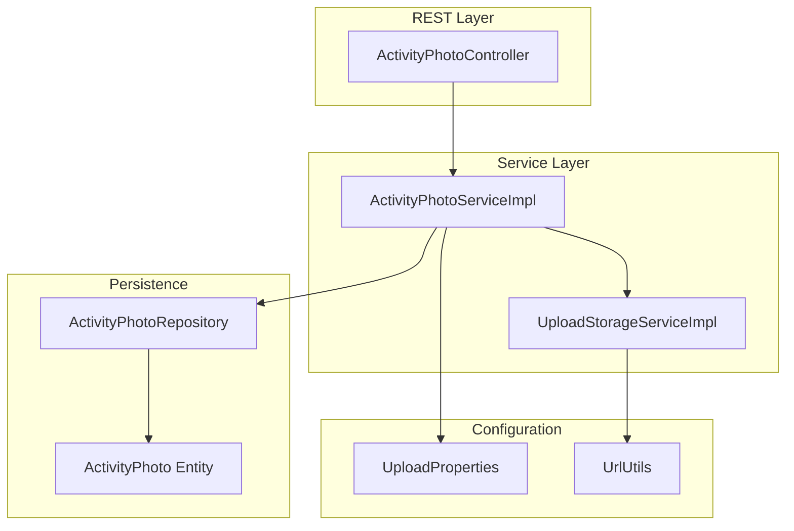
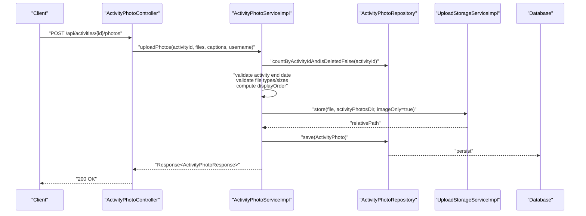
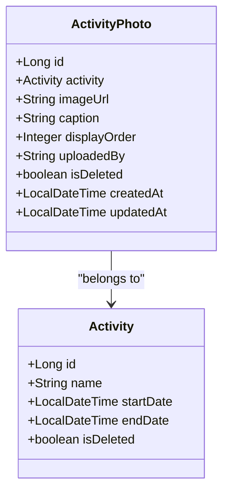
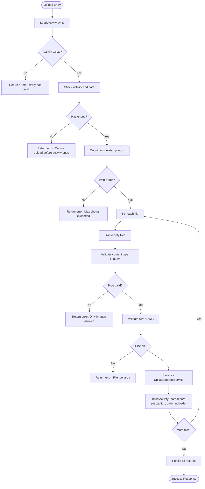
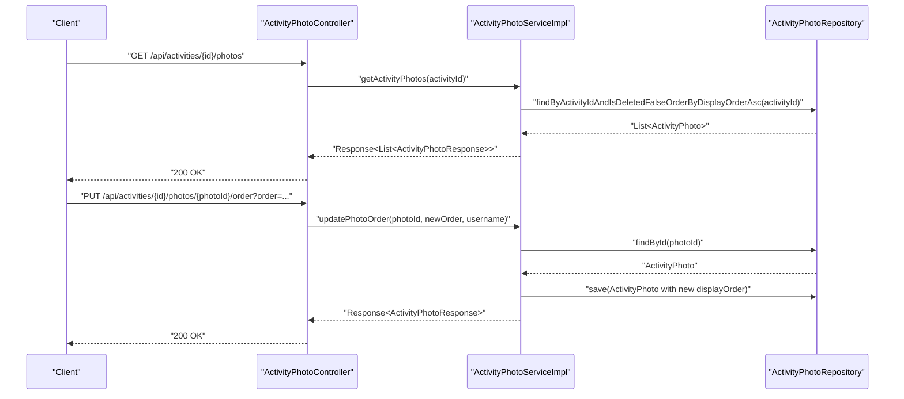
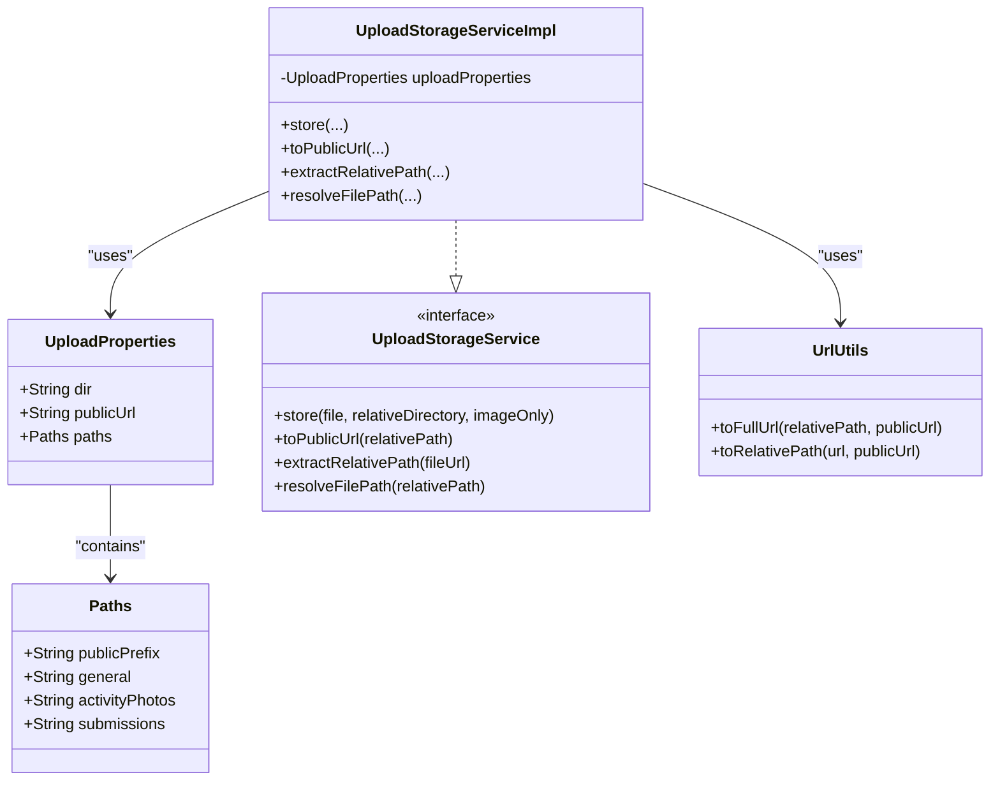
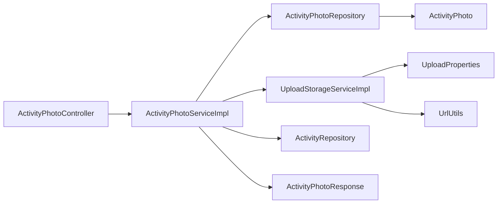

# Media Management

<cite>
**Referenced Files in This Document**
- [ActivityPhoto.java](file://src/main/java/vn/campuslife/entity/ActivityPhoto.java)
- [Activity.java](file://src/main/java/vn/campuslife/entity/Activity.java)
- [ActivityPhotoService.java](file://src/main/java/vn/campuslife/service/ActivityPhotoService.java)
- [ActivityPhotoServiceImpl.java](file://src/main/java/vn/campuslife/service/impl/ActivityPhotoServiceImpl.java)
- [ActivityPhotoRepository.java](file://src/main/java/vn/campuslife/repository/ActivityPhotoRepository.java)
- [ActivityPhotoController.java](file://src/main/java/vn/campuslife/controller/activity/ActivityPhotoController.java)
- [ActivityPhotoResponse.java](file://src/main/java/vn/campuslife/model/activity/ActivityPhotoResponse.java)
- [UploadProperties.java](file://src/main/java/vn/campuslife/config/UploadProperties.java)
- [UploadStorageService.java](file://src/main/java/vn/campuslife/service/UploadStorageService.java)
- [UploadStorageServiceImpl.java](file://src/main/java/vn/campuslife/service/impl/UploadStorageServiceImpl.java)
- [UrlUtils.java](file://src/main/java/vn/campuslife/util/UrlUtils.java)
- [application.properties](file://src/main/resources/application.properties)
- [SecurityConfig.java](file://src/main/java/vn/campuslife/config/SecurityConfig.java)
</cite>

## Table of Contents
1. [Introduction](#introduction)
2. [Project Structure](#project-structure)
3. [Core Components](#core-components)
4. [Architecture Overview](#architecture-overview)
5. [Detailed Component Analysis](#detailed-component-analysis)
6. [Dependency Analysis](#dependency-analysis)
7. [Performance Considerations](#performance-considerations)
8. [Troubleshooting Guide](#troubleshooting-guide)
9. [Conclusion](#conclusion)
10. [Appendices](#appendices)

## Introduction
This document describes the activity photo and media management system within the campus life application. It covers the photo upload process, gallery retrieval, soft deletion, ordering, and storage management. It also documents access control for photos, the underlying entity model, and operational guidance for common issues such as upload failures, storage optimization, and scaling considerations.

## Project Structure
The media management feature is centered around:
- Entity representing activity photos
- Repository for persistence queries
- Service layer implementing business rules (validation, ordering, soft delete)
- Storage abstraction for file handling and URL generation
- REST controller exposing photo endpoints
- Configuration for upload paths and limits
- Security configuration restricting photo management actions to authorized roles

**Diagram sources**
- [ActivityPhotoController.java:15-108](file://src/main/java/vn/campuslife/controller/activity/ActivityPhotoController.java#L15-L108)
- [ActivityPhotoServiceImpl.java:26-228](file://src/main/java/vn/campuslife/service/impl/ActivityPhotoServiceImpl.java#L26-L228)
- [ActivityPhotoRepository.java:11-35](file://src/main/java/vn/campuslife/repository/ActivityPhotoRepository.java#L11-L35)
- [ActivityPhoto.java:15-62](file://src/main/java/vn/campuslife/entity/ActivityPhoto.java#L15-L62)
- [UploadStorageServiceImpl.java:17-149](file://src/main/java/vn/campuslife/service/impl/UploadStorageServiceImpl.java#L17-L149)
- [UploadProperties.java:8-27](file://src/main/java/vn/campuslife/config/UploadProperties.java#L8-L27)
- [UrlUtils.java:6-93](file://src/main/java/vn/campuslife/util/UrlUtils.java#L6-L93)

**Section sources**
- [ActivityPhotoController.java:15-108](file://src/main/java/vn/campuslife/controller/activity/ActivityPhotoController.java#L15-L108)
- [ActivityPhotoServiceImpl.java:26-228](file://src/main/java/vn/campuslife/service/impl/ActivityPhotoServiceImpl.java#L26-L228)
- [ActivityPhotoRepository.java:11-35](file://src/main/java/vn/campuslife/repository/ActivityPhotoRepository.java#L11-L35)
- [ActivityPhoto.java:15-62](file://src/main/java/vn/campuslife/entity/ActivityPhoto.java#L15-L62)
- [UploadStorageServiceImpl.java:17-149](file://src/main/java/vn/campuslife/service/impl/UploadStorageServiceImpl.java#L17-L149)
- [UploadProperties.java:8-27](file://src/main/java/vn/campuslife/config/UploadProperties.java#L8-L27)
- [UrlUtils.java:6-93](file://src/main/java/vn/campuslife/util/UrlUtils.java#L6-L93)

## Core Components
- ActivityPhoto entity: Defines the persisted attributes for each photo, including foreign key to Activity, image URL, optional caption, display order, uploader identity, soft-delete flag, and audit timestamps.
- ActivityPhotoService and ActivityPhotoServiceImpl: Implement upload validation (activity end date, max photo count, file type, file size), persist records, compute display order, and convert to response DTOs with public URLs.
- ActivityPhotoRepository: Provides JPQL queries to fetch photos by activity and ordering, and to count non-deleted photos.
- UploadStorageService and UploadStorageServiceImpl: Store files under configured directories, generate safe relative paths, and convert to public URLs. Also supports extracting relative paths and resolving file system paths.
- ActivityPhotoController: Exposes REST endpoints for upload, retrieval, soft deletion, and reordering with role-based access control.
- UploadProperties and application.properties: Configure base upload directory, public URL, and path segments for activity photos and submissions.
- SecurityConfig: Restricts photo management endpoints to ADMIN and MANAGER roles; allows authenticated users to view galleries.

**Section sources**
- [ActivityPhoto.java:21-62](file://src/main/java/vn/campuslife/entity/ActivityPhoto.java#L21-L62)
- [ActivityPhotoService.java:8-46](file://src/main/java/vn/campuslife/service/ActivityPhotoService.java#L8-L46)
- [ActivityPhotoServiceImpl.java:30-228](file://src/main/java/vn/campuslife/service/impl/ActivityPhotoServiceImpl.java#L30-L228)
- [ActivityPhotoRepository.java:11-35](file://src/main/java/vn/campuslife/repository/ActivityPhotoRepository.java#L11-L35)
- [UploadStorageService.java:8-17](file://src/main/java/vn/campuslife/service/UploadStorageService.java#L8-L17)
- [UploadStorageServiceImpl.java:17-149](file://src/main/java/vn/campuslife/service/impl/UploadStorageServiceImpl.java#L17-L149)
- [ActivityPhotoController.java:15-108](file://src/main/java/vn/campuslife/controller/activity/ActivityPhotoController.java#L15-L108)
- [UploadProperties.java:8-27](file://src/main/java/vn/campuslife/config/UploadProperties.java#L8-L27)
- [application.properties:43-54](file://src/main/resources/application.properties#L43-L54)
- [SecurityConfig.java:95-114](file://src/main/java/vn/campuslife/config/SecurityConfig.java#L95-L114)

## Architecture Overview
The system follows a layered architecture:
- REST endpoints accept multipart requests and delegate to the service layer.
- Service validates business rules and interacts with repositories and storage services.
- Storage service writes files to disk and returns relative paths; UrlUtils converts them to public URLs.
- Access control is enforced at the controller level via Spring Security.

**Diagram sources**
- [ActivityPhotoController.java:24-48](file://src/main/java/vn/campuslife/controller/activity/ActivityPhotoController.java#L24-L48)
- [ActivityPhotoServiceImpl.java:39-119](file://src/main/java/vn/campuslife/service/impl/ActivityPhotoServiceImpl.java#L39-L119)
- [ActivityPhotoRepository.java:23-29](file://src/main/java/vn/campuslife/repository/ActivityPhotoRepository.java#L23-L29)
- [UploadStorageServiceImpl.java:26-47](file://src/main/java/vn/campuslife/service/impl/UploadStorageServiceImpl.java#L26-L47)

## Detailed Component Analysis

### Photo Entity Model
The ActivityPhoto entity encapsulates:
- Foreign key relationship to Activity
- Image URL (relative path)
- Optional caption
- Display order for gallery sorting
- Uploader identity (username)
- Soft delete flag
- Audit timestamps

**Diagram sources**
- [Activity.java:27-171](file://src/main/java/vn/campuslife/entity/Activity.java#L27-L171)
- [ActivityPhoto.java:21-62](file://src/main/java/vn/campuslife/entity/ActivityPhoto.java#L21-L62)

**Section sources**
- [ActivityPhoto.java:21-62](file://src/main/java/vn/campuslife/entity/ActivityPhoto.java#L21-L62)
- [Activity.java:27-171](file://src/main/java/vn/campuslife/entity/Activity.java#L27-L171)

### Upload Handling Mechanism
Key behaviors:
- Validates activity existence and ensures the activity has ended before allowing uploads.
- Enforces a maximum number of photos per activity.
- Validates file type (images only) and file size (≤ 5 MB).
- Generates unique filenames and stores files under a directory scoped to the activity.
- Computes display order based on existing photos plus index.
- Returns public URLs in responses by converting relative paths.

**Diagram sources**
- [ActivityPhotoServiceImpl.java:39-119](file://src/main/java/vn/campuslife/service/impl/ActivityPhotoServiceImpl.java#L39-L119)
- [UploadStorageServiceImpl.java:26-47](file://src/main/java/vn/campuslife/service/impl/UploadStorageServiceImpl.java#L26-L47)

**Section sources**
- [ActivityPhotoServiceImpl.java:39-119](file://src/main/java/vn/campuslife/service/impl/ActivityPhotoServiceImpl.java#L39-L119)
- [UploadStorageServiceImpl.java:26-47](file://src/main/java/vn/campuslife/service/impl/UploadStorageServiceImpl.java#L26-L47)

### Gallery Retrieval and Ordering
- Retrieval orders photos by display order ascending, then by creation time ascending.
- Reordering updates the display order field for a single photo.
- Soft deletion marks a photo as deleted without removing the file.

**Diagram sources**
- [ActivityPhotoController.java:50-105](file://src/main/java/vn/campuslife/controller/activity/ActivityPhotoController.java#L50-L105)
- [ActivityPhotoServiceImpl.java:121-193](file://src/main/java/vn/campuslife/service/impl/ActivityPhotoServiceImpl.java#L121-L193)
- [ActivityPhotoRepository.java:14-21](file://src/main/java/vn/campuslife/repository/ActivityPhotoRepository.java#L14-L21)

**Section sources**
- [ActivityPhotoController.java:50-105](file://src/main/java/vn/campuslife/controller/activity/ActivityPhotoController.java#L50-L105)
- [ActivityPhotoServiceImpl.java:121-193](file://src/main/java/vn/campuslife/service/impl/ActivityPhotoServiceImpl.java#L121-L193)
- [ActivityPhotoRepository.java:14-21](file://src/main/java/vn/campuslife/repository/ActivityPhotoRepository.java#L14-L21)

### Storage Management and URL Handling
- Uploads are stored under a configurable base directory with a public URL prefix.
- Relative paths are generated using a sanitized directory and UUID-based filenames.
- Public URLs are constructed by combining the configured base URL with the relative path.
- Utilities support normalization between full URLs and relative paths.

**Diagram sources**
- [UploadProperties.java:8-27](file://src/main/java/vn/campuslife/config/UploadProperties.java#L8-L27)
- [UploadStorageService.java:8-17](file://src/main/java/vn/campuslife/service/UploadStorageService.java#L8-L17)
- [UploadStorageServiceImpl.java:17-149](file://src/main/java/vn/campuslife/service/impl/UploadStorageServiceImpl.java#L17-L149)
- [UrlUtils.java:6-93](file://src/main/java/vn/campuslife/util/UrlUtils.java#L6-L93)

**Section sources**
- [UploadProperties.java:8-27](file://src/main/java/vn/campuslife/config/UploadProperties.java#L8-L27)
- [UploadStorageServiceImpl.java:26-93](file://src/main/java/vn/campuslife/service/impl/UploadStorageServiceImpl.java#L26-L93)
- [UrlUtils.java:21-91](file://src/main/java/vn/campuslife/util/UrlUtils.java#L21-L91)

### Access Control and Permissions
- Viewing galleries is permitted for authenticated users (STUDENT, MANAGER, ADMIN).
- Managing photos (upload, delete, reorder) requires ADMIN or MANAGER roles.
- Security rules are defined centrally and applied to photo endpoints.

**Section sources**
- [SecurityConfig.java:95-114](file://src/main/java/vn/campuslife/config/SecurityConfig.java#L95-L114)
- [ActivityPhotoController.java:24-105](file://src/main/java/vn/campuslife/controller/activity/ActivityPhotoController.java#L24-L105)

## Dependency Analysis
The following diagram shows the primary dependencies among components involved in photo management:

**Diagram sources**
- [ActivityPhotoController.java:15-108](file://src/main/java/vn/campuslife/controller/activity/ActivityPhotoController.java#L15-L108)
- [ActivityPhotoServiceImpl.java:26-228](file://src/main/java/vn/campuslife/service/impl/ActivityPhotoServiceImpl.java#L26-L228)
- [ActivityPhotoRepository.java:11-35](file://src/main/java/vn/campuslife/repository/ActivityPhotoRepository.java#L11-L35)
- [UploadStorageServiceImpl.java:17-149](file://src/main/java/vn/campuslife/service/impl/UploadStorageServiceImpl.java#L17-L149)
- [UploadProperties.java:8-27](file://src/main/java/vn/campuslife/config/UploadProperties.java#L8-L27)
- [UrlUtils.java:6-93](file://src/main/java/vn/campuslife/util/UrlUtils.java#L6-L93)
- [ActivityPhoto.java:15-62](file://src/main/java/vn/campuslife/entity/ActivityPhoto.java#L15-L62)

**Section sources**
- [ActivityPhotoController.java:15-108](file://src/main/java/vn/campuslife/controller/activity/ActivityPhotoController.java#L15-L108)
- [ActivityPhotoServiceImpl.java:26-228](file://src/main/java/vn/campuslife/service/impl/ActivityPhotoServiceImpl.java#L26-L228)
- [ActivityPhotoRepository.java:11-35](file://src/main/java/vn/campuslife/repository/ActivityPhotoRepository.java#L11-L35)
- [UploadStorageServiceImpl.java:17-149](file://src/main/java/vn/campuslife/service/impl/UploadStorageServiceImpl.java#L17-L149)
- [UploadProperties.java:8-27](file://src/main/java/vn/campuslife/config/UploadProperties.java#L8-L27)
- [UrlUtils.java:6-93](file://src/main/java/vn/campuslife/util/UrlUtils.java#L6-L93)
- [ActivityPhoto.java:15-62](file://src/main/java/vn/campuslife/entity/ActivityPhoto.java#L15-L62)

## Performance Considerations
- File size and count limits reduce storage pressure and improve gallery load times.
- Storing only images reduces risk and simplifies moderation.
- Using UUID-based filenames avoids collisions and prevents predictable paths.
- Ordering by display order and creation time ensures deterministic presentation.
- Centralized URL construction minimizes repeated computation.

[No sources needed since this section provides general guidance]

## Troubleshooting Guide
Common issues and resolutions:
- Upload fails with “Activity not found”: Verify the activity ID exists and is not marked deleted.
- “Cannot upload photos before activity ends”: Ensure the activity’s end date has passed.
- “Maximum N photos allowed per activity”: Reduce batch size or remove older photos.
- “Only image files are allowed”: Confirm the file content type starts with image/.
- “File size must be less than 5MB”: Compress or resize images before upload.
- “Photo not found” or “already deleted”: Confirm photo ID validity and soft-delete state.
- “Failed to get photos”: Check repository query correctness and database connectivity.
- “Permission denied”: Ensure the requester has ADMIN or MANAGER role.

Operational checks:
- Confirm upload directory and public URL prefixes are set correctly in configuration.
- Validate that the base URL and public prefix align with the deployed environment.
- Review logs for exceptions during file copy or path resolution.

**Section sources**
- [ActivityPhotoServiceImpl.java:41-119](file://src/main/java/vn/campuslife/service/impl/ActivityPhotoServiceImpl.java#L41-L119)
- [ActivityPhotoServiceImpl.java:144-193](file://src/main/java/vn/campuslife/service/impl/ActivityPhotoServiceImpl.java#L144-L193)
- [application.properties:43-54](file://src/main/resources/application.properties#L43-L54)
- [UploadStorageServiceImpl.java:26-93](file://src/main/java/vn/campuslife/service/impl/UploadStorageServiceImpl.java#L26-L93)

## Conclusion
The media management subsystem provides a robust, secure, and scalable solution for activity photo handling. It enforces business rules, integrates cleanly with storage, and exposes a clear API with appropriate access controls. By adhering to the documented constraints and configurations, teams can reliably manage photo galleries, maintain quality, and optimize storage usage.

[No sources needed since this section summarizes without analyzing specific files]

## Appendices

### Practical Examples

- Photo upload workflow
  - Endpoint: POST /api/activities/{activityId}/photos
  - Request: multipart/form-data with files and optional captions
  - Validation: activity ended, image-only, ≤ 5MB, within per-activity limit
  - Outcome: persisted ActivityPhoto entries with computed display order and public URLs

- Gallery retrieval
  - Endpoint: GET /api/activities/{activityId}/photos
  - Outcome: ordered list of photos by display order and creation time

- Photo management operations
  - Soft delete: DELETE /api/activities/{activityId}/photos/{photoId}
  - Reorder: PUT /api/activities/{activityId}/photos/{photoId}/order?order=N

- Storage configuration
  - Base directory: app.upload.dir
  - Public URL: app.upload.public-url
  - Path segments: app.upload.paths.activity-photos, app.upload.paths.public-prefix

**Section sources**
- [ActivityPhotoController.java:24-105](file://src/main/java/vn/campuslife/controller/activity/ActivityPhotoController.java#L24-L105)
- [ActivityPhotoServiceImpl.java:39-119](file://src/main/java/vn/campuslife/service/impl/ActivityPhotoServiceImpl.java#L39-L119)
- [application.properties:43-54](file://src/main/resources/application.properties#L43-L54)