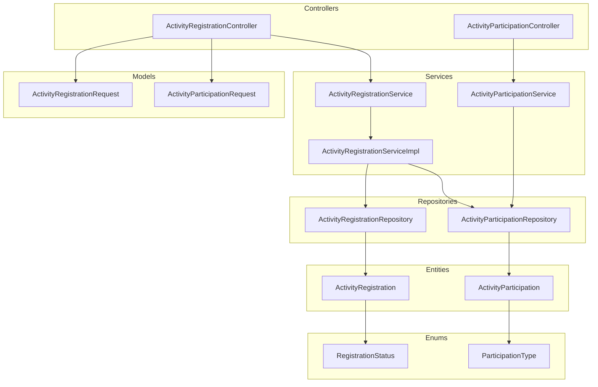
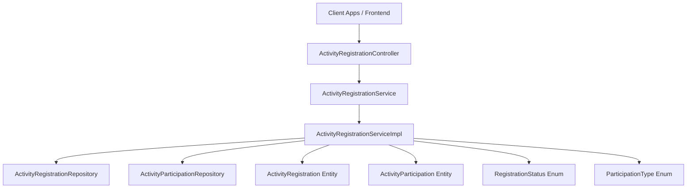
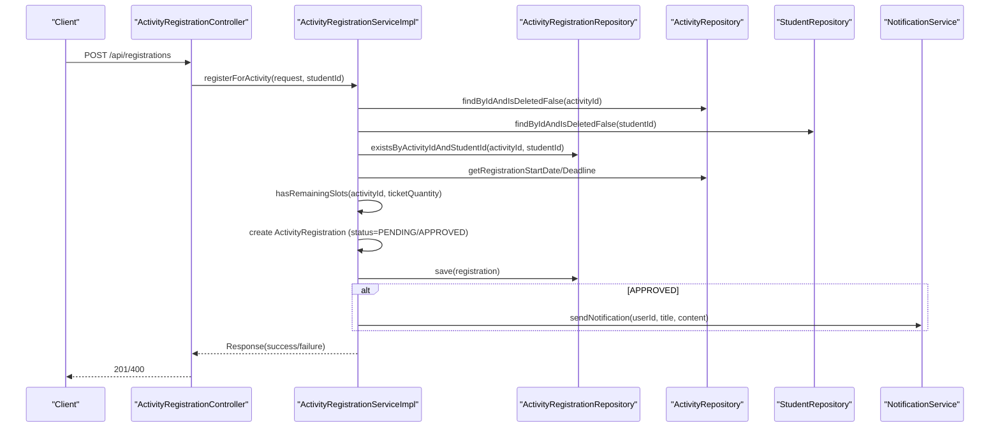
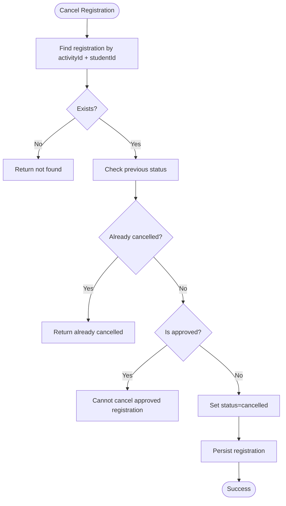
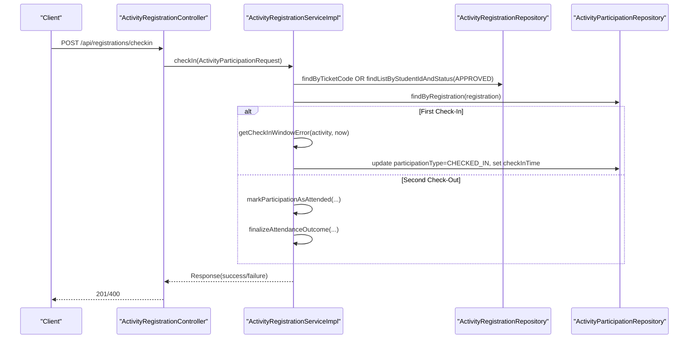
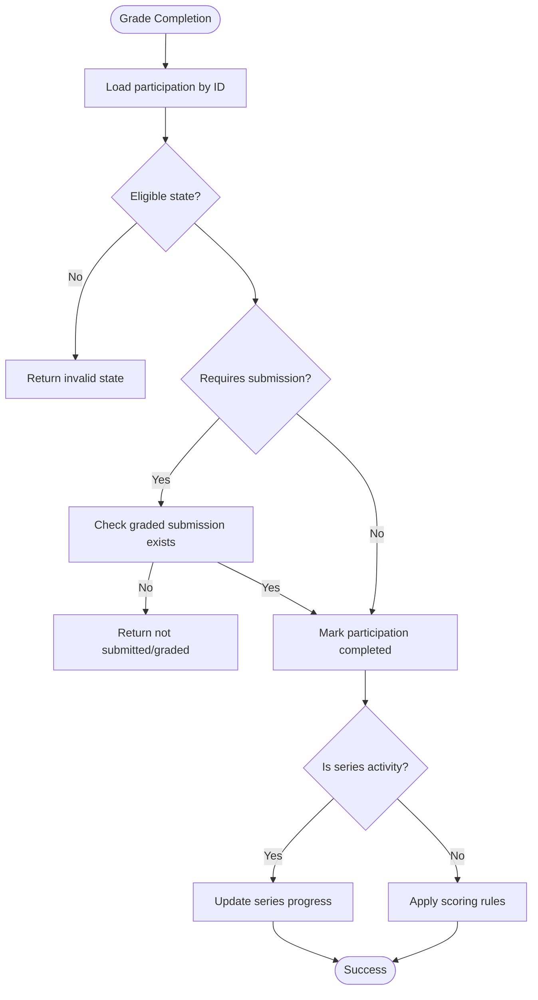
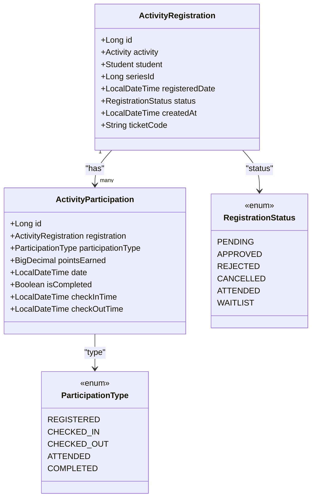
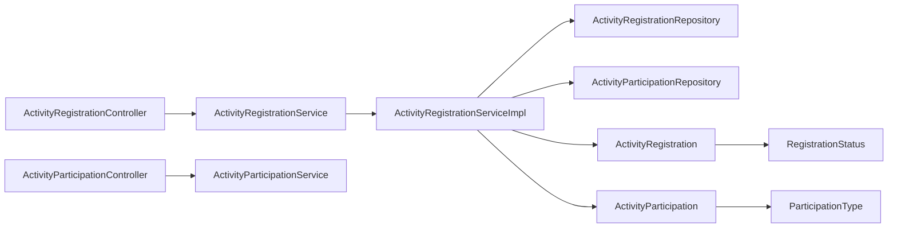

# Registration & Participation

<cite>
**Referenced Files in This Document**
- [ActivityRegistration.java](file://src/main/java/vn/campuslife/entity/ActivityRegistration.java)
- [ActivityParticipation.java](file://src/main/java/vn/campuslife/entity/ActivityParticipation.java)
- [RegistrationStatus.java](file://src/main/java/vn/campuslife/enumeration/RegistrationStatus.java)
- [ParticipationType.java](file://src/main/java/vn/campuslife/enumeration/ParticipationType.java)
- [ActivityRegistrationController.java](file://src/main/java/vn/campuslife/controller/activity/ActivityRegistrationController.java)
- [ActivityParticipationController.java](file://src/main/java/vn/campuslife/controller/activity/ActivityParticipationController.java)
- [ActivityRegistrationService.java](file://src/main/java/vn/campuslife/service/ActivityRegistrationService.java)
- [ActivityParticipationService.java](file://src/main/java/vn/campuslife/service/ActivityParticipationService.java)
- [ActivityRegistrationServiceImpl.java](file://src/main/java/vn/campuslife/service/impl/ActivityRegistrationServiceImpl.java)
- [ActivityRegistrationRequest.java](file://src/main/java/vn/campuslife/model/activity/ActivityRegistrationRequest.java)
- [ActivityParticipationRequest.java](file://src/main/java/vn/campuslife/model/activity/ActivityParticipationRequest.java)
- [ActivityRegistrationRepository.java](file://src/main/java/vn/campuslife/repository/ActivityRegistrationRepository.java)
- [ActivityParticipationRepository.java](file://src/main/java/vn/campuslife/repository/ActivityParticipationRepository.java)
</cite>

## Table of Contents
1. [Introduction](#introduction)
2. [Project Structure](#project-structure)
3. [Core Components](#core-components)
4. [Architecture Overview](#architecture-overview)
5. [Detailed Component Analysis](#detailed-component-analysis)
6. [Dependency Analysis](#dependency-analysis)
7. [Performance Considerations](#performance-considerations)
8. [Troubleshooting Guide](#troubleshooting-guide)
9. [Conclusion](#conclusion)
10. [Appendices](#appendices)

## Introduction
This document explains the activity registration and participation tracking system. It covers the end-to-end registration workflow (including capacity management, approval processes, and participant status tracking), participation management (attendance recording and completion grading), communication features, cancellation and waitlist support, and capacity optimization strategies. It also documents the entity models, status enumerations, and workflow states that govern the system.

## Project Structure
The registration and participation subsystem is organized around:
- Entities: ActivityRegistration and ActivityParticipation
- Enumerations: RegistrationStatus and ParticipationType
- Controllers: ActivityRegistrationController and ActivityParticipationController
- Services: ActivityRegistrationService and ActivityParticipationService
- Implementation: ActivityRegistrationServiceImpl
- Repositories: ActivityRegistrationRepository and ActivityParticipationRepository
- Model DTOs: ActivityRegistrationRequest and ActivityParticipationRequest

**Diagram sources**
- [ActivityRegistrationController.java:1-392](file://src/main/java/vn/campuslife/controller/activity/ActivityRegistrationController.java#L1-L392)
- [ActivityParticipationController.java:1-55](file://src/main/java/vn/campuslife/controller/activity/ActivityParticipationController.java#L1-L55)
- [ActivityRegistrationService.java:1-113](file://src/main/java/vn/campuslife/service/ActivityRegistrationService.java#L1-L113)
- [ActivityRegistrationServiceImpl.java:1-1139](file://src/main/java/vn/campuslife/service/impl/ActivityRegistrationServiceImpl.java#L1-L1139)
- [ActivityParticipationService.java:1-10](file://src/main/java/vn/campuslife/service/ActivityParticipationService.java#L1-L10)
- [ActivityRegistrationRepository.java:1-201](file://src/main/java/vn/campuslife/repository/ActivityRegistrationRepository.java#L1-L201)
- [ActivityParticipationRepository.java:1-126](file://src/main/java/vn/campuslife/repository/ActivityParticipationRepository.java#L1-L126)
- [ActivityRegistration.java:1-47](file://src/main/java/vn/campuslife/entity/ActivityRegistration.java#L1-L47)
- [ActivityParticipation.java:1-43](file://src/main/java/vn/campuslife/entity/ActivityParticipation.java#L1-L43)
- [RegistrationStatus.java:1-11](file://src/main/java/vn/campuslife/enumeration/RegistrationStatus.java#L1-L11)
- [ParticipationType.java:1-10](file://src/main/java/vn/campuslife/enumeration/ParticipationType.java#L1-L10)
- [ActivityRegistrationRequest.java:1-18](file://src/main/java/vn/campuslife/model/activity/ActivityRegistrationRequest.java#L1-L18)
- [ActivityParticipationRequest.java:1-27](file://src/main/java/vn/campuslife/model/activity/ActivityParticipationRequest.java#L1-L27)

**Section sources**
- [ActivityRegistrationController.java:1-392](file://src/main/java/vn/campuslife/controller/activity/ActivityRegistrationController.java#L1-L392)
- [ActivityParticipationController.java:1-55](file://src/main/java/vn/campuslife/controller/activity/ActivityParticipationController.java#L1-L55)
- [ActivityRegistrationService.java:1-113](file://src/main/java/vn/campuslife/service/ActivityRegistrationService.java#L1-L113)
- [ActivityRegistrationServiceImpl.java:1-1139](file://src/main/java/vn/campuslife/service/impl/ActivityRegistrationServiceImpl.java#L1-L1139)
- [ActivityParticipationService.java:1-10](file://src/main/java/vn/campuslife/service/ActivityParticipationService.java#L1-L10)
- [ActivityRegistrationRepository.java:1-201](file://src/main/java/vn/campuslife/repository/ActivityRegistrationRepository.java#L1-L201)
- [ActivityParticipationRepository.java:1-126](file://src/main/java/vn/campuslife/repository/ActivityParticipationRepository.java#L1-L126)
- [ActivityRegistration.java:1-47](file://src/main/java/vn/campuslife/entity/ActivityRegistration.java#L1-L47)
- [ActivityParticipation.java:1-43](file://src/main/java/vn/campuslife/entity/ActivityParticipation.java#L1-L43)
- [RegistrationStatus.java:1-11](file://src/main/java/vn/campuslife/enumeration/RegistrationStatus.java#L1-L11)
- [ParticipationType.java:1-10](file://src/main/java/vn/campuslife/enumeration/ParticipationType.java#L1-L10)
- [ActivityRegistrationRequest.java:1-18](file://src/main/java/vn/campuslife/model/activity/ActivityRegistrationRequest.java#L1-L18)
- [ActivityParticipationRequest.java:1-27](file://src/main/java/vn/campuslife/model/activity/ActivityParticipationRequest.java#L1-L27)

## Core Components
- ActivityRegistration: Links a student to an activity, tracks registration status, creation time, and ticket code. Supports series-linked registrations.
- ActivityParticipation: Tracks attendance and completion per registration, including check-in/out timestamps and grading outcomes.
- RegistrationStatus: Lifecycle states for registrations (pending, approved, rejected, cancelled, attended, waitlist).
- ParticipationType: Attendance lifecycle states (registered, checked-in, checked-out, attended, completed).
- Controllers: Expose REST endpoints for registration, cancellation, status updates, check-in (manual and QR), grading, reporting, and search.
- Services: Define business logic for registration, participation, notifications, reminders, and scoring.
- Repositories: Provide typed queries for registration and participation analytics and filtering.

**Section sources**
- [ActivityRegistration.java:1-47](file://src/main/java/vn/campuslife/entity/ActivityRegistration.java#L1-L47)
- [ActivityParticipation.java:1-43](file://src/main/java/vn/campuslife/entity/ActivityParticipation.java#L1-L43)
- [RegistrationStatus.java:1-11](file://src/main/java/vn/campuslife/enumeration/RegistrationStatus.java#L1-L11)
- [ParticipationType.java:1-10](file://src/main/java/vn/campuslife/enumeration/ParticipationType.java#L1-L10)
- [ActivityRegistrationController.java:1-392](file://src/main/java/vn/campuslife/controller/activity/ActivityRegistrationController.java#L1-L392)
- [ActivityParticipationController.java:1-55](file://src/main/java/vn/campuslife/controller/activity/ActivityParticipationController.java#L1-L55)
- [ActivityRegistrationService.java:1-113](file://src/main/java/vn/campuslife/service/ActivityRegistrationService.java#L1-L113)
- [ActivityParticipationService.java:1-10](file://src/main/java/vn/campuslife/service/ActivityParticipationService.java#L1-L10)
- [ActivityRegistrationRepository.java:1-201](file://src/main/java/vn/campuslife/repository/ActivityRegistrationRepository.java#L1-L201)
- [ActivityParticipationRepository.java:1-126](file://src/main/java/vn/campuslife/repository/ActivityParticipationRepository.java#L1-L126)

## Architecture Overview
The system follows a layered architecture:
- Presentation: Controllers expose endpoints for client consumption.
- Application: Services orchestrate business rules and coordinate repositories.
- Persistence: Repositories encapsulate data access and queries.
- Entities: JPA entities model domain objects with auditing hooks.

**Diagram sources**
- [ActivityRegistrationController.java:1-392](file://src/main/java/vn/campuslife/controller/activity/ActivityRegistrationController.java#L1-L392)
- [ActivityRegistrationServiceImpl.java:1-1139](file://src/main/java/vn/campuslife/service/impl/ActivityRegistrationServiceImpl.java#L1-L1139)
- [ActivityRegistrationRepository.java:1-201](file://src/main/java/vn/campuslife/repository/ActivityRegistrationRepository.java#L1-L201)
- [ActivityParticipationRepository.java:1-126](file://src/main/java/vn/campuslife/repository/ActivityParticipationRepository.java#L1-L126)
- [ActivityRegistration.java:1-47](file://src/main/java/vn/campuslife/entity/ActivityRegistration.java#L1-L47)
- [ActivityParticipation.java:1-43](file://src/main/java/vn/campuslife/entity/ActivityParticipation.java#L1-L43)
- [RegistrationStatus.java:1-11](file://src/main/java/vn/campuslife/enumeration/RegistrationStatus.java#L1-L11)
- [ParticipationType.java:1-10](file://src/main/java/vn/campuslife/enumeration/ParticipationType.java#L1-L10)

## Detailed Component Analysis

### Registration Workflow
End-to-end registration process:
- Validation: Activity existence, draft status, time windows, uniqueness, and capacity checks.
- Approval gating: Activities requiring approval default to pending; otherwise auto-approved.
- Ticket generation: Unique ticket code creation with collision checks.
- Notifications: Immediate feedback to students upon registration outcome.
- Reminders: Post-approval reminder scheduling for upcoming events.

**Diagram sources**
- [ActivityRegistrationController.java:39-56](file://src/main/java/vn/campuslife/controller/activity/ActivityRegistrationController.java#L39-L56)
- [ActivityRegistrationServiceImpl.java:54-175](file://src/main/java/vn/campuslife/service/impl/ActivityRegistrationServiceImpl.java#L54-L175)
- [ActivityRegistrationRepository.java:52-55](file://src/main/java/vn/campuslife/repository/ActivityRegistrationRepository.java#L52-L55)
- [ActivityRegistrationRepository.java:86-97](file://src/main/java/vn/campuslife/repository/ActivityRegistrationRepository.java#L86-L97)

Key behaviors:
- Capacity management: Capacity checks prevent over-registration when approvals are required.
- Approval process: Pending vs approved status drives downstream actions (e.g., participation creation, reminders).
- Participant status tracking: Registration status transitions are persisted and retrievable.

**Section sources**
- [ActivityRegistrationController.java:39-56](file://src/main/java/vn/campuslife/controller/activity/ActivityRegistrationController.java#L39-L56)
- [ActivityRegistrationServiceImpl.java:54-175](file://src/main/java/vn/campuslife/service/impl/ActivityRegistrationServiceImpl.java#L54-L175)
- [ActivityRegistrationRepository.java:52-55](file://src/main/java/vn/campuslife/repository/ActivityRegistrationRepository.java#L52-L55)
- [ActivityRegistrationRepository.java:86-97](file://src/main/java/vn/campuslife/repository/ActivityRegistrationRepository.java#L86-L97)

### Cancellation and Waitlist Management
Cancellation:
- Allowed only for pending registrations; approved registrations cannot be cancelled manually.
- On cancellation, status is set to cancelled and persisted.

Waitlist:
- The service interface declares a waitlist registration method, indicating planned support for waitlist management.

**Diagram sources**
- [ActivityRegistrationServiceImpl.java:178-209](file://src/main/java/vn/campuslife/service/impl/ActivityRegistrationServiceImpl.java#L178-L209)
- [ActivityRegistrationRepository.java:32-35](file://src/main/java/vn/campuslife/repository/ActivityRegistrationRepository.java#L32-L35)

**Section sources**
- [ActivityRegistrationServiceImpl.java:178-209](file://src/main/java/vn/campuslife/service/impl/ActivityRegistrationServiceImpl.java#L178-L209)
- [ActivityRegistrationService.java:18-21](file://src/main/java/vn/campuslife/service/ActivityRegistrationService.java#L18-L21)

### Attendance Recording and Completion Grading
Two attendance modes:
- Manual check-in via ticket code or student ID.
- QR-based check-in using activity-specific check-in codes.

Grading:
- Completion grading sets participation to completed after verifying eligibility and submission requirements.

**Diagram sources**
- [ActivityRegistrationController.java:217-245](file://src/main/java/vn/campuslife/controller/activity/ActivityRegistrationController.java#L217-L245)
- [ActivityRegistrationServiceImpl.java:404-482](file://src/main/java/vn/campuslife/service/impl/ActivityRegistrationServiceImpl.java#L404-L482)
- [ActivityRegistrationRepository.java:412-422](file://src/main/java/vn/campuslife/repository/ActivityRegistrationRepository.java#L412-L422)
- [ActivityParticipationRepository.java:22-23](file://src/main/java/vn/campuslife/repository/ActivityParticipationRepository.java#L22-L23)

Grading completion:
- Validates eligibility (attended/completed).
- For submission-required activities, ensures graded submission exists.
- Applies scoring or series progress updates depending on activity type.

**Diagram sources**
- [ActivityRegistrationServiceImpl.java:551-637](file://src/main/java/vn/campuslife/service/impl/ActivityRegistrationServiceImpl.java#L551-L637)

**Section sources**
- [ActivityRegistrationController.java:217-245](file://src/main/java/vn/campuslife/controller/activity/ActivityRegistrationController.java#L217-L245)
- [ActivityRegistrationServiceImpl.java:404-482](file://src/main/java/vn/campuslife/service/impl/ActivityRegistrationServiceImpl.java#L404-L482)
- [ActivityRegistrationServiceImpl.java:551-637](file://src/main/java/vn/campuslife/service/impl/ActivityRegistrationServiceImpl.java#L551-L637)

### Communication Features
- Registration outcome notifications: Sent immediately upon approval/pending decisions.
- Status update notifications: Sent when registrations are approved or rejected.
- Reminder scheduling: Automatically schedules reminders for approved registrations.

**Section sources**
- [ActivityRegistrationServiceImpl.java:138-168](file://src/main/java/vn/campuslife/service/impl/ActivityRegistrationServiceImpl.java#L138-L168)
- [ActivityRegistrationServiceImpl.java:321-355](file://src/main/java/vn/campuslife/service/impl/ActivityRegistrationServiceImpl.java#L321-L355)

### Reporting and Search
- Participation report: Lists attendees vs non-attendees for an activity.
- Search: Filters registrations by keyword and status across activity names.

**Section sources**
- [ActivityRegistrationController.java:298-305](file://src/main/java/vn/campuslife/controller/activity/ActivityRegistrationController.java#L298-L305)
- [ActivityRegistrationServiceImpl.java:672-709](file://src/main/java/vn/campuslife/service/impl/ActivityRegistrationServiceImpl.java#L672-L709)
- [ActivityRegistrationRepository.java:168-180](file://src/main/java/vn/campuslife/repository/ActivityRegistrationRepository.java#L168-L180)

### Entity Models and Status Enumerations

**Diagram sources**
- [ActivityRegistration.java:1-47](file://src/main/java/vn/campuslife/entity/ActivityRegistration.java#L1-L47)
- [ActivityParticipation.java:1-43](file://src/main/java/vn/campuslife/entity/ActivityParticipation.java#L1-L43)
- [RegistrationStatus.java:1-11](file://src/main/java/vn/campuslife/enumeration/RegistrationStatus.java#L1-L11)
- [ParticipationType.java:1-10](file://src/main/java/vn/campuslife/enumeration/ParticipationType.java#L1-L10)

**Section sources**
- [ActivityRegistration.java:1-47](file://src/main/java/vn/campuslife/entity/ActivityRegistration.java#L1-L47)
- [ActivityParticipation.java:1-43](file://src/main/java/vn/campuslife/entity/ActivityParticipation.java#L1-L43)
- [RegistrationStatus.java:1-11](file://src/main/java/vn/campuslife/enumeration/RegistrationStatus.java#L1-L11)
- [ParticipationType.java:1-10](file://src/main/java/vn/campuslife/enumeration/ParticipationType.java#L1-L10)

## Dependency Analysis
- Controllers depend on services for business operations.
- Services depend on repositories for persistence and queries.
- Entities define relationships and constraints.
- Enumerations standardize state transitions.

**Diagram sources**
- [ActivityRegistrationController.java:1-392](file://src/main/java/vn/campuslife/controller/activity/ActivityRegistrationController.java#L1-L392)
- [ActivityParticipationController.java:1-55](file://src/main/java/vn/campuslife/controller/activity/ActivityParticipationController.java#L1-L55)
- [ActivityRegistrationService.java:1-113](file://src/main/java/vn/campuslife/service/ActivityRegistrationService.java#L1-L113)
- [ActivityParticipationService.java:1-10](file://src/main/java/vn/campuslife/service/ActivityParticipationService.java#L1-L10)
- [ActivityRegistrationServiceImpl.java:1-1139](file://src/main/java/vn/campuslife/service/impl/ActivityRegistrationServiceImpl.java#L1-L1139)
- [ActivityRegistrationRepository.java:1-201](file://src/main/java/vn/campuslife/repository/ActivityRegistrationRepository.java#L1-L201)
- [ActivityParticipationRepository.java:1-126](file://src/main/java/vn/campuslife/repository/ActivityParticipationRepository.java#L1-L126)
- [ActivityRegistration.java:1-47](file://src/main/java/vn/campuslife/entity/ActivityRegistration.java#L1-L47)
- [ActivityParticipation.java:1-43](file://src/main/java/vn/campuslife/entity/ActivityParticipation.java#L1-L43)
- [RegistrationStatus.java:1-11](file://src/main/java/vn/campuslife/enumeration/RegistrationStatus.java#L1-L11)
- [ParticipationType.java:1-10](file://src/main/java/vn/campuslife/enumeration/ParticipationType.java#L1-L10)

**Section sources**
- [ActivityRegistrationController.java:1-392](file://src/main/java/vn/campuslife/controller/activity/ActivityRegistrationController.java#L1-L392)
- [ActivityParticipationController.java:1-55](file://src/main/java/vn/campuslife/controller/activity/ActivityParticipationController.java#L1-L55)
- [ActivityRegistrationService.java:1-113](file://src/main/java/vn/campuslife/service/ActivityRegistrationService.java#L1-L113)
- [ActivityParticipationService.java:1-10](file://src/main/java/vn/campuslife/service/ActivityParticipationService.java#L1-L10)
- [ActivityRegistrationServiceImpl.java:1-1139](file://src/main/java/vn/campuslife/service/impl/ActivityRegistrationServiceImpl.java#L1-L1139)
- [ActivityRegistrationRepository.java:1-201](file://src/main/java/vn/campuslife/repository/ActivityRegistrationRepository.java#L1-L201)
- [ActivityParticipationRepository.java:1-126](file://src/main/java/vn/campuslife/repository/ActivityParticipationRepository.java#L1-L126)

## Performance Considerations
- Capacity checks: Efficiently compute remaining slots to avoid unnecessary saves.
- Batch operations: Use repository queries for reporting and analytics to minimize round trips.
- Indexing: Ensure database indexes on frequently queried columns (e.g., activityId, studentId, status, ticketCode).
- Asynchronous notifications: Offload notification dispatch to avoid blocking request threads.
- Pagination: Use paginated queries for large participation lists and reports.

## Troubleshooting Guide
Common issues and resolutions:
- Registration not found: Verify activity existence and draft status; ensure registration deadlines are valid.
- Already registered: Prevent duplicate registrations per student per activity.
- Registration deadline passed: Enforce registration window checks.
- Activity is full: Capacity checks block further approvals; consider waitlist support.
- Cannot cancel approved registration: Approved registrations cannot be cancelled; inform users accordingly.
- Check-in errors: Validate activity publication status, participation state, and check-in/out timing windows.
- QR-based check-in failures: Confirm activity check-in code validity and student’s approved registration.

**Section sources**
- [ActivityRegistrationServiceImpl.java:54-175](file://src/main/java/vn/campuslife/service/impl/ActivityRegistrationServiceImpl.java#L54-L175)
- [ActivityRegistrationServiceImpl.java:178-209](file://src/main/java/vn/campuslife/service/impl/ActivityRegistrationServiceImpl.java#L178-L209)
- [ActivityRegistrationServiceImpl.java:404-482](file://src/main/java/vn/campuslife/service/impl/ActivityRegistrationServiceImpl.java#L404-L482)
- [ActivityRegistrationServiceImpl.java:484-546](file://src/main/java/vn/campuslife/service/impl/ActivityRegistrationServiceImpl.java#L484-L546)

## Conclusion
The registration and participation system provides a robust foundation for managing activity sign-ups, approvals, attendance, and completion grading. It supports capacity-aware registration, flexible check-in mechanisms, and integrated notifications and reminders. Extending waitlist capabilities and optimizing analytics queries will further enhance scalability and user experience.

## Appendices

### Practical Scenarios
- Registration process: A student registers for a published activity; if approval is required, status becomes pending; otherwise, approved with reminders scheduled.
- Participation tracking: A student checks in using a ticket code; on second check-out, the system finalizes attendance and optionally applies scoring or series progression.
- Participant management: Administrators can update registration status, generate participation reports, and grade completions for submission-based activities.

### Capacity Optimization Strategies
- Dynamic capacity checks during registration.
- Automatic backfill of missing participation records post-approval.
- Reporting and analytics to identify peak registration times and popular activities.

**Section sources**
- [ActivityRegistrationServiceImpl.java:787-800](file://src/main/java/vn/campuslife/service/impl/ActivityRegistrationServiceImpl.java#L787-L800)
- [ActivityRegistrationRepository.java:100-108](file://src/main/java/vn/campuslife/repository/ActivityRegistrationRepository.java#L100-L108)
- [ActivityRegistrationServiceImpl.java:672-709](file://src/main/java/vn/campuslife/service/impl/ActivityRegistrationServiceImpl.java#L672-L709)