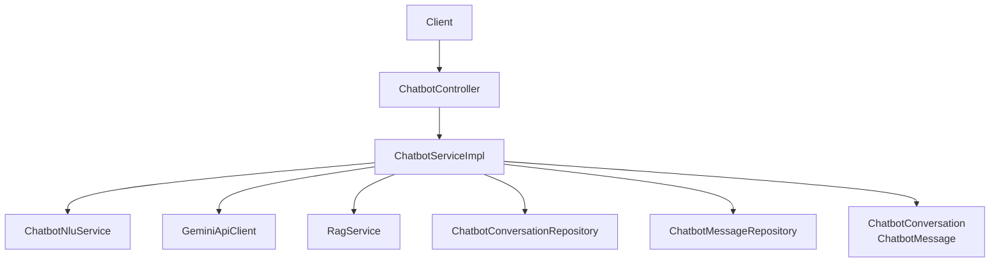
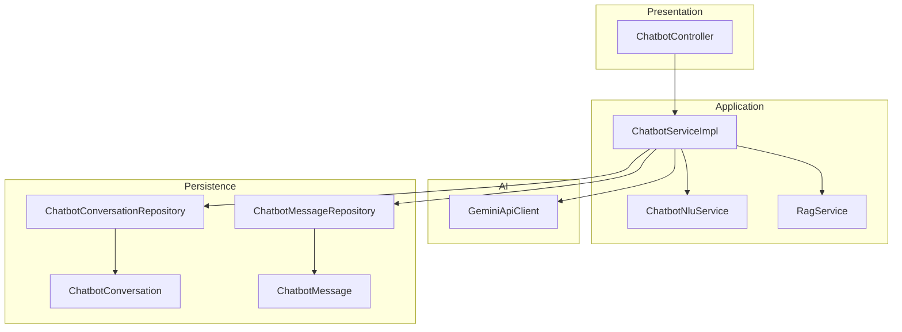
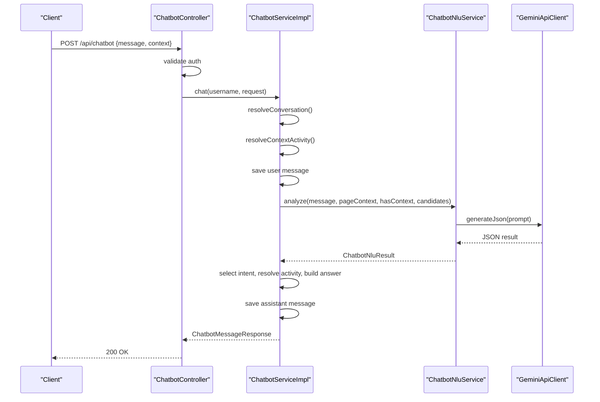
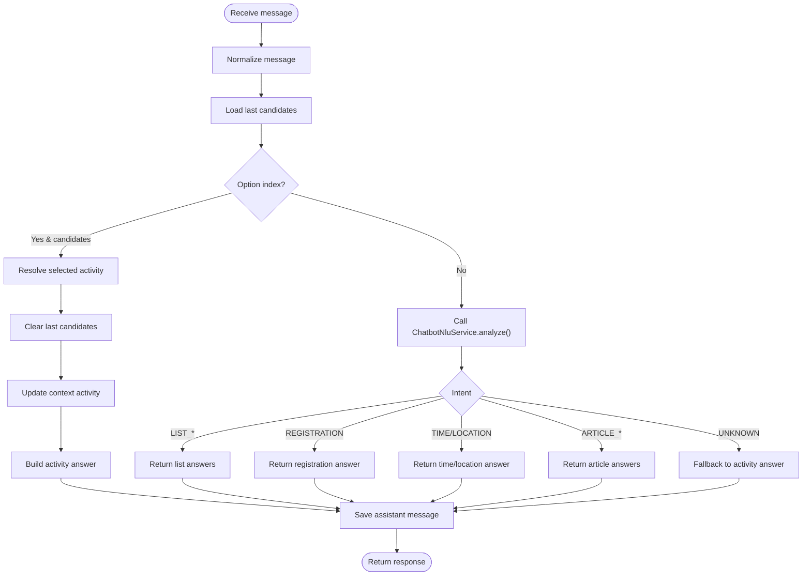
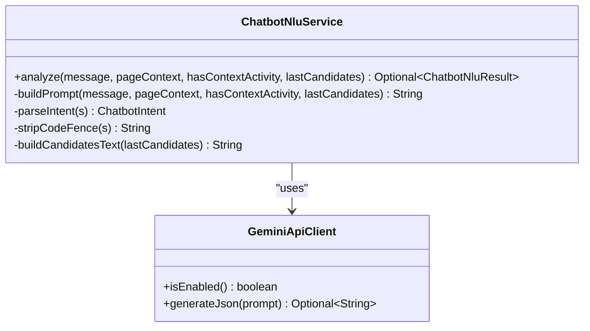
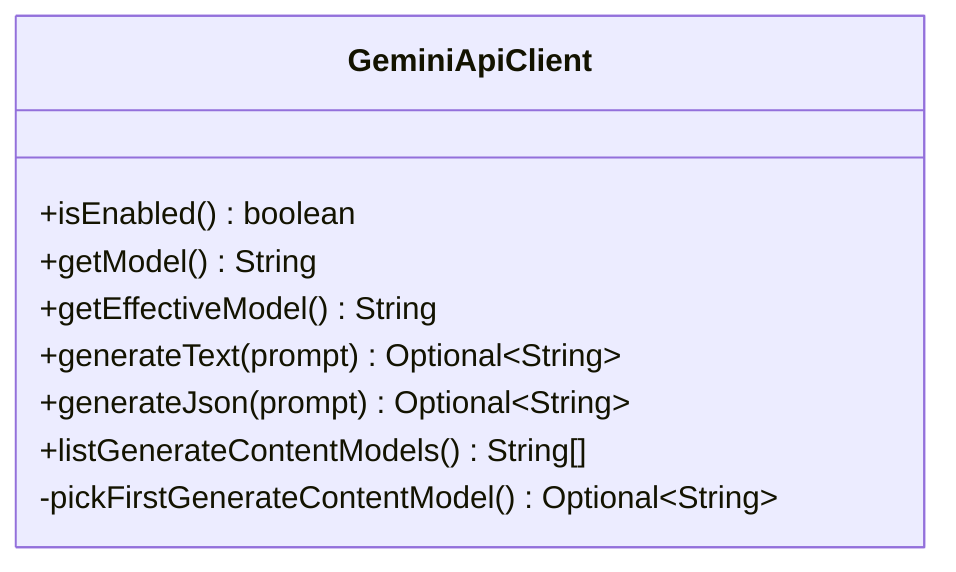
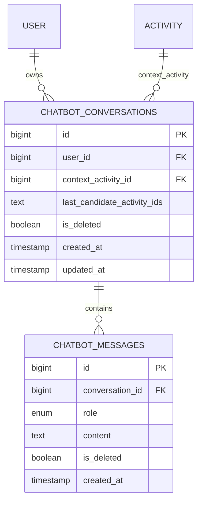
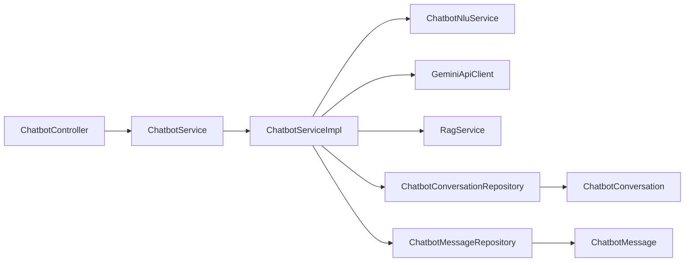

# Chatbot Integration

<cite>
**Referenced Files in This Document**
- [ChatbotController.java](file://src/main/java/vn/campuslife/controller/communication/ChatbotController.java)
- [ChatbotService.java](file://src/main/java/vn/campuslife/service/ChatbotService.java)
- [ChatbotServiceImpl.java](file://src/main/java/vn/campuslife/service/impl/ChatbotServiceImpl.java)
- [ChatbotNluService.java](file://src/main/java/vn/campuslife/service/ai/ChatbotNluService.java)
- [GeminiApiClient.java](file://src/main/java/vn/campuslife/service/ai/GeminiApiClient.java)
- [RagService.java](file://src/main/java/vn/campuslife/service/RagService.java)
- [ChatbotConversation.java](file://src/main/java/vn/campuslife/entity/ChatbotConversation.java)
- [ChatbotMessage.java](file://src/main/java/vn/campuslife/entity/ChatbotMessage.java)
- [ChatbotConversationRepository.java](file://src/main/java/vn/campuslife/repository/ChatbotConversationRepository.java)
- [ChatbotMessageRepository.java](file://src/main/java/vn/campuslife/repository/ChatbotMessageRepository.java)
- [ChatbotMessageRequest.java](file://src/main/java/vn/campuslife/model/ChatbotMessageRequest.java)
- [ChatbotMessageResponse.java](file://src/main/java/vn/campuslife/model/ChatbotMessageResponse.java)
- [ChatbotIntent.java](file://src/main/java/vn/campuslife/enumeration/ChatbotIntent.java)
- [ChatbotMessageRole.java](file://src/main/java/vn/campuslife/enumeration/ChatbotMessageRole.java)
- [ChatbotPageContext.java](file://src/main/java/vn/campuslife/enumeration/ChatbotPageContext.java)
</cite>

## Table of Contents
1. [Introduction](#introduction)
2. [Project Structure](#project-structure)
3. [Core Components](#core-components)
4. [Architecture Overview](#architecture-overview)
5. [Detailed Component Analysis](#detailed-component-analysis)
6. [Dependency Analysis](#dependency-analysis)
7. [Performance Considerations](#performance-considerations)
8. [Troubleshooting Guide](#troubleshooting-guide)
9. [Conclusion](#conclusion)
10. [Appendices](#appendices)

## Introduction
This document explains the chatbot integration for campus life events and activities. It covers AI conversation handling, Natural Language Understanding (NLU), and Gemini API integration. It documents conversation management with history tracking, message threading, and context preservation. It also details NLU processing for intent recognition, entity extraction, and conversation flow management. Finally, it explains Gemini API integration for advanced AI responses, conversation continuation, and intelligent activity recommendations, with practical examples and troubleshooting guidance.

## Project Structure
The chatbot feature spans controllers, services, repositories, entities, enumerations, and models. The primary entry point is the REST controller that exposes endpoints for chatbot status, model discovery, and chat interactions. The service orchestrates conversation lifecycle, NLU interpretation, activity resolution, and AI-driven responses via Gemini.

**Diagram sources**
- [ChatbotController.java:27-98](file://src/main/java/vn/campuslife/controller/communication/ChatbotController.java#L27-L98)
- [ChatbotServiceImpl.java:71-102](file://src/main/java/vn/campuslife/service/impl/ChatbotServiceImpl.java#L71-L102)
- [ChatbotNluService.java:21-50](file://src/main/java/vn/campuslife/service/ai/ChatbotNluService.java#L21-L50)
- [GeminiApiClient.java:48-138](file://src/main/java/vn/campuslife/service/ai/GeminiApiClient.java#L48-L138)
- [RagService.java:5-7](file://src/main/java/vn/campuslife/service/RagService.java#L5-L7)
- [ChatbotConversationRepository.java:12-16](file://src/main/java/vn/campuslife/repository/ChatbotConversationRepository.java#L12-L16)
- [ChatbotMessageRepository.java:12-16](file://src/main/java/vn/campuslife/repository/ChatbotMessageRepository.java#L12-L16)
- [ChatbotConversation.java:27-51](file://src/main/java/vn/campuslife/entity/ChatbotConversation.java#L27-L51)
- [ChatbotMessage.java:29-50](file://src/main/java/vn/campuslife/entity/ChatbotMessage.java#L29-L50)

**Section sources**
- [ChatbotController.java:27-98](file://src/main/java/vn/campuslife/controller/communication/ChatbotController.java#L27-L98)
- [ChatbotServiceImpl.java:71-102](file://src/main/java/vn/campuslife/service/impl/ChatbotServiceImpl.java#L71-L102)

## Core Components
- ChatbotController: Exposes endpoints for chatbot status, model listing, ping, and chat requests. It validates authentication and delegates to ChatbotService and GeminiApiClient.
- ChatbotService and ChatbotServiceImpl: Implements the chatbot logic, manages conversations, resolves context, performs NLU analysis, selects activities, and generates responses.
- ChatbotNluService: Uses Gemini to parse user messages into structured intents and entities (intent, option index, activity query, score type).
- GeminiApiClient: Integrates with Google Gemini API for text and JSON generation, model discovery, and robust error handling.
- Repositories and Entities: Persist conversations and messages, enabling history tracking and context preservation.
- Models and Enumerations: Define request/response contracts and semantic categories (intents, roles, page contexts).

**Section sources**
- [ChatbotController.java:27-98](file://src/main/java/vn/campuslife/controller/communication/ChatbotController.java#L27-L98)
- [ChatbotService.java:6-8](file://src/main/java/vn/campuslife/service/ChatbotService.java#L6-L8)
- [ChatbotServiceImpl.java:71-328](file://src/main/java/vn/campuslife/service/impl/ChatbotServiceImpl.java#L71-L328)
- [ChatbotNluService.java:21-50](file://src/main/java/vn/campuslife/service/ai/ChatbotNluService.java#L21-L50)
- [GeminiApiClient.java:48-138](file://src/main/java/vn/campuslife/service/ai/GeminiApiClient.java#L48-L138)
- [ChatbotConversation.java:27-51](file://src/main/java/vn/campuslife/entity/ChatbotConversation.java#L27-L51)
- [ChatbotMessage.java:29-50](file://src/main/java/vn/campuslife/entity/ChatbotMessage.java#L29-L50)
- [ChatbotMessageRequest.java:7-13](file://src/main/java/vn/campuslife/model/ChatbotMessageRequest.java#L7-L13)
- [ChatbotMessageResponse.java:13-19](file://src/main/java/vn/campuslife/model/ChatbotMessageResponse.java#L13-L19)
- [ChatbotIntent.java:3-23](file://src/main/java/vn/campuslife/enumeration/ChatbotIntent.java#L3-L23)
- [ChatbotMessageRole.java:3-6](file://src/main/java/vn/campuslife/enumeration/ChatbotMessageRole.java#L3-L6)
- [ChatbotPageContext.java:3-7](file://src/main/java/vn/campuslife/enumeration/ChatbotPageContext.java#L3-L7)

## Architecture Overview
The chatbot architecture follows a layered design:
- Presentation: REST endpoints exposed by ChatbotController.
- Application: ChatbotServiceImpl coordinates NLU, context resolution, activity selection, and AI responses.
- AI: GeminiApiClient integrates with Google Gemini API for natural language understanding and generation.
- Persistence: ChatbotConversation and ChatbotMessage entities persist conversation history and context.
- Contracts: Models and enumerations define request/response semantics and intent taxonomy.

**Diagram sources**
- [ChatbotController.java:27-98](file://src/main/java/vn/campuslife/controller/communication/ChatbotController.java#L27-L98)
- [ChatbotServiceImpl.java:71-328](file://src/main/java/vn/campuslife/service/impl/ChatbotServiceImpl.java#L71-L328)
- [ChatbotNluService.java:21-50](file://src/main/java/vn/campuslife/service/ai/ChatbotNluService.java#L21-L50)
- [GeminiApiClient.java:48-138](file://src/main/java/vn/campuslife/service/ai/GeminiApiClient.java#L48-L138)
- [ChatbotConversationRepository.java:12-16](file://src/main/java/vn/campuslife/repository/ChatbotConversationRepository.java#L12-L16)
- [ChatbotMessageRepository.java:12-16](file://src/main/java/vn/campuslife/repository/ChatbotMessageRepository.java#L12-L16)
- [ChatbotConversation.java:27-51](file://src/main/java/vn/campuslife/entity/ChatbotConversation.java#L27-L51)
- [ChatbotMessage.java:29-50](file://src/main/java/vn/campuslife/entity/ChatbotMessage.java#L29-L50)

## Detailed Component Analysis

### ChatbotController
- Exposes:
  - GET /api/chatbot/status: Returns Gemini availability and configured model.
  - GET /api/chatbot/gemini/ping: Tests connectivity and returns status and effective model.
  - GET /api/chatbot/gemini/models: Lists available generateContent models.
  - POST /api/chatbot: Processes user messages and returns chatbot responses.
- Authentication: Requires a valid authenticated user; otherwise returns 401.
- Error handling: Catches exceptions during chat processing and returns a safe fallback response.

**Diagram sources**
- [ChatbotController.java:82-98](file://src/main/java/vn/campuslife/controller/communication/ChatbotController.java#L82-L98)
- [ChatbotServiceImpl.java:71-102](file://src/main/java/vn/campuslife/service/impl/ChatbotServiceImpl.java#L71-L102)
- [ChatbotNluService.java:21-50](file://src/main/java/vn/campuslife/service/ai/ChatbotNluService.java#L21-L50)
- [GeminiApiClient.java:48-138](file://src/main/java/vn/campuslife/service/ai/GeminiApiClient.java#L48-L138)

**Section sources**
- [ChatbotController.java:27-98](file://src/main/java/vn/campuslife/controller/communication/ChatbotController.java#L27-L98)

### ChatbotServiceImpl
Responsibilities:
- Conversation lifecycle:
  - Resolve or create a conversation scoped to the authenticated user.
  - Track last candidate activity IDs for disambiguation.
  - Preserve context activity for page-specific interactions.
- Message handling:
  - Save user and assistant messages.
  - Normalize input and detect numeric or Vietnamese option indices.
- Intent processing:
  - Delegate to ChatbotNluService for structured intent parsing.
  - Handle explicit option selection and context-aware intents (time, location, registration slots).
- Activity-centric answers:
  - Build responses for time, location, contact, check-in, benefits, requirements, points, and summary.
  - Provide registration details including deadlines, approval requirement, ticket quantity, and user’s current status.
- Listing and filtering:
  - Upcoming, ongoing, past, open-registration activities.
  - Filter by score type.
- Article integration:
  - Link activity to published articles and summarize content via Gemini when enabled.
- Support questions:
  - Route general support queries to RAG service if available.

**Diagram sources**
- [ChatbotServiceImpl.java:149-328](file://src/main/java/vn/campuslife/service/impl/ChatbotServiceImpl.java#L149-L328)
- [ChatbotNluService.java:21-50](file://src/main/java/vn/campuslife/service/ai/ChatbotNluService.java#L21-L50)

**Section sources**
- [ChatbotServiceImpl.java:71-328](file://src/main/java/vn/campuslife/service/impl/ChatbotServiceImpl.java#L71-L328)

### ChatbotNluService
- Purpose: Convert free-form user messages into structured intent and entities using Gemini.
- Inputs: Message, page context, presence of context activity, and last candidate activities.
- Output: ChatbotNluResult with intent, optional option index, activity query, and score type.
- Prompt engineering: Defines valid intents, context rules, and JSON schema for deterministic parsing.

**Diagram sources**
- [ChatbotNluService.java:21-151](file://src/main/java/vn/campuslife/service/ai/ChatbotNluService.java#L21-L151)
- [GeminiApiClient.java:48-138](file://src/main/java/vn/campuslife/service/ai/GeminiApiClient.java#L48-L138)

**Section sources**
- [ChatbotNluService.java:21-151](file://src/main/java/vn/campuslife/service/ai/ChatbotNluService.java#L21-L151)

### GeminiApiClient
- Purpose: Integrate with Google Gemini API for text and JSON generation, model discovery, and robust error handling.
- Features:
  - Enable/disable based on API key presence.
  - Generate text and JSON with temperature and responseMimeType.
  - Discover available generateContent models and auto-pick a suitable model.
  - Robust error mapping for HTTP errors, blocked content, network issues, and empty responses.
- Responses:
  - Returns structured error markers for downstream handling (e.g., "__GEMINI_HTTP__", "__GEMINI_BLOCKED__", "__GEMINI_NETWORK__", "__GEMINI_EMPTY__").

**Diagram sources**
- [GeminiApiClient.java:48-216](file://src/main/java/vn/campuslife/service/ai/GeminiApiClient.java#L48-L216)

**Section sources**
- [GeminiApiClient.java:48-216](file://src/main/java/vn/campuslife/service/ai/GeminiApiClient.java#L48-L216)

### Entities and Repositories
- ChatbotConversation:
  - Links to User and optionally to Activity (context).
  - Stores last candidate activity IDs and timestamps.
- ChatbotMessage:
  - Role (USER or ASSISTANT), content, and timestamps.
- Repositories:
  - Find conversations/messages by filters and pagination.
  - Enforce soft-deleted records and user scoping.

**Diagram sources**
- [ChatbotConversation.java:27-51](file://src/main/java/vn/campuslife/entity/ChatbotConversation.java#L27-L51)
- [ChatbotMessage.java:29-50](file://src/main/java/vn/campuslife/entity/ChatbotMessage.java#L29-L50)
- [ChatbotConversationRepository.java:12-16](file://src/main/java/vn/campuslife/repository/ChatbotConversationRepository.java#L12-L16)
- [ChatbotMessageRepository.java:12-16](file://src/main/java/vn/campuslife/repository/ChatbotMessageRepository.java#L12-L16)

**Section sources**
- [ChatbotConversation.java:27-51](file://src/main/java/vn/campuslife/entity/ChatbotConversation.java#L27-L51)
- [ChatbotMessage.java:29-50](file://src/main/java/vn/campuslife/entity/ChatbotMessage.java#L29-L50)
- [ChatbotConversationRepository.java:12-16](file://src/main/java/vn/campuslife/repository/ChatbotConversationRepository.java#L12-L16)
- [ChatbotMessageRepository.java:12-16](file://src/main/java/vn/campuslife/repository/ChatbotMessageRepository.java#L12-L16)

### Models and Enumerations
- ChatbotMessageRequest: Encapsulates conversationId, contextActivityId, contextArticleSlug, pageContext, and message.
- ChatbotMessageResponse: Contains conversationId, answer, resolvedActivity, needsClarification flag, and activityOptions.
- ChatbotIntent: Defines supported intents (e.g., TIME, LOCATION, REGISTRATION, LIST_*).
- ChatbotMessageRole: USER or ASSISTANT.
- ChatbotPageContext: GLOBAL, ACTIVITY_DETAIL, ARTICLE_DETAIL.

**Section sources**
- [ChatbotMessageRequest.java:7-13](file://src/main/java/vn/campuslife/model/ChatbotMessageRequest.java#L7-L13)
- [ChatbotMessageResponse.java:13-19](file://src/main/java/vn/campuslife/model/ChatbotMessageResponse.java#L13-L19)
- [ChatbotIntent.java:3-23](file://src/main/java/vn/campuslife/enumeration/ChatbotIntent.java#L3-L23)
- [ChatbotMessageRole.java:3-6](file://src/main/java/vn/campuslife/enumeration/ChatbotMessageRole.java#L3-L6)
- [ChatbotPageContext.java:3-7](file://src/main/java/vn/campuslife/enumeration/ChatbotPageContext.java#L3-L7)

## Dependency Analysis
- Controller depends on ChatbotService and GeminiApiClient.
- ChatbotServiceImpl depends on:
  - ChatbotNluService for intent parsing.
  - GeminiApiClient for AI generation.
  - RagService for support queries.
  - Repositories for persistence.
- Entities form a small, cohesive domain for conversation/message storage.
- No circular dependencies observed among major components.

**Diagram sources**
- [ChatbotController.java:24-25](file://src/main/java/vn/campuslife/controller/communication/ChatbotController.java#L24-L25)
- [ChatbotServiceImpl.java:61-70](file://src/main/java/vn/campuslife/service/impl/ChatbotServiceImpl.java#L61-L70)
- [ChatbotNluService.java:18-19](file://src/main/java/vn/campuslife/service/ai/ChatbotNluService.java#L18-L19)
- [GeminiApiClient.java:25-33](file://src/main/java/vn/campuslife/service/ai/GeminiApiClient.java#L25-L33)
- [ChatbotConversationRepository.java:12-16](file://src/main/java/vn/campuslife/repository/ChatbotConversationRepository.java#L12-L16)
- [ChatbotMessageRepository.java:12-16](file://src/main/java/vn/campuslife/repository/ChatbotMessageRepository.java#L12-L16)

**Section sources**
- [ChatbotController.java:24-25](file://src/main/java/vn/campuslife/controller/communication/ChatbotController.java#L24-L25)
- [ChatbotServiceImpl.java:61-70](file://src/main/java/vn/campuslife/service/impl/ChatbotServiceImpl.java#L61-L70)

## Performance Considerations
- NLU and AI calls:
  - Gemini API calls incur latency; cache or reuse responses where appropriate.
  - Prefer JSON mode for deterministic parsing to reduce retries.
- Pagination:
  - Listing activities uses PageRequest; tune page sizes for responsiveness.
- Candidate caching:
  - lastCandidateActivityIds reduces repeated disambiguation prompts.
- Network resilience:
  - GeminiApiClient handles network and HTTP errors; surface concise messages to clients.

[No sources needed since this section provides general guidance]

## Troubleshooting Guide
Common issues and resolutions:
- NLU processing failures:
  - Symptoms: Empty or malformed JSON from Gemini.
  - Causes: Missing API key, quota limits, or blocked content.
  - Actions: Verify GEMINI_API_KEY, check quotas, review prompt feedback, and retry.
- API integration problems:
  - Symptoms: "__GEMINI_HTTP__", "__GEMINI_NETWORK__", "__GEMINI_EMPTY__".
  - Actions: Validate endpoint accessibility, firewall/DNS, API key correctness, and model availability.
- Conversation context management:
  - Symptoms: Context lost between messages or incorrect activity answers.
  - Actions: Ensure contextActivity is set when navigating to activity/article pages; confirm pageContext is accurate; verify lastCandidateActivityIds are persisted.
- Disambiguation not triggered:
  - Symptoms: User selects an option but bot does not resolve.
  - Actions: Confirm option index detection and that last candidates are stored; ensure intent parsing returns CHOOSE_OPTION.

**Section sources**
- [GeminiApiClient.java:115-137](file://src/main/java/vn/campuslife/service/ai/GeminiApiClient.java#L115-L137)
- [ChatbotServiceImpl.java:169-187](file://src/main/java/vn/campuslife/service/impl/ChatbotServiceImpl.java#L169-L187)
- [ChatbotServiceImpl.java:409-415](file://src/main/java/vn/campuslife/service/impl/ChatbotServiceImpl.java#L409-L415)

## Conclusion
The chatbot integration combines robust conversation management, NLU-driven intent parsing, and Gemini-powered generation to deliver contextual, activity-focused assistance. It supports listing, filtering, and resolving activities, plus article summarization and registration insights. The modular design enables easy extension for new intents and capabilities while maintaining clear separation of concerns.

[No sources needed since this section summarizes without analyzing specific files]

## Appendices

### Practical Chatbot Workflows
- Activity information queries:
  - Ask about time, location, contact info, check-in code, benefits, requirements, or points.
  - Example triggers: “When is the event?”, “Where is it held?”
- Registration assistance:
  - Request registration deadlines, approval requirements, and slot availability.
  - Example triggers: “How to register?”, “Any slots left?”
- Score inquiries:
  - Filter activities by score type (e.g., participation, submission).
  - Example triggers: “Show activities with participation points.”
- Academic guidance:
  - General questions routed to RAG; activity-specific details handled by the bot.
- Status monitoring:
  - Use GET /api/chatbot/status and /api/chatbot/gemini/ping to verify Gemini health.
- Activity option suggestions:
  - Bot presents numbered options; user selects by number or “choose 2”.
- Resolved activity responses:
  - Bot returns a resolvedActivity object with id and name for UI navigation.

**Section sources**
- [ChatbotServiceImpl.java:455-580](file://src/main/java/vn/campuslife/service/impl/ChatbotServiceImpl.java#L455-L580)
- [ChatbotServiceImpl.java:693-719](file://src/main/java/vn/campuslife/service/impl/ChatbotServiceImpl.java#L693-L719)
- [ChatbotController.java:27-80](file://src/main/java/vn/campuslife/controller/communication/ChatbotController.java#L27-L80)

### Configuration and Analytics
- Configuration:
  - GEMINI_API_KEY and GEMINI_MODEL are loaded from environment/application properties.
  - Effective model is auto-selected if the configured model is unavailable.
- Analytics:
  - Conversation and message repositories enable querying histories per user and paginated retrieval.
  - Extend repositories to add analytics endpoints for usage trends and intent distribution.

**Section sources**
- [GeminiApiClient.java:27-46](file://src/main/java/vn/campuslife/service/ai/GeminiApiClient.java#L27-L46)
- [ChatbotConversationRepository.java:15](file://src/main/java/vn/campuslife/repository/ChatbotConversationRepository.java#L15)
- [ChatbotMessageRepository.java:13](file://src/main/java/vn/campuslife/repository/ChatbotMessageRepository.java#L13)