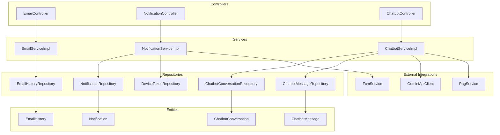
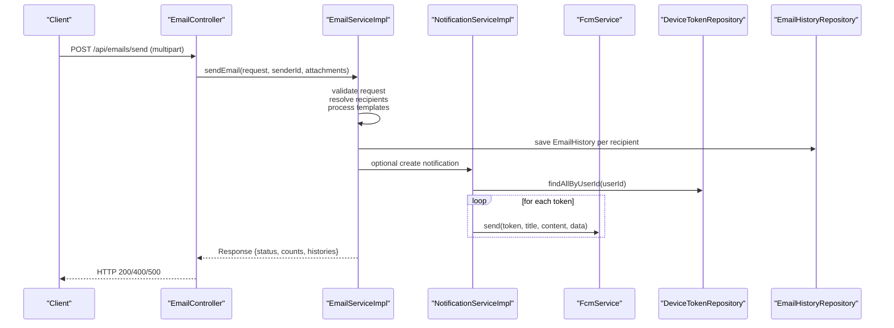
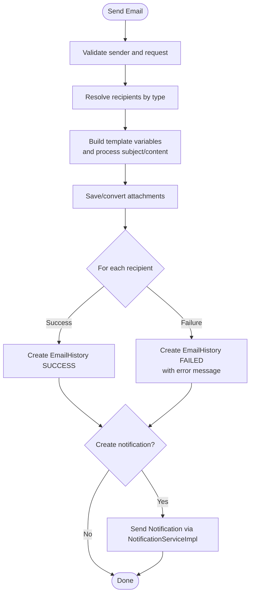
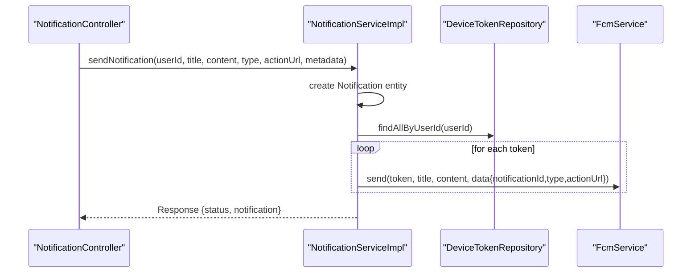
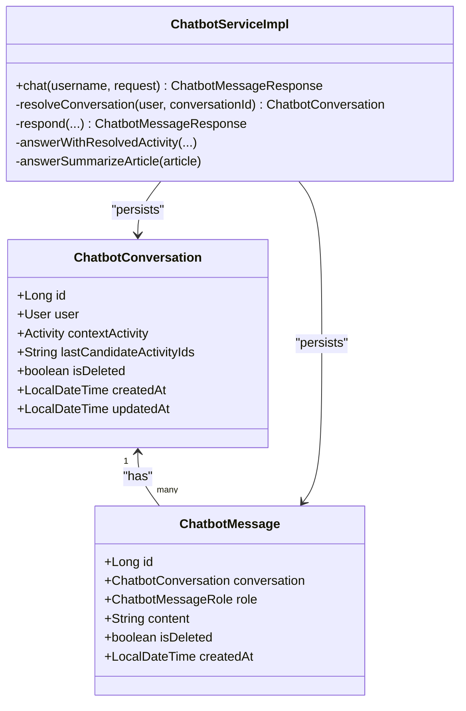
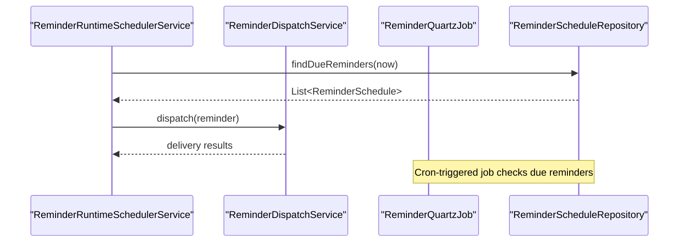
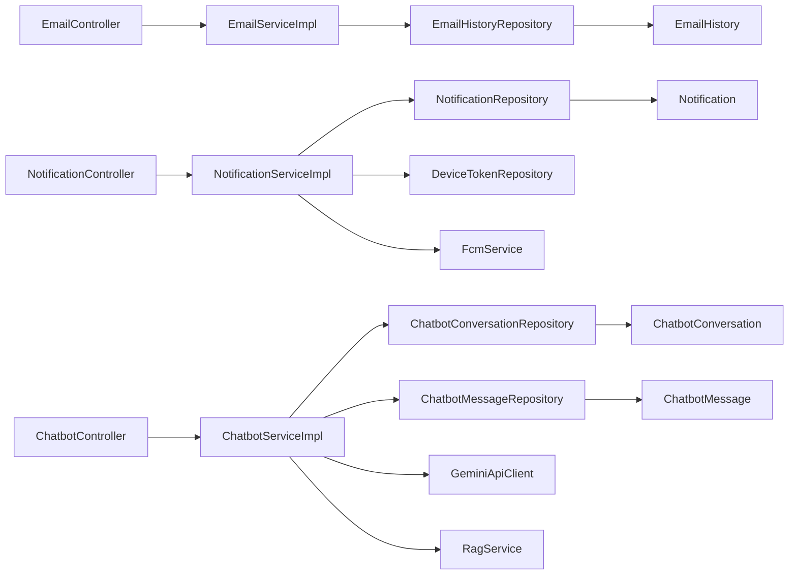
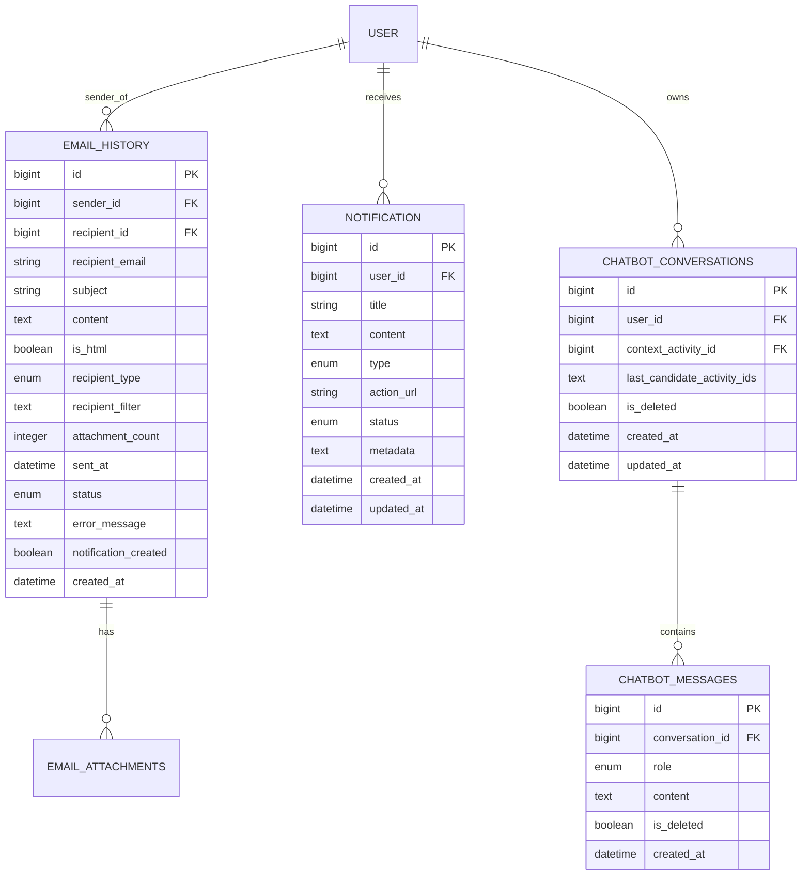

# Communication System

<cite>
**Referenced Files in This Document**
- [ChatbotController.java](file://src/main/java/vn/campuslife/controller/communication/ChatbotController.java)
- [EmailController.java](file://src/main/java/vn/campuslife/controller/communication/EmailController.java)
- [NotificationController.java](file://src/main/java/vn/campuslife/controller/communication/NotificationController.java)
- [ChatbotService.java](file://src/main/java/vn/campuslife/service/ChatbotService.java)
- [EmailService.java](file://src/main/java/vn/campuslife/service/EmailService.java)
- [NotificationService.java](file://src/main/java/vn/campuslife/service/NotificationService.java)
- [ChatbotServiceImpl.java](file://src/main/java/vn/campuslife/service/impl/ChatbotServiceImpl.java)
- [EmailServiceImpl.java](file://src/main/java/vn/campuslife/service/impl/EmailServiceImpl.java)
- [NotificationServiceImpl.java](file://src/main/java/vn/campuslife/service/impl/NotificationServiceImpl.java)
- [ChatbotConversation.java](file://src/main/java/vn/campuslife/entity/ChatbotConversation.java)
- [ChatbotMessage.java](file://src/main/java/vn/campuslife/entity/ChatbotMessage.java)
- [EmailHistory.java](file://src/main/java/vn/campuslife/entity/EmailHistory.java)
- [Notification.java](file://src/main/java/vn/campuslife/entity/Notification.java)
- [ChatbotConversationRepository.java](file://src/main/java/vn/campuslife/repository/ChatbotConversationRepository.java)
- [ChatbotMessageRepository.java](file://src/main/java/vn/campuslife/repository/ChatbotMessageRepository.java)
- [EmailHistoryRepository.java](file://src/main/java/vn/campuslife/repository/EmailHistoryRepository.java)
- [NotificationRepository.java](file://src/main/java/vn/campuslife/repository/NotificationRepository.java)
- [DeviceTokenRepository.java](file://src/main/java/vn/campuslife/repository/DeviceTokenRepository.java)
- [DeviceToken.java](file://src/main/java/vn/campuslife/model/DeviceToken.java)
- [SendEmailRequest.java](file://src/main/java/vn/campuslife/model/SendEmailRequest.java)
- [SendNotificationOnlyRequest.java](file://src/main/java/vn/campuslife/model/SendNotificationOnlyRequest.java)
- [NotificationDetailResponse.java](file://src/main/java/vn/campuslife/model/NotificationDetailResponse.java)
- [EmailUtil.java](file://src/main/java/vn/campuslife/util/EmailUtil.java)
- [NotificationMessageTemplate.java](file://src/main/java/vn/campuslife/util/NotificationMessageTemplate.java)
- [NotificationUrlUtils.java](file://src/main/java/vn/campuslife/util/NotificationUrlUtils.java)
- [FirebaseConfig.java](file://src/main/java/vn/campuslife/config/FirebaseConfig.java)
- [FcmService.java](file://src/main/java/vn/campuslife/service/FcmService.java)
- [ChatbotNluService.java](file://src/main/java/vn/campuslife/service/ai/ChatbotNluService.java)
- [GeminiApiClient.java](file://src/main/java/vn/campuslife/service/ai/GeminiApiClient.java)
- [RagService.java](file://src/main/java/vn/campuslife/service/RagService.java)
- [ReminderDispatchService.java](file://src/main/java/vn/campuslife/service/ReminderDispatchService.java)
- [ReminderRuntimeSchedulerService.java](file://src/main/java/vn/campuslife/service/ReminderRuntimeSchedulerService.java)
- [ReminderScheduleServiceImpl.java](file://src/main/java/vn/campuslife/service/impl/ReminderScheduleServiceImpl.java)
- [ReminderSchedulingConfig.java](file://src/main/java/vn/campuslife/config/ReminderSchedulingConfig.java)
- [SchedulingConfig.java](file://src/main/java/vn/campuslife/config/SchedulingConfig.java)
- [ReminderSchedule.java](file://src/main/java/vn/campuslife/entity/ReminderSchedule.java)
- [ReminderScheduleRepository.java](file://src/main/java/vn/campuslife/repository/ReminderScheduleRepository.java)
- [ReminderQuartzJob.java](file://src/main/java/vn/campuslife/job/ReminderQuartzJob.java)
- [V1015__create_email_history_tables.sql](file://db/migration/V1015__create_email_history_tables.sql)
- [V1025__create_reminder_schedule_table.sql](file://db/migration/V1025__create_reminder_schedule_table.sql)
</cite>

## Table of Contents
1. [Introduction](#introduction)
2. [Project Structure](#project-structure)
3. [Core Components](#core-components)
4. [Architecture Overview](#architecture-overview)
5. [Detailed Component Analysis](#detailed-component-analysis)
6. [Dependency Analysis](#dependency-analysis)
7. [Performance Considerations](#performance-considerations)
8. [Troubleshooting Guide](#troubleshooting-guide)
9. [Conclusion](#conclusion)
10. [Appendices](#appendices)

## Introduction
This document describes the Communication System that powers multi-channel messaging within the application, including email notifications, push notifications via Firebase Cloud Messaging (FCM), device token management, and intelligent chatbot integration. It covers implementation patterns, notification scheduling, user preference management, email template handling, delivery workflows, and analytics-ready structures. Practical examples illustrate typical workflows such as sending targeted emails, broadcasting push notifications, managing device tokens, and engaging with the chatbot.

## Project Structure
The Communication System spans controllers, services, repositories, entities, utilities, and configuration modules. Controllers expose REST endpoints for email, notifications, and chatbot interactions. Services encapsulate business logic for sending, storing, and retrieving communications. Repositories manage persistence. Entities define the data model for histories, conversations, and notifications. Utilities support templating and URL building. Configuration enables FCM and scheduling.

**Diagram sources**
- [EmailController.java:28-241](file://src/main/java/vn/campuslife/controller/communication/EmailController.java#L28-L241)
- [NotificationController.java:15-203](file://src/main/java/vn/campuslife/controller/communication/NotificationController.java#L15-L203)
- [ChatbotController.java:19-101](file://src/main/java/vn/campuslife/controller/communication/ChatbotController.java#L19-L101)
- [EmailServiceImpl.java:36-778](file://src/main/java/vn/campuslife/service/impl/EmailServiceImpl.java#L36-L778)
- [NotificationServiceImpl.java:27-420](file://src/main/java/vn/campuslife/service/impl/NotificationServiceImpl.java#L27-L420)
- [ChatbotServiceImpl.java:49-1101](file://src/main/java/vn/campuslife/service/impl/ChatbotServiceImpl.java#L49-L1101)
- [EmailHistoryRepository.java](file://src/main/java/vn/campuslife/repository/EmailHistoryRepository.java)
- [NotificationRepository.java](file://src/main/java/vn/campuslife/repository/NotificationRepository.java)
- [ChatbotConversationRepository.java](file://src/main/java/vn/campuslife/repository/ChatbotConversationRepository.java)
- [ChatbotMessageRepository.java](file://src/main/java/vn/campuslife/repository/ChatbotMessageRepository.java)
- [DeviceTokenRepository.java](file://src/main/java/vn/campuslife/repository/DeviceTokenRepository.java)
- [EmailHistory.java:14-73](file://src/main/java/vn/campuslife/entity/EmailHistory.java#L14-L73)
- [Notification.java](file://src/main/java/vn/campuslife/entity/Notification.java)
- [ChatbotConversation.java:21-52](file://src/main/java/vn/campuslife/entity/ChatbotConversation.java#L21-L52)
- [ChatbotMessage.java:23-51](file://src/main/java/vn/campuslife/entity/ChatbotMessage.java#L23-L51)
- [FcmService.java](file://src/main/java/vn/campuslife/service/FcmService.java)
- [GeminiApiClient.java](file://src/main/java/vn/campuslife/service/ai/GeminiApiClient.java)
- [RagService.java](file://src/main/java/vn/campuslife/service/RagService.java)

**Section sources**
- [EmailController.java:28-241](file://src/main/java/vn/campuslife/controller/communication/EmailController.java#L28-L241)
- [NotificationController.java:15-203](file://src/main/java/vn/campuslife/controller/communication/NotificationController.java#L15-L203)
- [ChatbotController.java:19-101](file://src/main/java/vn/campuslife/controller/communication/ChatbotController.java#L19-L101)

## Core Components
- Email subsystem: Sends personalized emails with templates, supports multiple recipient types, tracks delivery history, and optionally creates notifications.
- Push notification subsystem: Stores notifications, manages device tokens, and delivers push messages via FCM.
- Chatbot subsystem: Handles conversational AI with NLU, activity context, article summarization, and conversation persistence.
- Notification scheduling: Supports scheduled reminders with Quartz jobs and runtime scheduling APIs.

Key capabilities:
- Multi-channel delivery: Email + push notifications
- Template-driven personalization: Dynamic variables for recipients, activities, and series
- Conversation context: Chatbot maintains conversation and activity context
- Delivery tracking: Email history with status and error messages
- Targeted delivery: By user IDs, class, department, activity registrations, or series registrations
- Analytics-ready: Metadata embedding, unread counts, archiving, and detailed retrieval

**Section sources**
- [EmailService.java:9-36](file://src/main/java/vn/campuslife/service/EmailService.java#L9-L36)
- [NotificationService.java:13-55](file://src/main/java/vn/campuslife/service/NotificationService.java#L13-L55)
- [ChatbotService.java:6-9](file://src/main/java/vn/campuslife/service/ChatbotService.java#L6-L9)
- [EmailServiceImpl.java:60-240](file://src/main/java/vn/campuslife/service/impl/EmailServiceImpl.java#L60-L240)
- [NotificationServiceImpl.java:42-92](file://src/main/java/vn/campuslife/service/impl/NotificationServiceImpl.java#L42-L92)
- [ChatbotServiceImpl.java:71-102](file://src/main/java/vn/campuslife/service/impl/ChatbotServiceImpl.java#L71-L102)

## Architecture Overview
The system follows layered architecture:
- Presentation: REST controllers handle requests and responses
- Application: Services orchestrate business logic and integrations
- Persistence: Repositories manage entities
- Integrations: FCM for push, Gemini for summarization, storage for attachments

**Diagram sources**
- [EmailController.java:58-115](file://src/main/java/vn/campuslife/controller/communication/EmailController.java#L58-L115)
- [EmailServiceImpl.java:60-240](file://src/main/java/vn/campuslife/service/impl/EmailServiceImpl.java#L60-L240)
- [NotificationServiceImpl.java:78-87](file://src/main/java/vn/campuslife/service/impl/NotificationServiceImpl.java#L78-L87)
- [DeviceTokenRepository.java](file://src/main/java/vn/campuslife/repository/DeviceTokenRepository.java)
- [EmailHistoryRepository.java](file://src/main/java/vn/campuslife/repository/EmailHistoryRepository.java)

## Detailed Component Analysis

### Email Subsystem
- Responsibilities:
  - Validate senders and requests
  - Resolve recipients by type (bulk, activity registrations, series registrations, class, department, all students)
  - Process templates with dynamic variables (user, student, activity, series)
  - Send emails via configured transport
  - Persist email history with status and error messages
  - Optionally create notifications and attach metadata
  - Manage attachments with size limits and storage paths
  - Provide history listing, detail retrieval, and resend capability

- Key flows:
  - Send email: validate → resolve recipients → process templates → send → persist history → optionally create notification → attach shared files
  - Send notification only: validate → resolve recipients → process templates → create notifications → deliver via FCM
  - Resend email: re-fetch history → load attachments → re-send → update status

**Diagram sources**
- [EmailServiceImpl.java:60-240](file://src/main/java/vn/campuslife/service/impl/EmailServiceImpl.java#L60-L240)
- [EmailHistory.java:20-73](file://src/main/java/vn/campuslife/entity/EmailHistory.java#L20-L73)

**Section sources**
- [EmailController.java:58-115](file://src/main/java/vn/campuslife/controller/communication/EmailController.java#L58-L115)
- [EmailService.java:9-36](file://src/main/java/vn/campuslife/service/EmailService.java#L9-L36)
- [EmailServiceImpl.java:60-240](file://src/main/java/vn/campuslife/service/impl/EmailServiceImpl.java#L60-L240)
- [EmailHistory.java:20-73](file://src/main/java/vn/campuslife/entity/EmailHistory.java#L20-L73)

### Push Notification Subsystem
- Responsibilities:
  - Store notifications with metadata and status
  - Resolve device tokens per user
  - Deliver push notifications via FCM
  - Support bulk and async delivery
  - Provide CRUD operations for notifications (read/unread/archive/delete)

- Delivery pipeline:
  - Create notification entity
  - Load device tokens for the user
  - Send FCM payload with notificationId, type, and optional actionUrl
  - Async variant batches and parallelizes FCM sends

**Diagram sources**
- [NotificationController.java:26-41](file://src/main/java/vn/campuslife/controller/communication/NotificationController.java#L26-L41)
- [NotificationServiceImpl.java:42-92](file://src/main/java/vn/campuslife/service/impl/NotificationServiceImpl.java#L42-L92)
- [DeviceTokenRepository.java](file://src/main/java/vn/campuslife/repository/DeviceTokenRepository.java)
- [FcmService.java](file://src/main/java/vn/campuslife/service/FcmService.java)

**Section sources**
- [NotificationController.java:26-41](file://src/main/java/vn/campuslife/controller/communication/NotificationController.java#L26-L41)
- [NotificationService.java:13-55](file://src/main/java/vn/campuslife/service/NotificationService.java#L13-L55)
- [NotificationServiceImpl.java:42-92](file://src/main/java/vn/campuslife/service/impl/NotificationServiceImpl.java#L42-L92)

### Chatbot Subsystem
- Responsibilities:
  - Maintain chatbot conversations and messages
  - Resolve context: current activity, article, or page context
  - Apply NLU to detect intents (time/location/registration/benefits/requirements/points/check-in/summary)
  - Provide activity lists and details
  - Summarize articles using Gemini when enabled
  - Support clarification mode with candidate selection
  - Integrate with RAG for support questions

**Diagram sources**
- [ChatbotConversation.java:21-52](file://src/main/java/vn/campuslife/entity/ChatbotConversation.java#L21-L52)
- [ChatbotMessage.java:23-51](file://src/main/java/vn/campuslife/entity/ChatbotMessage.java#L23-L51)
- [ChatbotServiceImpl.java:104-147](file://src/main/java/vn/campuslife/service/impl/ChatbotServiceImpl.java#L104-L147)

**Section sources**
- [ChatbotController.java:82-98](file://src/main/java/vn/campuslife/controller/communication/ChatbotController.java#L82-L98)
- [ChatbotService.java:6-9](file://src/main/java/vn/campuslife/service/ChatbotService.java#L6-L9)
- [ChatbotServiceImpl.java:71-102](file://src/main/java/vn/campuslife/service/impl/ChatbotServiceImpl.java#L71-L102)

### Notification Scheduling
- Runtime scheduling: Services to schedule reminders and dispatch them at due time
- Quartz job: Periodic job to check due reminders and trigger dispatch
- Configuration: Dedicated scheduling configurations for reminder jobs

**Diagram sources**
- [ReminderRuntimeSchedulerService.java](file://src/main/java/vn/campuslife/service/ReminderRuntimeSchedulerService.java)
- [ReminderDispatchService.java](file://src/main/java/vn/campuslife/service/ReminderDispatchService.java)
- [ReminderQuartzJob.java](file://src/main/java/vn/campuslife/job/ReminderQuartzJob.java)
- [ReminderScheduleRepository.java](file://src/main/java/vn/campuslife/repository/ReminderScheduleRepository.java)
- [ReminderSchedule.java](file://src/main/java/vn/campuslife/entity/ReminderSchedule.java)

**Section sources**
- [ReminderSchedulingConfig.java](file://src/main/java/vn/campuslife/config/ReminderSchedulingConfig.java)
- [SchedulingConfig.java](file://src/main/java/vn/campuslife/config/SchedulingConfig.java)
- [ReminderScheduleServiceImpl.java](file://src/main/java/vn/campuslife/service/impl/ReminderScheduleServiceImpl.java)

## Dependency Analysis
- Controllers depend on services for business operations
- Services depend on repositories for persistence and external services (FCM, Gemini, RAG)
- Entities define relationships and audit fields
- Repositories connect to database tables created by Liquibase migrations

**Diagram sources**
- [EmailController.java:28-241](file://src/main/java/vn/campuslife/controller/communication/EmailController.java#L28-L241)
- [NotificationController.java:15-203](file://src/main/java/vn/campuslife/controller/communication/NotificationController.java#L15-L203)
- [ChatbotController.java:19-101](file://src/main/java/vn/campuslife/controller/communication/ChatbotController.java#L19-L101)
- [EmailServiceImpl.java:36-778](file://src/main/java/vn/campuslife/service/impl/EmailServiceImpl.java#L36-L778)
- [NotificationServiceImpl.java:27-420](file://src/main/java/vn/campuslife/service/impl/NotificationServiceImpl.java#L27-L420)
- [ChatbotServiceImpl.java:49-1101](file://src/main/java/vn/campuslife/service/impl/ChatbotServiceImpl.java#L49-L1101)

**Section sources**
- [EmailHistoryRepository.java](file://src/main/java/vn/campuslife/repository/EmailHistoryRepository.java)
- [NotificationRepository.java](file://src/main/java/vn/campuslife/repository/NotificationRepository.java)
- [ChatbotConversationRepository.java](file://src/main/java/vn/campuslife/repository/ChatbotConversationRepository.java)
- [ChatbotMessageRepository.java](file://src/main/java/vn/campuslife/repository/ChatbotMessageRepository.java)
- [DeviceTokenRepository.java](file://src/main/java/vn/campuslife/repository/DeviceTokenRepository.java)

## Performance Considerations
- Asynchronous bulk notifications: Use the async method to parallelize FCM sends after persisting notifications, reducing latency for large broadcasts.
- Pagination: Controllers expose pagination for notification retrieval and email history to avoid heavy payloads.
- Template processing: Keep template variables minimal and avoid heavy computations inside templates.
- Attachment handling: Enforce size limits and stream attachments to reduce memory footprint.
- Database indexing: Ensure indexes on frequently queried fields (user_id, status, sent_at, activity_id, series_id) to optimize queries.

## Troubleshooting Guide
Common issues and resolutions:
- Authentication failures:
  - Controllers check authentication and return 401 when absent. Ensure clients include proper credentials.
- Email send failures:
  - Review email history entries for error messages. Verify SMTP configuration and attachment sizes.
  - Use resend endpoint to retry failed deliveries.
- Push delivery failures:
  - Check device tokens validity; expired or invalid tokens cause delivery failures. Remove or refresh tokens as needed.
  - Inspect FCM logs for HTTP errors or quota limits.
- Chatbot unavailability:
  - Confirm Gemini API key and network connectivity. Use ping endpoints to diagnose configuration issues.
- Notification not delivered:
  - Verify user has registered device tokens. Ensure notification type and metadata are correctly set.

Operational endpoints for diagnostics:
- Email: status endpoints for authentication and configuration verification
- Chatbot: status, ping, and model listing endpoints
- Notifications: CRUD endpoints for user-centric management

**Section sources**
- [EmailController.java:42-53](file://src/main/java/vn/campuslife/controller/communication/EmailController.java#L42-L53)
- [ChatbotController.java:27-67](file://src/main/java/vn/campuslife/controller/communication/ChatbotController.java#L27-L67)
- [NotificationController.java:26-41](file://src/main/java/vn/campuslife/controller/communication/NotificationController.java#L26-L41)

## Conclusion
The Communication System integrates email, push notifications, chatbot intelligence, and scheduling into a cohesive platform. It emphasizes robust delivery tracking, flexible targeting, contextual awareness, and extensibility for future enhancements. The layered design ensures maintainability while supporting high-throughput operations through asynchronous processing and efficient data modeling.

## Appendices

### Data Model Overview

**Diagram sources**
- [EmailHistory.java:14-73](file://src/main/java/vn/campuslife/entity/EmailHistory.java#L14-L73)
- [Notification.java](file://src/main/java/vn/campuslife/entity/Notification.java)
- [ChatbotConversation.java:21-52](file://src/main/java/vn/campuslife/entity/ChatbotConversation.java#L21-L52)
- [ChatbotMessage.java:23-51](file://src/main/java/vn/campuslife/entity/ChatbotMessage.java#L23-L51)

### Practical Workflows and Examples
- Sending a targeted email to activity registrants:
  - Use the email send endpoint with recipient type set to activity registrations and provide the activity ID. The service resolves recipients, processes templates, sends emails, persists history, and optionally creates notifications.
- Broadcasting push notifications to a department:
  - Use the notification service to send to all users in a department. The service resolves user IDs, persists notifications, and delivers push notifications to all registered device tokens.
- Chatbot assistance with article summarization:
  - Post a message with article context. If Gemini is enabled and content is suitable, the chatbot returns a summarized response; otherwise, it provides appropriate guidance.
- Scheduled reminders:
  - Schedule reminders via the reminder scheduling service. The runtime scheduler and Quartz job periodically dispatch reminders to users.

**Section sources**
- [EmailController.java:58-115](file://src/main/java/vn/campuslife/controller/communication/EmailController.java#L58-L115)
- [NotificationServiceImpl.java:218-240](file://src/main/java/vn/campuslife/service/impl/NotificationServiceImpl.java#L218-L240)
- [ChatbotServiceImpl.java:617-673](file://src/main/java/vn/campuslife/service/impl/ChatbotServiceImpl.java#L617-L673)
- [ReminderRuntimeSchedulerService.java](file://src/main/java/vn/campuslife/service/ReminderRuntimeSchedulerService.java)
- [ReminderQuartzJob.java](file://src/main/java/vn/campuslife/job/ReminderQuartzJob.java)