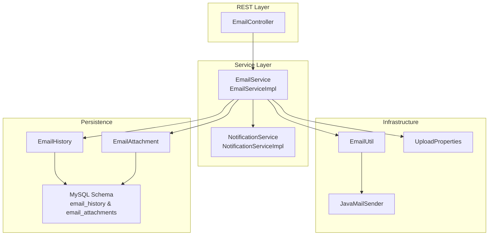
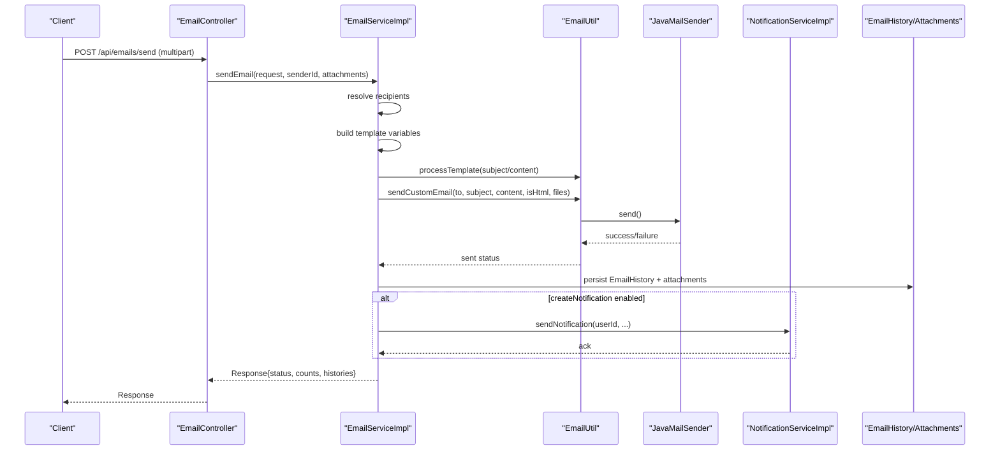
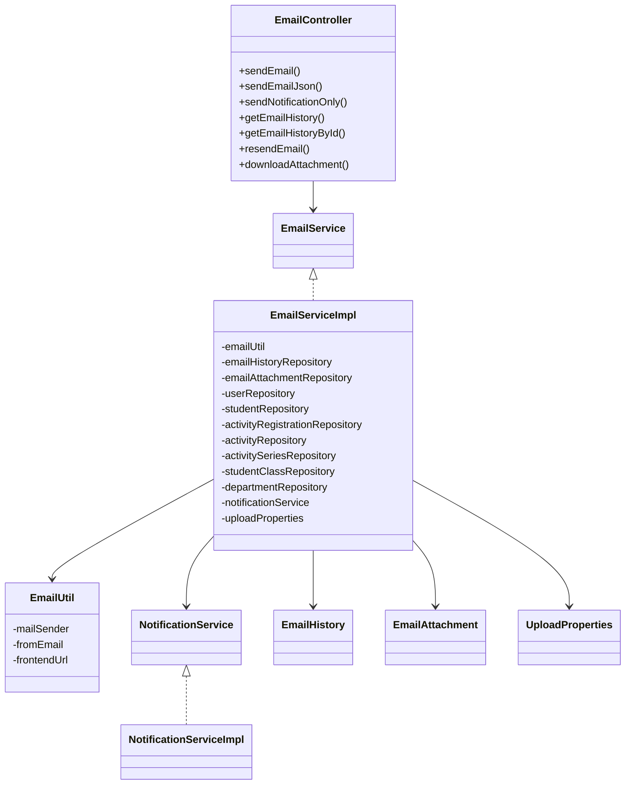

# Email Notifications

<cite>
**Referenced Files in This Document**
- [EmailController.java](file://src/main/java/vn/campuslife/controller/communication/EmailController.java)
- [EmailService.java](file://src/main/java/vn/campuslife/service/EmailService.java)
- [EmailServiceImpl.java](file://src/main/java/vn/campuslife/service/impl/EmailServiceImpl.java)
- [EmailUtil.java](file://src/main/java/vn/campuslife/util/EmailUtil.java)
- [EmailHistory.java](file://src/main/java/vn/campuslife/entity/EmailHistory.java)
- [EmailAttachment.java](file://src/main/java/vn/campuslife/entity/EmailAttachment.java)
- [EmailStatus.java](file://src/main/java/vn/campuslife/enumeration/EmailStatus.java)
- [RecipientType.java](file://src/main/java/vn/campuslife/enumeration/RecipientType.java)
- [SendEmailRequest.java](file://src/main/java/vn/campuslife/model/SendEmailRequest.java)
- [EmailHistoryResponse.java](file://src/main/java/vn/campuslife/model/EmailHistoryResponse.java)
- [EmailAttachmentResponse.java](file://src/main/java/vn/campuslife/model/EmailAttachmentResponse.java)
- [application.properties](file://src/main/resources/application.properties)
- [V1015__create_email_history_tables.sql](file://db/migration/V1015__create_email_history_tables.sql)
- [UploadProperties.java](file://src/main/java/vn/campuslife/config/UploadProperties.java)
- [NotificationService.java](file://src/main/java/vn/campuslife/service/NotificationService.java)
- [NotificationServiceImpl.java](file://src/main/java/vn/campuslife/service/impl/NotificationServiceImpl.java)
</cite>

## Table of Contents
1. [Introduction](#introduction)
2. [Project Structure](#project-structure)
3. [Core Components](#core-components)
4. [Architecture Overview](#architecture-overview)
5. [Detailed Component Analysis](#detailed-component-analysis)
6. [Dependency Analysis](#dependency-analysis)
7. [Performance Considerations](#performance-considerations)
8. [Troubleshooting Guide](#troubleshooting-guide)
9. [Conclusion](#conclusion)
10. [Appendices](#appendices)

## Introduction
This document describes the email notification system, covering SMTP integration, template management, bulk email processing, attachments, delivery tracking, and operational workflows. It explains configuration, dynamic template variables, MIME handling, file size limits, delivery status tracking, resend capability, and practical email workflows such as registration confirmations, password resets, activity notifications, and administrative alerts. It also documents email history tracking, delivery analytics, and user preference management for email communications.

## Project Structure
The email subsystem is organized around a REST controller, a service layer, a utility for SMTP operations, persistence entities, enumerations, and supporting configuration and migration scripts.

**Diagram sources**
- [EmailController.java:28-241](file://src/main/java/vn/campuslife/controller/communication/EmailController.java#L28-L241)
- [EmailServiceImpl.java:36-778](file://src/main/java/vn/campuslife/service/impl/EmailServiceImpl.java#L36-L778)
- [EmailUtil.java:16-188](file://src/main/java/vn/campuslife/util/EmailUtil.java#L16-L188)
- [EmailHistory.java:14-73](file://src/main/java/vn/campuslife/entity/EmailHistory.java#L14-L73)
- [EmailAttachment.java:12-44](file://src/main/java/vn/campuslife/entity/EmailAttachment.java#L12-L44)
- [V1015__create_email_history_tables.sql:1-39](file://db/migration/V1015__create_email_history_tables.sql#L1-L39)
- [application.properties:27-54](file://src/main/resources/application.properties#L27-L54)

**Section sources**
- [EmailController.java:28-241](file://src/main/java/vn/campuslife/controller/communication/EmailController.java#L28-L241)
- [EmailServiceImpl.java:36-778](file://src/main/java/vn/campuslife/service/impl/EmailServiceImpl.java#L36-L778)
- [EmailUtil.java:16-188](file://src/main/java/vn/campuslife/util/EmailUtil.java#L16-L188)
- [EmailHistory.java:14-73](file://src/main/java/vn/campuslife/entity/EmailHistory.java#L14-L73)
- [EmailAttachment.java:12-44](file://src/main/java/vn/campuslife/entity/EmailAttachment.java#L12-L44)
- [V1015__create_email_history_tables.sql:1-39](file://db/migration/V1015__create_email_history_tables.sql#L1-L39)
- [application.properties:27-54](file://src/main/resources/application.properties#L27-L54)

## Core Components
- REST Controller: Exposes endpoints for sending emails (multipart and JSON), sending notifications only, retrieving email history, resending emails, and downloading attachments.
- Service Implementation: Orchestrates recipient resolution, template processing, SMTP dispatch, attachment handling, and persistence of email history and attachments.
- Email Utility: Encapsulates JavaMailSender operations, template processing, and specialized email flows (activation, password reset, credentials).
- Persistence Entities: EmailHistory and EmailAttachment track sent emails, statuses, and attached files.
- Enumerations: EmailStatus and RecipientType define delivery outcomes and recipient selection modes.
- Configuration: application.properties defines SMTP settings, frontend URL, and upload limits.

**Section sources**
- [EmailController.java:58-222](file://src/main/java/vn/campuslife/controller/communication/EmailController.java#L58-L222)
- [EmailServiceImpl.java:60-403](file://src/main/java/vn/campuslife/service/impl/EmailServiceImpl.java#L60-L403)
- [EmailUtil.java:31-187](file://src/main/java/vn/campuslife/util/EmailUtil.java#L31-L187)
- [EmailHistory.java:20-71](file://src/main/java/vn/campuslife/entity/EmailHistory.java#L20-L71)
- [EmailAttachment.java:18-42](file://src/main/java/vn/campuslife/entity/EmailAttachment.java#L18-L42)
- [EmailStatus.java:3-7](file://src/main/java/vn/campuslife/enumeration/EmailStatus.java#L3-L7)
- [RecipientType.java:3-10](file://src/main/java/vn/campuslife/enumeration/RecipientType.java#L3-L10)
- [application.properties:27-54](file://src/main/resources/application.properties#L27-L54)

## Architecture Overview
The system integrates Spring MVC, Spring Mail (JavaMailSender), Spring Data JPA, and custom entities. The flow begins at the controller, delegates to the service for orchestration, uses the utility for SMTP operations and templating, persists results, and optionally triggers in-app notifications.

**Diagram sources**
- [EmailController.java:58-115](file://src/main/java/vn/campuslife/controller/communication/EmailController.java#L58-L115)
- [EmailServiceImpl.java:60-240](file://src/main/java/vn/campuslife/service/impl/EmailServiceImpl.java#L60-L240)
- [EmailUtil.java:134-165](file://src/main/java/vn/campuslife/util/EmailUtil.java#L134-L165)
- [NotificationServiceImpl.java:42-92](file://src/main/java/vn/campuslife/service/impl/NotificationServiceImpl.java#L42-L92)
- [EmailHistory.java:20-71](file://src/main/java/vn/campuslife/entity/EmailHistory.java#L20-L71)
- [EmailAttachment.java:18-42](file://src/main/java/vn/campuslife/entity/EmailAttachment.java#L18-L42)

## Detailed Component Analysis

### REST Endpoints
- POST /api/emails/send (multipart): Accepts SendEmailRequest and optional attachments; authenticates sender and delegates to service.
- POST /api/emails/send-json (JSON): Same as multipart but without attachments.
- POST /api/emails/notifications/send: Sends only in-app notifications without email dispatch.
- GET /api/emails/history: Retrieves paginated email history for the authenticated sender.
- GET /api/emails/history/{emailId}: Retrieves a single email history record.
- POST /api/emails/history/{emailId}/resend: Resends a previously recorded email.
- GET /api/emails/attachments/{attachmentId}/download: Downloads an attached file.

**Section sources**
- [EmailController.java:58-222](file://src/main/java/vn/campuslife/controller/communication/EmailController.java#L58-L222)

### Service Orchestration
- Recipient Resolution: Based on RecipientType (BULK, ACTIVITY_REGISTRATIONS, SERIES_REGISTRATIONS, ALL_STUDENTS, BY_CLASS, BY_DEPARTMENT), queries repositories to assemble a list of recipients.
- Template Variables: Builds a map containing recipient email, student profile (if applicable), activity/series context, and custom variables from the request.
- Content Processing: Uses EmailUtil to replace placeholders in subject and content.
- SMTP Dispatch: Calls EmailUtil.sendCustomEmail with attachments and HTML flag.
- Persistence: Creates EmailHistory entries per recipient, updates overall status, and attaches saved EmailAttachment records.
- Notification Creation: Optionally creates in-app notifications with metadata (e.g., activityId, seriesId) and action URLs.

**Section sources**
- [EmailServiceImpl.java:60-240](file://src/main/java/vn/campuslife/service/impl/EmailServiceImpl.java#L60-L240)
- [EmailServiceImpl.java:407-546](file://src/main/java/vn/campuslife/service/impl/EmailServiceImpl.java#L407-L546)
- [EmailServiceImpl.java:548-653](file://src/main/java/vn/campuslife/service/impl/EmailServiceImpl.java#L548-L653)
- [EmailServiceImpl.java:680-737](file://src/main/java/vn/campuslife/service/impl/EmailServiceImpl.java#L680-L737)
- [EmailServiceImpl.java:739-776](file://src/main/java/vn/campuslife/service/impl/EmailServiceImpl.java#L739-L776)

### Email Utility and SMTP Integration
- JavaMailSender-based operations: Sets FROM address from configuration, TO, subject, HTML content, and optional attachments.
- Specialized flows: Activation, password reset, and student credentials emails.
- Template processing: Replaces {{variable}} placeholders with provided values.

**Section sources**
- [EmailUtil.java:31-187](file://src/main/java/vn/campuslife/util/EmailUtil.java#L31-L187)
- [application.properties:27-41](file://src/main/resources/application.properties#L27-L41)

### Attachment Handling and MIME Support
- Storage: Uploaded attachments are stored under app.upload.dir/email-attachments with unique filenames.
- Size Limits: Enforced at 10 MB per file via multipart limits and explicit checks.
- Metadata: Stores filename, filesystem path, size, and content type.
- Download Endpoint: Returns file with appropriate Content-Type and Content-Disposition.

**Section sources**
- [EmailServiceImpl.java:680-737](file://src/main/java/vn/campuslife/service/impl/EmailServiceImpl.java#L680-L737)
- [application.properties:52-53](file://src/main/resources/application.properties#L52-L53)
- [EmailAttachment.java:18-42](file://src/main/java/vn/campuslife/entity/EmailAttachment.java#L18-L42)
- [EmailController.java:197-222](file://src/main/java/vn/campuslife/controller/communication/EmailController.java#L197-L222)

### Delivery Tracking and Status Management
- EmailHistory captures sender, recipient, subject, content, HTML flag, recipient type/filter, sent timestamp, status, error message, and whether a notification was created.
- EmailStatus supports SUCCESS, FAILED, and PARTIAL outcomes.
- Resend capability: Replays stored content and attachments against the recipient’s email.

**Section sources**
- [EmailHistory.java:20-71](file://src/main/java/vn/campuslife/entity/EmailHistory.java#L20-L71)
- [EmailStatus.java:3-7](file://src/main/java/vn/campuslife/enumeration/EmailStatus.java#L3-L7)
- [EmailServiceImpl.java:362-403](file://src/main/java/vn/campuslife/service/impl/EmailServiceImpl.java#L362-L403)

### Template Management and Dynamic Variables
- Template Placeholders: {{variable}} syntax processed by EmailUtil.
- Variable Sources:
  - Fixed: email
  - Student context: studentName, studentCode, className, departmentName
  - Activity context: activityName, activityDate
  - Series context: seriesName
  - Custom overrides: templateVariables from request
- Notification-only mode supports similar variable building.

**Section sources**
- [EmailUtil.java:167-187](file://src/main/java/vn/campuslife/util/EmailUtil.java#L167-L187)
- [EmailServiceImpl.java:548-653](file://src/main/java/vn/campuslife/service/impl/EmailServiceImpl.java#L548-L653)
- [SendEmailRequest.java:11-35](file://src/main/java/vn/campuslife/model/SendEmailRequest.java#L11-L35)

### Practical Email Workflows
- Registration Confirmation: Build template with activityName/activityDate; send to ACTIVITY_REGISTRATIONS recipients.
- Password Reset: Use EmailUtil.sendPasswordResetEmail or sendCustomEmail with reset link from frontend URL.
- Activity Notifications: Include activity metadata; optionally create in-app notifications with activityId metadata.
- Administrative Alerts: Use BULK or BY_DEPARTMENT/CLASS filters; include custom templateVariables for branding.

**Section sources**
- [EmailUtil.java:60-89](file://src/main/java/vn/campuslife/util/EmailUtil.java#L60-L89)
- [EmailServiceImpl.java:407-546](file://src/main/java/vn/campuslife/service/impl/EmailServiceImpl.java#L407-L546)
- [SendEmailRequest.java:11-35](file://src/main/java/vn/campuslife/model/SendEmailRequest.java#L11-L35)

### Email History Tracking and Analytics
- Retrieval APIs: Paginated history by sender; detail retrieval by ID; resend by ID.
- Response Model: Includes status, timestamps, attachments, and notification creation flag.
- Analytics: Use totalRecipients, successCount, failedCount returned by service to compute delivery metrics.

**Section sources**
- [EmailController.java:138-192](file://src/main/java/vn/campuslife/controller/communication/EmailController.java#L138-L192)
- [EmailServiceImpl.java:323-361](file://src/main/java/vn/campuslife/service/impl/EmailServiceImpl.java#L323-L361)
- [EmailServiceImpl.java:739-776](file://src/main/java/vn/campuslife/service/impl/EmailServiceImpl.java#L739-L776)
- [EmailHistoryResponse.java:11-29](file://src/main/java/vn/campuslife/model/EmailHistoryResponse.java#L11-L29)

### User Preference Management
- The system does not expose explicit email preference toggles in the analyzed code. Administrators can leverage recipient filters (BY_DEPARTMENT/BY_CLASS/BULK) to target audiences without requiring per-user opt-in flags.

**Section sources**
- [EmailServiceImpl.java:407-546](file://src/main/java/vn/campuslife/service/impl/EmailServiceImpl.java#L407-L546)

## Dependency Analysis

**Diagram sources**
- [EmailController.java:28-241](file://src/main/java/vn/campuslife/controller/communication/EmailController.java#L28-L241)
- [EmailService.java:9-34](file://src/main/java/vn/campuslife/service/EmailService.java#L9-L34)
- [EmailServiceImpl.java:36-778](file://src/main/java/vn/campuslife/service/impl/EmailServiceImpl.java#L36-L778)
- [EmailUtil.java:16-188](file://src/main/java/vn/campuslife/util/EmailUtil.java#L16-L188)
- [NotificationService.java:13-54](file://src/main/java/vn/campuslife/service/NotificationService.java#L13-L54)
- [NotificationServiceImpl.java:27-420](file://src/main/java/vn/campuslife/service/impl/NotificationServiceImpl.java#L27-L420)
- [EmailHistory.java:14-73](file://src/main/java/vn/campuslife/entity/EmailHistory.java#L14-L73)
- [EmailAttachment.java:12-44](file://src/main/java/vn/campuslife/entity/EmailAttachment.java#L12-L44)
- [UploadProperties.java:11-27](file://src/main/java/vn/campuslife/config/UploadProperties.java#L11-L27)

**Section sources**
- [EmailServiceImpl.java:36-778](file://src/main/java/vn/campuslife/service/impl/EmailServiceImpl.java#L36-L778)
- [EmailUtil.java:16-188](file://src/main/java/vn/campuslife/util/EmailUtil.java#L16-L188)
- [NotificationServiceImpl.java:27-420](file://src/main/java/vn/campuslife/service/impl/NotificationServiceImpl.java#L27-L420)

## Performance Considerations
- Batch Processing: Emails are sent individually per recipient; consider batching or asynchronous dispatch for very large recipient sets.
- Attachment Size: 10 MB limit per file; excessive attachments increase latency and memory usage.
- Template Complexity: Keep template variable sets minimal to reduce processing overhead.
- Database Writes: Persisting per-recipient EmailHistory entries scales with recipient count; monitor index performance on sender_id, sent_at, and status.

[No sources needed since this section provides general guidance]

## Troubleshooting Guide
Common issues and resolutions:
- SMTP Authentication Problems:
  - Verify spring.mail.username/password and provider settings in application.properties.
  - Check logs for daily sending limits or TLS/auth exceptions.
- Template Rendering Errors:
  - Ensure all {{variables}} used in content/subject are present in the variable map.
  - Validate templateVariables payload in requests.
- Attachment Processing Failures:
  - Confirm file size ≤ 10 MB and content type is supported.
  - Check storage directory permissions and disk space.
- Delivery Status Tracking:
  - Review EmailHistory.status and errorMessage for failed records.
  - Use resend endpoint to retry failed deliveries.
- Notification Delivery:
  - Confirm NotificationServiceImpl receives device tokens and metadata; verify FCM integration.

**Section sources**
- [application.properties:27-54](file://src/main/resources/application.properties#L27-L54)
- [EmailUtil.java:157-164](file://src/main/java/vn/campuslife/util/EmailUtil.java#L157-L164)
- [EmailServiceImpl.java:698-702](file://src/main/java/vn/campuslife/service/impl/EmailServiceImpl.java#L698-L702)
- [EmailHistory.java:58-66](file://src/main/java/vn/campuslife/entity/EmailHistory.java#L58-L66)
- [NotificationServiceImpl.java:42-92](file://src/main/java/vn/campuslife/service/impl/NotificationServiceImpl.java#L42-L92)

## Conclusion
The email notification system provides robust SMTP integration, flexible recipient targeting, dynamic templating, attachment support, and comprehensive delivery tracking. Administrators can efficiently orchestrate targeted campaigns, monitor outcomes, and remediate issues through built-in resend and history APIs.

[No sources needed since this section summarizes without analyzing specific files]

## Appendices

### Configuration Reference
- SMTP Settings: host, port, username, password, TLS/auth flags.
- Frontend URL: Used to construct clickable links in emails.
- Upload Properties: Directory and public URL for attachments.
- Multipart Limits: Max file and request sizes.

**Section sources**
- [application.properties:27-54](file://src/main/resources/application.properties#L27-L54)
- [UploadProperties.java:11-27](file://src/main/java/vn/campuslife/config/UploadProperties.java#L11-L27)

### Database Schema
- email_history: Tracks sent emails, status, timestamps, and metadata.
- email_attachments: Links files to email_history with filename, path, size, and content type.

**Section sources**
- [V1015__create_email_history_tables.sql:1-39](file://db/migration/V1015__create_email_history_tables.sql#L1-L39)
- [EmailHistory.java:14-73](file://src/main/java/vn/campuslife/entity/EmailHistory.java#L14-L73)
- [EmailAttachment.java:12-44](file://src/main/java/vn/campuslife/entity/EmailAttachment.java#L12-L44)