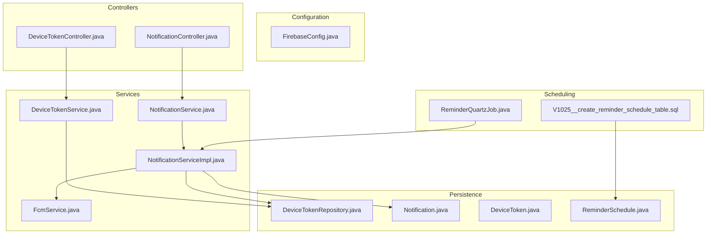
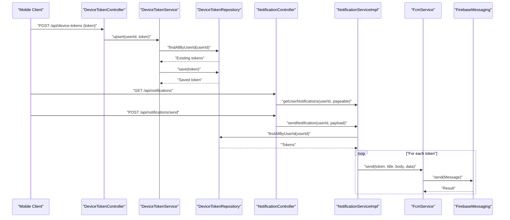
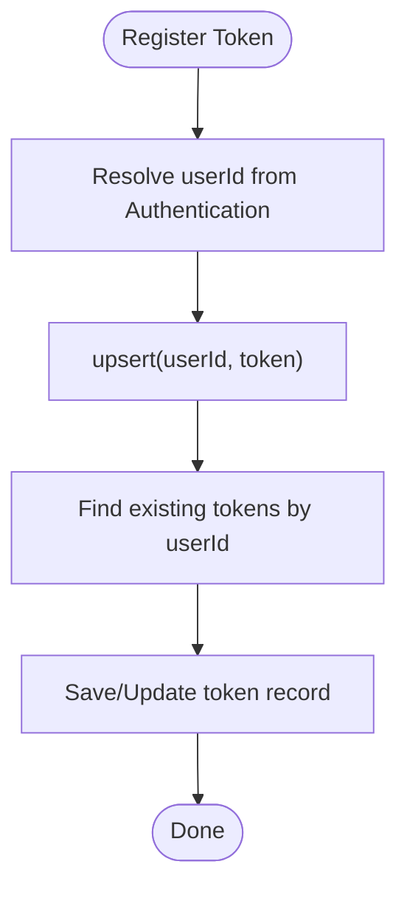
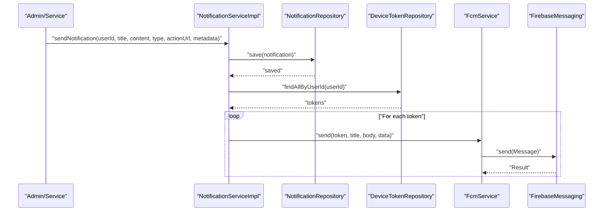
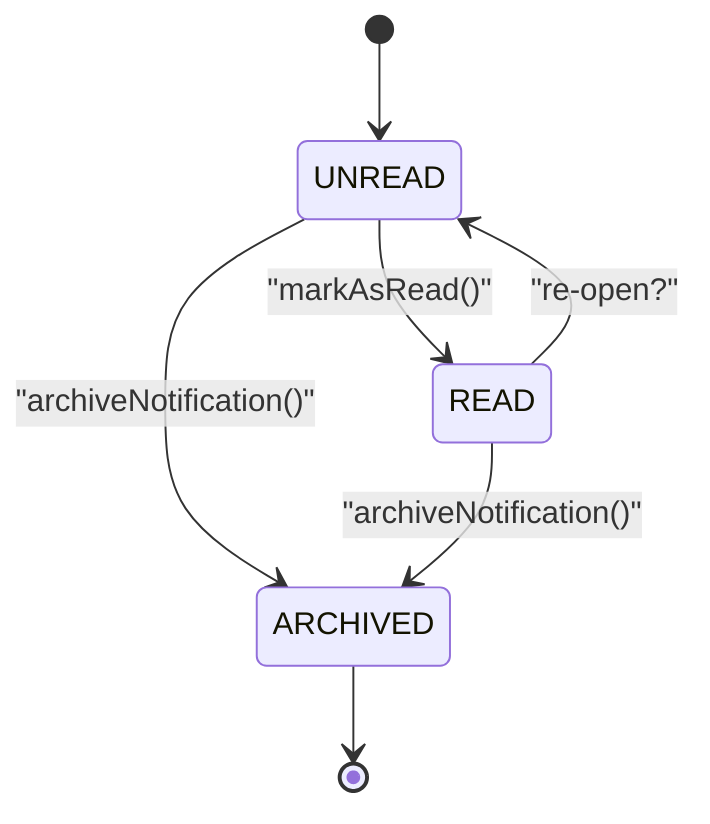
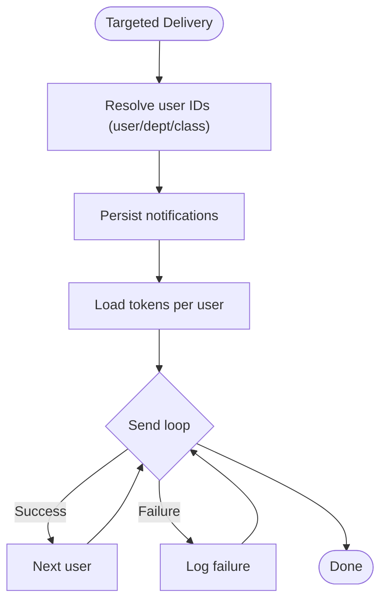
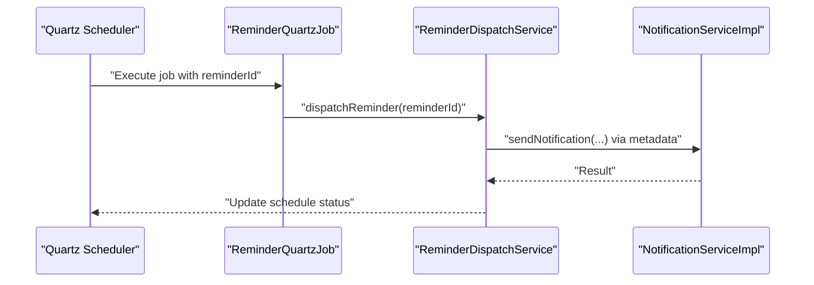
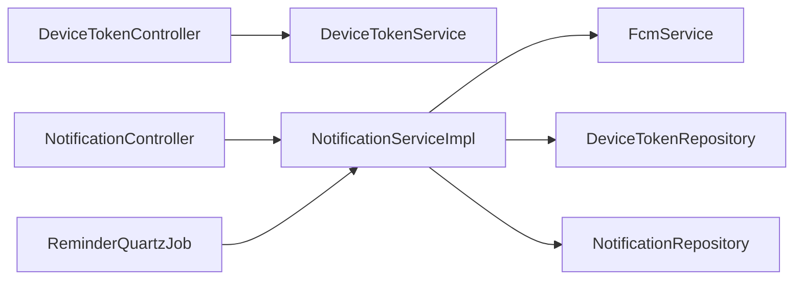
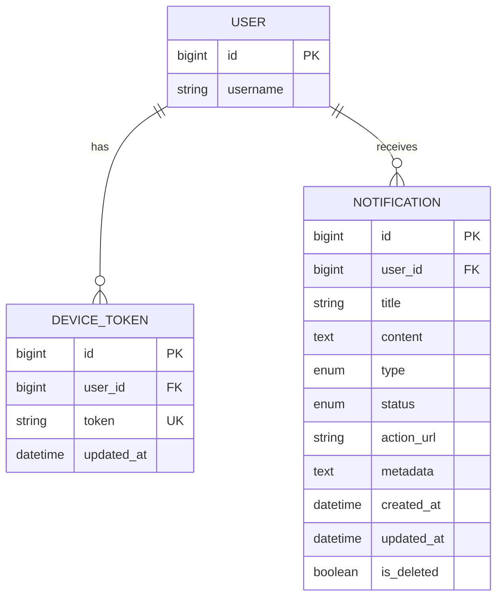

# Push Notifications

<cite>
**Referenced Files in This Document**
- [FirebaseConfig.java](file://src/main/java/vn/campuslife/config/FirebaseConfig.java)
- [DeviceTokenController.java](file://src/main/java/vn/campuslife/controller/communication/DeviceTokenController.java)
- [NotificationController.java](file://src/main/java/vn/campuslife/controller/communication/NotificationController.java)
- [DeviceTokenService.java](file://src/main/java/vn/campuslife/service/DeviceTokenService.java)
- [FcmService.java](file://src/main/java/vn/campuslife/service/FcmService.java)
- [NotificationService.java](file://src/main/java/vn/campuslife/service/NotificationService.java)
- [NotificationServiceImpl.java](file://src/main/java/vn/campuslife/service/impl/NotificationServiceImpl.java)
- [Notification.java](file://src/main/java/vn/campuslife/entity/Notification.java)
- [DeviceToken.java](file://src/main/java/vn/campuslife/model/DeviceToken.java)
- [DeviceTokenRepository.java](file://src/main/java/vn/campuslife/repository/DeviceTokenRepository.java)
- [NotificationType.java](file://src/main/java/vn/campuslife/enumeration/NotificationType.java)
- [NotificationStatus.java](file://src/main/java/vn/campuslife/enumeration/NotificationStatus.java)
- [ReminderQuartzJob.java](file://src/main/java/vn/campuslife/job/ReminderQuartzJob.java)
- [ReminderSchedule.java](file://src/main/java/vn/campuslife/entity/ReminderSchedule.java)
- [V1025__create_reminder_schedule_table.sql](file://db/migration/V1025__create_reminder_schedule_table.sql)
</cite>

## Table of Contents
1. [Introduction](#introduction)
2. [Project Structure](#project-structure)
3. [Core Components](#core-components)
4. [Architecture Overview](#architecture-overview)
5. [Detailed Component Analysis](#detailed-component-analysis)
6. [Dependency Analysis](#dependency-analysis)
7. [Performance Considerations](#performance-considerations)
8. [Troubleshooting Guide](#troubleshooting-guide)
9. [Conclusion](#conclusion)
10. [Appendices](#appendices)

## Introduction
This document explains the push notification system built with Firebase Cloud Messaging (FCM). It covers Firebase initialization, device token registration and storage, notification creation and delivery, user-centric notification management, and scheduled reminders. It also documents notification categories, delivery tracking, token lifecycle management, and operational guidance for common issues.

## Project Structure
The push notification system spans configuration, controllers, services, repositories, entities, and database migrations:
- Firebase configuration initializes the FCM client
- Device token endpoints manage per-user device tokens
- Notification endpoints expose CRUD and status operations
- Services orchestrate sending, persistence, and scheduling
- Entities define notification records and device tokens
- Database migration defines reminder scheduling persistence

**Diagram sources**
- [FirebaseConfig.java:1-77](file://src/main/java/vn/campuslife/config/FirebaseConfig.java#L1-L77)
- [DeviceTokenController.java:1-29](file://src/main/java/vn/campuslife/controller/communication/DeviceTokenController.java#L1-L29)
- [NotificationController.java:1-203](file://src/main/java/vn/campuslife/controller/communication/NotificationController.java#L1-L203)
- [DeviceTokenService.java:1-41](file://src/main/java/vn/campuslife/service/DeviceTokenService.java#L1-L41)
- [NotificationService.java:1-55](file://src/main/java/vn/campuslife/service/NotificationService.java#L1-L55)
- [NotificationServiceImpl.java:1-420](file://src/main/java/vn/campuslife/service/impl/NotificationServiceImpl.java#L1-L420)
- [FcmService.java:1-37](file://src/main/java/vn/campuslife/service/FcmService.java#L1-L37)
- [DeviceTokenRepository.java:1-15](file://src/main/java/vn/campuslife/repository/DeviceTokenRepository.java#L1-L15)
- [Notification.java:1-59](file://src/main/java/vn/campuslife/entity/Notification.java#L1-L59)
- [DeviceToken.java:1-29](file://src/main/java/vn/campuslife/model/DeviceToken.java#L1-L29)
- [ReminderQuartzJob.java:1-30](file://src/main/java/vn/campuslife/job/ReminderQuartzJob.java#L1-L30)
- [ReminderSchedule.java:1-80](file://src/main/java/vn/campuslife/entity/ReminderSchedule.java#L1-L80)
- [V1025__create_reminder_schedule_table.sql:1-22](file://db/migration/V1025__create_reminder_schedule_table.sql#L1-L22)

**Section sources**
- [FirebaseConfig.java:1-77](file://src/main/java/vn/campuslife/config/FirebaseConfig.java#L1-L77)
- [DeviceTokenController.java:1-29](file://src/main/java/vn/campuslife/controller/communication/DeviceTokenController.java#L1-L29)
- [NotificationController.java:1-203](file://src/main/java/vn/campuslife/controller/communication/NotificationController.java#L1-L203)
- [DeviceTokenService.java:1-41](file://src/main/java/vn/campuslife/service/DeviceTokenService.java#L1-L41)
- [NotificationService.java:1-55](file://src/main/java/vn/campuslife/service/NotificationService.java#L1-L55)
- [NotificationServiceImpl.java:1-420](file://src/main/java/vn/campuslife/service/impl/NotificationServiceImpl.java#L1-L420)
- [FcmService.java:1-37](file://src/main/java/vn/campuslife/service/FcmService.java#L1-L37)
- [DeviceTokenRepository.java:1-15](file://src/main/java/vn/campuslife/repository/DeviceTokenRepository.java#L1-L15)
- [Notification.java:1-59](file://src/main/java/vn/campuslife/entity/Notification.java#L1-L59)
- [DeviceToken.java:1-29](file://src/main/java/vn/campuslife/model/DeviceToken.java#L1-L29)
- [ReminderQuartzJob.java:1-30](file://src/main/java/vn/campuslife/job/ReminderQuartzJob.java#L1-L30)
- [ReminderSchedule.java:1-80](file://src/main/java/vn/campuslife/entity/ReminderSchedule.java#L1-L80)
- [V1025__create_reminder_schedule_table.sql:1-22](file://db/migration/V1025__create_reminder_schedule_table.sql#L1-L22)

## Core Components
- Firebase initialization: Loads admin credentials and initializes the Firebase app once at startup.
- Device token management: Registers and persists a single device token per user.
- Notification pipeline: Creates notification records, attaches metadata, and sends via FCM to stored device tokens.
- Notification management: CRUD and status operations for user notifications.
- Scheduled reminders: Quartz-based job dispatching reminders with persistence.

Key capabilities:
- Single device token per user with update timestamps
- Metadata support for actionable notifications
- Bulk and targeted delivery (by user, department, class)
- Asynchronous bulk sending for scalability
- Status tracking (unread/read/archived) and deletion

**Section sources**
- [FirebaseConfig.java:22-47](file://src/main/java/vn/campuslife/config/FirebaseConfig.java#L22-L47)
- [DeviceTokenService.java:27-38](file://src/main/java/vn/campuslife/service/DeviceTokenService.java#L27-L38)
- [NotificationServiceImpl.java:41-92](file://src/main/java/vn/campuslife/service/impl/NotificationServiceImpl.java#L41-L92)
- [NotificationController.java:26-201](file://src/main/java/vn/campuslife/controller/communication/NotificationController.java#L26-L201)
- [ReminderQuartzJob.java:19-28](file://src/main/java/vn/campuslife/job/ReminderQuartzJob.java#L19-L28)

## Architecture Overview
The system integrates Spring MVC controllers, service layer, JPA repositories, and FCM. Device tokens are stored per user; notifications are persisted and delivered to all tokens associated with a user. Scheduled reminders leverage Quartz jobs to trigger dispatches.

**Diagram sources**
- [DeviceTokenController.java:18-26](file://src/main/java/vn/campuslife/controller/communication/DeviceTokenController.java#L18-L26)
- [DeviceTokenService.java:27-38](file://src/main/java/vn/campuslife/service/DeviceTokenService.java#L27-L38)
- [DeviceTokenRepository.java:12](file://src/main/java/vn/campuslife/repository/DeviceTokenRepository.java#L12)
- [NotificationController.java:26-41](file://src/main/java/vn/campuslife/controller/communication/NotificationController.java#L26-L41)
- [NotificationServiceImpl.java:41-92](file://src/main/java/vn/campuslife/service/impl/NotificationServiceImpl.java#L41-L92)
- [FcmService.java:13-35](file://src/main/java/vn/campuslife/service/FcmService.java#L13-L35)

## Detailed Component Analysis

### Firebase Configuration
- Initializes Firebase Admin SDK using a service account file packaged in the application.
- Guards initialization behind a feature flag to disable FCM when needed.
- Ensures initialization occurs only once during application startup.

Operational notes:
- Ensure the service account file is present and accessible.
- Monitor initialization logs for successful setup.

**Section sources**
- [FirebaseConfig.java:19-47](file://src/main/java/vn/campuslife/config/FirebaseConfig.java#L19-L47)

### Device Token Management
- Endpoint registers a device token for the authenticated user.
- Service upserts a single token per user, updating the timestamp on change.
- Repository provides lookup by user ID.

Lifecycle:
- Registration: POST to device tokens endpoint
- Update: Re-registering a new token replaces the old one
- Cleanup: No automatic invalid token removal is implemented

**Diagram sources**
- [DeviceTokenController.java:18-26](file://src/main/java/vn/campuslife/controller/communication/DeviceTokenController.java#L18-L26)
- [DeviceTokenService.java:21-38](file://src/main/java/vn/campuslife/service/DeviceTokenService.java#L21-L38)
- [DeviceTokenRepository.java:12](file://src/main/java/vn/campuslife/repository/DeviceTokenRepository.java#L12)

**Section sources**
- [DeviceTokenController.java:18-26](file://src/main/java/vn/campuslife/controller/communication/DeviceTokenController.java#L18-L26)
- [DeviceTokenService.java:21-38](file://src/main/java/vn/campuslife/service/DeviceTokenService.java#L21-L38)
- [DeviceToken.java:14-28](file://src/main/java/vn/campuslife/model/DeviceToken.java#L14-L28)

### Notification Delivery Pipeline
- Notification creation persists a record with type, status, optional action URL, and metadata.
- Metadata supports arbitrary key-value pairs; the system extracts identifiers for downstream use.
- Delivery loops over all tokens for a user and sends via FCM.

**Diagram sources**
- [NotificationServiceImpl.java:41-92](file://src/main/java/vn/campuslife/service/impl/NotificationServiceImpl.java#L41-L92)
- [NotificationServiceImpl.java:157-214](file://src/main/java/vn/campuslife/service/impl/NotificationServiceImpl.java#L157-L214)
- [FcmService.java:13-35](file://src/main/java/vn/campuslife/service/FcmService.java#L13-L35)

**Section sources**
- [NotificationServiceImpl.java:41-92](file://src/main/java/vn/campuslife/service/impl/NotificationServiceImpl.java#L41-L92)
- [NotificationServiceImpl.java:157-214](file://src/main/java/vn/campuslife/service/impl/NotificationServiceImpl.java#L157-L214)
- [FcmService.java:13-35](file://src/main/java/vn/campuslife/service/FcmService.java#L13-L35)

### Notification Categories and Types
Notification types categorize messages for UI and behavioral handling:
- Activity-related: registration confirmations, reminders, grading, submission updates
- System: announcements, profile updates
- Content: article published
- Tasks: assignment, submission, grading
- General: generic informational messages

These types inform clients how to render and route notifications.

**Section sources**
- [NotificationType.java:3-16](file://src/main/java/vn/campuslife/enumeration/NotificationType.java#L3-L16)

### Notification Status and Lifecycle
- Status transitions: UNREAD → READ → ARCHIVED
- Deletion marks records as logically deleted rather than hard-deleted
- Counting unread notifications and bulk marking supported

**Diagram sources**
- [NotificationStatus.java:3-7](file://src/main/java/vn/campuslife/enumeration/NotificationStatus.java#L3-L7)
- [NotificationServiceImpl.java:264-300](file://src/main/java/vn/campuslife/service/impl/NotificationServiceImpl.java#L264-L300)
- [NotificationServiceImpl.java:334-354](file://src/main/java/vn/campuslife/service/impl/NotificationServiceImpl.java#L334-L354)

**Section sources**
- [NotificationStatus.java:3-7](file://src/main/java/vn/campuslife/enumeration/NotificationStatus.java#L3-L7)
- [NotificationServiceImpl.java:242-310](file://src/main/java/vn/campuslife/service/impl/NotificationServiceImpl.java#L242-L310)

### Targeted Delivery and Bulk Operations
- Per-user delivery: resolves tokens and sends
- Bulk delivery: iterates user IDs, persists, and sends
- Asynchronous bulk delivery: offloads sending to a dedicated executor for concurrency
- Department/class targeting: resolves user IDs from domain repositories and delegates to bulk send

**Diagram sources**
- [NotificationServiceImpl.java:94-151](file://src/main/java/vn/campuslife/service/impl/NotificationServiceImpl.java#L94-L151)
- [NotificationServiceImpl.java:157-214](file://src/main/java/vn/campuslife/service/impl/NotificationServiceImpl.java#L157-L214)
- [NotificationServiceImpl.java:217-240](file://src/main/java/vn/campuslife/service/impl/NotificationServiceImpl.java#L217-L240)

**Section sources**
- [NotificationServiceImpl.java:94-151](file://src/main/java/vn/campuslife/service/impl/NotificationServiceImpl.java#L94-L151)
- [NotificationServiceImpl.java:157-214](file://src/main/java/vn/campuslife/service/impl/NotificationServiceImpl.java#L157-L214)
- [NotificationServiceImpl.java:217-240](file://src/main/java/vn/campuslife/service/impl/NotificationServiceImpl.java#L217-L240)

### Scheduled Reminders and Dispatch
- Reminder schedule table stores future events with status and metadata
- Quartz job triggers dispatch based on scheduled time
- Dispatch service handles sending and updates status/error

**Diagram sources**
- [ReminderQuartzJob.java:19-28](file://src/main/java/vn/campuslife/job/ReminderQuartzJob.java#L19-L28)
- [ReminderSchedule.java:30-79](file://src/main/java/vn/campuslife/entity/ReminderSchedule.java#L30-L79)
- [V1025__create_reminder_schedule_table.sql:1-22](file://db/migration/V1025__create_reminder_schedule_table.sql#L1-L22)

**Section sources**
- [ReminderQuartzJob.java:19-28](file://src/main/java/vn/campuslife/job/ReminderQuartzJob.java#L19-L28)
- [ReminderSchedule.java:30-79](file://src/main/java/vn/campuslife/entity/ReminderSchedule.java#L30-L79)
- [V1025__create_reminder_schedule_table.sql:1-22](file://db/migration/V1025__create_reminder_schedule_table.sql#L1-L22)

## Dependency Analysis
- Controllers depend on services for business logic
- Services depend on repositories for persistence and FCM for delivery
- Device token storage is decoupled from notification content
- Scheduled reminders integrate with Quartz and notification service

**Diagram sources**
- [DeviceTokenController.java:14](file://src/main/java/vn/campuslife/controller/communication/DeviceTokenController.java#L14)
- [NotificationController.java:20-21](file://src/main/java/vn/campuslife/controller/communication/NotificationController.java#L20-L21)
- [NotificationServiceImpl.java:33-39](file://src/main/java/vn/campuslife/service/impl/NotificationServiceImpl.java#L33-L39)
- [FcmService.java:10](file://src/main/java/vn/campuslife/service/FcmService.java#L10)
- [DeviceTokenRepository.java:9-14](file://src/main/java/vn/campuslife/repository/DeviceTokenRepository.java#L9-L14)

**Section sources**
- [DeviceTokenController.java:14](file://src/main/java/vn/campuslife/controller/communication/DeviceTokenController.java#L14)
- [NotificationController.java:20-21](file://src/main/java/vn/campuslife/controller/communication/NotificationController.java#L20-L21)
- [NotificationServiceImpl.java:33-39](file://src/main/java/vn/campuslife/service/impl/NotificationServiceImpl.java#L33-L39)
- [FcmService.java:10](file://src/main/java/vn/campuslife/service/FcmService.java#L10)
- [DeviceTokenRepository.java:9-14](file://src/main/java/vn/campuslife/repository/DeviceTokenRepository.java#L9-L14)

## Performance Considerations
- Asynchronous bulk sending: Offloads FCM calls to improve throughput for large audiences
- Single token per user: Reduces redundant sends; re-registration updates the token efficiently
- Metadata parsing: JSON serialization/deserialization overhead; keep metadata concise
- Indexes on reminder schedule: Aid query performance for pending reminders

Recommendations:
- Use asynchronous bulk sending for large-scale notifications
- Monitor FCM send latency and error rates
- Limit metadata size to reduce payload overhead
- Add circuit breaker or retry policies around FCM calls for resilience

[No sources needed since this section provides general guidance]

## Troubleshooting Guide
Common issues and resolutions:
- Device token expiration or invalidation
  - Symptom: Delivery failures logged by FCM
  - Action: Ensure clients re-register tokens after OS-level changes or app reinstall; implement periodic re-registration
- Duplicate or stale tokens
  - Symptom: Multiple tokens for a user causing duplicate deliveries
  - Action: Enforce single-token policy; replace token on subsequent registrations
- Delivery failures
  - Symptom: Exceptions during send
  - Action: Review FCM error logs; handle transient errors with retries; monitor token validity
- Platform-specific handling
  - Symptom: Different behavior on iOS vs Android
  - Action: Use FCM data payloads for platform-specific routing; test on both platforms
- Scheduled reminders not firing
  - Symptom: Jobs not executed
  - Action: Verify Quartz scheduler configuration and job data presence; inspect schedule status transitions

**Section sources**
- [FcmService.java:32-34](file://src/main/java/vn/campuslife/service/FcmService.java#L32-L34)
- [NotificationServiceImpl.java:157-214](file://src/main/java/vn/campuslife/service/impl/NotificationServiceImpl.java#L157-L214)
- [ReminderQuartzJob.java:19-28](file://src/main/java/vn/campuslife/job/ReminderQuartzJob.java#L19-L28)

## Conclusion
The system provides a robust foundation for push notifications using Firebase, with clear separation between device token management, notification persistence, and delivery. It supports targeted and bulk delivery, asynchronous scaling, and scheduled reminders. To enhance reliability, consider adding token invalidation cleanup, retry/backoff for FCM, and richer delivery analytics.

[No sources needed since this section summarizes without analyzing specific files]

## Appendices

### Practical Workflows

- Activity registration confirmation
  - Trigger: On successful registration
  - Steps: Persist notification with type for activity registration; attach metadata with activity identifier; send to user’s tokens
  - Outcome: User receives a notification linking to the activity

- Score update
  - Trigger: After grading or score calculation
  - Steps: Persist notification with score update type; include metadata with score details; send to affected users

- Reminder notification
  - Trigger: Quartz job execution for scheduled reminders
  - Steps: Load schedule, resolve user tokens, send notification with action URL to the event or task

- Administrative announcement
  - Trigger: Admin panel action
  - Steps: Bulk send to users, departments, or classes; track delivery and status

**Section sources**
- [NotificationType.java:3-16](file://src/main/java/vn/campuslife/enumeration/NotificationType.java#L3-L16)
- [NotificationServiceImpl.java:94-151](file://src/main/java/vn/campuslife/service/impl/NotificationServiceImpl.java#L94-L151)
- [ReminderQuartzJob.java:19-28](file://src/main/java/vn/campuslife/job/ReminderQuartzJob.java#L19-L28)

### Data Model Overview

**Diagram sources**
- [DeviceToken.java:14-28](file://src/main/java/vn/campuslife/model/DeviceToken.java#L14-L28)
- [Notification.java:21-58](file://src/main/java/vn/campuslife/entity/Notification.java#L21-L58)