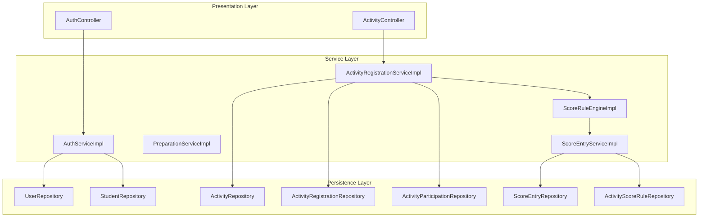
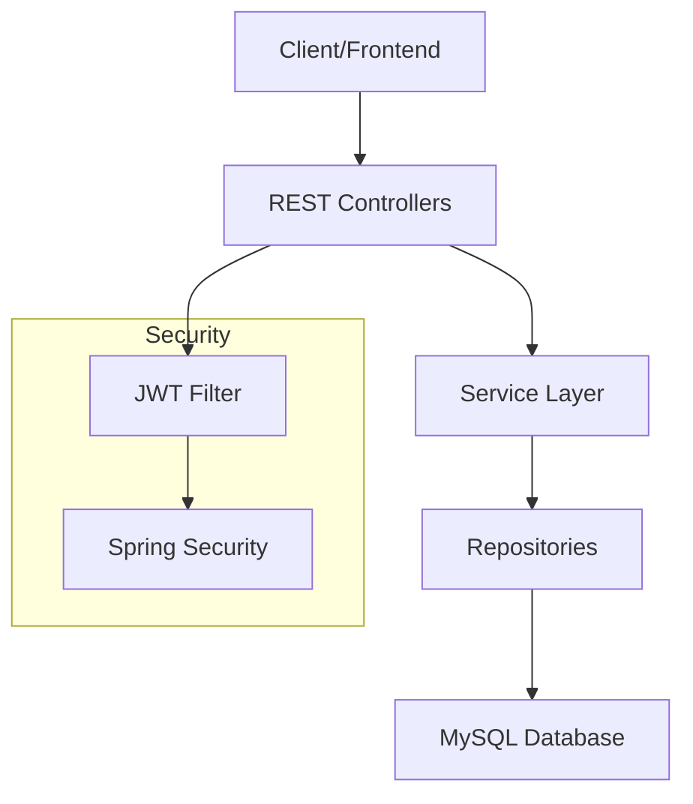
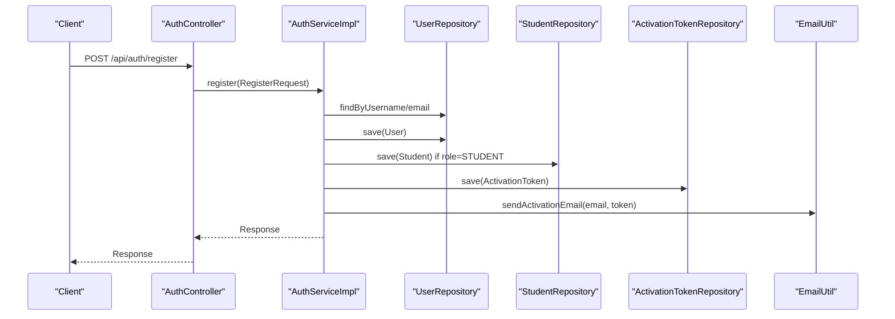
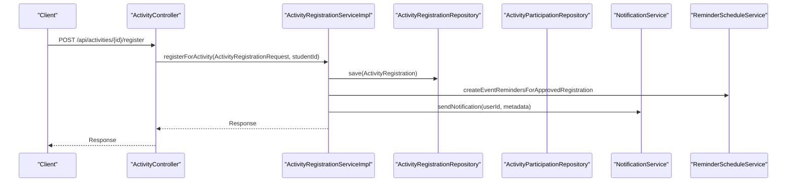
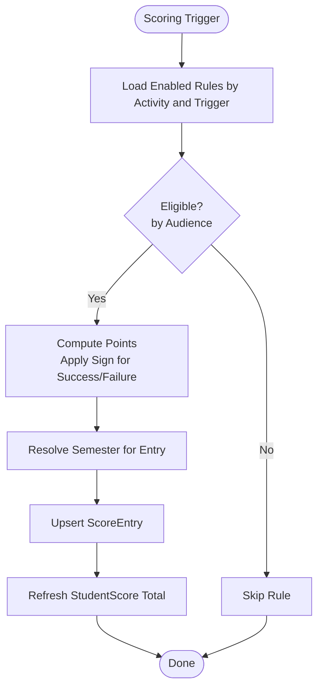
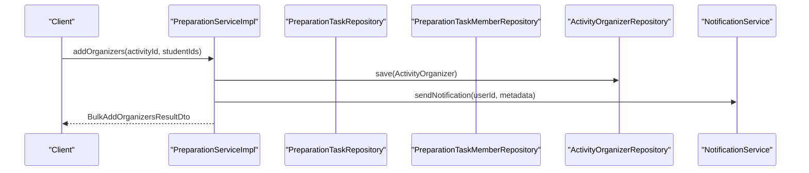
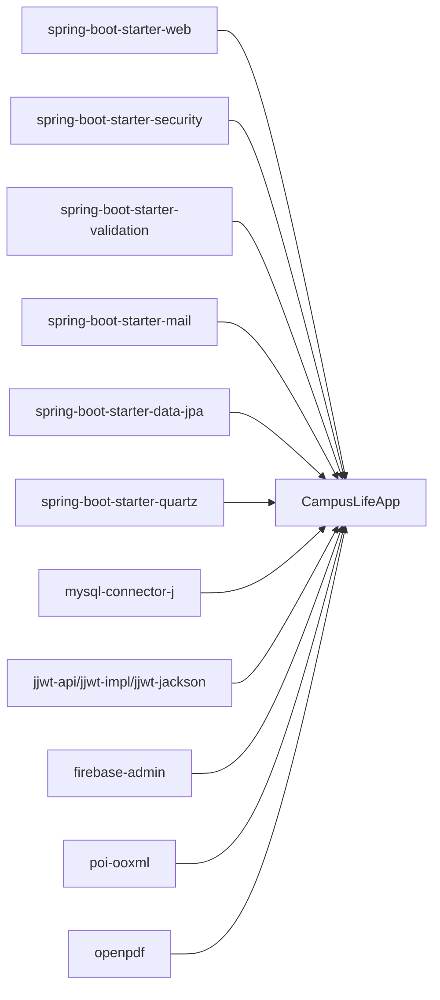

# Core Features Implementation

<cite>
**Referenced Files in This Document**
- [CampusLifeApplication.java](file://src/main/java/vn/campuslife/CampusLifeApplication.java)
- [OVERVIEW_APPLICATION.md](file://OVERVIEW_APPLICATION.md)
- [application.properties](file://src/main/resources/application.properties)
- [pom.xml](file://pom.xml)
- [ScoreRuleEngineImpl.java](file://src/main/java/vn/campuslife/service/impl/ScoreRuleEngineImpl.java)
- [ActivityRegistrationServiceImpl.java](file://src/main/java/vn/campuslife/service/impl/ActivityRegistrationServiceImpl.java)
- [AuthServiceImpl.java](file://src/main/java/vn/campuslife/service/impl/AuthServiceImpl.java)
- [PreparationServiceImpl.java](file://src/main/java/vn/campuslife/service/impl/PreparationServiceImpl.java)
- [ScoreEntryServiceImpl.java](file://src/main/java/vn/campuslife/service/impl/ScoreEntryServiceImpl.java)
- [AuthController.java](file://src/main/java/vn/campuslife/controller/auth/AuthController.java)
- [ActivityController.java](file://src/main/java/vn/campuslife/controller/activity/ActivityController.java)
- [ActivityRegistrationRequest.java](file://src/main/java/vn/campuslife/model/activity/ActivityRegistrationRequest.java)
- [ScoreEntryCommand.java](file://src/main/java/vn/campuslife/model/score/ScoreEntryCommand.java)
- [Role.java](file://src/main/java/vn/campuslife/enumeration/Role.java)
</cite>

## Table of Contents
1. [Introduction](#introduction)
2. [Project Structure](#project-structure)
3. [Core Components](#core-components)
4. [Architecture Overview](#architecture-overview)
5. [Detailed Component Analysis](#detailed-component-analysis)
6. [Dependency Analysis](#dependency-analysis)
7. [Performance Considerations](#performance-considerations)
8. [Troubleshooting Guide](#troubleshooting-guide)
9. [Conclusion](#conclusion)
10. [Appendices](#appendices)

## Introduction
This document explains the core features and business functionalities of the CampusLife system, focusing on layered architecture (controllers, services, repositories), transaction management, validation strategies, and integration points across modules. It covers user management, academic administration, activity management, scoring system, financial administration, and communication modules. Practical examples, common use cases, and troubleshooting guidance are included to help developers and operators maintain and extend the system effectively.

## Project Structure
The application follows a layered Spring Boot architecture:
- Controllers: REST endpoints delegating to services
- Services: Business logic, transactions, rule engine, and cross-module orchestration
- Repositories: Spring Data JPA accessors
- Entities: JPA domain models
- Models: Request/response DTOs
- Enums: Statuses, roles, and types
- Config: Security, CORS, upload, scheduling, and Firebase
- Util: Helpers for JWT, email, Excel, tickets, and URL utilities
- Exceptions: Global exception handler and custom exceptions

**Diagram sources**
- [AuthController.java:1-98](file://src/main/java/vn/campuslife/controller/auth/AuthController.java#L1-L98)
- [ActivityController.java:1-271](file://src/main/java/vn/campuslife/controller/activity/ActivityController.java#L1-L271)
- [AuthServiceImpl.java:1-339](file://src/main/java/vn/campuslife/service/impl/AuthServiceImpl.java#L1-L339)
- [ActivityRegistrationServiceImpl.java:1-1139](file://src/main/java/vn/campuslife/service/impl/ActivityRegistrationServiceImpl.java#L1-L1139)
- [PreparationServiceImpl.java:1-600](file://src/main/java/vn/campuslife/service/impl/PreparationServiceImpl.java#L1-L600)
- [ScoreRuleEngineImpl.java:1-491](file://src/main/java/vn/campuslife/service/impl/ScoreRuleEngineImpl.java#L1-L491)
- [ScoreEntryServiceImpl.java:1-111](file://src/main/java/vn/campuslife/service/impl/ScoreEntryServiceImpl.java#L1-L111)

**Section sources**
- [OVERVIEW_APPLICATION.md:18-33](file://OVERVIEW_APPLICATION.md#L18-L33)
- [pom.xml:44-142](file://pom.xml#L44-L142)

## Core Components
- User Management and Authentication: Login, registration, activation, password reset/change, JWT-based security, role-based access control.
- Academic Administration: Academic year and semester lifecycle, student score initialization per semester.
- Activity Management: CRUD, publishing/unpublishing, presets, upcoming/monthly listing, QR/registration-based check-in, participation grading, and reporting.
- Scoring System: Rule-driven point calculation, series milestones, and score reconciliation.
- Financial Administration: Preparation tasks, budgets, allocations, advances, approvals, and reporting.
- Communication: Notifications, emails, device tokens, and reminders.

**Section sources**
- [OVERVIEW_APPLICATION.md:42-77](file://OVERVIEW_APPLICATION.md#L42-L77)
- [Role.java:1-7](file://src/main/java/vn/campuslife/enumeration/Role.java#L1-L7)

## Architecture Overview
The system adheres to a layered architecture:
- Controllers handle HTTP requests and responses, delegating to services.
- Services encapsulate business logic, enforce validations, manage transactions, and coordinate cross-cutting concerns.
- Repositories abstract persistence operations.
- Entities represent domain objects; models encapsulate DTOs for APIs.
- Configuration manages security, CORS, upload, scheduling, and Firebase integration.
- Utilities support JWT, email, Excel parsing, ticket generation, and URL helpers.
- Exceptions centralize error handling.

**Diagram sources**
- [application.properties:62-66](file://src/main/resources/application.properties#L62-L66)
- [AuthController.java:1-98](file://src/main/java/vn/campuslife/controller/auth/AuthController.java#L1-L98)
- [ActivityController.java:1-271](file://src/main/java/vn/campuslife/controller/activity/ActivityController.java#L1-L271)

## Detailed Component Analysis

### User Management and Authentication
- Responsibilities:
  - Registration with automatic activation token and email delivery.
  - Account activation via token verification.
  - Login with password verification and JWT token issuance.
  - Password reset workflow with secure token handling.
  - Change password with validation and enforcement.
  - Student profile creation and initial score initialization upon registration.
- Transactionality: All write operations are transactional.
- Validation: Request validation via annotations and explicit checks.
- Security: BCrypt password hashing, JWT-based authentication, role-based authorization.

**Diagram sources**
- [AuthController.java:24-39](file://src/main/java/vn/campuslife/controller/auth/AuthController.java#L24-L39)
- [AuthServiceImpl.java:100-170](file://src/main/java/vn/campuslife/service/impl/AuthServiceImpl.java#L100-L170)

**Section sources**
- [AuthServiceImpl.java:1-339](file://src/main/java/vn/campuslife/service/impl/AuthServiceImpl.java#L1-L339)
- [AuthController.java:1-98](file://src/main/java/vn/campuslife/controller/auth/AuthController.java#L1-L98)

### Academic Administration
- Responsibilities:
  - Academic year and semester lifecycle management.
  - Automatic student score initialization per semester for new enrollments.
  - Semester resolution for score entries and series milestones.
- Integration:
  - Uses SemesterHelperService and SemesterRepository to determine applicable semester for scoring events.

**Section sources**
- [OVERVIEW_APPLICATION.md:66-67](file://OVERVIEW_APPLICATION.md#L66-L67)
- [ScoreRuleEngineImpl.java:427-449](file://src/main/java/vn/campuslife/service/impl/ScoreRuleEngineImpl.java#L427-L449)

### Activity Management
- Responsibilities:
  - Create/update/delete/publish/unpublish activities.
  - Registration workflow: availability checks, approval gating, ticket code generation, notifications, reminders.
  - Check-in/out via ticket code or QR code with time-window validation.
  - Grading completion for submission-required activities and series milestone updates.
  - Participation reporting and backfill missing participations.
- Validation:
  - Registration deadlines, capacity limits, draft restrictions, and duplicate registration prevention.
- Notifications:
  - Registration status updates, reminders for approved registrations.

**Diagram sources**
- [ActivityController.java:32-50](file://src/main/java/vn/campuslife/controller/activity/ActivityController.java#L32-L50)
- [ActivityRegistrationServiceImpl.java:54-175](file://src/main/java/vn/campuslife/service/impl/ActivityRegistrationServiceImpl.java#L54-L175)

**Section sources**
- [ActivityRegistrationServiceImpl.java:1-1139](file://src/main/java/vn/campuslife/service/impl/ActivityRegistrationServiceImpl.java#L1-L1139)
- [ActivityController.java:1-271](file://src/main/java/vn/campuslife/controller/activity/ActivityController.java#L1-L271)
- [ActivityRegistrationRequest.java:1-18](file://src/main/java/vn/campuslife/model/activity/ActivityRegistrationRequest.java#L1-L18)

### Scoring System
- Rule Engine:
  - Applies configurable rules for participation completion, no-show penalties, minigame attempts, task overdue, submission grading, minigame passes, series milestones, and minimum requirements.
  - Handles eligibility by audience (all/participants/departments/outside departments).
  - Enforces sign conventions for success/failure points.
- Score Entry:
  - Upserts score entries and recalculates student totals per semester and score type.
  - Supports reversing entries with audit trail.
- Series Scoring:
  - Milestone computation from JSON-encoded thresholds; ensures monotonic progression.

**Diagram sources**
- [ScoreRuleEngineImpl.java:56-94](file://src/main/java/vn/campuslife/service/impl/ScoreRuleEngineImpl.java#L56-L94)
- [ScoreEntryServiceImpl.java:37-74](file://src/main/java/vn/campuslife/service/impl/ScoreEntryServiceImpl.java#L37-L74)

**Section sources**
- [ScoreRuleEngineImpl.java:1-491](file://src/main/java/vn/campuslife/service/impl/ScoreRuleEngineImpl.java#L1-L491)
- [ScoreEntryServiceImpl.java:1-111](file://src/main/java/vn/campuslife/service/impl/ScoreEntryServiceImpl.java#L1-L111)
- [ScoreEntryCommand.java:1-25](file://src/main/java/vn/campuslife/model/score/ScoreEntryCommand.java#L1-L25)

### Financial Administration (Preparation)
- Responsibilities:
  - Toggle preparation mode per activity.
  - Manage organizers (add/remove/promote/demote supervisors).
  - Create and assign tasks with deadlines and financial flags.
  - Member management, acceptance, completion requests, and admin decisions.
  - Budget visibility: categories, allocations, holdings, and availability.
  - Workload warnings for team members.
- Transactions:
  - All write operations are transactional.
- Permissions:
  - Organizer-only operations gated by activity membership and role checks.

**Diagram sources**
- [PreparationServiceImpl.java:429-473](file://src/main/java/vn/campuslife/service/impl/PreparationServiceImpl.java#L429-L473)

**Section sources**
- [PreparationServiceImpl.java:1-600](file://src/main/java/vn/campuslife/service/impl/PreparationServiceImpl.java#L1-L600)

### Communication Modules
- Notifications: Internal app notifications with metadata routing.
- Emails: Activation and password reset emails via SMTP.
- Device Tokens and FCM: Device token management and push notifications (via Firebase Admin SDK).
- Reminders: Quartz-based scheduling for event/task reminders and overdue alerts.

**Section sources**
- [application.properties:27-34](file://src/main/resources/application.properties#L27-L34)
- [application.properties:69-85](file://src/main/resources/application.properties#L69-L85)

## Dependency Analysis
- External Dependencies:
  - Spring Boot starters for web, security, validation, mail, data JPA, and Quartz.
  - MySQL connector and H2 for testing.
  - Firebase Admin SDK for FCM.
  - Apache POI and OpenPDF for exports.
  - JWT libraries for token handling.
- Internal Coupling:
  - Services depend on repositories and each other for cross-module workflows (e.g., registration triggers scoring).
  - Controllers depend on services only, keeping presentation decoupled from business logic.
- Cohesion:
  - Services encapsulate cohesive business capabilities (auth, registration, scoring, preparation).
- Potential Circular Dependencies:
  - None observed among controllers, services, and repositories in the analyzed files.

**Diagram sources**
- [pom.xml:44-142](file://pom.xml#L44-L142)

**Section sources**
- [pom.xml:1-179](file://pom.xml#L1-L179)

## Performance Considerations
- Transaction boundaries: Ensure service methods annotated with transactional encapsulate minimal work to reduce lock contention.
- Batch operations: Prefer bulk operations for organizers and task members where feasible.
- Indexing: Ensure frequently queried columns (e.g., registration status, activity series, semester) are indexed.
- Asynchronous notifications: Offload heavy email sending to background jobs if needed.
- Pagination: Use pagination for large lists (e.g., upcoming/monthly activities).
- Caching: Consider caching activity presets and common lookups where appropriate.

## Troubleshooting Guide
- Authentication failures:
  - Verify JWT secret and expiration settings.
  - Confirm user activation status and password hash matches.
- Registration errors:
  - Check activity draft/published state, registration deadlines, capacity, and duplicate registration.
  - Validate ticket code generation and notification delivery.
- Scoring anomalies:
  - Review rule configurations and audience filters.
  - Confirm semester resolution and score entry reversal if needed.
- Preparation permission denied:
  - Ensure the user is an organizer and has required role (leader/member).
  - Validate task status transitions and completion proof URLs format.
- Email delivery issues:
  - Confirm SMTP settings and token validity for password reset.

**Section sources**
- [application.properties:62-66](file://src/main/resources/application.properties#L62-L66)
- [AuthServiceImpl.java:172-198](file://src/main/java/vn/campuslife/service/impl/AuthServiceImpl.java#L172-L198)
- [ActivityRegistrationServiceImpl.java:54-175](file://src/main/java/vn/campuslife/service/impl/ActivityRegistrationServiceImpl.java#L54-L175)
- [ScoreEntryServiceImpl.java:76-87](file://src/main/java/vn/campuslife/service/impl/ScoreEntryServiceImpl.java#L76-L87)
- [PreparationServiceImpl.java:400-425](file://src/main/java/vn/campuslife/service/impl/PreparationServiceImpl.java#L400-L425)

## Conclusion
CampusLife implements a robust, layered architecture with clear separation of concerns. The service layer enforces business rules, transactions, and integrations across modules. The scoring system leverages a configurable rule engine, while preparation and financial administration provide comprehensive planning and budgeting workflows. With proper validation, transaction management, and security configurations, the system supports scalable enhancements and maintenance.

## Appendices
- Environment and Build:
  - Java 21, Spring Boot 3.5.5, MySQL, Maven.
  - CI/CD via GitHub Actions; Dockerized for deployment.
- Time Zone:
  - Asia/Ho_Chi_Minh configured globally.

**Section sources**
- [CampusLifeApplication.java:1-19](file://src/main/java/vn/campuslife/CampusLifeApplication.java#L1-L19)
- [OVERVIEW_APPLICATION.md:128-134](file://OVERVIEW_APPLICATION.md#L128-L134)
- [application.properties:1-86](file://src/main/resources/application.properties#L1-L86)
- [pom.xml:29-33](file://pom.xml#L29-L33)