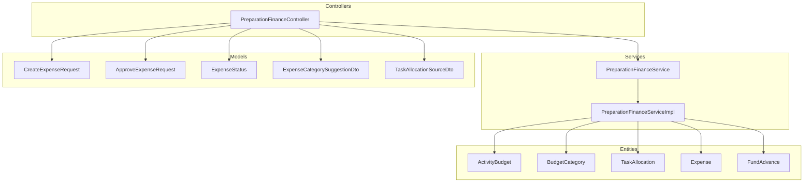
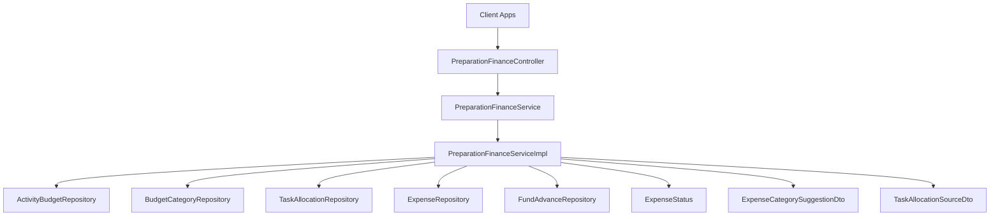
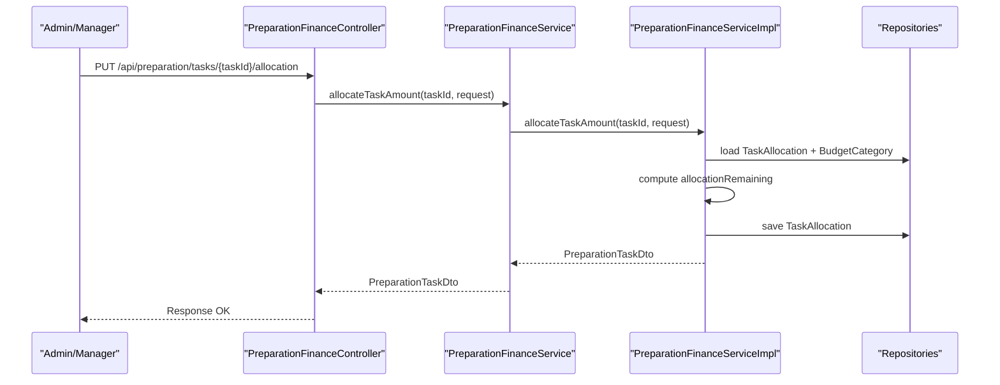
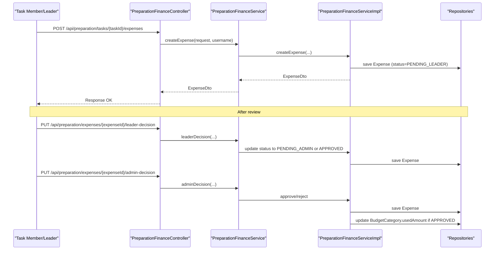
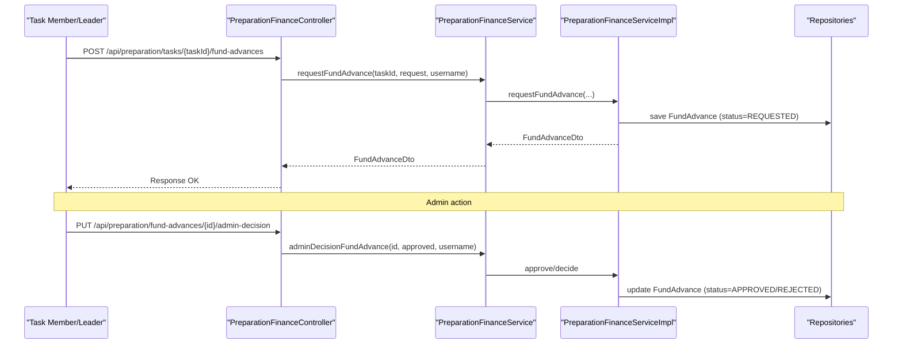
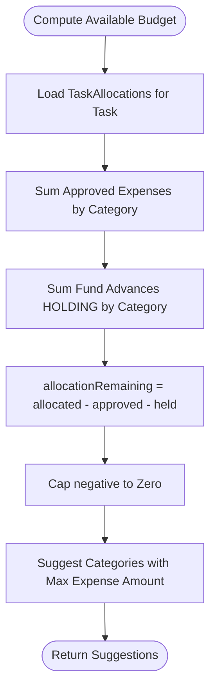
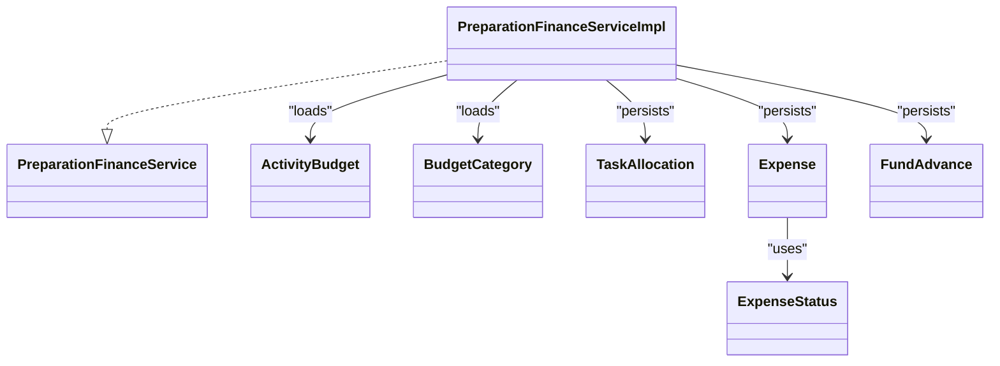

# Budget & Expense Management

<cite>
**Referenced Files in This Document**
- [PreparationFinanceController.java](file://src/main/java/vn/campuslife/controller/preparation/PreparationFinanceController.java)
- [PreparationFinanceService.java](file://src/main/java/vn/campuslife/service/PreparationFinanceService.java)
- [PreparationFinanceServiceImpl.java](file://src/main/java/vn/campuslife/service/impl/PreparationFinanceServiceImpl.java)
- [ActivityBudget.java](file://src/main/java/vn/campuslife/entity/ActivityBudget.java)
- [BudgetCategory.java](file://src/main/java/vn/campuslife/entity/BudgetCategory.java)
- [TaskAllocation.java](file://src/main/java/vn/campuslife/entity/TaskAllocation.java)
- [Expense.java](file://src/main/java/vn/campuslife/entity/Expense.java)
- [FundAdvance.java](file://src/main/java/vn/campuslife/entity/FundAdvance.java)
- [CreateExpenseRequest.java](file://src/main/java/vn/campuslife/model/preparation/CreateExpenseRequest.java)
- [ApproveExpenseRequest.java](file://src/main/java/vn/campuslife/model/preparation/ApproveExpenseRequest.java)
- [ExpenseStatus.java](file://src/main/java/vn/campuslife/enumeration/ExpenseStatus.java)
- [ExpenseCategorySuggestionDto.java](file://src/main/java/vn/campuslife/model/preparation/ExpenseCategorySuggestionDto.java)
- [TaskAllocationSourceDto.java](file://src/main/java/vn/campuslife/model/preparation/TaskAllocationSourceDto.java)
- [event-preparation-bu-fe-report.md](file://docs/event-preparation-bu-fe-report.md)
- [V1017__expenses_is_approved_nullable.sql](file://db/migration/V1017__expenses_is_approved_nullable.sql)
</cite>

## Table of Contents
1. [Introduction](#introduction)
2. [Project Structure](#project-structure)
3. [Core Components](#core-components)
4. [Architecture Overview](#architecture-overview)
5. [Detailed Component Analysis](#detailed-component-analysis)
6. [Dependency Analysis](#dependency-analysis)
7. [Performance Considerations](#performance-considerations)
8. [Troubleshooting Guide](#troubleshooting-guide)
9. [Conclusion](#conclusion)
10. [Appendices](#appendices)

## Introduction
This document explains the budget and expense management functionality implemented in the backend. It covers budget allocation processes, expense recording workflows, approval hierarchies, spending limit enforcement, budget tracking, overspending alerts, and financial reporting. Practical examples illustrate budget setup, expense recording, and financial monitoring scenarios, along with common issues and control strategies.

## Project Structure
The budget and expense management feature resides under the preparation module. The primary entry points are:
- Controllers: HTTP endpoints for budget, allocation, fund advance, expense, and reporting APIs
- Services: Business logic for budgeting, allocation adjustments, fund advances, expense approvals, and reporting
- Entities: Domain models for budgets, categories, allocations, expenses, and fund advances
- Models: Requests and DTOs for client interactions
- Documentation: Backend-Frontend contract and conceptual rules for budgeting and cash flow

**Diagram sources**
- [PreparationFinanceController.java:1-276](file://src/main/java/vn/campuslife/controller/preparation/PreparationFinanceController.java#L1-L276)
- [PreparationFinanceService.java:1-64](file://src/main/java/vn/campuslife/service/PreparationFinanceService.java#L1-L64)
- [PreparationFinanceServiceImpl.java:1-1110](file://src/main/java/vn/campuslife/service/impl/PreparationFinanceServiceImpl.java#L1-L1110)
- [ActivityBudget.java:1-43](file://src/main/java/vn/campuslife/entity/ActivityBudget.java#L1-L43)
- [BudgetCategory.java:1-44](file://src/main/java/vn/campuslife/entity/BudgetCategory.java#L1-L44)
- [TaskAllocation.java:1-39](file://src/main/java/vn/campuslife/entity/TaskAllocation.java#L1-L39)
- [Expense.java:1-52](file://src/main/java/vn/campuslife/entity/Expense.java#L1-L52)
- [FundAdvance.java:1-60](file://src/main/java/vn/campuslife/entity/FundAdvance.java#L1-L60)
- [CreateExpenseRequest.java:1-27](file://src/main/java/vn/campuslife/model/preparation/CreateExpenseRequest.java#L1-L27)
- [ApproveExpenseRequest.java:1-16](file://src/main/java/vn/campuslife/model/preparation/ApproveExpenseRequest.java#L1-L16)
- [ExpenseStatus.java:1-10](file://src/main/java/vn/campuslife/enumeration/ExpenseStatus.java#L1-L10)
- [ExpenseCategorySuggestionDto.java:1-20](file://src/main/java/vn/campuslife/model/preparation/ExpenseCategorySuggestionDto.java#L1-L20)
- [TaskAllocationSourceDto.java:1-21](file://src/main/java/vn/campuslife/model/preparation/TaskAllocationSourceDto.java#L1-L21)

**Section sources**
- [PreparationFinanceController.java:1-276](file://src/main/java/vn/campuslife/controller/preparation/PreparationFinanceController.java#L1-L276)
- [PreparationFinanceService.java:1-64](file://src/main/java/vn/campuslife/service/PreparationFinanceService.java#L1-L64)

## Core Components
- ActivityBudget: Holds the total budget per activity and links to BudgetCategory entries
- BudgetCategory: Per-activity budget categories with allocated and used amounts
- TaskAllocation: Locks budget for tasks (spending cap) per category
- Expense: Records expense requests with status and evidence
- FundAdvance: Tracks temporary cash advances against future expense approvals
- Controllers: Expose endpoints for budget CRUD, allocation, fund advance, expense, and reporting
- Services: Implement business rules, validations, and calculations for budgeting workflows

Key responsibilities:
- Budget allocation: Allocate locked budget to tasks per category
- Expense recording: Create expense requests linked to task and category
- Approval hierarchy: Leader and admin decisions for expenses
- Spending control: Enforce limits via allocations and fund advances
- Reporting: Finance overview, cash flow, and financial reports

**Section sources**
- [ActivityBudget.java:1-43](file://src/main/java/vn/campuslife/entity/ActivityBudget.java#L1-L43)
- [BudgetCategory.java:1-44](file://src/main/java/vn/campuslife/entity/BudgetCategory.java#L1-L44)
- [TaskAllocation.java:1-39](file://src/main/java/vn/campuslife/entity/TaskAllocation.java#L1-L39)
- [Expense.java:1-52](file://src/main/java/vn/campuslife/entity/Expense.java#L1-L52)
- [FundAdvance.java:1-60](file://src/main/java/vn/campuslife/entity/FundAdvance.java#L1-L60)
- [PreparationFinanceController.java:1-276](file://src/main/java/vn/campuslife/controller/preparation/PreparationFinanceController.java#L1-L276)
- [PreparationFinanceService.java:1-64](file://src/main/java/vn/campuslife/service/PreparationFinanceService.java#L1-L64)

## Architecture Overview
The system follows a layered architecture:
- Presentation: REST endpoints in controllers
- Application: Service interfaces and implementations
- Domain: Entities and enumerations
- Persistence: Repositories accessed by services
- Contracts: DTOs and requests define frontend-backend interactions

**Diagram sources**
- [PreparationFinanceController.java:1-276](file://src/main/java/vn/campuslife/controller/preparation/PreparationFinanceController.java#L1-L276)
- [PreparationFinanceService.java:1-64](file://src/main/java/vn/campuslife/service/PreparationFinanceService.java#L1-L64)
- [PreparationFinanceServiceImpl.java:1-1110](file://src/main/java/vn/campuslife/service/impl/PreparationFinanceServiceImpl.java#L1-L1110)
- [ExpenseStatus.java:1-10](file://src/main/java/vn/campuslife/enumeration/ExpenseStatus.java#L1-L10)
- [ExpenseCategorySuggestionDto.java:1-20](file://src/main/java/vn/campuslife/model/preparation/ExpenseCategorySuggestionDto.java#L1-L20)
- [TaskAllocationSourceDto.java:1-21](file://src/main/java/vn/campuslife/model/preparation/TaskAllocationSourceDto.java#L1-L21)

## Detailed Component Analysis

### Budget Allocation Workflow
Budget allocation locks funds for tasks without immediate spending. The process:
- Admin/manager sets or updates activity budget
- Admin/manager allocates budget to a task per category (spending cap)
- Category-level remaining balance equals allocated minus approved expenses and held advances
- Services compute remaining amounts and enforce caps

**Diagram sources**
- [PreparationFinanceController.java:42-49](file://src/main/java/vn/campuslife/controller/preparation/PreparationFinanceController.java#L42-L49)
- [PreparationFinanceService.java:11-11](file://src/main/java/vn/campuslife/service/PreparationFinanceService.java#L11-L11)
- [PreparationFinanceServiceImpl.java:1016-1037](file://src/main/java/vn/campuslife/service/impl/PreparationFinanceServiceImpl.java#L1016-L1037)

**Section sources**
- [PreparationFinanceController.java:42-49](file://src/main/java/vn/campuslife/controller/preparation/PreparationFinanceController.java#L42-L49)
- [PreparationFinanceServiceImpl.java:1016-1037](file://src/main/java/vn/campuslife/service/impl/PreparationFinanceServiceImpl.java#L1016-L1037)
- [TaskAllocationSourceDto.java:1-21](file://src/main/java/vn/campuslife/model/preparation/TaskAllocationSourceDto.java#L1-L21)

### Expense Recording and Approval Hierarchy
Expense lifecycle:
- Member/Leader creates expense request with category and amount
- Expense enters PENDING_LEADER
- Leader approves or rejects (PENDING_ADMIN if rejected)
- Admin approves or rejects (APPROVED or REJECTED)
- APPROVED expenses increase usedAmount in category and reduce remaining cash

**Diagram sources**
- [PreparationFinanceController.java:210-243](file://src/main/java/vn/campuslife/controller/preparation/PreparationFinanceController.java#L210-L243)
- [PreparationFinanceService.java:25-31](file://src/main/java/vn/campuslife/service/PreparationFinanceService.java#L25-L31)
- [PreparationFinanceServiceImpl.java:839-937](file://src/main/java/vn/campuslife/service/impl/PreparationFinanceServiceImpl.java#L839-L937)
- [Expense.java:1-52](file://src/main/java/vn/campuslife/entity/Expense.java#L1-L52)
- [ExpenseStatus.java:1-10](file://src/main/java/vn/campuslife/enumeration/ExpenseStatus.java#L1-L10)

**Section sources**
- [PreparationFinanceController.java:210-243](file://src/main/java/vn/campuslife/controller/preparation/PreparationFinanceController.java#L210-L243)
- [PreparationFinanceServiceImpl.java:839-937](file://src/main/java/vn/campuslife/service/impl/PreparationFinanceServiceImpl.java#L839-L937)
- [Expense.java:1-52](file://src/main/java/vn/campuslife/entity/Expense.java#L1-L52)
- [ExpenseStatus.java:1-10](file://src/main/java/vn/campuslife/enumeration/ExpenseStatus.java#L1-L10)

### Fund Advance Management
Fund advances represent temporary cash given out, to be offset by future approved expenses:
- Member/Leader requests advance for a task and category
- Admin approves or returns advance
- Advance reduces available cash inside wallet until offset by approved expenses

**Diagram sources**
- [PreparationFinanceController.java:116-146](file://src/main/java/vn/campuslife/controller/preparation/PreparationFinanceController.java#L116-L146)
- [PreparationFinanceService.java:15-21](file://src/main/java/vn/campuslife/service/PreparationFinanceService.java#L15-L21)
- [PreparationFinanceServiceImpl.java:1096-1110](file://src/main/java/vn/campuslife/service/impl/PreparationFinanceServiceImpl.java#L1096-L1110)
- [FundAdvance.java:1-60](file://src/main/java/vn/campuslife/entity/FundAdvance.java#L1-L60)

**Section sources**
- [PreparationFinanceController.java:116-146](file://src/main/java/vn/campuslife/controller/preparation/PreparationFinanceController.java#L116-L146)
- [PreparationFinanceServiceImpl.java:1096-1110](file://src/main/java/vn/campuslife/service/impl/PreparationFinanceServiceImpl.java#L1096-L1110)
- [FundAdvance.java:1-60](file://src/main/java/vn/campuslife/entity/FundAdvance.java#L1-L60)

### Budget Tracking and Overspending Controls
Tracking mechanics:
- Category allocatedAmount vs usedAmount determines remainingAmount
- TaskAllocation holds budget per category for a task (allocationRemaining)
- FundAdvance HOLDING affects cashAvailableAmount inside wallet
- Services compute suggestions for categories and allocation sources to prevent overspending

**Diagram sources**
- [PreparationFinanceServiceImpl.java:441-466](file://src/main/java/vn/campuslife/service/impl/PreparationFinanceServiceImpl.java#L441-L466)
- [PreparationFinanceServiceImpl.java:1016-1037](file://src/main/java/vn/campuslife/service/impl/PreparationFinanceServiceImpl.java#L1016-L1037)
- [ExpenseCategorySuggestionDto.java:1-20](file://src/main/java/vn/campuslife/model/preparation/ExpenseCategorySuggestionDto.java#L1-L20)
- [TaskAllocationSourceDto.java:1-21](file://src/main/java/vn/campuslife/model/preparation/TaskAllocationSourceDto.java#L1-L21)

**Section sources**
- [PreparationFinanceServiceImpl.java:441-466](file://src/main/java/vn/campuslife/service/impl/PreparationFinanceServiceImpl.java#L441-L466)
- [PreparationFinanceServiceImpl.java:1016-1037](file://src/main/java/vn/campuslife/service/impl/PreparationFinanceServiceImpl.java#L1016-L1037)
- [event-preparation-bu-fe-report.md:7-21](file://docs/event-preparation-bu-fe-report.md#L7-L21)

### Financial Reporting
Reporting endpoints provide:
- Finance overview report
- Cash flow report
- Financial report

These reports aggregate data from budgets, allocations, expenses, and fund advances.

**Section sources**
- [PreparationFinanceController.java:254-273](file://src/main/java/vn/campuslife/controller/preparation/PreparationFinanceController.java#L254-L273)
- [PreparationFinanceService.java:58-62](file://src/main/java/vn/campuslife/service/PreparationFinanceService.java#L58-L62)

## Dependency Analysis
The service implementation depends on repositories for persistence and uses DTOs and enumerations for contracts.

**Diagram sources**
- [PreparationFinanceService.java:1-64](file://src/main/java/vn/campuslife/service/PreparationFinanceService.java#L1-L64)
- [PreparationFinanceServiceImpl.java:1-1110](file://src/main/java/vn/campuslife/service/impl/PreparationFinanceServiceImpl.java#L1-L1110)
- [ActivityBudget.java:1-43](file://src/main/java/vn/campuslife/entity/ActivityBudget.java#L1-L43)
- [BudgetCategory.java:1-44](file://src/main/java/vn/campuslife/entity/BudgetCategory.java#L1-L44)
- [TaskAllocation.java:1-39](file://src/main/java/vn/campuslife/entity/TaskAllocation.java#L1-L39)
- [Expense.java:1-52](file://src/main/java/vn/campuslife/entity/Expense.java#L1-L52)
- [FundAdvance.java:1-60](file://src/main/java/vn/campuslife/entity/FundAdvance.java#L1-L60)
- [ExpenseStatus.java:1-10](file://src/main/java/vn/campuslife/enumeration/ExpenseStatus.java#L1-L10)

**Section sources**
- [PreparationFinanceServiceImpl.java:1-1110](file://src/main/java/vn/campuslife/service/impl/PreparationFinanceServiceImpl.java#L1-L1110)

## Performance Considerations
- Prefer batch operations for allocation adjustments to minimize repository calls
- Use read-only queries for reporting endpoints to avoid unnecessary writes
- Indexes on foreign keys (task_id, category_id, activity_id) improve join performance
- Cache frequently accessed budget totals for dashboards

## Troubleshooting Guide
Common issues and resolutions:
- Invalid category for activity: Ensure category belongs to the same activity as the task
- Overspending prevention: Use allocationRemaining and category suggestions before creating expenses
- Expense amount validation: Amount must match backend validation rules
- Approval mismatch: Verify hierarchical permissions for leader/admin decisions
- Fund advance discrepancies: Confirm HOLDING advances are considered in cashAvailableAmount

Operational tips:
- Use allocation source suggestions to distribute budget efficiently
- Monitor cash flow reports for real-time visibility
- Reconcile approved expenses with category usedAmount regularly

**Section sources**
- [PreparationFinanceServiceImpl.java:841-849](file://src/main/java/vn/campuslife/service/impl/PreparationFinanceServiceImpl.java#L841-L849)
- [PreparationFinanceServiceImpl.java:894-898](file://src/main/java/vn/campuslife/service/impl/PreparationFinanceServiceImpl.java#L894-L898)
- [event-preparation-bu-fe-report.md:7-21](file://docs/event-preparation-bu-fe-report.md#L7-L21)

## Conclusion
The budget and expense management system enforces strict spending controls through category-based budgets, task-level allocations, and fund advances. The approval hierarchy ensures proper oversight, while built-in suggestions and reporting support informed financial decisions. Following the documented workflows and controls helps prevent overspending and maintains accurate financial records.

## Appendices

### Practical Scenarios

- Budget Setup
  - Steps: Create or update activity budget; configure budget categories; set allocated amounts
  - Endpoint: PUT /api/preparation/activities/{activityId}/budget
  - Reference: [PreparationFinanceController.java:26-33](file://src/main/java/vn/campuslife/controller/preparation/PreparationFinanceController.java#L26-L33)

- Expense Recording
  - Steps: Choose category and amount; submit evidence; await leader/admin approval
  - Endpoint: POST /api/preparation/tasks/{taskId}/expenses
  - Reference: [PreparationFinanceController.java:210-221](file://src/main/java/vn/campuslife/controller/preparation/PreparationFinanceController.java#L210-L221)

- Financial Monitoring
  - Steps: Review finance overview, cash flow, and financial reports
  - Endpoints: GET /api/preparation/activities/{activityId}/reports/*
  - Reference: [PreparationFinanceController.java:254-273](file://src/main/java/vn/campuslife/controller/preparation/PreparationFinanceController.java#L254-L273)

### Backend-Frontend Contract Highlights
- Two-layer budget and cash model: wallet budget and cash outside wallet
- Residual wallet “Other” created automatically when categories are configured
- Allocation vs. spending cap distinction and fund advance offsetting behavior

**Section sources**
- [event-preparation-bu-fe-report.md:7-21](file://docs/event-preparation-bu-fe-report.md#L7-L21)