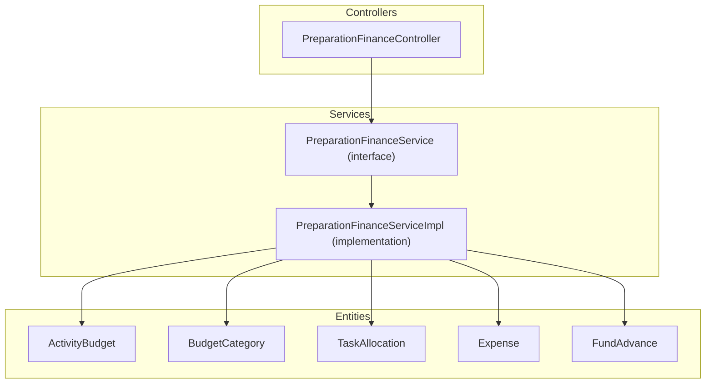
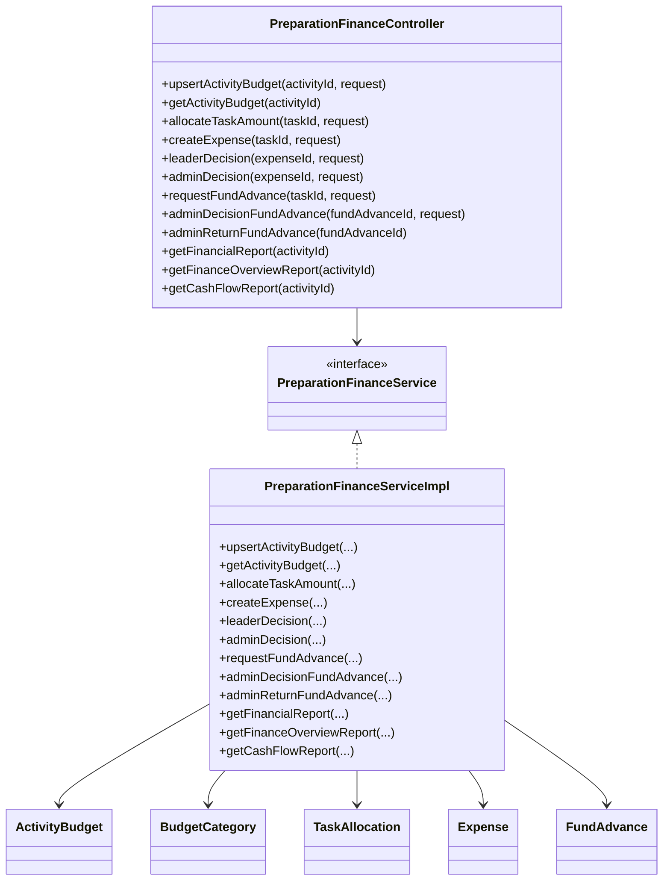
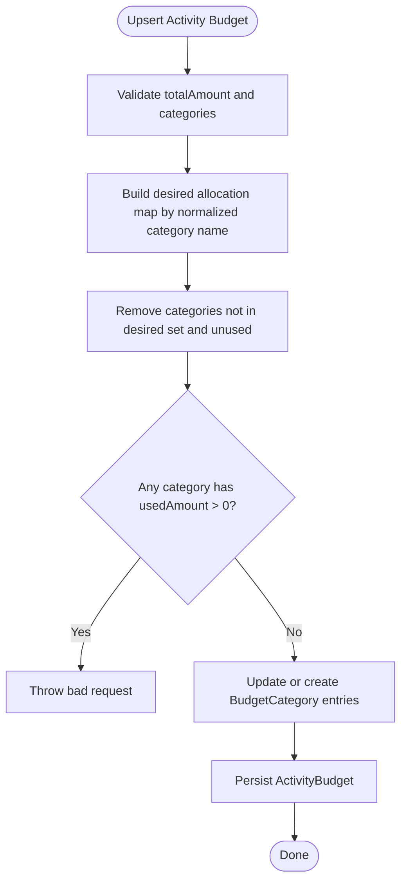
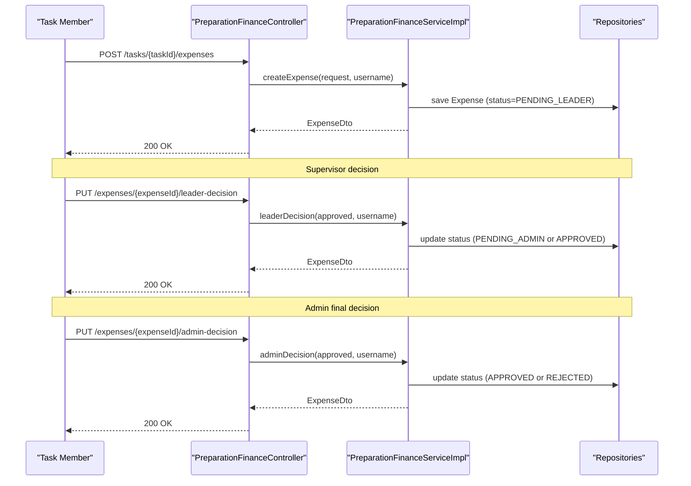
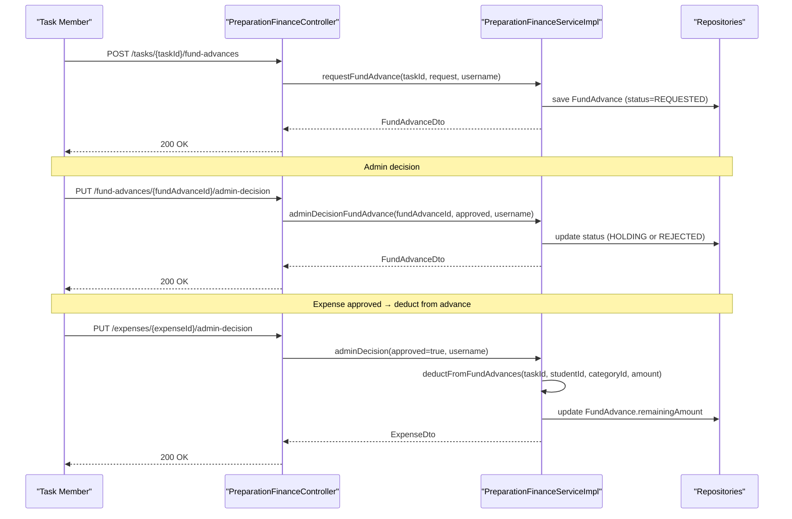
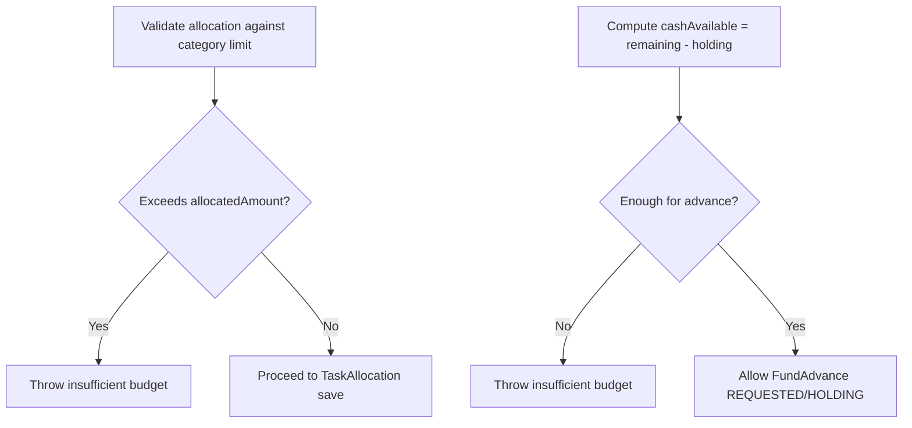
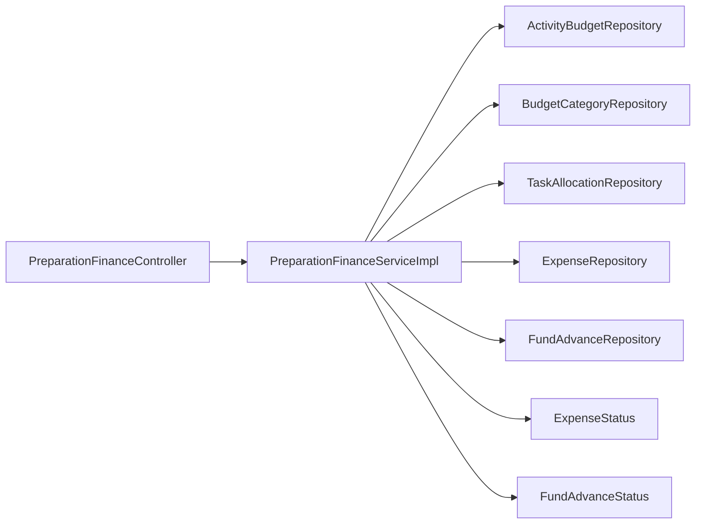

# Financial Administration

<cite>
**Referenced Files in This Document**
- [PreparationFinanceController.java](file://src/main/java/vn/campuslife/controller/preparation/PreparationFinanceController.java)
- [PreparationFinanceService.java](file://src/main/java/vn/campuslife/service/PreparationFinanceService.java)
- [PreparationFinanceServiceImpl.java](file://src/main/java/vn/campuslife/service/impl/PreparationFinanceServiceImpl.java)
- [ActivityBudget.java](file://src/main/java/vn/campuslife/entity/ActivityBudget.java)
- [BudgetCategory.java](file://src/main/java/vn/campuslife/entity/BudgetCategory.java)
- [TaskAllocation.java](file://src/main/java/vn/campuslife/entity/TaskAllocation.java)
- [Expense.java](file://src/main/java/vn/campuslife/entity/Expense.java)
- [FundAdvance.java](file://src/main/java/vn/campuslife/entity/FundAdvance.java)
- [ExpenseStatus.java](file://src/main/java/vn/campuslife/enumeration/ExpenseStatus.java)
- [FundAdvanceStatus.java](file://src/main/java/vn/campuslife/enumeration/FundAdvanceStatus.java)
- [event-preparation-bu-fe-report.md](file://docs/event-preparation-bu-fe-report.md)
</cite>

## Table of Contents
1. [Introduction](#introduction)
2. [Project Structure](#project-structure)
3. [Core Components](#core-components)
4. [Architecture Overview](#architecture-overview)
5. [Detailed Component Analysis](#detailed-component-analysis)
6. [Dependency Analysis](#dependency-analysis)
7. [Performance Considerations](#performance-considerations)
8. [Troubleshooting Guide](#troubleshooting-guide)
9. [Conclusion](#conclusion)
10. [Appendices](#appendices)

## Introduction
This document describes the Financial Administration module responsible for budget management, expense tracking, and fund advances during event preparation. It explains how budgets are allocated per activity and categorized, how expenses are recorded and approved, and how fund advances are requested, approved, and settled. It also documents financial oversight mechanisms, spending limits enforcement, and cash flow reporting.

The module supports multi-tier approvals for expenses and fund advances, category-based budgeting, and real-time visibility into available funds, allocated amounts, and outstanding advances.

## Project Structure
The Financial Administration module is implemented as part of the preparation domain:
- Controllers expose REST endpoints for budgeting, allocations, expense creation and decisions, fund advance requests and decisions, and financial reports.
- Services encapsulate business logic for budget upsert, allocation, expense lifecycle, fund advance lifecycle, and reporting.
- Entities represent the financial model: ActivityBudget, BudgetCategory, TaskAllocation, Expense, and FundAdvance.
- Enumerations define approval statuses for expenses and fund advances.

**Diagram sources**
- [PreparationFinanceController.java:1-276](file://src/main/java/vn/campuslife/controller/preparation/PreparationFinanceController.java#L1-L276)
- [PreparationFinanceService.java:1-64](file://src/main/java/vn/campuslife/service/PreparationFinanceService.java#L1-L64)
- [PreparationFinanceServiceImpl.java:1-200](file://src/main/java/vn/campuslife/service/impl/PreparationFinanceServiceImpl.java#L1-L200)
- [ActivityBudget.java:1-43](file://src/main/java/vn/campuslife/entity/ActivityBudget.java#L1-L43)
- [BudgetCategory.java:1-44](file://src/main/java/vn/campuslife/entity/BudgetCategory.java#L1-L44)
- [TaskAllocation.java:1-39](file://src/main/java/vn/campuslife/entity/TaskAllocation.java#L1-L39)
- [Expense.java:1-52](file://src/main/java/vn/campuslife/entity/Expense.java#L1-L52)
- [FundAdvance.java:1-60](file://src/main/java/vn/campuslife/entity/FundAdvance.java#L1-L60)

**Section sources**
- [PreparationFinanceController.java:1-276](file://src/main/java/vn/campuslife/controller/preparation/PreparationFinanceController.java#L1-L276)
- [PreparationFinanceService.java:1-64](file://src/main/java/vn/campuslife/service/PreparationFinanceService.java#L1-L64)
- [PreparationFinanceServiceImpl.java:1-200](file://src/main/java/vn/campuslife/service/impl/PreparationFinanceServiceImpl.java#L1-L200)

## Core Components
- ActivityBudget: Holds the total budget for an activity and links to BudgetCategory entries.
- BudgetCategory: A category within an activity budget with allocated and used amounts.
- TaskAllocation: Assigns a budget amount from a category to a specific task (spending cap).
- Expense: Records an expense with amount, category, description, evidence, creator, and status.
- FundAdvance: Records a fund advance request with amount, remaining amount, category, requester, and status.

Key enumerations:
- ExpenseStatus: PENDING_LEADER → PENDING_ADMIN → APPROVED | REJECTED
- FundAdvanceStatus: REQUESTED → HOLDING → SETTLED | REJECTED

**Section sources**
- [ActivityBudget.java:1-43](file://src/main/java/vn/campuslife/entity/ActivityBudget.java#L1-L43)
- [BudgetCategory.java:1-44](file://src/main/java/vn/campuslife/entity/BudgetCategory.java#L1-L44)
- [TaskAllocation.java:1-39](file://src/main/java/vn/campuslife/entity/TaskAllocation.java#L1-L39)
- [Expense.java:1-52](file://src/main/java/vn/campuslife/entity/Expense.java#L1-L52)
- [FundAdvance.java:1-60](file://src/main/java/vn/campuslife/entity/FundAdvance.java#L1-L60)
- [ExpenseStatus.java:1-10](file://src/main/java/vn/campuslife/enumeration/ExpenseStatus.java#L1-L10)
- [FundAdvanceStatus.java:1-9](file://src/main/java/vn/campuslife/enumeration/FundAdvanceStatus.java#L1-L9)

## Architecture Overview
The Financial Administration module follows a layered architecture:
- Presentation: REST endpoints in PreparationFinanceController
- Application: Business logic in PreparationFinanceServiceImpl implementing PreparationFinanceService
- Persistence: JPA repositories backing entities for ActivityBudget, BudgetCategory, TaskAllocation, Expense, FundAdvance
- Authorization: Method-level security checks via @PreAuthorize and custom security helpers

**Diagram sources**
- [PreparationFinanceController.java:1-276](file://src/main/java/vn/campuslife/controller/preparation/PreparationFinanceController.java#L1-L276)
- [PreparationFinanceService.java:1-64](file://src/main/java/vn/campuslife/service/PreparationFinanceService.java#L1-L64)
- [PreparationFinanceServiceImpl.java:1-200](file://src/main/java/vn/campuslife/service/impl/PreparationFinanceServiceImpl.java#L1-L200)
- [ActivityBudget.java:1-43](file://src/main/java/vn/campuslife/entity/ActivityBudget.java#L1-L43)
- [BudgetCategory.java:1-44](file://src/main/java/vn/campuslife/entity/BudgetCategory.java#L1-L44)
- [TaskAllocation.java:1-39](file://src/main/java/vn/campuslife/entity/TaskAllocation.java#L1-L39)
- [Expense.java:1-52](file://src/main/java/vn/campuslife/entity/Expense.java#L1-L52)
- [FundAdvance.java:1-60](file://src/main/java/vn/campuslife/entity/FundAdvance.java#L1-L60)

## Detailed Component Analysis

### Budget Management
Budget management centers around ActivityBudget and BudgetCategory:
- Upsert activity budget: Validates and normalizes category names, prevents removal of categories with used amounts, ensures allocated ≥ used, and computes residual wallet logic.
- Category wallet balances:
  - allocatedAmount: category limit
  - usedAmount: actual approved expenses
  - allocatedToTasksAmount: sum of TaskAllocation for the category
  - availableToAllocateAmount = allocatedAmount − allocatedToTasksAmount
  - remainingAmount = allocatedAmount − usedAmount
  - cashOutsideAmount: sum of FundAdvance HOLDING per category
  - cashAvailableAmount = remainingAmount − cashOutsideAmount

**Diagram sources**
- [PreparationFinanceServiceImpl.java:66-151](file://src/main/java/vn/campuslife/service/impl/PreparationFinanceServiceImpl.java#L66-L151)

**Section sources**
- [PreparationFinanceServiceImpl.java:66-151](file://src/main/java/vn/campuslife/service/impl/PreparationFinanceServiceImpl.java#L66-L151)
- [event-preparation-bu-fe-report.md:7-21](file://docs/event-preparation-bu-fe-report.md#L7-L21)

### Expense Tracking and Approval Workflow
Expense lifecycle:
- Creation: Task members or supervisors create an expense linked to a task and category.
- Leader decision: Immediate supervisor approves or rejects (PENDING_ADMIN if rejected).
- Admin decision: Final approval or rejection (APPROVED or REJECTED).

**Diagram sources**
- [PreparationFinanceController.java:210-243](file://src/main/java/vn/campuslife/controller/preparation/PreparationFinanceController.java#L210-L243)
- [PreparationFinanceServiceImpl.java:1-200](file://src/main/java/vn/campuslife/service/impl/PreparationFinanceServiceImpl.java#L1-L200)
- [ExpenseStatus.java:1-10](file://src/main/java/vn/campuslife/enumeration/ExpenseStatus.java#L1-L10)

**Section sources**
- [PreparationFinanceController.java:210-243](file://src/main/java/vn/campuslife/controller/preparation/PreparationFinanceController.java#L210-L243)
- [Expense.java:1-52](file://src/main/java/vn/campuslife/entity/Expense.java#L1-L52)
- [ExpenseStatus.java:1-10](file://src/main/java/vn/campuslife/enumeration/ExpenseStatus.java#L1-L10)

### Fund Advances: Request, Approval, and Settlement
Fund advance lifecycle:
- Request: Task member or supervisor requests an advance linked to a task, category, and amount.
- Admin decision: Approve (HOLDING) or reject.
- Deduction: When an expense is approved, the system deducts from the advance’s remaining amount.
- Settlement: Advance moves to SETTLED after full deduction.
- Return: Admin can mark an advance returned.

**Diagram sources**
- [PreparationFinanceController.java:116-146](file://src/main/java/vn/campuslife/controller/preparation/PreparationFinanceController.java#L116-L146)
- [PreparationFinanceServiceImpl.java:1497-1515](file://src/main/java/vn/campuslife/service/impl/PreparationFinanceServiceImpl.java#L1497-L1515)
- [FundAdvanceStatus.java:1-9](file://src/main/java/vn/campuslife/enumeration/FundAdvanceStatus.java#L1-L9)

**Section sources**
- [PreparationFinanceController.java:116-146](file://src/main/java/vn/campuslife/controller/preparation/PreparationFinanceController.java#L116-L146)
- [PreparationFinanceServiceImpl.java:1497-1515](file://src/main/java/vn/campuslife/service/impl/PreparationFinanceServiceImpl.java#L1497-L1515)
- [FundAdvance.java:1-60](file://src/main/java/vn/campuslife/entity/FundAdvance.java#L1-L60)
- [FundAdvanceStatus.java:1-9](file://src/main/java/vn/campuslife/enumeration/FundAdvanceStatus.java#L1-L9)

### Spending Limits and Cash Flow Management
- Task allocation cap enforcement: Total allocations in a category must not exceed allocatedAmount.
- Wallet cash availability: Cash available for advances equals remainingAmount minus cashOutsideAmount.
- Advance source suggestions: System suggests maximum allowable advances per category considering both allocation remaining and wallet cash.

**Diagram sources**
- [PreparationFinanceServiceImpl.java:189-193](file://src/main/java/vn/campuslife/service/impl/PreparationFinanceServiceImpl.java#L189-L193)
- [PreparationFinanceServiceImpl.java:309-315](file://src/main/java/vn/campuslife/service/impl/PreparationFinanceServiceImpl.java#L309-L315)

**Section sources**
- [PreparationFinanceServiceImpl.java:189-193](file://src/main/java/vn/campuslife/service/impl/PreparationFinanceServiceImpl.java#L189-L193)
- [PreparationFinanceServiceImpl.java:309-315](file://src/main/java/vn/campuslife/service/impl/PreparationFinanceServiceImpl.java#L309-L315)
- [event-preparation-bu-fe-report.md:7-21](file://docs/event-preparation-bu-fe-report.md#L7-L21)

### Reporting Systems
The module provides three financial reports:
- Financial Report: Comprehensive breakdown of activity finances.
- Finance Overview Report: High-level summary of budgets, allocations, and expenses.
- Cash Flow Report: Tracks inflows/outflows and current cash position.

Endpoints:
- GET /activities/{activityId}/financial-report
- GET /activities/{activityId}/reports/finance-overview
- GET /activities/{activityId}/reports/cash-flow

**Section sources**
- [PreparationFinanceController.java:254-273](file://src/main/java/vn/campuslife/controller/preparation/PreparationFinanceController.java#L254-L273)

## Dependency Analysis
The service implementation depends on repositories for persistence and uses enumerations for status transitions. Controllers delegate to services and apply method-level security.

**Diagram sources**
- [PreparationFinanceController.java:1-276](file://src/main/java/vn/campuslife/controller/preparation/PreparationFinanceController.java#L1-L276)
- [PreparationFinanceServiceImpl.java:42-56](file://src/main/java/vn/campuslife/service/impl/PreparationFinanceServiceImpl.java#L42-L56)
- [ExpenseStatus.java:1-10](file://src/main/java/vn/campuslife/enumeration/ExpenseStatus.java#L1-L10)
- [FundAdvanceStatus.java:1-9](file://src/main/java/vn/campuslife/enumeration/FundAdvanceStatus.java#L1-L9)

**Section sources**
- [PreparationFinanceServiceImpl.java:42-56](file://src/main/java/vn/campuslife/service/impl/PreparationFinanceServiceImpl.java#L42-L56)

## Performance Considerations
- Prefer batch operations where feasible (e.g., summing allocations and holdings via repository queries).
- Use pagination for listing expenses and fund advances when datasets grow large.
- Indexes on foreign keys (task_id, category_id, activity_id) improve query performance for allocations, expenses, and advances.
- Avoid N+1 queries by fetching related entities in joins or projections.

## Troubleshooting Guide
Common issues and resolutions:
- Insufficient budget for allocation: Ensure total allocations in a category do not exceed allocatedAmount.
- Insufficient wallet cash for fund advance: Verify remainingAmount minus cashOutsideAmount meets requested amount.
- Removing categories with used amounts: Categories still containing usedAmount cannot be removed.
- Duplicate category names: Category names are normalized; duplicates are rejected.
- Expense approval errors: Confirm leader/admin decisions align with role-based permissions.

**Section sources**
- [PreparationFinanceServiceImpl.java:139-142](file://src/main/java/vn/campuslife/service/impl/PreparationFinanceServiceImpl.java#L139-L142)
- [PreparationFinanceServiceImpl.java:189-193](file://src/main/java/vn/campuslife/service/impl/PreparationFinanceServiceImpl.java#L189-L193)
- [PreparationFinanceServiceImpl.java:309-315](file://src/main/java/vn/campuslife/service/impl/PreparationFinanceServiceImpl.java#L309-L315)

## Conclusion
The Financial Administration module provides a robust framework for managing budgets, tracking expenses, and handling fund advances during event preparation. Its tiered approval process, category-based budgeting, and real-time cash flow visibility support effective financial oversight. The provided reports enable comprehensive monitoring and auditing of financial activities.

## Appendices

### Practical Examples

- Budget allocation example
  - Upsert activity budget with categories and total amount.
  - Verify residual wallet computation and category normalization.
  - Reference: [PreparationFinanceController.java:26-40](file://src/main/java/vn/campuslife/controller/preparation/PreparationFinanceController.java#L26-L40), [PreparationFinanceServiceImpl.java:66-151](file://src/main/java/vn/campuslife/service/impl/PreparationFinanceServiceImpl.java#L66-L151)

- Expense recording and approval example
  - Create an expense under a task and category.
  - Supervisor approves or requests admin review.
  - Admin approves and updates usedAmount accordingly.
  - Reference: [PreparationFinanceController.java:210-243](file://src/main/java/vn/campuslife/controller/preparation/PreparationFinanceController.java#L210-L243), [Expense.java:1-52](file://src/main/java/vn/campuslife/entity/Expense.java#L1-L52)

- Fund advance request and settlement example
  - Request an advance with category and amount.
  - Admin approves HOLDING.
  - Expense approved reduces advance remaining until fully settled.
  - Reference: [PreparationFinanceController.java:116-146](file://src/main/java/vn/campuslife/controller/preparation/PreparationFinanceController.java#L116-L146), [FundAdvance.java:1-60](file://src/main/java/vn/campuslife/entity/FundAdvance.java#L1-L60)

- Financial reporting example
  - Retrieve Financial Report, Finance Overview Report, and Cash Flow Report for an activity.
  - Reference: [PreparationFinanceController.java:254-273](file://src/main/java/vn/campuslife/controller/preparation/PreparationFinanceController.java#L254-L273)