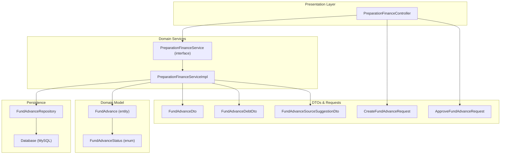
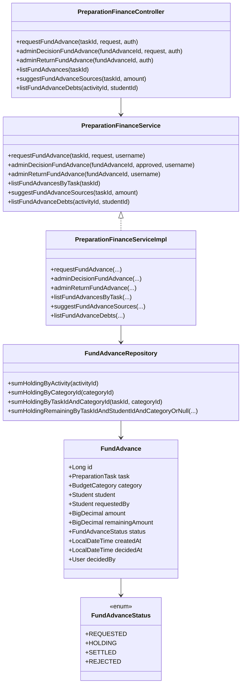
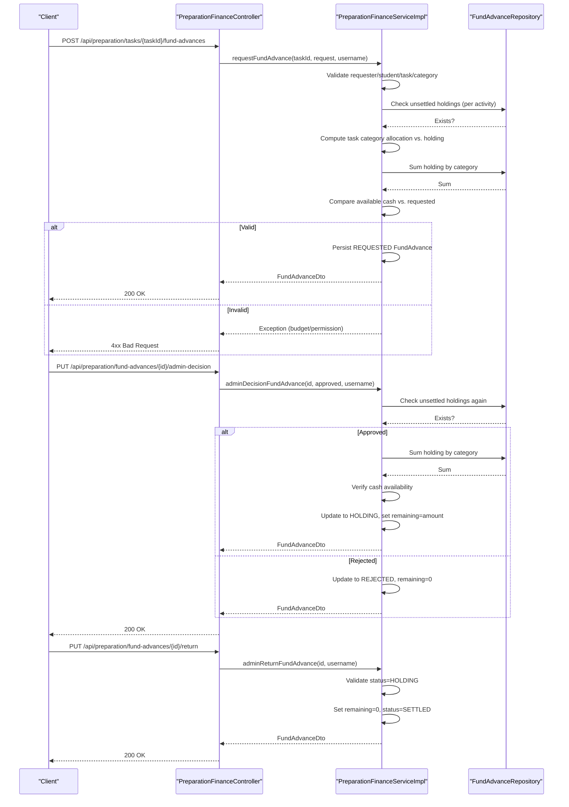
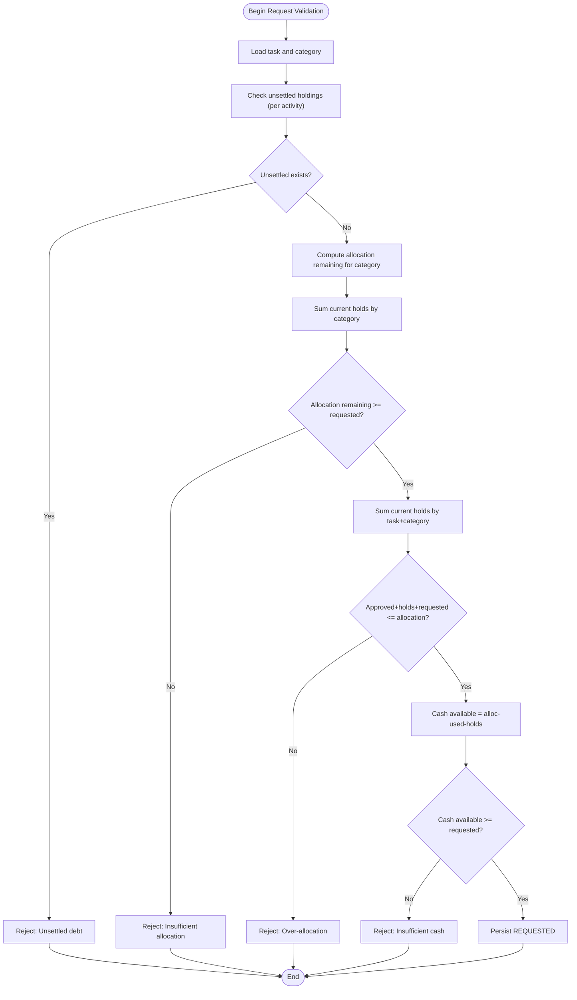
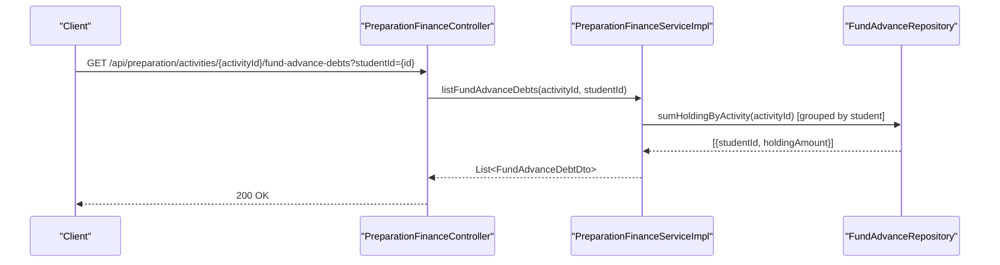
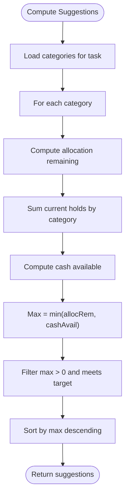
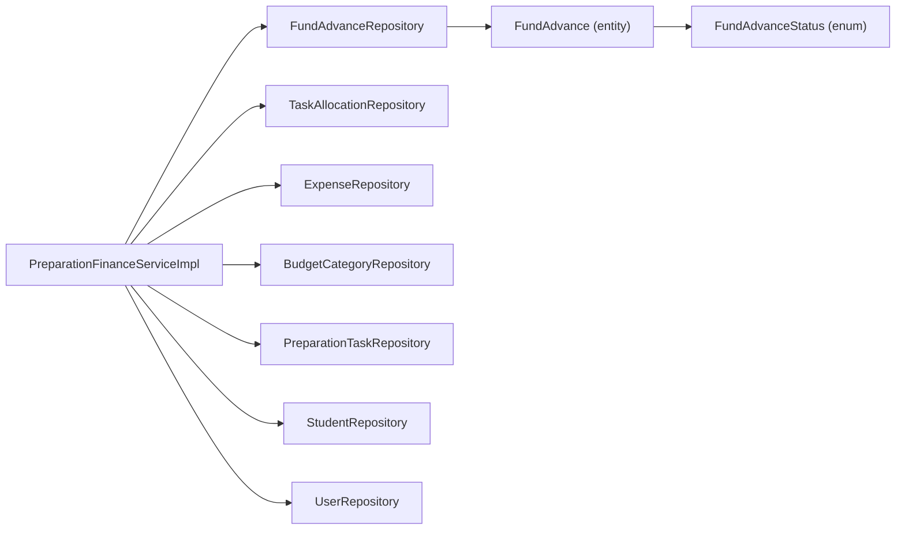

# Fund Advances

<cite>
**Referenced Files in This Document**
- [FundAdvance.java](file://src/main/java/vn/campuslife/entity/FundAdvance.java)
- [FundAdvanceStatus.java](file://src/main/java/vn/campuslife/enumeration/FundAdvanceStatus.java)
- [CreateFundAdvanceRequest.java](file://src/main/java/vn/campuslife/model/preparation/CreateFundAdvanceRequest.java)
- [ApproveFundAdvanceRequest.java](file://src/main/java/vn/campuslife/model/preparation/ApproveFundAdvanceRequest.java)
- [FundAdvanceDto.java](file://src/main/java/vn/campuslife/model/preparation/FundAdvanceDto.java)
- [FundAdvanceDebtDto.java](file://src/main/java/vn/campuslife/model/preparation/FundAdvanceDebtDto.java)
- [FundAdvanceSourceSuggestionDto.java](file://src/main/java/vn/campuslife/model/preparation/FundAdvanceSourceSuggestionDto.java)
- [PreparationFinanceController.java](file://src/main/java/vn/campuslife/controller/preparation/PreparationFinanceController.java)
- [PreparationFinanceService.java](file://src/main/java/vn/campuslife/service/PreparationFinanceService.java)
- [PreparationFinanceServiceImpl.java](file://src/main/java/vn/campuslife/service/impl/PreparationFinanceServiceImpl.java)
- [FundAdvanceRepository.java](file://src/main/java/vn/campuslife/repository/FundAdvanceRepository.java)
- [2026_03_29_phase5_fund_advances_request_approve.sql](file://docs/migrations/2026_03_29_phase5_fund_advances_request_approve.sql)
</cite>

## Table of Contents
1. [Introduction](#introduction)
2. [Project Structure](#project-structure)
3. [Core Components](#core-components)
4. [Architecture Overview](#architecture-overview)
5. [Detailed Component Analysis](#detailed-component-analysis)
6. [Dependency Analysis](#dependency-analysis)
7. [Performance Considerations](#performance-considerations)
8. [Troubleshooting Guide](#troubleshooting-guide)
9. [Conclusion](#conclusion)
10. [Appendices](#appendices)

## Introduction
This document explains the complete fund advance management lifecycle within the preparation finance domain. It covers request submission, approval workflows, disbursement procedures, debt tracking, repayment, and financial liability monitoring. It also documents fund availability checks, category-based limits, and administrative oversight. Practical scenarios, approval bottlenecks, and risk controls are included to help operators manage fund advances safely and efficiently.

## Project Structure
The fund advance feature spans entity modeling, API controllers, service orchestration, repositories, DTOs, enumerations, and database migrations. The following diagram shows how these pieces fit together.

**Diagram sources**
- [PreparationFinanceController.java:116-146](file://src/main/java/vn/campuslife/controller/preparation/PreparationFinanceController.java#L116-L146)
- [PreparationFinanceService.java:15-19](file://src/main/java/vn/campuslife/service/PreparationFinanceService.java#L15-L19)
- [PreparationFinanceServiceImpl.java:251-330](file://src/main/java/vn/campuslife/service/impl/PreparationFinanceServiceImpl.java#L251-L330)
- [FundAdvanceRepository.java:14-93](file://src/main/java/vn/campuslife/repository/FundAdvanceRepository.java#L14-L93)
- [FundAdvance.java:14-60](file://src/main/java/vn/campuslife/entity/FundAdvance.java#L14-L60)
- [FundAdvanceStatus.java:3-8](file://src/main/java/vn/campuslife/enumeration/FundAdvanceStatus.java#L3-L8)
- [FundAdvanceDto.java:14-28](file://src/main/java/vn/campuslife/model/preparation/FundAdvanceDto.java#L14-L28)
- [FundAdvanceDebtDto.java:12-16](file://src/main/java/vn/campuslife/model/preparation/FundAdvanceDebtDto.java#L12-L16)
- [FundAdvanceSourceSuggestionDto.java:12-18](file://src/main/java/vn/campuslife/model/preparation/FundAdvanceSourceSuggestionDto.java#L12-L18)
- [CreateFundAdvanceRequest.java:13-23](file://src/main/java/vn/campuslife/model/preparation/CreateFundAdvanceRequest.java#L13-L23)
- [ApproveFundAdvanceRequest.java:11-14](file://src/main/java/vn/campuslife/model/preparation/ApproveFundAdvanceRequest.java#L11-L14)

**Section sources**
- [PreparationFinanceController.java:116-146](file://src/main/java/vn/campuslife/controller/preparation/PreparationFinanceController.java#L116-L146)
- [PreparationFinanceService.java:15-19](file://src/main/java/vn/campuslife/service/PreparationFinanceService.java#L15-L19)
- [PreparationFinanceServiceImpl.java:251-330](file://src/main/java/vn/campuslife/service/impl/PreparationFinanceServiceImpl.java#L251-L330)
- [FundAdvanceRepository.java:14-93](file://src/main/java/vn/campuslife/repository/FundAdvanceRepository.java#L14-L93)
- [FundAdvance.java:14-60](file://src/main/java/vn/campuslife/entity/FundAdvance.java#L14-L60)
- [FundAdvanceStatus.java:3-8](file://src/main/java/vn/campuslife/enumeration/FundAdvanceStatus.java#L3-L8)
- [FundAdvanceDto.java:14-28](file://src/main/java/vn/campuslife/model/preparation/FundAdvanceDto.java#L14-L28)
- [FundAdvanceDebtDto.java:12-16](file://src/main/java/vn/campuslife/model/preparation/FundAdvanceDebtDto.java#L12-L16)
- [FundAdvanceSourceSuggestionDto.java:12-18](file://src/main/java/vn/campuslife/model/preparation/FundAdvanceSourceSuggestionDto.java#L12-L18)
- [CreateFundAdvanceRequest.java:13-23](file://src/main/java/vn/campuslife/model/preparation/CreateFundAdvanceRequest.java#L13-L23)
- [ApproveFundAdvanceRequest.java:11-14](file://src/main/java/vn/campuslife/model/preparation/ApproveFundAdvanceRequest.java#L11-L14)

## Core Components
- FundAdvance entity: Tracks request metadata, amounts, status, and relationships to tasks, categories, students, and actors.
- FundAdvanceStatus enumeration: Encodes lifecycle states (REQUESTED, HOLDING, SETTLED, REJECTED).
- Controllers: Expose endpoints for requesting, approving, and returning fund advances; listing debts and suggestions.
- Service: Implements business rules for availability checks, approval decisions, and debt reporting.
- Repositories: Provide queries for balances, holdings, and grouped debt views.
- DTOs/Requests: Define request/response shapes for client interactions.

Key responsibilities:
- Request submission validates eligibility, category membership, and outstanding debts.
- Approval enforces category and task allocation limits and prevents overlapping unsettled advances.
- Disbursement sets HOLDING state and reserves funds against category cash.
- Repayment settles the advance by clearing remaining balance and marking as SETTLED.
- Debt tracking aggregates outstanding holdings per student and optionally per category.

**Section sources**
- [FundAdvance.java:14-60](file://src/main/java/vn/campuslife/entity/FundAdvance.java#L14-L60)
- [FundAdvanceStatus.java:3-8](file://src/main/java/vn/campuslife/enumeration/FundAdvanceStatus.java#L3-L8)
- [PreparationFinanceController.java:116-146](file://src/main/java/vn/campuslife/controller/preparation/PreparationFinanceController.java#L116-L146)
- [PreparationFinanceService.java:15-19](file://src/main/java/vn/campuslife/service/PreparationFinanceService.java#L15-L19)
- [PreparationFinanceServiceImpl.java:251-330](file://src/main/java/vn/campuslife/service/impl/PreparationFinanceServiceImpl.java#L251-L330)
- [FundAdvanceRepository.java:14-93](file://src/main/java/vn/campuslife/repository/FundAdvanceRepository.java#L14-L93)
- [FundAdvanceDto.java:14-28](file://src/main/java/vn/campuslife/model/preparation/FundAdvanceDto.java#L14-L28)
- [FundAdvanceDebtDto.java:12-16](file://src/main/java/vn/campuslife/model/preparation/FundAdvanceDebtDto.java#L12-L16)
- [FundAdvanceSourceSuggestionDto.java:12-18](file://src/main/java/vn/campuslife/model/preparation/FundAdvanceSourceSuggestionDto.java#L12-L18)

## Architecture Overview
The system follows a layered architecture:
- Presentation: REST endpoints in PreparationFinanceController
- Application: Business logic in PreparationFinanceServiceImpl implementing PreparationFinanceService
- Persistence: JPA repositories backed by MySQL
- Domain: Entities and enumerations define state and relationships

**Diagram sources**
- [FundAdvance.java:14-60](file://src/main/java/vn/campuslife/entity/FundAdvance.java#L14-L60)
- [FundAdvanceStatus.java:3-8](file://src/main/java/vn/campuslife/enumeration/FundAdvanceStatus.java#L3-L8)
- [PreparationFinanceController.java:116-146](file://src/main/java/vn/campuslife/controller/preparation/PreparationFinanceController.java#L116-L146)
- [PreparationFinanceService.java:15-19](file://src/main/java/vn/campuslife/service/PreparationFinanceService.java#L15-L19)
- [PreparationFinanceServiceImpl.java:251-330](file://src/main/java/vn/campuslife/service/impl/PreparationFinanceServiceImpl.java#L251-L330)
- [FundAdvanceRepository.java:14-93](file://src/main/java/vn/campuslife/repository/FundAdvanceRepository.java#L14-L93)

## Detailed Component Analysis

### Fund Advance Lifecycle: Request → Approval → Disbursement → Repayment
This sequence illustrates the end-to-end flow from submission to settlement.

**Diagram sources**
- [PreparationFinanceController.java:116-146](file://src/main/java/vn/campuslife/controller/preparation/PreparationFinanceController.java#L116-L146)
- [PreparationFinanceServiceImpl.java:251-330](file://src/main/java/vn/campuslife/service/impl/PreparationFinanceServiceImpl.java#L251-L330)
- [FundAdvanceRepository.java:14-93](file://src/main/java/vn/campuslife/repository/FundAdvanceRepository.java#L14-L93)

**Section sources**
- [PreparationFinanceController.java:116-146](file://src/main/java/vn/campuslife/controller/preparation/PreparationFinanceController.java#L116-L146)
- [PreparationFinanceServiceImpl.java:251-330](file://src/main/java/vn/campuslife/service/impl/PreparationFinanceServiceImpl.java#L251-L330)
- [FundAdvanceRepository.java:14-93](file://src/main/java/vn/campuslife/repository/FundAdvanceRepository.java#L14-L93)

### Fund Availability Checks and Limits
The service enforces two-tier limits:
- Task category allocation limit: approved expenses plus current holds plus requested must not exceed the task’s category allocation.
- Category cash availability: allocated minus used minus current holds must be sufficient for the requested amount.

**Diagram sources**
- [PreparationFinanceServiceImpl.java:282-315](file://src/main/java/vn/campuslife/service/impl/PreparationFinanceServiceImpl.java#L282-L315)
- [FundAdvanceRepository.java:43-58](file://src/main/java/vn/campuslife/repository/FundAdvanceRepository.java#L43-L58)

**Section sources**
- [PreparationFinanceServiceImpl.java:282-315](file://src/main/java/vn/campuslife/service/impl/PreparationFinanceServiceImpl.java#L282-L315)
- [FundAdvanceRepository.java:43-58](file://src/main/java/vn/campuslife/repository/FundAdvanceRepository.java#L43-L58)

### Debt Tracking and Reporting
Debt reporting aggregates outstanding holdings per student and can be filtered by student or activity.

**Diagram sources**
- [PreparationFinanceController.java:192-199](file://src/main/java/vn/campuslife/controller/preparation/PreparationFinanceController.java#L192-L199)
- [PreparationFinanceServiceImpl.java:506-518](file://src/main/java/vn/campuslife/service/impl/PreparationFinanceServiceImpl.java#L506-L518)
- [FundAdvanceRepository.java:34-41](file://src/main/java/vn/campuslife/repository/FundAdvanceRepository.java#L34-L41)

**Section sources**
- [PreparationFinanceController.java:192-199](file://src/main/java/vn/campuslife/controller/preparation/PreparationFinanceController.java#L192-L199)
- [PreparationFinanceServiceImpl.java:506-518](file://src/main/java/vn/campuslife/service/impl/PreparationFinanceServiceImpl.java#L506-L518)
- [FundAdvanceRepository.java:34-41](file://src/main/java/vn/campuslife/repository/FundAdvanceRepository.java#L34-L41)

### Fund Advance Source Suggestions
The system suggests viable funding sources by computing:
- Allocation remaining in a category for a task
- Available cash in a category
- Maximum allowable advance

**Diagram sources**
- [PreparationFinanceServiceImpl.java:467-492](file://src/main/java/vn/campuslife/service/impl/PreparationFinanceServiceImpl.java#L467-L492)
- [FundAdvanceRepository.java:43-58](file://src/main/java/vn/campuslife/repository/FundAdvanceRepository.java#L43-L58)

**Section sources**
- [PreparationFinanceServiceImpl.java:467-492](file://src/main/java/vn/campuslife/service/impl/PreparationFinanceServiceImpl.java#L467-L492)
- [FundAdvanceRepository.java:43-58](file://src/main/java/vn/campuslife/repository/FundAdvanceRepository.java#L43-L58)

### API Surface for Fund Advances
Endpoints exposed by the controller include:
- Request fund advance for a task
- Approve/reject a fund advance
- Record a repayment/return
- List fund advances by task
- Get fund advance source suggestions
- List fund advance debts by activity

Authorization roles and supervisors are enforced via method-level security annotations.

**Section sources**
- [PreparationFinanceController.java:116-146](file://src/main/java/vn/campuslife/controller/preparation/PreparationFinanceController.java#L116-L146)
- [PreparationFinanceController.java:148-162](file://src/main/java/vn/campuslife/controller/preparation/PreparationFinanceController.java#L148-L162)
- [PreparationFinanceController.java:192-199](file://src/main/java/vn/campuslife/controller/preparation/PreparationFinanceController.java#L192-L199)

## Dependency Analysis
The service orchestrates multiple repositories and entities to enforce financial controls. The following diagram highlights key dependencies.

**Diagram sources**
- [PreparationFinanceServiceImpl.java:42-56](file://src/main/java/vn/campuslife/service/impl/PreparationFinanceServiceImpl.java#L42-L56)
- [FundAdvanceRepository.java:14-93](file://src/main/java/vn/campuslife/repository/FundAdvanceRepository.java#L14-L93)
- [FundAdvance.java:14-60](file://src/main/java/vn/campuslife/entity/FundAdvance.java#L14-L60)
- [FundAdvanceStatus.java:3-8](file://src/main/java/vn/campuslife/enumeration/FundAdvanceStatus.java#L3-L8)

**Section sources**
- [PreparationFinanceServiceImpl.java:42-56](file://src/main/java/vn/campuslife/service/impl/PreparationFinanceServiceImpl.java#L42-L56)
- [FundAdvanceRepository.java:14-93](file://src/main/java/vn/campuslife/repository/FundAdvanceRepository.java#L14-L93)
- [FundAdvance.java:14-60](file://src/main/java/vn/campuslife/entity/FundAdvance.java#L14-L60)
- [FundAdvanceStatus.java:3-8](file://src/main/java/vn/campuslife/enumeration/FundAdvanceStatus.java#L3-L8)

## Performance Considerations
- Prefer batched reads for aggregated sums (e.g., grouping by category or student) to minimize round-trips.
- Use targeted repository methods that leverage indexed columns (task_id, category_id, status) to avoid N+1 queries.
- Cache frequently accessed configuration data (e.g., category allocations) when appropriate.
- Keep validation logic close to persistence boundaries to fail fast and reduce unnecessary writes.

## Troubleshooting Guide
Common issues and resolutions:
- Insufficient task allocation in selected category: Ensure the sum of approved expenses, current holds, and requested does not exceed the task’s category allocation.
- Insufficient wallet cash remaining: Confirm that allocated minus used minus current holds meets the requested amount.
- Student has unsettled fund advance in the same activity: Resolve outstanding advances before submitting a new request.
- Fund advance not in REQUESTED state: Only REQUESTED advances can be approved or rejected.
- Fund advance not in HOLDING state: Only HOLDING advances can be returned.

Operational tips:
- Use the debt endpoint to identify students with outstanding holdings.
- Use source suggestions to propose feasible funding combinations.
- Monitor audit logs around admin decisions for traceability.

**Section sources**
- [PreparationFinanceServiceImpl.java:305-315](file://src/main/java/vn/campuslife/service/impl/PreparationFinanceServiceImpl.java#L305-L315)
- [PreparationFinanceServiceImpl.java:353-361](file://src/main/java/vn/campuslife/service/impl/PreparationFinanceServiceImpl.java#L353-L361)
- [PreparationFinanceServiceImpl.java:339-341](file://src/main/java/vn/campuslife/service/impl/PreparationFinanceServiceImpl.java#L339-L341)
- [PreparationFinanceServiceImpl.java:403-405](file://src/main/java/vn/campuslife/service/impl/PreparationFinanceServiceImpl.java#L403-L405)
- [PreparationFinanceController.java:192-199](file://src/main/java/vn/campuslife/controller/preparation/PreparationFinanceController.java#L192-L199)
- [PreparationFinanceController.java:155-162](file://src/main/java/vn/campuslife/controller/preparation/PreparationFinanceController.java#L155-L162)

## Conclusion
The fund advance module provides a robust lifecycle from request to settlement, with built-in safeguards against overspending and overlapping debts. By enforcing category and task allocation limits, maintaining accurate debt visibility, and offering source suggestions, the system supports responsible financial management during preparation activities.

## Appendices

### Database Migration Notes
The fund advances table was extended to support requested_by, decided_by, decided_at, category_id, and refined status constraints. Foreign keys were added to maintain referential integrity.

**Section sources**
- [2026_03_29_phase5_fund_advances_request_approve.sql:1-136](file://docs/migrations/2026_03_29_phase5_fund_advances_request_approve.sql#L1-L136)

### Practical Scenarios

- Scenario A: Request within limits
  - Submit a fund advance request for a valid student, category, and amount within allocation and cash availability.
  - Approve the request to move to HOLDING and reserve funds.
  - Later return the advance to settle and clear the remaining balance.

- Scenario B: Over-allocation prevention
  - Attempting to request beyond the task category allocation triggers a budget exception.
  - Adjust the request or reallocate funds before resubmitting.

- Scenario C: Debt blocking
  - A student cannot submit a new request while having unsettled advances in the same activity.
  - Settle existing advances first.

- Scenario D: Financial risk control
  - Use debt reports to monitor outstanding holdings by student and category.
  - Enforce supervisor roles and administrative checks to prevent unauthorized disbursements.