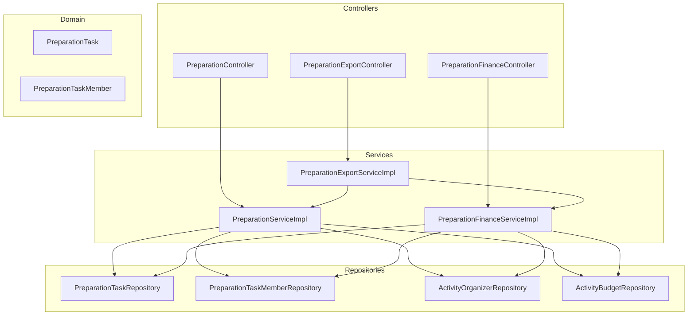
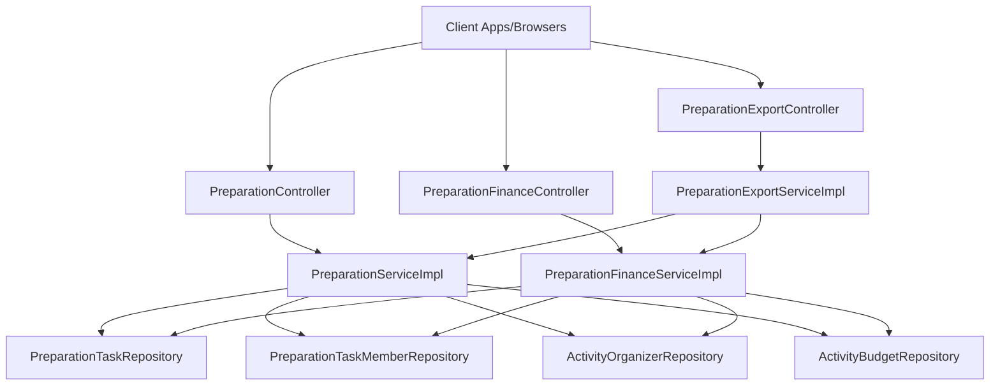
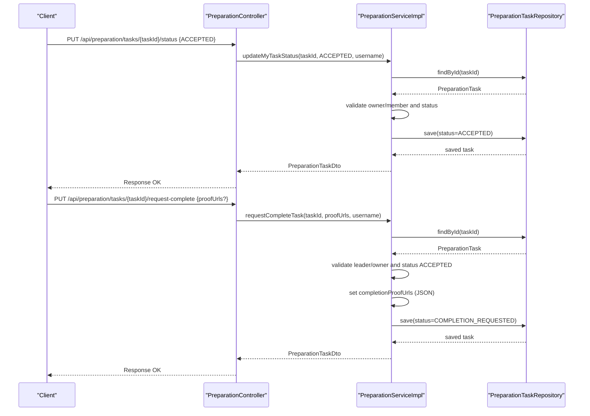
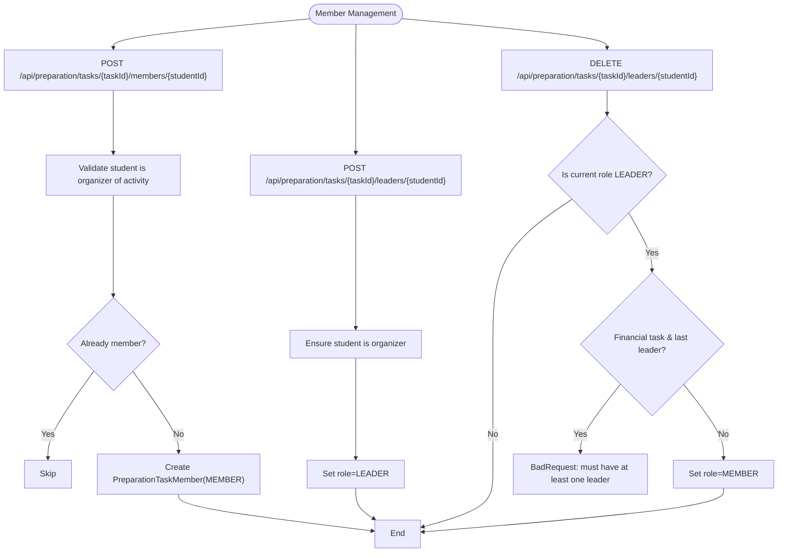
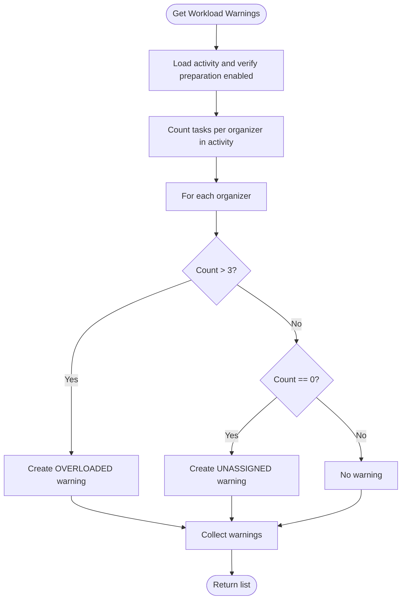
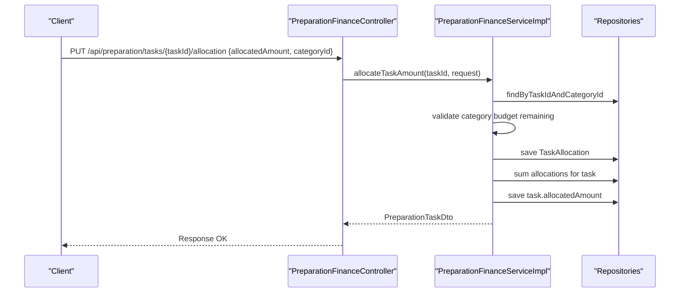
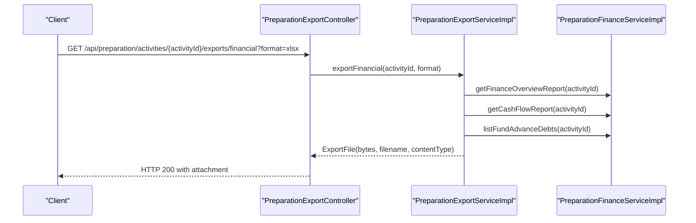
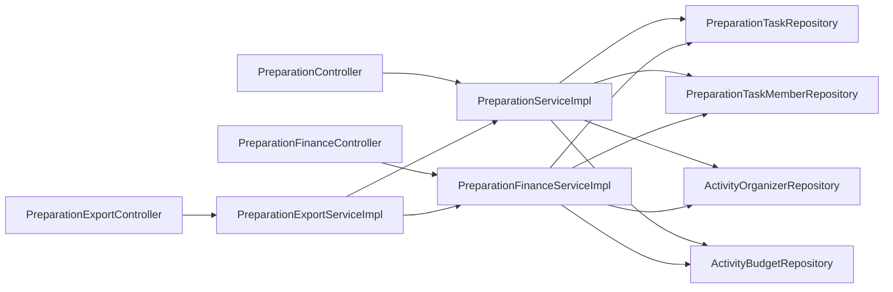
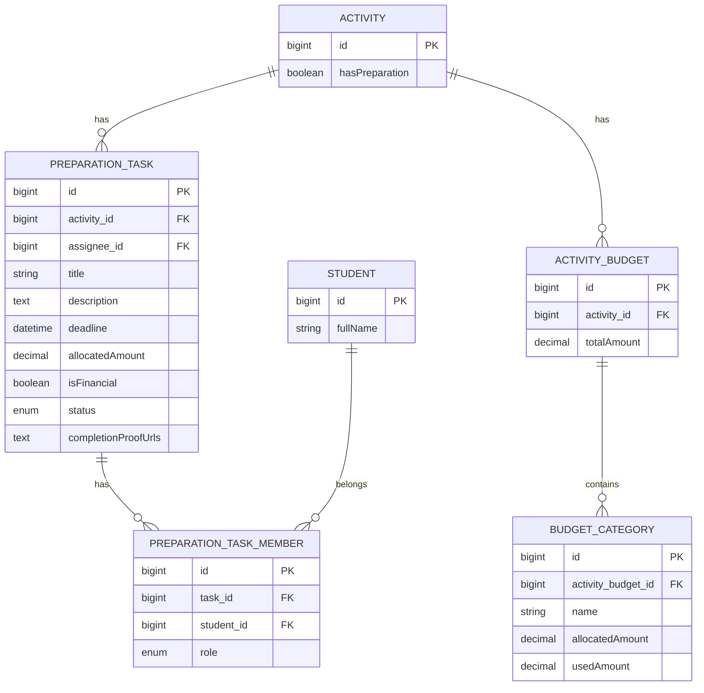

# Preparation Management

<cite>
**Referenced Files in This Document**
- [PreparationController.java](file://src/main/java/vn/campuslife/controller/preparation/PreparationController.java)
- [PreparationFinanceController.java](file://src/main/java/vn/campuslife/controller/preparation/PreparationFinanceController.java)
- [PreparationExportController.java](file://src/main/java/vn/campuslife/controller/preparation/PreparationExportController.java)
- [PreparationServiceImpl.java](file://src/main/java/vn/campuslife/service/impl/PreparationServiceImpl.java)
- [PreparationFinanceServiceImpl.java](file://src/main/java/vn/campuslife/service/impl/PreparationFinanceServiceImpl.java)
- [PreparationExportServiceImpl.java](file://src/main/java/vn/campuslife/service/impl/PreparationExportServiceImpl.java)
- [PreparationTask.java](file://src/main/java/vn/campuslife/entity/PreparationTask.java)
- [PreparationTaskMember.java](file://src/main/java/vn/campuslife/entity/PreparationTaskMember.java)
- [PreparationTaskDto.java](file://src/main/java/vn/campuslife/model/preparation/PreparationTaskDto.java)
- [PreparationTaskStatus.java](file://src/main/java/vn/campuslife/enumeration/PreparationTaskStatus.java)
- [PreparationTaskMemberRole.java](file://src/main/java/vn/campuslife/enumeration/PreparationTaskMemberRole.java)
- [WorkloadWarningType.java](file://src/main/java/vn/campuslife/enumeration/WorkloadWarningType.java)
- [PreparationTaskRepository.java](file://src/main/java/vn/campuslife/repository/PreparationTaskRepository.java)
- [PreparationTaskMemberRepository.java](file://src/main/java/vn/campuslife/repository/PreparationTaskMemberRepository.java)
- [ActivityOrganizerRepository.java](file://src/main/java/vn/campuslife/repository/ActivityOrganizerRepository.java)
- [ActivityBudgetRepository.java](file://src/main/java/vn/campuslife/repository/ActivityBudgetRepository.java)
</cite>

## Table of Contents
1. [Introduction](#introduction)
2. [Project Structure](#project-structure)
3. [Core Components](#core-components)
4. [Architecture Overview](#architecture-overview)
5. [Detailed Component Analysis](#detailed-component-analysis)
6. [Dependency Analysis](#dependency-analysis)
7. [Performance Considerations](#performance-considerations)
8. [Troubleshooting Guide](#troubleshooting-guide)
9. [Conclusion](#conclusion)
10. [Appendices](#appendices)

## Introduction
This document describes the Preparation Management system responsible for organizing, assigning, tracking, and reporting on preparation tasks for campus activities. It covers task lifecycle management, member assignment and leadership roles, workload monitoring, financial controls, export/reporting capabilities, and administrative oversight. Practical workflows, administrative procedures, and strategies for workload balancing and completion tracking are included.

## Project Structure
The system is organized around three primary controllers:
- PreparationController: Task lifecycle, member management, workload warnings, dashboards, and completion proofs
- PreparationFinanceController: Budgeting, fund advances, expenses, allocation adjustments, and financial reports
- PreparationExportController: Export of financial, operational, and audit reports in Excel/PDF

Services implement business logic:
- PreparationServiceImpl: Task CRUD, acceptance, completion requests, workload warnings, organizers, and dashboards
- PreparationFinanceServiceImpl: Budget creation/upsert, task allocation, fund advances, expense approvals, allocation adjustments, and financial analytics
- PreparationExportServiceImpl: Multi-sheet Excel and PDF exports for financial, operational, and audit views

Entities and repositories model domain data and queries:
- PreparationTask and PreparationTaskMember define task ownership and membership
- Repositories support task queries, member counts, and organizer lookups

**Diagram sources**
- [PreparationController.java:1-215](file://src/main/java/vn/campuslife/controller/preparation/PreparationController.java#L1-L215)
- [PreparationFinanceController.java:1-276](file://src/main/java/vn/campuslife/controller/preparation/PreparationFinanceController.java#L1-L276)
- [PreparationExportController.java:1-60](file://src/main/java/vn/campuslife/controller/preparation/PreparationExportController.java#L1-L60)
- [PreparationServiceImpl.java:1-600](file://src/main/java/vn/campuslife/service/impl/PreparationServiceImpl.java#L1-L600)
- [PreparationFinanceServiceImpl.java:1-800](file://src/main/java/vn/campuslife/service/impl/PreparationFinanceServiceImpl.java#L1-L800)
- [PreparationExportServiceImpl.java:1-800](file://src/main/java/vn/campuslife/service/impl/PreparationExportServiceImpl.java#L1-L800)
- [PreparationTask.java:1-57](file://src/main/java/vn/campuslife/entity/PreparationTask.java#L1-L57)
- [PreparationTaskMember.java:1-39](file://src/main/java/vn/campuslife/entity/PreparationTaskMember.java#L1-L39)
- [PreparationTaskRepository.java:1-37](file://src/main/java/vn/campuslife/repository/PreparationTaskRepository.java#L1-L37)
- [PreparationTaskMemberRepository.java:1-60](file://src/main/java/vn/campuslife/repository/PreparationTaskMemberRepository.java#L1-L60)
- [ActivityOrganizerRepository.java:1-34](file://src/main/java/vn/campuslife/repository/ActivityOrganizerRepository.java#L1-L34)
- [ActivityBudgetRepository.java:1-14](file://src/main/java/vn/campuslife/repository/ActivityBudgetRepository.java#L1-L14)

**Section sources**
- [PreparationController.java:1-215](file://src/main/java/vn/campuslife/controller/preparation/PreparationController.java#L1-L215)
- [PreparationFinanceController.java:1-276](file://src/main/java/vn/campuslife/controller/preparation/PreparationFinanceController.java#L1-L276)
- [PreparationExportController.java:1-60](file://src/main/java/vn/campuslife/controller/preparation/PreparationExportController.java#L1-L60)

## Core Components
- Task lifecycle and completion tracking
  - Creation, acceptance, completion request, and admin approval
  - Completion proof upload and storage
- Member assignment and leadership
  - Add/remove members, promote/demote leaders, enforce financial task leader rules
- Workload monitoring
  - Overloaded/unassigned warnings per organizer
- Financial controls
  - Budget creation/upsert, task allocation, fund advances, expense approvals, allocation adjustments
- Reporting and export
  - Financial overview, cash flow, operational tasks/workload, audit logs, and export to Excel/PDF

**Section sources**
- [PreparationServiceImpl.java:173-365](file://src/main/java/vn/campuslife/service/impl/PreparationServiceImpl.java#L173-L365)
- [PreparationFinanceServiceImpl.java:167-746](file://src/main/java/vn/campuslife/service/impl/PreparationFinanceServiceImpl.java#L167-L746)
- [PreparationExportServiceImpl.java:108-149](file://src/main/java/vn/campuslife/service/impl/PreparationExportServiceImpl.java#L108-L149)

## Architecture Overview
The system follows layered architecture:
- Controllers expose REST endpoints with Spring Security pre-authorizations
- Services encapsulate business logic and orchestrate repositories
- Entities represent domain objects; repositories provide typed queries
- Export service builds Excel/PDF reports from finance and operational data

**Diagram sources**
- [PreparationController.java:28-212](file://src/main/java/vn/campuslife/controller/preparation/PreparationController.java#L28-L212)
- [PreparationFinanceController.java:26-273](file://src/main/java/vn/campuslife/controller/preparation/PreparationFinanceController.java#L26-L273)
- [PreparationExportController.java:22-57](file://src/main/java/vn/campuslife/controller/preparation/PreparationExportController.java#L22-L57)
- [PreparationServiceImpl.java:32-42](file://src/main/java/vn/campuslife/service/impl/PreparationServiceImpl.java#L32-L42)
- [PreparationFinanceServiceImpl.java:42-56](file://src/main/java/vn/campuslife/service/impl/PreparationFinanceServiceImpl.java#L42-L56)
- [PreparationExportServiceImpl.java:71-80](file://src/main/java/vn/campuslife/service/impl/PreparationExportServiceImpl.java#L71-L80)

## Detailed Component Analysis

### Task Lifecycle and Completion Tracking
Key flows:
- Assign task to an organizer with title, description, deadline, and financial flag
- Accept task by owner/member when pending
- Request completion with optional proof URLs
- Admin approves or reverts completion request

**Diagram sources**
- [PreparationController.java:92-157](file://src/main/java/vn/campuslife/controller/preparation/PreparationController.java#L92-L157)
- [PreparationServiceImpl.java:217-353](file://src/main/java/vn/campuslife/service/impl/PreparationServiceImpl.java#L217-L353)
- [PreparationTaskRepository.java:14-27](file://src/main/java/vn/campuslife/repository/PreparationTaskRepository.java#L14-L27)

**Section sources**
- [PreparationController.java:78-157](file://src/main/java/vn/campuslife/controller/preparation/PreparationController.java#L78-L157)
- [PreparationServiceImpl.java:173-365](file://src/main/java/vn/campuslife/service/impl/PreparationServiceImpl.java#L173-L365)
- [PreparationTaskStatus.java:1-9](file://src/main/java/vn/campuslife/enumeration/PreparationTaskStatus.java#L1-L9)

### Member Assignment and Leadership
- Add/remove members to tasks
- Promote/demote leaders with role checks
- Enforce minimum leader requirement for financial tasks
- Retrieve task members with role ordering

**Diagram sources**
- [PreparationController.java:103-129](file://src/main/java/vn/campuslife/controller/preparation/PreparationController.java#L103-L129)
- [PreparationServiceImpl.java:240-302](file://src/main/java/vn/campuslife/service/impl/PreparationServiceImpl.java#L240-L302)
- [PreparationTaskMemberRole.java:1-8](file://src/main/java/vn/campuslife/enumeration/PreparationTaskMemberRole.java#L1-L8)

**Section sources**
- [PreparationController.java:103-129](file://src/main/java/vn/campuslife/controller/preparation/PreparationController.java#L103-L129)
- [PreparationServiceImpl.java:240-302](file://src/main/java/vn/campuslife/service/impl/PreparationServiceImpl.java#L240-L302)

### Workload Monitoring and Warnings
- Compute per-organizer task counts during preparation-enabled activities
- Flag overloaded (>3 tasks) and unassigned (0 tasks) organizers
- Expose endpoint for supervisors/organizers/admins

**Diagram sources**
- [PreparationController.java:159-164](file://src/main/java/vn/campuslife/controller/preparation/PreparationController.java#L159-L164)
- [PreparationServiceImpl.java:369-398](file://src/main/java/vn/campuslife/service/impl/PreparationServiceImpl.java#L369-L398)
- [WorkloadWarningType.java:1-8](file://src/main/java/vn/campuslife/enumeration/WorkloadWarningType.java#L1-L8)

**Section sources**
- [PreparationController.java:159-164](file://src/main/java/vn/campuslife/controller/preparation/PreparationController.java#L159-L164)
- [PreparationServiceImpl.java:369-398](file://src/main/java/vn/campuslife/service/impl/PreparationServiceImpl.java#L369-L398)

### Financial Controls and Budget Management
- Upsert activity budget with categories and allocations
- Allocate amounts to tasks within category limits
- Request and approve fund advances; ensure sufficient cash availability
- Create and approve expenses; enforce over-budget thresholds
- Manage allocation adjustment requests and decisions

**Diagram sources**
- [PreparationFinanceController.java:42-49](file://src/main/java/vn/campuslife/controller/preparation/PreparationFinanceController.java#L42-L49)
- [PreparationFinanceServiceImpl.java:167-211](file://src/main/java/vn/campuslife/service/impl/PreparationFinanceServiceImpl.java#L167-L211)

**Section sources**
- [PreparationFinanceController.java:26-93](file://src/main/java/vn/campuslife/controller/preparation/PreparationFinanceController.java#L26-L93)
- [PreparationFinanceServiceImpl.java:67-211](file://src/main/java/vn/campuslife/service/impl/PreparationFinanceServiceImpl.java#L67-L211)

### Reporting and Export
- Export financial overview (wallets, cash flow, transactions, debts)
- Export operational data (tasks, workload, expense evidence)
- Export audit logs and reserve transfers
- Support Excel and PDF formats

**Diagram sources**
- [PreparationExportController.java:22-30](file://src/main/java/vn/campuslife/controller/preparation/PreparationExportController.java#L22-L30)
- [PreparationExportServiceImpl.java:108-119](file://src/main/java/vn/campuslife/service/impl/PreparationExportServiceImpl.java#L108-L119)
- [PreparationFinanceServiceImpl.java:254-273](file://src/main/java/vn/campuslife/service/impl/PreparationFinanceServiceImpl.java#L254-L273)

**Section sources**
- [PreparationExportController.java:22-57](file://src/main/java/vn/campuslife/controller/preparation/PreparationExportController.java#L22-L57)
- [PreparationExportServiceImpl.java:108-149](file://src/main/java/vn/campuslife/service/impl/PreparationExportServiceImpl.java#L108-L149)

### Administrative Oversight Procedures
- Toggle preparation enablement per activity
- Add/remove organizers and grant/revoke prep supervisors
- Approve fund advances and expense decisions
- Review allocation adjustment requests and plan sources

```mermaid
flowchart TD
Start(["Admin Actions"]) --> Toggle["PUT /api/preparation/activities/{activityId}/toggle?enabled=true/false"]
Start --> AddOrg["POST /api/preparation/activities/{activityId}/organizers/{studentId}"]
Start --> RemoveOrg["DELETE /api/preparation/activities/{activityId}/organizers/{studentId}"]
Start --> GrantSup["PUT /api/preparation/activities/{activityId}/organizers/{studentId}/prep-supervisor"]
Start --> RevokeSup["DELETE /api/preparation/activities/{activityId}/organizers/{studentId}/prep-supervisor"]
Start --> AdvDec["PUT /api/preparation/fund-advances/{fundAdvanceId}/admin-decision {approved}"]
Start --> ExpDec["PUT /api/preparation/expenses/{expenseId}/admin-decision {approved}"]
Start --> AdjDec["PUT /api/preparation/allocation-adjustments/{requestId}/admin-decision {approved, sources?}"]
Start --> PlanAdj["GET /api/preparation/allocation-adjustments/{requestId}/source-plan"]
Toggle --> End
AddOrg --> End
RemoveOrg --> End
GrantSup --> End
RevokeSup --> End
AdvDec --> End
ExpDec --> End
AdjDec --> End
PlanAdj --> End
```

**Diagram sources**
- [PreparationController.java:28-33](file://src/main/java/vn/campuslife/controller/preparation/PreparationController.java#L28-L33)
- [PreparationController.java:55-76](file://src/main/java/vn/campuslife/controller/preparation/PreparationController.java#L55-L76)
- [PreparationController.java:196-212](file://src/main/java/vn/campuslife/controller/preparation/PreparationController.java#L196-L212)
- [PreparationFinanceController.java:71-93](file://src/main/java/vn/campuslife/controller/preparation/PreparationFinanceController.java#L71-L93)
- [PreparationFinanceController.java:126-146](file://src/main/java/vn/campuslife/controller/preparation/PreparationFinanceController.java#L126-L146)
- [PreparationFinanceController.java:234-243](file://src/main/java/vn/campuslife/controller/preparation/PreparationFinanceController.java#L234-L243)

**Section sources**
- [PreparationController.java:28-33](file://src/main/java/vn/campuslife/controller/preparation/PreparationController.java#L28-L33)
- [PreparationController.java:55-76](file://src/main/java/vn/campuslife/controller/preparation/PreparationController.java#L55-L76)
- [PreparationController.java:196-212](file://src/main/java/vn/campuslife/controller/preparation/PreparationController.java#L196-L212)
- [PreparationFinanceController.java:71-93](file://src/main/java/vn/campuslife/controller/preparation/PreparationFinanceController.java#L71-L93)
- [PreparationFinanceController.java:126-146](file://src/main/java/vn/campuslife/controller/preparation/PreparationFinanceController.java#L126-L146)
- [PreparationFinanceController.java:234-243](file://src/main/java/vn/campuslife/controller/preparation/PreparationFinanceController.java#L234-L243)

## Dependency Analysis
- Controllers depend on services for business operations
- Services depend on repositories for persistence and queries
- Export service depends on finance and preparation services for consolidated data
- Entities define relationships between tasks, members, budgets, and allocations

**Diagram sources**
- [PreparationController.java:24-26](file://src/main/java/vn/campuslife/controller/preparation/PreparationController.java#L24-L26)
- [PreparationFinanceController.java:23-24](file://src/main/java/vn/campuslife/controller/preparation/PreparationFinanceController.java#L23-L24)
- [PreparationExportController.java:20-21](file://src/main/java/vn/campuslife/controller/preparation/PreparationExportController.java#L20-L21)
- [PreparationServiceImpl.java:32-42](file://src/main/java/vn/campuslife/service/impl/PreparationServiceImpl.java#L32-L42)
- [PreparationFinanceServiceImpl.java:42-56](file://src/main/java/vn/campuslife/service/impl/PreparationFinanceServiceImpl.java#L42-L56)
- [PreparationExportServiceImpl.java:71-80](file://src/main/java/vn/campuslife/service/impl/PreparationExportServiceImpl.java#L71-L80)

**Section sources**
- [PreparationServiceImpl.java:32-42](file://src/main/java/vn/campuslife/service/impl/PreparationServiceImpl.java#L32-L42)
- [PreparationFinanceServiceImpl.java:42-56](file://src/main/java/vn/campuslife/service/impl/PreparationFinanceServiceImpl.java#L42-L56)
- [PreparationExportServiceImpl.java:71-80](file://src/main/java/vn/campuslife/service/impl/PreparationExportServiceImpl.java#L71-L80)

## Performance Considerations
- Prefer batch operations for bulk organizer additions to minimize round-trips
- Use repository projections and streaming for large datasets in exports
- Cache frequently accessed budget and allocation summaries where appropriate
- Index queries by activityId, taskId, and studentId to optimize filtering and joins

## Troubleshooting Guide
Common issues and resolutions:
- Task not found: Verify activity preparation is enabled and task exists
  - Reference: [PreparationServiceImpl.java:60-65](file://src/main/java/vn/campuslife/service/impl/PreparationServiceImpl.java#L60-L65)
- Permission denied: Ensure user is organizer, leader, or has admin role
  - References: [PreparationController.java:92-101](file://src/main/java/vn/campuslife/controller/preparation/PreparationController.java#L92-L101), [PreparationFinanceController.java:223-232](file://src/main/java/vn/campuslife/controller/preparation/PreparationFinanceController.java#L223-L232)
- Over budget expense: Increase task allocation or reduce requested amount
  - Reference: [PreparationFinanceServiceImpl.java:561-570](file://src/main/java/vn/campuslife/service/impl/PreparationFinanceServiceImpl.java#L561-L570)
- Insufficient fund advance: Check category cash availability and outstanding holds
  - Reference: [PreparationFinanceServiceImpl.java:313-315](file://src/main/java/vn/campuslife/service/impl/PreparationFinanceServiceImpl.java#L313-L315)
- Leader removal disallowed: Financial tasks must retain at least one leader
  - Reference: [PreparationServiceImpl.java:293-299](file://src/main/java/vn/campuslife/service/impl/PreparationServiceImpl.java#L293-L299)

**Section sources**
- [PreparationServiceImpl.java:60-65](file://src/main/java/vn/campuslife/service/impl/PreparationServiceImpl.java#L60-L65)
- [PreparationController.java:92-101](file://src/main/java/vn/campuslife/controller/preparation/PreparationController.java#L92-L101)
- [PreparationFinanceController.java:223-232](file://src/main/java/vn/campuslife/controller/preparation/PreparationFinanceController.java#L223-L232)
- [PreparationFinanceServiceImpl.java:561-570](file://src/main/java/vn/campuslife/service/impl/PreparationFinanceServiceImpl.java#L561-L570)
- [PreparationFinanceServiceImpl.java:313-315](file://src/main/java/vn/campuslife/service/impl/PreparationFinanceServiceImpl.java#L313-L315)
- [PreparationServiceImpl.java:293-299](file://src/main/java/vn/campuslife/service/impl/PreparationServiceImpl.java#L293-L299)

## Conclusion
The Preparation Management system provides a robust framework for organizing campus activities through structured task management, financial controls, and comprehensive reporting. Administrators can oversee preparation workflows, balance workloads, and ensure fiscal accountability, while participants can collaborate effectively via clear task ownership and transparent financial processes.

## Appendices

### Practical Workflows and Examples
- Assigning a financial task to an organizer and adding members
  - Steps: Create task → Add members → Allocate funds → Monitor warnings
  - References: [PreparationController.java:78-90](file://src/main/java/vn/campuslife/controller/preparation/PreparationController.java#L78-L90), [PreparationFinanceController.java:42-49](file://src/main/java/vn/campuslife/controller/preparation/PreparationFinanceController.java#L42-L49)
- Completing a task with proof submission
  - Steps: Accept task → Complete with proof → Request completion → Admin approval
  - References: [PreparationController.java:131-157](file://src/main/java/vn/campuslife/controller/preparation/PreparationController.java#L131-L157)
- Managing fund advances and expenses
  - Steps: Request advance → Admin decision → Create expense → Leader/Admin approval
  - References: [PreparationFinanceController.java:116-137](file://src/main/java/vn/campuslife/controller/preparation/PreparationFinanceController.java#L116-L137), [PreparationFinanceController.java:210-243](file://src/main/java/vn/campuslife/controller/preparation/PreparationFinanceController.java#L210-L243)
- Generating preparation analytics and exports
  - Steps: Build financial/operational/audit reports → Export to Excel/PDF
  - References: [PreparationExportController.java:22-57](file://src/main/java/vn/campuslife/controller/preparation/PreparationExportController.java#L22-L57)

### Data Model Overview

**Diagram sources**
- [PreparationTask.java:14-56](file://src/main/java/vn/campuslife/entity/PreparationTask.java#L14-L56)
- [PreparationTaskMember.java:13-38](file://src/main/java/vn/campuslife/entity/PreparationTaskMember.java#L13-L38)
- [ActivityBudgetRepository.java:10-12](file://src/main/java/vn/campuslife/repository/ActivityBudgetRepository.java#L10-L12)