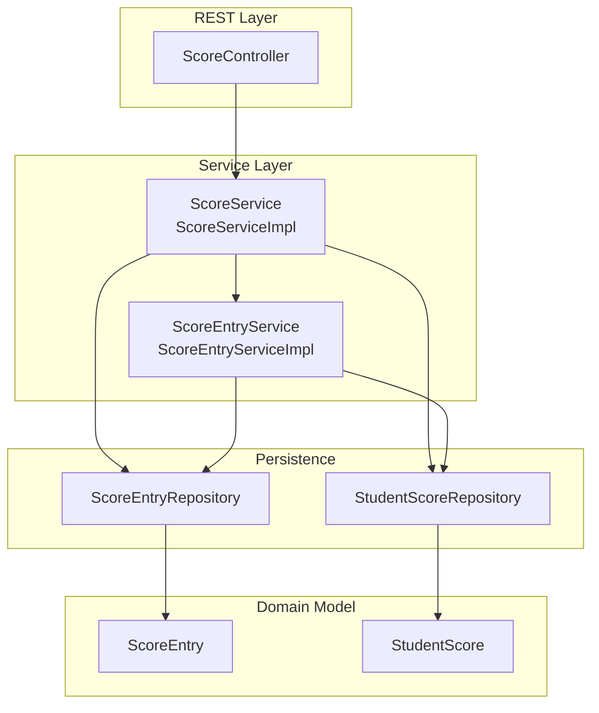
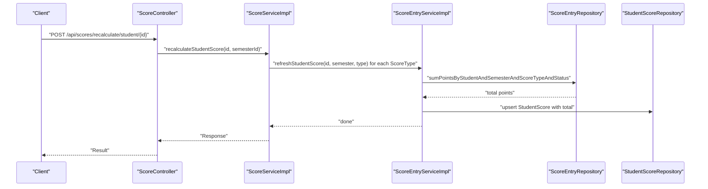
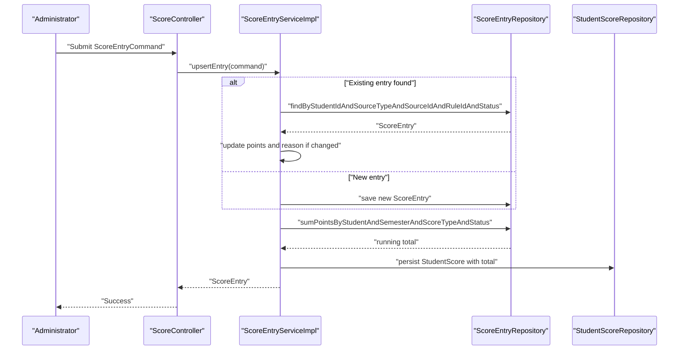
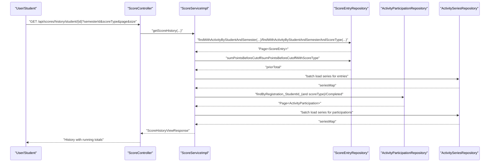
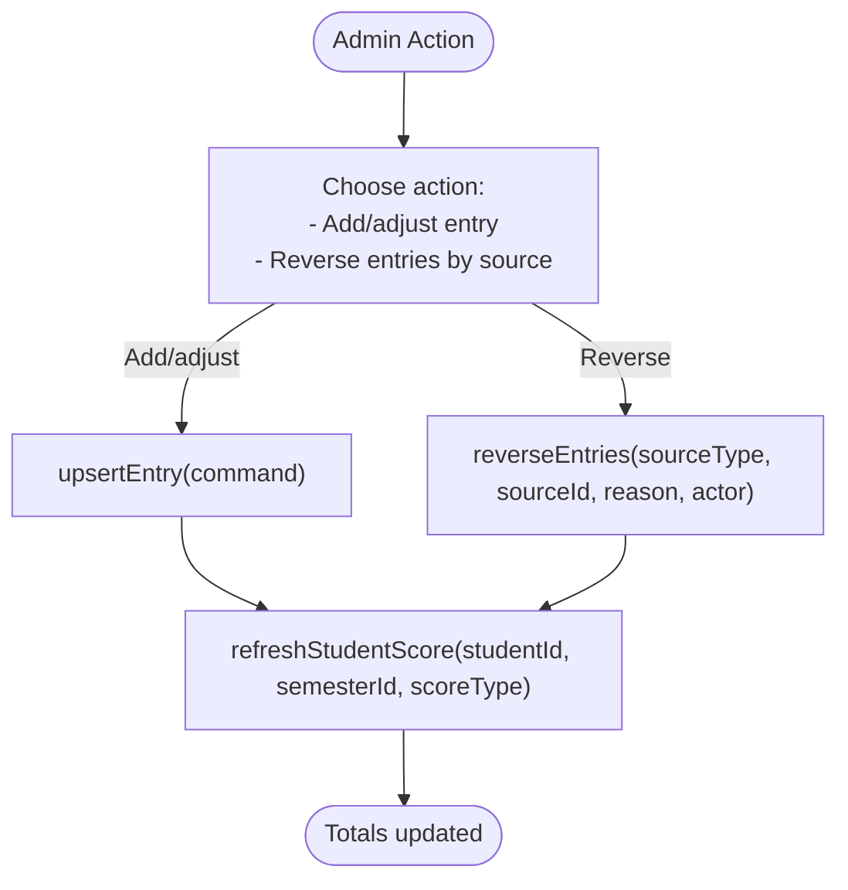
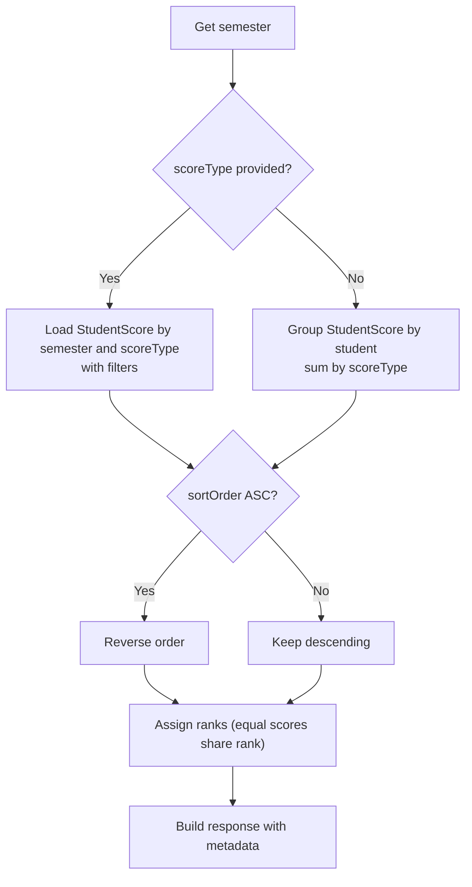
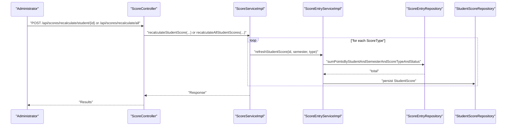
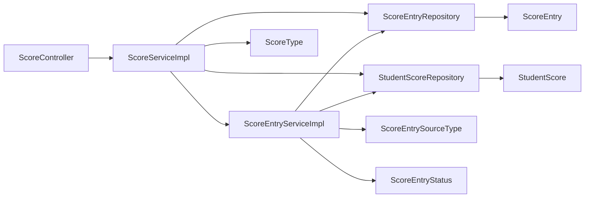
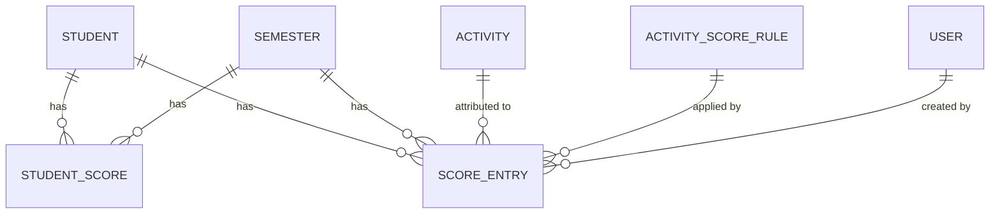

# Score Management

<cite>
**Referenced Files in This Document**
- [ScoreController.java](file://src/main/java/vn/campuslife/controller/score/ScoreController.java)
- [ScoreService.java](file://src/main/java/vn/campuslife/service/ScoreService.java)
- [ScoreServiceImpl.java](file://src/main/java/vn/campuslife/service/impl/ScoreServiceImpl.java)
- [ScoreEntryService.java](file://src/main/java/vn/campuslife/service/ScoreEntryService.java)
- [ScoreEntryServiceImpl.java](file://src/main/java/vn/campuslife/service/impl/ScoreEntryServiceImpl.java)
- [ScoreEntry.java](file://src/main/java/vn/campuslife/entity/ScoreEntry.java)
- [StudentScore.java](file://src/main/java/vn/campuslife/entity/StudentScore.java)
- [ScoreEntryCommand.java](file://src/main/java/vn/campuslife/model/score/ScoreEntryCommand.java)
- [ScoreEntryRepository.java](file://src/main/java/vn/campuslife/repository/ScoreEntryRepository.java)
- [StudentScoreRepository.java](file://src/main/java/vn/campuslife/repository/StudentScoreRepository.java)
- [ScoreType.java](file://src/main/java/vn/campuslife/enumeration/ScoreType.java)
- [ScoreEntrySourceType.java](file://src/main/java/vn/campuslife/enumeration/ScoreEntrySourceType.java)
- [ScoreEntryStatus.java](file://src/main/java/vn/campuslife/enumeration/ScoreEntryStatus.java)
</cite>

## Table of Contents
1. [Introduction](#introduction)
2. [Project Structure](#project-structure)
3. [Core Components](#core-components)
4. [Architecture Overview](#architecture-overview)
5. [Detailed Component Analysis](#detailed-component-analysis)
6. [Dependency Analysis](#dependency-analysis)
7. [Performance Considerations](#performance-considerations)
8. [Troubleshooting Guide](#troubleshooting-guide)
9. [Conclusion](#conclusion)
10. [Appendices](#appendices)

## Introduction
This document provides comprehensive documentation for the score management subsystem. It covers score entry, review, and adjustment workflows; score history tracking and audit trails; score validation and reconciliation; and practical examples for administrators and students. The system supports multiple score types, tracks entries by various sources, and maintains a running total per student per semester per score type.

## Project Structure
The score management feature is organized around a REST controller, service layer, repositories, entities, and enumerations. The controller exposes endpoints for viewing scores, calculating totals, generating rankings, recalculating scores, and retrieving score histories. Services encapsulate business logic for score aggregation, ranking, and history construction. Repositories provide data access and optimized queries for pagination and running totals.

**Diagram sources**
- [ScoreController.java:15-234](file://src/main/java/vn/campuslife/controller/score/ScoreController.java#L15-L234)
- [ScoreService.java:9-62](file://src/main/java/vn/campuslife/service/ScoreService.java#L9-L62)
- [ScoreServiceImpl.java:54-649](file://src/main/java/vn/campuslife/service/impl/ScoreServiceImpl.java#L54-L649)
- [ScoreEntryService.java:9-13](file://src/main/java/vn/campuslife/service/ScoreEntryService.java#L9-L13)
- [ScoreEntryServiceImpl.java:25-111](file://src/main/java/vn/campuslife/service/impl/ScoreEntryServiceImpl.java#L25-L111)
- [ScoreEntryRepository.java:17-119](file://src/main/java/vn/campuslife/repository/ScoreEntryRepository.java#L17-L119)
- [StudentScoreRepository.java:13-123](file://src/main/java/vn/campuslife/repository/StudentScoreRepository.java#L13-L123)
- [ScoreEntry.java:18-79](file://src/main/java/vn/campuslife/entity/ScoreEntry.java#L18-L79)
- [StudentScore.java:15-50](file://src/main/java/vn/campuslife/entity/StudentScore.java#L15-L50)

**Section sources**
- [ScoreController.java:15-234](file://src/main/java/vn/campuslife/controller/score/ScoreController.java#L15-L234)
- [ScoreService.java:9-62](file://src/main/java/vn/campuslife/service/ScoreService.java#L9-L62)
- [ScoreServiceImpl.java:54-649](file://src/main/java/vn/campuslife/service/impl/ScoreServiceImpl.java#L54-L649)
- [ScoreEntryService.java:9-13](file://src/main/java/vn/campuslife/service/ScoreEntryService.java#L9-L13)
- [ScoreEntryServiceImpl.java:25-111](file://src/main/java/vn/campuslife/service/impl/ScoreEntryServiceImpl.java#L25-L111)
- [ScoreEntryRepository.java:17-119](file://src/main/java/vn/campuslife/repository/ScoreEntryRepository.java#L17-L119)
- [StudentScoreRepository.java:13-123](file://src/main/java/vn/campuslife/repository/StudentScoreRepository.java#L13-L123)
- [ScoreEntry.java:18-79](file://src/main/java/vn/campuslife/entity/ScoreEntry.java#L18-L79)
- [StudentScore.java:15-50](file://src/main/java/vn/campuslife/entity/StudentScore.java#L15-L50)

## Core Components
- ScoreController: Exposes REST endpoints for viewing scores, totals, rankings, recalculations, and score history. Implements access control for student-only history views and validates input parameters.
- ScoreService and ScoreServiceImpl: Encapsulate score calculation, ranking, and history retrieval. Handle semester resolution, pagination, running totals, and cross-entity joins for series and participation details.
- ScoreEntryService and ScoreEntryServiceImpl: Manage creation/updating of score entries, reversing entries by source, and refreshing student totals per score type.
- Entities: ScoreEntry captures individual scored events with source metadata and status; StudentScore aggregates totals per student per semester per score type.
- Repositories: Provide paginated queries, running total offsets, filtering by date range and reason keywords, and statistical breakdowns by source type.

Key capabilities:
- Manual score entry via ScoreEntryCommand with actor tracking and reason logging.
- Reversal of entries by source type to correct or undo adjustments.
- Real-time total refresh after any change to ensure consistency.
- Comprehensive score history with running totals and source attribution.

**Section sources**
- [ScoreController.java:26-234](file://src/main/java/vn/campuslife/controller/score/ScoreController.java#L26-L234)
- [ScoreService.java:9-62](file://src/main/java/vn/campuslife/service/ScoreService.java#L9-L62)
- [ScoreServiceImpl.java:79-646](file://src/main/java/vn/campuslife/service/impl/ScoreServiceImpl.java#L79-L646)
- [ScoreEntryService.java:9-13](file://src/main/java/vn/campuslife/service/ScoreEntryService.java#L9-L13)
- [ScoreEntryServiceImpl.java:36-111](file://src/main/java/vn/campuslife/service/impl/ScoreEntryServiceImpl.java#L36-L111)
- [ScoreEntry.java:24-79](file://src/main/java/vn/campuslife/entity/ScoreEntry.java#L24-L79)
- [StudentScore.java:21-50](file://src/main/java/vn/campuslife/entity/StudentScore.java#L21-L50)
- [ScoreEntryRepository.java:17-119](file://src/main/java/vn/campuslife/repository/ScoreEntryRepository.java#L17-L119)
- [StudentScoreRepository.java:13-123](file://src/main/java/vn/campuslife/repository/StudentScoreRepository.java#L13-L123)

## Architecture Overview
The score management architecture follows layered design:
- REST controller handles HTTP requests and delegates to services.
- Services orchestrate domain operations, coordinate repositories, and enforce business rules.
- Repositories abstract persistence and expose optimized queries for history, totals, and statistics.
- Entities represent the persisted state with auditing timestamps and status flags.

**Diagram sources**
- [ScoreController.java:82-93](file://src/main/java/vn/campuslife/controller/score/ScoreController.java#L82-L93)
- [ScoreServiceImpl.java:321-356](file://src/main/java/vn/campuslife/service/impl/ScoreServiceImpl.java#L321-L356)
- [ScoreEntryServiceImpl.java:89-109](file://src/main/java/vn/campuslife/service/impl/ScoreEntryServiceImpl.java#L89-L109)
- [ScoreEntryRepository.java:26-31](file://src/main/java/vn/campuslife/repository/ScoreEntryRepository.java#L26-L31)
- [StudentScoreRepository.java:16-25](file://src/main/java/vn/campuslife/repository/StudentScoreRepository.java#L16-L25)

## Detailed Component Analysis

### Score Entry Workflow (Manual Adjustment)
Manual score entry allows administrators to add or adjust points for a student with a reason and actor. The process ensures idempotency and immediate total refresh.

**Diagram sources**
- [ScoreController.java:124-173](file://src/main/java/vn/campuslife/controller/score/ScoreController.java#L124-L173)
- [ScoreEntryServiceImpl.java:36-74](file://src/main/java/vn/campuslife/service/impl/ScoreEntryServiceImpl.java#L36-L74)
- [ScoreEntryRepository.java:20-31](file://src/main/java/vn/campuslife/repository/ScoreEntryRepository.java#L20-L31)
- [StudentScoreRepository.java:16-25](file://src/main/java/vn/campuslife/repository/StudentScoreRepository.java#L16-L25)

Practical example:
- An administrator adjusts a student’s social work score for completing a community project. They submit a command specifying studentId, semesterId, scoreType, sourceType, sourceId, points, reason, and actor. The system updates or creates the entry and recalculates the total immediately.

Validation and conflict resolution:
- Duplicate detection by studentId, sourceType, sourceId, and ruleId prevents conflicting entries.
- If points differ, the system updates and triggers a refresh; otherwise, no change occurs.

**Section sources**
- [ScoreEntryCommand.java:13-24](file://src/main/java/vn/campuslife/model/score/ScoreEntryCommand.java#L13-L24)
- [ScoreEntryServiceImpl.java:36-74](file://src/main/java/vn/campuslife/service/impl/ScoreEntryServiceImpl.java#L36-L74)
- [ScoreEntryRepository.java:20-21](file://src/main/java/vn/campuslife/repository/ScoreEntryRepository.java#L20-L21)
- [ScoreEntry.java:24-79](file://src/main/java/vn/campuslife/entity/ScoreEntry.java#L24-L79)

### Score Review and History Tracking
Score history combines active score entries with completed activity participations. It computes a running total and includes series context.

**Diagram sources**
- [ScoreController.java:124-173](file://src/main/java/vn/campuslife/controller/score/ScoreController.java#L124-L173)
- [ScoreServiceImpl.java:434-646](file://src/main/java/vn/campuslife/service/impl/ScoreServiceImpl.java#L434-L646)
- [ScoreEntryRepository.java:39-57](file://src/main/java/vn/campuslife/repository/ScoreEntryRepository.java#L39-L57)
- [ScoreEntryRepository.java:59-81](file://src/main/java/vn/campuslife/repository/ScoreEntryRepository.java#L59-L81)
- [StudentSeriesProgressRepository.java](file://src/main/java/vn/campuslife/repository/StudentSeriesProgressRepository.java)

Access control:
- Students can only view their own history; attempts to access others are rejected.

Pagination and running totals:
- Uses cutoff-based aggregation to compute prior totals efficiently for pagination.

**Section sources**
- [ScoreServiceImpl.java:434-646](file://src/main/java/vn/campuslife/service/impl/ScoreServiceImpl.java#L434-L646)
- [ScoreEntryRepository.java:39-81](file://src/main/java/vn/campuslife/repository/ScoreEntryRepository.java#L39-L81)

### Approval and Administrative Controls
Administrative actions are tracked through createdBy and reason fields on ScoreEntry. Reversal by source enables bulk corrections.

**Diagram sources**
- [ScoreEntryServiceImpl.java:36-87](file://src/main/java/vn/campuslife/service/impl/ScoreEntryServiceImpl.java#L36-L87)
- [ScoreEntryServiceImpl.java:89-109](file://src/main/java/vn/campuslife/service/impl/ScoreEntryServiceImpl.java#L89-L109)

Controls:
- Status flag distinguishes active vs reversed entries.
- Actor and reason provide audit trail for reversals and adjustments.

**Section sources**
- [ScoreEntry.java:24-79](file://src/main/java/vn/campuslife/entity/ScoreEntry.java#L24-L79)
- [ScoreEntryStatus.java:3-6](file://src/main/java/vn/campuslife/enumeration/ScoreEntryStatus.java#L3-L6)
- [ScoreEntryServiceImpl.java:76-87](file://src/main/java/vn/campuslife/service/impl/ScoreEntryServiceImpl.java#L76-L87)

### Ranking and Total Calculation
Ranking supports per-type and overall totals with configurable sort order and filters by department/class. Totals are computed per score type and aggregated.

**Diagram sources**
- [ScoreServiceImpl.java:142-300](file://src/main/java/vn/campuslife/service/impl/ScoreServiceImpl.java#L142-L300)
- [StudentScoreRepository.java:27-121](file://src/main/java/vn/campuslife/repository/StudentScoreRepository.java#L27-L121)

**Section sources**
- [ScoreServiceImpl.java:142-300](file://src/main/java/vn/campuslife/service/impl/ScoreServiceImpl.java#L142-L300)
- [StudentScoreRepository.java:27-121](file://src/main/java/vn/campuslife/repository/StudentScoreRepository.java#L27-L121)

### Recalculation and Reconciliation
Recomputations refresh totals for a single student or all students in a semester. Async jobs support large-scale recalculations.

**Diagram sources**
- [ScoreController.java:82-111](file://src/main/java/vn/campuslife/controller/score/ScoreController.java#L82-L111)
- [ScoreServiceImpl.java:321-432](file://src/main/java/vn/campuslife/service/impl/ScoreServiceImpl.java#L321-L432)
- [ScoreEntryServiceImpl.java:89-109](file://src/main/java/vn/campuslife/service/impl/ScoreEntryServiceImpl.java#L89-L109)
- [ScoreEntryRepository.java:26-31](file://src/main/java/vn/campuslife/repository/ScoreEntryRepository.java#L26-L31)
- [StudentScoreRepository.java:16-25](file://src/main/java/vn/campuslife/repository/StudentScoreRepository.java#L16-L25)

Reconciliation:
- After recalculation, totals reflect the latest active entries. Reversed entries are excluded from totals.

**Section sources**
- [ScoreServiceImpl.java:321-432](file://src/main/java/vn/campuslife/service/impl/ScoreServiceImpl.java#L321-L432)
- [ScoreEntryServiceImpl.java:89-109](file://src/main/java/vn/campuslife/service/impl/ScoreEntryServiceImpl.java#L89-L109)

## Dependency Analysis
The system exhibits clean separation of concerns:
- Controllers depend on services.
- Services depend on repositories and other services.
- Repositories depend on entities and JPA.
- Enumerations define domain constants used across services and repositories.

**Diagram sources**
- [ScoreController.java:15-234](file://src/main/java/vn/campuslife/controller/score/ScoreController.java#L15-L234)
- [ScoreServiceImpl.java:54-649](file://src/main/java/vn/campuslife/service/impl/ScoreServiceImpl.java#L54-L649)
- [ScoreEntryServiceImpl.java:25-111](file://src/main/java/vn/campuslife/service/impl/ScoreEntryServiceImpl.java#L25-L111)
- [ScoreEntryRepository.java:17-119](file://src/main/java/vn/campuslife/repository/ScoreEntryRepository.java#L17-L119)
- [StudentScoreRepository.java:13-123](file://src/main/java/vn/campuslife/repository/StudentScoreRepository.java#L13-L123)
- [ScoreEntry.java:18-79](file://src/main/java/vn/campuslife/entity/ScoreEntry.java#L18-L79)
- [StudentScore.java:15-50](file://src/main/java/vn/campuslife/entity/StudentScore.java#L15-L50)
- [ScoreType.java:3-7](file://src/main/java/vn/campuslife/enumeration/ScoreType.java#L3-L7)
- [ScoreEntrySourceType.java:3-13](file://src/main/java/vn/campuslife/enumeration/ScoreEntrySourceType.java#L3-L13)
- [ScoreEntryStatus.java:3-6](file://src/main/java/vn/campuslife/enumeration/ScoreEntryStatus.java#L3-L6)

**Section sources**
- [ScoreController.java:15-234](file://src/main/java/vn/campuslife/controller/score/ScoreController.java#L15-L234)
- [ScoreService.java:9-62](file://src/main/java/vn/campuslife/service/ScoreService.java#L9-L62)
- [ScoreServiceImpl.java:54-649](file://src/main/java/vn/campuslife/service/impl/ScoreServiceImpl.java#L54-L649)
- [ScoreEntryService.java:9-13](file://src/main/java/vn/campuslife/service/ScoreEntryService.java#L9-L13)
- [ScoreEntryServiceImpl.java:25-111](file://src/main/java/vn/campuslife/service/impl/ScoreEntryServiceImpl.java#L25-L111)
- [ScoreEntryRepository.java:17-119](file://src/main/java/vn/campuslife/repository/ScoreEntryRepository.java#L17-L119)
- [StudentScoreRepository.java:13-123](file://src/main/java/vn/campuslife/repository/StudentScoreRepository.java#L13-L123)
- [ScoreEntry.java:18-79](file://src/main/java/vn/campuslife/entity/ScoreEntry.java#L18-L79)
- [StudentScore.java:15-50](file://src/main/java/vn/campuslife/entity/StudentScore.java#L15-L50)
- [ScoreType.java:3-7](file://src/main/java/vn/campuslife/enumeration/ScoreType.java#L3-L7)
- [ScoreEntrySourceType.java:3-13](file://src/main/java/vn/campuslife/enumeration/ScoreEntrySourceType.java#L3-L13)
- [ScoreEntryStatus.java:3-6](file://src/main/java/vn/campuslife/enumeration/ScoreEntryStatus.java#L3-L6)

## Performance Considerations
- Pagination and running totals: The history endpoint uses cutoff-based aggregation to compute prior totals efficiently, avoiding expensive window functions.
- Batch loading: Series and progress entities are batch-loaded to prevent N+1 queries during history construction.
- Index-friendly queries: Repositories use composite filters and ordered pagination to leverage database indexes effectively.
- Transaction boundaries: Score updates are transactional to maintain consistency; avoid long-running transactions by keeping refresh operations minimal.

[No sources needed since this section provides general guidance]

## Troubleshooting Guide
Common issues and resolutions:
- Invalid scoreType parameter: The controller validates scoreType and returns a bad request with an error message when invalid.
- Access denied for score history: Students attempting to view others’ history receive an error response; only admins can view arbitrary histories.
- Semester not found: Recalculation and ranking endpoints validate the semester existence and return appropriate errors.
- Duplicate entry conflicts: Manual entry dedupes by student, source type, source id, and rule id; updates only occur if points differ.
- Reversal scope: Reversing by source affects all active entries for that source; ensure correct sourceType and sourceId.

Operational tips:
- Use date range and keyword filters in score history to narrow down entries.
- Prefer batch recalculation for large datasets; monitor async job status via job ID endpoints.

**Section sources**
- [ScoreController.java:56-72](file://src/main/java/vn/campuslife/controller/score/ScoreController.java#L56-L72)
- [ScoreController.java:136-173](file://src/main/java/vn/campuslife/controller/score/ScoreController.java#L136-L173)
- [ScoreServiceImpl.java:330-356](file://src/main/java/vn/campuslife/service/impl/ScoreServiceImpl.java#L330-L356)
- [ScoreEntryRepository.java:84-101](file://src/main/java/vn/campuslife/repository/ScoreEntryRepository.java#L84-L101)

## Conclusion
The score management system provides robust mechanisms for manual score entry, comprehensive history tracking, real-time total updates, and administrative controls. Its layered architecture, efficient pagination, and strict validation ensure reliability and scalability for both small and large-scale operations.

[No sources needed since this section summarizes without analyzing specific files]

## Appendices

### Data Model Overview

**Diagram sources**
- [StudentScore.java:21-50](file://src/main/java/vn/campuslife/entity/StudentScore.java#L21-L50)
- [ScoreEntry.java:24-79](file://src/main/java/vn/campuslife/entity/ScoreEntry.java#L24-L79)

### Score Types and Entry Sources
- Score types: REN_LUYEN, CONG_TAC_XA_HOI, CHUYEN_DE.
- Entry sources: Activity participation, registration, task submission/assignment, minigame attempt, series progress, series minimum requirement, manual adjustment, recalculation.

**Section sources**
- [ScoreType.java:3-7](file://src/main/java/vn/campuslife/enumeration/ScoreType.java#L3-L7)
- [ScoreEntrySourceType.java:3-13](file://src/main/java/vn/campuslife/enumeration/ScoreEntrySourceType.java#L3-L13)