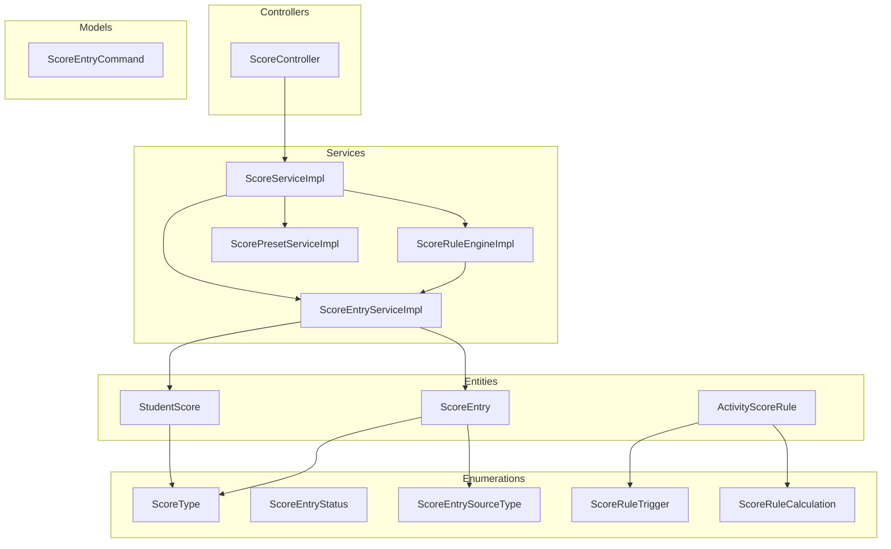
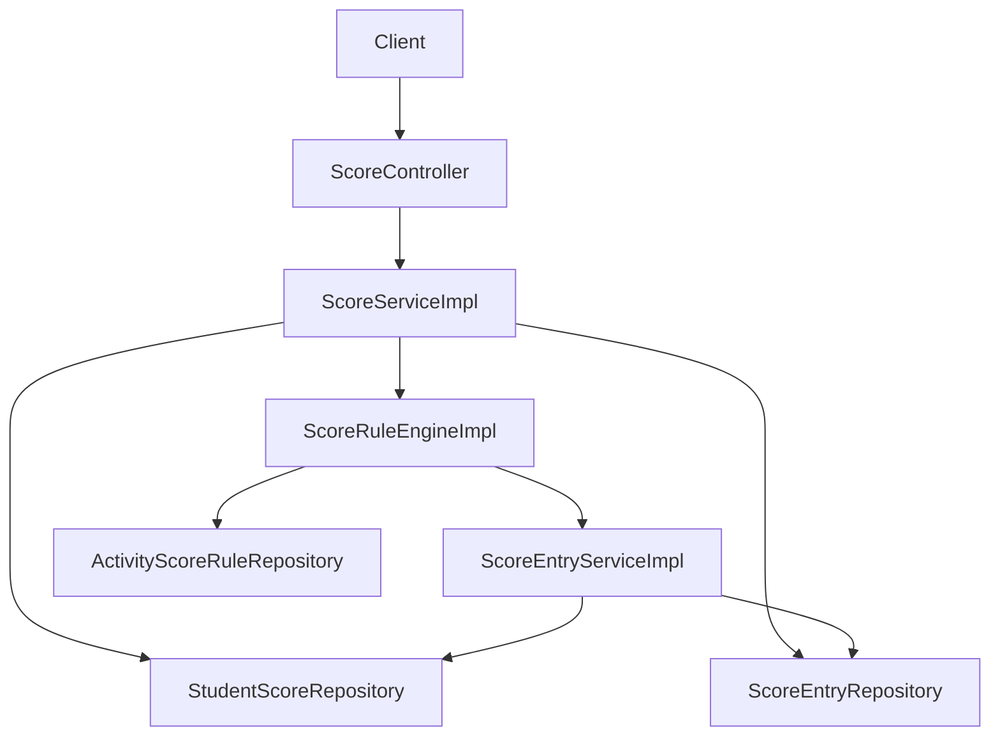
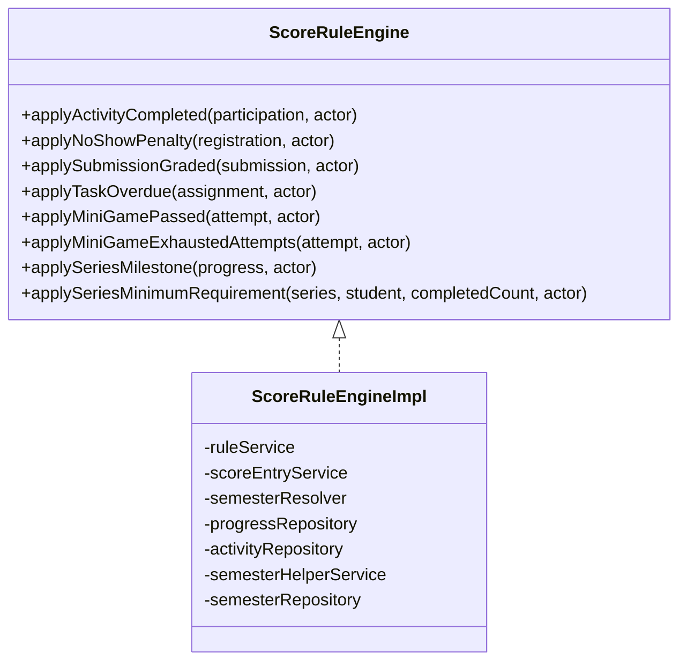
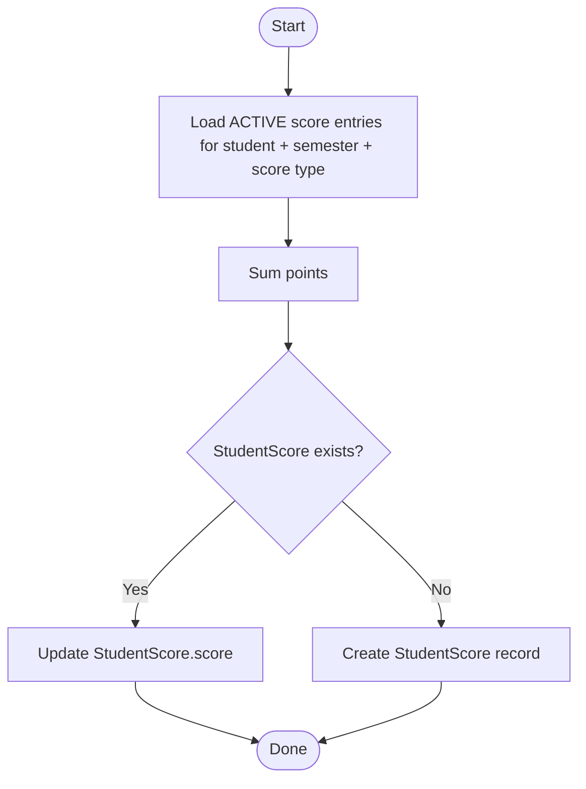
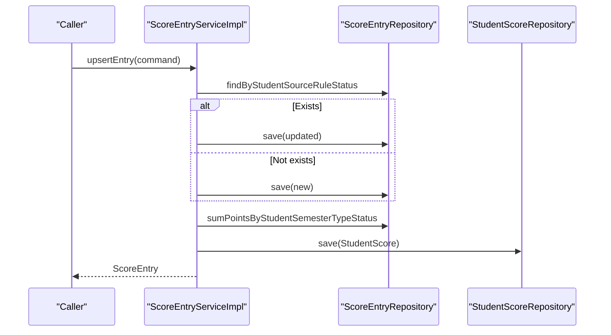
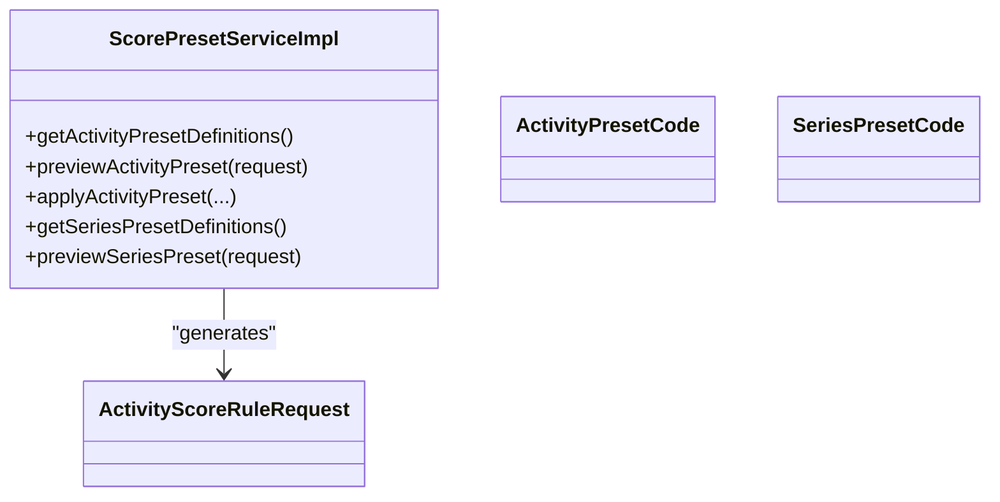
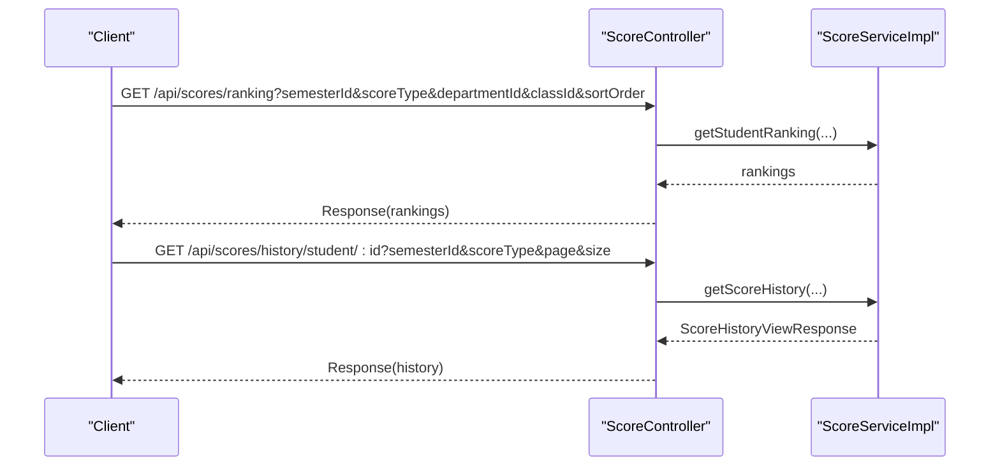
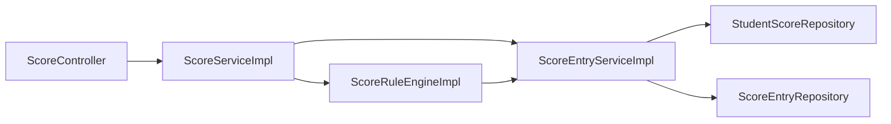

# Scoring & Point System

<cite>
**Referenced Files in This Document**
- [StudentScore.java](file://src/main/java/vn/campuslife/entity/StudentScore.java)
- [ScoreEntry.java](file://src/main/java/vn/campuslife/entity/ScoreEntry.java)
- [ActivityScoreRule.java](file://src/main/java/vn/campuslife/entity/ActivityScoreRule.java)
- [ScoreType.java](file://src/main/java/vn/campuslife/enumeration/ScoreType.java)
- [ScoreEntryStatus.java](file://src/main/java/vn/campuslife/enumeration/ScoreEntryStatus.java)
- [ScoreEntrySourceType.java](file://src/main/java/vn/campuslife/enumeration/ScoreEntrySourceType.java)
- [ScoreRuleTrigger.java](file://src/main/java/vn/campuslife/enumeration/ScoreRuleTrigger.java)
- [ScoreRuleCalculation.java](file://src/main/java/vn/campuslife/enumeration/ScoreRuleCalculation.java)
- [ScoreController.java](file://src/main/java/vn/campuslife/controller/score/ScoreController.java)
- [ScoreService.java](file://src/main/java/vn/campuslife/service/ScoreService.java)
- [ScoreServiceImpl.java](file://src/main/java/vn/campuslife/service/impl/ScoreServiceImpl.java)
- [ScoreRuleEngine.java](file://src/main/java/vn/campuslife/service/ScoreRuleEngine.java)
- [ScoreRuleEngineImpl.java](file://src/main/java/vn/campuslife/service/impl/ScoreRuleEngineImpl.java)
- [ScoreEntryService.java](file://src/main/java/vn/campuslife/service/ScoreEntryService.java)
- [ScoreEntryServiceImpl.java](file://src/main/java/vn/campuslife/service/impl/ScoreEntryServiceImpl.java)
- [ScorePresetService.java](file://src/main/java/vn/campuslife/service/ScorePresetService.java)
- [ScorePresetServiceImpl.java](file://src/main/java/vn/campuslife/service/impl/ScorePresetServiceImpl.java)
- [ScoreEntryCommand.java](file://src/main/java/vn/campuslife/model/score/ScoreEntryCommand.java)
</cite>

## Table of Contents
1. [Introduction](#introduction)
2. [Project Structure](#project-structure)
3. [Core Components](#core-components)
4. [Architecture Overview](#architecture-overview)
5. [Detailed Component Analysis](#detailed-component-analysis)
6. [Dependency Analysis](#dependency-analysis)
7. [Performance Considerations](#performance-considerations)
8. [Troubleshooting Guide](#troubleshooting-guide)
9. [Conclusion](#conclusion)
10. [Appendices](#appendices)

## Introduction
This document explains the Scoring & Point System that automates point calculation, enforces scoring rules, manages score entries, and supports grade management. It covers:
- Automated point calculation via a rule engine
- Scoring rules and triggers
- Score entry lifecycle and management
- Score types (REN_LUYEN, CONG_TAC_XA_HOI, CHUYEN_DE)
- Score presets for activities and series
- Manual review and adjustment workflows
- Score statistics, ranking, and grade submission workflows
- Practical examples, conflict resolution, and score adjustments

## Project Structure
The scoring system spans entities, enumerations, controllers, services, and models:
- Entities define persisted structures for student scores, score entries, and activity score rules
- Enumerations define types, statuses, and rule attributes
- Controllers expose REST endpoints for viewing scores, rankings, histories, and recalculations
- Services implement business logic for scoring, rule application, and preset generation
- Models carry command and response data for scoring operations

**Diagram sources**
- [StudentScore.java:1-50](file://src/main/java/vn/campuslife/entity/StudentScore.java#L1-L50)
- [ScoreEntry.java:1-79](file://src/main/java/vn/campuslife/entity/ScoreEntry.java#L1-L79)
- [ActivityScoreRule.java:1-88](file://src/main/java/vn/campuslife/entity/ActivityScoreRule.java#L1-L88)
- [ScoreType.java:1-7](file://src/main/java/vn/campuslife/enumeration/ScoreType.java#L1-L7)
- [ScoreEntryStatus.java:1-7](file://src/main/java/vn/campuslife/enumeration/ScoreEntryStatus.java#L1-L7)
- [ScoreEntrySourceType.java:1-14](file://src/main/java/vn/campuslife/enumeration/ScoreEntrySourceType.java#L1-L14)
- [ScoreRuleTrigger.java:1-12](file://src/main/java/vn/campuslife/enumeration/ScoreRuleTrigger.java#L1-L12)
- [ScoreRuleCalculation.java:1-10](file://src/main/java/vn/campuslife/enumeration/ScoreRuleCalculation.java#L1-L10)
- [ScoreController.java:1-234](file://src/main/java/vn/campuslife/controller/score/ScoreController.java#L1-L234)
- [ScoreServiceImpl.java:1-649](file://src/main/java/vn/campuslife/service/impl/ScoreServiceImpl.java#L1-L649)
- [ScoreRuleEngineImpl.java:1-491](file://src/main/java/vn/campuslife/service/impl/ScoreRuleEngineImpl.java#L1-L491)
- [ScoreEntryServiceImpl.java:1-111](file://src/main/java/vn/campuslife/service/impl/ScoreEntryServiceImpl.java#L1-L111)
- [ScorePresetServiceImpl.java:1-546](file://src/main/java/vn/campuslife/service/impl/ScorePresetServiceImpl.java#L1-L546)
- [ScoreEntryCommand.java:1-25](file://src/main/java/vn/campuslife/model/score/ScoreEntryCommand.java#L1-L25)

**Section sources**
- [ScoreController.java:1-234](file://src/main/java/vn/campuslife/controller/score/ScoreController.java#L1-L234)
- [ScoreServiceImpl.java:1-649](file://src/main/java/vn/campuslife/service/impl/ScoreServiceImpl.java#L1-L649)
- [ScoreRuleEngineImpl.java:1-491](file://src/main/java/vn/campuslife/service/impl/ScoreRuleEngineImpl.java#L1-L491)
- [ScoreEntryServiceImpl.java:1-111](file://src/main/java/vn/campuslife/service/impl/ScoreEntryServiceImpl.java#L1-L111)
- [ScorePresetServiceImpl.java:1-546](file://src/main/java/vn/campuslife/service/impl/ScorePresetServiceImpl.java#L1-L546)

## Core Components
- Entities
  - StudentScore: Aggregated score per student per semester per score type
  - ScoreEntry: Individual scored points with source, reason, and status
  - ActivityScoreRule: Rule definition for automatic scoring
- Enumerations
  - ScoreType: REN_LUYEN, CONG_TAC_XA_HOI, CHUYEN_DE
  - ScoreEntryStatus: ACTIVE, REVERSED
  - ScoreEntrySourceType: Activity participation, registration, task submission/assignment, minigame attempts, series progress/minimum requirement, manual adjustments, recalculation
  - ScoreRuleTrigger: Participation completed, no-show, submission graded, minigame passed/exhausted attempts, series milestone reached, task overdue
  - ScoreRuleCalculation: Fixed points, count completion, pass/fail points, penalty points, series milestone
- Controllers
  - ScoreController: View scores, total score, rankings, recalculate scores (single/all), score history, async recalculation jobs
- Services
  - ScoreService/ScoreServiceImpl: Aggregates scores, computes totals, generates rankings, recalculations, and score histories
  - ScoreRuleEngine/ScoreRuleEngineImpl: Applies rules triggered by events (participation, no-show, submissions, tasks, minigames, series)
  - ScoreEntryService/ScoreEntryServiceImpl: Upserts score entries, reverses entries, refreshes student scores
  - ScorePresetService/ScorePresetServiceImpl: Provides preset configurations for activities and series to auto-generate rules

**Section sources**
- [StudentScore.java:1-50](file://src/main/java/vn/campuslife/entity/StudentScore.java#L1-L50)
- [ScoreEntry.java:1-79](file://src/main/java/vn/campuslife/entity/ScoreEntry.java#L1-L79)
- [ActivityScoreRule.java:1-88](file://src/main/java/vn/campuslife/entity/ActivityScoreRule.java#L1-L88)
- [ScoreType.java:1-7](file://src/main/java/vn/campuslife/enumeration/ScoreType.java#L1-L7)
- [ScoreEntryStatus.java:1-7](file://src/main/java/vn/campuslife/enumeration/ScoreEntryStatus.java#L1-L7)
- [ScoreEntrySourceType.java:1-14](file://src/main/java/vn/campuslife/enumeration/ScoreEntrySourceType.java#L1-L14)
- [ScoreRuleTrigger.java:1-12](file://src/main/java/vn/campuslife/enumeration/ScoreRuleTrigger.java#L1-L12)
- [ScoreRuleCalculation.java:1-10](file://src/main/java/vn/campuslife/enumeration/ScoreRuleCalculation.java#L1-L10)
- [ScoreController.java:1-234](file://src/main/java/vn/campuslife/controller/score/ScoreController.java#L1-L234)
- [ScoreService.java:1-63](file://src/main/java/vn/campuslife/service/ScoreService.java#L1-L63)
- [ScoreServiceImpl.java:1-649](file://src/main/java/vn/campuslife/service/impl/ScoreServiceImpl.java#L1-L649)
- [ScoreRuleEngine.java:1-22](file://src/main/java/vn/campuslife/service/ScoreRuleEngine.java#L1-L22)
- [ScoreRuleEngineImpl.java:1-491](file://src/main/java/vn/campuslife/service/impl/ScoreRuleEngineImpl.java#L1-L491)
- [ScoreEntryService.java:1-14](file://src/main/java/vn/campuslife/service/ScoreEntryService.java#L1-L14)
- [ScoreEntryServiceImpl.java:1-111](file://src/main/java/vn/campuslife/service/impl/ScoreEntryServiceImpl.java#L1-L111)
- [ScorePresetService.java:1-30](file://src/main/java/vn/campuslife/service/ScorePresetService.java#L1-L30)
- [ScorePresetServiceImpl.java:1-546](file://src/main/java/vn/campuslife/service/impl/ScorePresetServiceImpl.java#L1-L546)
- [ScoreEntryCommand.java:1-25](file://src/main/java/vn/campuslife/model/score/ScoreEntryCommand.java#L1-L25)

## Architecture Overview
The system separates concerns across controllers, services, and repositories:
- Controllers orchestrate requests and responses
- Services encapsulate business logic for scoring, rule application, and preset generation
- Repositories persist and query entities
- Rule engine applies scoring rules based on triggers
- Score entries are aggregated into StudentScore totals

**Diagram sources**
- [ScoreController.java:1-234](file://src/main/java/vn/campuslife/controller/score/ScoreController.java#L1-L234)
- [ScoreServiceImpl.java:1-649](file://src/main/java/vn/campuslife/service/impl/ScoreServiceImpl.java#L1-L649)
- [ScoreRuleEngineImpl.java:1-491](file://src/main/java/vn/campuslife/service/impl/ScoreRuleEngineImpl.java#L1-L491)
- [ScoreEntryServiceImpl.java:1-111](file://src/main/java/vn/campuslife/service/impl/ScoreEntryServiceImpl.java#L1-L111)

## Detailed Component Analysis

### Scoring Rule Engine Implementation
The rule engine evaluates triggers and applies rules to create or adjust score entries. It resolves semesters for entries and enforces sign conventions for success vs failure points.

Key behaviors:
- Participation completed: grants points based on rule and completion status
- No-show penalty: subtracts points for non-attendance when configured
- Submission graded: grants or subtracts points depending on grading outcome
- Task overdue: subtracts points for late submissions
- Minigame passed/exhausted attempts: grants or penalizes based on attempt outcomes
- Series milestone: grants cumulative milestone points and updates progress
- Series minimum requirement: penalizes if threshold not met

**Diagram sources**
- [ScoreRuleEngine.java:1-22](file://src/main/java/vn/campuslife/service/ScoreRuleEngine.java#L1-L22)
- [ScoreRuleEngineImpl.java:1-491](file://src/main/java/vn/campuslife/service/impl/ScoreRuleEngineImpl.java#L1-L491)

**Section sources**
- [ScoreRuleEngineImpl.java:56-425](file://src/main/java/vn/campuslife/service/impl/ScoreRuleEngineImpl.java#L56-L425)

### Point Calculation Algorithms
- Score entry aggregation: sum of ACTIVE entries per student, semester, and score type
- Ranking computation: sorts by score per type or total across types; handles ties with equal rank
- Recalculation: iterates over score types and refreshes totals for a student or all students

**Diagram sources**
- [ScoreEntryServiceImpl.java:89-109](file://src/main/java/vn/campuslife/service/impl/ScoreEntryServiceImpl.java#L89-L109)

**Section sources**
- [ScoreEntryServiceImpl.java:89-109](file://src/main/java/vn/campuslife/service/impl/ScoreEntryServiceImpl.java#L89-L109)
- [ScoreServiceImpl.java:142-300](file://src/main/java/vn/campuslife/service/impl/ScoreServiceImpl.java#L142-L300)

### Score Entry Management
- Upsert entry: deduplicates by student, source type/id, rule, and status; updates if points change; triggers refresh
- Reverse entries: marks entries as REVERSED and refreshes totals
- Refresh student score: recomputes totals and persists StudentScore

**Diagram sources**
- [ScoreEntryServiceImpl.java:36-74](file://src/main/java/vn/campuslife/service/impl/ScoreEntryServiceImpl.java#L36-L74)
- [ScoreEntryServiceImpl.java:89-109](file://src/main/java/vn/campuslife/service/impl/ScoreEntryServiceImpl.java#L89-L109)

**Section sources**
- [ScoreEntryServiceImpl.java:36-87](file://src/main/java/vn/campuslife/service/impl/ScoreEntryServiceImpl.java#L36-L87)

### Score Types and Presets
- Score types: REN_LUYEN, CONG_TAC_XA_HOI, CHUYEN_DE
- Activity presets configure default rules for common scenarios:
  - Basic event, event with submission, enterprise seminar, enterprise seminar with bonus, minigame pass-only, custom
- Series presets configure milestone points and minimum requirements

**Diagram sources**
- [ScorePresetServiceImpl.java:35-96](file://src/main/java/vn/campuslife/service/impl/ScorePresetServiceImpl.java#L35-L96)
- [ScorePresetServiceImpl.java:205-227](file://src/main/java/vn/campuslife/service/impl/ScorePresetServiceImpl.java#L205-L227)

**Section sources**
- [ScorePresetServiceImpl.java:35-96](file://src/main/java/vn/campuslife/service/impl/ScorePresetServiceImpl.java#L35-L96)
- [ScorePresetServiceImpl.java:205-227](file://src/main/java/vn/campuslife/service/impl/ScorePresetServiceImpl.java#L205-L227)

### Score Statistics, Ranking, and Grade Submission Workflows
- Rankings: filtered by semester, score type, department/class; supports ascending/descending order; handles tied ranks
- Score history: paginated view combining score entries and activity participations; computes running totals
- Grade submission: submission grading triggers rule evaluation and score entry creation/updating

**Diagram sources**
- [ScoreController.java:48-173](file://src/main/java/vn/campuslife/controller/score/ScoreController.java#L48-L173)
- [ScoreServiceImpl.java:142-300](file://src/main/java/vn/campuslife/service/impl/ScoreServiceImpl.java#L142-L300)
- [ScoreServiceImpl.java:434-646](file://src/main/java/vn/campuslife/service/impl/ScoreServiceImpl.java#L434-L646)

**Section sources**
- [ScoreController.java:48-173](file://src/main/java/vn/campuslife/controller/score/ScoreController.java#L48-L173)
- [ScoreServiceImpl.java:142-300](file://src/main/java/vn/campuslife/service/impl/ScoreServiceImpl.java#L142-L300)
- [ScoreServiceImpl.java:434-646](file://src/main/java/vn/campuslife/service/impl/ScoreServiceImpl.java#L434-L646)

## Dependency Analysis
- Controllers depend on ScoreService
- ScoreServiceImpl depends on repositories and ScoreEntryService
- ScoreRuleEngineImpl depends on ScoreEntryService, rule service, and semester resolvers
- ScoreEntryServiceImpl depends on repositories and updates StudentScore totals

**Diagram sources**
- [ScoreController.java:1-234](file://src/main/java/vn/campuslife/controller/score/ScoreController.java#L1-L234)
- [ScoreServiceImpl.java:1-649](file://src/main/java/vn/campuslife/service/impl/ScoreServiceImpl.java#L1-L649)
- [ScoreRuleEngineImpl.java:1-491](file://src/main/java/vn/campuslife/service/impl/ScoreRuleEngineImpl.java#L1-L491)
- [ScoreEntryServiceImpl.java:1-111](file://src/main/java/vn/campuslife/service/impl/ScoreEntryServiceImpl.java#L1-L111)

**Section sources**
- [ScoreServiceImpl.java:60-70](file://src/main/java/vn/campuslife/service/impl/ScoreServiceImpl.java#L60-L70)
- [ScoreRuleEngineImpl.java:47-54](file://src/main/java/vn/campuslife/service/impl/ScoreRuleEngineImpl.java#L47-L54)
- [ScoreEntryServiceImpl.java:29-34](file://src/main/java/vn/campuslife/service/impl/ScoreEntryServiceImpl.java#L29-L34)

## Performance Considerations
- Pagination and batch loading: Score history uses pagination and preloads related series/progress to avoid N+1 queries
- Running totals: computed incrementally while iterating pages to minimize extra scans
- Aggregation refresh: StudentScore totals are recalculated after each score entry change
- Async recalculation: endpoints support asynchronous job initiation for large-scale recalculations

[No sources needed since this section provides general guidance]

## Troubleshooting Guide
Common issues and resolutions:
- Invalid scoreType parameter: Controller validates and returns bad request with message
- Student not found: Score history enforces access control and returns error if requesting student differs from target
- No semester found: Recalculation logic selects current open semester if none provided
- Duplicate score entries: Upsert deduplicates by student/source/rule/status and updates only on value changes
- Reversing entries: Marks ACTIVE entries as REVERSED and refreshes totals
- Rule conflicts: Preset application rejects custom rules alongside predefined presets; choose CUSTOM preset for manual rules

**Section sources**
- [ScoreController.java:56-71](file://src/main/java/vn/campuslife/controller/score/ScoreController.java#L56-L71)
- [ScoreServiceImpl.java:439-449](file://src/main/java/vn/campuslife/service/impl/ScoreServiceImpl.java#L439-L449)
- [ScoreServiceImpl.java:330-345](file://src/main/java/vn/campuslife/service/impl/ScoreServiceImpl.java#L330-L345)
- [ScoreEntryServiceImpl.java:39-51](file://src/main/java/vn/campuslife/service/impl/ScoreEntryServiceImpl.java#L39-L51)
- [ScorePresetServiceImpl.java:125-130](file://src/main/java/vn/campuslife/service/impl/ScorePresetServiceImpl.java#L125-L130)

## Conclusion
The Scoring & Point System provides a robust, extensible framework for automated point calculation and grade management. It leverages a rule engine to apply scoring policies consistently, maintains transparent score entries with rich provenance, and offers powerful tools for ranking, history, and bulk recalculations. Presets streamline common configurations, while manual review and adjustment capabilities ensure flexibility for special cases.

[No sources needed since this section summarizes without analyzing specific files]

## Appendices

### Practical Examples

- Example: Activity participation scoring
  - Trigger: PARTICIPATION_COMPLETED
  - Calculation: FIXED_POINTS or COUNT_COMPLETION
  - Outcome: ScoreEntry created under ACTIVITY_PARTICIPATION source

- Example: Submission grading
  - Trigger: SUBMISSION_GRADED
  - Outcome: ScoreEntry created with points based on pass/fail and rule configuration

- Example: Series milestone
  - Trigger: SERIES_MILESTONE_REACHED
  - Outcome: ScoreEntry created reflecting highest applicable milestone; progress updated

- Example: Manual adjustment
  - Source type: MANUAL_ADJUSTMENT
  - Outcome: ScoreEntry created with reason and actor tracked

- Example: Score preset application
  - Activity preset: EVENT_WITH_SUBMISSION
  - Outcome: Generates rule set for submission grading and optional overdue penalty

**Section sources**
- [ScoreRuleEngineImpl.java:56-94](file://src/main/java/vn/campuslife/service/impl/ScoreRuleEngineImpl.java#L56-L94)
- [ScoreRuleEngineImpl.java:234-276](file://src/main/java/vn/campuslife/service/impl/ScoreRuleEngineImpl.java#L234-L276)
- [ScoreRuleEngineImpl.java:318-385](file://src/main/java/vn/campuslife/service/impl/ScoreRuleEngineImpl.java#L318-L385)
- [ScoreEntrySourceType.java:1-14](file://src/main/java/vn/campuslife/enumeration/ScoreEntrySourceType.java#L1-L14)
- [ScorePresetServiceImpl.java:119-144](file://src/main/java/vn/campuslife/service/impl/ScorePresetServiceImpl.java#L119-L144)

### Rule Configuration Notes
- Triggers and calculations map to scoring semantics:
  - FIXED_POINTS: constant award
  - COUNT_COMPLETION: cumulative by number of completions
  - PASS_FAIL_POINTS: award on pass, penalty on fail
  - PENALTY_POINTS: penalty regardless of outcome
  - SERIES_MILESTONE: milestone-based accumulation
- Audience targeting: ALL_PARTICIPANTS, DEPARTMENT_ONLY, OUTSIDE_DEPARTMENTS_ONLY
- Semester policy: rules can be bound to activity semester or explicit target

**Section sources**
- [ScoreRuleCalculation.java:1-10](file://src/main/java/vn/campuslife/enumeration/ScoreRuleCalculation.java#L1-L10)
- [ScoreRuleTrigger.java:1-12](file://src/main/java/vn/campuslife/enumeration/ScoreRuleTrigger.java#L1-L12)
- [ActivityScoreRule.java:56-62](file://src/main/java/vn/campuslife/entity/ActivityScoreRule.java#L56-L62)