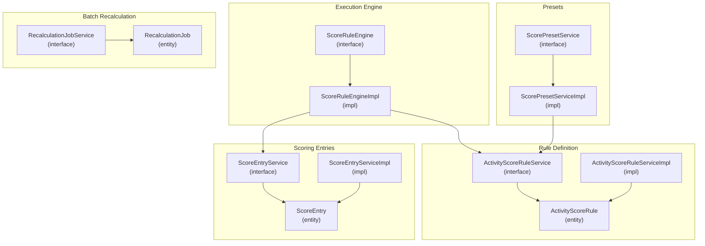
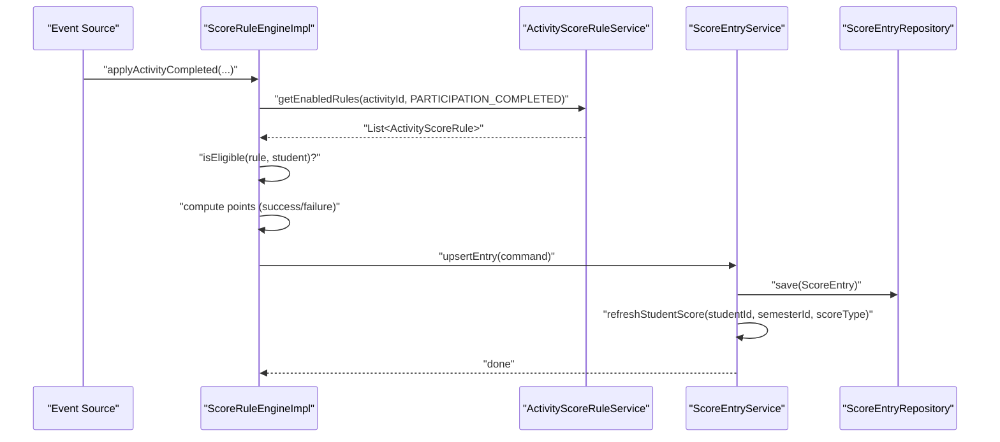
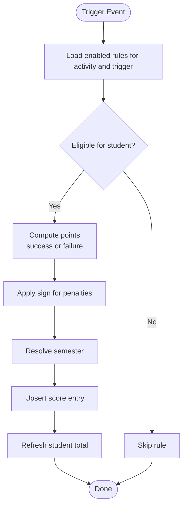
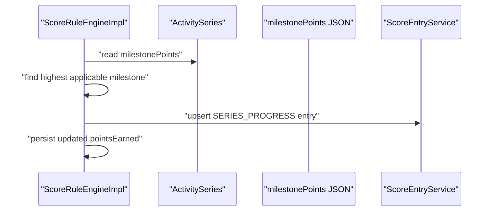
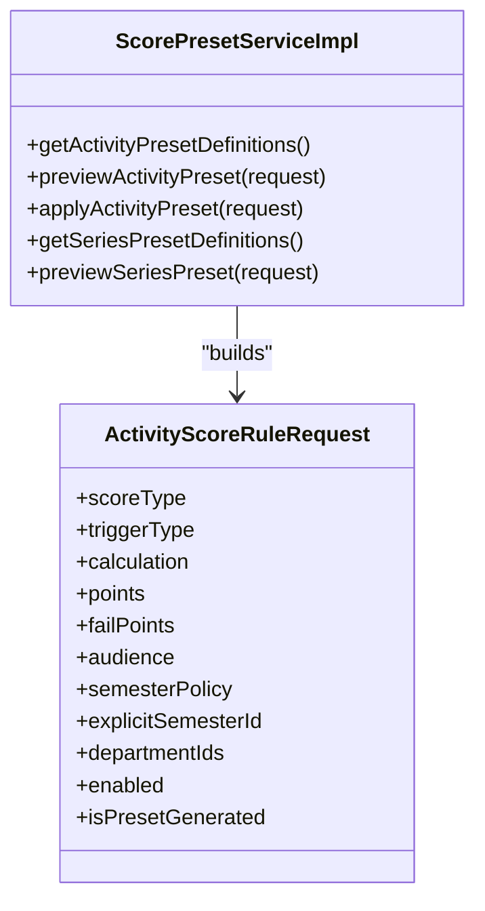
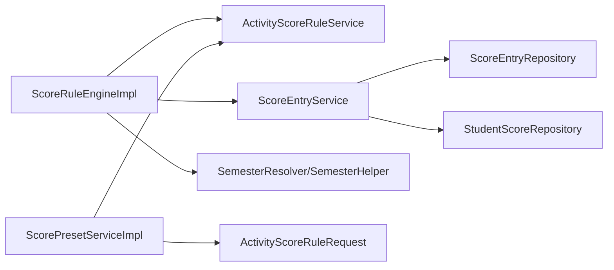

# Scoring Rule Engine

<cite>
**Referenced Files in This Document**
- [ScoreRuleEngine.java](file://src/main/java/vn/campuslife/service/ScoreRuleEngine.java)
- [ScoreRuleEngineImpl.java](file://src/main/java/vn/campuslife/service/impl/ScoreRuleEngineImpl.java)
- [ActivityScoreRule.java](file://src/main/java/vn/campuslife/entity/ActivityScoreRule.java)
- [ScoreEntry.java](file://src/main/java/vn/campuslife/entity/ScoreEntry.java)
- [ScoreEntryService.java](file://src/main/java/vn/campuslife/service/ScoreEntryService.java)
- [ScoreEntryServiceImpl.java](file://src/main/java/vn/campuslife/service/impl/ScoreEntryServiceImpl.java)
- [ScorePresetService.java](file://src/main/java/vn/campuslife/service/ScorePresetService.java)
- [ScorePresetServiceImpl.java](file://src/main/java/vn/campuslife/service/impl/ScorePresetServiceImpl.java)
- [ActivityScoreRuleService.java](file://src/main/java/vn/campuslife/service/ActivityScoreRuleService.java)
- [ActivityScoreRuleServiceImpl.java](file://src/main/java/vn/campuslife/service/impl/ActivityScoreRuleServiceImpl.java)
- [ScoreRuleTrigger.java](file://src/main/java/vn/campuslife/enumeration/ScoreRuleTrigger.java)
- [ScoreRuleCalculation.java](file://src/main/java/vn/campuslife/enumeration/ScoreRuleCalculation.java)
- [ScoreType.java](file://src/main/java/vn/campuslife/enumeration/ScoreType.java)
- [ScoreEntrySourceType.java](file://src/main/java/vn/campuslife/enumeration/ScoreEntrySourceType.java)
- [RecalculationJobService.java](file://src/main/java/vn/campuslife/service/RecalculationJobService.java)
- [RecalculationJob.java](file://src/main/java/vn/campuslife/entity/RecalculationJob.java)
- [ActivityScoreRuleRequest.java](file://src/main/java/vn/campuslife/model/score/ActivityScoreRuleRequest.java)
- [FE_BACKEND_HANDOFF_SPEC.md](file://docs/refactor/FE_BACKEND_HANDOFF_SPEC.md)
- [BACKEND_CONTRACT_AUDIT_REPORT.md](file://docs/refactor/BACKEND_CONTRACT_AUDIT_REPORT.md)
</cite>

## Table of Contents
1. [Introduction](#introduction)
2. [Project Structure](#project-structure)
3. [Core Components](#core-components)
4. [Architecture Overview](#architecture-overview)
5. [Detailed Component Analysis](#detailed-component-analysis)
6. [Dependency Analysis](#dependency-analysis)
7. [Performance Considerations](#performance-considerations)
8. [Troubleshooting Guide](#troubleshooting-guide)
9. [Conclusion](#conclusion)
10. [Appendices](#appendices)

## Introduction
This document describes the scoring rule engine that powers automated point calculation for student activities. It explains how rule configuration works, how scoring algorithms execute upon triggers, and how real-time and batch updates are handled. It also covers supported score types, preset configurations, custom rule creation, conflict resolution, and performance optimization strategies.

## Project Structure
The scoring subsystem centers around:
- Rule definition and persistence: ActivityScoreRule entity and related service/repository
- Execution engine: ScoreRuleEngine interface and its implementation
- Score entries and aggregation: ScoreEntry entity and ScoreEntryService
- Preset builders: ScorePresetService/Impl for generating standardized rule sets
- Batch recalculation: Async job infrastructure for bulk score recomputation

**Diagram sources**
- [ActivityScoreRule.java:22-87](file://src/main/java/vn/campuslife/entity/ActivityScoreRule.java#L22-L87)
- [ActivityScoreRuleService.java:9-13](file://src/main/java/vn/campuslife/service/ActivityScoreRuleService.java#L9-L13)
- [ActivityScoreRuleServiceImpl.java:134-139](file://src/main/java/vn/campuslife/service/impl/ActivityScoreRuleServiceImpl.java#L134-L139)
- [ScoreRuleEngine.java:5-21](file://src/main/java/vn/campuslife/service/ScoreRuleEngine.java#L5-L21)
- [ScoreRuleEngineImpl.java:42-45](file://src/main/java/vn/campuslife/service/impl/ScoreRuleEngineImpl.java#L42-L45)
- [ScoreEntry.java:18-78](file://src/main/java/vn/campuslife/entity/ScoreEntry.java#L18-L78)
- [ScoreEntryService.java:9-12](file://src/main/java/vn/campuslife/service/ScoreEntryService.java#L9-L12)
- [ScoreEntryServiceImpl.java:89-109](file://src/main/java/vn/campuslife/service/impl/ScoreEntryServiceImpl.java#L89-L109)
- [ScorePresetService.java:1](file://src/main/java/vn/campuslife/service/ScorePresetService.java#L1-L1)
- [ScorePresetServiceImpl.java:32-96](file://src/main/java/vn/campuslife/service/impl/ScorePresetServiceImpl.java#L32-L96)
- [RecalculationJobService.java:5-10](file://src/main/java/vn/campuslife/service/RecalculationJobService.java#L5-L10)
- [RecalculationJob.java:10-58](file://src/main/java/vn/campuslife/entity/RecalculationJob.java#L10-L58)

**Section sources**
- [ScoreRuleEngine.java:5-21](file://src/main/java/vn/campuslife/service/ScoreRuleEngine.java#L5-L21)
- [ScoreRuleEngineImpl.java:42-45](file://src/main/java/vn/campuslife/service/impl/ScoreRuleEngineImpl.java#L42-L45)
- [ActivityScoreRule.java:22-87](file://src/main/java/vn/campuslife/entity/ActivityScoreRule.java#L22-L87)
- [ScoreEntry.java:18-78](file://src/main/java/vn/campuslife/entity/ScoreEntry.java#L18-L78)
- [ScorePresetServiceImpl.java:32-96](file://src/main/java/vn/campuslife/service/impl/ScorePresetServiceImpl.java#L32-L96)
- [RecalculationJobService.java:5-10](file://src/main/java/vn/campuslife/service/RecalculationJobService.java#L5-L10)

## Core Components
- ScoreRuleEngine: Defines scoring triggers and applies rules for activity participation, submissions, mini-games, overdue tasks, series milestones, and minimum requirements.
- ScoreRuleEngineImpl: Implements trigger handlers, eligibility checks, sign application for penalties, and entry creation via ScoreEntryService.
- ActivityScoreRule: Stores per-activity scoring rules with trigger, calculation method, score type, and audience targeting.
- ScoreEntry: Persisted record of scored points with source metadata and reason.
- ScorePresetService/Impl: Generates preset rule sets for common activity types and series configurations.
- ScoreEntryService/Impl: Upserts score entries and recalculates student totals per semester and score type.

**Section sources**
- [ScoreRuleEngine.java:5-21](file://src/main/java/vn/campuslife/service/ScoreRuleEngine.java#L5-L21)
- [ScoreRuleEngineImpl.java:56-94](file://src/main/java/vn/campuslife/service/impl/ScoreRuleEngineImpl.java#L56-L94)
- [ActivityScoreRule.java:28-78](file://src/main/java/vn/campuslife/entity/ActivityScoreRule.java#L28-L78)
- [ScoreEntry.java:24-78](file://src/main/java/vn/campuslife/entity/ScoreEntry.java#L24-L78)
- [ScorePresetServiceImpl.java:295-398](file://src/main/java/vn/campuslife/service/impl/ScorePresetServiceImpl.java#L295-L398)
- [ScoreEntryService.java:9-12](file://src/main/java/vn/campuslife/service/ScoreEntryService.java#L9-L12)
- [ScoreEntryServiceImpl.java:89-109](file://src/main/java/vn/campuslife/service/impl/ScoreEntryServiceImpl.java#L89-L109)

## Architecture Overview
The engine executes scoring deterministically based on triggers and rule conditions. It resolves applicable rules, validates eligibility, computes points with correct signs, and persists entries while refreshing student totals.

**Diagram sources**
- [ScoreRuleEngineImpl.java:56-94](file://src/main/java/vn/campuslife/service/impl/ScoreRuleEngineImpl.java#L56-L94)
- [ActivityScoreRuleService.java:9-12](file://src/main/java/vn/campuslife/service/ActivityScoreRuleService.java#L9-L12)
- [ScoreEntryService.java:9-12](file://src/main/java/vn/campuslife/service/ScoreEntryService.java#L9-L12)
- [ScoreEntryServiceImpl.java:89-109](file://src/main/java/vn/campuslife/service/impl/ScoreEntryServiceImpl.java#L89-L109)

## Detailed Component Analysis

### Score Types and Triggers
- Score types: REN_LUYEN, CONG_TAC_XA_HOI, CHUYEN_DE
- Triggers: PARTICIPATION_COMPLETED, NO_SHOW, SUBMISSION_GRADED, MINIGAME_PASSED, MINIGAME_EXHAUSTED_ATTEMPTS, SERIES_MILESTONE_REACHED, TASK_OVERDUE
- Calculation methods: FIXED_POINTS, COUNT_COMPLETION, PASS_FAIL_POINTS, PENALTY_POINTS, SERIES_MILESTONE

**Section sources**
- [ScoreType.java:3-7](file://src/main/java/vn/campuslife/enumeration/ScoreType.java#L3-L7)
- [ScoreRuleTrigger.java:3-11](file://src/main/java/vn/campuslife/enumeration/ScoreRuleTrigger.java#L3-L11)
- [ScoreRuleCalculation.java:3-9](file://src/main/java/vn/campuslife/enumeration/ScoreRuleCalculation.java#L3-L9)

### Rule Configuration Model
- ActivityScoreRuleRequest carries scoreType, triggerType, calculation, points, failPoints, audience, semester policy, department targeting, and flags.
- ActivityScoreRule persists these fields plus enabled flag, preset generation marker, and department targeting.

**Section sources**
- [ActivityScoreRuleRequest.java:14-26](file://src/main/java/vn/campuslife/model/score/ActivityScoreRuleRequest.java#L14-L26)
- [ActivityScoreRule.java:28-78](file://src/main/java/vn/campuslife/entity/ActivityScoreRule.java#L28-L78)

### Automated Point Calculation and Execution
- Eligibility: Rules can target all participants, department-only, or outside departments.
- Success vs failure points: For pass/fail or penalty scenarios, the engine applies sign correction based on calculation type.
- Series exclusions: Individual points for series child activities are skipped; series milestones and minimum requirements are handled separately.

**Diagram sources**
- [ScoreRuleEngineImpl.java:451-463](file://src/main/java/vn/campuslife/service/impl/ScoreRuleEngineImpl.java#L451-L463)
- [ScoreRuleEngineImpl.java:474-488](file://src/main/java/vn/campuslife/service/impl/ScoreRuleEngineImpl.java#L474-L488)
- [ScoreEntryService.java:9-12](file://src/main/java/vn/campuslife/service/ScoreEntryService.java#L9-L12)

**Section sources**
- [ScoreRuleEngineImpl.java:56-94](file://src/main/java/vn/campuslife/service/impl/ScoreRuleEngineImpl.java#L56-L94)
- [ScoreRuleEngineImpl.java:194-232](file://src/main/java/vn/campuslife/service/impl/ScoreRuleEngineImpl.java#L194-L232)
- [ScoreRuleEngineImpl.java:236-276](file://src/main/java/vn/campuslife/service/impl/ScoreRuleEngineImpl.java#L236-L276)
- [ScoreRuleEngineImpl.java:280-316](file://src/main/java/vn/campuslife/service/impl/ScoreRuleEngineImpl.java#L280-L316)
- [ScoreRuleEngineImpl.java:451-463](file://src/main/java/vn/campuslife/service/impl/ScoreRuleEngineImpl.java#L451-L463)
- [ScoreRuleEngineImpl.java:474-488](file://src/main/java/vn/campuslife/service/impl/ScoreRuleEngineImpl.java#L474-L488)

### Series Scoring: Milestones and Minimum Requirements
- Milestone calculation reads configured milestone thresholds and awards the highest applicable reward without decreasing previously earned points.
- Minimum requirement enforces a penalty if the student did not meet the required count; penalty is always negative regardless of rule calculation type.

**Diagram sources**
- [ScoreRuleEngineImpl.java:320-385](file://src/main/java/vn/campuslife/service/impl/ScoreRuleEngineImpl.java#L320-L385)

**Section sources**
- [ScoreRuleEngineImpl.java:320-385](file://src/main/java/vn/campuslife/service/impl/ScoreRuleEngineImpl.java#L320-L385)
- [ScoreRuleEngineImpl.java:387-425](file://src/main/java/vn/campuslife/service/impl/ScoreRuleEngineImpl.java#L387-L425)

### Preset Configurations
- Activity presets define default rules for common activity types (basic event, submission-required, enterprise seminar variants, minigame pass-only, custom).
- Series presets define default score types and milestone mappings for series.
- Preset validation rejects sending custom rules alongside non-CUSTOM presets.

**Diagram sources**
- [ScorePresetServiceImpl.java:32-96](file://src/main/java/vn/campuslife/service/impl/ScorePresetServiceImpl.java#L32-L96)
- [ActivityScoreRuleRequest.java:14-26](file://src/main/java/vn/campuslife/model/score/ActivityScoreRuleRequest.java#L14-L26)

**Section sources**
- [ScorePresetServiceImpl.java:295-398](file://src/main/java/vn/campuslife/service/impl/ScorePresetServiceImpl.java#L295-L398)
- [ScorePresetServiceImpl.java:452-483](file://src/main/java/vn/campuslife/service/impl/ScorePresetServiceImpl.java#L452-L483)

### Real-Time Updates and Score Aggregation
- Each scoring action creates or updates a ScoreEntry and immediately refreshes the student’s total for the resolved semester and score type.
- ScoreEntryService sums active entries to maintain StudentScore.

**Section sources**
- [ScoreEntryService.java:9-12](file://src/main/java/vn/campuslife/service/ScoreEntryService.java#L9-L12)
- [ScoreEntryServiceImpl.java:89-109](file://src/main/java/vn/campuslife/service/impl/ScoreEntryServiceImpl.java#L89-L109)

### Batch Processing and Async Recalculation
- Async recalculation jobs support bulk score recomputation with progress tracking, timeouts, and retries.
- Frontend integrates via polling job status endpoints.

**Section sources**
- [RecalculationJobService.java:5-10](file://src/main/java/vn/campuslife/service/RecalculationJobService.java#L5-L10)
- [RecalculationJob.java:10-58](file://src/main/java/vn/campuslife/entity/RecalculationJob.java#L10-L58)
- [FE_BACKEND_HANDOFF_SPEC.md:33-34](file://docs/refactor/FE_BACKEND_HANDOFF_SPEC.md#L33-L34)

## Dependency Analysis
Key dependencies and contracts:
- ScoreRuleEngineImpl depends on ActivityScoreRuleService for enabled rules, ScoreEntryService for persistence, and helpers for semester resolution.
- ScoreEntryService depends on repositories to sum and persist entries and to refresh totals.
- ScorePresetServiceImpl depends on ActivityScoreRuleService to mark preset-generated rules and to build rule lists.

**Diagram sources**
- [ScoreRuleEngineImpl.java:47-54](file://src/main/java/vn/campuslife/service/impl/ScoreRuleEngineImpl.java#L47-L54)
- [ScoreEntryServiceImpl.java:89-109](file://src/main/java/vn/campuslife/service/impl/ScoreEntryServiceImpl.java#L89-L109)
- [ScorePresetServiceImpl.java:118-144](file://src/main/java/vn/campuslife/service/impl/ScorePresetServiceImpl.java#L118-L144)

**Section sources**
- [ScoreRuleEngineImpl.java:47-54](file://src/main/java/vn/campuslife/service/impl/ScoreRuleEngineImpl.java#L47-L54)
- [ScoreEntryServiceImpl.java:89-109](file://src/main/java/vn/campuslife/service/impl/ScoreEntryServiceImpl.java#L89-L109)
- [ScorePresetServiceImpl.java:118-144](file://src/main/java/vn/campuslife/service/impl/ScorePresetServiceImpl.java#L118-L144)

## Performance Considerations
- Prefer enabling only necessary rules per activity to reduce transactional writes.
- Use series milestones judiciously; parsing JSON milestones is O(n) over configured keys.
- Avoid redundant recalculations by leveraging refreshStudentScore semantics after each upsert.
- For bulk operations, use async recalculation jobs to prevent blocking requests.
- Indexes on score_entries (student_id, semester_id, score_type, status) improve aggregation performance.

[No sources needed since this section provides general guidance]

## Troubleshooting Guide
Common issues and resolutions:
- Conflicting preset and custom rules: Preset application rejects sending custom rules with non-CUSTOM presets. Use CUSTOM preset for manual rules.
- Penalty sign confusion: For PENALTY_POINTS and PASS_FAIL_POINTS, failure points are negated automatically. Ensure frontend sends positive values for penalties.
- Series minimum requirement penalty: Always negative, regardless of rule calculation type.
- Series milestone decrease prevention: Engine skips lowering milestone points if computed threshold is less than stored value.
- No-show penalty placement: Enterprise seminars default to no-show penalties on different score types to avoid deducting from the main score type.

**Section sources**
- [ScorePresetServiceImpl.java:125-130](file://src/main/java/vn/campuslife/service/impl/ScorePresetServiceImpl.java#L125-L130)
- [ScoreRuleEngineImpl.java:474-488](file://src/main/java/vn/campuslife/service/impl/ScoreRuleEngineImpl.java#L474-L488)
- [ScoreRuleEngineImpl.java:408-410](file://src/main/java/vn/campuslife/service/impl/ScoreRuleEngineImpl.java#L408-L410)
- [ScoreRuleEngineImpl.java:356-360](file://src/main/java/vn/campuslife/service/impl/ScoreRuleEngineImpl.java#L356-L360)
- [BACKEND_CONTRACT_AUDIT_REPORT.md:973-973](file://docs/refactor/BACKEND_CONTRACT_AUDIT_REPORT.md#L973-L973)

## Conclusion
The scoring rule engine provides a flexible, extensible framework for automated point calculation. It supports preset-driven defaults, precise trigger-based execution, robust eligibility filtering, and both real-time and batch processing modes. Correct use of score types, triggers, and calculation semantics ensures accurate and maintainable scoring outcomes.

## Appendices

### Practical Examples

- Example: Basic event with no-show penalty
  - Trigger: PARTICIPATION_COMPLETED
  - Calculation: FIXED_POINTS
  - Score type: REN_LUYEN
  - Failure points: negative penalty applied automatically

- Example: Submission-required activity
  - Triggers: SUBMISSION_GRADED (pass/fail), TASK_OVERDUE (penalty)
  - Calculation: PASS_FAIL_POINTS or PENALTY_POINTS
  - Score type: CONG_TAC_XA_HOI

- Example: Enterprise seminar with bonus
  - Triggers: PARTICIPATION_COMPLETED (count-based and fixed bonus)
  - Score types: CHUYEN_DE (primary), REN_LUYEN (bonus)

- Example: Minigame pass-only
  - Trigger: MINIGAME_PASSED
  - Calculation: FIXED_POINTS
  - Optional: MINIGAME_EXHAUSTED_ATTEMPTS for penalty

- Example: Series milestone
  - Trigger: SERIES_MILESTONE_REACHED
  - Calculation: SERIES_MILESTONE
  - Milestone thresholds configured per series

- Example: Series minimum requirement
  - Trigger: SERIES_MINIMUM_REQUIREMENT
  - Penalty: always negative if requirement not met

**Section sources**
- [ScorePresetServiceImpl.java:309-398](file://src/main/java/vn/campuslife/service/impl/ScorePresetServiceImpl.java#L295-L398)
- [ScoreRuleEngineImpl.java:320-385](file://src/main/java/vn/campuslife/service/impl/ScoreRuleEngineImpl.java#L320-L385)
- [ScoreRuleEngineImpl.java:387-425](file://src/main/java/vn/campuslife/service/impl/ScoreRuleEngineImpl.java#L387-L425)

### Rule Engine Integration Notes
- Frontend should send positive numeric values for points and failPoints; backend applies sign corrections where appropriate.
- For series minimum requirement, frontend passes a positive integer; backend negates it before storing.
- Async recalculation endpoints enable scalable bulk updates with progress reporting.

**Section sources**
- [FE_BACKEND_HANDOFF_SPEC.md:33-34](file://docs/refactor/FE_BACKEND_HANDOFF_SPEC.md#L33-L34)
- [BACKEND_CONTRACT_AUDIT_REPORT.md:973-973](file://docs/refactor/BACKEND_CONTRACT_AUDIT_REPORT.md#L973-L973)