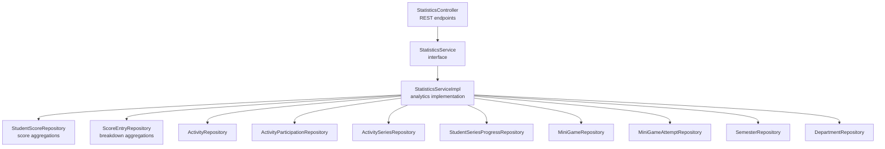
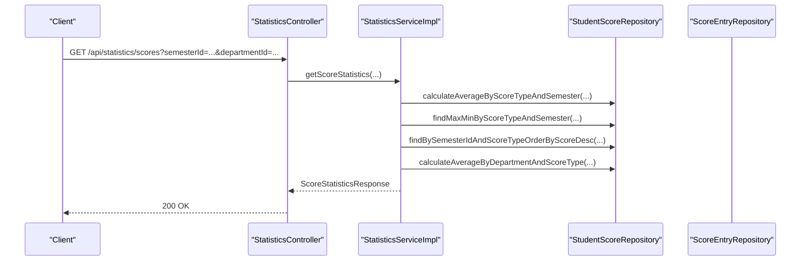
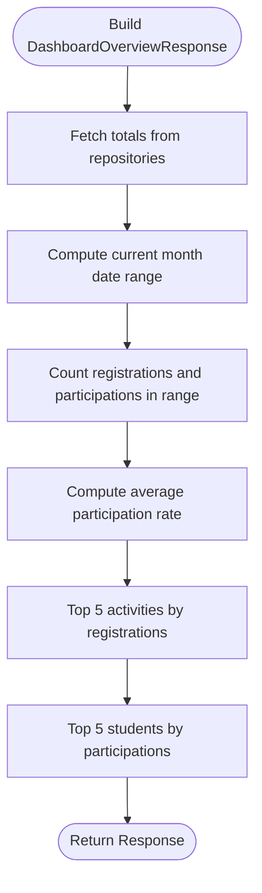
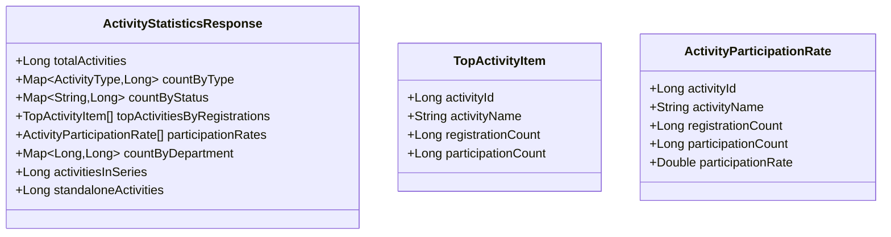
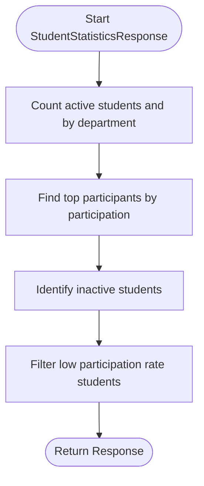
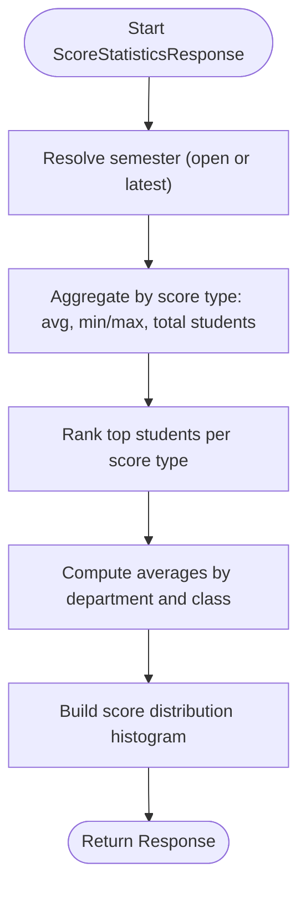
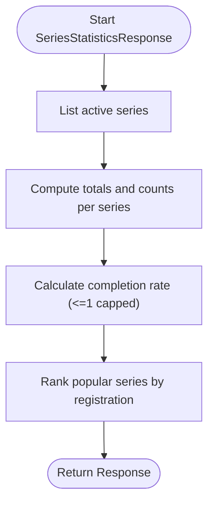
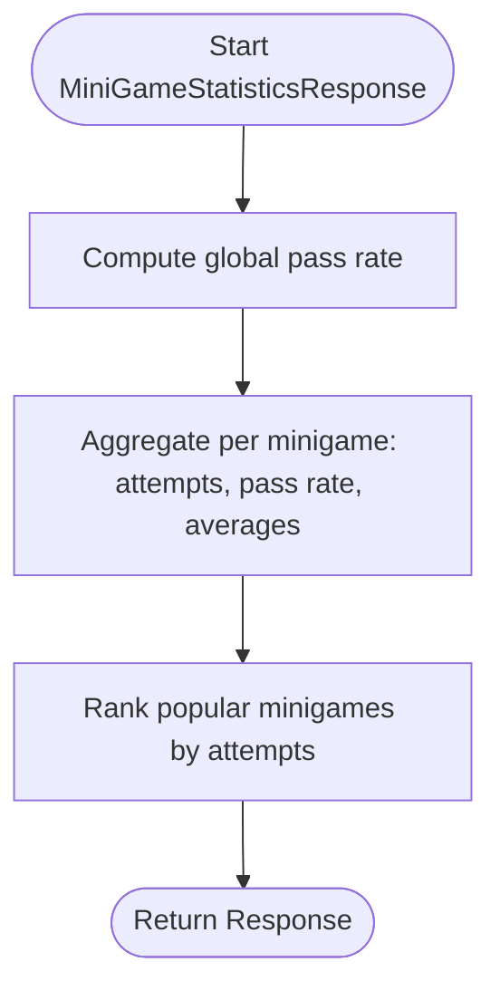
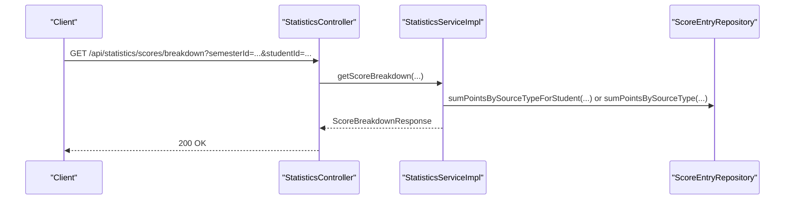
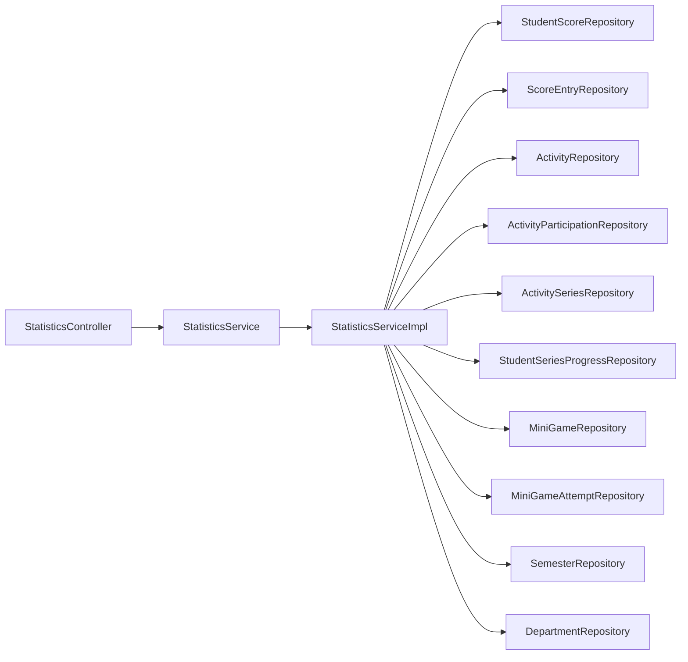

# Statistics & Analytics

<cite>
**Referenced Files in This Document**
- [StatisticsController.java](file://src/main/java/vn/campuslife/controller/score/StatisticsController.java)
- [StatisticsService.java](file://src/main/java/vn/campuslife/service/StatisticsService.java)
- [StatisticsServiceImpl.java](file://src/main/java/vn/campuslife/service/impl/StatisticsServiceImpl.java)
- [DashboardOverviewResponse.java](file://src/main/java/vn/campuslife/model/statistics/DashboardOverviewResponse.java)
- [ActivityStatisticsResponse.java](file://src/main/java/vn/campuslife/model/statistics/ActivityStatisticsResponse.java)
- [StudentStatisticsResponse.java](file://src/main/java/vn/campuslife/model/statistics/StudentStatisticsResponse.java)
- [ScoreStatisticsResponse.java](file://src/main/java/vn/campuslife/model/statistics/ScoreStatisticsResponse.java)
- [SeriesStatisticsResponse.java](file://src/main/java/vn/campuslife/model/statistics/SeriesStatisticsResponse.java)
- [MiniGameStatisticsResponse.java](file://src/main/java/vn/campuslife/model/statistics/MiniGameStatisticsResponse.java)
- [ScoreBreakdownResponse.java](file://src/main/java/vn/campuslife/model/score/ScoreBreakdownResponse.java)
- [StudentScoreRepository.java](file://src/main/java/vn/campuslife/repository/StudentScoreRepository.java)
- [ScoreEntryRepository.java](file://src/main/java/vn/campuslife/repository/ScoreEntryRepository.java)
- [ScoreType.java](file://src/main/java/vn/campuslife/enumeration/ScoreType.java)
- [ScoreEntrySourceType.java](file://src/main/java/vn/campuslife/enumeration/ScoreEntrySourceType.java)
</cite>

## Table of Contents
1. [Introduction](#introduction)
2. [Project Structure](#project-structure)
3. [Core Components](#core-components)
4. [Architecture Overview](#architecture-overview)
5. [Detailed Component Analysis](#detailed-component-analysis)
6. [Dependency Analysis](#dependency-analysis)
7. [Performance Considerations](#performance-considerations)
8. [Troubleshooting Guide](#troubleshooting-guide)
9. [Conclusion](#conclusion)
10. [Appendices](#appendices)

## Introduction
This document describes the scoring statistics and analytics subsystem. It covers how dashboards and reports are aggregated, how student performance is analyzed, how score distributions and trends are computed, and how comparative analyses across departments and semesters are supported. It also provides practical examples, diagrams, and guidance for interpreting analytics results and resolving common aggregation issues.

## Project Structure
The analytics system is organized around a REST controller that exposes endpoints for multiple statistics domains, a service layer implementing the analytics logic, and model classes representing response payloads. Data aggregation relies on repositories that encapsulate SQL-like queries for efficient computation.

**Diagram sources**
- [StatisticsController.java:15-213](file://src/main/java/vn/campuslife/controller/score/StatisticsController.java#L15-L213)
- [StatisticsService.java:1-46](file://src/main/java/vn/campuslife/service/StatisticsService.java#L1-L46)
- [StatisticsServiceImpl.java:22-686](file://src/main/java/vn/campuslife/service/impl/StatisticsServiceImpl.java#L22-L686)
- [StudentScoreRepository.java:14-123](file://src/main/java/vn/campuslife/repository/StudentScoreRepository.java#L14-L123)
- [ScoreEntryRepository.java:17-119](file://src/main/java/vn/campuslife/repository/ScoreEntryRepository.java#L17-L119)

**Section sources**
- [StatisticsController.java:15-213](file://src/main/java/vn/campuslife/controller/score/StatisticsController.java#L15-L213)
- [StatisticsService.java:1-46](file://src/main/java/vn/campuslife/service/StatisticsService.java#L1-L46)
- [StatisticsServiceImpl.java:22-686](file://src/main/java/vn/campuslife/service/impl/StatisticsServiceImpl.java#L22-L686)

## Core Components
- REST endpoints for dashboard, activities, students, scores, series, minigames, and score breakdowns.
- Service interface and implementation that orchestrates repository queries and constructs domain-specific responses.
- Model classes for each analytics domain capturing counts, averages, distributions, rankings, and popularity metrics.
- Enumerations for score types and score entry source types to categorize and segment analytics.

Key responsibilities:
- Dashboard overview: totals, monthly activity metrics, participation rate, top activities, and top students.
- Activity statistics: counts by type/status, participation rates, departmental distribution, and series vs standalone activities.
- Student statistics: participation rankings, inactive and low-rate students.
- Score statistics: averages, min/max, distribution histogram, top scorers, department/class averages.
- Series statistics: completion rates, popular series, milestone points.
- MiniGame statistics: pass/fail rates, average scores, popular games.
- Score breakdown: points by source type (e.g., activity participation, task submission).

**Section sources**
- [StatisticsController.java:30-209](file://src/main/java/vn/campuslife/controller/score/StatisticsController.java#L30-L209)
- [StatisticsService.java:5-44](file://src/main/java/vn/campuslife/service/StatisticsService.java#L5-L44)
- [StatisticsServiceImpl.java:41-683](file://src/main/java/vn/campuslife/service/impl/StatisticsServiceImpl.java#L41-L683)
- [ScoreType.java:3-7](file://src/main/java/vn/campuslife/enumeration/ScoreType.java#L3-L7)
- [ScoreEntrySourceType.java:3-13](file://src/main/java/vn/campuslife/enumeration/ScoreEntrySourceType.java#L3-L13)

## Architecture Overview
The analytics pipeline follows a layered pattern:
- Controller validates roles and delegates to service.
- Service resolves optional filters (semester, department, class, student) and executes repository queries.
- Repositories provide optimized JPQL/HQL aggregates for counts, averages, histograms, and rankings.
- Responses are typed DTOs tailored to each domain.

**Diagram sources**
- [StatisticsController.java:106-132](file://src/main/java/vn/campuslife/controller/score/StatisticsController.java#L106-L132)
- [StatisticsServiceImpl.java:284-412](file://src/main/java/vn/campuslife/service/impl/StatisticsServiceImpl.java#L284-L412)
- [StudentScoreRepository.java:40-97](file://src/main/java/vn/campuslife/repository/StudentScoreRepository.java#L40-L97)

## Detailed Component Analysis

### Dashboard Overview
Purpose:
- Provide a high-level snapshot of platform activity and engagement.

Aggregations:
- Totals: activities, students, series, minigames.
- Monthly metrics: registrations and participations within the current month.
- Average participation rate: monthly participations divided by monthly registrations.
- Top 5 activities by registrations and their participation counts.
- Top 5 students by participation count.

**Diagram sources**
- [StatisticsServiceImpl.java:42-114](file://src/main/java/vn/campuslife/service/impl/StatisticsServiceImpl.java#L42-L114)
- [DashboardOverviewResponse.java:12-42](file://src/main/java/vn/campuslife/model/statistics/DashboardOverviewResponse.java#L12-L42)

**Section sources**
- [StatisticsServiceImpl.java:42-114](file://src/main/java/vn/campuslife/service/impl/StatisticsServiceImpl.java#L42-L114)
- [DashboardOverviewResponse.java:12-42](file://src/main/java/vn/campuslife/model/statistics/DashboardOverviewResponse.java#L12-L42)

### Activity Statistics
Purpose:
- Analyze activity lifecycle and engagement.

Aggregations:
- Total activities and counts by type and status (draft/published/deleted).
- Top activities by registrations; compute participation rates per activity.
- Distribution by department.
- Activities in series vs standalone.

**Diagram sources**
- [ActivityStatisticsResponse.java:14-44](file://src/main/java/vn/campuslife/model/statistics/ActivityStatisticsResponse.java#L14-L44)

**Section sources**
- [StatisticsServiceImpl.java:116-196](file://src/main/java/vn/campuslife/service/impl/StatisticsServiceImpl.java#L116-L196)
- [ActivityStatisticsResponse.java:14-44](file://src/main/java/vn/campuslife/model/statistics/ActivityStatisticsResponse.java#L14-L44)

### Student Statistics
Purpose:
- Identify top participants, inactive users, and those with low participation rates.

Aggregations:
- Total active students and counts by department.
- Top participants by participation count.
- Inactive students (no activity participation).
- Students with low participation rate (< 50%).

**Diagram sources**
- [StatisticsServiceImpl.java:198-282](file://src/main/java/vn/campuslife/service/impl/StatisticsServiceImpl.java#L198-L282)
- [StudentStatisticsResponse.java:13-52](file://src/main/java/vn/campuslife/model/statistics/StudentStatisticsResponse.java#L13-L52)

**Section sources**
- [StatisticsServiceImpl.java:198-282](file://src/main/java/vn/campuslife/service/impl/StatisticsServiceImpl.java#L198-L282)
- [StudentStatisticsResponse.java:13-52](file://src/main/java/vn/campuslife/model/statistics/StudentStatisticsResponse.java#L13-L52)

### Score Statistics
Purpose:
- Compute cross-cutting score analytics across score types and departments.

Aggregations:
- Per score type: average, min, max, total students.
- Top students per score type in the selected semester.
- Average scores by department and class.
- Score distribution histogram by ranges (0–100).
- Optional filtering by semester, department, class, and student.

**Diagram sources**
- [StatisticsServiceImpl.java:284-412](file://src/main/java/vn/campuslife/service/impl/StatisticsServiceImpl.java#L284-L412)
- [ScoreStatisticsResponse.java:15-46](file://src/main/java/vn/campuslife/model/statistics/ScoreStatisticsResponse.java#L15-L46)
- [StudentScoreRepository.java:40-97](file://src/main/java/vn/campuslife/repository/StudentScoreRepository.java#L40-L97)

**Section sources**
- [StatisticsServiceImpl.java:284-412](file://src/main/java/vn/campuslife/service/impl/StatisticsServiceImpl.java#L284-L412)
- [ScoreStatisticsResponse.java:15-46](file://src/main/java/vn/campuslife/model/statistics/ScoreStatisticsResponse.java#L15-L46)
- [StudentScoreRepository.java:40-97](file://src/main/java/vn/campuslife/repository/StudentScoreRepository.java#L40-L97)
- [ScoreType.java:3-7](file://src/main/java/vn/campuslife/enumeration/ScoreType.java#L3-L7)

### Series Statistics
Purpose:
- Measure progress and completion across learning series.

Aggregations:
- Total active series.
- Per series: total activities, registered students, completed students, completion rate.
- Popular series by registered student count.
- Milestone points awarded (placeholder in current implementation).

**Diagram sources**
- [StatisticsServiceImpl.java:437-525](file://src/main/java/vn/campuslife/service/impl/StatisticsServiceImpl.java#L437-L525)
- [SeriesStatisticsResponse.java:14-42](file://src/main/java/vn/campuslife/model/statistics/SeriesStatisticsResponse.java#L14-L42)

**Section sources**
- [StatisticsServiceImpl.java:437-525](file://src/main/java/vn/campuslife/service/impl/StatisticsServiceImpl.java#L437-L525)
- [SeriesStatisticsResponse.java:14-42](file://src/main/java/vn/campuslife/model/statistics/SeriesStatisticsResponse.java#L14-L42)

### MiniGame Statistics
Purpose:
- Evaluate engagement and performance in minigames.

Aggregations:
- Totals: minigames, attempts, pass/fail counts, pass rate.
- Per minigame: attempt counts, pass rate, average score, average correct answers.
- Popular minigames by total attempts and unique student participation.

**Diagram sources**
- [StatisticsServiceImpl.java:527-615](file://src/main/java/vn/campuslife/service/impl/StatisticsServiceImpl.java#L527-L615)
- [MiniGameStatisticsResponse.java:14-48](file://src/main/java/vn/campuslife/model/statistics/MiniGameStatisticsResponse.java#L14-L48)

**Section sources**
- [StatisticsServiceImpl.java:527-615](file://src/main/java/vn/campuslife/service/impl/StatisticsServiceImpl.java#L527-L615)
- [MiniGameStatisticsResponse.java:14-48](file://src/main/java/vn/campuslife/model/statistics/MiniGameStatisticsResponse.java#L14-L48)

### Score Breakdown
Purpose:
- Decompose score accumulation by source type (e.g., activity participation, task submission).

Aggregations:
- Sum points by source type for a semester and optionally filtered by student.
- Count entries per source type.
- Optionally resolve current open semester if none provided.

**Diagram sources**
- [StatisticsController.java:185-209](file://src/main/java/vn/campuslife/controller/score/StatisticsController.java#L185-L209)
- [StatisticsServiceImpl.java:617-683](file://src/main/java/vn/campuslife/service/impl/StatisticsServiceImpl.java#L617-L683)
- [ScoreBreakdownResponse.java:9-22](file://src/main/java/vn/campuslife/model/score/ScoreBreakdownResponse.java#L9-L22)
- [ScoreEntryRepository.java:103-118](file://src/main/java/vn/campuslife/repository/ScoreEntryRepository.java#L103-L118)

**Section sources**
- [StatisticsController.java:185-209](file://src/main/java/vn/campuslife/controller/score/StatisticsController.java#L185-L209)
- [StatisticsServiceImpl.java:617-683](file://src/main/java/vn/campuslife/service/impl/StatisticsServiceImpl.java#L617-L683)
- [ScoreBreakdownResponse.java:9-22](file://src/main/java/vn/campuslife/model/score/ScoreBreakdownResponse.java#L9-L22)
- [ScoreEntryRepository.java:103-118](file://src/main/java/vn/campuslife/repository/ScoreEntryRepository.java#L103-L118)

## Dependency Analysis
- Controllers depend on StatisticsService and StudentService for role-aware filtering.
- StatisticsServiceImpl depends on multiple repositories for domain-specific aggregations.
- Models are thin DTOs carrying domain-specific metrics and rankings.
- Enumerations define categorical dimensions for filtering and grouping.

**Diagram sources**
- [StatisticsController.java:22-23](file://src/main/java/vn/campuslife/controller/score/StatisticsController.java#L22-L23)
- [StatisticsServiceImpl.java:28-39](file://src/main/java/vn/campuslife/service/impl/StatisticsServiceImpl.java#L28-L39)

**Section sources**
- [StatisticsController.java:22-23](file://src/main/java/vn/campuslife/controller/score/StatisticsController.java#L22-L23)
- [StatisticsServiceImpl.java:28-39](file://src/main/java/vn/campuslife/service/impl/StatisticsServiceImpl.java#L28-L39)

## Performance Considerations
- Prefer paginated queries for top-N lists to limit memory footprint.
- Use database-side aggregation (AVG, SUM, GROUP BY) via repositories to avoid loading full datasets.
- Apply filters early (semester, department, class, student) to reduce dataset sizes.
- Avoid N+1 queries by leveraging JOIN FETCH where appropriate.
- Indexes on frequently filtered columns (semester, scoreType, department, createdAt) improve query performance.
- Cap derived rates (e.g., series completion rate) to prevent anomalies.

## Troubleshooting Guide
Common issues and resolutions:
- No semester found: Ensure a semester exists or explicitly pass a valid semesterId. The system falls back to an open semester or the latest one.
- Division by zero in rates: Guards set rates to 0 when denominators are zero.
- Inconsistent completion rates > 1: The implementation caps completion rate at 1.0 to handle potential data inconsistencies.
- Empty or missing counts: Repository queries return safe defaults (0 or empty collections). Validate filters and data availability.
- Large result sets: Use pagination and limit top-N selections to manageable sizes.

**Section sources**
- [StatisticsServiceImpl.java:290-303](file://src/main/java/vn/campuslife/service/impl/StatisticsServiceImpl.java#L290-L303)
- [StatisticsServiceImpl.java:476-485](file://src/main/java/vn/campuslife/service/impl/StatisticsServiceImpl.java#L476-L485)
- [StatisticsServiceImpl.java:620-636](file://src/main/java/vn/campuslife/service/impl/StatisticsServiceImpl.java#L620-L636)

## Conclusion
The analytics subsystem provides comprehensive insights across activities, students, scores, series, and minigames. It supports role-aware access, flexible filtering, and robust aggregations with clear DTOs for downstream consumption. By following the recommended practices and interpretations outlined here, stakeholders can derive actionable intelligence from the platform’s data.

## Appendices

### Practical Examples
- Dashboard overview for administrators to monitor platform health and engagement.
- Score distribution by score type to identify performance trends and outliers.
- Top-performing series and minigames to guide content strategy.
- Score breakdown by source type to audit point allocations and detect anomalies.
- Comparative averages by department/class to support equity and benchmarking discussions.

### Statistical Interpretation Guidelines
- Participation rate: registrations vs. actual participations; useful for engagement evaluation.
- Completion rate: completed vs. registered students; cap at 100% to reflect realistic outcomes.
- Score distribution: use histogram bins to identify clusters and gaps in performance.
- Top performers: consider sample size and score type when comparing across groups.
- Score breakdown: ensure source types align with policy definitions to maintain transparency.