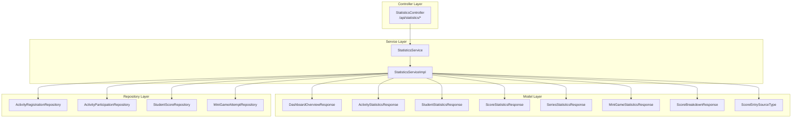
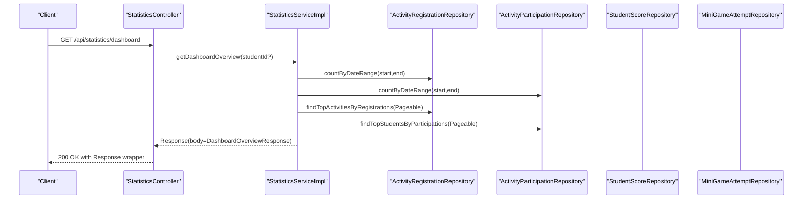
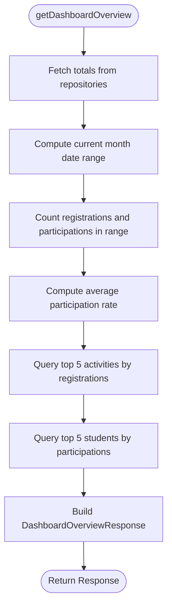
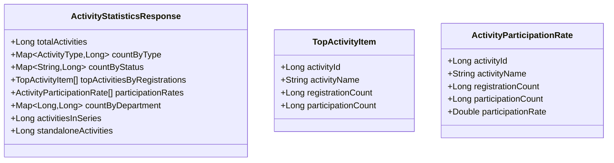
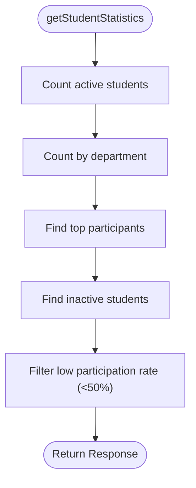
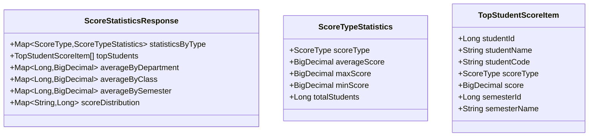
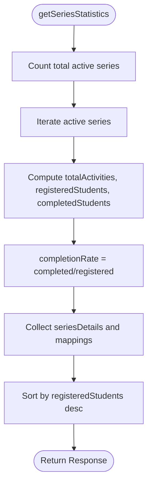
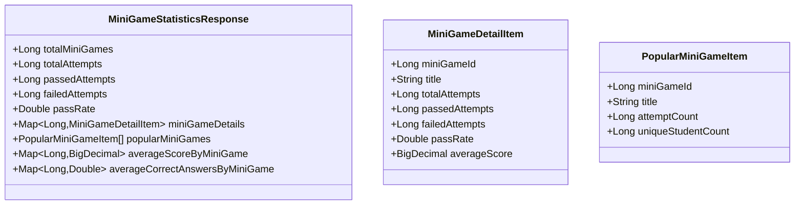
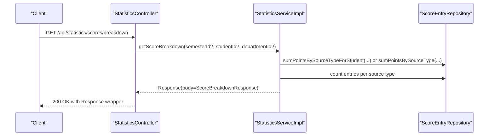
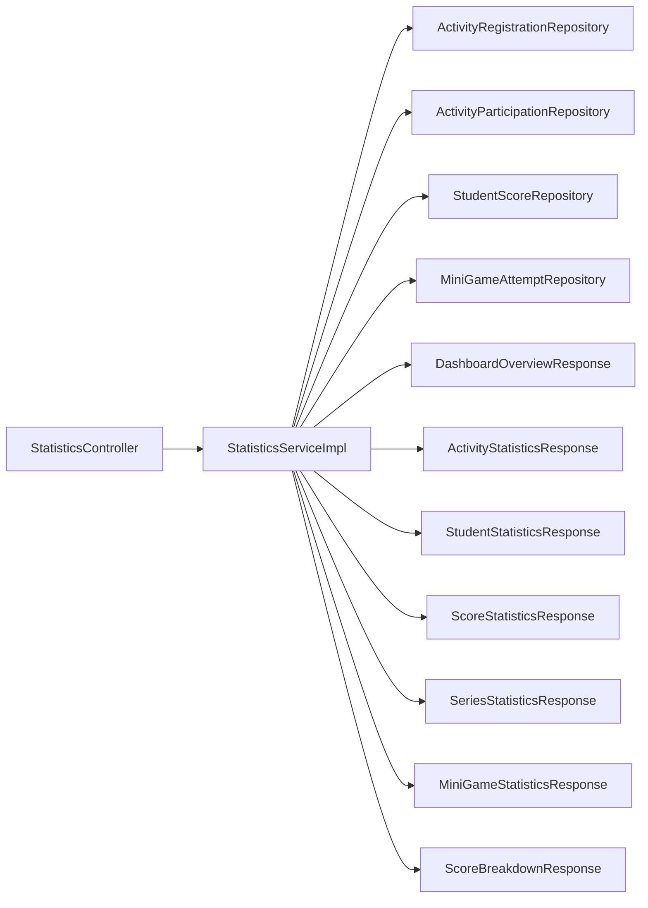

# Statistics & Dashboard

<cite>
**Referenced Files in This Document**
- [StatisticsController.java](file://src/main/java/vn/campuslife/controller/score/StatisticsController.java)
- [StatisticsService.java](file://src/main/java/vn/campuslife/service/StatisticsService.java)
- [StatisticsServiceImpl.java](file://src/main/java/vn/campuslife/service/impl/StatisticsServiceImpl.java)
- [DashboardOverviewResponse.java](file://src/main/java/vn/campuslife/model/statistics/DashboardOverviewResponse.java)
- [ActivityStatisticsResponse.java](file://src/main/java/vn/campuslife/model/statistics/ActivityStatisticsResponse.java)
- [StudentStatisticsResponse.java](file://src/main/java/vn/campuslife/model/statistics/StudentStatisticsResponse.java)
- [ScoreStatisticsResponse.java](file://src/main/java/vn/campuslife/model/statistics/ScoreStatisticsResponse.java)
- [SeriesStatisticsResponse.java](file://src/main/java/vn/campuslife/model/statistics/SeriesStatisticsResponse.java)
- [MiniGameStatisticsResponse.java](file://src/main/java/vn/campuslife/model/statistics/MiniGameStatisticsResponse.java)
- [ScoreBreakdownResponse.java](file://src/main/java/vn/campuslife/model/score/ScoreBreakdownResponse.java)
- [ScoreEntrySourceType.java](file://src/main/java/vn/campuslife/enumeration/ScoreEntrySourceType.java)
- [ActivityRegistrationRepository.java](file://src/main/java/vn/campuslife/repository/ActivityRegistrationRepository.java)
- [ActivityParticipationRepository.java](file://src/main/java/vn/campuslife/repository/ActivityParticipationRepository.java)
- [StudentScoreRepository.java](file://src/main/java/vn/campuslife/repository/StudentScoreRepository.java)
- [MiniGameAttemptRepository.java](file://src/main/java/vn/campuslife/repository/MiniGameAttemptRepository.java)
- [Response.java](file://src/main/java/vn/campuslife/model/Response.java)
- [apimapping.md](file://.trae/rules/apimapping.md)
</cite>

## Table of Contents
1. [Introduction](#introduction)
2. [Project Structure](#project-structure)
3. [Core Components](#core-components)
4. [Architecture Overview](#architecture-overview)
5. [Detailed Component Analysis](#detailed-component-analysis)
6. [Dependency Analysis](#dependency-analysis)
7. [Performance Considerations](#performance-considerations)
8. [Troubleshooting Guide](#troubleshooting-guide)
9. [Conclusion](#conclusion)
10. [Appendices](#appendices)

## Introduction
This document describes the Statistics & Dashboard system responsible for system analytics, performance metrics, and administrative reporting. It covers:
- Dashboard overview with totals, monthly activity, and top performers
- Activity statistics (counts by type/status, participation rates, departmental distribution)
- Student engagement metrics (top participants, inactive learners, low participation rate)
- Score analytics (averages, distributions, top scorers, department/class averages)
- Series progress tracking (completion rates, popularity)
- MiniGame analytics (attempts, pass rates, popular games)
- Score source-type breakdown for auditing and transparency
- Practical usage examples, customization strategies, and troubleshooting tips

## Project Structure
The statistics subsystem follows a layered architecture:
- Controller layer exposes REST endpoints under /api/statistics
- Service layer orchestrates data retrieval and computation
- Repository layer encapsulates database queries
- Model layer defines DTOs for responses and enumerations for constants

**Diagram sources**
- [StatisticsController.java:15-213](file://src/main/java/vn/campuslife/controller/score/StatisticsController.java#L15-L213)
- [StatisticsService.java:1-45](file://src/main/java/vn/campuslife/service/StatisticsService.java#L1-L45)
- [StatisticsServiceImpl.java:24-686](file://src/main/java/vn/campuslife/service/impl/StatisticsServiceImpl.java#L24-L686)
- [DashboardOverviewResponse.java:12-42](file://src/main/java/vn/campuslife/model/statistics/DashboardOverviewResponse.java#L12-L42)
- [ActivityStatisticsResponse.java:14-44](file://src/main/java/vn/campuslife/model/statistics/ActivityStatisticsResponse.java#L14-L44)
- [StudentStatisticsResponse.java:13-51](file://src/main/java/vn/campuslife/model/statistics/StudentStatisticsResponse.java#L13-L51)
- [ScoreStatisticsResponse.java:15-45](file://src/main/java/vn/campuslife/model/statistics/ScoreStatisticsResponse.java#L15-L45)
- [SeriesStatisticsResponse.java:14-41](file://src/main/java/vn/campuslife/model/statistics/SeriesStatisticsResponse.java#L14-L41)
- [MiniGameStatisticsResponse.java:14-46](file://src/main/java/vn/campuslife/model/statistics/MiniGameStatisticsResponse.java#L14-L46)
- [ScoreBreakdownResponse.java:10-22](file://src/main/java/vn/campuslife/model/score/ScoreBreakdownResponse.java#L10-L22)
- [ScoreEntrySourceType.java:3-13](file://src/main/java/vn/campuslife/enumeration/ScoreEntrySourceType.java#L3-L13)
- [ActivityRegistrationRepository.java:16-200](file://src/main/java/vn/campuslife/repository/ActivityRegistrationRepository.java#L16-L200)
- [ActivityParticipationRepository.java:16-126](file://src/main/java/vn/campuslife/repository/ActivityParticipationRepository.java#L16-L126)
- [StudentScoreRepository.java:13-123](file://src/main/java/vn/campuslife/repository/StudentScoreRepository.java#L13-L123)
- [MiniGameAttemptRepository.java:13-103](file://src/main/java/vn/campuslife/repository/MiniGameAttemptRepository.java#L13-L103)

**Section sources**
- [StatisticsController.java:15-213](file://src/main/java/vn/campuslife/controller/score/StatisticsController.java#L15-L213)
- [StatisticsService.java:1-45](file://src/main/java/vn/campuslife/service/StatisticsService.java#L1-L45)
- [StatisticsServiceImpl.java:24-686](file://src/main/java/vn/campuslife/service/impl/StatisticsServiceImpl.java#L24-L686)

## Core Components
- StatisticsController: Exposes endpoints for dashboard overview, activity, student, score, series, minigame statistics, and score breakdown.
- StatisticsService: Defines the contract for statistics operations.
- StatisticsServiceImpl: Implements analytics computations using repositories and builds DTO responses.
- Response wrapper: Standardized JSON envelope for success/error responses.

Key endpoints:
- GET /api/statistics/dashboard
- GET /api/statistics/activities
- GET /api/statistics/students
- GET /api/statistics/scores
- GET /api/statistics/series
- GET /api/statistics/minigames
- GET /api/statistics/scores/breakdown

Access control:
- Dashboard overview: admins/managers see all; students see personal overview.
- Scores endpoint: admins/managers see all; students see only their own.
- Score breakdown: admins may filter by student/department; students restricted to self.

**Section sources**
- [StatisticsController.java:30-209](file://src/main/java/vn/campuslife/controller/score/StatisticsController.java#L30-L209)
- [StatisticsService.java:5-44](file://src/main/java/vn/campuslife/service/StatisticsService.java#L5-L44)
- [Response.java:10-25](file://src/main/java/vn/campuslife/model/Response.java#L10-L25)

## Architecture Overview
The system adheres to clean architecture with clear separation of concerns:
- Controllers handle HTTP requests and basic validation
- Services encapsulate business logic and orchestration
- Repositories abstract persistence and expose typed queries
- Models define DTOs and enumerations

**Diagram sources**
- [StatisticsController.java:30-49](file://src/main/java/vn/campuslife/controller/score/StatisticsController.java#L30-L49)
- [StatisticsServiceImpl.java:41-114](file://src/main/java/vn/campuslife/service/impl/StatisticsServiceImpl.java#L41-L114)
- [ActivityRegistrationRepository.java:113-123](file://src/main/java/vn/campuslife/repository/ActivityRegistrationRepository.java#L113-L123)
- [ActivityParticipationRepository.java:101-111](file://src/main/java/vn/campuslife/repository/ActivityParticipationRepository.java#L101-L111)

## Detailed Component Analysis

### Dashboard Overview
Purpose:
- Provide a high-level snapshot of system health and engagement.

Metrics computed:
- Totals: activities, students, series, minigames
- Monthly: registrations and participations
- Average participation rate
- Top 5 activities by registrations and participations
- Top 5 students by participation count

**Diagram sources**
- [StatisticsServiceImpl.java:41-114](file://src/main/java/vn/campuslife/service/impl/StatisticsServiceImpl.java#L41-L114)
- [ActivityRegistrationRepository.java:113-123](file://src/main/java/vn/campuslife/repository/ActivityRegistrationRepository.java#L113-L123)
- [ActivityParticipationRepository.java:101-111](file://src/main/java/vn/campuslife/repository/ActivityParticipationRepository.java#L101-L111)
- [DashboardOverviewResponse.java:12-42](file://src/main/java/vn/campuslife/model/statistics/DashboardOverviewResponse.java#L12-L42)

**Section sources**
- [StatisticsServiceImpl.java:41-114](file://src/main/java/vn/campuslife/service/impl/StatisticsServiceImpl.java#L41-L114)
- [DashboardOverviewResponse.java:12-42](file://src/main/java/vn/campuslife/model/statistics/DashboardOverviewResponse.java#L12-L42)

### Activity Statistics
Purpose:
- Analyze activity lifecycle and engagement.

Metrics computed:
- Total activities
- Count by activity type
- Count by status (draft/published/deleted)
- Top activities by registrations
- Participation rates per activity
- Count by department
- Activities in series vs standalone

**Diagram sources**
- [ActivityStatisticsResponse.java:14-44](file://src/main/java/vn/campuslife/model/statistics/ActivityStatisticsResponse.java#L14-L44)

**Section sources**
- [StatisticsServiceImpl.java:116-196](file://src/main/java/vn/campuslife/service/impl/StatisticsServiceImpl.java#L116-L196)
- [ActivityStatisticsResponse.java:14-44](file://src/main/java/vn/campuslife/model/statistics/ActivityStatisticsResponse.java#L14-L44)

### Student Statistics
Purpose:
- Measure student engagement and identify at-risk learners.

Metrics computed:
- Total active students
- Count by department
- Top participants by participation count
- Inactive students (no activity participation)
- Students with low participation rate (< 50%)

**Diagram sources**
- [StatisticsServiceImpl.java:198-282](file://src/main/java/vn/campuslife/service/impl/StatisticsServiceImpl.java#L198-L282)
- [StudentStatisticsResponse.java:13-51](file://src/main/java/vn/campuslife/model/statistics/StudentStatisticsResponse.java#L13-L51)

**Section sources**
- [StatisticsServiceImpl.java:198-282](file://src/main/java/vn/campuslife/service/impl/StatisticsServiceImpl.java#L198-L282)
- [StudentStatisticsResponse.java:13-51](file://src/main/java/vn/campuslife/model/statistics/StudentStatisticsResponse.java#L13-L51)

### Score Statistics
Purpose:
- Provide grade analytics and benchmarking.

Metrics computed:
- By score type: average, max, min, total students
- Top students per score type
- Average by department
- Score distribution histogram (0–100 bins)
- Optional filtering by semester, department, class, student

**Diagram sources**
- [ScoreStatisticsResponse.java:15-45](file://src/main/java/vn/campuslife/model/statistics/ScoreStatisticsResponse.java#L15-L45)

**Section sources**
- [StatisticsServiceImpl.java:284-412](file://src/main/java/vn/campuslife/service/impl/StatisticsServiceImpl.java#L284-L412)
- [ScoreStatisticsResponse.java:15-45](file://src/main/java/vn/campuslife/model/statistics/ScoreStatisticsResponse.java#L15-L45)

### Series Statistics
Purpose:
- Track progress and completion across learning series.

Metrics computed:
- Total active series
- Per-series: total activities, registered students, completed students, completion rate
- Milestone points awarded (placeholder)
- Popular series by registered student count

**Diagram sources**
- [StatisticsServiceImpl.java:437-525](file://src/main/java/vn/campuslife/service/impl/StatisticsServiceImpl.java#L437-L525)
- [SeriesStatisticsResponse.java:14-41](file://src/main/java/vn/campuslife/model/statistics/SeriesStatisticsResponse.java#L14-L41)

**Section sources**
- [StatisticsServiceImpl.java:437-525](file://src/main/java/vn/campuslife/service/impl/StatisticsServiceImpl.java#L437-L525)
- [SeriesStatisticsResponse.java:14-41](file://src/main/java/vn/campuslife/model/statistics/SeriesStatisticsResponse.java#L14-L41)

### MiniGame Statistics
Purpose:
- Analyze interactive game engagement and performance.

Metrics computed:
- Totals: minigames, attempts, passes, fails, pass rate
- Per-game: attempts, pass rate, average score, average correct answers
- Popular minigames by attempts and unique student participation

**Diagram sources**
- [MiniGameStatisticsResponse.java:14-46](file://src/main/java/vn/campuslife/model/statistics/MiniGameStatisticsResponse.java#L14-L46)

**Section sources**
- [StatisticsServiceImpl.java:527-615](file://src/main/java/vn/campuslife/service/impl/StatisticsServiceImpl.java#L527-L615)
- [MiniGameStatisticsResponse.java:14-46](file://src/main/java/vn/campuslife/model/statistics/MiniGameStatisticsResponse.java#L14-L46)

### Score Breakdown
Purpose:
- Decompose score accumulation by source type for auditability and transparency.

Metrics computed:
- Sum points by source type for a semester (optionally filtered by student or department)
- Entry counts per source type (approximated via counting entries)
- Includes all ScoreEntrySourceType variants

**Diagram sources**
- [StatisticsController.java:185-209](file://src/main/java/vn/campuslife/controller/score/StatisticsController.java#L185-L209)
- [StatisticsServiceImpl.java:617-683](file://src/main/java/vn/campuslife/service/impl/StatisticsServiceImpl.java#L617-L683)
- [ScoreBreakdownResponse.java:10-22](file://src/main/java/vn/campuslife/model/score/ScoreBreakdownResponse.java#L10-L22)
- [ScoreEntrySourceType.java:3-13](file://src/main/java/vn/campuslife/enumeration/ScoreEntrySourceType.java#L3-L13)

**Section sources**
- [StatisticsServiceImpl.java:617-683](file://src/main/java/vn/campuslife/service/impl/StatisticsServiceImpl.java#L617-L683)
- [ScoreBreakdownResponse.java:10-22](file://src/main/java/vn/campuslife/model/score/ScoreBreakdownResponse.java#L10-L22)
- [ScoreEntrySourceType.java:3-13](file://src/main/java/vn/campuslife/enumeration/ScoreEntrySourceType.java#L3-L13)

## Dependency Analysis
- Controllers depend on StatisticsService and StudentService for user context resolution.
- StatisticsServiceImpl depends on multiple repositories for aggregations.
- DTOs are cohesive per domain (dashboard, activity, student, score, series, minigame).
- Response wrapper ensures consistent error/success envelopes.

**Diagram sources**
- [StatisticsController.java:22-23](file://src/main/java/vn/campuslife/controller/score/StatisticsController.java#L22-L23)
- [StatisticsServiceImpl.java:28-39](file://src/main/java/vn/campuslife/service/impl/StatisticsServiceImpl.java#L28-L39)
- [DashboardOverviewResponse.java:12-42](file://src/main/java/vn/campuslife/model/statistics/DashboardOverviewResponse.java#L12-L42)
- [ActivityStatisticsResponse.java:14-44](file://src/main/java/vn/campuslife/model/statistics/ActivityStatisticsResponse.java#L14-L44)
- [StudentStatisticsResponse.java:13-51](file://src/main/java/vn/campuslife/model/statistics/StudentStatisticsResponse.java#L13-L51)
- [ScoreStatisticsResponse.java:15-45](file://src/main/java/vn/campuslife/model/statistics/ScoreStatisticsResponse.java#L15-L45)
- [SeriesStatisticsResponse.java:14-41](file://src/main/java/vn/campuslife/model/statistics/SeriesStatisticsResponse.java#L14-L41)
- [MiniGameStatisticsResponse.java:14-46](file://src/main/java/vn/campuslife/model/statistics/MiniGameStatisticsResponse.java#L14-L46)
- [ScoreBreakdownResponse.java:10-22](file://src/main/java/vn/campuslife/model/score/ScoreBreakdownResponse.java#L10-L22)

**Section sources**
- [StatisticsServiceImpl.java:28-39](file://src/main/java/vn/campuslife/service/impl/StatisticsServiceImpl.java#L28-L39)

## Performance Considerations
- Pagination: Top lists use Pageable to limit result sets (e.g., top 5, top 10).
- Aggregation queries: Repositories provide optimized JPQL/HQL for counts and averages.
- Date-range filters: Monthly dashboards compute start/end-of-month boundaries server-side.
- Defensive programming: Division by zero guarded by checks before computing rates.
- Logging: Centralized error logging in service layer for observability.

[No sources needed since this section provides general guidance]

## Troubleshooting Guide
Common issues and resolutions:
- No semester found: Ensure a valid semester exists or allow fallback to open/current semester.
- Zero division in rates: Guarded in code; verify input parameters and data completeness.
- Inconsistent completion rates: Service caps completion rate at 1.0 and logs warnings for anomalies.
- Missing student ID from authentication: Controller attempts to resolve studentId via username; log warnings when unavailable.
- Repository query failures: Verify JPQL correctness and entity relationships.

**Section sources**
- [StatisticsServiceImpl.java:414-435](file://src/main/java/vn/campuslife/service/impl/StatisticsServiceImpl.java#L414-L435)
- [StatisticsController.java:34-41](file://src/main/java/vn/campuslife/controller/score/StatisticsController.java#L34-L41)
- [StatisticsServiceImpl.java:521-524](file://src/main/java/vn/campuslife/service/impl/StatisticsServiceImpl.java#L521-L524)

## Conclusion
The Statistics & Dashboard system offers a comprehensive set of analytics across activities, students, scores, series, and minigames. It supports role-based access, robust aggregations, and clear DTO contracts. Administrators gain oversight and insights; students receive personalized dashboards. The modular design enables easy extension and maintenance.

[No sources needed since this section summarizes without analyzing specific files]

## Appendices

### API Reference Summary
Endpoints:
- GET /api/statistics/dashboard
- GET /api/statistics/activities
- GET /api/statistics/students
- GET /api/statistics/scores
- GET /api/statistics/series
- GET /api/statistics/minigames
- GET /api/statistics/scores/breakdown

Response contract:
- Success: { status: true, message: string, body: payload }
- Error: { status: false, message: string, body: null }

**Section sources**
- [apimapping.md:33-71](file://.trae/rules/apimapping.md#L33-L71)
- [Response.java:10-25](file://src/main/java/vn/campuslife/model/Response.java#L10-L25)