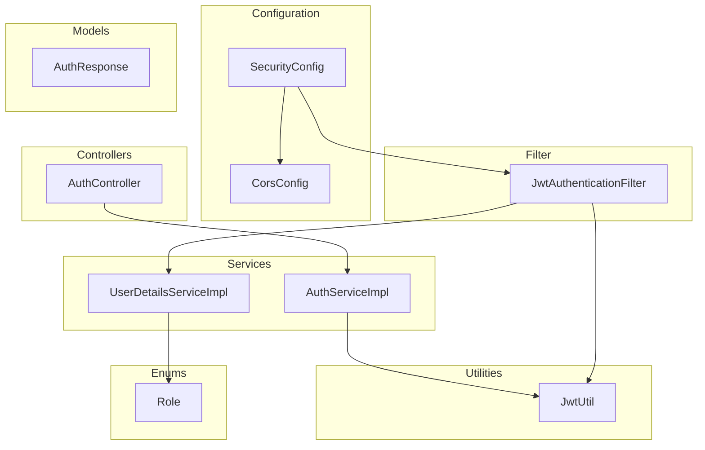
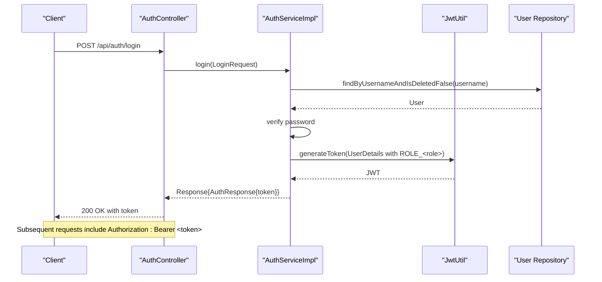
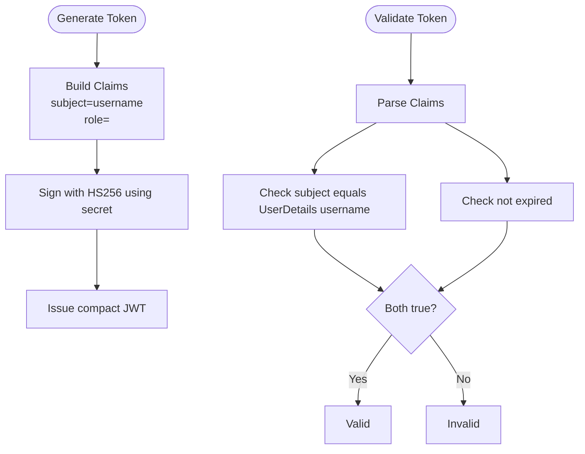
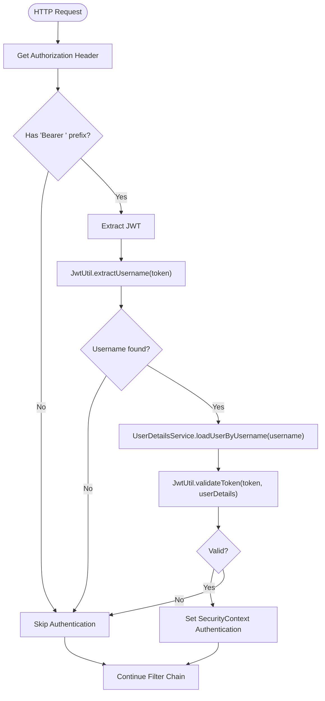
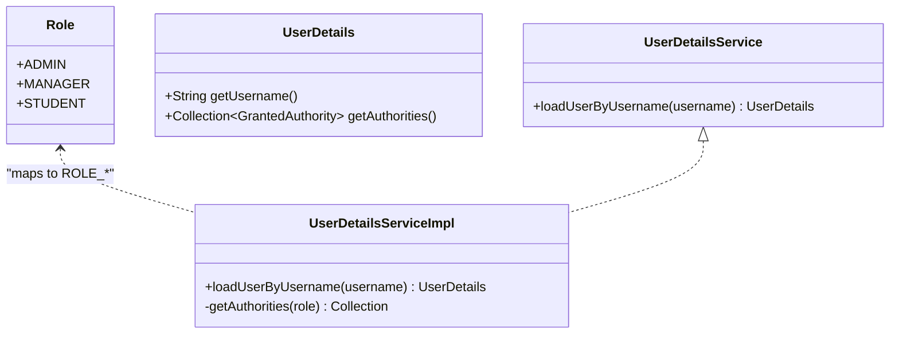
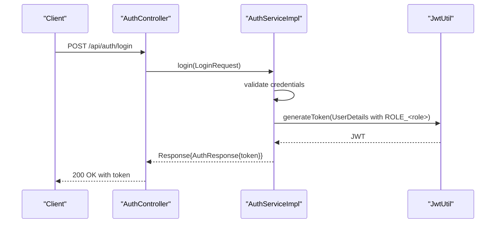
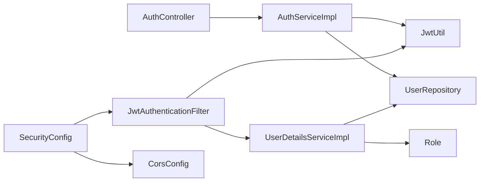

# Authentication & Authorization

<cite>
**Referenced Files in This Document**
- [SecurityConfig.java](file://src/main/java/vn/campuslife/config/SecurityConfig.java)
- [JwtAuthenticationFilter.java](file://src/main/java/vn/campuslife/filter/JwtAuthenticationFilter.java)
- [JwtUtil.java](file://src/main/java/vn/campuslife/util/JwtUtil.java)
- [AuthController.java](file://src/main/java/vn/campuslife/controller/auth/AuthController.java)
- [AuthServiceImpl.java](file://src/main/java/vn/campuslife/service/impl/AuthServiceImpl.java)
- [UserDetailsServiceImpl.java](file://src/main/java/vn/campuslife/service/impl/UserDetailsServiceImpl.java)
- [Role.java](file://src/main/java/vn/campuslife/enumeration/Role.java)
- [CorsConfig.java](file://src/main/java/vn/campuslife/config/CorsConfig.java)
- [application.properties](file://src/main/resources/application.properties)
- [AuthResponse.java](file://src/main/java/vn/campuslife/model/AuthResponse.java)
</cite>

## Table of Contents
1. [Introduction](#introduction)
2. [Project Structure](#project-structure)
3. [Core Components](#core-components)
4. [Architecture Overview](#architecture-overview)
5. [Detailed Component Analysis](#detailed-component-analysis)
6. [Dependency Analysis](#dependency-analysis)
7. [Performance Considerations](#performance-considerations)
8. [Troubleshooting Guide](#troubleshooting-guide)
9. [Conclusion](#conclusion)

## Introduction
This document explains the authentication and authorization subsystem of the backend. It covers JWT-based authentication, token generation and validation, role-based access control (RBAC) with ADMIN, MANAGER, and STUDENT roles, the security filter pipeline, CORS configuration, and method-level security annotations. Practical workflows for login, token validation, permission checks, and accessing protected endpoints are included, along with security considerations, token expiration handling, and troubleshooting guidance.

## Project Structure
The authentication and authorization system spans configuration, filters, utilities, services, controllers, and models:

- Configuration
  - SecurityConfig: Web security, HTTP request authorization rules, and filter chain setup
  - CorsConfig: CORS policy definition and configuration source bean
- Filter
  - JwtAuthenticationFilter: Extracts and validates JWT from Authorization header and sets Spring Security context
- Utilities
  - JwtUtil: JWT signing, parsing, claims extraction, and validation
- Services
  - AuthServiceImpl: Login, registration, account verification, password reset/change flows
  - UserDetailsServiceImpl: Loads user details and authorities for authentication
- Controllers
  - AuthController: Exposes authentication endpoints
- Models
  - AuthResponse: Wraps JWT token in login response
- Enumerations
  - Role: Defines ADMIN, MANAGER, STUDENT roles

**Diagram sources**
- [SecurityConfig.java:58-300](file://src/main/java/vn/campuslife/config/SecurityConfig.java#L58-L300)
- [JwtAuthenticationFilter.java:20-105](file://src/main/java/vn/campuslife/filter/JwtAuthenticationFilter.java#L20-L105)
- [JwtUtil.java:18-90](file://src/main/java/vn/campuslife/util/JwtUtil.java#L18-L90)
- [AuthController.java:14-98](file://src/main/java/vn/campuslife/controller/auth/AuthController.java#L14-L98)
- [AuthServiceImpl.java:30-339](file://src/main/java/vn/campuslife/service/impl/AuthServiceImpl.java#L30-L339)
- [UserDetailsServiceImpl.java:15-41](file://src/main/java/vn/campuslife/service/impl/UserDetailsServiceImpl.java#L15-L41)
- [Role.java:3-7](file://src/main/java/vn/campuslife/enumeration/Role.java#L3-L7)
- [CorsConfig.java:11-44](file://src/main/java/vn/campuslife/config/CorsConfig.java#L11-L44)
- [AuthResponse.java:5-12](file://src/main/java/vn/campuslife/model/AuthResponse.java#L5-L12)

**Section sources**
- [SecurityConfig.java:23-302](file://src/main/java/vn/campuslife/config/SecurityConfig.java#L23-L302)
- [CorsConfig.java:11-44](file://src/main/java/vn/campuslife/config/CorsConfig.java#L11-L44)

## Core Components
- JWT Utility (JwtUtil): Generates signed tokens with subject and role claim, extracts claims, and validates expiration and issuer identity.
- JWT Authentication Filter (JwtAuthenticationFilter): Reads Authorization header, extracts token, loads user details, validates token, and sets SecurityContext for authenticated requests.
- Authentication Service (AuthServiceImpl): Implements login, registration, account verification, forgot password, reset password, and change password flows. Issues JWT upon successful login.
- User Details Service (UserDetailsServiceImpl): Loads user entity by username, constructs Spring UserDetails with ROLE_ADMIN/ROLE_MANAGER/ROLE_STUDENT authority.
- Security Configuration (SecurityConfig): Enables method security, disables CSRF, sets stateless session management, defines CORS, and enforces fine-grained authorization rules per endpoint and role.
- CORS Configuration (CorsConfig): Defines allowed origins, methods, headers, credentials, and preflight caching.
- Authentication Controller (AuthController): Exposes endpoints for register, login, verify, forgot-password, reset-password, and change-password.
- Role Enumeration (Role): Declares ADMIN, MANAGER, STUDENT.

**Section sources**
- [JwtUtil.java:18-90](file://src/main/java/vn/campuslife/util/JwtUtil.java#L18-L90)
- [JwtAuthenticationFilter.java:20-105](file://src/main/java/vn/campuslife/filter/JwtAuthenticationFilter.java#L20-L105)
- [AuthServiceImpl.java:30-339](file://src/main/java/vn/campuslife/service/impl/AuthServiceImpl.java#L30-L339)
- [UserDetailsServiceImpl.java:15-41](file://src/main/java/vn/campuslife/service/impl/UserDetailsServiceImpl.java#L15-L41)
- [SecurityConfig.java:23-302](file://src/main/java/vn/campuslife/config/SecurityConfig.java#L23-L302)
- [CorsConfig.java:11-44](file://src/main/java/vn/campuslife/config/CorsConfig.java#L11-L44)
- [AuthController.java:14-98](file://src/main/java/vn/campuslife/controller/auth/AuthController.java#L14-L98)
- [Role.java:3-7](file://src/main/java/vn/campuslife/enumeration/Role.java#L3-L7)

## Architecture Overview
The authentication and authorization pipeline:

- Clients send credentials to AuthController endpoints.
- AuthServiceImpl authenticates users against persistent storage and issues JWT via JwtUtil.
- JwtAuthenticationFilter intercepts subsequent requests, extracts JWT from Authorization header, validates it, loads user details, and sets SecurityContext.
- SecurityConfig enforces method-level and HTTP-level authorization rules based on roles.

**Diagram sources**
- [AuthController.java:41-44](file://src/main/java/vn/campuslife/controller/auth/AuthController.java#L41-L44)
- [AuthServiceImpl.java:56-96](file://src/main/java/vn/campuslife/service/impl/AuthServiceImpl.java#L56-L96)
- [JwtUtil.java:56-78](file://src/main/java/vn/campuslife/util/JwtUtil.java#L56-L78)
- [application.properties:62-66](file://src/main/resources/application.properties#L62-L66)

## Detailed Component Analysis

### JWT Token-Based Authentication
- Token generation:
  - Claims include subject (username) and role (without "ROLE_" prefix in token claim).
  - Issued at current time and expires after configured duration.
  - Signed with HS256 using a symmetric secret key derived from application configuration.
- Token validation:
  - Extract subject and expiration.
  - Ensure username matches UserDetails and token is not expired.
- Configuration:
  - Secret and expiration are configurable via application properties.

**Diagram sources**
- [JwtUtil.java:56-83](file://src/main/java/vn/campuslife/util/JwtUtil.java#L56-L83)
- [application.properties:62-66](file://src/main/resources/application.properties#L62-L66)

**Section sources**
- [JwtUtil.java:18-90](file://src/main/java/vn/campuslife/util/JwtUtil.java#L18-L90)
- [application.properties:62-66](file://src/main/resources/application.properties#L62-L66)

### Security Filter Implementation (JwtAuthenticationFilter)
- Extracts Authorization header and verifies "Bearer " scheme.
- Uses JwtUtil to extract username and validate token.
- Loads user via UserDetailsService and sets Authentication in SecurityContext if valid.
- Continues filter chain regardless of errors to allow global exception handling.

**Diagram sources**
- [JwtAuthenticationFilter.java:33-103](file://src/main/java/vn/campuslife/filter/JwtAuthenticationFilter.java#L33-L103)
- [JwtUtil.java:27-83](file://src/main/java/vn/campuslife/util/JwtUtil.java#L27-L83)
- [UserDetailsServiceImpl.java:24-36](file://src/main/java/vn/campuslife/service/impl/UserDetailsServiceImpl.java#L24-L36)

**Section sources**
- [JwtAuthenticationFilter.java:20-105](file://src/main/java/vn/campuslife/filter/JwtAuthenticationFilter.java#L20-L105)

### Role-Based Access Control (RBAC)
- Roles:
  - ADMIN: Full administrative access.
  - MANAGER: Administrative-like access for many operations.
  - STUDENT: Limited access for self-service and participation.
- Authority mapping:
  - UserDetailsService assigns "ROLE_<role>" authority based on persisted Role.
- Endpoint authorization rules:
  - SecurityConfig defines granular permitAll, authenticated, and hasRole/hasAnyRole rules for endpoints across activities, registrations, tasks, scores, classes, and more.
- Method-level security:
  - @EnableMethodSecurity is enabled in SecurityConfig, allowing method-level annotations elsewhere in the codebase to enforce RBAC.

**Diagram sources**
- [Role.java:3-7](file://src/main/java/vn/campuslife/enumeration/Role.java#L3-L7)
- [UserDetailsServiceImpl.java:15-41](file://src/main/java/vn/campuslife/service/impl/UserDetailsServiceImpl.java#L15-L41)

**Section sources**
- [Role.java:3-7](file://src/main/java/vn/campuslife/enumeration/Role.java#L3-L7)
- [UserDetailsServiceImpl.java:15-41](file://src/main/java/vn/campuslife/service/impl/UserDetailsServiceImpl.java#L15-L41)
- [SecurityConfig.java:24-26](file://src/main/java/vn/campuslife/config/SecurityConfig.java#L24-L26)

### CORS Configuration
- Global CORS mapping allows all methods and headers with credentials.
- Pre-flight requests cached for 1 hour.
- Specialized mapping for /uploads/** restricts to GET/OPTIONS.
- A CorsConfigurationSource bean is provided for use in SecurityFilterChain.

**Section sources**
- [CorsConfig.java:11-44](file://src/main/java/vn/campuslife/config/CorsConfig.java#L11-L44)
- [SecurityConfig.java:59-64](file://src/main/java/vn/campuslife/config/SecurityConfig.java#L59-L64)

### Method-Level Security Annotations
- SecurityConfig enables method security via @EnableMethodSecurity.
- Authorization rules are enforced at the HTTP layer in authorizeHttpRequests; method-level annotations can be used in services/controllers to complement HTTP rules.

**Section sources**
- [SecurityConfig.java:24-26](file://src/main/java/vn/campuslife/config/SecurityConfig.java#L24-L26)

### Authentication Controller and Workflows
- Endpoints:
  - POST /api/auth/register: Registers a new user (activation token generated).
  - POST /api/auth/login: Authenticates user and returns JWT.
  - GET /api/auth/verify?token=...: Verifies account using activation token.
  - POST /api/auth/forgot-password: Sends password reset link.
  - POST /api/auth/reset-password: Resets password using token.
  - POST /api/auth/change-password: Changes password for authenticated user.
- Response model:
  - AuthResponse wraps the issued JWT for login success.

**Diagram sources**
- [AuthController.java:41-44](file://src/main/java/vn/campuslife/controller/auth/AuthController.java#L41-L44)
- [AuthServiceImpl.java:56-96](file://src/main/java/vn/campuslife/service/impl/AuthServiceImpl.java#L56-L96)
- [JwtUtil.java:56-78](file://src/main/java/vn/campuslife/util/JwtUtil.java#L56-L78)
- [AuthResponse.java:5-12](file://src/main/java/vn/campuslife/model/AuthResponse.java#L5-L12)

**Section sources**
- [AuthController.java:14-98](file://src/main/java/vn/campuslife/controller/auth/AuthController.java#L14-L98)
- [AuthServiceImpl.java:56-96](file://src/main/java/vn/campuslife/service/impl/AuthServiceImpl.java#L56-L96)
- [AuthResponse.java:5-12](file://src/main/java/vn/campuslife/model/AuthResponse.java#L5-L12)

### Token Validation and Expiration Handling
- Validation checks:
  - Username equality between token subject and UserDetails.
  - Non-expired token.
- Expiration is configured via application property jwt.expiration (milliseconds).
- On invalid/expired tokens, the filter does not set SecurityContext; downstream authorization denies access.

**Section sources**
- [JwtUtil.java:80-83](file://src/main/java/vn/campuslife/util/JwtUtil.java#L80-L83)
- [JwtAuthenticationFilter.java:74-85](file://src/main/java/vn/campuslife/filter/JwtAuthenticationFilter.java#L74-L85)
- [application.properties:62-66](file://src/main/resources/application.properties#L62-L66)

## Dependency Analysis
High-level dependencies among authentication components:

**Diagram sources**
- [AuthController.java:14-98](file://src/main/java/vn/campuslife/controller/auth/AuthController.java#L14-L98)
- [AuthServiceImpl.java:30-54](file://src/main/java/vn/campuslife/service/impl/AuthServiceImpl.java#L30-L54)
- [JwtUtil.java:18-90](file://src/main/java/vn/campuslife/util/JwtUtil.java#L18-L90)
- [SecurityConfig.java:23-38](file://src/main/java/vn/campuslife/config/SecurityConfig.java#L23-L38)
- [JwtAuthenticationFilter.java:20-31](file://src/main/java/vn/campuslife/filter/JwtAuthenticationFilter.java#L20-L31)
- [UserDetailsServiceImpl.java:15-22](file://src/main/java/vn/campuslife/service/impl/UserDetailsServiceImpl.java#L15-L22)
- [Role.java:3-7](file://src/main/java/vn/campuslife/enumeration/Role.java#L3-L7)

**Section sources**
- [SecurityConfig.java:23-302](file://src/main/java/vn/campuslife/config/SecurityConfig.java#L23-L302)
- [JwtAuthenticationFilter.java:20-105](file://src/main/java/vn/campuslife/filter/JwtAuthenticationFilter.java#L20-L105)
- [UserDetailsServiceImpl.java:15-41](file://src/main/java/vn/campuslife/service/impl/UserDetailsServiceImpl.java#L15-L41)

## Performance Considerations
- Stateless session management reduces server-side session overhead.
- JWT validation is CPU-bound; keep secret key derivation efficient and avoid excessive logging in production.
- Prefer minimal claims payload to reduce token size.
- Ensure adequate CORS pre-flight caching to minimize repeated OPTIONS requests.

## Troubleshooting Guide
Common issues and resolutions:

- 401 Unauthorized on protected endpoints
  - Cause: Missing or malformed Authorization header, invalid/expired token, or mismatched username.
  - Resolution: Confirm "Bearer <token>" format, verify token not expired, and ensure user still exists and is activated.
  - Evidence: JwtAuthenticationFilter logs username extraction and validation outcomes; JwtUtil.validateToken compares username and expiration.

- 403 Forbidden on endpoints
  - Cause: Insufficient role for the requested resource.
  - Resolution: Verify user’s Role and corresponding authorities ("ROLE_ADMIN"/"ROLE_MANAGER"/"ROLE_STUDENT").
  - Evidence: SecurityConfig.hasRole/hasAnyRole rules define access per endpoint.

- CORS errors
  - Cause: Disallowed origin/method/header or missing credentials.
  - Resolution: Align client origin with allowed patterns and ensure credentials are allowed.
  - Evidence: CorsConfig defines allowed origins, methods, headers, and credentials.

- Login failures
  - Cause: Incorrect credentials, unactivated account, or server exceptions.
  - Resolution: Validate username/password, check activation status, and review server logs.
  - Evidence: AuthServiceImpl.login handles validation and returns descriptive messages.

- Token not being recognized
  - Cause: Token not prefixed with "Bearer ", wrong secret, or token altered.
  - Resolution: Ensure Authorization header format and matching secret between client and server.
  - Evidence: JwtAuthenticationFilter expects "Bearer "; JwtUtil signs with configured secret.

**Section sources**
- [JwtAuthenticationFilter.java:33-103](file://src/main/java/vn/campuslife/filter/JwtAuthenticationFilter.java#L33-L103)
- [JwtUtil.java:80-83](file://src/main/java/vn/campuslife/util/JwtUtil.java#L80-L83)
- [SecurityConfig.java:59-295](file://src/main/java/vn/campuslife/config/SecurityConfig.java#L59-L295)
- [CorsConfig.java:11-44](file://src/main/java/vn/campuslife/config/CorsConfig.java#L11-L44)
- [AuthServiceImpl.java:56-96](file://src/main/java/vn/campuslife/service/impl/AuthServiceImpl.java#L56-L96)

## Conclusion
The authentication and authorization subsystem is built around JWT for stateless, scalable authentication and Spring Security for robust HTTP and method-level authorization. The JwtAuthenticationFilter integrates seamlessly with Spring Security’s UserDetailsService and role authorities. Fine-grained authorization rules in SecurityConfig protect endpoints across diverse functional domains. Proper configuration of secrets, expiration, and CORS ensures secure and reliable operation.