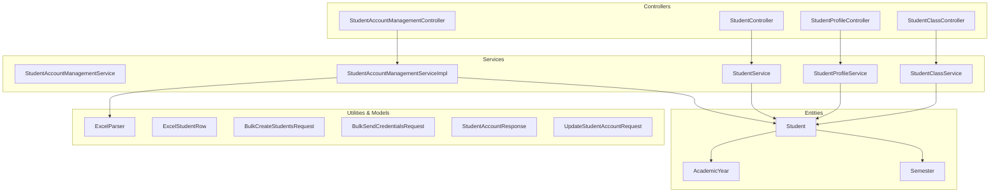
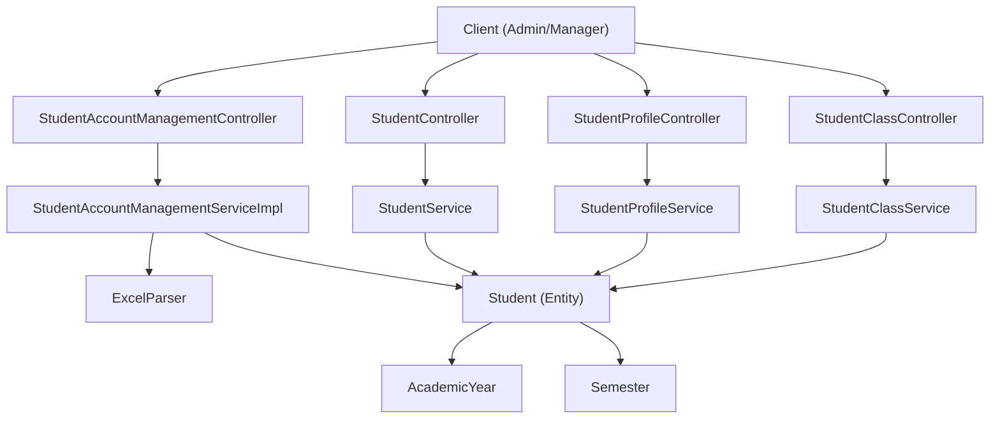
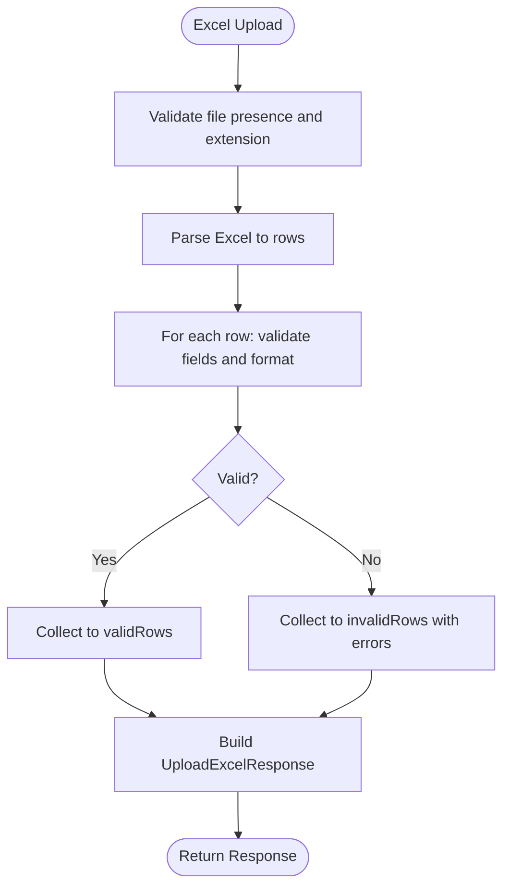
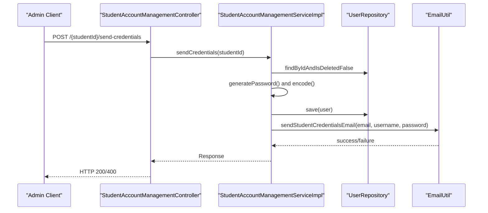
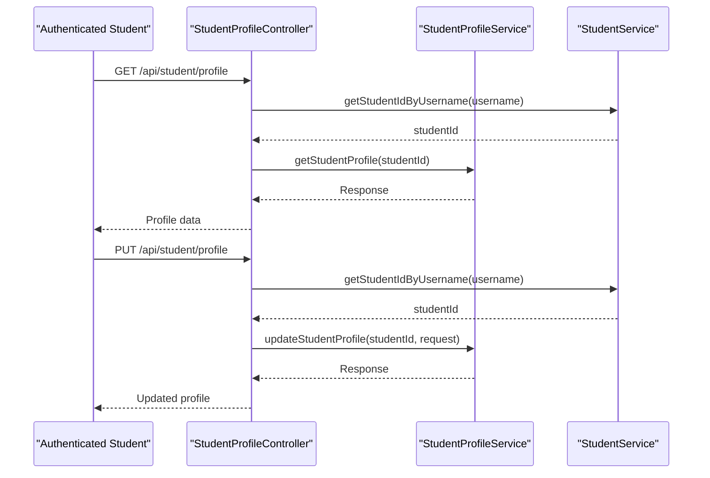
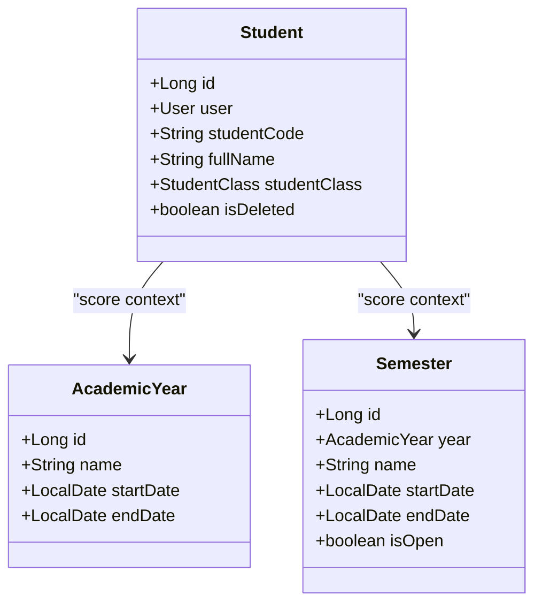
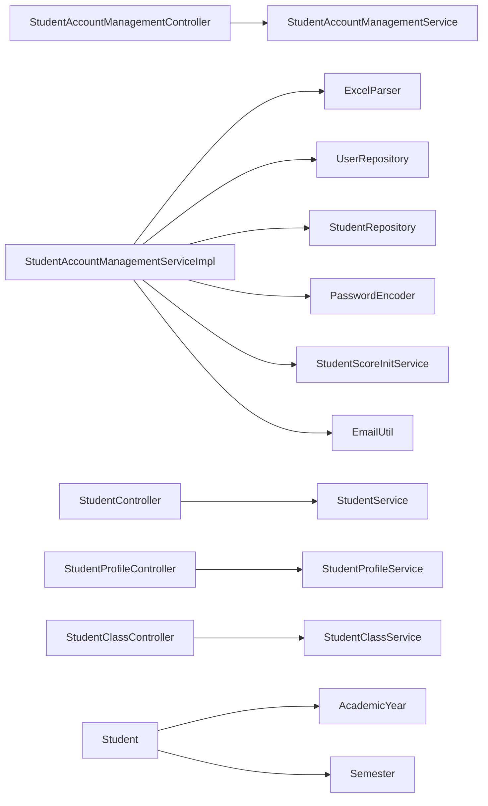

# Student Account Management

<cite>
**Referenced Files in This Document**
- [StudentAccountManagementController.java](file://src/main/java/vn/campuslife/controller/student/StudentAccountManagementController.java)
- [StudentAccountManagementService.java](file://src/main/java/vn/campuslife/service/StudentAccountManagementService.java)
- [StudentAccountManagementServiceImpl.java](file://src/main/java/vn/campuslife/service/impl/StudentAccountManagementServiceImpl.java)
- [StudentController.java](file://src/main/java/vn/campuslife/controller/student/StudentController.java)
- [StudentProfileController.java](file://src/main/java/vn/campuslife/controller/student/StudentProfileController.java)
- [StudentClassController.java](file://src/main/java/vn/campuslife/controller/student/StudentClassController.java)
- [StudentService.java](file://src/main/java/vn/campuslife/service/StudentService.java)
- [StudentProfileService.java](file://src/main/java/vn/campuslife/service/StudentProfileService.java)
- [StudentClassService.java](file://src/main/java/vn/campuslife/service/StudentClassService.java)
- [Student.java](file://src/main/java/vn/campuslife/entity/Student.java)
- [AcademicYear.java](file://src/main/java/vn/campuslife/entity/AcademicYear.java)
- [Semester.java](file://src/main/java/vn/campuslife/entity/Semester.java)
- [ExcelParser.java](file://src/main/java/vn/campuslife/util/ExcelParser.java)
- [ExcelStudentRow.java](file://src/main/java/vn/campuslife/model/student/ExcelStudentRow.java)
- [BulkCreateStudentsRequest.java](file://src/main/java/vn/campuslife/model/student/BulkCreateStudentsRequest.java)
- [BulkSendCredentialsRequest.java](file://src/main/java/vn/campuslife/model/student/BulkSendCredentialsRequest.java)
- [StudentAccountResponse.java](file://src/main/java/vn/campuslife/model/student/StudentAccountResponse.java)
- [UpdateStudentAccountRequest.java](file://src/main/java/vn/campuslife/model/student/UpdateStudentAccountRequest.java)
</cite>

## Table of Contents
1. [Introduction](#introduction)
2. [Project Structure](#project-structure)
3. [Core Components](#core-components)
4. [Architecture Overview](#architecture-overview)
5. [Detailed Component Analysis](#detailed-component-analysis)
6. [Dependency Analysis](#dependency-analysis)
7. [Performance Considerations](#performance-considerations)
8. [Troubleshooting Guide](#troubleshooting-guide)
9. [Conclusion](#conclusion)
10. [Appendices](#appendices)

## Introduction
This document provides comprehensive documentation for student-specific account management features. It covers bulk student creation workflows, credential generation and distribution, and student profile administration. It also documents integrations with academic systems (classes and academic year/semester), bulk operations for student data management, credential sending mechanisms, and the student account lifecycle. Practical examples illustrate student onboarding, bulk data imports, and administrative tasks, alongside troubleshooting guidance and integration notes with academic modules.

## Project Structure
The student account management feature spans controllers, services, repositories, entities, and utilities:
- Controllers expose REST endpoints for admin and student-facing operations.
- Services encapsulate business logic for account management, class enrollment, and profile administration.
- Entities represent domain objects such as Student, AcademicYear, and Semester.
- Utilities support Excel parsing and credential generation.
- Models define request/response structures for bulk operations and account updates.

**Diagram sources**
- [StudentAccountManagementController.java:1-94](file://src/main/java/vn/campuslife/controller/student/StudentAccountManagementController.java#L1-L94)
- [StudentAccountManagementServiceImpl.java:1-507](file://src/main/java/vn/campuslife/service/impl/StudentAccountManagementServiceImpl.java#L1-L507)
- [StudentController.java:1-124](file://src/main/java/vn/campuslife/controller/student/StudentController.java#L1-L124)
- [StudentProfileController.java:1-84](file://src/main/java/vn/campuslife/controller/student/StudentProfileController.java#L1-L84)
- [StudentClassController.java:1-164](file://src/main/java/vn/campuslife/controller/student/StudentClassController.java#L1-L164)
- [Student.java:1-78](file://src/main/java/vn/campuslife/entity/Student.java#L1-L78)
- [AcademicYear.java:1-37](file://src/main/java/vn/campuslife/entity/AcademicYear.java#L1-L37)
- [Semester.java:1-44](file://src/main/java/vn/campuslife/entity/Semester.java#L1-L44)
- [ExcelParser.java:1-171](file://src/main/java/vn/campuslife/util/ExcelParser.java#L1-L171)
- [ExcelStudentRow.java:1-19](file://src/main/java/vn/campuslife/model/student/ExcelStudentRow.java#L1-L19)
- [BulkCreateStudentsRequest.java:1-19](file://src/main/java/vn/campuslife/model/student/BulkCreateStudentsRequest.java#L1-L19)
- [BulkSendCredentialsRequest.java:1-19](file://src/main/java/vn/campuslife/model/student/BulkSendCredentialsRequest.java#L1-L19)
- [StudentAccountResponse.java:1-29](file://src/main/java/vn/campuslife/model/student/StudentAccountResponse.java#L1-L29)
- [UpdateStudentAccountRequest.java:1-20](file://src/main/java/vn/campuslife/model/student/UpdateStudentAccountRequest.java#L1-L20)

**Section sources**
- [StudentAccountManagementController.java:1-94](file://src/main/java/vn/campuslife/controller/student/StudentAccountManagementController.java#L1-L94)
- [StudentAccountManagementServiceImpl.java:1-507](file://src/main/java/vn/campuslife/service/impl/StudentAccountManagementServiceImpl.java#L1-L507)
- [StudentController.java:1-124](file://src/main/java/vn/campuslife/controller/student/StudentController.java#L1-L124)
- [StudentProfileController.java:1-84](file://src/main/java/vn/campuslife/controller/student/StudentProfileController.java#L1-L84)
- [StudentClassController.java:1-164](file://src/main/java/vn/campuslife/controller/student/StudentClassController.java#L1-L164)
- [Student.java:1-78](file://src/main/java/vn/campuslife/entity/Student.java#L1-L78)
- [AcademicYear.java:1-37](file://src/main/java/vn/campuslife/entity/AcademicYear.java#L1-L37)
- [Semester.java:1-44](file://src/main/java/vn/campuslife/entity/Semester.java#L1-L44)
- [ExcelParser.java:1-171](file://src/main/java/vn/campuslife/util/ExcelParser.java#L1-L171)
- [ExcelStudentRow.java:1-19](file://src/main/java/vn/campuslife/model/student/ExcelStudentRow.java#L1-L19)
- [BulkCreateStudentsRequest.java:1-19](file://src/main/java/vn/campuslife/model/student/BulkCreateStudentsRequest.java#L1-L19)
- [BulkSendCredentialsRequest.java:1-19](file://src/main/java/vn/campuslife/model/student/BulkSendCredentialsRequest.java#L1-L19)
- [StudentAccountResponse.java:1-29](file://src/main/java/vn/campuslife/model/student/StudentAccountResponse.java#L1-L29)
- [UpdateStudentAccountRequest.java:1-20](file://src/main/java/vn/campuslife/model/student/UpdateStudentAccountRequest.java#L1-L20)

## Core Components
- StudentAccountManagementController: Exposes admin endpoints for Excel upload, bulk student creation, pending accounts listing, account updates/deletion, and credential sending (single and bulk).
- StudentAccountManagementServiceImpl: Implements business logic for Excel parsing, validation, bulk account creation, pending account retrieval, account updates, soft deletion, single and bulk credential sending, and score initialization.
- StudentController: Provides student listing, search, filtering by department and class assignment status, and retrieval by ID/username.
- StudentProfileController: Manages student profile retrieval and updates for authenticated users and admin-level lookup by username.
- StudentClassController: Supports CRUD operations for classes and enrollment actions (add/remove students).
- Entities AcademicYear and Semester: Support academic year and semester management used by score initialization.
- Utilities and Models: ExcelParser for parsing Excel files, and DTOs for requests/responses.

Key capabilities:
- Bulk student creation from Excel with validation and error reporting.
- Credential generation and secure email delivery.
- Pending account review and lifecycle management (update, delete).
- Integration with class enrollment and academic year/semester for score initialization.

**Section sources**
- [StudentAccountManagementController.java:1-94](file://src/main/java/vn/campuslife/controller/student/StudentAccountManagementController.java#L1-L94)
- [StudentAccountManagementService.java:1-50](file://src/main/java/vn/campuslife/service/StudentAccountManagementService.java#L1-L50)
- [StudentAccountManagementServiceImpl.java:1-507](file://src/main/java/vn/campuslife/service/impl/StudentAccountManagementServiceImpl.java#L1-L507)
- [StudentController.java:1-124](file://src/main/java/vn/campuslife/controller/student/StudentController.java#L1-L124)
- [StudentProfileController.java:1-84](file://src/main/java/vn/campuslife/controller/student/StudentProfileController.java#L1-L84)
- [StudentClassController.java:1-164](file://src/main/java/vn/campuslife/controller/student/StudentClassController.java#L1-L164)
- [AcademicYear.java:1-37](file://src/main/java/vn/campuslife/entity/AcademicYear.java#L1-L37)
- [Semester.java:1-44](file://src/main/java/vn/campuslife/entity/Semester.java#L1-L44)
- [ExcelParser.java:1-171](file://src/main/java/vn/campuslife/util/ExcelParser.java#L1-L171)
- [ExcelStudentRow.java:1-19](file://src/main/java/vn/campuslife/model/student/ExcelStudentRow.java#L1-L19)
- [BulkCreateStudentsRequest.java:1-19](file://src/main/java/vn/campuslife/model/student/BulkCreateStudentsRequest.java#L1-L19)
- [BulkSendCredentialsRequest.java:1-19](file://src/main/java/vn/campuslife/model/student/BulkSendCredentialsRequest.java#L1-L19)
- [StudentAccountResponse.java:1-29](file://src/main/java/vn/campuslife/model/student/StudentAccountResponse.java#L1-L29)
- [UpdateStudentAccountRequest.java:1-20](file://src/main/java/vn/campuslife/model/student/UpdateStudentAccountRequest.java#L1-L20)

## Architecture Overview
The system follows a layered architecture:
- Presentation Layer: Controllers handle HTTP requests and responses.
- Application Layer: Services orchestrate business logic and coordinate with repositories/utilities.
- Domain Layer: Entities represent persistent data structures.
- Infrastructure Layer: Utilities (Excel parsing, password generation, email utilities) support core operations.

**Diagram sources**
- [StudentAccountManagementController.java:1-94](file://src/main/java/vn/campuslife/controller/student/StudentAccountManagementController.java#L1-L94)
- [StudentAccountManagementServiceImpl.java:1-507](file://src/main/java/vn/campuslife/service/impl/StudentAccountManagementServiceImpl.java#L1-L507)
- [StudentController.java:1-124](file://src/main/java/vn/campuslife/controller/student/StudentController.java#L1-L124)
- [StudentProfileController.java:1-84](file://src/main/java/vn/campuslife/controller/student/StudentProfileController.java#L1-L84)
- [StudentClassController.java:1-164](file://src/main/java/vn/campuslife/controller/student/StudentClassController.java#L1-L164)
- [Student.java:1-78](file://src/main/java/vn/campuslife/entity/Student.java#L1-L78)
- [AcademicYear.java:1-37](file://src/main/java/vn/campuslife/entity/AcademicYear.java#L1-L37)
- [Semester.java:1-44](file://src/main/java/vn/campuslife/entity/Semester.java#L1-L44)
- [ExcelParser.java:1-171](file://src/main/java/vn/campuslife/util/ExcelParser.java#L1-L171)

## Detailed Component Analysis

### Student Account Management Controller
Endpoints:
- Upload Excel: POST /api/admin/students/upload-excel
- Bulk create students: POST /api/admin/students/bulk-create
- Get pending accounts: GET /api/admin/students/pending
- Update student account: PUT /api/admin/students/{studentId}/account
- Delete student account: DELETE /api/admin/students/{studentId}/account
- Send credentials (single): POST /api/admin/students/{studentId}/send-credentials
- Send credentials (bulk): POST /api/admin/students/bulk-send-credentials

Behavior highlights:
- Validates file type and parses Excel via ExcelParser.
- Returns structured Response objects with status, message, and payload.
- Uses dedicated service methods for all operations.

**Section sources**
- [StudentAccountManagementController.java:1-94](file://src/main/java/vn/campuslife/controller/student/StudentAccountManagementController.java#L1-L94)

### Student Account Management Service Implementation
Responsibilities:
- Excel upload and parsing with validation and error collection.
- Bulk student creation with uniqueness checks (username/email/studentCode), password generation, user/student entity creation, and score initialization.
- Pending accounts listing with sorting and emailSent inference.
- Account updates with validation and uniqueness checks.
- Soft deletion of student and associated user.
- Single and bulk credential sending with password regeneration and email dispatch.

```mermaid
sequenceDiagram
participant Admin as "Admin Client"
participant Ctrl as "StudentAccountManagementController"
participant Svc as "StudentAccountManagementServiceImpl"
participant RepoU as "UserRepository"
participant RepoS as "StudentRepository"
participant Score as "StudentScoreInitService"
participant Mail as "EmailUtil"
Admin->>Ctrl : POST /bulk-create
Ctrl->>Svc : bulkCreateStudents(request)
loop For each Excel row
Svc->>RepoU : findByUsername / findByEmail
Svc->>RepoS : findByUserUsernameAndIsDeletedFalse
Svc->>Svc : generatePassword()
Svc->>RepoU : save(User)
Svc->>RepoS : save(Student)
Svc->>Score : initializeStudentScoresForCurrentSemester()
end
Svc-->>Ctrl : Response {createdAccounts, errors}
Ctrl-->>Admin : HTTP 200/400
```

**Diagram sources**
- [StudentAccountManagementController.java:34-38](file://src/main/java/vn/campuslife/controller/student/StudentAccountManagementController.java#L34-L38)
- [StudentAccountManagementServiceImpl.java:100-217](file://src/main/java/vn/campuslife/service/impl/StudentAccountManagementServiceImpl.java#L100-L217)

**Section sources**
- [StudentAccountManagementServiceImpl.java:1-507](file://src/main/java/vn/campuslife/service/impl/StudentAccountManagementServiceImpl.java#L1-L507)

### Excel Parsing and Validation
ExcelParser supports:
- Reading .xlsx/.xls files.
- Detecting headers and mapping columns to studentCode/fullName/email.
- Robust cell value extraction and trimming.
- Returning lists of ExcelStudentRow for downstream processing.

Validation rules applied during bulk creation:
- Required fields: studentCode, fullName, email.
- Email format validation.
- Uniqueness checks for username and email across User, and studentCode across Student.

**Diagram sources**
- [StudentAccountManagementServiceImpl.java:40-98](file://src/main/java/vn/campuslife/service/impl/StudentAccountManagementServiceImpl.java#L40-L98)
- [ExcelParser.java:26-76](file://src/main/java/vn/campuslife/util/ExcelParser.java#L26-L76)

**Section sources**
- [ExcelParser.java:1-171](file://src/main/java/vn/campuslife/util/ExcelParser.java#L1-L171)
- [StudentAccountManagementServiceImpl.java:40-98](file://src/main/java/vn/campuslife/service/impl/StudentAccountManagementServiceImpl.java#L40-L98)

### Credential Generation and Distribution
Mechanisms:
- Single credential send: Generates new password, updates user, sends email.
- Bulk credential send: Iterates student IDs, regenerates passwords, and attempts email dispatch per student, aggregating success/error lists.

Integration points:
- PasswordGenerator for secure random passwords.
- PasswordEncoder for hashing.
- EmailUtil for sending credentials emails.

**Diagram sources**
- [StudentAccountManagementController.java:76-80](file://src/main/java/vn/campuslife/controller/student/StudentAccountManagementController.java#L76-L80)
- [StudentAccountManagementServiceImpl.java:394-429](file://src/main/java/vn/campuslife/service/impl/StudentAccountManagementServiceImpl.java#L394-L429)

**Section sources**
- [StudentAccountManagementServiceImpl.java:394-495](file://src/main/java/vn/campuslife/service/impl/StudentAccountManagementServiceImpl.java#L394-L495)

### Student Profile Administration
Endpoints:
- Retrieve own profile: GET /api/student/profile
- Update own profile: PUT /api/student/profile
- Retrieve profile by username: GET /api/student/profile/{username} (admin/manager)

Services:
- StudentProfileService handles profile creation, updates, and retrieval.
- StudentService provides student lookup by username/userId and various filters.

**Diagram sources**
- [StudentProfileController.java:24-60](file://src/main/java/vn/campuslife/controller/student/StudentProfileController.java#L24-L60)
- [StudentProfileService.java:1-28](file://src/main/java/vn/campuslife/service/StudentProfileService.java#L1-L28)
- [StudentService.java:1-47](file://src/main/java/vn/campuslife/service/StudentService.java#L1-L47)

**Section sources**
- [StudentProfileController.java:1-84](file://src/main/java/vn/campuslife/controller/student/StudentProfileController.java#L1-L84)
- [StudentProfileService.java:1-28](file://src/main/java/vn/campuslife/service/StudentProfileService.java#L1-L28)
- [StudentService.java:1-47](file://src/main/java/vn/campuslife/service/StudentService.java#L1-L47)

### Class Enrollment and Academic Year Management
Endpoints:
- Create/update/delete classes.
- Retrieve classes by department/name.
- Add/remove students from classes.
- List students in a class.

Integration:
- Student entity maintains a relationship to StudentClass.
- AcademicYear and Semester entities support academic calendar and score initialization contexts.

**Diagram sources**
- [Student.java:1-78](file://src/main/java/vn/campuslife/entity/Student.java#L1-L78)
- [AcademicYear.java:1-37](file://src/main/java/vn/campuslife/entity/AcademicYear.java#L1-L37)
- [Semester.java:1-44](file://src/main/java/vn/campuslife/entity/Semester.java#L1-L44)

**Section sources**
- [StudentClassController.java:1-164](file://src/main/java/vn/campuslife/controller/student/StudentClassController.java#L1-L164)
- [Student.java:1-78](file://src/main/java/vn/campuslife/entity/Student.java#L1-L78)
- [AcademicYear.java:1-37](file://src/main/java/vn/campuslife/entity/AcademicYear.java#L1-L37)
- [Semester.java:1-44](file://src/main/java/vn/campuslife/entity/Semester.java#L1-L44)

### Student Listing and Search
Endpoints:
- List all students with pagination and sorting.
- Search students by keyword.
- Filter students without class.
- Filter students by department.
- Retrieve student by ID or username.

These endpoints support administrative oversight and integration with class enrollment workflows.

**Section sources**
- [StudentController.java:1-124](file://src/main/java/vn/campuslife/controller/student/StudentController.java#L1-L124)
- [StudentService.java:1-47](file://src/main/java/vn/campuslife/service/StudentService.java#L1-L47)

## Dependency Analysis
Key dependencies and relationships:
- StudentAccountManagementController depends on StudentAccountManagementService.
- StudentAccountManagementServiceImpl depends on ExcelParser, UserRepository, StudentRepository, PasswordEncoder, StudentScoreInitService, and EmailUtil.
- StudentController depends on StudentService.
- StudentProfileController depends on StudentProfileService and StudentService.
- StudentClassController depends on StudentClassService.
- Student entity references AcademicYear and Semester for academic context.

**Diagram sources**
- [StudentAccountManagementController.java:1-94](file://src/main/java/vn/campuslife/controller/student/StudentAccountManagementController.java#L1-L94)
- [StudentAccountManagementServiceImpl.java:1-507](file://src/main/java/vn/campuslife/service/impl/StudentAccountManagementServiceImpl.java#L1-L507)
- [StudentController.java:1-124](file://src/main/java/vn/campuslife/controller/student/StudentController.java#L1-L124)
- [StudentProfileController.java:1-84](file://src/main/java/vn/campuslife/controller/student/StudentProfileController.java#L1-L84)
- [StudentClassController.java:1-164](file://src/main/java/vn/campuslife/controller/student/StudentClassController.java#L1-L164)
- [Student.java:1-78](file://src/main/java/vn/campuslife/entity/Student.java#L1-L78)
- [AcademicYear.java:1-37](file://src/main/java/vn/campuslife/entity/AcademicYear.java#L1-L37)
- [Semester.java:1-44](file://src/main/java/vn/campuslife/entity/Semester.java#L1-L44)

**Section sources**
- [StudentAccountManagementServiceImpl.java:1-507](file://src/main/java/vn/campuslife/service/impl/StudentAccountManagementServiceImpl.java#L1-L507)
- [Student.java:1-78](file://src/main/java/vn/campuslife/entity/Student.java#L1-L78)

## Performance Considerations
- Batch operations: Bulk creation and bulk credential sending iterate over collections; consider pagination and chunking for very large datasets.
- Unique checks: Multiple database queries per row for uniqueness; optimize with batch existence checks if throughput demands.
- Email dispatch: Asynchronous email sending can improve responsiveness; current implementation appears synchronous.
- Sorting and pagination: Use efficient database indexes on frequently sorted fields (createdAt, fullName, studentCode).
- Transaction boundaries: Bulk operations wrap multiple saves; ensure transaction timeouts and rollback strategies are configured appropriately.

## Troubleshooting Guide
Common issues and resolutions:
- Excel upload failures:
  - Ensure file is .xlsx or .xls and not empty.
  - Verify required columns (studentCode, fullName, email) and correct header detection.
  - Review returned error map for row-specific issues.
- Duplicate identifiers:
  - Username (studentCode) or email already exists; change to unique values.
  - StudentCode must be unique across Student records.
- Account update errors:
  - Invalid email format or duplicate email/username/studentCode.
  - No fields to update if all provided fields are blank/unchanged.
- Credential sending failures:
  - User not found or soft-deleted.
  - Email provider configuration issues; check logs for transport errors.
- Pending accounts status:
  - emailSent inferred from lastLogin; frontend should rely on lastLogin rather than emailSent field for accurate state.

Operational tips:
- Use GET /api/admin/students/pending to review newly created accounts before credential dispatch.
- For bulk credential sending, inspect successList and errorList to identify problematic entries.
- Monitor score initialization warnings; failures do not block account creation but may require manual score reconciliation.

**Section sources**
- [StudentAccountManagementServiceImpl.java:40-98](file://src/main/java/vn/campuslife/service/impl/StudentAccountManagementServiceImpl.java#L40-L98)
- [StudentAccountManagementServiceImpl.java:100-217](file://src/main/java/vn/campuslife/service/impl/StudentAccountManagementServiceImpl.java#L100-L217)
- [StudentAccountManagementServiceImpl.java:273-365](file://src/main/java/vn/campuslife/service/impl/StudentAccountManagementServiceImpl.java#L273-L365)
- [StudentAccountManagementServiceImpl.java:394-495](file://src/main/java/vn/campuslife/service/impl/StudentAccountManagementServiceImpl.java#L394-L495)

## Conclusion
The student account management subsystem provides robust capabilities for bulk onboarding, credential distribution, profile administration, and integration with class enrollment and academic calendars. Its layered design ensures clear separation of concerns, while utilities and models support reliable data ingestion and processing. Administrators can efficiently manage student lifecycles, troubleshoot issues, and maintain data integrity through comprehensive validation, error reporting, and audit-friendly operations.

## Appendices

### Practical Examples

- Student Onboarding (Bulk):
  - Upload Excel via POST /api/admin/students/upload-excel.
  - Review parsed rows and errors.
  - Submit POST /api/admin/students/bulk-create with validated rows.
  - Optionally send credentials via POST /api/admin/students/bulk-send-credentials.

- Administrative Tasks:
  - Update student account: PUT /api/admin/students/{studentId}/account with UpdateStudentAccountRequest.
  - Soft delete account: DELETE /api/admin/students/{studentId}/account.
  - View pending accounts: GET /api/admin/students/pending.

- Class Enrollment:
  - Create class: POST /api/classes with className, description, departmentId.
  - Enroll student: POST /api/classes/{classId}/students/{studentId}.
  - Remove student: DELETE /api/classes/{classId}/students/{studentId}.

- Academic Year Management:
  - Use AcademicYear and Semester entities to define academic periods.
  - Scores are initialized against the current semester context.

**Section sources**
- [StudentAccountManagementController.java:24-90](file://src/main/java/vn/campuslife/controller/student/StudentAccountManagementController.java#L24-L90)
- [StudentClassController.java:20-147](file://src/main/java/vn/campuslife/controller/student/StudentClassController.java#L20-L147)
- [AcademicYear.java:1-37](file://src/main/java/vn/campuslife/entity/AcademicYear.java#L1-L37)
- [Semester.java:1-44](file://src/main/java/vn/campuslife/entity/Semester.java#L1-L44)