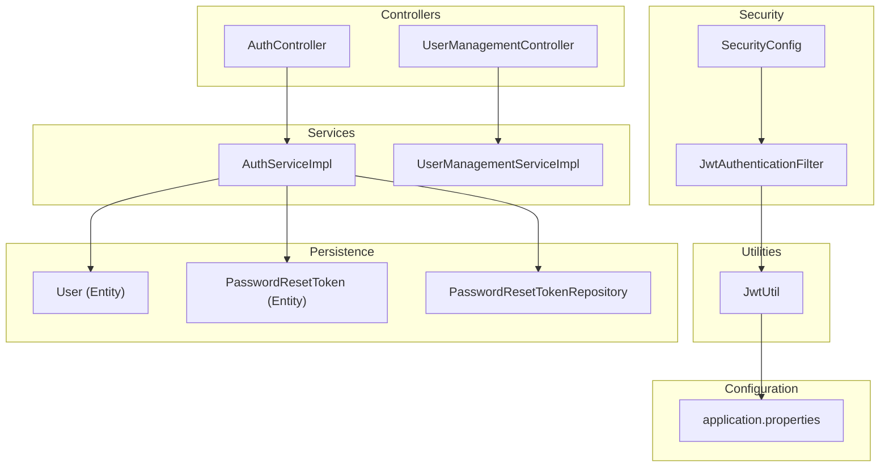
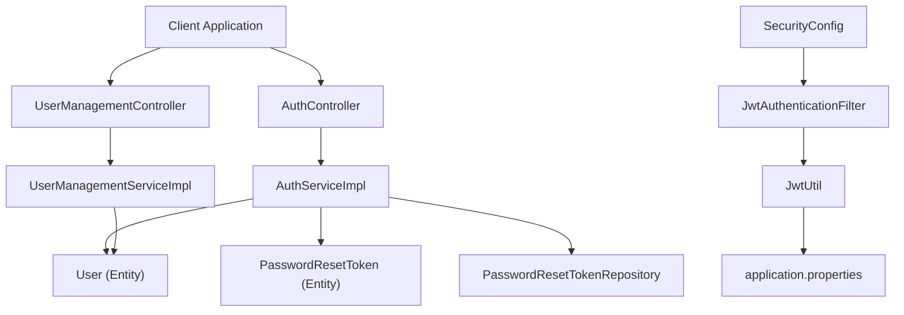
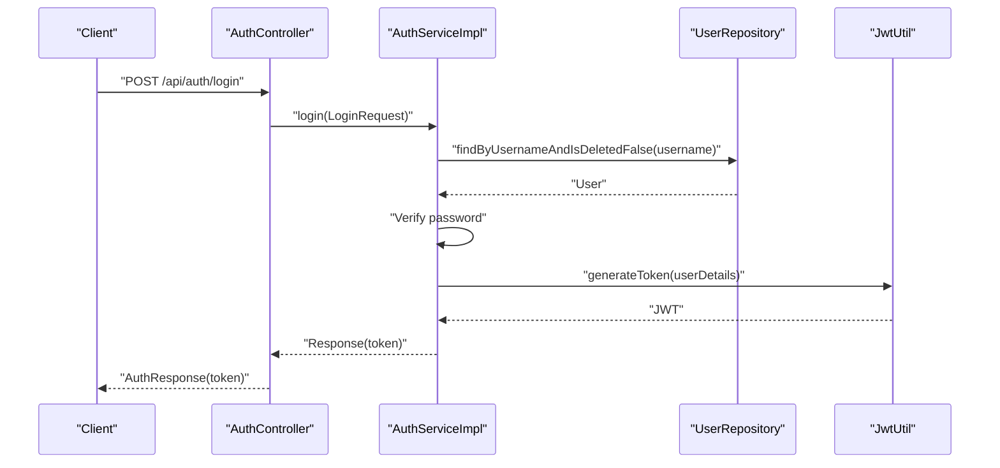
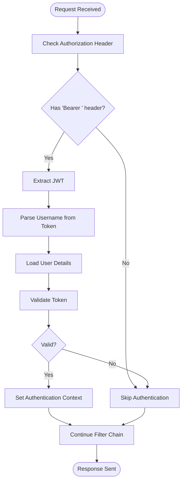
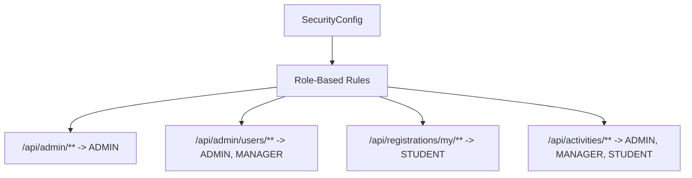
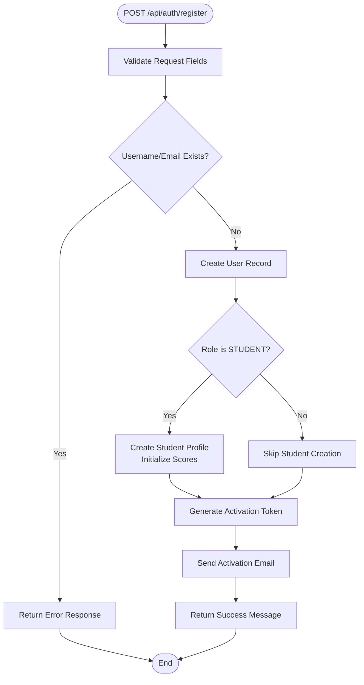
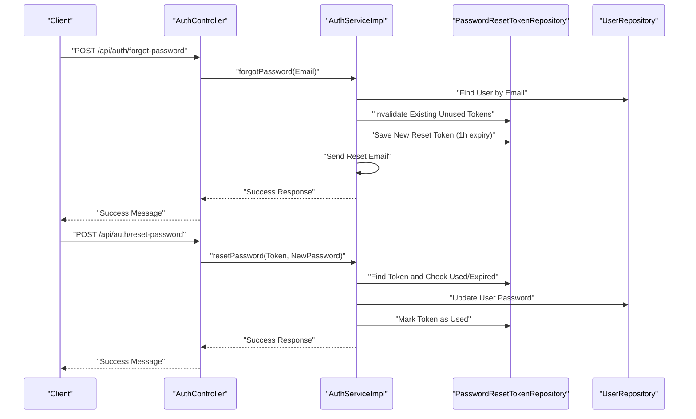
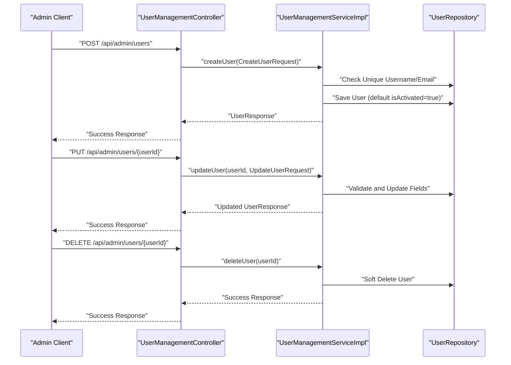
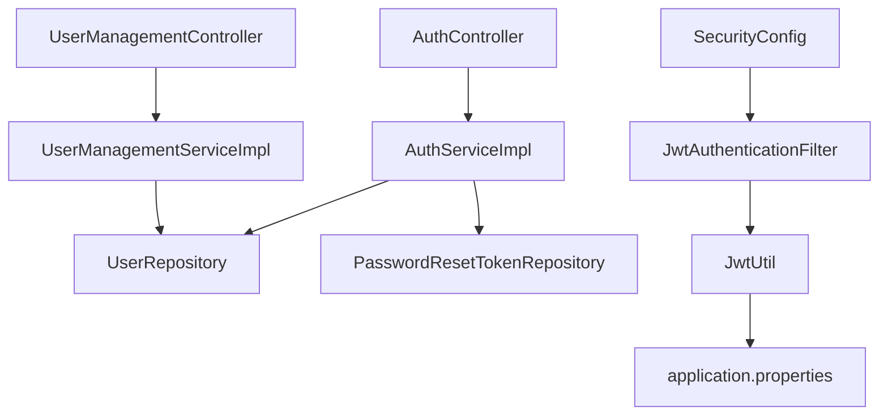
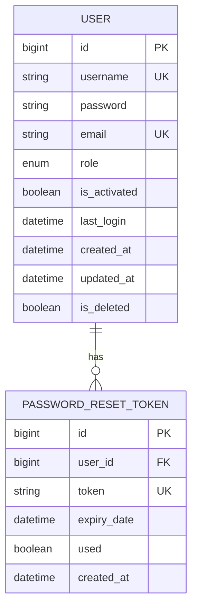

# User Management System

<cite>
**Referenced Files in This Document**
- [AuthController.java](file://src/main/java/vn/campuslife/controller/auth/AuthController.java)
- [UserManagementController.java](file://src/main/java/vn/campuslife/controller/auth/UserManagementController.java)
- [AuthServiceImpl.java](file://src/main/java/vn/campuslife/service/impl/AuthServiceImpl.java)
- [UserManagementServiceImpl.java](file://src/main/java/vn/campuslife/service/impl/UserManagementServiceImpl.java)
- [SecurityConfig.java](file://src/main/java/vn/campuslife/config/SecurityConfig.java)
- [JwtAuthenticationFilter.java](file://src/main/java/vn/campuslife/filter/JwtAuthenticationFilter.java)
- [JwtUtil.java](file://src/main/java/vn/campuslife/util/JwtUtil.java)
- [Role.java](file://src/main/java/vn/campuslife/enumeration/Role.java)
- [User.java](file://src/main/java/vn/campuslife/entity/User.java)
- [PasswordResetToken.java](file://src/main/java/vn/campuslife/entity/PasswordResetToken.java)
- [PasswordResetTokenRepository.java](file://src/main/java/vn/campuslife/repository/PasswordResetTokenRepository.java)
- [application.properties](file://src/main/resources/application.properties)
- [LoginRequest.java](file://src/main/java/vn/campuslife/model/LoginRequest.java)
- [CreateUserRequest.java](file://src/main/java/vn/campuslife/model/CreateUserRequest.java)
</cite>

## Table of Contents
1. [Introduction](#introduction)
2. [Project Structure](#project-structure)
3. [Core Components](#core-components)
4. [Architecture Overview](#architecture-overview)
5. [Detailed Component Analysis](#detailed-component-analysis)
6. [Dependency Analysis](#dependency-analysis)
7. [Performance Considerations](#performance-considerations)
8. [Troubleshooting Guide](#troubleshooting-guide)
9. [Conclusion](#conclusion)
10. [Appendices](#appendices)

## Introduction
This document provides comprehensive documentation for the User Management System, focusing on authentication, authorization, user registration, and account management. It explains the JWT-based authentication flow, role-based access control (ADMIN, MANAGER, STUDENT), password reset mechanisms, and session management. It also documents user registration workflows, profile management, credential validation, and security measures. Practical examples of user lifecycle management, permission checking, and integration with the broader system are included, along with common authentication scenarios, security best practices, and troubleshooting guidance.

## Project Structure
The User Management System is implemented as a Spring Boot application with layered architecture:
- Controllers handle HTTP requests for authentication and user management.
- Services encapsulate business logic for authentication, user creation/update/delete, and password reset.
- Security configuration enforces method-level and HTTP-level authorization rules.
- Utilities provide JWT token generation and validation.
- Entities and repositories define persistence for users, activation tokens, and password reset tokens.
- Configuration files manage application settings, including JWT secrets and database/email properties.

**Diagram sources**
- [AuthController.java:1-98](file://src/main/java/vn/campuslife/controller/auth/AuthController.java#L1-L98)
- [UserManagementController.java:1-119](file://src/main/java/vn/campuslife/controller/auth/UserManagementController.java#L1-L119)
- [AuthServiceImpl.java:1-339](file://src/main/java/vn/campuslife/service/impl/AuthServiceImpl.java#L1-L339)
- [UserManagementServiceImpl.java:1-290](file://src/main/java/vn/campuslife/service/impl/UserManagementServiceImpl.java#L1-L290)
- [SecurityConfig.java:1-302](file://src/main/java/vn/campuslife/config/SecurityConfig.java#L1-L302)
- [JwtAuthenticationFilter.java:1-105](file://src/main/java/vn/campuslife/filter/JwtAuthenticationFilter.java#L1-L105)
- [JwtUtil.java:1-91](file://src/main/java/vn/campuslife/util/JwtUtil.java#L1-L91)
- [User.java:1-50](file://src/main/java/vn/campuslife/entity/User.java#L1-L50)
- [PasswordResetToken.java:1-39](file://src/main/java/vn/campuslife/entity/PasswordResetToken.java#L1-L39)
- [PasswordResetTokenRepository.java:1-23](file://src/main/java/vn/campuslife/repository/PasswordResetTokenRepository.java#L1-L23)
- [application.properties:1-86](file://src/main/resources/application.properties#L1-L86)

**Section sources**
- [AuthController.java:1-98](file://src/main/java/vn/campuslife/controller/auth/AuthController.java#L1-L98)
- [UserManagementController.java:1-119](file://src/main/java/vn/campuslife/controller/auth/UserManagementController.java#L1-L119)
- [SecurityConfig.java:1-302](file://src/main/java/vn/campuslife/config/SecurityConfig.java#L1-L302)
- [application.properties:1-86](file://src/main/resources/application.properties#L1-L86)

## Core Components
- Authentication Controller: Exposes endpoints for registration, login, account verification, forgot password, reset password, and change password.
- User Management Controller: Provides administrative endpoints for creating, updating, deleting, retrieving users, and listing users filtered by role.
- Authentication Service: Implements login, registration, account verification, forgot password, reset password, and change password with validation, token management, and email notifications.
- User Management Service: Handles user CRUD operations with soft deletion, role validation, and activation status updates.
- Security Configuration: Defines public and protected endpoints, method-level security, and role-based access rules.
- JWT Utilities: Generates and validates JWT tokens with role claims and expiration handling.
- Persistence Layer: Manages users, activation tokens, and password reset tokens with repository support.

**Section sources**
- [AuthController.java:1-98](file://src/main/java/vn/campuslife/controller/auth/AuthController.java#L1-L98)
- [UserManagementController.java:1-119](file://src/main/java/vn/campuslife/controller/auth/UserManagementController.java#L1-L119)
- [AuthServiceImpl.java:1-339](file://src/main/java/vn/campuslife/service/impl/AuthServiceImpl.java#L1-L339)
- [UserManagementServiceImpl.java:1-290](file://src/main/java/vn/campuslife/service/impl/UserManagementServiceImpl.java#L1-L290)
- [SecurityConfig.java:1-302](file://src/main/java/vn/campuslife/config/SecurityConfig.java#L1-L302)
- [JwtUtil.java:1-91](file://src/main/java/vn/campuslife/util/JwtUtil.java#L1-L91)
- [User.java:1-50](file://src/main/java/vn/campuslife/entity/User.java#L1-L50)
- [PasswordResetToken.java:1-39](file://src/main/java/vn/campuslife/entity/PasswordResetToken.java#L1-L39)
- [PasswordResetTokenRepository.java:1-23](file://src/main/java/vn/campuslife/repository/PasswordResetTokenRepository.java#L1-L23)

## Architecture Overview
The system follows a layered architecture with clear separation of concerns:
- Presentation Layer: REST controllers expose endpoints for authentication and user management.
- Business Logic Layer: Services implement domain-specific logic and orchestrate repository operations.
- Security Layer: Spring Security integrates with JWT filters and method-level security annotations.
- Persistence Layer: JPA repositories manage data access for users and tokens.
- Configuration Layer: Properties files configure JWT secrets, database connections, email settings, and CORS.

**Diagram sources**
- [AuthController.java:1-98](file://src/main/java/vn/campuslife/controller/auth/AuthController.java#L1-L98)
- [UserManagementController.java:1-119](file://src/main/java/vn/campuslife/controller/auth/UserManagementController.java#L1-L119)
- [AuthServiceImpl.java:1-339](file://src/main/java/vn/campuslife/service/impl/AuthServiceImpl.java#L1-L339)
- [UserManagementServiceImpl.java:1-290](file://src/main/java/vn/campuslife/service/impl/UserManagementServiceImpl.java#L1-L290)
- [SecurityConfig.java:1-302](file://src/main/java/vn/campuslife/config/SecurityConfig.java#L1-L302)
- [JwtAuthenticationFilter.java:1-105](file://src/main/java/vn/campuslife/filter/JwtAuthenticationFilter.java#L1-L105)
- [JwtUtil.java:1-91](file://src/main/java/vn/campuslife/util/JwtUtil.java#L1-L91)
- [User.java:1-50](file://src/main/java/vn/campuslife/entity/User.java#L1-L50)
- [PasswordResetToken.java:1-39](file://src/main/java/vn/campuslife/entity/PasswordResetToken.java#L1-L39)
- [PasswordResetTokenRepository.java:1-23](file://src/main/java/vn/campuslife/repository/PasswordResetTokenRepository.java#L1-L23)
- [application.properties:1-86](file://src/main/resources/application.properties#L1-L86)

## Detailed Component Analysis

### Authentication Flow (JWT-based)
The authentication flow uses stateless JWT tokens:
- Clients send credentials to the login endpoint.
- The service validates credentials and generates a JWT containing the username and role.
- Subsequent requests include the JWT in the Authorization header; the filter extracts and validates the token, setting the authentication context.

**Diagram sources**
- [AuthController.java:41-44](file://src/main/java/vn/campuslife/controller/auth/AuthController.java#L41-L44)
- [AuthServiceImpl.java:56-96](file://src/main/java/vn/campuslife/service/impl/AuthServiceImpl.java#L56-L96)
- [JwtUtil.java:56-68](file://src/main/java/vn/campuslife/util/JwtUtil.java#L56-L68)

**Section sources**
- [AuthController.java:41-44](file://src/main/java/vn/campuslife/controller/auth/AuthController.java#L41-L44)
- [AuthServiceImpl.java:56-96](file://src/main/java/vn/campuslife/service/impl/AuthServiceImpl.java#L56-L96)
- [JwtUtil.java:56-68](file://src/main/java/vn/campuslife/util/JwtUtil.java#L56-L68)

### JWT Filter Chain
The JWT filter extracts tokens from the Authorization header, loads user details, validates the token, and sets the authentication context.

**Diagram sources**
- [JwtAuthenticationFilter.java:33-103](file://src/main/java/vn/campuslife/filter/JwtAuthenticationFilter.java#L33-L103)
- [JwtUtil.java:27-44](file://src/main/java/vn/campuslife/util/JwtUtil.java#L27-L44)

**Section sources**
- [JwtAuthenticationFilter.java:33-103](file://src/main/java/vn/campuslife/filter/JwtAuthenticationFilter.java#L33-L103)
- [JwtUtil.java:27-44](file://src/main/java/vn/campuslife/util/JwtUtil.java#L27-L44)

### Role-Based Access Control (RBAC)
Security rules define which roles can access specific endpoints:
- Public endpoints: registration, login, verification, forgot password, reset password.
- Protected endpoints: admin-only, admin/manager, student-only, and mixed-role access.
- Method-level security is enabled to support annotation-based checks.

**Diagram sources**
- [SecurityConfig.java:85-192](file://src/main/java/vn/campuslife/config/SecurityConfig.java#L85-L192)

**Section sources**
- [SecurityConfig.java:85-192](file://src/main/java/vn/campuslife/config/SecurityConfig.java#L85-L192)
- [Role.java:1-7](file://src/main/java/vn/campuslife/enumeration/Role.java#L1-L7)

### User Registration Workflow
The registration process includes validation, uniqueness checks, optional student profile creation, activation token generation, and email delivery.

**Diagram sources**
- [AuthServiceImpl.java:98-170](file://src/main/java/vn/campuslife/service/impl/AuthServiceImpl.java#L98-L170)

**Section sources**
- [AuthServiceImpl.java:98-170](file://src/main/java/vn/campuslife/service/impl/AuthServiceImpl.java#L98-L170)
- [User.java:1-50](file://src/main/java/vn/campuslife/entity/User.java#L1-L50)

### Password Reset Mechanism
The password reset flow ensures security against enumeration attacks and handles token expiration and reuse prevention.

**Diagram sources**
- [AuthController.java:51-69](file://src/main/java/vn/campuslife/controller/auth/AuthController.java#L51-L69)
- [AuthServiceImpl.java:200-287](file://src/main/java/vn/campuslife/service/impl/AuthServiceImpl.java#L200-L287)
- [PasswordResetTokenRepository.java:1-23](file://src/main/java/vn/campuslife/repository/PasswordResetTokenRepository.java#L1-L23)
- [PasswordResetToken.java:1-39](file://src/main/java/vn/campuslife/entity/PasswordResetToken.java#L1-L39)

**Section sources**
- [AuthController.java:51-69](file://src/main/java/vn/campuslife/controller/auth/AuthController.java#L51-L69)
- [AuthServiceImpl.java:200-287](file://src/main/java/vn/campuslife/service/impl/AuthServiceImpl.java#L200-L287)
- [PasswordResetTokenRepository.java:1-23](file://src/main/java/vn/campuslife/repository/PasswordResetTokenRepository.java#L1-L23)
- [PasswordResetToken.java:1-39](file://src/main/java/vn/campuslife/entity/PasswordResetToken.java#L1-L39)

### User Lifecycle Management (Administrative)
Administrators can create, update, delete, and list users with role and activation controls.

**Diagram sources**
- [UserManagementController.java:20-71](file://src/main/java/vn/campuslife/controller/auth/UserManagementController.java#L20-L71)
- [UserManagementServiceImpl.java:44-193](file://src/main/java/vn/campuslife/service/impl/UserManagementServiceImpl.java#L44-L193)
- [User.java:1-50](file://src/main/java/vn/campuslife/entity/User.java#L1-L50)

**Section sources**
- [UserManagementController.java:20-71](file://src/main/java/vn/campuslife/controller/auth/UserManagementController.java#L20-L71)
- [UserManagementServiceImpl.java:44-193](file://src/main/java/vn/campuslife/service/impl/UserManagementServiceImpl.java#L44-L193)
- [User.java:1-50](file://src/main/java/vn/campuslife/entity/User.java#L1-L50)

### Session Management
The system operates in stateless mode:
- No server-side session storage.
- JWT tokens carry user identity and roles.
- Session policy is configured as STATELESS in security configuration.

**Section sources**
- [SecurityConfig.java:64-64](file://src/main/java/vn/campuslife/config/SecurityConfig.java#L64-L64)
- [JwtUtil.java:56-68](file://src/main/java/vn/campuslife/util/JwtUtil.java#L56-L68)

### Credential Validation
Validation rules enforced during authentication and user management:
- Username and password presence for login.
- Email and password presence for registration.
- Password minimum length checks.
- Unique username and email constraints.
- Role validation for administrative user creation and updates.

**Section sources**
- [AuthServiceImpl.java:56-96](file://src/main/java/vn/campuslife/service/impl/AuthServiceImpl.java#L56-L96)
- [AuthServiceImpl.java:98-170](file://src/main/java/vn/campuslife/service/impl/AuthServiceImpl.java#L98-L170)
- [UserManagementServiceImpl.java:44-97](file://src/main/java/vn/campuslife/service/impl/UserManagementServiceImpl.java#L44-L97)
- [UserManagementServiceImpl.java:100-168](file://src/main/java/vn/campuslife/service/impl/UserManagementServiceImpl.java#L100-L168)

### Security Measures
- Password hashing using BCrypt.
- JWT secret and expiration configured via environment variables.
- Email-based account verification and password reset with secure tokens.
- CORS configuration for cross-origin resource sharing.
- Soft deletion for user records.

**Section sources**
- [SecurityConfig.java:41-43](file://src/main/java/vn/campuslife/config/SecurityConfig.java#L41-L43)
- [application.properties:62-66](file://src/main/resources/application.properties#L62-L66)
- [User.java:27-28](file://src/main/java/vn/campuslife/entity/User.java#L27-L28)
- [UserManagementServiceImpl.java:170-193](file://src/main/java/vn/campuslife/service/impl/UserManagementServiceImpl.java#L170-L193)

## Dependency Analysis
The system exhibits clear layering with low coupling between components:
- Controllers depend on services.
- Services depend on repositories and utilities.
- Security configuration depends on filters and user details service.
- Entities and repositories form the persistence layer.

**Diagram sources**
- [AuthController.java:1-98](file://src/main/java/vn/campuslife/controller/auth/AuthController.java#L1-L98)
- [UserManagementController.java:1-119](file://src/main/java/vn/campuslife/controller/auth/UserManagementController.java#L1-L119)
- [AuthServiceImpl.java:1-339](file://src/main/java/vn/campuslife/service/impl/AuthServiceImpl.java#L1-L339)
- [UserManagementServiceImpl.java:1-290](file://src/main/java/vn/campuslife/service/impl/UserManagementServiceImpl.java#L1-L290)
- [SecurityConfig.java:1-302](file://src/main/java/vn/campuslife/config/SecurityConfig.java#L1-L302)
- [JwtAuthenticationFilter.java:1-105](file://src/main/java/vn/campuslife/filter/JwtAuthenticationFilter.java#L1-L105)
- [JwtUtil.java:1-91](file://src/main/java/vn/campuslife/util/JwtUtil.java#L1-L91)
- [application.properties:1-86](file://src/main/resources/application.properties#L1-L86)

**Section sources**
- [AuthController.java:1-98](file://src/main/java/vn/campuslife/controller/auth/AuthController.java#L1-L98)
- [UserManagementController.java:1-119](file://src/main/java/vn/campuslife/controller/auth/UserManagementController.java#L1-L119)
- [AuthServiceImpl.java:1-339](file://src/main/java/vn/campuslife/service/impl/AuthServiceImpl.java#L1-L339)
- [UserManagementServiceImpl.java:1-290](file://src/main/java/vn/campuslife/service/impl/UserManagementServiceImpl.java#L1-L290)
- [SecurityConfig.java:1-302](file://src/main/java/vn/campuslife/config/SecurityConfig.java#L1-L302)
- [JwtAuthenticationFilter.java:1-105](file://src/main/java/vn/campuslife/filter/JwtAuthenticationFilter.java#L1-L105)
- [JwtUtil.java:1-91](file://src/main/java/vn/campuslife/util/JwtUtil.java#L1-L91)
- [application.properties:1-86](file://src/main/resources/application.properties#L1-L86)

## Performance Considerations
- Stateless JWT reduces server memory footprint compared to session-based authentication.
- Token validation occurs per request; ensure efficient database queries for user lookup and token checks.
- Email sending is asynchronous in nature; consider queuing for high throughput.
- Soft deletion avoids costly schema changes but requires filtering in queries.

## Troubleshooting Guide
Common authentication issues and resolutions:
- Invalid credentials: Verify username existence and password hash match.
- Unactivated account: Ensure activation token verification succeeds and user is marked activated.
- Expired or invalid tokens: Confirm token expiration and proper Authorization header format ("Bearer JWT").
- Email delivery failures: Check mail server configuration and logs; registration still succeeds even if email fails.
- Permission denied: Review role-based rules and ensure the correct role is assigned and used for accessing endpoints.

Operational checks:
- Validate JWT secret and expiration settings in configuration.
- Confirm database connectivity and repository queries.
- Review security filter chain and CORS settings.

**Section sources**
- [AuthServiceImpl.java:56-96](file://src/main/java/vn/campuslife/service/impl/AuthServiceImpl.java#L56-L96)
- [AuthServiceImpl.java:172-198](file://src/main/java/vn/campuslife/service/impl/AuthServiceImpl.java#L172-L198)
- [JwtAuthenticationFilter.java:33-103](file://src/main/java/vn/campuslife/filter/JwtAuthenticationFilter.java#L33-L103)
- [application.properties:62-66](file://src/main/resources/application.properties#L62-L66)

## Conclusion
The User Management System provides a robust, secure, and scalable foundation for authentication and user administration. Its JWT-based stateless design, comprehensive role-based access control, and secure password reset mechanisms align with modern best practices. Administrative capabilities enable efficient user lifecycle management while maintaining strict validation and security policies.

## Appendices

### API Endpoints Summary
- Authentication
  - POST /api/auth/register
  - POST /api/auth/login
  - GET /api/auth/verify?token={token}
  - POST /api/auth/forgot-password
  - POST /api/auth/reset-password
  - POST /api/auth/change-password
- User Management (Admin)
  - POST /api/admin/users
  - PUT /api/admin/users/{userId}
  - DELETE /api/admin/users/{userId}
  - GET /api/admin/users/{userId}
  - GET /api/admin/users?role={role}&includeStudents={true|false}

**Section sources**
- [AuthController.java:24-94](file://src/main/java/vn/campuslife/controller/auth/AuthController.java#L24-L94)
- [UserManagementController.java:20-115](file://src/main/java/vn/campuslife/controller/auth/UserManagementController.java#L20-L115)

### Data Model Overview

**Diagram sources**
- [User.java:1-50](file://src/main/java/vn/campuslife/entity/User.java#L1-L50)
- [PasswordResetToken.java:1-39](file://src/main/java/vn/campuslife/entity/PasswordResetToken.java#L1-L39)