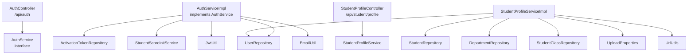
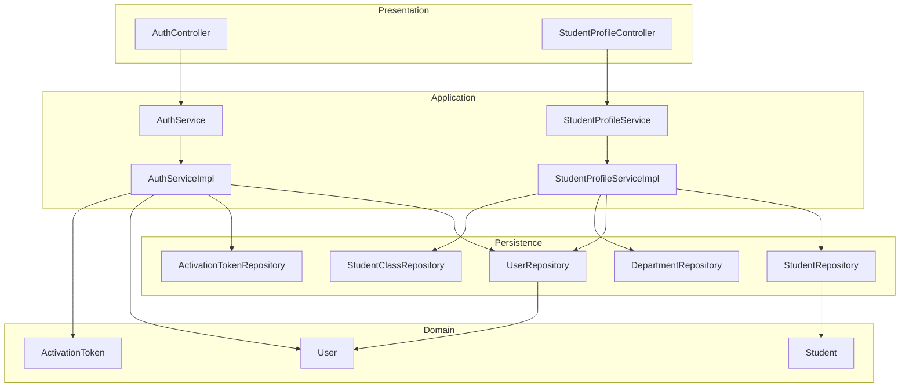
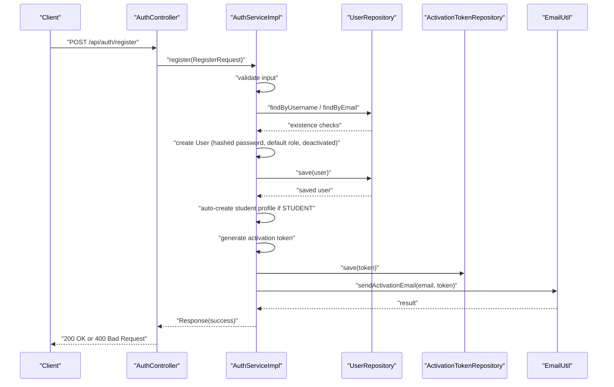
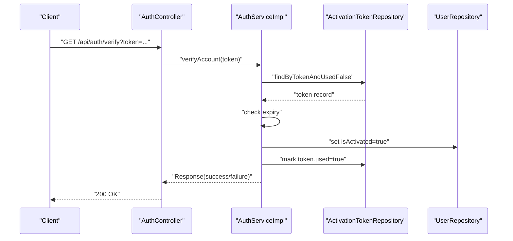
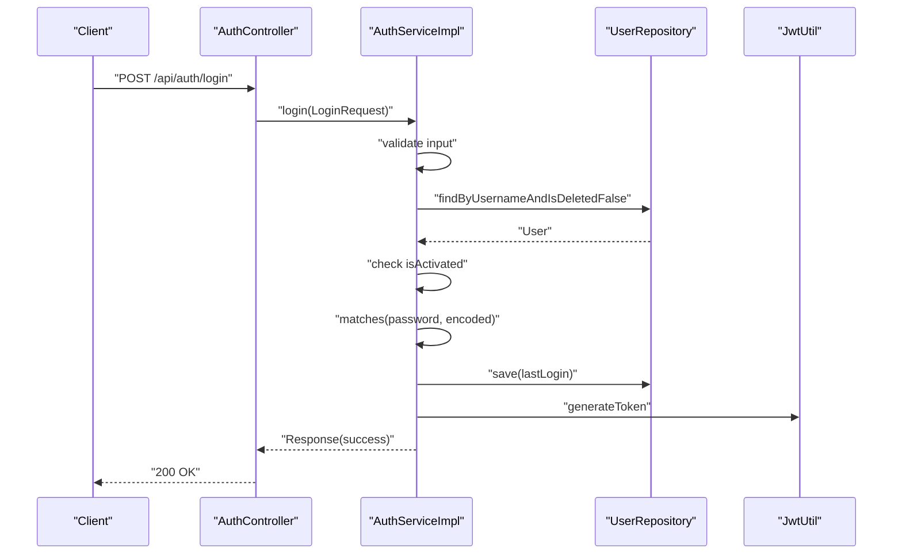
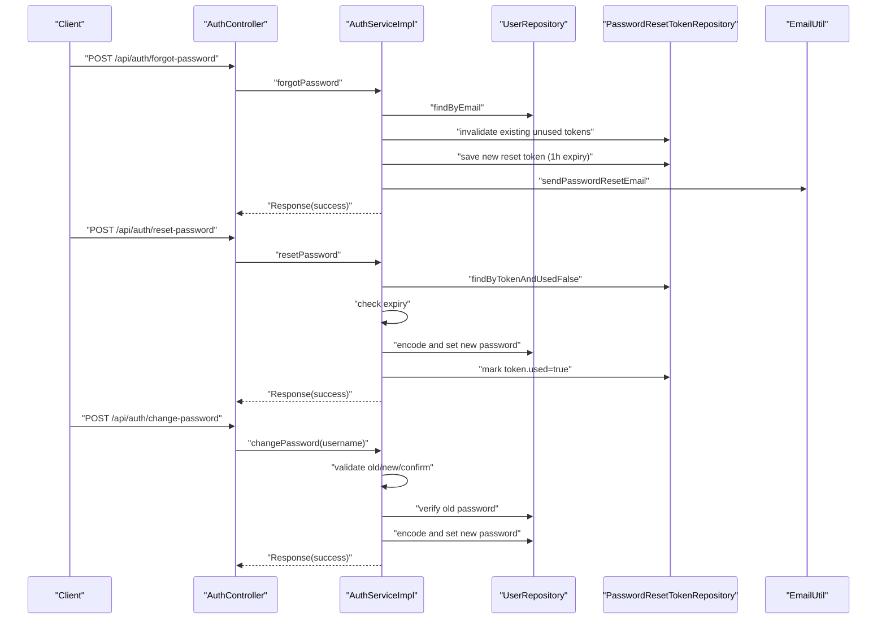
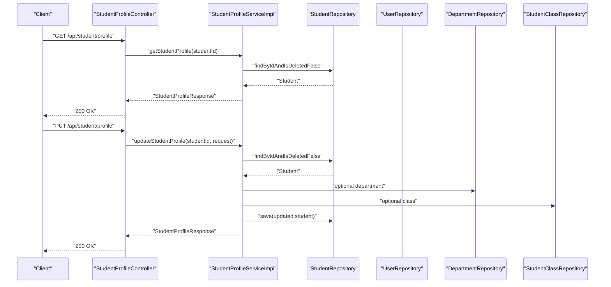
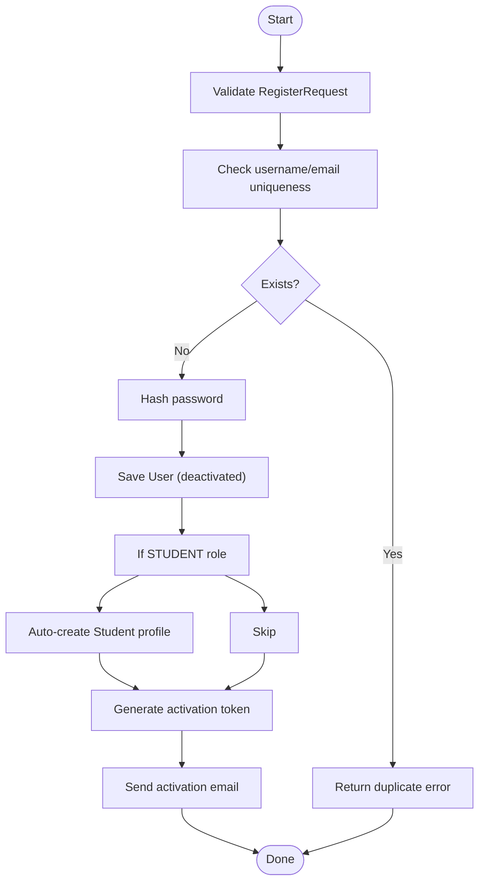
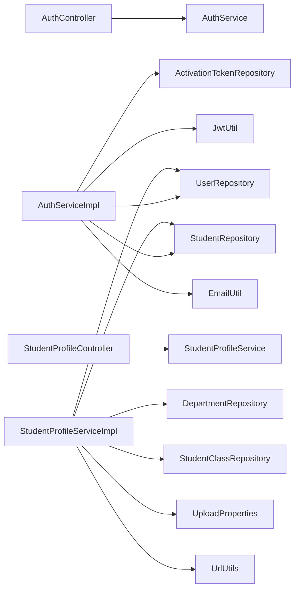

# User Registration & Profile Management

<cite>
**Referenced Files in This Document**
- [AuthController.java](file://src/main/java/vn/campuslife/controller/auth/AuthController.java)
- [AuthService.java](file://src/main/java/vn/campuslife/service/AuthService.java)
- [AuthServiceImpl.java](file://src/main/java/vn/campuslife/service/impl/AuthServiceImpl.java)
- [UserRepository.java](file://src/main/java/vn/campuslife/repository/UserRepository.java)
- [User.java](file://src/main/java/vn/campuslife/entity/User.java)
- [ActivationToken.java](file://src/main/java/vn/campuslife/entity/ActivationToken.java)
- [RegisterRequest.java](file://src/main/java/vn/campuslife/model/RegisterRequest.java)
- [Response.java](file://src/main/java/vn/campuslife/model/Response.java)
- [StudentProfileController.java](file://src/main/java/vn/campuslife/controller/student/StudentProfileController.java)
- [StudentProfileService.java](file://src/main/java/vn/campuslife/service/StudentProfileService.java)
- [StudentProfileServiceImpl.java](file://src/main/java/vn/campuslife/service/impl/StudentProfileServiceImpl.java)
- [Student.java](file://src/main/java/vn/campuslife/entity/Student.java)
- [StudentProfileUpdateRequest.java](file://src/main/java/vn/campuslife/model/StudentProfileUpdateRequest.java)
- [StudentProfileResponse.java](file://src/main/java/vn/campuslife/model/StudentProfileResponse.java)
</cite>

## Table of Contents
1. [Introduction](#introduction)
2. [Project Structure](#project-structure)
3. [Core Components](#core-components)
4. [Architecture Overview](#architecture-overview)
5. [Detailed Component Analysis](#detailed-component-analysis)
6. [Dependency Analysis](#dependency-analysis)
7. [Performance Considerations](#performance-considerations)
8. [Troubleshooting Guide](#troubleshooting-guide)
9. [Conclusion](#conclusion)
10. [Appendices](#appendices)

## Introduction
This document explains the user registration and profile management functionality in the backend. It covers the complete registration workflow including email verification, password hashing, and account activation. It also documents profile management features for students, including personal information updates, avatar management, and account settings visibility. Implementation details include user data validation, duplicate detection, and data integrity checks. Practical examples illustrate typical registration flows, profile update scenarios, and administrative access patterns. Common issues, validation errors, and best practices are addressed to support reliable operation.

## Project Structure
The relevant components for user registration and profile management are organized across controllers, services, repositories, entities, and models:

- Controllers expose REST endpoints for authentication and student profile operations.
- Services encapsulate business logic for registration, verification, password reset/change, and profile management.
- Repositories manage persistence for users, activation tokens, and related entities.
- Entities define the database schema for users, activation tokens, and student profiles.
- Models represent request/response payloads and shared response envelopes.

**Diagram sources**
- [AuthController.java:14-98](file://src/main/java/vn/campuslife/controller/auth/AuthController.java#L14-L98)
- [AuthService.java:10-17](file://src/main/java/vn/campuslife/service/AuthService.java#L10-L17)
- [AuthServiceImpl.java:30-54](file://src/main/java/vn/campuslife/service/impl/AuthServiceImpl.java#L30-L54)
- [UserRepository.java:11-21](file://src/main/java/vn/campuslife/repository/UserRepository.java#L11-L21)
- [ActivationToken.java:11-33](file://src/main/java/vn/campuslife/entity/ActivationToken.java#L11-L33)
- [StudentProfileController.java:13-84](file://src/main/java/vn/campuslife/controller/student/StudentProfileController.java#L13-L84)
- [StudentProfileService.java:6-28](file://src/main/java/vn/campuslife/service/StudentProfileService.java#L6-L28)
- [StudentProfileServiceImpl.java:19-30](file://src/main/java/vn/campuslife/service/impl/StudentProfileServiceImpl.java#L19-L30)

**Section sources**
- [AuthController.java:14-98](file://src/main/java/vn/campuslife/controller/auth/AuthController.java#L14-L98)
- [StudentProfileController.java:13-84](file://src/main/java/vn/campuslife/controller/student/StudentProfileController.java#L13-L84)

## Core Components
- Authentication Controller: Exposes endpoints for registration, login, email verification, forgot/reset/change password.
- Authentication Service: Implements registration, verification, password reset/change, and login with validation and persistence.
- Student Profile Controller: Provides endpoints to retrieve and update student profiles, with admin access for username-based lookup.
- Student Profile Service: Manages creation, update, retrieval, and response mapping for student profiles, including avatar URL handling.

Key responsibilities:
- Registration: Validates input, prevents duplicates, creates user, auto-generates activation token, sends activation email, initializes student profile for STUDENT role.
- Verification: Finds unexpired, unused activation token and activates the associated user.
- Login: Validates credentials, checks activation status, updates last login, generates JWT.
- Password reset/change: Handles secure token lifecycle and password updates.
- Profile management: Updates student personal info, handles department/class associations, manages avatar URL, builds readable address string.

**Section sources**
- [AuthServiceImpl.java:98-170](file://src/main/java/vn/campuslife/service/impl/AuthServiceImpl.java#L98-L170)
- [AuthServiceImpl.java:172-198](file://src/main/java/vn/campuslife/service/impl/AuthServiceImpl.java#L172-L198)
- [AuthServiceImpl.java:56-96](file://src/main/java/vn/campuslife/service/impl/AuthServiceImpl.java#L56-L96)
- [AuthServiceImpl.java:200-246](file://src/main/java/vn/campuslife/service/impl/AuthServiceImpl.java#L200-L246)
- [AuthServiceImpl.java:248-287](file://src/main/java/vn/campuslife/service/impl/AuthServiceImpl.java#L248-L287)
- [AuthServiceImpl.java:289-338](file://src/main/java/vn/campuslife/service/impl/AuthServiceImpl.java#L289-L338)
- [StudentProfileServiceImpl.java:70-120](file://src/main/java/vn/campuslife/service/impl/StudentProfileServiceImpl.java#L70-L120)
- [StudentProfileServiceImpl.java:122-152](file://src/main/java/vn/campuslife/service/impl/StudentProfileServiceImpl.java#L122-L152)

## Architecture Overview
The system follows a layered architecture:
- Presentation Layer: Controllers handle HTTP requests and responses.
- Application Layer: Services implement business logic and orchestrate repositories.
- Persistence Layer: Repositories manage JPA entities and enforce uniqueness and constraints.
- Entities: Define domain models and relationships.

**Diagram sources**
- [AuthController.java:14-98](file://src/main/java/vn/campuslife/controller/auth/AuthController.java#L14-L98)
- [AuthService.java:10-17](file://src/main/java/vn/campuslife/service/AuthService.java#L10-L17)
- [AuthServiceImpl.java:30-54](file://src/main/java/vn/campuslife/service/impl/AuthServiceImpl.java#L30-L54)
- [StudentProfileController.java:13-84](file://src/main/java/vn/campuslife/controller/student/StudentProfileController.java#L13-L84)
- [StudentProfileService.java:6-28](file://src/main/java/vn/campuslife/service/StudentProfileService.java#L6-L28)
- [StudentProfileServiceImpl.java:19-30](file://src/main/java/vn/campuslife/service/impl/StudentProfileServiceImpl.java#L19-L30)
- [UserRepository.java:11-21](file://src/main/java/vn/campuslife/repository/UserRepository.java#L11-L21)
- [ActivationToken.java:11-33](file://src/main/java/vn/campuslife/entity/ActivationToken.java#L11-L33)
- [Student.java:20-78](file://src/main/java/vn/campuslife/entity/Student.java#L20-L78)
- [User.java:13-50](file://src/main/java/vn/campuslife/entity/User.java#L13-L50)

## Detailed Component Analysis

### User Registration Workflow
The registration process validates input, prevents duplicates, persists the user, auto-creates a student profile for STUDENT role, generates an activation token, and attempts to send an activation email.

**Diagram sources**
- [AuthController.java:24-39](file://src/main/java/vn/campuslife/controller/auth/AuthController.java#L24-L39)
- [AuthServiceImpl.java:98-170](file://src/main/java/vn/campuslife/service/impl/AuthServiceImpl.java#L98-L170)
- [UserRepository.java:13-19](file://src/main/java/vn/campuslife/repository/UserRepository.java#L13-L19)
- [ActivationToken.java:11-33](file://src/main/java/vn/campuslife/entity/ActivationToken.java#L11-L33)

Key steps and validations:
- Input validation ensures username, email, and password are present.
- Duplicate detection checks username and email uniqueness via repositories.
- Password is hashed before storage.
- Activation token is generated with a 1-day expiry and persisted.
- Activation email sending is attempted; failure is logged but does not fail registration.

Best practices:
- Enforce minimum password length during registration.
- Use atomic transactions to ensure data consistency.
- Log email delivery failures for monitoring.

**Section sources**
- [AuthServiceImpl.java:102-120](file://src/main/java/vn/campuslife/service/impl/AuthServiceImpl.java#L102-L120)
- [AuthServiceImpl.java:121-131](file://src/main/java/vn/campuslife/service/impl/AuthServiceImpl.java#L121-L131)
- [AuthServiceImpl.java:149-163](file://src/main/java/vn/campuslife/service/impl/AuthServiceImpl.java#L149-L163)
- [UserRepository.java:13-19](file://src/main/java/vn/campuslife/repository/UserRepository.java#L13-L19)

### Email Verification and Account Activation
Verification confirms the activation token’s validity and marks the user as activated.

**Diagram sources**
- [AuthController.java:46-49](file://src/main/java/vn/campuslife/controller/auth/AuthController.java#L46-L49)
- [AuthServiceImpl.java:172-198](file://src/main/java/vn/campuslife/service/impl/AuthServiceImpl.java#L172-L198)
- [ActivationToken.java:22-32](file://src/main/java/vn/campuslife/entity/ActivationToken.java#L22-L32)
- [User.java:37-38](file://src/main/java/vn/campuslife/entity/User.java#L37-L38)

Validation and error handling:
- Token existence and unused status are verified.
- Expiry date is checked against current time.
- On success, user is activated and token is marked used.

**Section sources**
- [AuthServiceImpl.java:176-183](file://src/main/java/vn/campuslife/service/impl/AuthServiceImpl.java#L176-L183)
- [AuthServiceImpl.java:185-194](file://src/main/java/vn/campuslife/service/impl/AuthServiceImpl.java#L185-L194)

### Login and Password Validation
Login validates credentials, checks activation status, updates last login, and generates a JWT.

**Diagram sources**
- [AuthController.java:41-44](file://src/main/java/vn/campuslife/controller/auth/AuthController.java#L41-L44)
- [AuthServiceImpl.java:56-96](file://src/main/java/vn/campuslife/service/impl/AuthServiceImpl.java#L56-L96)
- [UserRepository.java:17](file://src/main/java/vn/campuslife/repository/UserRepository.java#L17)
- [User.java:37-38](file://src/main/java/vn/campuslife/entity/User.java#L37-L38)

Common issues:
- Non-existent or deleted usernames cause failure.
- Deactivated accounts are rejected.
- Incorrect password triggers failure.

**Section sources**
- [AuthServiceImpl.java:68-75](file://src/main/java/vn/campuslife/service/impl/AuthServiceImpl.java#L68-L75)
- [AuthServiceImpl.java:77-80](file://src/main/java/vn/campuslife/service/impl/AuthServiceImpl.java#L77-L80)

### Password Reset and Change Password
Password reset initiates a secure token lifecycle; change password enforces strong rules for authenticated users.

**Diagram sources**
- [AuthController.java:51-69](file://src/main/java/vn/campuslife/controller/auth/AuthController.java#L51-L69)
- [AuthController.java:71-94](file://src/main/java/vn/campuslife/controller/auth/AuthController.java#L71-L94)
- [AuthServiceImpl.java:200-246](file://src/main/java/vn/campuslife/service/impl/AuthServiceImpl.java#L200-L246)
- [AuthServiceImpl.java:248-287](file://src/main/java/vn/campuslife/service/impl/AuthServiceImpl.java#L248-L287)
- [AuthServiceImpl.java:289-338](file://src/main/java/vn/campuslife/service/impl/AuthServiceImpl.java#L289-L338)
- [UserRepository.java:15](file://src/main/java/vn/campuslife/repository/UserRepository.java#L15)
- [ActivationToken.java:22-32](file://src/main/java/vn/campuslife/entity/ActivationToken.java#L22-L32)

Validation highlights:
- Reset requires a valid, unused, non-expired token.
- New password length and matching rules enforced.
- Old password verification required for change-password.

**Section sources**
- [AuthServiceImpl.java:252-270](file://src/main/java/vn/campuslife/service/impl/AuthServiceImpl.java#L252-L270)
- [AuthServiceImpl.java:293-317](file://src/main/java/vn/campuslife/service/impl/AuthServiceImpl.java#L293-L317)

### Student Profile Management
Student profile endpoints support retrieving and updating personal information, including avatar URL and associations with department/class.

**Diagram sources**
- [StudentProfileController.java:24-60](file://src/main/java/vn/campuslife/controller/student/StudentProfileController.java#L24-L60)
- [StudentProfileServiceImpl.java:122-152](file://src/main/java/vn/campuslife/service/impl/StudentProfileServiceImpl.java#L122-L152)
- [StudentProfileServiceImpl.java:70-120](file://src/main/java/vn/campuslife/service/impl/StudentProfileServiceImpl.java#L70-L120)
- [Student.java:46-68](file://src/main/java/vn/campuslife/entity/Student.java#L46-L68)
- [StudentProfileUpdateRequest.java:14-39](file://src/main/java/vn/campuslife/model/StudentProfileUpdateRequest.java#L14-L39)
- [StudentProfileResponse.java:14-35](file://src/main/java/vn/campuslife/model/StudentProfileResponse.java#L14-L35)

Profile completeness:
- A profile is considered complete when student code, full name, and department are present.

Avatar management:
- Avatar URL is stored and returned as a full URL using upload properties.

**Section sources**
- [StudentProfileServiceImpl.java:191-196](file://src/main/java/vn/campuslife/service/impl/StudentProfileServiceImpl.java#L191-L196)
- [StudentProfileServiceImpl.java:179-181](file://src/main/java/vn/campuslife/service/impl/StudentProfileServiceImpl.java#L179-L181)

### Data Integrity and Validation
- Unique constraints: Users’ username and email are unique; studentCode is unique.
- Deleted records: Queries exclude soft-deleted records using isDeleted flags.
- Password hashing: PasswordEncoder is used for secure storage.
- Token expiry: Activation and reset tokens have defined lifetimes.
- Enumerations: Role and Gender are persisted as strings.

**Diagram sources**
- [AuthServiceImpl.java:102-120](file://src/main/java/vn/campuslife/service/impl/AuthServiceImpl.java#L102-L120)
- [AuthServiceImpl.java:121-131](file://src/main/java/vn/campuslife/service/impl/AuthServiceImpl.java#L121-L131)
- [AuthServiceImpl.java:149-163](file://src/main/java/vn/campuslife/service/impl/AuthServiceImpl.java#L149-L163)
- [UserRepository.java:13-19](file://src/main/java/vn/campuslife/repository/UserRepository.java#L13-L19)
- [User.java:24-31](file://src/main/java/vn/campuslife/entity/User.java#L24-L31)
- [Student.java:37](file://src/main/java/vn/campuslife/entity/Student.java#L37)

**Section sources**
- [UserRepository.java:13-19](file://src/main/java/vn/campuslife/repository/UserRepository.java#L13-L19)
- [User.java:24-31](file://src/main/java/vn/campuslife/entity/User.java#L24-L31)
- [Student.java:37](file://src/main/java/vn/campuslife/entity/Student.java#L37)

## Dependency Analysis
The authentication and profile services depend on repositories and utilities. Dependencies are primarily within the application layer, with minimal cross-layer coupling.

**Diagram sources**
- [AuthController.java:14-98](file://src/main/java/vn/campuslife/controller/auth/AuthController.java#L14-L98)
- [AuthService.java:10-17](file://src/main/java/vn/campuslife/service/AuthService.java#L10-L17)
- [AuthServiceImpl.java:30-54](file://src/main/java/vn/campuslife/service/impl/AuthServiceImpl.java#L30-L54)
- [StudentProfileController.java:13-84](file://src/main/java/vn/campuslife/controller/student/StudentProfileController.java#L13-L84)
- [StudentProfileService.java:6-28](file://src/main/java/vn/campuslife/service/StudentProfileService.java#L6-L28)
- [StudentProfileServiceImpl.java:19-30](file://src/main/java/vn/campuslife/service/impl/StudentProfileServiceImpl.java#L19-L30)

**Section sources**
- [AuthServiceImpl.java:30-54](file://src/main/java/vn/campuslife/service/impl/AuthServiceImpl.java#L30-L54)
- [StudentProfileServiceImpl.java:19-30](file://src/main/java/vn/campuslife/service/impl/StudentProfileServiceImpl.java#L19-L30)

## Performance Considerations
- Transaction boundaries: Registration and verification wrap multiple writes; ensure minimal work inside transactions.
- Email delivery: Asynchronous email sending can improve responsiveness; current implementation logs failures.
- Indexes: Ensure unique indexes exist on username, email, and studentCode for fast duplicate checks.
- Caching: Consider caching frequently accessed user metadata for login and profile reads.
- Pagination: For future admin endpoints, implement pagination to avoid large result sets.

## Troubleshooting Guide
Common registration issues:
- Duplicate username or email: Returned when existing records are found.
- Invalid input: Missing username/email/password triggers validation errors.
- Email delivery failures: Logged but do not block registration; advise users to check spam or resend.

Verification issues:
- Invalid or expired token: Activation fails gracefully with appropriate messages.
- Token misuse: Used tokens cannot be reused.

Login issues:
- Nonexistent or deleted user: Login rejects with user-not-found semantics.
- Deactivated account: Requires email verification before login.
- Incorrect password: Mismatch triggers invalid credentials.

Password reset/change issues:
- Expired reset token: Requires a new reset request.
- Weak/new password rules: Length and matching constraints must be satisfied.
- Old password mismatch: Prevents reuse of previous password.

Profile update issues:
- Missing student association: Ensure STUDENT role and profile creation.
- Invalid department/class IDs: Non-existent references cause errors.
- Avatar URL handling: Relative URLs are converted to absolute using upload properties.

**Section sources**
- [AuthServiceImpl.java:113-119](file://src/main/java/vn/campuslife/service/impl/AuthServiceImpl.java#L113-L119)
- [AuthServiceImpl.java:176-183](file://src/main/java/vn/campuslife/service/impl/AuthServiceImpl.java#L176-L183)
- [AuthServiceImpl.java:252-270](file://src/main/java/vn/campuslife/service/impl/AuthServiceImpl.java#L252-L270)
- [AuthServiceImpl.java:293-317](file://src/main/java/vn/campuslife/service/impl/AuthServiceImpl.java#L293-L317)
- [StudentProfileServiceImpl.java:74-110](file://src/main/java/vn/campuslife/service/impl/StudentProfileServiceImpl.java#L74-L110)

## Conclusion
The system provides a robust foundation for user registration and profile management with built-in validation, duplicate detection, and secure token handling. Registration auto-creates student profiles for eligible users, while verification and login enforce account activation and credential checks. Profile management supports comprehensive updates, including avatar handling and institutional associations. Adhering to the outlined best practices and troubleshooting guidance will help maintain reliability and usability.

## Appendices

### API Endpoints Summary
- Authentication
  - POST /api/auth/register: Registers a new user and sends activation email.
  - GET /api/auth/verify?token={token}: Activates the user account.
  - POST /api/auth/login: Authenticates user and returns JWT.
  - POST /api/auth/forgot-password: Initiates password reset.
  - POST /api/auth/reset-password: Resets password using token.
  - POST /api/auth/change-password: Changes password for authenticated user.

- Student Profile
  - GET /api/student/profile: Retrieves authenticated student’s profile.
  - PUT /api/student/profile: Updates authenticated student’s profile.
  - GET /api/student/profile/{username}: Retrieves student profile by username (admin/manager).

**Section sources**
- [AuthController.java:24-94](file://src/main/java/vn/campuslife/controller/auth/AuthController.java#L24-L94)
- [StudentProfileController.java:24-69](file://src/main/java/vn/campuslife/controller/student/StudentProfileController.java#L24-L69)