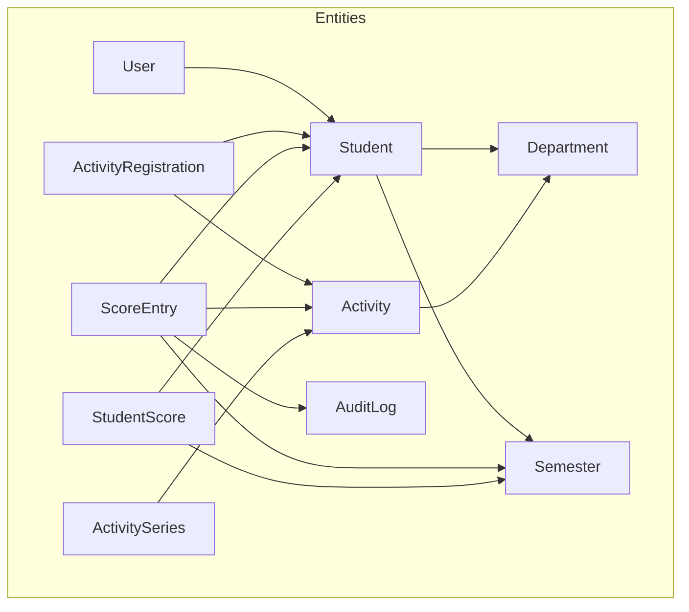
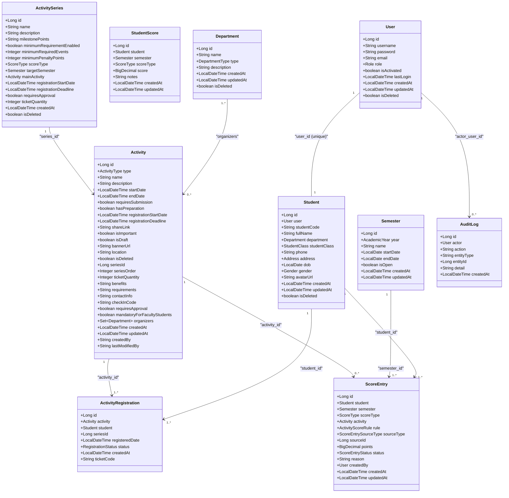
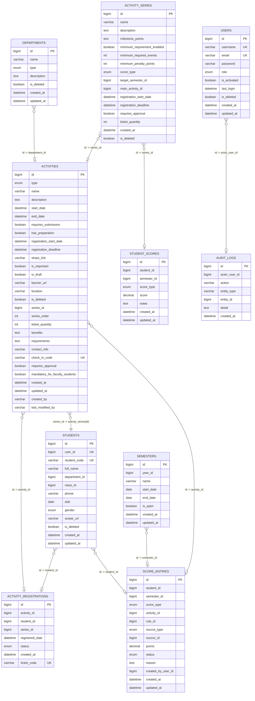

# Data Models & Database Design

<cite>
**Referenced Files in This Document**
- [User.java](file://src/main/java/vn/campuslife/entity/User.java)
- [Student.java](file://src/main/java/vn/campuslife/entity/Student.java)
- [Activity.java](file://src/main/java/vn/campuslife/entity/Activity.java)
- [ActivityRegistration.java](file://src/main/java/vn/campuslife/entity/ActivityRegistration.java)
- [ScoreEntry.java](file://src/main/java/vn/campuslife/entity/ScoreEntry.java)
- [StudentScore.java](file://src/main/java/vn/campuslife/entity/StudentScore.java)
- [ActivitySeries.java](file://src/main/java/vn/campuslife/entity/ActivitySeries.java)
- [Semester.java](file://src/main/java/vn/campuslife/entity/Semester.java)
- [Department.java](file://src/main/java/vn/campuslife/entity/Department.java)
- [AuditLog.java](file://src/main/java/vn/campuslife/entity/AuditLog.java)
- [Role.java](file://src/main/java/vn/campuslife/enumeration/Role.java)
- [ScoreType.java](file://src/main/java/vn/campuslife/enumeration/ScoreType.java)
- [V1000__unique_activity_registration.sql](file://db/migration/V1000__unique_activity_registration.sql)
- [V1003__create_activity_series_tables.sql](file://db/migration/V1003__create_activity_series_tables.sql)
- [V1001__add_is_completed_to_task_submissions.sql](file://db/migration/V1001__add_is_completed_to_task_submissions.sql)
</cite>

## Table of Contents
1. [Introduction](#introduction)
2. [Project Structure](#project-structure)
3. [Core Components](#core-components)
4. [Architecture Overview](#architecture-overview)
5. [Detailed Component Analysis](#detailed-component-analysis)
6. [Dependency Analysis](#dependency-analysis)
7. [Performance Considerations](#performance-considerations)
8. [Troubleshooting Guide](#troubleshooting-guide)
9. [Conclusion](#conclusion)
10. [Appendices](#appendices)

## Introduction
This document provides comprehensive data model documentation for the CampusLife database schema. It details entity relationships, field definitions, data types, and business rules for core JPA entities including User, Student, Activity, ActivityRegistration, ScoreEntry, and related models. It also explains soft delete implementation, audit trail functionality, enum-based configurations stored as MySQL ENUM-like columns, database schema diagrams, sample data examples, data validation rules, migration strategy via Flyway, data access patterns through repositories, and performance considerations for the entity layer.

## Project Structure
The data model is implemented using JPA entities under the package vn.campuslife.entity, with enumerations under vn.campuslife.enumeration. Database migrations are managed by Flyway under db/migration. The entities define primary keys, foreign keys, indexes, constraints, and audit metadata. Enumerations are mapped to database columns as string values.

**Diagram sources**
- [User.java:19-50](file://src/main/java/vn/campuslife/entity/User.java#L19-L50)
- [Student.java:27-78](file://src/main/java/vn/campuslife/entity/Student.java#L27-L78)
- [Activity.java:27-171](file://src/main/java/vn/campuslife/entity/Activity.java#L27-L171)
- [ActivityRegistration.java:18-47](file://src/main/java/vn/campuslife/entity/ActivityRegistration.java#L18-L47)
- [ScoreEntry.java:24-79](file://src/main/java/vn/campuslife/entity/ScoreEntry.java#L24-L79)
- [StudentScore.java:21-50](file://src/main/java/vn/campuslife/entity/StudentScore.java#L21-L50)
- [ActivitySeries.java:16-87](file://src/main/java/vn/campuslife/entity/ActivitySeries.java#L16-L87)
- [Semester.java:20-44](file://src/main/java/vn/campuslife/entity/Semester.java#L20-L44)
- [Department.java:19-40](file://src/main/java/vn/campuslife/entity/Department.java#L19-L40)
- [AuditLog.java:18-43](file://src/main/java/vn/campuslife/entity/AuditLog.java#L18-L43)

**Section sources**
- [User.java:1-50](file://src/main/java/vn/campuslife/entity/User.java#L1-L50)
- [Student.java:1-78](file://src/main/java/vn/campuslife/entity/Student.java#L1-L78)
- [Activity.java:1-171](file://src/main/java/vn/campuslife/entity/Activity.java#L1-L171)
- [ActivityRegistration.java:1-47](file://src/main/java/vn/campuslife/entity/ActivityRegistration.java#L1-L47)
- [ScoreEntry.java:1-79](file://src/main/java/vn/campuslife/entity/ScoreEntry.java#L1-L79)
- [StudentScore.java:1-50](file://src/main/java/vn/campuslife/entity/StudentScore.java#L1-L50)
- [ActivitySeries.java:1-87](file://src/main/java/vn/campuslife/entity/ActivitySeries.java#L1-L87)
- [Semester.java:1-44](file://src/main/java/vn/campuslife/entity/Semester.java#L1-L44)
- [Department.java:1-40](file://src/main/java/vn/campuslife/entity/Department.java#L1-L40)
- [AuditLog.java:1-43](file://src/main/java/vn/campuslife/entity/AuditLog.java#L1-L43)

## Core Components
This section summarizes the primary entities and their roles in the CampusLife system.

- User: Authentication and authorization backbone with role enumeration and soft-delete flag.
- Student: Person profile linked to User, with academic and personal attributes.
- Activity: Event definition with scheduling, registration windows, approval requirements, and optional series linkage.
- ActivityRegistration: Tracks student participation per activity with status and ticket code.
- ScoreEntry: Records scored points per student per semester, linked to activity or rule, with source metadata.
- StudentScore: Aggregated score per student per semester by score type.
- ActivitySeries: Defines chained activities with milestones and minimum requirements.
- Semester: Academic calendar unit with open/close state.
- Department: Organizational unit with type and soft-delete support.
- AuditLog: Centralized audit trail for entity actions.

**Section sources**
- [User.java:19-50](file://src/main/java/vn/campuslife/entity/User.java#L19-L50)
- [Student.java:27-78](file://src/main/java/vn/campuslife/entity/Student.java#L27-L78)
- [Activity.java:27-171](file://src/main/java/vn/campuslife/entity/Activity.java#L27-L171)
- [ActivityRegistration.java:18-47](file://src/main/java/vn/campuslife/entity/ActivityRegistration.java#L18-L47)
- [ScoreEntry.java:24-79](file://src/main/java/vn/campuslife/entity/ScoreEntry.java#L24-L79)
- [StudentScore.java:21-50](file://src/main/java/vn/campuslife/entity/StudentScore.java#L21-L50)
- [ActivitySeries.java:16-87](file://src/main/java/vn/campuslife/entity/ActivitySeries.java#L16-L87)
- [Semester.java:20-44](file://src/main/java/vn/campuslife/entity/Semester.java#L20-L44)
- [Department.java:19-40](file://src/main/java/vn/campuslife/entity/Department.java#L19-L40)
- [AuditLog.java:18-43](file://src/main/java/vn/campuslife/entity/AuditLog.java#L18-L43)

## Architecture Overview
The data model follows a layered architecture:
- Domain Layer: JPA entities encapsulate business data and relationships.
- Enumeration Layer: Strong-typed enums map to database columns.
- Persistence Layer: Repositories and services handle data access and business logic.
- Migration Layer: Flyway manages schema evolution.

**Diagram sources**
- [User.java:19-50](file://src/main/java/vn/campuslife/entity/User.java#L19-L50)
- [Student.java:27-78](file://src/main/java/vn/campuslife/entity/Student.java#L27-L78)
- [Activity.java:27-171](file://src/main/java/vn/campuslife/entity/Activity.java#L27-L171)
- [ActivityRegistration.java:18-47](file://src/main/java/vn/campuslife/entity/ActivityRegistration.java#L18-L47)
- [ScoreEntry.java:24-79](file://src/main/java/vn/campuslife/entity/ScoreEntry.java#L24-L79)
- [StudentScore.java:21-50](file://src/main/java/vn/campuslife/entity/StudentScore.java#L21-L50)
- [ActivitySeries.java:16-87](file://src/main/java/vn/campuslife/entity/ActivitySeries.java#L16-L87)
- [Semester.java:20-44](file://src/main/java/vn/campuslife/entity/Semester.java#L20-L44)
- [Department.java:19-40](file://src/main/java/vn/campuslife/entity/Department.java#L19-L40)
- [AuditLog.java:18-43](file://src/main/java/vn/campuslife/entity/AuditLog.java#L18-L43)

## Detailed Component Analysis

### User Entity
- Purpose: Stores authentication credentials, roles, activation status, last login, and soft-delete flag.
- Key fields:
  - id: Primary key (auto-increment).
  - username: Unique, not null.
  - email: Unique, not null.
  - password: Not null (hashed).
  - role: Enum Role (ADMIN, MANAGER, STUDENT).
  - isActivated: Boolean flag.
  - lastLogin: Timestamp.
  - createdAt/updatedAt: Auditing timestamps.
  - isDeleted: Soft delete flag.
- Business rules:
  - Username and email must be unique.
  - Role must be one of predefined values.
  - Soft deletion prevents record removal while hiding data.

**Section sources**
- [User.java:19-50](file://src/main/java/vn/campuslife/entity/User.java#L19-L50)
- [Role.java:3-7](file://src/main/java/vn/campuslife/enumeration/Role.java#L3-L7)

### Student Entity
- Purpose: Represents a person profile linked to a User, with academic and personal details.
- Key fields:
  - id: Primary key (auto-increment).
  - user: OneToOne to User (unique).
  - studentCode: Unique.
  - fullName, phone, avatarUrl, dob, gender.
  - department: ManyToOne to Department.
  - studentClass: ManyToOne to StudentClass.
  - address: OneToOne mapped by Student.
  - createdAt/updatedAt: Auditing timestamps.
  - isDeleted: Soft delete flag.
- Relationships:
  - OneToOne with User (unique).
  - ManyToOne with Department and StudentClass.
  - OneToOne with Address (mapped).
- Business rules:
  - studentCode must be unique.
  - Soft deletion enabled.

**Section sources**
- [Student.java:27-78](file://src/main/java/vn/campuslife/entity/Student.java#L27-L78)

### Activity Entity
- Purpose: Defines events with scheduling, registration windows, approval requirements, and optional series linkage.
- Key fields:
  - id: Primary key (auto-increment).
  - type: Enum ActivityType (nullable for series).
  - name: Not null.
  - description: Text.
  - startDate/endDate: Optional date-time.
  - requiresSubmission, hasPreparation, isImportant, isDraft: Flags.
  - registrationStartDate/registrationDeadline: Registration windows.
  - shareLink, bannerUrl, location: Metadata.
  - isDeleted: Soft delete flag.
  - seriesId, seriesOrder: Series linkage.
  - ticketQuantity: Nullable slot limit.
  - benefits, requirements, contactInfo: Descriptive fields.
  - checkInCode: Unique QR code for quick check-in.
  - requiresApproval, mandatoryForFacultyStudents: Flags.
  - organizers: ManyToMany to Department.
  - createdAt/updatedAt, createdBy, lastModifiedBy: Auditing.
- Business rules:
  - Draft vs published lifecycle.
  - Series linkage for chained activities.
  - Unique check-in code.

**Section sources**
- [Activity.java:27-171](file://src/main/java/vn/campuslife/entity/Activity.java#L27-L171)

### ActivityRegistration Entity
- Purpose: Tracks student participation per activity with status and ticket code.
- Key fields:
  - id: Primary key (auto-increment).
  - activity: ManyToOne to Activity.
  - student: ManyToOne to Student.
  - seriesId: Nullable to link to ActivitySeries.
  - registeredDate: Timestamp.
  - status: Enum RegistrationStatus.
  - createdAt: Auditing timestamp.
  - ticketCode: Unique, length 20.
- Constraints:
  - Unique index on (activity_id, student_id) enforced by Flyway migration.

**Section sources**
- [ActivityRegistration.java:18-47](file://src/main/java/vn/campuslife/entity/ActivityRegistration.java#L18-L47)
- [V1000__unique_activity_registration.sql:1-16](file://db/migration/V1000__unique_activity_registration.sql#L1-L16)

### ScoreEntry Entity
- Purpose: Records scored points per student per semester, linked to activity or rule, with source metadata.
- Key fields:
  - id: Primary key (auto-increment).
  - student: ManyToOne to Student.
  - semester: ManyToOne to Semester.
  - scoreType: Enum ScoreType.
  - activity: ManyToOne to Activity (optional).
  - rule: ManyToOne to ActivityScoreRule (optional).
  - sourceType: Enum ScoreEntrySourceType.
  - sourceId: Not null.
  - points: Decimal value.
  - status: Enum ScoreEntryStatus.
  - reason: Text explanation.
  - createdBy: ManyToOne to User.
  - createdAt/updatedAt: Auditing timestamps.
- Business rules:
  - Composite uniqueness and referential integrity enforced by relationships.
  - Source metadata enables traceability.

**Section sources**
- [ScoreEntry.java:24-79](file://src/main/java/vn/campuslife/entity/ScoreEntry.java#L24-L79)
- [ScoreType.java:3-7](file://src/main/java/vn/campuslife/enumeration/ScoreType.java#L3-L7)

### StudentScore Entity
- Purpose: Aggregated score per student per semester by score type.
- Key fields:
  - id: Primary key (auto-increment).
  - student: ManyToOne to Student.
  - semester: ManyToOne to Semester.
  - scoreType: Enum ScoreType.
  - score: Decimal value.
  - notes: Text.
  - createdAt/updatedAt: Auditing timestamps.
- Business rules:
  - Aggregation computed externally; persisted snapshot.

**Section sources**
- [StudentScore.java:21-50](file://src/main/java/vn/campuslife/entity/StudentScore.java#L21-L50)

### ActivitySeries Entity
- Purpose: Defines chained activities with milestones and minimum requirements.
- Key fields:
  - id: Primary key (auto-increment).
  - name: Not null.
  - description: Text.
  - milestonePoints: JSON storing milestone thresholds and rewards.
  - minimumRequirementEnabled: Flag to enable minimum requirement enforcement.
  - minimumRequiredEvents: Threshold count.
  - minimumPenaltyPoints: Penalty applied if threshold not met.
  - scoreType: Enum ScoreType for milestone scoring.
  - targetSemester: ManyToOne to Semester.
  - mainActivity: ManyToOne to Activity (optional).
  - registrationStartDate/registrationDeadline: Registration windows.
  - requiresApproval: Flag.
  - ticketQuantity: Nullable slot limit.
  - createdAt: Timestamp (updatable=false).
  - isDeleted: Soft delete flag.
- Business rules:
  - Milestone logic and penalty enforcement.
  - Series-scoped registration windows.

**Section sources**
- [ActivitySeries.java:16-87](file://src/main/java/vn/campuslife/entity/ActivitySeries.java#L16-L87)

### Semester Entity
- Purpose: Academic calendar unit with open/close state.
- Key fields:
  - id: Primary key (auto-increment).
  - year: ManyToOne to AcademicYear.
  - name: Not null.
  - startDate/endDate: Date range.
  - isOpen: Boolean flag indicating current semester.
  - createdAt/updatedAt: Auditing timestamps.

**Section sources**
- [Semester.java:20-44](file://src/main/java/vn/campuslife/entity/Semester.java#L20-L44)

### Department Entity
- Purpose: Organizational unit with type and soft-delete support.
- Key fields:
  - id: Primary key (auto-increment).
  - name: Not null.
  - type: Enum DepartmentType.
  - description: Text.
  - createdAt/updatedAt: Auditing timestamps.
  - isDeleted: Soft delete flag.

**Section sources**
- [Department.java:19-40](file://src/main/java/vn/campuslife/entity/Department.java#L19-L40)

### AuditLog Entity
- Purpose: Centralized audit trail for entity actions.
- Key fields:
  - id: Primary key (auto-increment).
  - actor: ManyToOne to User.
  - action: String (not null, length 50).
  - entityType: String (not null, length 50).
  - entityId: Long (not null).
  - detail: Text.
  - createdAt: Auditing timestamp.
- Business rules:
  - Captures actor, action, entity, and payload for traceability.

**Section sources**
- [AuditLog.java:18-43](file://src/main/java/vn/campuslife/entity/AuditLog.java#L18-L43)

## Dependency Analysis
This section maps entity relationships and foreign keys derived from JPA annotations and Flyway migrations.

**Diagram sources**
- [User.java:19-50](file://src/main/java/vn/campuslife/entity/User.java#L19-L50)
- [Student.java:27-78](file://src/main/java/vn/campuslife/entity/Student.java#L27-L78)
- [Activity.java:27-171](file://src/main/java/vn/campuslife/entity/Activity.java#L27-L171)
- [ActivityRegistration.java:18-47](file://src/main/java/vn/campuslife/entity/ActivityRegistration.java#L18-L47)
- [ScoreEntry.java:24-79](file://src/main/java/vn/campuslife/entity/ScoreEntry.java#L24-L79)
- [StudentScore.java:21-50](file://src/main/java/vn/campuslife/entity/StudentScore.java#L21-L50)
- [ActivitySeries.java:16-87](file://src/main/java/vn/campuslife/entity/ActivitySeries.java#L16-L87)
- [Semester.java:20-44](file://src/main/java/vn/campuslife/entity/Semester.java#L20-L44)
- [Department.java:19-40](file://src/main/java/vn/campuslife/entity/Department.java#L19-L40)
- [AuditLog.java:18-43](file://src/main/java/vn/campuslife/entity/AuditLog.java#L18-L43)
- [V1000__unique_activity_registration.sql:1-16](file://db/migration/V1000__unique_activity_registration.sql#L1-L16)
- [V1003__create_activity_series_tables.sql:1-37](file://db/migration/V1003__create_activity_series_tables.sql#L1-L37)

**Section sources**
- [V1000__unique_activity_registration.sql:1-16](file://db/migration/V1000__unique_activity_registration.sql#L1-L16)
- [V1003__create_activity_series_tables.sql:1-37](file://db/migration/V1003__create_activity_series_tables.sql#L1-L37)

## Performance Considerations
- Indexes and Uniques:
  - ActivityRegistration: Unique index on (activity_id, student_id) prevents duplicates and speeds up lookup.
  - Activity: Index on series_id for efficient series queries.
  - User: Unique indexes on username and email.
  - Student: Unique index on student_code.
  - Activity: Unique index on check_in_code for fast check-in.
- Fetch Strategies:
  - Lazy fetching for associations in ScoreEntry and StudentScore reduces unnecessary joins.
- Soft Delete:
  - isDeleted flags enable filtering without physical deletion, reducing maintenance overhead.
- Audit Trail:
  - AuditLog captures changes for compliance and debugging; consider partitioning for large-scale writes.
- Enum Storage:
  - Enums stored as strings reduce schema complexity but may benefit from application-level validation and indexing where needed.

[No sources needed since this section provides general guidance]

## Troubleshooting Guide
- Duplicate Registrations:
  - Symptom: Constraint violation on activity_registrations(activity_id, student_id).
  - Resolution: Flyway migration removes duplicates and adds unique index; ensure deduplication before manual inserts.
- Series Integrity:
  - Symptom: Orphaned activities after series deletion.
  - Resolution: Foreign key constraints set series_id to NULL on series deletion; verify series linkage.
- Check-in Failures:
  - Symptom: Duplicate check_in_code.
  - Resolution: Ensure unique generation and validation of check-in codes.
- Score Discrepancies:
  - Symptom: Incorrect aggregated scores.
  - Resolution: Verify StudentScore updates and ScoreEntry source metadata alignment.

**Section sources**
- [V1000__unique_activity_registration.sql:1-16](file://db/migration/V1000__unique_activity_registration.sql#L1-L16)
- [V1003__create_activity_series_tables.sql:1-37](file://db/migration/V1003__create_activity_series_tables.sql#L1-L37)

## Conclusion
The CampusLife data model emphasizes strong typing via enums, robust auditing, and soft deletes for maintainability. Relationships are carefully defined to support activity registration, scoring, and series management. Flyway migrations enforce integrity constraints and schema evolution. Performance is optimized through targeted indexes and lazy loading. The design supports extensibility for future enhancements such as advanced scoring rules and audit reporting.

[No sources needed since this section summarizes without analyzing specific files]

## Appendices

### Sample Data Examples
- User:
  - username: unique, not null
  - email: unique, not null
  - role: one of ADMIN, MANAGER, STUDENT
  - isActivated: boolean
  - isDeleted: boolean
- Student:
  - studentCode: unique
  - department_id: references departments
  - isDeleted: boolean
- Activity:
  - name: not null
  - registrationStartDate/registrationDeadline: define registration window
  - checkInCode: unique
  - seriesId/seriesOrder: for chained activities
- ActivityRegistration:
  - activity_id + student_id: unique combination
  - status: enum-based
  - ticketCode: unique
- ScoreEntry:
  - student_id + semester_id + scoreType: composite grouping
  - sourceType + sourceId: traceable origin
  - points: numeric value
- StudentScore:
  - student_id + semester_id + scoreType: aggregation key
  - score: accumulated points
- ActivitySeries:
  - name: not null
  - minimumRequirementEnabled: boolean toggle
  - milestonePoints: JSON-encoded thresholds
  - isDeleted: boolean

[No sources needed since this section provides general guidance]

### Migration Strategy Using Flyway
- V1000__unique_activity_registration.sql:
  - Removes duplicates and adds unique index on (activity_id, student_id).
- V1003__create_activity_series_tables.sql:
  - Creates activity_series and student_series_progress tables with foreign keys and indexes.
  - Adds series_id and series_order to activities with indexes and foreign key to activity_series.
- V1001__add_is_completed_to_task_submissions.sql:
  - Adds is_completed column to task_submissions and backfills values based on score and status.

**Section sources**
- [V1000__unique_activity_registration.sql:1-16](file://db/migration/V1000__unique_activity_registration.sql#L1-L16)
- [V1003__create_activity_series_tables.sql:1-37](file://db/migration/V1003__create_activity_series_tables.sql#L1-L37)
- [V1001__add_is_completed_to_task_submissions.sql:1-14](file://db/migration/V1001__add_is_completed_to_task_submissions.sql#L1-L14)

### Data Access Patterns Through Repositories
- Entities expose relationships suitable for repository queries:
  - ActivityRegistrationRepository can filter by activity_id and student_id using unique index.
  - ScoreEntryRepository can group by student_id, semester_id, and scoreType for aggregation.
  - ActivityRepository can filter by series_id for series-based queries.
- Best Practices:
  - Use pagination for large result sets.
  - Apply soft-delete filters by default in repository methods.
  - Leverage named queries or Specifications for dynamic filtering.

[No sources needed since this section provides general guidance]