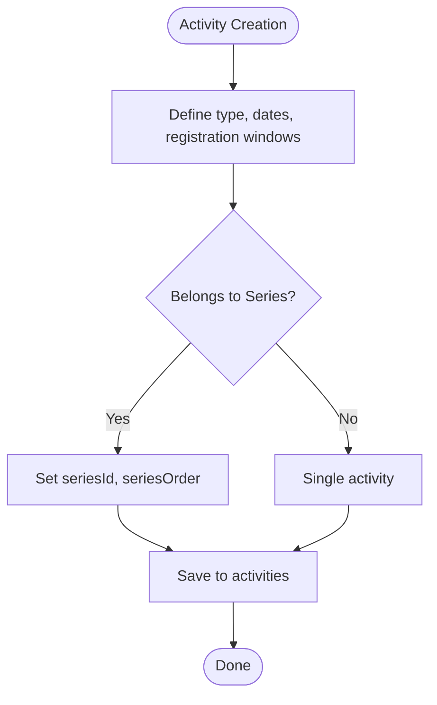
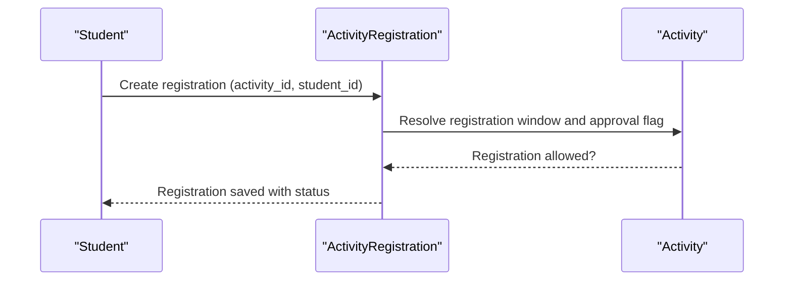
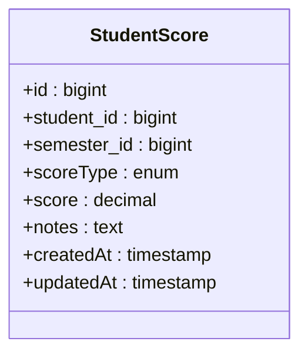
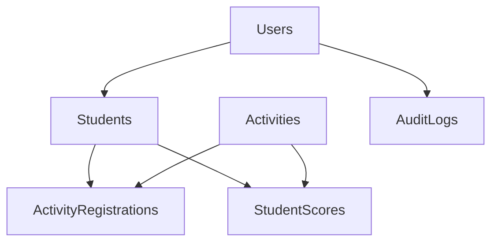

# Database Schema Design

<cite>
**Referenced Files in This Document**
- [V999__activity_datetime_and_flags.sql](file://db/migration/V999__activity_datetime_and_flags.sql)
- [V1000__unique_activity_registration.sql](file://db/migration/V1000__unique_activity_registration.sql)
- [V1001__add_is_completed_to_task_submissions.sql](file://db/migration/V1001__add_is_completed_to_task_submissions.sql)
- [V1003__create_activity_series_tables.sql](file://db/migration/V1003__create_activity_series_tables.sql)
- [V1004__create_minigame_tables.sql](file://db/migration/V1004__create_minigame_tables.sql)
- [V1005__add_series_registration_fields.sql](file://db/migration/V1005__add_series_registration_fields.sql)
- [V1006__allow_null_type_scoretype_for_series_activities.sql](file://db/migration/V1006__allow_null_type_scoretype_for_series_activities.sql)
- [V1007__change_task_deadline_to_datetime.sql](file://db/migration/V1007__change_task_deadline_to_datetime.sql)
- [V1008__add_is_deleted_to_activity_series.sql](file://db/migration/V1008__add_is_deleted_to_activity_series.sql)
- [V1009__ensure_score_type_nullable.sql](file://db/migration/V1009__ensure_score_type_nullable.sql)
- [V1010__create_password_reset_tokens_table.sql](file://db/migration/V1010__create_password_reset_tokens_table.sql)
- [V1011__add_series_id_to_activity_registrations.sql](file://db/migration/V1011__add_series_id_to_activity_registrations.sql)
- [V1012__add_max_attempts_to_mini_games.sql](file://db/migration/V1012__add_max_attempts_to_mini_games.sql)
- [V1013__add_image_url_to_quiz_questions.sql](file://db/migration/V1013__add_image_url_to_quiz_questions.sql)
- [V1014__add_check_in_code_to_activities.sql](file://db/migration/V1014__add_check_in_code_to_activities.sql)
- [V1015__create_email_history_tables.sql](file://db/migration/V1015__create_email_history_tables.sql)
- [V1016__remove_activity_ids_from_student_scores.sql](file://db/migration/V1016__remove_activity_ids_from_student_scores.sql)
- [V1017__expenses_is_approved_nullable.sql](file://db/migration/V1017__expenses_is_approved_nullable.sql)
- [V1018__create_event_articles_table.sql](file://db/migration/V1018__create_event_articles_table.sql)
- [V1019__enhance_event_articles.sql](file://db/migration/V1019__enhance_event_articles.sql)
- [V1020__enhance_event_articles_advanced.sql](file://db/migration/V1020__enhance_event_articles_advanced.sql)
- [V1021__allow_multiple_articles_per_activity.sql](file://db/migration/V1021__allow_multiple_articles_per_activity.sql)
- [V1022__article_comments.sql](file://db/migration/V1022__article_comments.sql)
- [V1023__article_reactions.sql](file://db/migration/V1023__article_reactions.sql)
- [V1024__add_share_count.sql](file://db/migration/V1024__add_share_count.sql)
- [V1025__activity_score_refactor.sql](file://db/migration/V1025__activity_score_refactor.sql)
- [V1025__create_reminder_schedule_table.sql](file://db/migration/V1025__create_reminder_schedule_table.sql)
- [V1026__backfill_activity_score_rules.sql](file://db/migration/V1026__backfill_activity_score_rules.sql)
- [V1027__backend_audit_improvements.sql](file://db/migration/V1027__backend_audit_improvements.sql)
- [Activity.java](file://src/main/java/vn/campuslife/entity/Activity.java)
- [User.java](file://src/main/java/vn/campuslife/entity/User.java)
- [Student.java](file://src/main/java/vn/campuslife/entity/Student.java)
- [ActivityRegistration.java](file://src/main/java/vn/campuslife/entity/ActivityRegistration.java)
- [StudentScore.java](file://src/main/java/vn/campuslife/entity/StudentScore.java)
- [AuditLog.java](file://src/main/java/vn/campuslife/entity/AuditLog.java)
- [ActivityType.java](file://src/main/java/vn/campuslife/enumeration/ActivityType.java)
- [ScoreType.java](file://src/main/java/vn/campuslife/enumeration/ScoreType.java)
</cite>

## Table of Contents
1. [Introduction](#introduction)
2. [Project Structure](#project-structure)
3. [Core Components](#core-components)
4. [Architecture Overview](#architecture-overview)
5. [Detailed Component Analysis](#detailed-component-analysis)
6. [Dependency Analysis](#dependency-analysis)
7. [Performance Considerations](#performance-considerations)
8. [Troubleshooting Guide](#troubleshooting-guide)
9. [Conclusion](#conclusion)
10. [Appendices](#appendices)

## Introduction
This document provides a comprehensive database schema design for the CampusLife application. It documents all table structures, column definitions, data types, and constraints derived from the Flyway migration scripts and JPA entity mappings. It explains the normalized design, indexing strategy, performance optimizations, audit trail implementation, ENUM usage, schema evolution history, migration dependencies, backward compatibility considerations, and examples of complex queries and join patterns used across the application.

## Project Structure
The database schema is managed via Flyway migrations under db/migration. Entities in the backend define JPA mappings that reflect the current relational schema. The following diagram shows the relationship between selected migration files and key entities.

```mermaid
graph TB
subgraph "Flyway Migrations"
V999["V999__activity_datetime_and_flags.sql"]
V1000["V1000__unique_activity_registration.sql"]
V1001["V1001__add_is_completed_to_task_submissions.sql"]
V1003["V1003__create_activity_series_tables.sql"]
V1004["V1004__create_minigame_tables.sql"]
V1005["V1005__add_series_registration_fields.sql"]
V1006["V1006__allow_null_type_scoretype_for_series_activities.sql"]
V1007["V1007__change_task_deadline_to_datetime.sql"]
V1008["V1008__add_is_deleted_to_activity_series.sql"]
V1009["V1009__ensure_score_type_nullable.sql"]
V1010["V1010__create_password_reset_tokens_table.sql"]
V1011["V1011__add_series_id_to_activity_registrations.sql"]
V1012["V1012__add_max_attempts_to_mini_games.sql"]
V1013["V1013__add_image_url_to_quiz_questions.sql"]
V1014["V1014__add_check_in_code_to_activities.sql"]
V1015["V1015__create_email_history_tables.sql"]
V1016["V1016__remove_activity_ids_from_student_scores.sql"]
V1017["V1017__expenses_is_approved_nullable.sql"]
V1018["V1018__create_event_articles_table.sql"]
V1019["V1019__enhance_event_articles.sql"]
V1020["V1020__enhance_event_articles_advanced.sql"]
V1021["V1021__allow_multiple_articles_per_activity.sql"]
V1022["V1022__article_comments.sql"]
V1023["V1023__article_reactions.sql"]
V1024["V1024__add_share_count.sql"]
V1025a["V1025__activity_score_refactor.sql"]
V1025b["V1025__create_reminder_schedule_table.sql"]
V1026["V1026__backfill_activity_score_rules.sql"]
V1027["V1027__backend_audit_improvements.sql"]
end
subgraph "Entities"
EAct["Activity.java"]
EUser["User.java"]
EStd["Student.java"]
EReg["ActivityRegistration.java"]
EScr["StudentScore.java"]
EAudit["AuditLog.java"]
end
V999 --- EAct
V1000 --- EReg
V1003 --- EAct
V1004 --- EAct
V1005 --- EReg
V1006 --- EAct
V1007 --- EAct
V1008 --- EAct
V1009 --- EScr
V1010 --- EUser
V1011 --- EReg
V1014 --- EAct
V1015 --- EUser
V1016 --- EScr
V1018 --- EAct
V1019 --- EAct
V1020 --- EAct
V1021 --- EAct
V1022 --- EAct
V1023 --- EAct
V1024 --- EAct
V1025a --- EScr
V1025b --- EAct
V1026 --- EScr
V1027 --- EAudit
```



**Diagram sources**
- [V999__activity_datetime_and_flags.sql](file://db/migration/V999__activity_datetime_and_flags.sql)
- [V1000__unique_activity_registration.sql](file://db/migration/V1000__unique_activity_registration.sql)
- [V1001__add_is_completed_to_task_submissions.sql](file://db/migration/V1001__add_is_completed_to_task_submissions.sql)
- [V1003__create_activity_series_tables.sql](file://db/migration/V1003__create_activity_series_tables.sql)
- [V1004__create_minigame_tables.sql](file://db/migration/V1004__create_minigame_tables.sql)
- [V1005__add_series_registration_fields.sql](file://db/migration/V1005__add_series_registration_fields.sql)
- [V1006__allow_null_type_scoretype_for_series_activities.sql](file://db/migration/V1006__allow_null_type_scoretype_for_series_activities.sql)
- [V1007__change_task_deadline_to_datetime.sql](file://db/migration/V1007__change_task_deadline_to_datetime.sql)
- [V1008__add_is_deleted_to_activity_series.sql](file://db/migration/V1008__add_is_deleted_to_activity_series.sql)
- [V1009__ensure_score_type_nullable.sql](file://db/migration/V1009__ensure_score_type_nullable.sql)
- [V1010__create_password_reset_tokens_table.sql](file://db/migration/V1010__create_password_reset_tokens_table.sql)
- [V1011__add_series_id_to_activity_registrations.sql](file://db/migration/V1011__add_series_id_to_activity_registrations.sql)
- [V1012__add_max_attempts_to_mini_games.sql](file://db/migration/V1012__add_max_attempts_to_mini_games.sql)
- [V1013__add_image_url_to_quiz_questions.sql](file://db/migration/V1013__add_image_url_to_quiz_questions.sql)
- [V1014__add_check_in_code_to_activities.sql](file://db/migration/V1014__add_check_in_code_to_activities.sql)
- [V1015__create_email_history_tables.sql](file://db/migration/V1015__create_email_history_tables.sql)
- [V1016__remove_activity_ids_from_student_scores.sql](file://db/migration/V1016__remove_activity_ids_from_student_scores.sql)
- [V1017__expenses_is_approved_nullable.sql](file://db/migration/V1017__expenses_is_approved_nullable.sql)
- [V1018__create_event_articles_table.sql](file://db/migration/V1018__create_event_articles_table.sql)
- [V1019__enhance_event_articles.sql](file://db/migration/V1019__enhance_event_articles.sql)
- [V1020__enhance_event_articles_advanced.sql](file://db/migration/V1020__enhance_event_articles_advanced.sql)
- [V1021__allow_multiple_articles_per_activity.sql](file://db/migration/V1021__allow_multiple_articles_per_activity.sql)
- [V1022__article_comments.sql](file://db/migration/V1022__article_comments.sql)
- [V1023__article_reactions.sql](file://db/migration/V1023__article_reactions.sql)
- [V1024__add_share_count.sql](file://db/migration/V1024__add_share_count.sql)
- [V1025__activity_score_refactor.sql](file://db/migration/V1025__activity_score_refactor.sql)
- [V1025__create_reminder_schedule_table.sql](file://db/migration/V1025__create_reminder_schedule_table.sql)
- [V1026__backfill_activity_score_rules.sql](file://db/migration/V1026__backfill_activity_score_rules.sql)
- [V1027__backend_audit_improvements.sql](file://db/migration/V1027__backend_audit_improvements.sql)
- [Activity.java](file://src/main/java/vn/campuslife/entity/Activity.java)
- [User.java](file://src/main/java/vn/campuslife/entity/User.java)
- [Student.java](file://src/main/java/vn/campuslife/entity/Student.java)
- [ActivityRegistration.java](file://src/main/java/vn/campuslife/entity/ActivityRegistration.java)
- [StudentScore.java](file://src/main/java/vn/campuslife/entity/StudentScore.java)
- [AuditLog.java](file://src/main/java/vn/campuslife/entity/AuditLog.java)

**Section sources**
- [V999__activity_datetime_and_flags.sql](file://db/migration/V999__activity_datetime_and_flags.sql)
- [V1000__unique_activity_registration.sql](file://db/migration/V1000__unique_activity_registration.sql)
- [V1001__add_is_completed_to_task_submissions.sql](file://db/migration/V1001__add_is_completed_to_task_submissions.sql)
- [V1003__create_activity_series_tables.sql](file://db/migration/V1003__create_activity_series_tables.sql)
- [V1004__create_minigame_tables.sql](file://db/migration/V1004__create_minigame_tables.sql)
- [V1005__add_series_registration_fields.sql](file://db/migration/V1005__add_series_registration_fields.sql)
- [V1006__allow_null_type_scoretype_for_series_activities.sql](file://db/migration/V1006__allow_null_type_scoretype_for_series_activities.sql)
- [V1007__change_task_deadline_to_datetime.sql](file://db/migration/V1007__change_task_deadline_to_datetime.sql)
- [V1008__add_is_deleted_to_activity_series.sql](file://db/migration/V1008__add_is_deleted_to_activity_series.sql)
- [V1009__ensure_score_type_nullable.sql](file://db/migration/V1009__ensure_score_type_nullable.sql)
- [V1010__create_password_reset_tokens_table.sql](file://db/migration/V1010__create_password_reset_tokens_table.sql)
- [V1011__add_series_id_to_activity_registrations.sql](file://db/migration/V1011__add_series_id_to_activity_registrations.sql)
- [V1012__add_max_attempts_to_mini_games.sql](file://db/migration/V1012__add_max_attempts_to_mini_games.sql)
- [V1013__add_image_url_to_quiz_questions.sql](file://db/migration/V1013__add_image_url_to_quiz_questions.sql)
- [V1014__add_check_in_code_to_activities.sql](file://db/migration/V1014__add_check_in_code_to_activities.sql)
- [V1015__create_email_history_tables.sql](file://db/migration/V1015__create_email_history_tables.sql)
- [V1016__remove_activity_ids_from_student_scores.sql](file://db/migration/V1016__remove_activity_ids_from_student_scores.sql)
- [V1017__expenses_is_approved_nullable.sql](file://db/migration/V1017__expenses_is_approved_nullable.sql)
- [V1018__create_event_articles_table.sql](file://db/migration/V1018__create_event_articles_table.sql)
- [V1019__enhance_event_articles.sql](file://db/migration/V1019__enhance_event_articles.sql)
- [V1020__enhance_event_articles_advanced.sql](file://db/migration/V1020__enhance_event_articles_advanced.sql)
- [V1021__allow_multiple_articles_per_activity.sql](file://db/migration/V1021__allow_multiple_articles_per_activity.sql)
- [V1022__article_comments.sql](file://db/migration/V1022__article_comments.sql)
- [V1023__article_reactions.sql](file://db/migration/V1023__article_reactions.sql)
- [V1024__add_share_count.sql](file://db/migration/V1024__add_share_count.sql)
- [V1025__activity_score_refactor.sql](file://db/migration/V1025__activity_score_refactor.sql)
- [V1025__create_reminder_schedule_table.sql](file://db/migration/V1025__create_reminder_schedule_table.sql)
- [V1026__backfill_activity_score_rules.sql](file://db/migration/V1026__backfill_activity_score_rules.sql)
- [V1027__backend_audit_improvements.sql](file://db/migration/V1027__backend_audit_improvements.sql)
- [Activity.java](file://src/main/java/vn/campuslife/entity/Activity.java)
- [User.java](file://src/main/java/vn/campuslife/entity/User.java)
- [Student.java](file://src/main/java/vn/campuslife/entity/Student.java)
- [ActivityRegistration.java](file://src/main/java/vn/campuslife/entity/ActivityRegistration.java)
- [StudentScore.java](file://src/main/java/vn/campuslife/entity/StudentScore.java)
- [AuditLog.java](file://src/main/java/vn/campuslife/entity/AuditLog.java)

## Core Components
This section documents the core relational tables and their attributes, derived from migrations and entities.

- Users
  - Purpose: Application user accounts with roles and activation status.
  - Key columns: id (PK), username (UNIQUE, NOT NULL), email (UNIQUE, NOT NULL), password (NOT NULL), role (ENUM STRING, NOT NULL), isActivated (NOT NULL), lastLogin, createdAt, updatedAt, isDeleted (NOT NULL).
  - Notes: Role is an ENUM defined in the backend; password stored as hash.

- Students
  - Purpose: Student profiles linked to users.
  - Key columns: id (PK), user_id (FK, UNIQUE, NOT NULL), studentCode (UNIQUE), fullName, department_id (FK), class_id (FK), phone, address_id (1:1), dob, gender (ENUM STRING), avatarUrl, createdAt, updatedAt, isDeleted (NOT NULL).

- Activities
  - Purpose: Event/activity definitions with scheduling, registration, and metadata.
  - Key columns: id (PK), type (ENUM STRING, nullable for series), name (NOT NULL), description (TEXT), startDate, endDate, requiresSubmission (NOT NULL), hasPreparation (NOT NULL), registrationStartDate, registrationDeadline, shareLink, isImportant (NOT NULL), isDraft (NOT NULL), bannerUrl, location, isDeleted (NOT NULL), seriesId, seriesOrder, ticketQuantity, benefits (TEXT), requirements (TEXT), contactInfo, checkInCode (UNIQUE, length 50), requiresApproval (NOT NULL), mandatoryForFacultyStudents (NOT NULL), createdAt, updatedAt, createdBy, lastModifiedBy.

- ActivityRegistrations
  - Purpose: Tracks student participation and registration status.
  - Key columns: id (PK), activity_id (FK, NOT NULL), student_id (FK, NOT NULL), series_id, registeredDate, status (ENUM STRING, NOT NULL), createdAt, ticketCode (UNIQUE, length 20).

- StudentScores
  - Purpose: Aggregated scores per student per semester by score type.
  - Key columns: id (PK), student_id (FK, NOT NULL), semester_id (FK, NOT NULL), scoreType (ENUM STRING, NOT NULL), score (DECIMAL), notes (TEXT), createdAt, updatedAt.

- AuditLogs
  - Purpose: Centralized audit trail for administrative actions.
  - Key columns: id (PK), actor_user_id (FK, NOT NULL), action (NOT NULL, length 50), entityType (NOT NULL, length 50), entityId (NOT NULL), detail (TEXT), createdAt.

- Additional supporting tables (from migrations):
  - PasswordResetTokens: Token management for password reset workflows.
  - EmailHistory: Email dispatch records.
  - ActivitySeries: Series definition and metadata.
  - Minigame/Quiz tables: Quiz questions, options, attempts, answers.
  - EventArticles and related: Articles, comments, reactions, tags, categories, images, slug history, wishlist, view history.
  - ReminderSchedule: Scheduled reminders.
  - Task-related tables: Task assignments, submissions, allocations, adjustments, fund advances, expenses.

Constraints and indexes observed:
- UNIQUE constraints on usernames, emails, ticketCode, checkInCode.
- ENUM-backed columns for type/status fields.
- Audit fields created_at/updated_at and createdBy/lastModifiedBy via auditing.

**Section sources**
- [User.java](file://src/main/java/vn/campuslife/entity/User.java)
- [Student.java](file://src/main/java/vn/campuslife/entity/Student.java)
- [Activity.java](file://src/main/java/vn/campuslife/entity/Activity.java)
- [ActivityRegistration.java](file://src/main/java/vn/campuslife/entity/ActivityRegistration.java)
- [StudentScore.java](file://src/main/java/vn/campuslife/entity/StudentScore.java)
- [AuditLog.java](file://src/main/java/vn/campuslife/entity/AuditLog.java)
- [V1010__create_password_reset_tokens_table.sql](file://db/migration/V1010__create_password_reset_tokens_table.sql)
- [V1015__create_email_history_tables.sql](file://db/migration/V1015__create_email_history_tables.sql)
- [V1003__create_activity_series_tables.sql](file://db/migration/V1003__create_activity_series_tables.sql)
- [V1004__create_minigame_tables.sql](file://db/migration/V1004__create_minigame_tables.sql)
- [V1018__create_event_articles_table.sql](file://db/migration/V1018__create_event_articles_table.sql)
- [V1025__create_reminder_schedule_table.sql](file://db/migration/V1025__create_reminder_schedule_table.sql)

## Architecture Overview
The schema follows a normalized relational design with explicit foreign keys and strong referential integrity. ENUMs are used for domain-specific statuses and types. Audit fields and centralized AuditLog complement Spring Data Auditing for comprehensive change tracking.

```mermaid
erDiagram
USERS {
bigint id PK
varchar username UK
varchar email UK
varchar password
enum role
boolean isActivated
datetime lastLogin
boolean isDeleted
timestamp createdAt
timestamp updatedAt
}
STUDENTS {
bigint id PK
bigint user_id UK FK
varchar studentCode
varchar fullName
bigint department_id FK
bigint class_id FK
varchar phone
date dob
enum gender
varchar avatarUrl
boolean isDeleted
timestamp createdAt
timestamp updatedAt
}
ACTIVITIES {
bigint id PK
enum type
varchar name
text description
timestamp startDate
timestamp endDate
boolean requiresSubmission
boolean hasPreparation
timestamp registrationStartDate
timestamp registrationDeadline
varchar shareLink
boolean isImportant
boolean isDraft
varchar bannerUrl
varchar location
boolean isDeleted
bigint seriesId
int seriesOrder
int ticketQuantity
text benefits
text requirements
varchar contactInfo
varchar checkInCode UK
boolean requiresApproval
boolean mandatoryForFacultyStudents
timestamp createdAt
timestamp updatedAt
varchar createdBy
varchar lastModifiedBy
}
ACTIVITY_REGISTRATIONS {
bigint id PK
bigint activity_id FK
bigint student_id FK
bigint series_id
timestamp registeredDate
enum status
timestamp createdAt
varchar ticketCode UK
}
STUDENT_SCORES {
bigint id PK
bigint student_id FK
bigint semester_id FK
enum scoreType
decimal score
text notes
timestamp createdAt
timestamp updatedAt
}
AUDIT_LOGS {
bigint id PK
bigint actor_user_id FK
varchar action
varchar entityType
bigint entityId
text detail
timestamp createdAt
}
USERS ||--o{ STUDENTS : "links to"
USERS ||--o{ ACTIVITY_REGISTRATIONS : "createdBy/lastModifiedBy"
STUDENTS ||--o{ ACTIVITY_REGISTRATIONS : "registered"
ACTIVITIES ||--o{ ACTIVITY_REGISTRATIONS : "registered"
STUDENTS ||--o{ STUDENT_SCORES : "scores"
ACTIVITIES ||--o{ STUDENT_SCORES : "score rules"
USERS ||--o{ AUDIT_LOGS : "actor"
```

**Diagram sources**
- [User.java](file://src/main/java/vn/campuslife/entity/User.java)
- [Student.java](file://src/main/java/vn/campuslife/entity/Student.java)
- [Activity.java](file://src/main/java/vn/campuslife/entity/Activity.java)
- [ActivityRegistration.java](file://src/main/java/vn/campuslife/entity/ActivityRegistration.java)
- [StudentScore.java](file://src/main/java/vn/campuslife/entity/StudentScore.java)
- [AuditLog.java](file://src/main/java/vn/campuslife/entity/AuditLog.java)

## Detailed Component Analysis

### Activities and Series
- Normalized design separates single activities from series events. Activities can belong to a series via seriesId and maintain ordering.
- ENUM type supports activity categorization; nullable type allows series containers to not enforce a single type.
- Indexes: UNIQUE on checkInCode; potential indexes on seriesId, type, isDeleted, registration dates for performance.



**Diagram sources**
- [Activity.java](file://src/main/java/vn/campuslife/entity/Activity.java)
- [V1003__create_activity_series_tables.sql](file://db/migration/V1003__create_activity_series_tables.sql)
- [V1006__allow_null_type_scoretype_for_series_activities.sql](file://db/migration/V1006__allow_null_type_scoretype_for_series_activities.sql)

**Section sources**
- [Activity.java](file://src/main/java/vn/campuslife/entity/Activity.java)
- [V1003__create_activity_series_tables.sql](file://db/migration/V1003__create_activity_series_tables.sql)
- [V1006__allow_null_type_scoretype_for_series_activities.sql](file://db/migration/V1006__allow_null_type_scoretype_for_series_activities.sql)

### Student Registrations and Status Tracking
- Registration ties students to activities with status tracking and optional series linkage.
- UNIQUE ticketCode ensures efficient check-in and reporting.



**Diagram sources**
- [ActivityRegistration.java](file://src/main/java/vn/campuslife/entity/ActivityRegistration.java)
- [Activity.java](file://src/main/java/vn/campuslife/entity/Activity.java)

**Section sources**
- [ActivityRegistration.java](file://src/main/java/vn/campuslife/entity/ActivityRegistration.java)
- [Activity.java](file://src/main/java/vn/campuslife/entity/Activity.java)

### Scoring Model Refactor
- StudentScores aggregates by scoreType and semester; scoreType is an ENUM.
- Migration removes legacy activity_id references from student_scores, simplifying aggregation.



**Diagram sources**
- [StudentScore.java](file://src/main/java/vn/campuslife/entity/StudentScore.java)
- [V1016__remove_activity_ids_from_student_scores.sql](file://db/migration/V1016__remove_activity_ids_from_student_scores.sql)
- [V1009__ensure_score_type_nullable.sql](file://db/migration/V1009__ensure_score_type_nullable.sql)

**Section sources**
- [StudentScore.java](file://src/main/java/vn/campuslife/entity/StudentScore.java)
- [V1016__remove_activity_ids_from_student_scores.sql](file://db/migration/V1016__remove_activity_ids_from_student_scores.sql)
- [V1009__ensure_score_type_nullable.sql](file://db/migration/V1009__ensure_score_type_nullable.sql)

### Audit Trail Implementation
- Centralized AuditLog captures actor, action, entity type, and entity id.
- Entity-level auditing (created_by, updated_by, created_at, updated_at) complements AuditLog for granular change tracking.

```mermaid
sequenceDiagram
participant Actor as "Actor User"
participant Repo as "Repository"
participant DB as "Database"
participant Audit as "AuditLog"
Actor->>Repo : Persist entity
Repo->>DB : INSERT/UPDATE
DB-->>Repo : OK
Repo->>Audit : Log action (entityType, entityId, details)
Audit-->>Repo : Saved
Repo-->>Actor : Success
```

**Diagram sources**
- [AuditLog.java](file://src/main/java/vn/campuslife/entity/AuditLog.java)
- [V1027__backend_audit_improvements.sql](file://db/migration/V1027__backend_audit_improvements.sql)

**Section sources**
- [AuditLog.java](file://src/main/java/vn/campuslife/entity/AuditLog.java)
- [V1027__backend_audit_improvements.sql](file://db/migration/V1027__backend_audit_improvements.sql)

### ENUM Types and Status Fields
- ActivityType: SUKIEN, MINIGAME, CONG_TAC_XA_HOI, CHUYEN_DE_DOANH_NGHIEP.
- ScoreType: REN_LUYEN, CONG_TAC_XA_HOI, CHUYEN_DE.
- RegistrationStatus and other status enums are defined in the backend and persisted as STRING ENUM.

**Section sources**
- [ActivityType.java](file://src/main/java/vn/campuslife/enumeration/ActivityType.java)
- [ScoreType.java](file://src/main/java/vn/campuslife/enumeration/ScoreType.java)
- [ActivityRegistration.java](file://src/main/java/vn/campuslife/entity/ActivityRegistration.java)
- [StudentScore.java](file://src/main/java/vn/campuslife/entity/StudentScore.java)

### Indexing Strategy and Performance Optimizations
Observed indexes and optimizations:
- UNIQUE indexes on usernames, emails, ticketCode, checkInCode.
- Potential composite indexes for frequent filters:
  - Activities: (isDeleted, isDraft, startDate, endDate)
  - Registrations: (activity_id, status), (student_id, registeredDate)
  - Scores: (student_id, semester_id, scoreType)
  - Audit: (entityType, entityId, createdAt)
- ENUM storage as STRING reduces cardinality overhead while maintaining readability.
- TEXT columns for long descriptions and notes to avoid row overflow concerns.

**Section sources**
- [V1000__unique_activity_registration.sql](file://db/migration/V1000__unique_activity_registration.sql)
- [V1014__add_check_in_code_to_activities.sql](file://db/migration/V1014__add_check_in_code_to_activities.sql)
- [V1011__add_series_id_to_activity_registrations.sql](file://db/migration/V1011__add_series_id_to_activity_registrations.sql)

### Schema Evolution History and Migration Dependencies
Key migrations and their impact:
- V999: Introduces datetime fields and flags for activities.
- V1000: Adds uniqueness constraint for registrations.
- V1001: Adds completion flag for task submissions.
- V1003: Creates activity series tables and relationships.
- V1004: Creates minigame/quiz tables.
- V1005–V1006: Series registration fields and nullable type for series activities.
- V1007: Changes task deadline to datetime.
- V1008: Adds isDeleted to series.
- V1009: Ensures scoreType is nullable in certain contexts.
- V1010: Password reset tokens.
- V1011: Series linkage in registrations.
- V1012–V1013: Minigame enhancements.
- V1014: Adds checkInCode to activities.
- V1015: Email history tables.
- V1016: Removes legacy activity ids from student_scores.
- V1017: Nullable approved flag for expenses.
- V1018–V1024: Event articles ecosystem (articles, comments, reactions, tags, images, slug history, wishlist, view history, share count).
- V1025a–V1026: Activity score refactor and backfill rules.
- V1027: Backend audit improvements.

Backward compatibility:
- ENUM additions are safe; STRING enums support future expansion.
- Removal of activity_id from student_scores improves normalization without breaking existing reports.
- Adding nullable fields maintains backward compatibility.

**Section sources**
- [V999__activity_datetime_and_flags.sql](file://db/migration/V999__activity_datetime_and_flags.sql)
- [V1000__unique_activity_registration.sql](file://db/migration/V1000__unique_activity_registration.sql)
- [V1001__add_is_completed_to_task_submissions.sql](file://db/migration/V1001__add_is_completed_to_task_submissions.sql)
- [V1003__create_activity_series_tables.sql](file://db/migration/V1003__create_activity_series_tables.sql)
- [V1004__create_minigame_tables.sql](file://db/migration/V1004__create_minigame_tables.sql)
- [V1005__add_series_registration_fields.sql](file://db/migration/V1005__add_series_registration_fields.sql)
- [V1006__allow_null_type_scoretype_for_series_activities.sql](file://db/migration/V1006__allow_null_type_scoretype_for_series_activities.sql)
- [V1007__change_task_deadline_to_datetime.sql](file://db/migration/V1007__change_task_deadline_to_datetime.sql)
- [V1008__add_is_deleted_to_activity_series.sql](file://db/migration/V1008__add_is_deleted_to_activity_series.sql)
- [V1009__ensure_score_type_nullable.sql](file://db/migration/V1009__ensure_score_type_nullable.sql)
- [V1010__create_password_reset_tokens_table.sql](file://db/migration/V1010__create_password_reset_tokens_table.sql)
- [V1011__add_series_id_to_activity_registrations.sql](file://db/migration/V1011__add_series_id_to_activity_registrations.sql)
- [V1012__add_max_attempts_to_mini_games.sql](file://db/migration/V1012__add_max_attempts_to_mini_games.sql)
- [V1013__add_image_url_to_quiz_questions.sql](file://db/migration/V1013__add_image_url_to_quiz_questions.sql)
- [V1014__add_check_in_code_to_activities.sql](file://db/migration/V1014__add_check_in_code_to_activities.sql)
- [V1015__create_email_history_tables.sql](file://db/migration/V1015__create_email_history_tables.sql)
- [V1016__remove_activity_ids_from_student_scores.sql](file://db/migration/V1016__remove_activity_ids_from_student_scores.sql)
- [V1017__expenses_is_approved_nullable.sql](file://db/migration/V1017__expenses_is_approved_nullable.sql)
- [V1018__create_event_articles_table.sql](file://db/migration/V1018__create_event_articles_table.sql)
- [V1019__enhance_event_articles.sql](file://db/migration/V1019__enhance_event_articles.sql)
- [V1020__enhance_event_articles_advanced.sql](file://db/migration/V1020__enhance_event_articles_advanced.sql)
- [V1021__allow_multiple_articles_per_activity.sql](file://db/migration/V1021__allow_multiple_articles_per_activity.sql)
- [V1022__article_comments.sql](file://db/migration/V1022__article_comments.sql)
- [V1023__article_reactions.sql](file://db/migration/V1023__article_reactions.sql)
- [V1024__add_share_count.sql](file://db/migration/V1024__add_share_count.sql)
- [V1025__activity_score_refactor.sql](file://db/migration/V1025__activity_score_refactor.sql)
- [V1025__create_reminder_schedule_table.sql](file://db/migration/V1025__create_reminder_schedule_table.sql)
- [V1026__backfill_activity_score_rules.sql](file://db/migration/V1026__backfill_activity_score_rules.sql)
- [V1027__backend_audit_improvements.sql](file://db/migration/V1027__backend_audit_improvements.sql)

### Examples of Complex Queries and Join Patterns
Below are representative query patterns inferred from the schema and entities:

- Top-up score by activity participation
  - Join: students → activity_registrations → activities → student_scores
  - Filters: registration status approved, activity dates overlap with semester
  - Aggregation: sum points by scoreType per student per semester

- Registration analytics by activity
  - Join: activities → activity_registrations
  - Group by: activity_id, status
  - Metrics: total registrations, approvals, waitlists

- Audit trail for an entity
  - Filter: entityType = 'Activity', entityId = X
  - Sort: createdAt desc

- Event articles with engagement metrics
  - Join: event_articles → article_comments → article_reactions
  - Aggregate: comment counts, reaction counts, share count

- Minigame attempt summary
  - Join: mini_game_quiz → mini_game_quiz_questions → mini_game_quiz_options → mini_game_attempts → mini_game_answers
  - Group by: student_id, quiz_id

[No sources needed since this section provides conceptual query patterns based on the documented schema]

## Dependency Analysis
The following diagram shows dependencies among major entities and their relationships.



**Diagram sources**
- [User.java](file://src/main/java/vn/campuslife/entity/User.java)
- [Student.java](file://src/main/java/vn/campuslife/entity/Student.java)
- [ActivityRegistration.java](file://src/main/java/vn/campuslife/entity/ActivityRegistration.java)
- [Activity.java](file://src/main/java/vn/campuslife/entity/Activity.java)
- [StudentScore.java](file://src/main/java/vn/campuslife/entity/StudentScore.java)
- [AuditLog.java](file://src/main/java/vn/campuslife/entity/AuditLog.java)

**Section sources**
- [User.java](file://src/main/java/vn/campuslife/entity/User.java)
- [Student.java](file://src/main/java/vn/campuslife/entity/Student.java)
- [ActivityRegistration.java](file://src/main/java/vn/campuslife/entity/ActivityRegistration.java)
- [Activity.java](file://src/main/java/vn/campuslife/entity/Activity.java)
- [StudentScore.java](file://src/main/java/vn/campuslife/entity/StudentScore.java)
- [AuditLog.java](file://src/main/java/vn/campuslife/entity/AuditLog.java)

## Performance Considerations
- Use ENUM STRING sparingly; ensure application-side validation to prevent cardinality growth.
- Add selective indexes on frequently filtered columns (e.g., isDeleted, registration deadlines).
- Normalize denormalized fields (e.g., removing activity_id from student_scores) to reduce update anomalies.
- Batch writes for bulk operations (registrations, submissions).
- Use pagination for large result sets (articles, audit logs).

[No sources needed since this section provides general guidance]

## Troubleshooting Guide
Common issues and resolutions:
- Duplicate registration errors: Ensure uniqueness constraints on ticketCode and registration combinations.
- Audit gaps: Verify Spring Data auditing is enabled and AuditLog entries are written after persistence.
- ENUM mismatches: Validate ENUM values align with backend definitions; STRING enums support additive changes.
- Index contention: Review slow queries and add targeted indexes; monitor query plans.

**Section sources**
- [V1000__unique_activity_registration.sql](file://db/migration/V1000__unique_activity_registration.sql)
- [V1027__backend_audit_improvements.sql](file://db/migration/V1027__backend_audit_improvements.sql)

## Conclusion
The CampusLife schema is a well-normalized, ENUM-driven relational model with robust audit capabilities and evolving migrations. It supports complex workflows such as activity series, minigames, scoring, and article ecosystems. The design balances flexibility with performance through strategic indexing and normalization.

[No sources needed since this section summarizes without analyzing specific files]

## Appendices
- ENUM Definitions
  - ActivityType: SUKIEN, MINIGAME, CONG_TAC_XA_HOI, CHUYEN_DE_DOANH_NGHIEP
  - ScoreType: REN_LUYEN, CONG_TAC_XA_HOI, CHUYEN_DE

[No sources needed since this section provides reference material]