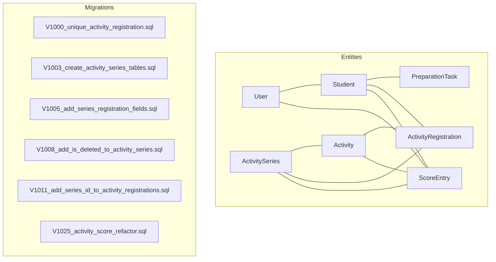
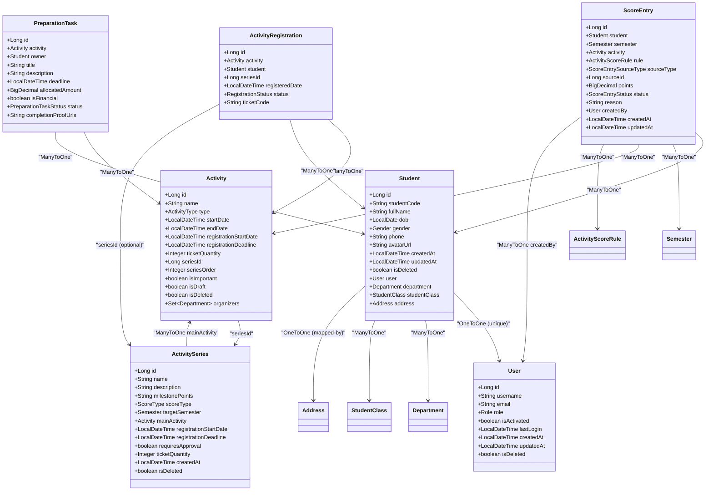
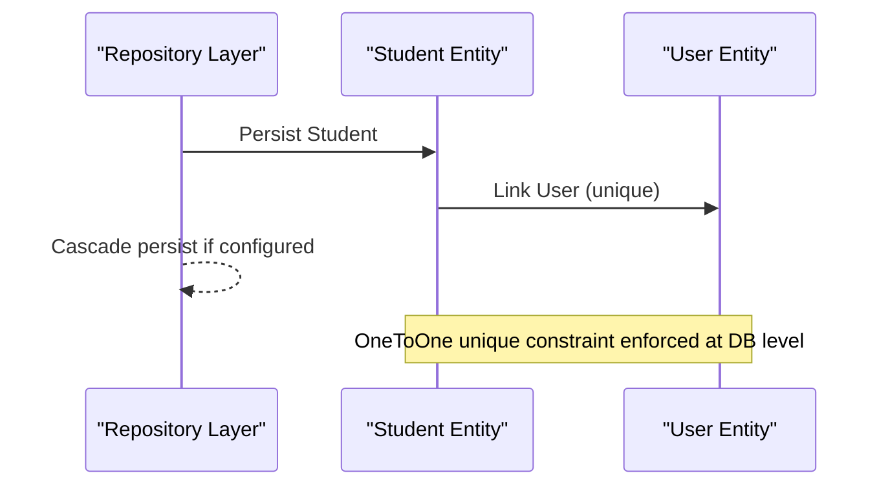
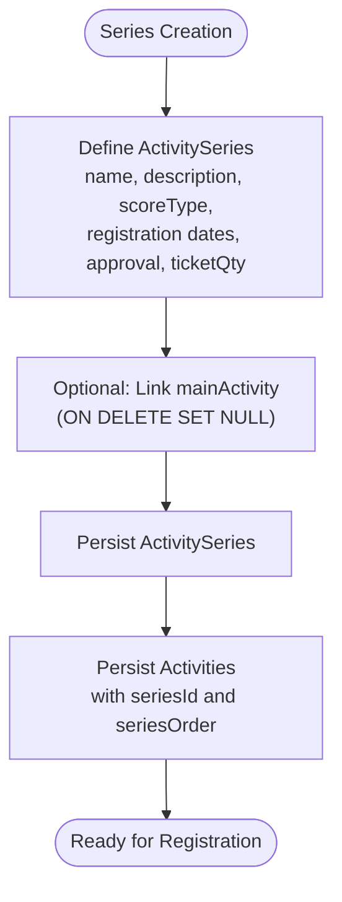
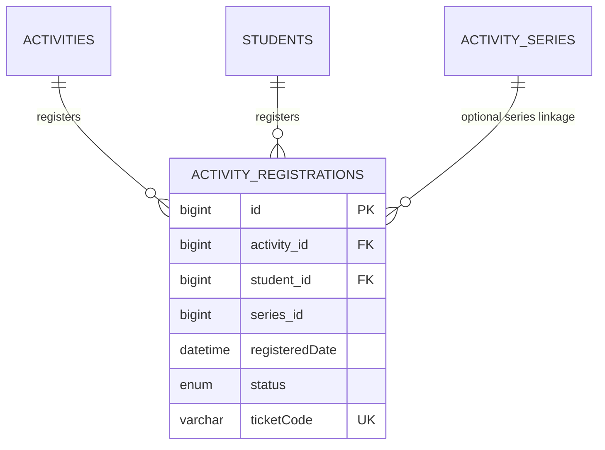
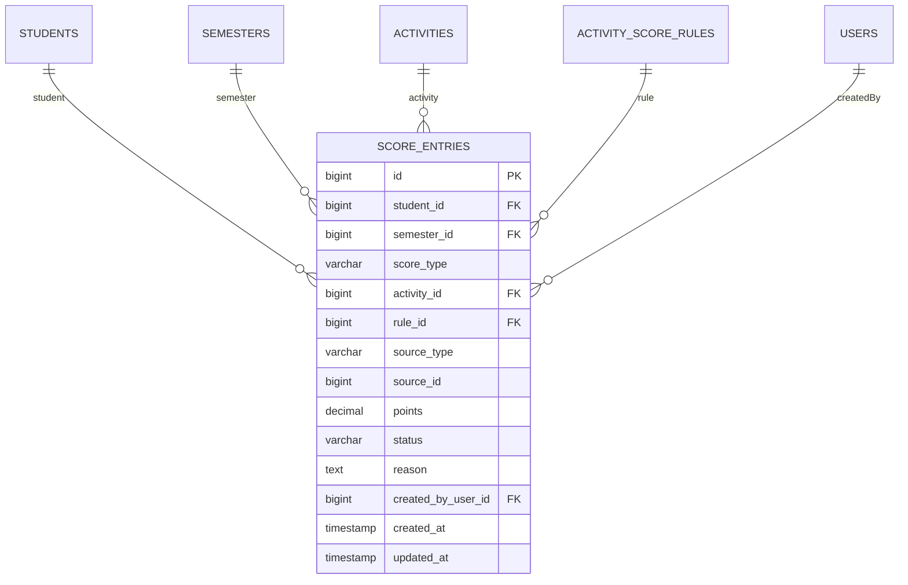
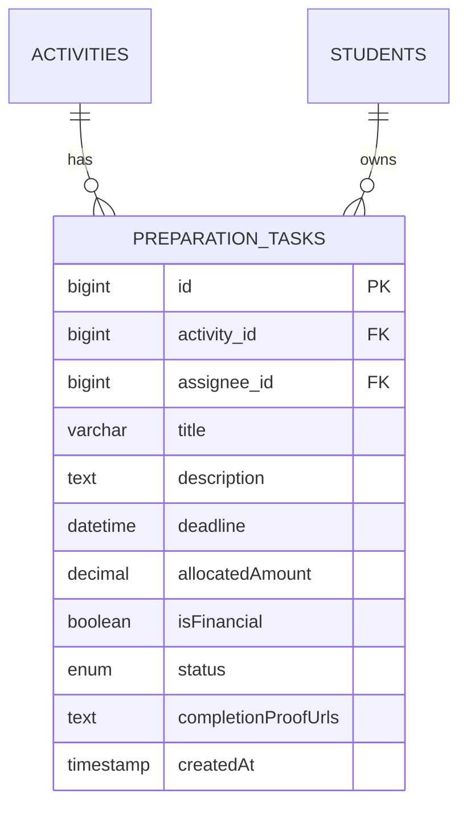
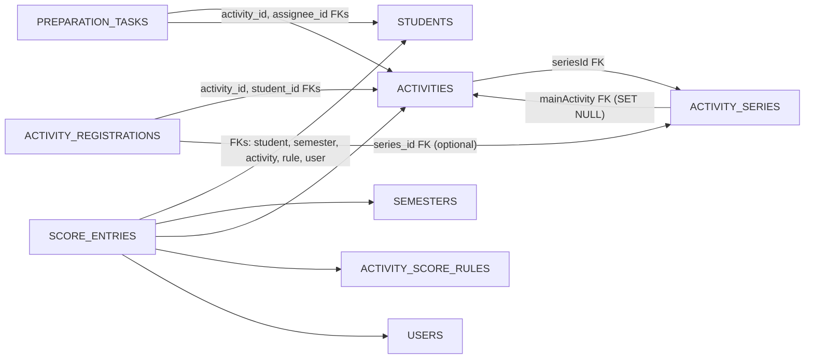

# Entity Relationships & Domain Model

<cite>
**Referenced Files in This Document**
- [User.java](file://src/main/java/vn/campuslife/entity/User.java)
- [Student.java](file://src/main/java/vn/campuslife/entity/Student.java)
- [Activity.java](file://src/main/java/vn/campuslife/entity/Activity.java)
- [ActivityRegistration.java](file://src/main/java/vn/campuslife/entity/ActivityRegistration.java)
- [ScoreEntry.java](file://src/main/java/vn/campuslife/entity/ScoreEntry.java)
- [ActivitySeries.java](file://src/main/java/vn/campuslife/entity/ActivitySeries.java)
- [PreparationTask.java](file://src/main/java/vn/campuslife/entity/PreparationTask.java)
- [V1000__unique_activity_registration.sql](file://db/migration/V1000__unique_activity_registration.sql)
- [V1003__create_activity_series_tables.sql](file://db/migration/V1003__create_activity_series_tables.sql)
- [V1005__add_series_registration_fields.sql](file://db/migration/V1005__add_series_registration_fields.sql)
- [V1008__add_is_deleted_to_activity_series.sql](file://db/migration/V1008__add_is_deleted_to_activity_series.sql)
- [V1011__add_series_id_to_activity_registrations.sql](file://db/migration/V1011__add_series_id_to_activity_registrations.sql)
- [V1025__activity_score_refactor.sql](file://db/migration/V1025__activity_score_refactor.sql)
</cite>

## Table of Contents
1. [Introduction](#introduction)
2. [Project Structure](#project-structure)
3. [Core Components](#core-components)
4. [Architecture Overview](#architecture-overview)
5. [Detailed Component Analysis](#detailed-component-analysis)
6. [Dependency Analysis](#dependency-analysis)
7. [Performance Considerations](#performance-considerations)
8. [Troubleshooting Guide](#troubleshooting-guide)
9. [Conclusion](#conclusion)
10. [Appendices](#appendices)

## Introduction
This document provides comprehensive entity relationship documentation for the CampusLife domain model with a focus on the core entities: User, Student, Activity, ActivityRegistration, ScoreEntry, ActivitySeries, and PreparationTask. It explains foreign key constraints, cascade behaviors, bidirectional associations, inheritance patterns, composite keys, unique constraints, soft delete semantics, audit trail fields, temporal data handling, and common query patterns and join scenarios.

## Project Structure
The domain model is implemented using JPA entities under the package vn.campuslife.entity. Database schema evolution is managed via Liquibase migrations located under db/migration. The migrations define foreign keys, indexes, and constraints that formalize the relationships described below.



**Diagram sources**
- [User.java:13-50](file://src/main/java/vn/campuslife/entity/User.java#L13-L50)
- [Student.java:20-78](file://src/main/java/vn/campuslife/entity/Student.java#L20-L78)
- [Activity.java:21-171](file://src/main/java/vn/campuslife/entity/Activity.java#L21-L171)
- [ActivityRegistration.java:12-47](file://src/main/java/vn/campuslife/entity/ActivityRegistration.java#L12-L47)
- [ScoreEntry.java:18-79](file://src/main/java/vn/campuslife/entity/ScoreEntry.java#L18-L79)
- [ActivitySeries.java:11-87](file://src/main/java/vn/campuslife/entity/ActivitySeries.java#L11-L87)
- [PreparationTask.java:14-57](file://src/main/java/vn/campuslife/entity/PreparationTask.java#L14-L57)
- [V1000__unique_activity_registration.sql:1-16](file://db/migration/V1000__unique_activity_registration.sql#L1-L16)
- [V1003__create_activity_series_tables.sql:1-37](file://db/migration/V1003__create_activity_series_tables.sql#L1-L37)
- [V1005__add_series_registration_fields.sql:1-8](file://db/migration/V1005__add_series_registration_fields.sql#L1-L8)
- [V1008__add_is_deleted_to_activity_series.sql:1-13](file://db/migration/V1008__add_is_deleted_to_activity_series.sql#L1-L13)
- [V1011__add_series_id_to_activity_registrations.sql:1-11](file://db/migration/V1011__add_series_id_to_activity_registrations.sql#L1-L11)
- [V1025__activity_score_refactor.sql:1-56](file://db/migration/V1025__activity_score_refactor.sql#L1-L56)

**Section sources**
- [User.java:13-50](file://src/main/java/vn/campuslife/entity/User.java#L13-L50)
- [Student.java:20-78](file://src/main/java/vn/campuslife/entity/Student.java#L20-L78)
- [Activity.java:21-171](file://src/main/java/vn/campuslife/entity/Activity.java#L21-L171)
- [ActivityRegistration.java:12-47](file://src/main/java/vn/campuslife/entity/ActivityRegistration.java#L12-L47)
- [ScoreEntry.java:18-79](file://src/main/java/vn/campuslife/entity/ScoreEntry.java#L18-L79)
- [ActivitySeries.java:11-87](file://src/main/java/vn/campuslife/entity/ActivitySeries.java#L11-L87)
- [PreparationTask.java:14-57](file://src/main/java/vn/campuslife/entity/PreparationTask.java#L14-L57)
- [V1000__unique_activity_registration.sql:1-16](file://db/migration/V1000__unique_activity_registration.sql#L1-L16)
- [V1003__create_activity_series_tables.sql:1-37](file://db/migration/V1003__create_activity_series_tables.sql#L1-L37)
- [V1005__add_series_registration_fields.sql:1-8](file://db/migration/V1005__add_series_registration_fields.sql#L1-L8)
- [V1008__add_is_deleted_to_activity_series.sql:1-13](file://db/migration/V1008__add_is_deleted_to_activity_series.sql#L1-L13)
- [V1011__add_series_id_to_activity_registrations.sql:1-11](file://db/migration/V1011__add_series_id_to_activity_registrations.sql#L1-L11)
- [V1025__activity_score_refactor.sql:1-56](file://db/migration/V1025__activity_score_refactor.sql#L1-L56)

## Core Components
This section documents the core entities and their attributes relevant to the CampusLife domain.

- User
  - Identity: Long id (auto-generated)
  - Credentials: String username (unique), String email (unique), String password
  - Roles and activation: Role role, boolean isActivated
  - Audit: LocalDateTime lastLogin, LocalDateTime createdAt, LocalDateTime updatedAt, boolean isDeleted
  - Notes: Soft delete flag isDeleted; auditing via AuditingEntityListener

- Student
  - Identity: Long id (auto-generated)
  - Person: String studentCode (unique), String fullName, LocalDate dob, Gender gender, String phone, String avatarUrl
  - Associations: OneToOne User user (unique), ManyToOne Department department, ManyToOne StudentClass studentClass, OneToOne Address address (mapped-by)
  - Audit: LocalDateTime createdAt, LocalDateTime updatedAt, boolean isDeleted
  - Notes: Soft delete flag isDeleted; equals-and-hashcode includes id

- Activity
  - Identity: Long id (auto-generated)
  - Metadata: String name, String description, ActivityType type, boolean isImportant, boolean isDraft
  - Timing: LocalDateTime startDate, endDate, registrationStartDate, registrationDeadline
  - Venue: String location, String bannerUrl, String shareLink
  - Flags: boolean requiresSubmission, boolean hasPreparation, boolean requiresApproval, boolean mandatoryForFacultyStudents
  - Series linkage: Long seriesId, Integer seriesOrder
  - Capacity: Integer ticketQuantity
  - Benefits/Requirements: String benefits, String requirements, String contactInfo
  - Check-in: String checkInCode (unique)
  - Organizations: ManyToMany Department organizers
  - Audit: CreatedBy/LastModifiedBy, timestamps createdAt/updatedAt
  - Flags: boolean isDeleted
  - Notes: Soft delete flag isDeleted; seriesId links to ActivitySeries; checkInCode is unique

- ActivityRegistration
  - Identity: Long id (auto-generated)
  - Composite key concept: activity_id + student_id enforced by unique index
  - Associations: ManyToOne Activity activity, ManyToOne Student student
  - Series: Long seriesId (nullable; optional linkage to ActivitySeries)
  - Status: RegistrationStatus status, LocalDateTime registeredDate
  - Ticket: String ticketCode (unique)
  - Audit: timestamps createdAt
  - Notes: Unique index on (activity_id, student_id); seriesId optional

- ScoreEntry
  - Identity: Long id (auto-generated)
  - Dimensions: ManyToOne Student student, ManyToOne Semester semester
  - Activity linkage: ManyToOne Activity activity, ManyToOne ActivityScoreRule rule
  - Source: ScoreEntrySourceType sourceType, Long sourceId
  - Value: BigDecimal points, ScoreEntryStatus status, String reason
  - Authoring: ManyToOne User createdBy
  - Audit: LocalDateTime createdAt (updatable=false), LocalDateTime updatedAt
  - Notes: Cascades via lazy fetch; foreign keys defined in migration

- ActivitySeries
  - Identity: Long id (auto-generated)
  - Definition: String name, String description, String milestonePoints (JSON-like), ScoreType scoreType
  - Target: ManyToOne Semester targetSemester
  - Main activity: ManyToOne Activity mainActivity (ON DELETE SET NULL)
  - Registration policy: LocalDateTime registrationStartDate, registrationDeadline, boolean requiresApproval, Integer ticketQuantity
  - Lifecycle: LocalDateTime createdAt, boolean isDeleted (default false)
  - Notes: Soft delete flag isDeleted; seriesId in Activity; seriesId in ActivityRegistration

- PreparationTask
  - Identity: Long id (auto-generated)
  - Ownership: ManyToOne Activity activity, ManyToOne Student owner (assignee)
  - Details: String title, String description, LocalDateTime deadline, BigDecimal allocatedAmount
  - Classification: boolean isFinancial, PreparationTaskStatus status
  - Evidence: String completionProofUrls
  - Audit: timestamps createdAt
  - Notes: Lazy fetch for associations; financial vs non-financial tasks

**Section sources**
- [User.java:13-50](file://src/main/java/vn/campuslife/entity/User.java#L13-L50)
- [Student.java:20-78](file://src/main/java/vn/campuslife/entity/Student.java#L20-L78)
- [Activity.java:21-171](file://src/main/java/vn/campuslife/entity/Activity.java#L21-L171)
- [ActivityRegistration.java:12-47](file://src/main/java/vn/campuslife/entity/ActivityRegistration.java#L12-L47)
- [ScoreEntry.java:18-79](file://src/main/java/vn/campuslife/entity/ScoreEntry.java#L18-L79)
- [ActivitySeries.java:11-87](file://src/main/java/vn/campuslife/entity/ActivitySeries.java#L11-L87)
- [PreparationTask.java:14-57](file://src/main/java/vn/campuslife/entity/PreparationTask.java#L14-L57)

## Architecture Overview
The domain model centers around Users and Students, Activities and ActivitySeries, Registrations linking Students to Activities, ScoreEntries recording academic and activity-based points, and PreparationTasks managing preparatory work.



**Diagram sources**
- [User.java:13-50](file://src/main/java/vn/campuslife/entity/User.java#L13-L50)
- [Student.java:20-78](file://src/main/java/vn/campuslife/entity/Student.java#L20-L78)
- [Activity.java:21-171](file://src/main/java/vn/campuslife/entity/Activity.java#L21-L171)
- [ActivitySeries.java:11-87](file://src/main/java/vn/campuslife/entity/ActivitySeries.java#L11-L87)
- [ActivityRegistration.java:12-47](file://src/main/java/vn/campuslife/entity/ActivityRegistration.java#L12-L47)
- [ScoreEntry.java:18-79](file://src/main/java/vn/campuslife/entity/ScoreEntry.java#L18-L79)
- [PreparationTask.java:14-57](file://src/main/java/vn/campuslife/entity/PreparationTask.java#L14-L57)

## Detailed Component Analysis

### User and Student
- Relationship: OneToOne between Student.user and User. The join column user_id is unique and not nullable.
- Soft delete: Both entities include isDeleted flags.
- Audit: createdAt/updatedAt via AuditingEntityListener; User also tracks lastLogin.
- Implication: Every Student must have a corresponding User; cascading deletes depend on persistence configuration.



**Diagram sources**
- [Student.java:33-35](file://src/main/java/vn/campuslife/entity/Student.java#L33-L35)
- [User.java:13-50](file://src/main/java/vn/campuslife/entity/User.java#L13-L50)

**Section sources**
- [Student.java:33-35](file://src/main/java/vn/campuslife/entity/Student.java#L33-L35)
- [User.java:13-50](file://src/main/java/vn/campuslife/entity/User.java#L13-L50)

### Activity and ActivitySeries
- Relationship: ManyToOne from Activity to ActivitySeries via seriesId; optional linkage (nullable).
- Main activity: ActivitySeries.mainActivity links to Activity with ON DELETE SET NULL.
- Registration policy: ActivitySeries defines registration windows and approval requirements; Activity mirrors capacity and draft flags.
- Soft delete: ActivitySeries includes isDeleted with default; Activity includes isDeleted.
- Indexes: seriesId indexed on Activity; mainActivity indexed on ActivitySeries.



**Diagram sources**
- [ActivitySeries.java:11-87](file://src/main/java/vn/campuslife/entity/ActivitySeries.java#L11-L87)
- [Activity.java:21-171](file://src/main/java/vn/campuslife/entity/Activity.java#L21-L171)
- [V1003__create_activity_series_tables.sql:1-37](file://db/migration/V1003__create_activity_series_tables.sql#L1-L37)

**Section sources**
- [ActivitySeries.java:11-87](file://src/main/java/vn/campuslife/entity/ActivitySeries.java#L11-L87)
- [Activity.java:21-171](file://src/main/java/vn/campuslife/entity/Activity.java#L21-L171)
- [V1003__create_activity_series_tables.sql:1-37](file://db/migration/V1003__create_activity_series_tables.sql#L1-L37)
- [V1005__add_series_registration_fields.sql:1-8](file://db/migration/V1005__add_series_registration_fields.sql#L1-L8)
- [V1008__add_is_deleted_to_activity_series.sql:1-13](file://db/migration/V1008__add_is_deleted_to_activity_series.sql#L1-L13)

### ActivityRegistration
- Composite key concept: Enforced uniqueness of (activity_id, student_id) via a unique index.
- Optional series linkage: seriesId allows registering for a series rather than a single activity.
- Ticketing: ticketCode is unique.
- Cascade behavior: Not defined in entity; depends on persistence configuration.



**Diagram sources**
- [ActivityRegistration.java:12-47](file://src/main/java/vn/campuslife/entity/ActivityRegistration.java#L12-L47)
- [V1000__unique_activity_registration.sql:1-16](file://db/migration/V1000__unique_activity_registration.sql#L1-L16)
- [V1011__add_series_id_to_activity_registrations.sql:1-11](file://db/migration/V1011__add_series_id_to_activity_registrations.sql#L1-L11)

**Section sources**
- [ActivityRegistration.java:12-47](file://src/main/java/vn/campuslife/entity/ActivityRegistration.java#L12-L47)
- [V1000__unique_activity_registration.sql:1-16](file://db/migration/V1000__unique_activity_registration.sql#L1-L16)
- [V1011__add_series_id_to_activity_registrations.sql:1-11](file://db/migration/V1011__add_series_id_to_activity_registrations.sql#L1-L11)

### ScoreEntry
- Dimensions: Links to Student, Semester, Activity, ActivityScoreRule, and optionally User (createdBy).
- Source abstraction: sourceType/sourceId decouple entries from specific triggers.
- Audit: createdAt immutable, updatedAt mutable.
- Foreign keys: Defined in migration V1025__activity_score_refactor.sql.



**Diagram sources**
- [ScoreEntry.java:18-79](file://src/main/java/vn/campuslife/entity/ScoreEntry.java#L18-L79)
- [V1025__activity_score_refactor.sql:29-56](file://db/migration/V1025__activity_score_refactor.sql#L29-L56)

**Section sources**
- [ScoreEntry.java:18-79](file://src/main/java/vn/campuslife/entity/ScoreEntry.java#L18-L79)
- [V1025__activity_score_refactor.sql:1-56](file://db/migration/V1025__activity_score_refactor.sql#L1-L56)

### PreparationTask
- Ownership: ManyToOne to Activity and Student (owner/assignee).
- Lifecycle: Status enum, deadline, financial/non-financial classification, completion proof URLs.
- Audit: createdAt.



**Diagram sources**
- [PreparationTask.java:14-57](file://src/main/java/vn/campuslife/entity/PreparationTask.java#L14-L57)

**Section sources**
- [PreparationTask.java:14-57](file://src/main/java/vn/campuslife/entity/PreparationTask.java#L14-L57)

## Dependency Analysis
This section maps foreign key dependencies and cascade behaviors derived from JPA annotations and database migrations.

- Activity -> ActivitySeries: seriesId FK; ON DELETE SET NULL for mainActivity; seriesId indexed.
- ActivityRegistration: activity_id, student_id FK; unique index on (activity_id, student_id); series_id optional FK.
- ScoreEntry: student_id, semester_id, activity_id, rule_id, created_by_user_id FKs; indexes optimized for lookups.
- ActivitySeries: mainActivity FK with ON DELETE SET NULL; isDeleted default added via migration.
- PreparationTask: activity_id, assignee_id FKs.



**Diagram sources**
- [Activity.java:21-171](file://src/main/java/vn/campuslife/entity/Activity.java#L21-L171)
- [ActivitySeries.java:11-87](file://src/main/java/vn/campuslife/entity/ActivitySeries.java#L11-L87)
- [ActivityRegistration.java:12-47](file://src/main/java/vn/campuslife/entity/ActivityRegistration.java#L12-L47)
- [ScoreEntry.java:18-79](file://src/main/java/vn/campuslife/entity/ScoreEntry.java#L18-L79)
- [PreparationTask.java:14-57](file://src/main/java/vn/campuslife/entity/PreparationTask.java#L14-L57)
- [V1003__create_activity_series_tables.sql:1-37](file://db/migration/V1003__create_activity_series_tables.sql#L1-L37)
- [V1025__activity_score_refactor.sql:1-56](file://db/migration/V1025__activity_score_refactor.sql#L1-L56)

**Section sources**
- [Activity.java:21-171](file://src/main/java/vn/campuslife/entity/Activity.java#L21-L171)
- [ActivitySeries.java:11-87](file://src/main/java/vn/campuslife/entity/ActivitySeries.java#L11-L87)
- [ActivityRegistration.java:12-47](file://src/main/java/vn/campuslife/entity/ActivityRegistration.java#L12-L47)
- [ScoreEntry.java:18-79](file://src/main/java/vn/campuslife/entity/ScoreEntry.java#L18-L79)
- [PreparationTask.java:14-57](file://src/main/java/vn/campuslife/entity/PreparationTask.java#L14-L57)
- [V1003__create_activity_series_tables.sql:1-37](file://db/migration/V1003__create_activity_series_tables.sql#L1-L37)
- [V1025__activity_score_refactor.sql:1-56](file://db/migration/V1025__activity_score_refactor.sql#L1-L56)

## Performance Considerations
- Unique constraints and indexes:
  - ActivityRegistration unique index on (activity_id, student_id) prevents duplicates and accelerates lookup.
  - ScoreEntry indexes on student_id/semester_id/score_type/status, source_type/source_id, and activity_id/rule_id improve query performance.
  - Activity seriesId indexed; ActivitySeries mainActivity indexed.
- Fetch strategies:
  - ScoreEntry uses lazy fetch for dimensional entities to avoid unnecessary joins.
- Temporal queries:
  - Registration deadlines, activity start/end dates, and audit timestamps enable efficient filtering and reporting.

[No sources needed since this section provides general guidance]

## Troubleshooting Guide
- Duplicate registrations:
  - The unique index on (activity_id, student_id) prevents duplicates; ensure cleanup of existing duplicates prior to applying the index.
- Series registration:
  - series_id in ActivityRegistration is optional; verify whether a registration belongs to a series or a single activity.
- Soft deletion:
  - Entities with isDeleted flags require filters to exclude deleted records in queries.
- Audit fields:
  - createdAt/updatedAt and createdBy/lastModifiedBy should be populated via AuditingEntityListener; verify listener configuration.

**Section sources**
- [V1000__unique_activity_registration.sql:1-16](file://db/migration/V1000__unique_activity_registration.sql#L1-L16)
- [V1008__add_is_deleted_to_activity_series.sql:1-13](file://db/migration/V1008__add_is_deleted_to_activity_series.sql#L1-L13)
- [User.java:13-50](file://src/main/java/vn/campuslife/entity/User.java#L13-L50)
- [Student.java:20-78](file://src/main/java/vn/campuslife/entity/Student.java#L20-L78)
- [Activity.java:21-171](file://src/main/java/vn/campuslife/entity/Activity.java#L21-L171)
- [ActivitySeries.java:11-87](file://src/main/java/vn/campuslife/entity/ActivitySeries.java#L11-L87)
- [ActivityRegistration.java:12-47](file://src/main/java/vn/campuslife/entity/ActivityRegistration.java#L12-L47)
- [ScoreEntry.java:18-79](file://src/main/java/vn/campuslife/entity/ScoreEntry.java#L18-L79)

## Conclusion
The CampusLife domain model establishes clear relationships among Users, Students, Activities, ActivitySeries, Registrations, ScoreEntries, and PreparationTasks. Soft delete and audit fields are consistently applied across entities, while migrations formalize foreign keys, indexes, and unique constraints. The design supports scalable querying and maintains referential integrity through well-defined cardinalities and participation constraints.

[No sources needed since this section summarizes without analyzing specific files]

## Appendices

### Entity Relationship Diagram (ERD)
```mermaid
erDiagram
USERS {
bigint id PK
varchar username UK
varchar email UK
enum role
boolean isActivated
boolean isDeleted
timestamp createdAt
timestamp updatedAt
}
STUDENTS {
bigint id PK
bigint user_id UK FK
varchar studentCode UK
varchar fullName
bigint department_id FK
bigint class_id FK
boolean isDeleted
timestamp createdAt
timestamp updatedAt
}
DEPARTMENTS {
bigint id PK
varchar name
}
STUDENT_CLASSES {
bigint id PK
varchar name
}
ACTIVITIES {
bigint id PK
enum type
varchar name
datetime startDate
datetime endDate
datetime registrationStartDate
datetime registrationDeadline
integer ticketQuantity
bigint seriesId FK
integer seriesOrder
boolean isImportant
boolean isDraft
boolean isDeleted
}
ACTIVITY_SERIES {
bigint id PK
varchar name
varchar description
varchar milestonePoints
enum scoreType
bigint target_semester_id FK
bigint main_activity_id FK
datetime registrationStartDate
datetime registrationDeadline
boolean requiresApproval
integer ticketQuantity
boolean isDeleted
}
ACTIVITY_REGISTRATIONS {
bigint id PK
bigint activity_id FK
bigint student_id FK
bigint series_id
datetime registeredDate
enum status
varchar ticketCode UK
}
SEMESTERS {
bigint id PK
varchar name
}
ACTIVITY_SCORE_RULES {
bigint id PK
bigint activity_id FK
enum score_type
enum trigger_type
enum calculation
decimal points
decimal fail_points
enum audience
enum semester_policy
bigint explicit_semester_id FK
boolean enabled
}
SCORE_ENTRIES {
bigint id PK
bigint student_id FK
bigint semester_id FK
enum score_type
bigint activity_id FK
bigint rule_id FK
enum source_type
bigint source_id
decimal points
enum status
text reason
bigint created_by_user_id FK
timestamp created_at
timestamp updated_at
}
PREPARATION_TASKS {
bigint id PK
bigint activity_id FK
bigint assignee_id FK
varchar title
text description
datetime deadline
decimal allocatedAmount
boolean isFinancial
enum status
text completionProofUrls
timestamp createdAt
}
ADDRESS {
bigint id PK
bigint student_id UK FK
text details
}
USERS ||--o{ STUDENTS : "user"
DEPARTMENTS ||--o{ STUDENTS : "department"
STUDENT_CLASSES ||--o{ STUDENTS : "class"
ACTIVITY_SERIES ||--o{ ACTIVITIES : "series"
ACTIVITIES ||--o{ ACTIVITY_REGISTRATIONS : "registrations"
STUDENTS ||--o{ ACTIVITY_REGISTRATIONS : "registrations"
ACTIVITY_SERIES ||--o{ ACTIVITY_REGISTRATIONS : "optional series linkage"
SEMESTERS ||--o{ SCORE_ENTRIES : "semester"
ACTIVITIES ||--o{ SCORE_ENTRIES : "activity"
ACTIVITY_SCORE_RULES ||--o{ SCORE_ENTRIES : "rule"
USERS ||--o{ SCORE_ENTRIES : "createdBy"
STUDENTS ||--o{ PREPARATION_TASKS : "assignee"
ACTIVITIES ||--o{ PREPARATION_TASKS : "activity"
STUDENTS ||--|| ADDRESS : "address"
```

**Diagram sources**
- [User.java:13-50](file://src/main/java/vn/campuslife/entity/User.java#L13-L50)
- [Student.java:20-78](file://src/main/java/vn/campuslife/entity/Student.java#L20-L78)
- [Activity.java:21-171](file://src/main/java/vn/campuslife/entity/Activity.java#L21-L171)
- [ActivitySeries.java:11-87](file://src/main/java/vn/campuslife/entity/ActivitySeries.java#L11-L87)
- [ActivityRegistration.java:12-47](file://src/main/java/vn/campuslife/entity/ActivityRegistration.java#L12-L47)
- [ScoreEntry.java:18-79](file://src/main/java/vn/campuslife/entity/ScoreEntry.java#L18-L79)
- [PreparationTask.java:14-57](file://src/main/java/vn/campuslife/entity/PreparationTask.java#L14-L57)
- [V1025__activity_score_refactor.sql:1-56](file://db/migration/V1025__activity_score_refactor.sql#L1-L56)

### Common Query Patterns and Join Scenarios
- Find all activities a student registered for (including series-linked registrations):
  - Join ActivityRegistration with Activity and optional ActivitySeries.
  - Filter by student_id and optional series_id.
- Compute a student’s score per semester and score type:
  - Join ScoreEntry with Semester and ScoreType; apply status filters and date ranges.
- Retrieve series milestones and progress:
  - Join ActivitySeries with ScoreEntry where source_type refers to series milestones.
- List overdue preparation tasks:
  - Join PreparationTask with Activity and filter by deadline < now and status != COMPLETED.
- Audit trails:
  - Use createdAt/updatedAt and createdBy/lastModifiedBy to track changes across entities.

[No sources needed since this section provides general guidance]