# Enumeration Types & Configuration

<cite>
**Referenced Files in This Document**
- [Role.java](file://src/main/java/vn/campuslife/enumeration/Role.java)
- [ActivityType.java](file://src/main/java/vn/campuslife/enumeration/ActivityType.java)
- [ScoreType.java](file://src/main/java/vn/campuslife/enumeration/ScoreType.java)
- [ActivityPresetCode.java](file://src/main/java/vn/campuslife/enumeration/ActivityPresetCode.java)
- [ArticleType.java](file://src/main/java/vn/campuslife/enumeration/ArticleType.java)
- [AttemptStatus.java](file://src/main/java/vn/campuslife/enumeration/AttemptStatus.java)
- [ChatbotIntent.java](file://src/main/java/vn/campuslife/enumeration/ChatbotIntent.java)
- [ChatbotMessageRole.java](file://src/main/java/vn/campuslife/enumeration/ChatbotMessageRole.java)
- [ChatbotPageContext.java](file://src/main/java/vn/campuslife/enumeration/ChatbotPageContext.java)
- [DepartmentType.java](file://src/main/java/vn/campuslife/enumeration/DepartmentType.java)
- [EmailStatus.java](file://src/main/java/vn/campuslife/enumeration/EmailStatus.java)
- [ExpenseStatus.java](file://src/main/java/vn/campuslife/enumeration/ExpenseStatus.java)
- [FundAdvanceStatus.java](file://src/main/java/vn/campuslife/enumeration/FundAdvanceStatus.java)
- [Gender.java](file://src/main/java/vn/campuslife/enumeration/Gender.java)
- [MiniGameType.java](file://src/main/java/vn/campuslife/enumeration/MiniGameType.java)
- [NotificationStatus.java](file://src/main/java/vn/campuslife/enumeration/NotificationStatus.java)
- [NotificationType.java](file://src/main/java/vn/campuslife/enumeration/NotificationType.java)
- [ParticipationType.java](file://src/main/java/vn/campuslife/enumeration/ParticipationType.java)
- [PreparationTaskMemberRole.java](file://src/main/java/vn/campuslife/enumeration/PreparationTaskMemberRole.java)
- [PreparationTaskStatus.java](file://src/main/java/vn/campuslife/enumeration/PreparationTaskStatus.java)
- [ReactionType.java](file://src/main/java/vn/campuslife/enumeration/ReactionType.java)
- [RecipientType.java](file://src/main/java/vn/campuslife/enumeration/RecipientType.java)
- [RegistrationCtaStatus.java](file://src/main/java/vn/campuslife/enumeration/RegistrationCtaStatus.java)
- [RegistrationStatus.java](file://src/main/java/vn/campuslife/enumeration/RegistrationStatus.java)
- [ReminderCode.java](file://src/main/java/vn/campuslife/enumeration/ReminderCode.java)
- [ReminderStatus.java](file://src/main/java/vn/campuslife/enumeration/ReminderStatus.java)
- [ReminderTargetType.java](file://src/main/java/vn/campuslife/enumeration/ReminderTargetType.java)
- [ScoreEntrySourceType.java](file://src/main/java/vn/campuslife/enumeration/ScoreEntrySourceType.java)
- [ScoreEntryStatus.java](file://src/main/java/vn/campuslife/enumeration/ScoreEntryStatus.java)
- [ScoreRuleAudience.java](file://src/main/java/vn/campuslife/enumeration/ScoreRuleAudience.java)
- [ScoreRuleCalculation.java](file://src/main/java/vn/campuslife/enumeration/ScoreRuleCalculation.java)
- [ScoreRuleTrigger.java](file://src/main/java/vn/campuslife/enumeration/ScoreRuleTrigger.java)
- [ScoreSemesterPolicy.java](file://src/main/java/vn/campuslife/enumeration/ScoreSemesterPolicy.java)
- [SeriesPresetCode.java](file://src/main/java/vn/campuslife/enumeration/SeriesPresetCode.java)
- [SubmissionStatus.java](file://src/main/java/vn/campuslife/enumeration/SubmissionStatus.java)
- [TaskStatus.java](file://src/main/java/vn/campuslife/enumeration/TaskStatus.java)
- [WorkloadWarningType.java](file://src/main/java/vn/campuslife/enumeration/WorkloadWarningType.java)
</cite>

## Table of Contents
1. [Introduction](#introduction)
2. [Project Structure](#project-structure)
3. [Core Components](#core-components)
4. [Architecture Overview](#architecture-overview)
5. [Detailed Component Analysis](#detailed-component-analysis)
6. [Dependency Analysis](#dependency-analysis)
7. [Performance Considerations](#performance-considerations)
8. [Troubleshooting Guide](#troubleshooting-guide)
9. [Conclusion](#conclusion)

## Introduction
This document provides comprehensive documentation for all enumeration types used in the CampusLife application. It covers definitions, persistence considerations, ordinal and string representations, business rules, validation and defaulting behaviors, and usage patterns in queries and business logic. Enumerations are grouped by functional domains such as roles, activity types, scoring, registration, notifications, reminders, and preparation tasks.

## Project Structure
Enumerations are organized under a dedicated package for type safety and discoverability. They are referenced across entities, services, repositories, and DTOs to enforce consistent state and behavior across the system.

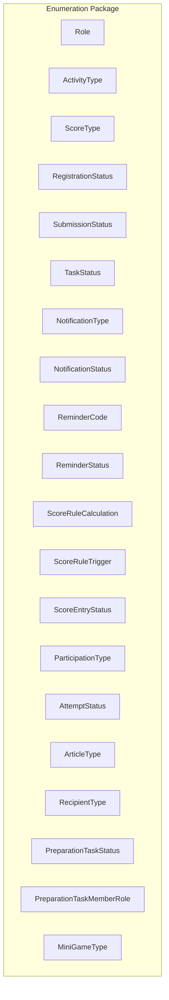

**Section sources**
- [Role.java:1-7](file://src/main/java/vn/campuslife/enumeration/Role.java#L1-L7)
- [ActivityType.java:1-8](file://src/main/java/vn/campuslife/enumeration/ActivityType.java#L1-L8)
- [ScoreType.java:1-7](file://src/main/java/vn/campuslife/enumeration/ScoreType.java#L1-L7)

## Core Components
This section documents the primary enumerations and their roles in the system.

- Role
  - Values: ADMIN, MANAGER, STUDENT
  - Business rules: Controls access to administrative and management features; STUDENT role is restricted from privileged actions.
  - Persistence: Stored as an enum in JPA entities; mapped to database storage via standard enum conversion.
  - Validation: Typically validated against allowed values during authentication and authorization checks.
  - Usage examples: Filtering by role in user-related services and enforcing access control policies.

- ActivityType
  - Values: SUKIEN, MINIGAME, CONG_TAC_XA_HOI, CHUYEN_DE_DOANH_NGHIEP
  - Business rules: Determines activity behavior, scoring applicability, and presentation logic.
  - Persistence: Persisted as an enum; supports future expansion for new activity categories.
  - Validation: Enforced when creating/updating activities; used to route business logic.

- ScoreType
  - Values: REN_LUYEN, CONG_TAC_XA_HOI, CHUYEN_DE
  - Business rules: Defines the category of score entries; impacts score aggregation and reporting per category.
  - Persistence: Stored as an enum; nullable in series-related contexts to allow flexible rule definitions.
  - Validation: Used to filter and compute scores by category; ensures consistent categorization.

**Section sources**
- [Role.java:3-7](file://src/main/java/vn/campuslife/enumeration/Role.java#L3-L7)
- [ActivityType.java:3-8](file://src/main/java/vn/campuslife/enumeration/ActivityType.java#L3-L8)
- [ScoreType.java:3-7](file://src/main/java/vn/campuslife/enumeration/ScoreType.java#L3-L7)

## Architecture Overview
Enumerations are foundational building blocks that influence entity states, business rules, and cross-cutting concerns like notifications and reminders.

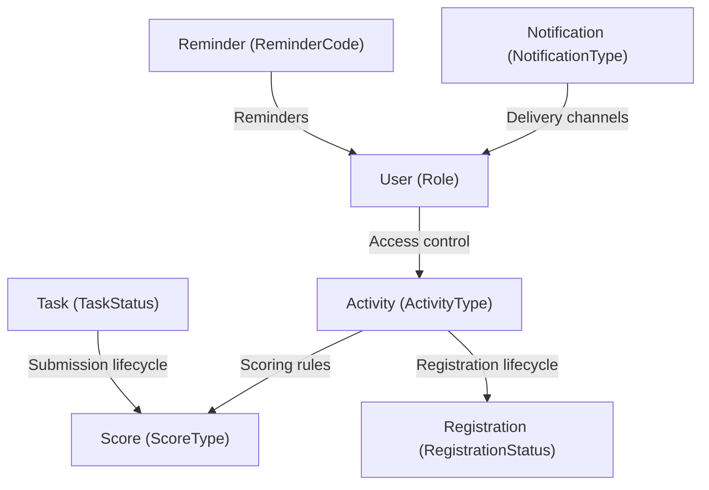

[No sources needed since this diagram shows conceptual workflow, not actual code structure]

## Detailed Component Analysis

### Role
- Definition: ADMIN, MANAGER, STUDENT
- Persistence: Enum stored in JPA entities; ordinal or name strategy depends on entity mapping.
- Business rules: Administrative boundaries; STUDENT role typically lacks write permissions to sensitive data.
- Validation: Enforced in security filters and service methods.

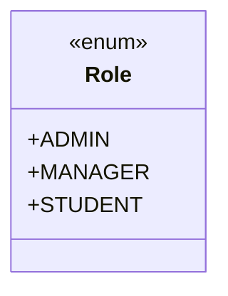

**Diagram sources**
- [Role.java:3-7](file://src/main/java/vn/campuslife/enumeration/Role.java#L3-L7)

**Section sources**
- [Role.java:3-7](file://src/main/java/vn/campuslife/enumeration/Role.java#L3-L7)

### ActivityType
- Definition: SUKIEN, MINIGAME, CONG_TAC_XA_HOI, CHUYEN_DE_DOANH_NGHIEP
- Persistence: Enum persisted in activity entities; supports extensibility.
- Business rules: Impacts scoring, registration flow, and visibility.

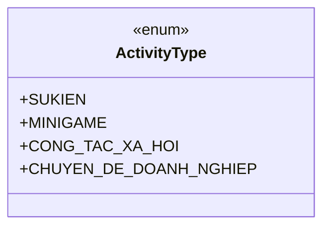

**Diagram sources**
- [ActivityType.java:3-8](file://src/main/java/vn/campuslife/enumeration/ActivityType.java#L3-L8)

**Section sources**
- [ActivityType.java:3-8](file://src/main/java/vn/campuslife/enumeration/ActivityType.java#L3-L8)

### ScoreType
- Definition: REN_LUYEN, CONG_TAC_XA_HOI, CHUYEN_DE
- Persistence: Enum persisted in score-related entities; nullable in series rules to allow flexibility.
- Business rules: Categorizes score entries; influences semester policy and aggregation.

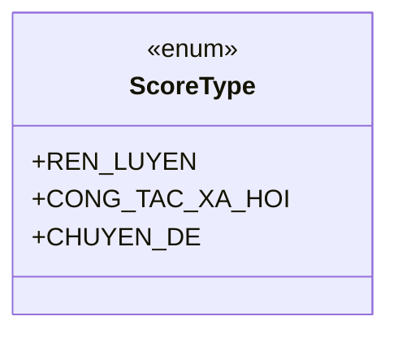

**Diagram sources**
- [ScoreType.java:3-7](file://src/main/java/vn/campuslife/enumeration/ScoreType.java#L3-L7)

**Section sources**
- [ScoreType.java:3-7](file://src/main/java/vn/campuslife/enumeration/ScoreType.java#L3-L7)

### Registration Lifecycle Enums
- RegistrationStatus: PENDING, APPROVED, REJECTED, CANCELLED, ATTENDED, WAITLIST
- RegistrationCtaStatus: UPCOMING, OPEN, WAITLIST, FULL, CLOSED
- ParticipationType: REGISTERED, CHECKED_IN, CHECKED_OUT, ATTENDED, COMPLETED

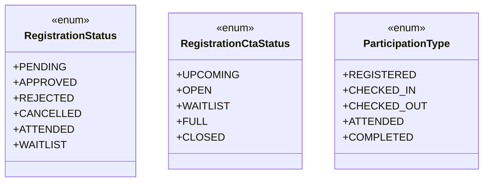

**Diagram sources**
- [RegistrationStatus.java:3-11](file://src/main/java/vn/campuslife/enumeration/RegistrationStatus.java#L3-L11)
- [RegistrationCtaStatus.java:3-10](file://src/main/java/vn/campuslife/enumeration/RegistrationCtaStatus.java#L3-L10)
- [ParticipationType.java:3-10](file://src/main/java/vn/campuslife/enumeration/ParticipationType.java#L3-L10)

**Section sources**
- [RegistrationStatus.java:3-11](file://src/main/java/vn/campuslife/enumeration/RegistrationStatus.java#L3-L11)
- [RegistrationCtaStatus.java:3-10](file://src/main/java/vn/campuslife/enumeration/RegistrationCtaStatus.java#L3-L10)
- [ParticipationType.java:3-10](file://src/main/java/vn/campuslife/enumeration/ParticipationType.java#L3-L10)

### Submission and Task Status
- SubmissionStatus: SUBMITTED, GRADED, RETURNED, LATE, MISSING
- TaskStatus: PENDING, ASSIGNED, IN_PROGRESS, COMPLETED, OVERDUE

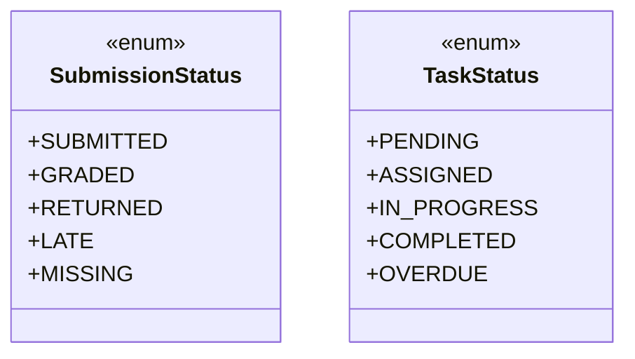

**Diagram sources**
- [SubmissionStatus.java:3-10](file://src/main/java/vn/campuslife/enumeration/SubmissionStatus.java#L3-L10)
- [TaskStatus.java:3-10](file://src/main/java/vn/campuslife/enumeration/TaskStatus.java#L3-L10)

**Section sources**
- [SubmissionStatus.java:3-10](file://src/main/java/vn/campuslife/enumeration/SubmissionStatus.java#L3-L10)
- [TaskStatus.java:3-10](file://src/main/java/vn/campuslife/enumeration/TaskStatus.java#L3-L10)

### Notification and Reminder Enums
- NotificationType: ACTIVITY_REGISTRATION, TASK_ASSIGNMENT, TASK_SUBMISSION, TASK_GRADING, ACTIVITY_REMINDER, REMINDER_1_DAY, REMINDER_1_HOUR, SYSTEM_ANNOUNCEMENT, PROFILE_UPDATE, SCORE_UPDATE, GENERAL, ARTICLE_PUBLISHED
- NotificationStatus: UNREAD, READ, ARCHIVED
- ReminderCode: BEFORE_1_DAY, BEFORE_1_HOUR, EVENT_NO_SHOW_PENALTY, SERIES_MINIMUM_REQUIREMENT, TASK_BEFORE_1_DAY, TASK_BEFORE_3_HOURS, TASK_OVERDUE
- ReminderStatus: PENDING, SENT, CANCELLED, FAILED
- ReminderTargetType: EVENT, TASK, SERIES

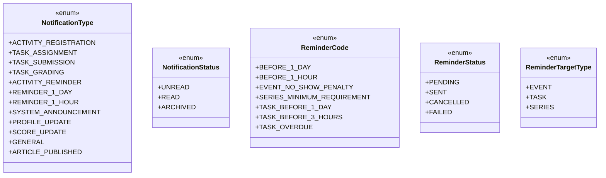

**Diagram sources**
- [NotificationType.java:3-17](file://src/main/java/vn/campuslife/enumeration/NotificationType.java#L3-L17)
- [NotificationStatus.java:3-8](file://src/main/java/vn/campuslife/enumeration/NotificationStatus.java#L3-L8)
- [ReminderCode.java:3-12](file://src/main/java/vn/campuslife/enumeration/ReminderCode.java#L3-L12)
- [ReminderStatus.java:3-9](file://src/main/java/vn/campuslife/enumeration/ReminderStatus.java#L3-L9)
- [ReminderTargetType.java:3-8](file://src/main/java/vn/campuslife/enumeration/ReminderTargetType.java#L3-L8)

**Section sources**
- [NotificationType.java:3-17](file://src/main/java/vn/campuslife/enumeration/NotificationType.java#L3-L17)
- [NotificationStatus.java:3-8](file://src/main/java/vn/campuslife/enumeration/NotificationStatus.java#L3-L8)
- [ReminderCode.java:3-12](file://src/main/java/vn/campuslife/enumeration/ReminderCode.java#L3-L12)
- [ReminderStatus.java:3-9](file://src/main/java/vn/campuslife/enumeration/ReminderStatus.java#L3-L9)
- [ReminderTargetType.java:3-8](file://src/main/java/vn/campuslife/enumeration/ReminderTargetType.java#L3-L8)

### Scoring Rule and Entry Enums
- ScoreEntrySourceType: ACTIVITY_PARTICIPATION, ACTIVITY_REGISTRATION, TASK_SUBMISSION, TASK_ASSIGNMENT, MINIGAME_ATTEMPT, SERIES_PROGRESS, SERIES_MINIMUM_REQUIREMENT, MANUAL_ADJUSTMENT, RECALCULATION
- ScoreEntryStatus: ACTIVE, REVERSED
- ScoreRuleAudience: ALL_PARTICIPANTS, DEPARTMENT_ONLY, OUTSIDE_DEPARTMENTS_ONLY
- ScoreRuleCalculation: FIXED_POINTS, COUNT_COMPLETION, PASS_FAIL_POINTS, PENALTY_POINTS, SERIES_MILESTONE
- ScoreRuleTrigger: PARTICIPATION_COMPLETED, NO_SHOW, SUBMISSION_GRADED, MINIGAME_PASSED, MINIGAME_EXHAUSTED_ATTEMPTS, SERIES_MILESTONE_REACHED, TASK_OVERDUE
- ScoreSemesterPolicy: ACTIVITY_SEMESTER, EXPLICIT_SEMESTER

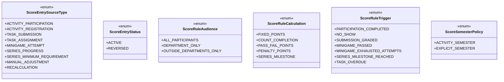

**Diagram sources**
- [ScoreEntrySourceType.java:3-13](file://src/main/java/vn/campuslife/enumeration/ScoreEntrySourceType.java#L3-L13)
- [ScoreEntryStatus.java:3-7](file://src/main/java/vn/campuslife/enumeration/ScoreEntryStatus.java#L3-L7)
- [ScoreRuleAudience.java:3-8](file://src/main/java/vn/campuslife/enumeration/ScoreRuleAudience.java#L3-L8)
- [ScoreRuleCalculation.java:3-10](file://src/main/java/vn/campuslife/enumeration/ScoreRuleCalculation.java#L3-L10)
- [ScoreRuleTrigger.java:3-12](file://src/main/java/vn/campuslife/enumeration/ScoreRuleTrigger.java#L3-L12)
- [ScoreSemesterPolicy.java:3-6](file://src/main/java/vn/campuslife/enumeration/ScoreSemesterPolicy.java#L3-L6)

**Section sources**
- [ScoreEntrySourceType.java:3-13](file://src/main/java/vn/campuslife/enumeration/ScoreEntrySourceType.java#L3-L13)
- [ScoreEntryStatus.java:3-7](file://src/main/java/vn/campuslife/enumeration/ScoreEntryStatus.java#L3-L7)
- [ScoreRuleAudience.java:3-8](file://src/main/java/vn/campuslife/enumeration/ScoreRuleAudience.java#L3-L8)
- [ScoreRuleCalculation.java:3-10](file://src/main/java/vn/campuslife/enumeration/ScoreRuleCalculation.java#L3-L10)
- [ScoreRuleTrigger.java:3-12](file://src/main/java/vn/campuslife/enumeration/ScoreRuleTrigger.java#L3-L12)
- [ScoreSemesterPolicy.java:3-6](file://src/main/java/vn/campuslife/enumeration/ScoreSemesterPolicy.java#L3-L6)

### Preparation Task Enums
- PreparationTaskStatus: PENDING, ACCEPTED, COMPLETION_REQUESTED, COMPLETED
- PreparationTaskMemberRole: LEADER, MEMBER

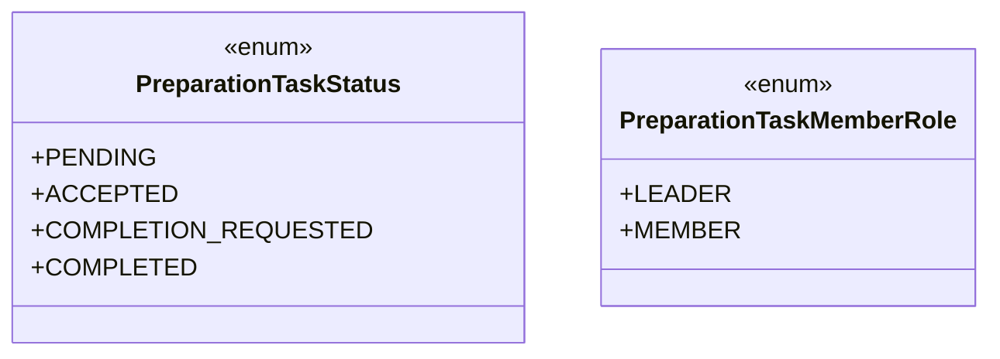

**Diagram sources**
- [PreparationTaskStatus.java:3-9](file://src/main/java/vn/campuslife/enumeration/PreparationTaskStatus.java#L3-L9)
- [PreparationTaskMemberRole.java:3-8](file://src/main/java/vn/campuslife/enumeration/PreparationTaskMemberRole.java#L3-L8)

**Section sources**
- [PreparationTaskStatus.java:3-9](file://src/main/java/vn/campuslife/enumeration/PreparationTaskStatus.java#L3-L9)
- [PreparationTaskMemberRole.java:3-8](file://src/main/java/vn/campuslife/enumeration/PreparationTaskMemberRole.java#L3-L8)

### Additional Domain Enums
- AttemptStatus: IN_PROGRESS, PASSED, FAILED
- ArticleType: ANNOUNCEMENT, RECAP, BEHIND_SCENE, RESULT, UPDATE
- DepartmentType: PHONG_BAN, KHOA
- EmailStatus: SUCCESS, FAILED, PARTIAL
- ExpenseStatus: PENDING_LEADER, PENDING_ADMIN, APPROVED, REJECTED
- FundAdvanceStatus: REQUESTED, HOLDING, SETTLED, REJECTED
- Gender: MALE, FEMALE, OTHER
- MiniGameType: QUIZ
- ReactionType: LIKE, LOVE, CLAP, FIRE, SUPPORT
- RecipientType: BULK, ACTIVITY_REGISTRATIONS, SERIES_REGISTRATIONS, ALL_STUDENTS, BY_CLASS, BY_DEPARTMENT
- SeriesPresetCode: SERIES_MILESTONE_BASIC, ENTERPRISE_SERIES, CUSTOM
- WorkloadWarningType: OVERLOADED, UNASSIGNED

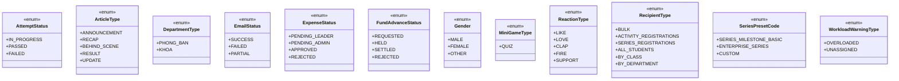

**Diagram sources**
- [AttemptStatus.java:3-9](file://src/main/java/vn/campuslife/enumeration/AttemptStatus.java#L3-L9)
- [ArticleType.java:3-10](file://src/main/java/vn/campuslife/enumeration/ArticleType.java#L3-L10)
- [DepartmentType.java:3-6](file://src/main/java/vn/campuslife/enumeration/DepartmentType.java#L3-L6)
- [EmailStatus.java:3-9](file://src/main/java/vn/campuslife/enumeration/EmailStatus.java#L3-L9)
- [ExpenseStatus.java:3-10](file://src/main/java/vn/campuslife/enumeration/ExpenseStatus.java#L3-L10)
- [FundAdvanceStatus.java:3-9](file://src/main/java/vn/campuslife/enumeration/FundAdvanceStatus.java#L3-L9)
- [Gender.java:3-10](file://src/main/java/vn/campuslife/enumeration/Gender.java#L3-L10)
- [MiniGameType.java:3-8](file://src/main/java/vn/campuslife/enumeration/MiniGameType.java#L3-L8)
- [ReactionType.java:3-10](file://src/main/java/vn/campuslife/enumeration/ReactionType.java#L3-L10)
- [RecipientType.java:3-11](file://src/main/java/vn/campuslife/enumeration/RecipientType.java#L3-L11)
- [SeriesPresetCode.java:3-8](file://src/main/java/vn/campuslife/enumeration/SeriesPresetCode.java#L3-L8)
- [WorkloadWarningType.java:3-8](file://src/main/java/vn/campuslife/enumeration/WorkloadWarningType.java#L3-L8)

**Section sources**
- [AttemptStatus.java:3-9](file://src/main/java/vn/campuslife/enumeration/AttemptStatus.java#L3-L9)
- [ArticleType.java:3-10](file://src/main/java/vn/campuslife/enumeration/ArticleType.java#L3-L10)
- [DepartmentType.java:3-6](file://src/main/java/vn/campuslife/enumeration/DepartmentType.java#L3-L6)
- [EmailStatus.java:3-9](file://src/main/java/vn/campuslife/enumeration/EmailStatus.java#L3-L9)
- [ExpenseStatus.java:3-10](file://src/main/java/vn/campuslife/enumeration/ExpenseStatus.java#L3-L10)
- [FundAdvanceStatus.java:3-9](file://src/main/java/vn/campuslife/enumeration/FundAdvanceStatus.java#L3-L9)
- [Gender.java:3-10](file://src/main/java/vn/campuslife/enumeration/Gender.java#L3-L10)
- [MiniGameType.java:3-8](file://src/main/java/vn/campuslife/enumeration/MiniGameType.java#L3-L8)
- [ReactionType.java:3-10](file://src/main/java/vn/campuslife/enumeration/ReactionType.java#L3-L10)
- [RecipientType.java:3-11](file://src/main/java/vn/campuslife/enumeration/RecipientType.java#L3-L11)
- [SeriesPresetCode.java:3-8](file://src/main/java/vn/campuslife/enumeration/SeriesPresetCode.java#L3-L8)
- [WorkloadWarningType.java:3-8](file://src/main/java/vn/campuslife/enumeration/WorkloadWarningType.java#L3-L8)

### Chatbot and Page Context Enums
- ChatbotIntent: TIME, LOCATION, REGISTRATION, BENEFITS, REQUIREMENTS, POINTS, CONTACT, CHECKIN, SUMMARY, LIST_UPCOMING, LIST_OPEN_REGISTRATION, LIST_ONGOING, LIST_PAST, LIST_BY_SCORETYPE, ARTICLE_FOR_ACTIVITY, ACTIVITY_FOR_ARTICLE, SUMMARIZE_ARTICLE, CHOOSE_OPTION, UNKNOWN
- ChatbotMessageRole: USER, ASSISTANT
- ChatbotPageContext: GLOBAL, ACTIVITY_DETAIL, ARTICLE_DETAIL

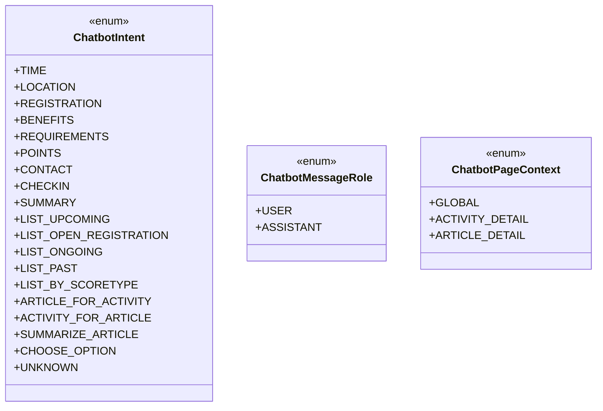

**Diagram sources**
- [ChatbotIntent.java:3-24](file://src/main/java/vn/campuslife/enumeration/ChatbotIntent.java#L3-L24)
- [ChatbotMessageRole.java:3-7](file://src/main/java/vn/campuslife/enumeration/ChatbotMessageRole.java#L3-L7)
- [ChatbotPageContext.java:3-8](file://src/main/java/vn/campuslife/enumeration/ChatbotPageContext.java#L3-L8)

**Section sources**
- [ChatbotIntent.java:3-24](file://src/main/java/vn/campuslife/enumeration/ChatbotIntent.java#L3-L24)
- [ChatbotMessageRole.java:3-7](file://src/main/java/vn/campuslife/enumeration/ChatbotMessageRole.java#L3-L7)
- [ChatbotPageContext.java:3-8](file://src/main/java/vn/campuslife/enumeration/ChatbotPageContext.java#L3-L8)

### Preset Codes
- ActivityPresetCode: EVENT_BASIC, EVENT_WITH_SUBMISSION, ENTERPRISE_SEMINAR_BASIC, ENTERPRISE_SEMINAR_WITH_BONUS, MINIGAME_PASS_ONLY, CUSTOM
- SeriesPresetCode: SERIES_MILESTONE_BASIC, ENTERPRISE_SERIES, CUSTOM

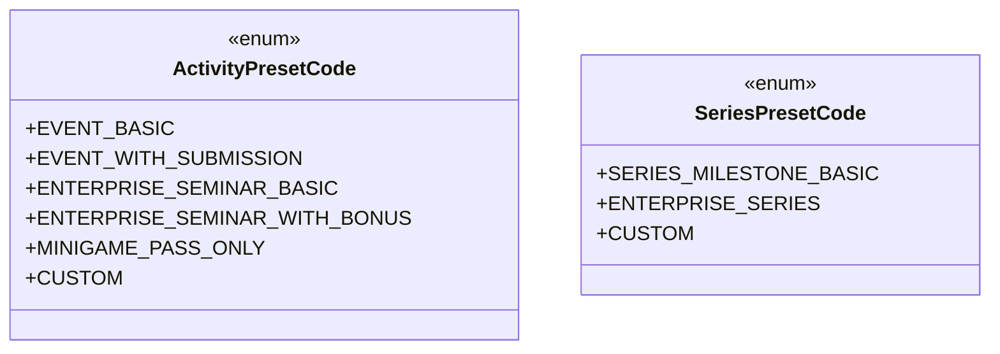

**Diagram sources**
- [ActivityPresetCode.java:3-11](file://src/main/java/vn/campuslife/enumeration/ActivityPresetCode.java#L3-L11)
- [SeriesPresetCode.java:3-8](file://src/main/java/vn/campuslife/enumeration/SeriesPresetCode.java#L3-L8)

**Section sources**
- [ActivityPresetCode.java:3-11](file://src/main/java/vn/campuslife/enumeration/ActivityPresetCode.java#L3-L11)
- [SeriesPresetCode.java:3-8](file://src/main/java/vn/campuslife/enumeration/SeriesPresetCode.java#L3-L8)

## Dependency Analysis
Enumerations are widely referenced across entities and services. Their usage patterns reveal dependencies between modules:

- Role influences access control and authorization decisions.
- ActivityType determines downstream processing for registrations, scoring, and reminders.
- ScoreType and ScoreRule* enums govern score computation and policy.
- RegistrationStatus and SubmissionStatus drive workflow transitions.
- NotificationType and ReminderCode coordinate communication and scheduling.

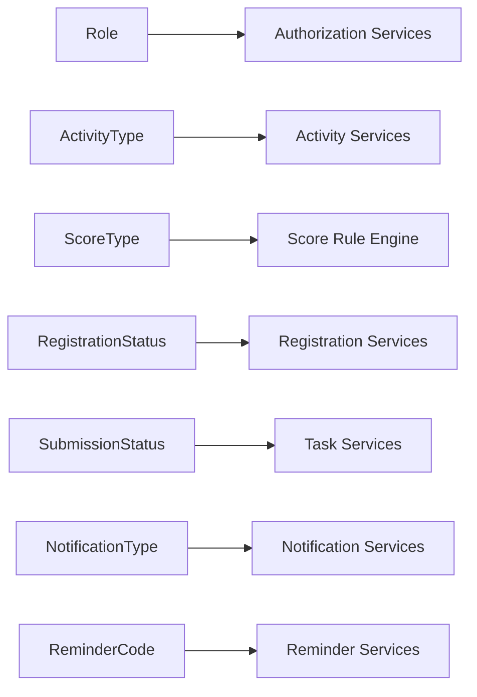

[No sources needed since this diagram shows conceptual relationships, not specific code structure]

## Performance Considerations
- Enum comparisons are O(1); they minimize branching overhead.
- Using enums reduces storage overhead compared to strings and improves index performance.
- Prefer enum-backed columns in MySQL for consistent ordering and efficient filtering.

## Troubleshooting Guide
Common issues and resolutions:
- Enum mismatch after schema updates: Ensure entity mappings align with current enum values; avoid removing values without migration plans.
- Unexpected sorting/ordering: Remember that enums sort by declaration order (ordinal) unless configured otherwise.
- Nullable enum fields: When nullable, handle null checks in queries and services to prevent unexpected defaults.

## Conclusion
Enumerations in CampusLife define consistent state machines and business semantics across roles, activities, scoring, registrations, tasks, notifications, and reminders. Their careful design enables reliable workflows, predictable behavior, and maintainable code. When extending or modifying enums, ensure backward compatibility and update dependent services and migrations accordingly.