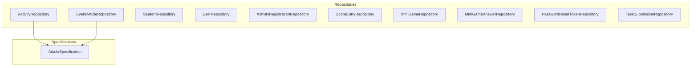
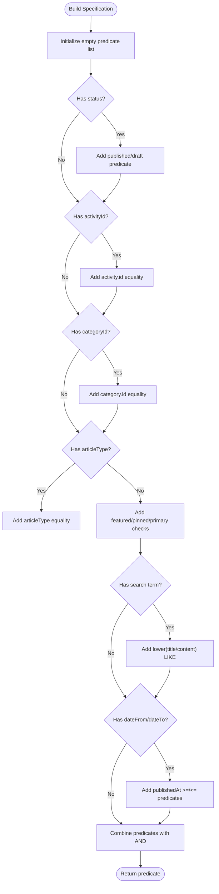
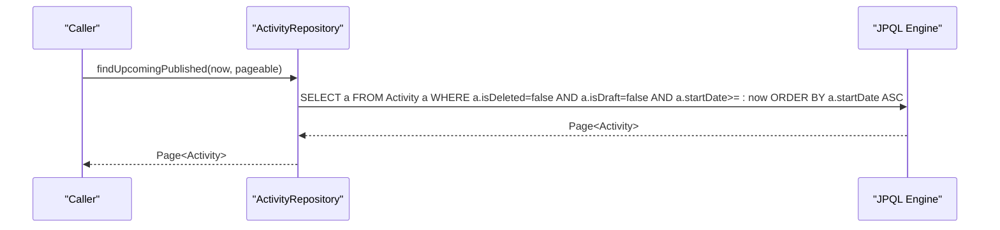
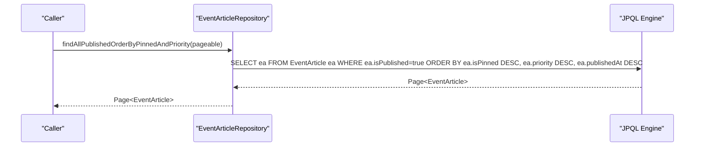
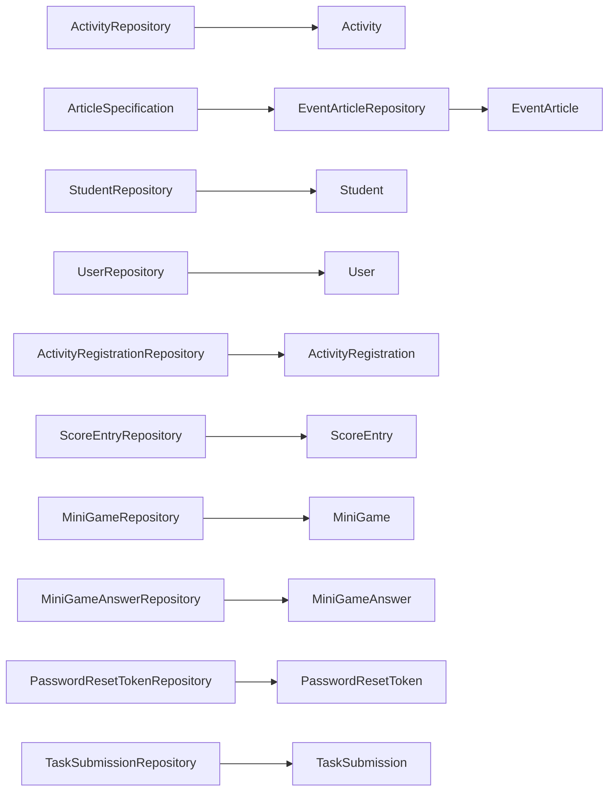

# Repository Layer & Data Access Patterns

<cite>
**Referenced Files in This Document**
- [JpaConfig.java](file://src/main/java/vn/campuslife/config/JpaConfig.java)
- [ArticleSpecification.java](file://src/main/java/vn/campuslife/repository/specification/ArticleSpecification.java)
- [ActivityRepository.java](file://src/main/java/vn/campuslife/repository/ActivityRepository.java)
- [EventArticleRepository.java](file://src/main/java/vn/campuslife/repository/EventArticleRepository.java)
- [StudentRepository.java](file://src/main/java/vn/campuslife/repository/StudentRepository.java)
- [UserRepository.java](file://src/main/java/vn/campuslife/repository/UserRepository.java)
- [ActivityRegistrationRepository.java](file://src/main/java/vn/campuslife/repository/ActivityRegistrationRepository.java)
- [ScoreEntryRepository.java](file://src/main/java/vn/campuslife/repository/ScoreEntryRepository.java)
- [MiniGameRepository.java](file://src/main/java/vn/campuslife/repository/MiniGameRepository.java)
- [MiniGameAnswerRepository.java](file://src/main/java/vn/campuslife/repository/MiniGameAnswerRepository.java)
- [PasswordResetTokenRepository.java](file://src/main/java/vn/campuslife/repository/PasswordResetTokenRepository.java)
- [TaskSubmissionRepository.java](file://src/main/java/vn/campuslife/repository/TaskSubmissionRepository.java)
</cite>

## Table of Contents
1. [Introduction](#introduction)
2. [Project Structure](#project-structure)
3. [Core Components](#core-components)
4. [Architecture Overview](#architecture-overview)
5. [Detailed Component Analysis](#detailed-component-analysis)
6. [Dependency Analysis](#dependency-analysis)
7. [Performance Considerations](#performance-considerations)
8. [Troubleshooting Guide](#troubleshooting-guide)
9. [Conclusion](#conclusion)

## Introduction
This document explains the repository layer and data access patterns in the CampusLife application. It covers Spring Data JPA repositories, custom method signatures, query derivation, JPQL usage, the specification pattern for dynamic filtering, pagination and sorting strategies, custom repository implementations, native query usage, batch operations, transaction management, optimistic locking via @Version, and performance optimization techniques. Examples include complex queries, projections, aggregate functions, and integration with Spring Data REST.

## Project Structure
The repository layer follows a conventional Spring Data JPA layout under the package vn.campuslife.repository. Repositories extend JpaRepository and often JpaSpecificationExecutor to support dynamic filtering. Some repositories define JPQL queries directly in annotations, while others rely on derived method names. Transaction management is configured centrally and applied at the service layer.

**Diagram sources**
- [ActivityRepository.java:19-184](file://src/main/java/vn/campuslife/repository/ActivityRepository.java#L19-L184)
- [EventArticleRepository.java:15-61](file://src/main/java/vn/campuslife/repository/EventArticleRepository.java#L15-L61)
- [StudentRepository.java:15-124](file://src/main/java/vn/campuslife/repository/StudentRepository.java#L15-L124)
- [UserRepository.java:11-20](file://src/main/java/vn/campuslife/repository/UserRepository.java#L11-L20)
- [ActivityRegistrationRepository.java:15-200](file://src/main/java/vn/campuslife/repository/ActivityRegistrationRepository.java#L15-L200)
- [ScoreEntryRepository.java:17-118](file://src/main/java/vn/campuslife/repository/ScoreEntryRepository.java#L17-L118)
- [MiniGameRepository.java:11-19](file://src/main/java/vn/campuslife/repository/MiniGameRepository.java#L11-L19)
- [MiniGameAnswerRepository.java:12-27](file://src/main/java/vn/campuslife/repository/MiniGameAnswerRepository.java#L12-L27)
- [PasswordResetTokenRepository.java:12-20](file://src/main/java/vn/campuslife/repository/PasswordResetTokenRepository.java#L12-L20)
- [TaskSubmissionRepository.java:13-52](file://src/main/java/vn/campuslife/repository/TaskSubmissionRepository.java#L13-L52)
- [ArticleSpecification.java:12-80](file://src/main/java/vn/campuslife/repository/specification/ArticleSpecification.java#L12-L80)

**Section sources**
- [JpaConfig.java:12-28](file://src/main/java/vn/campuslife/config/JpaConfig.java#L12-L28)

## Core Components
- JPA Auditing: Centralized auditing configuration enables automatic population of audit fields via AuditorAware.
- Specifications: Dynamic filtering for articles using a reusable ArticleSpecification utility.
- Repositories: Extensive use of derived method names and JPQL for complex queries, pagination, and aggregates.
- Batch Operations: Modifying queries for bulk deletions and cleanup tasks.
- Projections and Aggregates: Queries returning scalar sums, counts, and grouped breakdowns.

**Section sources**
- [JpaConfig.java:16-27](file://src/main/java/vn/campuslife/config/JpaConfig.java#L16-L27)
- [ArticleSpecification.java:14-78](file://src/main/java/vn/campuslife/repository/specification/ArticleSpecification.java#L14-L78)

## Architecture Overview
The repository layer integrates tightly with Spring Data JPA and Spring Data REST. Repositories expose domain-specific methods and leverage:
- Derived method names for simple filters and ordering.
- JPQL queries for complex joins, grouping, and computed selections.
- Specifications for runtime composition of predicates.
- Pagination and sorting via Pageable and Sort parameters.
- Modifying operations for batch updates/deletes.

```mermaid
classDiagram
class ActivityRepository {
+findByIsDeletedFalse()
+findByIdAndIsDeletedFalse(id)
+findByScoreTypeAndIsDeletedFalseOrderByStartDateAsc(scoreType)
+findInMonth(start,end)
+findForDepartment(deptId)
+findBySeriesIdAndIsDeletedFalse(seriesId)
+countBySeriesId(seriesId)
+findByCheckInCode(checkInCode)
+countByType(type)
+countByScoreType(scoreType)
+countByIsDraft(isDraft)
+countActivitiesInSeries()
+countStandaloneActivities()
+countByDepartmentId(departmentId)
+countByDateRange(startDate,endDate)
+findActivitiesInMonth(start,end)
+findOpenActivitiesForRecommendation(now)
+findUpcomingPublished(now,pageable)
+findOpenRegistrationPublished(now,pageable)
+findOngoingPublished(now,pageable)
+findPastPublished(now,pageable)
+findPublishedByScoreType(scoreType,pageable)
}
class EventArticleRepository {
+findBySlugAndIsPublishedTrue(slug)
+findByActivityId(activityId)
+findByActivityIdAndIsPublishedTrue(activityId)
+findByActivityIdAndIsPrimaryTrue(activityId)
+findByActivityId(activityId,pageable)
+findPublishedBySeriesId(seriesId)
+existsBySlug(slug)
+existsBySlugAndIdNot(slug,id)
+findAllPublishedOrderByPinnedAndPriority(pageable)
+findAllOrderByPinnedAndPriority(pageable)
+findFeaturedArticles()
+findByCategoryId(categoryId,pageable)
+findRelatedByCategoryId(excludeId,categoryId,pageable)
+searchArticles(keyword,pageable)
+countPublishedArticles()
+sumTotalViews()
}
class StudentRepository {
+findDepartmentIdByUsername(username)
+findByDepartmentIdInAndIsDeletedFalse(departmentIds)
+findByUserIdAndIsDeletedFalse(userId)
+findByUserUsernameAndIsDeletedFalse(username)
+findByIdAndIsDeletedFalse(id)
+findUserIdsByDepartmentId(departmentId)
+findUserIdsByClassId(classId)
+findByClassId(classId)
+findByIsDeletedFalse(pageable)
+findByIsDeletedFalse()
+findByFullNameContainingIgnoreCaseAndIsDeletedFalse(keyword,pageable)
+searchByFullNameOrStudentCode(keyword,pageable)
+findByStudentClassIsNullAndIsDeletedFalse(pageable)
+findByStudentClassDepartmentIdAndIsDeletedFalse(departmentId,pageable)
+findByStudentClassIdAndIsDeletedFalse(classId,pageable)
+findByDepartment_IdIn(departmentIds)
+countByDepartmentId(departmentId)
+countByClassId(classId)
+countAllActive()
+findInactiveStudents()
}
class UserRepository {
+findByUsername(username)
+findByEmail(email)
+findByUsernameAndIsDeletedFalse(username)
+findAllByRoleInAndIsDeletedFalse(roles)
}
class ActivityRegistrationRepository {
+findByStudentIdAndStudentIsDeletedFalse(studentId)
+findByActivityIdAndActivityIsDeletedFalse(activityId)
+findByActivityIdAndStudentId(activityId,studentId)
+findByStatusAndActivityIsDeletedFalse(status)
+findByActivityIdAndStatus(activityId,status)
+existsByActivityIdAndStudentId(activityId,studentId)
+countByActivityId(activityId)
+countByActivityIdAndStatus(activityId,status)
+findByRegisteredDateBetween(startDate,endDate)
+findUpcomingRegistrations(today,nextWeek)
+existsByTicketCode(ticketCode)
+findByStudentIdAndStatus(studentId,status)
+findByTicketCode(ticketCode)
+findApprovedRegistrationsWithoutParticipation()
+countByDateRange(startDate,endDate)
+findTopActivitiesByRegistrations(pageable)
+countByStudentId(studentId)
+existsBySeriesIdAndStudentId(seriesId,studentId)
+findBySeriesId(seriesId)
+findBySeriesIdAndStudentId(seriesId,studentId)
+findListByStudentIdAndStatus(studentId,status)
+search(keyword,status)
+findByStudentIdAndStatusInForRecommendation(studentId,statuses)
+findStudentIdsByActivityId(activityId)
}
class ScoreEntryRepository {
+findByStudentIdAndSourceTypeAndSourceIdAndRuleIdAndStatus(...)
+findBySourceTypeAndSourceIdAndStatus(...)
+sumPointsByStudentAndSemesterAndScoreTypeAndStatus(...)
+findByStudentIdAndSemesterIdAndStatusOrderByCreatedAtAsc(...)
+findByStudentIdAndSemesterIdAndScoreTypeAndStatusOrderByCreatedAtAsc(...)
+findWithActivityByStudentAndSemester(...,pageable)
+findWithActivityByStudentAndSemesterAndScoreType(...,pageable)
+sumPointsBeforeCutoff(...)
+sumPointsBeforeCutoffWithScoreType(...)
+findByStudentAndSemesterAndDateRange(...)
+findByStudentAndSemesterAndReasonKeyword(...)
+sumPointsBySourceType(...)
+sumPointsBySourceTypeForStudent(...)
}
class MiniGameRepository {
+findByActivityId(activityId)
}
class MiniGameAnswerRepository {
+findByAttemptId(attemptId)
+deleteByQuizId(quizId)
}
class PasswordResetTokenRepository {
+findByTokenAndUsedFalse(token)
+findByUserIdAndUsedFalse(userId)
+deleteExpiredTokens(now)
}
class TaskSubmissionRepository {
+findByTaskIdAndIsDeletedFalseOrderBySubmittedAtDesc(taskId)
+findByStudentIdAndIsDeletedFalseOrderBySubmittedAtDesc(studentId)
+findByTaskIdAndStudentIdAndIsDeletedFalse(taskId,studentId)
+findByStatusAndIsDeletedFalseOrderBySubmittedAtDesc(status)
+findLatestByTaskAndStudent(taskId,studentId)
+findAllByTaskIdOrderBySubmittedAtDesc(taskId)
+findAllByStudentIdOrderBySubmittedAtDesc(studentId)
+existsByActivityAndStudentAndStatus(activityId,studentId,status)
+findByActivityAndStudentAndStatusOrderByLatest(activityId,studentId,status)
}
class ArticleSpecification {
+filterArticles(status,activityId,categoryId,articleType,featured,pinned,primary,search,dateFrom,dateTo)
}
ActivityRepository --> ArticleSpecification : "uses"
EventArticleRepository --> ArticleSpecification : "uses"
```

**Diagram sources**
- [ActivityRepository.java:19-184](file://src/main/java/vn/campuslife/repository/ActivityRepository.java#L19-L184)
- [EventArticleRepository.java:15-61](file://src/main/java/vn/campuslife/repository/EventArticleRepository.java#L15-L61)
- [StudentRepository.java:15-124](file://src/main/java/vn/campuslife/repository/StudentRepository.java#L15-L124)
- [UserRepository.java:11-20](file://src/main/java/vn/campuslife/repository/UserRepository.java#L11-L20)
- [ActivityRegistrationRepository.java:15-200](file://src/main/java/vn/campuslife/repository/ActivityRegistrationRepository.java#L15-L200)
- [ScoreEntryRepository.java:17-118](file://src/main/java/vn/campuslife/repository/ScoreEntryRepository.java#L17-L118)
- [MiniGameRepository.java:11-19](file://src/main/java/vn/campuslife/repository/MiniGameRepository.java#L11-L19)
- [MiniGameAnswerRepository.java:12-27](file://src/main/java/vn/campuslife/repository/MiniGameAnswerRepository.java#L12-L27)
- [PasswordResetTokenRepository.java:12-20](file://src/main/java/vn/campuslife/repository/PasswordResetTokenRepository.java#L12-L20)
- [TaskSubmissionRepository.java:13-52](file://src/main/java/vn/campuslife/repository/TaskSubmissionRepository.java#L13-L52)
- [ArticleSpecification.java:12-80](file://src/main/java/vn/campuslife/repository/specification/ArticleSpecification.java#L12-L80)

## Detailed Component Analysis

### JPA Auditing and Application Configuration
- Centralized auditing via @EnableJpaAuditing and AuditorAware implementation.
- Provides current principal name or fallback for audit fields.

**Section sources**
- [JpaConfig.java:12-28](file://src/main/java/vn/campuslife/config/JpaConfig.java#L12-L28)

### Specification Pattern for Dynamic Filtering
- ArticleSpecification builds dynamic predicates for status, activity/category relations, type flags, free-text search, and date ranges.
- Predicates are combined with AND/OR logic and applied to EventArticle queries.

**Diagram sources**
- [ArticleSpecification.java:26-78](file://src/main/java/vn/campuslife/repository/specification/ArticleSpecification.java#L26-L78)

**Section sources**
- [ArticleSpecification.java:14-78](file://src/main/java/vn/campuslife/repository/specification/ArticleSpecification.java#L14-L78)

### ActivityRepository: Query Derivation, JPQL, and Pagination
- Derived methods: findByIsDeletedFalse, findByIdAndIsDeletedFalse, orderBy clauses.
- JPQL queries: month-range selection, department-scoped activities, series counts, open/ongoing/past published activities, recommendation filters, and score-type scoped lists.
- Pagination: Pageable applied to upcoming/open registration/ongoing/past published queries.

**Diagram sources**
- [ActivityRepository.java:141-141](file://src/main/java/vn/campuslife/repository/ActivityRepository.java#L141-L141)

**Section sources**
- [ActivityRepository.java:23-184](file://src/main/java/vn/campuslife/repository/ActivityRepository.java#L23-L184)

### EventArticleRepository: Dynamic Filtering, Sorting, and Aggregation
- Slug-based lookup, published vs. all variants, series-scoped retrieval, pinned/priority ordering, category filtering, related articles, search, and aggregate counts/views.
- Uses countQuery for accurate Page counting with complex ORDER BY.

**Diagram sources**
- [EventArticleRepository.java:36-41](file://src/main/java/vn/campuslife/repository/EventArticleRepository.java#L36-L41)

**Section sources**
- [EventArticleRepository.java:17-61](file://src/main/java/vn/campuslife/repository/EventArticleRepository.java#L17-L61)

### StudentRepository: Derived Methods, Projections, and Aggregates
- Derived methods for username/userId/class/department filters.
- Projection-like queries returning department/class user IDs.
- Aggregates: count by department/class, total active students, inactive students via NOT EXISTS.

**Section sources**
- [StudentRepository.java:18-124](file://src/main/java/vn/campuslife/repository/StudentRepository.java#L18-L124)

### UserRepository: Simple Derived Methods
- Username/email lookups with soft-delete awareness.

**Section sources**
- [UserRepository.java:13-20](file://src/main/java/vn/campuslife/repository/UserRepository.java#L13-L20)

### ActivityRegistrationRepository: Complex Queries, Projections, and Aggregates
- Multi-entity joins, derived and JPQL queries for student/activity/status filters, existence checks, date-range counts, top activities by registrations, and recommendation-friendly queries.
- Returns Object[] projections for top-N analytics.

**Section sources**
- [ActivityRegistrationRepository.java:21-200](file://src/main/java/vn/campuslife/repository/ActivityRegistrationRepository.java#L21-L200)

### ScoreEntryRepository: Aggregates, Running Totals, and Grouped Breakdowns
- Summations by student/semester/scoreType/status with cutoff-aware running totals.
- Filtered lists by date range and reason keyword.
- Grouped sums by source type for reporting.

**Section sources**
- [ScoreEntryRepository.java:20-118](file://src/main/java/vn/campuslife/repository/ScoreEntryRepository.java#L20-L118)

### MiniGameRepository and MiniGameAnswerRepository: JPQL and Modifying Operations
- Lookup by activity ID.
- Deleting answers by quiz ID using @Modifying.

**Section sources**
- [MiniGameRepository.java:14-18](file://src/main/java/vn/campuslife/repository/MiniGameRepository.java#L14-L18)
- [MiniGameAnswerRepository.java:24-26](file://src/main/java/vn/campuslife/repository/MiniGameAnswerRepository.java#L24-L26)

### PasswordResetTokenRepository: Cleanup via Modifying Queries
- Delete expired tokens using @Modifying with positional parameters.

**Section sources**
- [PasswordResetTokenRepository.java:18-20](file://src/main/java/vn/campuslife/repository/PasswordResetTokenRepository.java#L18-L20)

### TaskSubmissionRepository: Derived and JPQL Queries
- Latest submission retrieval, existence checks by activity/student/status, ordered lists by submission/grading timestamps.

**Section sources**
- [TaskSubmissionRepository.java:16-52](file://src/main/java/vn/campuslife/repository/TaskSubmissionRepository.java#L16-L52)

## Dependency Analysis
- Repositories depend on JPA entities and enumerations.
- Specifications encapsulate shared filtering logic for EventArticle and related queries.
- Services orchestrate transactions; repositories focus on persistence.

**Diagram sources**
- [ActivityRepository.java:19-184](file://src/main/java/vn/campuslife/repository/ActivityRepository.java#L19-L184)
- [EventArticleRepository.java:15-61](file://src/main/java/vn/campuslife/repository/EventArticleRepository.java#L15-L61)
- [StudentRepository.java:15-124](file://src/main/java/vn/campuslife/repository/StudentRepository.java#L15-L124)
- [UserRepository.java:11-20](file://src/main/java/vn/campuslife/repository/UserRepository.java#L11-L20)
- [ActivityRegistrationRepository.java:15-200](file://src/main/java/vn/campuslife/repository/ActivityRegistrationRepository.java#L15-L200)
- [ScoreEntryRepository.java:17-118](file://src/main/java/vn/campuslife/repository/ScoreEntryRepository.java#L17-L118)
- [MiniGameRepository.java:11-19](file://src/main/java/vn/campuslife/repository/MiniGameRepository.java#L11-L19)
- [MiniGameAnswerRepository.java:12-27](file://src/main/java/vn/campuslife/repository/MiniGameAnswerRepository.java#L12-L27)
- [PasswordResetTokenRepository.java:12-20](file://src/main/java/vn/campuslife/repository/PasswordResetTokenRepository.java#L12-L20)
- [TaskSubmissionRepository.java:13-52](file://src/main/java/vn/campuslife/repository/TaskSubmissionRepository.java#L13-L52)
- [ArticleSpecification.java:12-80](file://src/main/java/vn/campuslife/repository/specification/ArticleSpecification.java#L12-L80)

## Performance Considerations
- Prefer derived method names for simple filters to avoid JPQL overhead.
- Use Pageable with selective fetch (LEFT JOIN FETCH only when needed) to prevent N+1 issues.
- Leverage index-friendly predicates (equality, range scans) in specifications.
- Use countQuery in Page queries to ensure accurate total counts with complex ORDER BY.
- Avoid SELECT *; use DTO/projection queries for read-only views.
- Use @Modifying for bulk deletes/cleanup to reduce round trips.
- Apply @Transactional at service boundaries to minimize session lifetime and ensure consistency.

[No sources needed since this section provides general guidance]

## Troubleshooting Guide
- Dynamic filtering returns unexpected results: verify predicate combination and null-handling in ArticleSpecification.
- Pagination counts off: ensure countQuery is present for Page queries with complex ORDER BY.
- Aggregate queries missing data: confirm status flags and isDeleted filters are consistently applied.
- Batch operations not taking effect: verify @Modifying and transactional context.

**Section sources**
- [ArticleSpecification.java:26-78](file://src/main/java/vn/campuslife/repository/specification/ArticleSpecification.java#L26-L78)
- [EventArticleRepository.java:36-41](file://src/main/java/vn/campuslife/repository/EventArticleRepository.java#L36-L41)
- [MiniGameAnswerRepository.java:24-26](file://src/main/java/vn/campuslife/repository/MiniGameAnswerRepository.java#L24-L26)
- [PasswordResetTokenRepository.java:18-20](file://src/main/java/vn/campuslife/repository/PasswordResetTokenRepository.java#L18-L20)

## Conclusion
The repository layer leverages Spring Data JPA’s strengths: derived method names for simplicity, JPQL for complex analytics, and specifications for flexible filtering. Combined with centralized auditing, transactional services, and careful pagination/counting, the system achieves maintainable, efficient data access patterns suitable for a feature-rich campus management platform.