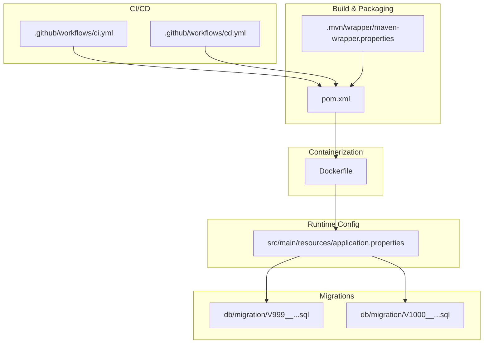
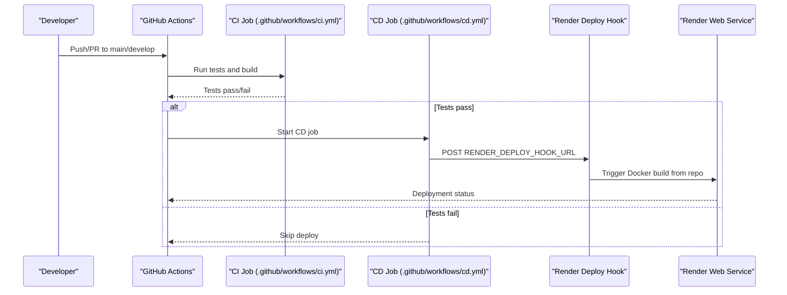
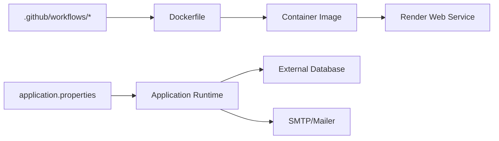

# Deployment & Operations

<cite>
**Referenced Files in This Document**
- [Dockerfile](file://Dockerfile)
- [.github/workflows/ci.yml](file://.github/workflows/ci.yml)
- [.github/workflows/cd.yml](file://.github/workflows/cd.yml)
- [src/main/resources/application.properties](file://src/main/resources/application.properties)
- [pom.xml](file://pom.xml)
- [docs/ci-cd-render-ghcr.md](file://docs/ci-cd-render-ghcr.md)
- [.mvn/wrapper/maven-wrapper.properties](file://.mvn/wrapper/maven-wrapper.properties)
- [.gitignore](file://.gitignore)
- [src/main/java/vn/campuslife/CampusLifeApplication.java](file://src/main/java/vn/campuslife/CampusLifeApplication.java)
- [db/migration/V999__activity_datetime_and_flags.sql](file://db/migration/V999__activity_datetime_and_flags.sql)
- [db/migration/V1000__unique_activity_registration.sql](file://db/migration/V1000__unique_activity_registration.sql)
</cite>

## Table of Contents
1. [Introduction](#introduction)
2. [Project Structure](#project-structure)
3. [Core Components](#core-components)
4. [Architecture Overview](#architecture-overview)
5. [Detailed Component Analysis](#detailed-component-analysis)
6. [Dependency Analysis](#dependency-analysis)
7. [Performance Considerations](#performance-considerations)
8. [Troubleshooting Guide](#troubleshooting-guide)
9. [Conclusion](#conclusion)
10. [Appendices](#appendices)

## Introduction
This document provides comprehensive deployment and operations guidance for the CampusLife backend application. It covers containerization with Docker, CI/CD pipelines using GitHub Actions, environment management, production deployment on Render, database migration strategies, monitoring approaches, troubleshooting, scaling considerations, Maven build and artifact management, release procedures, and automated testing integration.

## Project Structure
The repository follows a standard Spring Boot layout with Maven packaging, GitHub Actions workflows for CI/CD, and database migration scripts managed via Flyway-style SQL files. Key operational artifacts include:
- Containerization: Dockerfile defines a two-stage build and runtime image.
- CI/CD: Separate workflows for continuous integration and continuous deployment.
- Environment configuration: Spring Boot externalized configuration via environment variables.
- Database migrations: SQL scripts under db/migration prefixed with version numbers.
- Maven wrapper and build configuration: pom.xml and .mvn/wrapper.

**Diagram sources**
- [Dockerfile](file://Dockerfile)
- [.github/workflows/ci.yml](file://.github/workflows/ci.yml)
- [.github/workflows/cd.yml](file://.github/workflows/cd.yml)
- [pom.xml](file://pom.xml)
- [.mvn/wrapper/maven-wrapper.properties](file://.mvn/wrapper/maven-wrapper.properties)
- [src/main/resources/application.properties](file://src/main/resources/application.properties)
- [db/migration/V999__activity_datetime_and_flags.sql](file://db/migration/V999__activity_datetime_and_flags.sql)
- [db/migration/V1000__unique_activity_registration.sql](file://db/migration/V1000__unique_activity_registration.sql)

**Section sources**
- [Dockerfile](file://Dockerfile)
- [.github/workflows/ci.yml](file://.github/workflows/ci.yml)
- [.github/workflows/cd.yml](file://.github/workflows/cd.yml)
- [pom.xml](file://pom.xml)
- [.mvn/wrapper/maven-wrapper.properties](file://.mvn/wrapper/maven-wrapper.properties)
- [src/main/resources/application.properties](file://src/main/resources/application.properties)
- [db/migration/V999__activity_datetime_and_flags.sql](file://db/migration/V999__activity_datetime_and_flags.sql)
- [db/migration/V1000__unique_activity_registration.sql](file://db/migration/V1000__unique_activity_registration.sql)

## Core Components
- Containerization: Multi-stage Docker build produces a minimal JRE runtime image with prebuilt JAR and required upload directories.
- CI/CD: CI workflow validates builds and tests; CD workflow triggers Render deployment via a webhook after successful tests.
- Environment Management: Spring Boot externalizes configuration via environment variables for database, mail, CORS, JWT, and application URLs.
- Database Migrations: SQL-based migrations enable deterministic schema evolution.
- Maven Build: Spring Boot Maven plugin packages the application; Maven wrapper ensures consistent builds.

**Section sources**
- [Dockerfile](file://Dockerfile)
- [.github/workflows/ci.yml](file://.github/workflows/ci.yml)
- [.github/workflows/cd.yml](file://.github/workflows/cd.yml)
- [src/main/resources/application.properties](file://src/main/resources/application.properties)
- [pom.xml](file://pom.xml)
- [docs/ci-cd-render-ghcr.md](file://docs/ci-cd-render-ghcr.md)

## Architecture Overview
The deployment pipeline integrates GitHub Actions with Render’s Docker-based deployment. CI validates code quality and builds artifacts; CD triggers a Render deploy hook to rebuild and redeploy the service using the repository’s Dockerfile.

**Diagram sources**
- [.github/workflows/ci.yml](file://.github/workflows/ci.yml)
- [.github/workflows/cd.yml](file://.github/workflows/cd.yml)
- [docs/ci-cd-render-ghcr.md](file://docs/ci-cd-render-ghcr.md)

## Detailed Component Analysis

### Docker Containerization
- Multi-stage build: Maven base image compiles dependencies and packages the application; a second stage copies the JAR into a lightweight JRE runtime.
- Working directory and JAR placement: Ensures predictable runtime behavior.
- Upload directories: Creates required upload paths at build time to avoid permission or missing directory issues at runtime.
- Port exposure: Exposes 8080; Render sets the PORT environment variable dynamically.
- Optional health checks: Commented block demonstrates how to add a Docker-level health check using curl.

Operational implications:
- Use Render Disk volumes if persistent storage is required; the Dockerfile includes a commented instruction to mount a volume at /app/uploads.
- Keep the JRE stage minimal to reduce attack surface and improve cold start performance.

**Section sources**
- [Dockerfile](file://Dockerfile)

### CI/CD Pipeline (GitHub Actions)
- CI workflow:
  - Triggers on pushes and pull requests to main/develop.
  - Sets up Java 21 with Maven caching, executes tests, and packages the application.
- CD workflow:
  - Triggers on pushes to main and manual dispatch.
  - Runs tests, then posts to the Render deploy hook URL stored in GitHub secrets to initiate deployment.

Best practices:
- Keep secrets scoped; RENDER_DEPLOY_HOOK_URL is required for CD.
- Disable Render’s automatic deployment and rely on the deploy hook to gate deployments.

**Section sources**
- [.github/workflows/ci.yml](file://.github/workflows/ci.yml)
- [.github/workflows/cd.yml](file://.github/workflows/cd.yml)
- [docs/ci-cd-render-ghcr.md](file://docs/ci-cd-render-ghcr.md)

### Environment Management and Configuration
- Port binding: Uses ${PORT} with a default of 8080.
- Database connectivity: Externalized via DATABASE_URL, DATABASE_USERNAME, DATABASE_PASSWORD.
- Mail configuration: SMTP host, port, username, and password are externalized.
- Application URLs: Base URL and frontend URL are configurable for dev/prod.
- Uploads: UPLOAD_DIR and subpaths for activities, submissions, and attachments are configurable.
- CORS: Origins, methods, headers, and credential allowance are configurable.
- JWT: Secret and expiration are externalized.
- Quartz scheduling: JDBC job store enabled with optional schema initialization.

Operational guidance:
- Always override defaults with environment variables in production.
- Store sensitive values (JWT_SECRET, MAIL_PASSWORD, DB credentials) in Render secrets.
- Align CORS origins with the frontend domain.

**Section sources**
- [src/main/resources/application.properties](file://src/main/resources/application.properties)
- [docs/ci-cd-render-ghcr.md](file://docs/ci-cd-render-ghcr.md)

### Database Migration Strategies
- Versioned SQL migrations: Files named with Flyway-like prefixes under db/migration.
- Typical migration pattern:
  - Normalize datatypes and add flags.
  - Enforce uniqueness constraints after deduplication.
- Execution strategy:
  - Spring Boot’s JPA DDL auto mode is configured to update; combined with Flyway-style scripts, migrations are applied consistently.
  - For production, consider switching to a dedicated migration tool or enforcing strict schema management.

Recommended practices:
- Review and test migrations in staging before applying to production.
- Use idempotent scripts and maintain rollback plans where feasible.

**Section sources**
- [db/migration/V999__activity_datetime_and_flags.sql](file://db/migration/V999__activity_datetime_and_flags.sql)
- [db/migration/V1000__unique_activity_registration.sql](file://db/migration/V1000__unique_activity_registration.sql)
- [src/main/resources/application.properties](file://src/main/resources/application.properties)

### Maven Build and Artifact Management
- Java and Spring Boot versions: Java 21 with Spring Boot 3.5.5.
- Plugins:
  - Compiler plugin configured for Java 21 with Lombok annotation processing.
  - Spring Boot Maven Plugin for packaging.
- Wrapper:
  - Maven wrapper ensures consistent builds across environments.

Release procedures:
- Tag releases in Git and push to trigger CD.
- Verify artifact integrity post-build in CI.

**Section sources**
- [pom.xml](file://pom.xml)
- [.mvn/wrapper/maven-wrapper.properties](file://.mvn/wrapper/maven-wrapper.properties)

### Monitoring and Observability
- Health endpoint: Exposed by Spring Boot; Render handles health checks automatically.
- Optional Docker-level health checks: The Dockerfile includes commented instructions to add a curl-based health check against the /api/health endpoint.
- Logging: SQL and binder logging levels are configurable via environment variables.

Recommendations:
- Implement a dedicated /health endpoint if not present and integrate with Render’s health checking.
- Centralize logs and configure alerting thresholds for error rates and latency.

**Section sources**
- [Dockerfile](file://Dockerfile)
- [src/main/resources/application.properties](file://src/main/resources/application.properties)

### Production Deployment on Render
- Build type: Docker (Render builds from the repository’s Dockerfile).
- Auto deploy: Recommended to disable and use the deploy hook to ensure only passing CI builds are deployed.
- Required environment variables:
  - DATABASE_URL, DATABASE_USERNAME, DATABASE_PASSWORD
  - JWT_SECRET
  - APP_BASE_URL, FRONTEND_URL
  - CORS_ALLOWED_ORIGINS
  - Optional email settings: MAIL_HOST, MAIL_PORT, MAIL_USERNAME, MAIL_PASSWORD

Integration:
- The CD workflow posts to RENDER_DEPLOY_HOOK_URL to trigger deployment.

**Section sources**
- [docs/ci-cd-render-ghcr.md](file://docs/ci-cd-render-ghcr.md)
- [.github/workflows/cd.yml](file://.github/workflows/cd.yml)

### Scaling Considerations
- Horizontal scaling: Stateless application; scale replicas behind Render’s load balancer.
- Stateful concerns: Persistent uploads require Render Disk or equivalent persistent volumes.
- Database: Ensure the external database can handle increased load; consider read replicas for reporting queries.
- JVM tuning: Configure heap and GC settings via environment variables if needed.

[No sources needed since this section provides general guidance]

### Operational Best Practices
- Secrets management: Never commit secrets; use Render secrets and GitHub Actions secrets.
- Immutable infrastructure: Rely on container images built from the Dockerfile.
- Zero-downtime deployments: Use rolling updates and health checks.
- Backup and disaster recovery: Regularly back up the database and application uploads.

[No sources needed since this section provides general guidance]

## Dependency Analysis
The deployment pipeline depends on GitHub Actions, Render, and the repository’s Dockerfile and configuration files. The application depends on environment variables for configuration and on the database for persistence.

**Diagram sources**
- [.github/workflows/ci.yml](file://.github/workflows/ci.yml)
- [.github/workflows/cd.yml](file://.github/workflows/cd.yml)
- [Dockerfile](file://Dockerfile)
- [src/main/resources/application.properties](file://src/main/resources/application.properties)

**Section sources**
- [.github/workflows/ci.yml](file://.github/workflows/ci.yml)
- [.github/workflows/cd.yml](file://.github/workflows/cd.yml)
- [Dockerfile](file://Dockerfile)
- [src/main/resources/application.properties](file://src/main/resources/application.properties)

## Performance Considerations
- Container startup: Multi-stage build reduces image size and improves cold start.
- JVM: Use appropriate JVM options for production workloads; monitor GC and memory usage.
- Database: Optimize queries and indexes; batch operations where possible.
- Uploads: Persist uploads to a durable filesystem or cloud storage to avoid I/O bottlenecks.

[No sources needed since this section provides general guidance]

## Troubleshooting Guide
Common issues and resolutions:
- Build failures in CI:
  - Ensure Java 21 is selected and Maven wrapper is executable.
  - Confirm tests pass locally before pushing.
- Deployment failures:
  - Verify RENDER_DEPLOY_HOOK_URL secret is set.
  - Check Render logs for Docker build errors.
- Database connection errors:
  - Confirm DATABASE_URL, DATABASE_USERNAME, and DATABASE_PASSWORD are correct.
  - Validate network access from Render to the database endpoint.
- CORS or frontend integration issues:
  - Ensure CORS_ALLOWED_ORIGINS matches the frontend origin.
- Upload directory problems:
  - Confirm uploads directory exists and is writable; consider enabling Render Disk if needed.
- Health check failures:
  - Implement or verify a /api/health endpoint; confirm it responds under load.

**Section sources**
- [.github/workflows/ci.yml](file://.github/workflows/ci.yml)
- [.github/workflows/cd.yml](file://.github/workflows/cd.yml)
- [src/main/resources/application.properties](file://src/main/resources/application.properties)
- [Dockerfile](file://Dockerfile)

## Conclusion
CampusLife’s deployment and operations model leverages a robust CI/CD pipeline integrated with Render’s Docker-based deployment. By externalizing configuration via environment variables, maintaining deterministic database migrations, and adopting containerization best practices, the system achieves reliable, scalable, and secure operations. Adhering to the recommended practices and troubleshooting steps will help ensure smooth deployments and ongoing reliability.

[No sources needed since this section summarizes without analyzing specific files]

## Appendices

### Appendix A: Environment Variables Reference
- Required for deployment:
  - DATABASE_URL, DATABASE_USERNAME, DATABASE_PASSWORD
  - JWT_SECRET
  - APP_BASE_URL, FRONTEND_URL
  - CORS_ALLOWED_ORIGINS
- Optional:
  - MAIL_HOST, MAIL_PORT, MAIL_USERNAME, MAIL_PASSWORD
  - UPLOAD_DIR and subpaths for activities, submissions, attachments

**Section sources**
- [src/main/resources/application.properties](file://src/main/resources/application.properties)
- [docs/ci-cd-render-ghcr.md](file://docs/ci-cd-render-ghcr.md)

### Appendix B: CI/CD Workflow Summary
- CI:
  - Runs on pull_request and push to main/develop.
  - Executes tests and packages the application.
- CD:
  - Runs on push to main and manual dispatch.
  - Executes tests, then triggers Render deploy hook.

**Section sources**
- [.github/workflows/ci.yml](file://.github/workflows/ci.yml)
- [.github/workflows/cd.yml](file://.github/workflows/cd.yml)

### Appendix C: Maven Build Notes
- Java 21, Spring Boot 3.5.5.
- Lombok support via annotation processor.
- Spring Boot Maven Plugin for packaging.

**Section sources**
- [pom.xml](file://pom.xml)